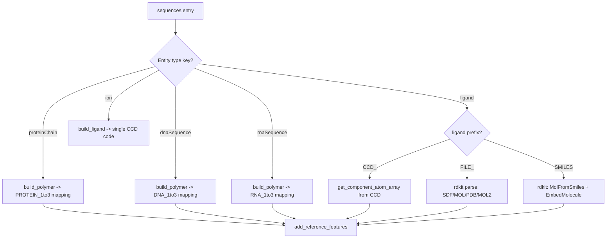

---
slug:4-input-json-format
blog_type:normal
---


Protenix 采用结构化的 JSON 格式来定义用于结构预测的分子复合物。该格式受 AlphaFold Server 启发，并进行了多项实用扩展。你可以通过它指定从单链蛋白质到包含共价键、配体、离子、修饰、MSA 路径、模板以及结构约束的多链组装体等各类结构。本文档基于实际的解析代码和已验证的示例文件，为每一个字段、实体类型和可选配置提供完整的参考说明。

---

## 顶层结构

输入的 JSON 文件是一个**字典列表**，其中每个字典代表一个推理作业。即使只对单个复合物进行建模，顶层也必须始终是 JSON 数组：

```json
[
  {
    "name": "My Complex",
    "sequences": [ ... ],
    "covalent_bonds": [ ... ],   // 可选
    "constraint": { ... }        // 可选
  }
]
```

每个作业字典包含以下键：

| 键 | 类型 | 必填 | 描述 |
|---|---|---|---|
| `name` | `string` | **是** | 推理作业的标识符。用作输出目录名。 |
| `sequences` | `list[dict]` | **是** | 实体描述符（蛋白质、DNA、RNA、配体、离子）的有序列表。 |
| `covalent_bonds` | `list[dict]` | 否 | 定义实体间的共价键。 |
| `constraint` | `dict` | 否 | 通过接触或口袋约束提供结构指导。 |
| `modelSeeds` | `list[int]` | 否 | 用于可复现采样的随机种子。 |
| `assembly_id` | `string` | 否 | 生物组装体的标识符。 |

**`sequences` 中条目的顺序非常重要**：它决定了 `covalent_bonds` 和 `constraint` 部分使用的实体编号（从 1 开始）。在推理阶段，`InferenceDataset.__getitem__` 会遍历该列表，并将每个字典传递给 `process_one`，后者随后通过 `SampleDictToFeatures` 提取特征。

来源：[infer_json_format.md](docs/infer_json_format.md#L10-L28), [infer_dataloader.py](protenix/data/inference/infer_dataloader.py#L276-L294)

---

## `sequences` 中的实体类型

Protenix 支持五种实体类型。JSON 解析器中的 `build_polymer` 和 `build_ligand` 函数会根据实体类型的键进行分发，以构建相应的 `AtomArray`：



来源：[json_parser.py](protenix/data/inference/json_parser.py#L316-L606)

### proteinChain

```json
{
  "proteinChain": {
    "sequence": "PREACHINGS",
    "count": 1,
    "modifications": [
      {"ptmType": "CCD_HY3", "ptmPosition": 1}
    ],
    "pairedMsaPath": "/abs/path/pairing.a3m",
    "unpairedMsaPath": "/abs/path/non_pairing.a3m",
    "templatesPath": "/abs/path/hmmsearch.a3m"
  }
}
```

| 字段 | 类型 | 必填 | 描述 |
|---|---|---|---|
| `sequence` | `string` | **是** | 蛋白质序列。仅允许包含 20 种标准氨基酸和 `X` (UNK)。 |
| `count` | `int` | **是** | 拷贝数（对称链或相同链）。 |
| `id` | `list[string]` | 否 | 手动指定链 ID。长度必须等于 `count`。示例：`"id": ["A", "B"]`。 |
| `modifications` | `list[dict]` | 否 | 翻译后修饰。每项包含 `ptmType`（带 CCD 前缀的代码）和 `ptmPosition`（从 1 开始的残基索引）。 |
| `pairedMsaPath` | `string` | 否 | 配对 MSA 文件（`.a3m`）的路径。**推荐使用绝对路径。** |
| `unpairedMsaPath` | `string` | 否 | 非配对 MSA 文件（`.a3m`）的路径。**推荐使用绝对路径。** |
| `templatesPath` | `string` | 否 | 模板命中文件（`.a3m` 或 `.hhr`）的路径。**推荐使用绝对路径。** |

在内部实现中，解析器会通过 `PROTEIN_1to3` 将每个氨基酸字母映射为其 CCD 代码，并通过替换指定位置的 CCD 代码来应用修饰。例如，在 `ptmPosition: 1` 处设置 `ptmType: "CCD_HY3"` 会将第一个残基替换为 CCD 代码为 `HY3` 的残基。

<CgxTip>旧版的 `msa` 字段（例如：`"msa": {"precomputed_msa_dir": "...", "pairing_db": "uniref100"}`）虽然仍可被解析，但已弃用。为了保持未来的兼容性，请迁移至 `pairedMsaPath` 和 `unpairedMsaPath`。</CgxTip>

来源：[infer_json_format.md](docs/infer_json_format.md#L38-L74), [json_parser.py](protenix/data/inference/json_parser.py#L316-L364), [example.json](examples/example.json#L4-L12)

### dnaSequence

```json
{
  "dnaSequence": {
    "sequence": "GATTACA",
    "modifications": [
      {"modificationType": "CCD_6OG", "basePosition": 1}
    ],
    "count": 1
  }
}
```

| 字段 | 类型 | 必填 | 描述 |
|---|---|---|---|
| `sequence` | `string` | **是** | 单链 DNA 序列。仅允许 `A`、`T`、`G`、`C` 和 `N`。 |
| `count` | `int` | **是** | 拷贝数。 |
| `id` | `list[string]` | 否 | 手动指定链 ID。 |
| `modifications` | `list[dict]` | 否 | 化学修饰：`modificationType`（带 CCD 前缀）和 `basePosition`（从 1 开始）。 |

若要建模**双链 DNA**，请添加两个独立的 `dnaSequence` 条目——每条链一个。

来源：[infer_json_format.md](docs/infer_json_format.md#L76-L112), [example.json](examples/example.json#L15-L27)

### rnaSequence

```json
{
  "rnaSequence": {
    "sequence": "GUAC",
    "modifications": [
      {"modificationType": "CCD_2MG", "basePosition": 1}
    ],
    "unpairedMsaPath": "/path/to/rna_msa.a3m",
    "count": 1
  }
}
```

| 字段 | 类型 | 必填 | 描述 |
|---|---|---|---|
| `sequence` | `string` | **是** | 单链 RNA 序列。仅允许 `A`、`U`、`G`、`C` 和 `N`。 |
| `count` | `int` | **是** | 拷贝数。 |
| `id` | `list[string]` | 否 | 手动指定链 ID。 |
| `modifications` | `list[dict]` | 否 | RNA 修饰：`modificationType`（带 CCD 前缀）和 `basePosition`（从 1 开始）。 |
| `unpairedMsaPath` | `string` | 否 | 预计算的 RNA MSA（`.a3m`）路径。**推荐使用绝对路径。** |

来源：[infer_json_format.md](docs/infer_json_format.md#L113-L141), [example_9gmw_2.json](examples/examples_with_rna_msa/example_9gmw_2.json#L1-L16)

### ligand

```json
{
  "ligand": { "ligand": "CCD_ATP", "count": 1 }
},
{
  "ligand": { "ligand": "FILE_/path/to/atp.sdf", "count": 1 }
},
{
  "ligand": {
    "ligand": "Nc1ncnc2c1ncn2[C@@H]1O[C@H](CO[P@@](=O)(O)O[P@](=O)(O)OP(=O)(O)O)[C@@H](O)[C@H]1O",
    "count": 1
  }
}
```

`ligand` 字段支持三种格式：

| 前缀/格式 | 示例 | 处理方式 |
|---|---|---|
| `CCD_` 前缀 | `"CCD_ATP"` 或 `"CCD_NAG_BMA_BGC"` | 从 CCD 组件中查找。多个用下划线分隔的代码会被连接起来（例如：聚糖）。 |
| `FILE_` 前缀 | `"FILE_/path/molecule.sdf"` | 由 RDKit 从 `.pdb`、`.sdf`、`.mol` 或 `.mol2` 文件中解析。**必须包含 3D 构象。** |
| 原始 SMILES | `"CCO"` 或 `"[C:1]NC(=O)"` | 通过 RDKit 的 `MolFromSmiles` + `EmbedMolecule` 自动生成 3D 构象。原子映射（`:1`）可用于标记成键原子。 |

| 字段 | 类型 | 必填 | 描述 |
|---|---|---|---|
| `ligand` | `string` | **是** | 配体标识符（CCD 代码、FILE 路径或 SMILES）。 |
| `count` | `int` | **是** | 拷贝数。 |
| `id` | `list[string]` | 否 | 手动指定链 ID。 |

<CgxTip>对于基于 SMILES 的配体，如果 RDKit 构象生成失败或超时（90 秒），请改用 `CCD_` 或 `FILE_` 格式。为防止命名冲突（内部命名为 `l01`–`l99`），解析器强制限制每个作业最多包含 99 个 SMILES 配体。</CgxTip>

来源：[infer_json_format.md](docs/infer_json_format.md#L158-L186), [json_parser.py](protenix/data/inference/json_parser.py#L542-L606)

### ion

```json
{
  "ion": { "ion": "MG", "count": 2 }
}
```

| 字段 | 类型 | 必填 | 描述 |
|---|---|---|---|
| `ion` | `string` | **是** | 离子的 CCD 代码 —— **不带** `CCD_` 前缀（例如：`"MG"`、`"NA"`）。 |
| `count` | `int` | **是** | 拷贝数。 |
| `id` | `list[string]` | 否 | 手动指定链 ID。 |

在内部实现中，离子通过与单一 CCD 配体完全相同的 `build_ligand` 进行处理，但代码会显式提取 `info["ion"]` 作为不包含任何前缀剥离的单元素 CCD 代码列表。

来源：[infer_json_format.md](docs/infer_json_format.md#L188-L204), [json_parser.py](protenix/data/inference/json_parser.py#L574-L575)

---

## covalent_bonds

`covalent_bonds` 部分定义了属于**不同实体**的原子之间的共价键。它主要用于聚合物-配体以及配体-配体之间的化学键。聚合物-聚合物间的化学键（除环肽头尾相连和二硫键外）尚未得到可靠支持。

```json
"covalent_bonds": [
  {
    "entity1": "2",
    "copy1": 1,
    "position1": "2",
    "atom1": "N6",
    "entity2": "3",
    "copy2": 1,
    "position2": "1",
    "atom2": "C1"
  }
]
```

| 字段 | 类型 | 必填 | 描述 |
|---|---|---|---|
| `entity1`, `entity2` | `int`/`string` | **是** | `sequences` 列表中从 1 开始的实体索引。 |
| `copy1`, `copy2` | `int` | 否 | 从 1 开始的拷贝索引。两者必须同时指定或同时省略。如果省略，则化学键应用于所有拷贝。 |
| `position1`, `position2` | `int`/`string` | **是** | 实体内部的残基位置。对于聚合物：为序列索引。对于多 CCD 配体：为 CCD 序列号。对于单一 CCD/SMILES/FILE 配体：始终为 `1`。 |
| `atom1`, `atom2` | `string`/`int` | **是** | 原子名称（对于聚合物/CCD 实体，需与 CCD 一致）或原子索引（从 0 开始，用于 SMILES/FILE 实体）。 |

`json_maker.py` 中的 `merge_covalent_bonds` 函数会在拷贝数匹配时，将那些实体和位置相同但仅拷贝索引不同的化学键合并——将其折叠为一条不带 `copy1`/`copy2` 的单一化学键记录。

**弃用提示**：依然支持旧版的 `left_entity`/`right_entity` 命名规范，但可能会在未来的版本中被移除。

来源：[infer_json_format.md](docs/infer_json_format.md#L206-L247), [json_maker.py](protenix/data/inference/json_maker.py#L35-L75)

---

## constraint

`constraint` 部分提供**软结构指导**，以鼓励模型生成理想的空间排布。Protenix 支持两种约束类型：`contact` 和 `pocket`。

### contact constraint

定义不同链之间的残基或特定原子的距离约束：

```json
"constraint": {
  "contact": [
    {
      "entity1": 1, "copy1": 1, "position1": 169,
      "entity2": 2, "copy2": 1, "position2": 1,
      "max_distance": 6
    },
    {
      "entity1": 1, "copy1": 1, "position1": 169, "atom1": "CA",
      "entity2": 2, "copy2": 1, "position2": 1, "atom2": "C5",
      "max_distance": 6, "min_distance": 3
    }
  ]
}
```

| 字段 | 必填 | 描述 |
|---|---|---|
| `entity1`, `copy1`, `position1` | **是** | 标识第一个残基/原子。 |
| `atom1` | 否 | 特定的原子名称（例如：`"CA"`、`"C5"`）。如果省略，约束将应用于 token（中心原子）粒度。 |
| `entity2`, `copy2`, `position2` | **是** | 标识第二个残基/原子。 |
| `atom2` | 否 | 第二个残基的特定原子名称。 |
| `max_distance` | **是** | 预期的最大距离（Å）。 |
| `min_distance` | 否 | 预期的最小距离（Å）。token 接触的默认值为 `0`。 |

当同时指定 `atom1` 和 `atom2` 时，该约束即为**原子级接触**。当两者中有一个被省略时，它将转变为应用于中心原子的 **token 级接触**。`_canonicalize_contact_format` 方法会验证接触是否未被定义在同一条链内。

来源：[infer_json_format.md](docs/infer_json_format.md#L258-L330), [constraint_featurizer.py](protenix/data/constraint/constraint_featurizer.py#L51-L90), [example_constraint_msa.json](examples/example_constraint_msa.json#L95-L107)

### pocket constraint

引导结合链（例如：抗体或配体）靠近目标链上的特定接触残基：

```json
"constraint": {
  "pocket": {
    "binder_chain": { "entity": 2, "copy": 1 },
    "contact_residues": [
      { "entity": 1, "copy": 1, "position": 126 }
    ],
    "max_distance": 6
  }
}
```

| 字段 | 类型 | 必填 | 描述 |
|---|---|---|---|
| `binder_chain` | `dict` | **是** | `{ "entity": <int>, "copy": <int> }`，用于标识结合链。 |
| `contact_residues` | `list[dict]` | **是** | `{ "entity", "copy", "position" }` 列表，用于指定结合口袋附近的目标残基。 |
| `max_distance` | `float` | **是** | 结合链与接触残基之间的最大允许距离（Å）。 |

`_canonicalize_pocket_res_format` 方法会验证结合链与口袋残基是否处于不同的链上。

来源：[infer_json_format.md](docs/infer_json_format.md#L332-L365), [constraint_featurizer.py](protenix/data/constraint/constraint_featurizer.py#L92-L99), [example_constraint_msa.json](examples/example_constraint_msa.json#L53-L68)

---

## MSA 和模板工具

Protenix 提供了 CLI 命令，可自动在你的输入 JSON 中填充 MSA 和模板路径：

| 命令 | 描述 | 示例 |
|---|---|---|
| `protenix mt` | 运行 MSA 搜索，随后进行模板搜索 | `protenix mt -i examples/example_without_msa.json -o ./output` |
| `protenix prep` | 全面处理：蛋白质 MSA + 模板 + RNA MSA | `protenix prep -i examples/examples_with_rna_msa/example_9gmw_2.json -o ./output` |

<CgxTip>若要强制使用 `protenix prep` 重新进行全新的 MSA/模板搜索，请先从你的 JSON 中移除所有已存在的 `unpairedMsaPath` 字段。该工具会跳过那些已经指定了 MSA 路径的实体。</CgxTip>

来源：[infer_json_format.md](docs/infer_json_format.md#L143-L156)

---

## 输出格式

推理结果将被写入由 `--dump_dir` 指定的目录中。其目录结构反映了输入中的作业名称和种子：

```bash
├── <name>/                         # 来自输入 JSON 的 "name" 字段
│   ├── <seed>/                     # 来自 --seeds 标志
│   │   ├── <name>_<seed>_sample_0.cif
│   │   ├── <name>_<seed>_summary_confidence_sample_0.json
│   │   └── ...
│   └── ...
└── ...
```

置信度 JSON 文件包含多项质量指标：

| 指标 | 方向 | 描述 |
|---|---|---|
| `plddt` | 越高越好 | 每个原子的预测局部距离差异测试 |
| `gpde` | 越低越好 | 全局预测距离误差 |
| `ptm` | 越接近 1 越好 | 预测的 TM-score |
| `iptm` | 越接近 1 越好 | 界面 pTM（链间准确度） |
| `chain_ptm` | 每条链 | 单个链的 pTM |
| `chain_pair_iptm` | 每一对 | 成对界面 pTM `[N_chains, N_chains]` |
| `ranking_score` | 越高越好 | 总体排名置信度分数 |
| `has_clash` | 布尔值 | 空间位阻冲突标志 |
| `num_recycles` | — | 使用的循环迭代次数 |

来源：[infer_json_format.md](docs/infer_json_format.md#L368-L398)

---

## 完整示例

以下 JSON（取自 `examples/example.json`）展示了一个包含蛋白质、DNA、配体和离子的多实体组装体——同时在使用标准实体类型之际演示了已弃用的 `msa` 格式：

```json
[
  {
    "name": "7wux",
    "sequences": [
      {
        "proteinChain": {
          "sequence": "MASWSHPQFEKGGTHVAETSAPTR...",
          "count": 2,
          "msa": {
            "precomputed_msa_dir": "./examples/7wux/msa/1",
            "pairing_db": "uniref100"
          }
        }
      },
      {
        "proteinChain": {
          "sequence": "MGSSHHHHHHSQDPNSTTT...",
          "count": 2,
          "msa": {
            "precomputed_msa_dir": "./examples/7wux/msa/2",
            "pairing_db": "uniref100"
          }
        }
      },
      { "ligand": { "ligand": "CCD_P4G", "count": 1 } },
      { "ligand": { "ligand": "CCD_6OI", "count": 2 } },
      { "ligand": { "ligand": "CCD_MG", "count": 3 } }
    ]
  }
]
```

关于现代的 MSA 格式，请参阅 `examples/examples_with_template/example_9fm7.json`，该文件使用了 `pairedMsaPath`、`unpairedMsaPath` 和 `templatesPath` 字段。

来源：[example.json](examples/example.json#L31-L73), [example_9fm7.json](examples/examples_with_template/example_9fm7.json#L1-L24)

---

## 实体类型对比总结

| 实体 | 键 | 支持 MSA | 支持模板 | 修饰 | 共价键 |
|---|---|---|---|---|---|
| 蛋白质 | `proteinChain` | `pairedMsaPath` + `unpairedMsaPath` | `templatesPath` | `ptmType` / `ptmPosition` | 作为 entity1 或 entity2 |
| DNA | `dnaSequence` | — | — | `modificationType` / `basePosition` | 作为 entity1 或 entity2 |
| RNA | `rnaSequence` | `unpairedMsaPath` | — | `modificationType` / `basePosition` | 作为 entity1 或 entity2 |
| 配体 | `ligand` | — | — | — | 作为 entity1 或 entity2 |
| 离子 | `ion` | — | — | — | 作为 entity1 或 entity2 |

来源：[infer_json_format.md](docs/infer_json_format.md#L30-L204), [json_parser.py](protenix/data/inference/json_parser.py#L609-L648)

---

## 后续步骤

既然你已经理解了输入格式，接下来可以探索 Protenix 是如何处理这些输入的：

- **[特征化流水线](13-featurization-pipeline)** —— 了解如何将 JSON 实体转换为可供模型直接使用的特征张量。
- **[分词器与 AtomArray](14-tokenizer-and-atomarray)** —— 了解作为连接 JSON 解析与模型特征化桥梁的内部表示形式。
- **[约束特征](25-constraint-features)** —— 深入探讨接触和口袋约束是如何指导扩散过程的。
- **[推理运行器](18-inference-runner)** —— 体验从 JSON 生成预测结构的端到端推理工作流。