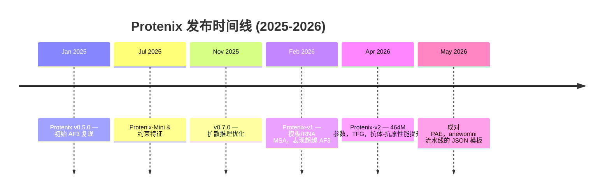

---
slug:5-latest-updates
blog_type:buzz
---


自 2025 年 1 月开源首发以来，Protenix 一直保持着高频的发布节奏。它最初只是对 AlphaFold 3 的忠实复现，如今已发展成为一个涵盖结构预测、抗体设计和分子对接的多模型生态系统。本页面记录了上一季度（大约在 2026 年 3 月至 6 月之间）最具影响力的变更，重点关注开发者关心的内容：模型发布、性能工程、流水线稳定性，以及尚待完善的基础设施缺陷。

---

## Protenix-v2：更大的模型，更精准的抗体预测

本阶段最重要的事件是 **Protenix-v2** 于 2026 年 4 月 8 日正式发布，并在 bioRxiv 上发表了配套的[技术报告](https://www.biorxiv.org/content/early/2026/04/11/2026.04.10.717613)。该模型的参数量从 368M 增加到了 **464M**，表征维度也有所提升，同时保持了与 AlphaFold 3 相同的训练数据截止日期（2021-09-30）。

核心数据令人瞩目。在抗体-抗原复合物 DockQ > 0.23 的阈值下，Protenix-v2 在三个基准测试集中的绝对成功率比 Protenix-v1 提升了 **9 至 13 个百分点**。最引人注目的是，**仅使用 5 个随机种子的 Protenix-v2 便超越了使用 1000 个种子的 Protenix-v1**，这一采样效率的巨大飞跃在 [Tamarind Bio](https://app.tamarind.bio/tools/protenix) 和 LinkedIn 的讨论中得到了广泛强调。

| 指标 (5 个 seeds) | Protenix-v2 | AlphaFold 3 | Protenix-v1 (1000 个 seeds) |
|---|---|---|---|
| FoldBench-AB DockQ > 0.23 | 65.0% | 48.8% | ~58% |
| AF3-AB DockQ > 0.23 | 53.5% | 47.0% | ~44% |
| 配体修订版有效性 (w/ TFG) | 60.46% | -- | 49.22% (w/o TFG) |

v2 版本的发布是通过 zhangyuxuan.youison 提交的一个[重磅功能提交](https://github.com/bytedance/Protenix/commit/2475421477ab414b571149ad4a875c390ff8a35d)合并的。该提交更新了 Protenix-v2 的描述，增加了内存溢出（OOM）预防机制，并引入了**免训练引导（TFG）模块**。TFG 不仅仅是一个后置过滤器——它利用物理能量势（空间位阻、手性、平面性）来引导扩散采样过程，而无需任何额外的模型训练。在修订后更严格的有效性标准下，它将配体合理性从 49.22% 提升至 **60.46%**。



---

## CPU 特征提取：实际耗时缩短 37%

本季度与开发者最息息相关的提交之一是 [longleo17 的 CPU 特征提取优化](https://github.com/bytedance/Protenix/commit/c8e16d1c5a921f0f7ca1a98cfc526e9363226609)。在模板与 MSA 等繁重的工作负载下，它将特征提取的实际执行耗时**实测降低了 37%**。这些优化堪称消除 Python 层面性能瓶颈的教科书级案例：

| 优化项 | 优化前 | 优化后 |
|---|---|---|
| 独热编码 | 手动字典查找 | `torch.nn.functional.one_hot` |
| ASCII 原子名编码 | 逐字符 Python 循环 | 向量化 `numpy.frombuffer` + `one_hot` |
| 模板数组分配 | `list.append` + `np.stack` | 预分配 numpy 数组 |
| Eval 类型过滤 | `df.apply(lambda)` | `df.isin()` |
| 坐标提取 | 串行 Python 解析 | 向量化 numpy 操作 |

这项优化意义重大，因为特征提取在 CPU 上运行，往往是 GPU 推理开始前的性能瓶颈。对于需要运行批量预测或处理大型数据集的开发者来说，这在毫无精度损失的前提下，直接带来了 1.4 倍的吞吐量提升。

---

## 数据流水线稳定性：非连续分子、空数据集等问题

2026 年 3 月中下旬集中修复了一批数据流水线中的边缘案例，这些问题此前会导致静默失败或令人费解的崩溃：

- **支持非连续分子**（[提交记录](https://github.com/bytedance/Protenix/commit/1673352a6530ca43a78c6aaf4ed5f02df21c20e1)）：修复了输入中分子不连续时出现的广播错误，这种情况在含有无序区域的现实 CIF 文件中很常见。

- **空数据集防护**（[提交记录](https://github.com/bytedance/Protenix/commit/63a724672e4ed665930b765139d4a3a4fb832a16)）：在 `BaseSingleDataset` 中添加了 `check_indices_list`。当过滤步骤（pdb_list、最小/最大 tokens、限制条件）产生空数据集时，它会立即抛出 `ValueError`，并清晰指出导致问题的过滤步骤。而在之前，空数据集会向后传播，从而产生令人费解的形状不匹配错误。

- **缺失残基类型**（[提交记录](https://github.com/bytedance/Protenix/commit/ee01aa0af321f2a0fd6ac40e1cb0d8a3ba0bcc4f)）：在 `pdb_to_cif` 转换器中增加了对 UNK、DN 和 N 残基类型的支持，解决了对含有未解析或缺失残基的蛋白质进行建模时的常见问题。

- **缩减下载体积**（[提交记录](https://github.com/bytedance/Protenix/commit/df81cde7d347458bdc16abaa247ecd7940a2125d)）：压缩了 mmcif_msa_template 发布文件，减小了新用户在配置流水线时的下载数据量。

- **LayerNorm CUDA 回退机制**（[提交记录](https://github.com/bytedance/Protenix/commit/d3b4db6a121dd4584edd85e93744239325a2b72e)）：自定义 LayerNorm CUDA 内核现在会在编译前检查当前目录是否可写，若不可写则回退至 torch 缓存目录。这消除了容器化或只读文件系统环境中常见的故障模式。版本号已更新至 1.1.0。

---

## 为 "anewomni" 集成的成对 PAE 和 JSON 模板

最近的功能开发（2026 年 4 月下旬至 5 月）主要集中在[为 "anewomni" 流水线添加 JSON 模板和链对 PAE 支持](https://github.com/bytedance/Protenix/commit/c5b74466cb9be9419a44dfaf1af389c98d2e9a1d)。PAE（Predicted Aligned Error，预测对齐误差）是衡量链间接口置信度的关键指标。对于多链复合物，必须对**每一对链条**进行 PAE 计算才能实现可靠的排序。随后在 5 月 6 日的提交（[修复 calculate_chain_pair_pae 测试用例](https://github.com/bytedance/Protenix/commit/c3bfc365b3e1341a11935eddfe7bfdc308092147) 和 [修复模板解析器测试用例](https://github.com/bytedance/Protenix/commit/8be7138d0641891825b856ada6fd957d76268899)）表明，该功能当时仍处于稳定阶段。

这一进展表明，Protenix 正在被积极整合到字节跳动内部的药物发现工作流中，其代码库既作为开源参考，又兼顾了生产工具的双重角色。

---

## 模型权重访问问题：v2 权限对许多人而言依然遥不可及

在此我们需要指出不足之处。尽管 Protenix-v2 已于 4 月 8 日宣布发布，但对于**中国境外的大多数用户来说，模型权重文件（`protenix-v2.pt`）依然无法访问**，Volces 对象存储节点会返回 HTTP 403 错误。社区中已提交了多个相关 Issue：

- [Issue #296](https://github.com/bytedance/Protenix/issues/296)：最初报告的美国东部 403 错误，获得了 7 个点赞。
- [Issue #298](https://github.com/bytedance/Protenix/issues/298)：证实其他权重文件（v1.0.0）在相同环境下可以返回 HTTP 200。
- [Issue #299](https://github.com/bytedance/Protenix/issues/299)：请求提供 GitHub Release 附件或 HuggingFace 镜像。
- [Issue #309](https://github.com/bytedance/Protenix/issues/309)：截至 2026 年 6 月仍处于打开状态，依然报 403 错误。

协作者 zhangyuxuann 在 4 月 9 日的回复如下：

> “作为公司级内部评估流程的一部分，protenix-v2 权限的可访问性目前正在审核中。我们现阶段无法提供具体的时间表。”

两个月过去了，问题依然没有解决。这是一个**严重的信任危机**。既然权重被内部审查流程限制在特定地理区域，就不能宣称 v2 已经“发布”且“开源”。与此同时，[Tamarind Bio](https://app.tamarind.bio/tools/protenix) 等第三方平台似乎已经获取了访问权限，并在提供 Protenix-v2 的商业推理服务。这促使一位评论者在 [Issue #296](https://github.com/bytedance/Protenix/issues/296) 中一针见血地质问：*“既然你们还没公开发布权重，这些家伙是怎么声称能运行 v2 的？”*

v1 的权重目前依然可以完全正常访问。现阶段，中国境外的开发者应使用 `protenix_base_default_v1.0.0` 或 `protenix_base_20250630_v1.0.0`。

---

## 文档：终于修正了 CLI 命令

自 2026 年 2 月就提交的 [README 不准确问题（Issue #224）](https://github.com/bytedance/Protenix/issues/224)，终于在 4 月下旬被关闭。问题其实很简单：README 中记录的是 `protenix pred`，但实际的 CLI 子命令是 `protenix predict`，而且像 `-i`/`-o` 这样的参数标记也是错的。社区贡献者（LiuHuaize 提交的 [PR #300](https://github.com/bytedance/Protenix/pull/300)）完善了 PyPI 的安装说明，现在 README 已正确显示为：

```bash
protenix pred -i examples/input.json -o ./output -n protenix_base_default_v1.0.0
```

提交历史中还显示了一处[专门推荐使用 `--index-url https://pypi.org/simple`](https://github.com/bytedance/Protenix/commit/0fadee55dcc3f3e4f56c7a915b7bb8a643e36ccf) 的建议，以确保用户获取到最新的 CLI，因为软件包镜像通常会滞后于官方的 PyPI 发布。

---

## 生态扩张：PXDesign、PXMeter 和 Protenix-Dock

Protenix 已不再只是一个单一的模型。其生态系统现包含三个配套项目：

- **PXDesign**：建立在 Protenix 基础模型之上的从头蛋白质结合剂设计套件。据称在多个目标上实现了 **20%--73% 的实验成功率**，比 AlphaProteo 和 RFdiffusion 高出 2 到 6 倍。可通过 [Protenix Server](https://protenix-server.com) 使用。

- **PXMeter**：一个开源评估工具包，附带人工精选的基准数据集，用于可重复的结构预测评估。

- **Protenix-Dock**：一个使用经验评分函数的经典（非神经网络）蛋白质-配体对接框架，可提供极具竞争力的刚性对接性能。

v2 的技术报告进一步展示了该系统在**零样本抗体设计**方面的能力：在 VHH 抗体设计上实现了 100% 的目标级成功率，经 BLI 确认的命中率为 2%--48%；而在针对 GPCR 的 VHH-Fc 抗体上，命中率达到了 16%--88%。

---

## 后续关注重点

发展趋势已十分清晰：Protenix 正从一个 AF3 的复刻品，逐步演进为一个**完整的生物分子建模平台**。目前亟待解决的缺陷如下：

1. **v2 权限的可访问性** —— 这是社区目前最迫切的问题。
2. **模板处理延迟** —— [Issue #316](https://github.com/bytedance/Protenix/issues/316) 和已关闭的 [Issue #302](https://github.com/bytedance/Protenix/issues/302) 都报告了某些样本在模板处理阶段会导致 10 分钟以上的卡顿，且数据集中未提供 `prot_template_cache_dir`。虽然 37% 的特征提取提速有所帮助，但病态样本阻塞同步多 GPU 训练的根本问题依然存在。
3. **纯 RNA 推理** —— [Issue #322](https://github.com/bytedance/Protenix/issues/322) 显示，当不提供蛋白质序列时，TFG 模式会发生崩溃，这一性能倒退限制了该工具在纯 RNA 结构预测中的适用性。

代码库正在快速走向成熟，性能工程实打实，基准测试结果也极具竞争力。但是，开源是一项双向奔赴的承诺：发布了模型声明却无法获取权重，只是一种半吊子的承诺，只会不断侵蚀信任。Protenix 团队对此心知肚明。他们能否在未来几周内填补这一鸿沟，将决定 v2 究竟是会被铭记为一个里程碑，还是仅仅沦为一段小插曲。