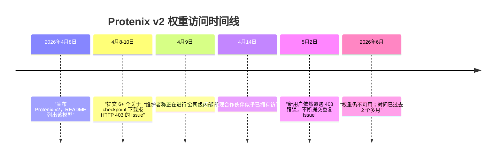

---
slug:6-issues-and-feedbacks
blog_type:buzz
---


Protenix 已成为生物分子结构预测领域强有力的竞争者——据报道，它是第一个在匹配的训练条件下，于多个基准测试中[性能超越 AlphaFold3](https://github.com/bytedance/Protenix) 的全开源模型。然而，一个模型是否真正实用，取决于用户在实际运行它时所遇到的阻力。截至撰写本文时，该代码仓库共有 **94 个开启状态和 149 个关闭状态** 的 Issue，这些 Issue 的呈现模式清晰地揭示了该项目在哪些方面表现出色，又在哪些方面存在理想与现实之间的巨大鸿沟。

本页内容综合了来自 GitHub Issue、社交媒体讨论以及第三方评估中最具影响力的社区反馈。我们将这些反馈归纳为五个主要主题，评估每个主题所反映的项目成熟度，并将 Protenix 的发展轨迹与其最接近的竞争对手进行对比。

---

## 1. 权重访问危机：v2 权重仍不可用

### 事件始末

Protenix 代码仓库中讨论最密集的 Issue 集中在无法下载 **Protenix-v2 checkpoint** 这一问题。2026 年 4 月 8 日，字节跳动在 [bioRxiv 上发表的技术报告](https://www.biorxiv.org/content/early/2026/04/11/2026.04.10.717613)中发布了 Protenix-v2，宣称在抗体-抗原基准测试中，其 DockQ 指标较 v1 版本提升了 9 到 13 个百分点。该发布说明在 README 的模型列表中将 `protenix-v2` 列为可用模型。

问题出在哪里？**对于字节跳动内部网络之外的几乎所有用户来说，该 checkpoint 的下载链接均返回 HTTP 403 Forbidden 错误。**

短短一周内，至少提交了 **6 个独立 Issue** 专门讨论此问题：

| Issue | 标题 | 提交日期 | 状态 |
|-------|-------|-------|--------|
| [#294](https://github.com/bytedance/Protenix/issues/294) | wget protenix-v2 gives 403 error | 4月8日 | Open |
| [#295](https://github.com/bytedance/Protenix/issues/295) | v2 weight not released? | 4月8日 | Open |
| [#296](https://github.com/bytedance/Protenix/issues/296) | protenix-v2.pt download returns 403 Access Denied from outside China | 4月9日 | Open |
| [#298](https://github.com/bytedance/Protenix/issues/298) | protenix-v2.pt checkpoint URL returns HTTP 403 while other checkpoints are accessible | 4月10日 | Closed |
| [#299](https://github.com/bytedance/Protenix/issues/299) | Cannot download protenix-v2.pt (HTTP 403) -- need GitHub-hosted checkpoint | 4月10日 | Closed |
| [#309](https://github.com/bytedance/Protenix/issues/309) | cant get protenix-v2 model | 5月2日 | Open |

### 官方回应

协作者 **zhangyuxuann**（张宇轩，两份 Protenix 技术报告的主要作者）在 [Issue #296](https://github.com/bytedance/Protenix/issues/296) 中作出了回应，坦白说，这个回应不仅没有解答疑问，反而引发了更多质疑：

> “请注意，作为公司级内部评估流程的一部分，protenix-v2 checkpoint 的可访问性目前正在审核中。现阶段我们无法提供具体的时间表。”

这是一个极其含糊的承诺。**两个月过去了**，截至 2026 年 6 月，该权重仍然无法访问。v1 的 checkpoint（`protenix_base_default_v1.0.0.pt`、`protenix_base_20250630_v1.0.0.pt`）在同一 CDN 节点上可以正常下载——唯独 v2 的权重被拦截了。

### 社区的挫败感

用户的挫败感显而易见。用户 **rjrich** 在 [Issue #295](https://github.com/bytedance/Protenix/issues/295) 中一针见血地指出了核心问题：

> “我不明白为什么在相关权重尚未发布的情况下，就宣布 Protenix v.2 已经发布。显然，v.2 是可以安装的，但使用该版本运行推理并解释结果，在科学和技术上似乎都存在问题。Protenix 的现有用户和潜在用户是否应该退回使用 v.1 版本？”

另一位用户 **ssrb19** 在同一个 Issue 中尖锐地提问：“如果你们还没有公开发布权重，那些人是怎么声称运行了 v2 的？”——他同时附上了 [Tamarind Bio 的 Protenix 工具](https://app.tamarind.bio/tools/protenix)链接，该工具似乎已经提供了 v2 的推理服务。这种在更广泛的社区被拒之门外的同时，特定的合作伙伴却享有优先访问权的情况，很难让人忽视。

在 LinkedIn 上，**Max Beining** 在一条关于 Protenix-v2 发布的帖子下[评论](https://www.linkedin.com/posts/ullah-samee_protenix-v2-is-officially-out-through-training-free-activity-7447641029048221697-4-re)道：“（很快）也会发布这个权重吗？curl 告诉我访问被拒绝了 :（”

### 竞品对比

这与竞争对手所展现出的开放态度形成了鲜明反差。[Boltz-1](https://github.com/jwohlwend/boltz) 和 [Boltz-2](https://github.com/jwohlwend/boltz) 均采用 MIT 协议，并在 HuggingFace 上即时公开了代码和权重。[Chai-1](https://github.com/chaidiscovery/chai-lab) 也在 Apache 2.0 协议下发布了推理代码和权重。即便是 DeepMind，最终也通过申请的方式发布了 [AlphaFold3 权重](https://www.nature.com/articles/d41586-024-03708-4)。

正如 [Apheris](https://www.apheris.com/resources/blog/protenix-v1-is-now-available-in-apherisfold) 所分析的，更广泛的竞争格局如今已在企业级基准测试平台中纳入了 Protenix-v1、OpenFold3 和 Boltz-2——但值得注意的是，**仅包含 v1 的权重**，并不包含 v2。



**总结：** 一边将模型宣布为“已发布”，一边却让人无法访问权重，这严重损害了信任度。对于一个以“大众化结构预测”为标榜的项目来说，缺乏具体的时间表或替代镜像（如 GitHub Releases、HuggingFace），无疑是一次重大的运营失误。

---

## 2. 训练流水线：极度延迟与基础设施缺失

### 核心问题

两个相关的 Issue——一个已关闭，一个仍处于开启状态——揭示了 **Protenix 训练数据流水线中的一个结构性缺陷**，且这绝非单纯的 Bug。

[Issue #302](https://github.com/bytedance/Protenix/issues/302)（“某些样本导致训练步延迟极高”）于 2026 年 4 月 15 日提交，直截了当地描述了这一情况：

> “在训练过程中，某些样本的处理时间极长——有时处理单个样本需要一个小时甚至更久。根据 Protenix 的报告和文档，预期的吞吐量约为 12 秒/步，但在实际操作中，某些样本耗时高达 1 小时/步。”

报告者使用的是 **8x NVIDIA B200 GPU**，并采用 Protenix 的默认设置。分布式训练的同步特性意味着，只要有一个样本处理缓慢，就会迫使所有其他 GPU 处于闲置状态，从而有效地使整个训练任务停滞。

2026 年 5 月 12 日提交的 [Issue #316](https://github.com/bytedance/Protenix/issues/316)（“部分 weightedPDB 样本导致模板处理极其缓慢”）指出了可能的罪魁祸首：模板处理流水线中的 `get_template()` 函数。对于某些特定样本，解析 `.a3m` 序列比对命中、预过滤、排序、去重以及串行处理 CIF 文件，每个样本可能会耗费超过 **10 分钟** 的时间。

报告者还指出了一个关键的缺失：**代码中虽然存在 `prot_template_cache_dir` 接口，但上传的数据集中并不包含该缓存目录，也没有提供用于生成该目录的脚本。** 另一位用户 **px172** 也证实遇到了同样的问题，且未找到任何变通方法。

### 现象背后的意味

这是一个典型的案例，说明**研究代码库尚未针对大规模生产级训练进行强化**。训练数据流水线似乎已经针对字节跳动的内部基础设施进行了优化（推测其内部存在模板缓存），但在开源发布时，外部用户只能自己去摸索发现这些性能瓶颈。

相比之下，贡献者 **longleo17** 在 2026 年 3 月 24 日提交的一个将 **CPU 特征提取速度提升 37%** 的 commit（[c8e16d1](https://github.com/bytedance/Protenix/commit/c8e16d1c5a921f0f7ca1a98cfc526e9363226609)）就很说明问题。该 commit 对模板特征化操作进行了向量化处理，并使用 `torch.nn.functional.one_hot` 替换了手动独热编码——这是一项意义深远的优化。但它同时也凸显出，特征提取流水线在本质上依然是一个串行瓶颈，开发团队目前只是在做一些零星的修补，而非从架构层面进行重新设计。

---

## 3. 结构输出质量：NaN 坐标、原子错位与化学键错误

一系列开启状态的 Issue 表明，Protenix 的输出质量虽然在基准测试中表现抢眼，但在一些**边界情况下会产生隐蔽的损坏结构**。这类 Bug 会严重削弱用户对结构预测流水线的信任，因为它们往往在下游分析失败后才会被察觉。

### CIF 输出中出现 NaN 坐标

[Issue #318](https://github.com/bytedance/Protenix/issues/318) 报告称，在 **RTX PRO6000 96GB** 上运行的 Protenix 生成的 CIF 文件中，**所有原子的坐标均为 `nan`**：

```
ATOM N N   . ALA A 1 1   . 1   ALA A N   nan nan nan nan 1 1    1.0
ATOM C CA  . ALA A 1 1   . 1   ALA A CA  nan nan nan nan 1 2    1.0
```

推理日志没有显示任何错误——模型报告“成功”，且前向传播时间也处于正常范围（约 18-22 秒）。这种情况尤为隐蔽，因为用户可能不会逐一检查每个输出文件，从而在不知不觉中将损坏的结构输入到下游工具中。鉴于这发生在显存充足的高端 GPU 上，说明该问题大概率是扩散采样循环中的数值不稳定造成的，而非显存溢出（OOM）。

### OXT 原子错位

两个独立的 Issue——[#282](https://github.com/bytedance/Protenix/issues/282) 和 [#317](https://github.com/bytedance/Protenix/issues/317)——报告称 **OXT 末端氧原子被放置在了完全错误的坐标上**，远离了其关联的末端残基。Issue #317 中的用户 **CLG68** 描述了自己编写封装脚本来检测并修复这些错误：

> “通常，最后一个残基上的 OXT 会出现在随机坐标上……远离其关联的残基。我编写了一个封装脚本来控制 Protenix，并添加了一个测量 OXT 与最后残基距离的功能。如果距离太远，脚本会为 OXT 重新分配新的坐标，并删除 CONNECT 表。”

用户竟然需要专门编写一个后处理封装脚本来处理这个问题，这表明它是一个**频发的系统性问题**，而非孤立的偶发事件。

### 无法识别配体中的三键

[Issue #315](https://github.com/bytedance/Protenix/issues/315) 揭示了一个化学层面的局限性：Protenix v1 无法在 17-α 乙炔雌二醇等配体中正确渲染 **C-C 三键**，而是将其错误替换为单键。报告者测试了多种输入格式（SDF v2000、SDF v3000、MOL2、PDB），但产生的结果同样错误。值得注意的是，使用 CCD（化学组分字典）参考确实能产生正确的几何结构，但该问题特定发生于未进行 CCD 查找的用户自定义配体文件上。

报告者还指出，使用 `--use_tfg_guidance true` 可以修复三键问题，但会**降低配体整体的构象质量**——这种令人沮丧的权衡目前还没有明确的解决方案。

### 汇总表

| Issue | 问题 | 严重程度 | 状态 |
|-------|---------|----------|--------|
| [#318](https://github.com/bytedance/Protenix/issues/318) | CIF 输出中所有坐标均为 NaN | 严重（静默数据丢失） | Open |
| [#317](https://github.com/bytedance/Protenix/issues/317) | OXT 原子坐标随机 | 高（系统性问题） | Open |
| [#282](https://github.com/bytedance/Protenix/issues/282) | OXT 原子位置错误（早期报告） | 高 | Open |
| [#315](https://github.com/bytedance/Protenix/issues/315) | 配体文件中三键未被识别 | 中 | Open |
| [#291](https://github.com/bytedance/Protenix/issues/291) | N-糖基化后 Asn 侧链几何结构不正确 | 中 | Open |
| [#290](https://github.com/bytedance/Protenix/issues/290) | 序列末端的原子错位 | 中 | Open |

---

## 4. 推理边界情况与 TFG 引擎

近期引入的 **Training-Free Guidance (TFG)** 引擎——作为 Protenix-v2 提升配体合理性的关键特性——自身也存在一些瑕疵。

[Issue #322](https://github.com/bytedance/Protenix/issues/322) 报告了在仅使用 RNA 输入（无蛋白质序列）运行 TFG 模式时发生的**严重崩溃**：

```
TypeError: VinaStericPotential._get_collision_candidates.<locals>._cache_and_return() takes 1 positional argument but 2 were given
```

回溯信息显示，该错误源自 `protenix/tfg/potentials.py` 第 1206 行的 `VinaStericPotential._get_collision_candidates` 方法。用户发现在输入中加入一段虚拟寡肽就能使其正常运行，这表明 TFG 的空间位阻代码**隐式假设了蛋白质原子必然存在**——而这种假设在输入层面从未进行过校验。

这是一项相对较新的功能（TFG 是在 2026 年 4 月 7 日的一个 [v2 发布 commit](https://github.com/bytedance/Protenix/commit/2475421477ab414b571149ad4a875c390ff8a35d)中引入的，添加了“无需训练的引导模块”），因此存在一些不成熟之处在所难免。但这种失败模式——在生产推理路径中抛出 Python `TypeError`——表明其输入校验和测试覆盖率严重不足。

---

## 5. 易用性与文档缺失

### README 中的错误（现已修复）

2026 年 2 月 6 日提交、2026 年 4 月 23 日关闭的 [Issue #224](https://github.com/bytedance/Protenix/issues/224) 报告称，README 中的快速启动命令是**错误的**：

- 列出的子命令是 `pred`，但实际子命令应为 `predict`
- 列出的参数是 `-i`，但实际参数应为 `--input`
- 列出的参数是 `-o`，但实际参数应为 `--out_dir`

这个问题耗时 **2.5 个月** 才得以修复。修复是通过贡献者 **LiuHuaize** 提交的 [PR #300](https://github.com/bytedance/Protenix/pull/300) 完成的，该 PR 澄清了 README 中的安装命令，并已在 [commit 3248f8e](https://github.com/bytedance/Protenix/commit/3248f8e7e1c94f0b5835a40ebdc649d74d631a82) 中合并。目前的 README 已正确将 `protenix pred` 记录为子命令，这表明很可能是 CLI 接口本身被更新以迎合文档，而不是反过来。

### MSA 数据库设置的困惑

[Issue #320](https://github.com/bytedance/Protenix/issues/320) 提出了一个实际的担忧：用于本地 MMseqs2/ColabFold 数据库设置的 `setup_databases.sh` 脚本执行时间极其漫长，且**没有任何文档说明预期的耗时或总下载大小**。用户询问是否存在无需在本地下载整个数据库即可生成 MSA 的替代方案。

这是结构预测工具普遍面临的痛点——MSA 基础设施非常庞大，资源受限环境下的用户需要更清晰的替代方案指导（例如，使用 Protenix 服务器 API 或更轻量级的 MSA 来源）。

---

## 6. 功能请求与工作流缺失

几个已关闭的 Issue 暴露了**Protenix 尚未完全支持的重要工作流模式**：

### 针对特定链的 MSA 控制

[Issue #289](https://github.com/bytedance/Protenix/issues/289) 询问是否可以在复合物中对某些链使用 MSA，而对其他链不使用——这是 Binder（结合剂）设计工作流中常见的场景：目标使用模板/MSA 信息，但设计的 Binder 应作为单序列进行折叠。该 Issue 被关闭，暗示已提供解决方案，但其底层能力依赖于精心构建的 JSON 输入，而非依托于专门的 API。

### 基于模板的 Binder 评估

[Issue #288](https://github.com/bytedance/Protenix/issues/288) 描述了一种复杂的 Binder 评估工作流：为目标提供实验模板，为设计的 Binder 提供单序列（无 MSA），并期望模型能生成接近所提供模板的结构。报告者发现**输出结果与提供的模板并不相似**，这表明在这种应用场景下，Protenix 的模板影响力弱于预期。

### 约束模型架构

[Issue #75](https://github.com/bytedance/Protenix/issues/75) 是最早提交的 Issue 之一（2025 年 2 月提交，2026 年 4 月关闭），该 Issue 询问了受约束模型与无约束模型之间的关系。这是一个极其重要的架构问题——约束模型到底是对基础模型进行了微调，还是从头开始训练的——它竟然耗时一年多才被关闭，这表明团队的优先事项可能并不总是与社区对架构透明度的需求相契合。

---

## 7. 社区反响：大局观

尽管存在上述种种阻力，但更广泛的科学界对 Protenix 的诞生及其 v1 的性能作出了**极为热烈**的反应：

- 在 [LinkedIn](https://www.linkedin.com/posts/ullah-samee_protenix-v1-exceeds-the-performance-of-activity-7424964488787042304-lUHV) 上，研究员 **Samee Ullah** 分享了详细的基准测试对比，结果显示 Protenix-v1 在多项任务上超越了 AlphaFold3：Ab-Ag（DockQ 指标 52.31% vs 48.75%）、蛋白质-蛋白质（72.70% vs 71.73%）以及蛋白质-RNA（68.46% vs 65.22%）。该帖子获得了 395 个点赞以及深入的技术讨论。

- 评论者 **Valentyn Badlo** 指出：“在 Ab-Ag、蛋白质-蛋白质、蛋白质-RNA 以及 RNA 单体基准测试中击败 AF3 尤为引人瞩目。因为这些正是几何结构、界面效应和复杂相互作用最为关键的领域。”

- 评论者 **Nikhil Haas** 提出了尖锐的见解：“你永远可以相信科学界，他们总能将现有的闭源成果进行复现并开源。这仅仅是时间问题。”

- 在 [Reddit 的 r/AIProteins 版块](https://www.reddit.com/r/AIProteins/comments/1svb061/protenixv2_structure_prediction_moving_toward)中，讨论的焦点集中在 Protenix-v2 的种子效率上：“如果使用更少的种子就能获得更好的抗体-抗原预测结果，那将使这些模型在实际设计流水线中具有大得多的实用价值。”

- [Apheris](https://www.apheris.com/resources/blog/protenix-v1-is-now-available-in-apherisfold) 将 Protenix-v1 集成到了其企业级 ApherisFold 平台中，并强调了其在药物发现 DMTA（设计-制造-测试-分析）周期中**推理时扩展行为**的巨大价值。

然而，这种高涨的热情**由于权重访问问题而大打折扣**。在 LinkedIn 上那个盛赞 Protenix-v2 的同一评论线程中，也充斥着用户报告在下载 checkpoint 时遇到 403 错误的反馈。已宣布的功能与实际可访问性之间的巨大落差，成为了社区话语中的核心主题。

---

## 评估与展望

Protenix 在开源结构预测生态系统中占据着举足轻重的地位。其 v1 模型兑现了以完全开源代码实现 AlphaFold3 级性能的承诺，且相关技术报告严谨详实。[PXMeter](https://github.com/bytedance/protenix-meter) 基准测试工具包为该领域的可重复评估做出了重大贡献。

但此处记录的种种 Issue 揭示了该项目必须解决的**三大结构性挑战**，以维系其信誉：

1. **权重的可用性必须与发布声明相符。** v2 checkpoint 的溃败——一边宣布模型“已发布”，一边却长达数月无法访问权重——这种做法对信任造成的破坏，是基准测试成绩的提升所无法弥补的。该项目需要制定全球可用的 CDN 策略，而不仅仅局限于中国境内，并承诺提供 GitHub Releases 或 HuggingFace 镜像作为备选方案。

2. **训练基础设施需要强化。** 模板处理的瓶颈以及缓存基础设施的缺失，表明目前的开源训练流水线仅仅是内部工具的快照，而非产品化的发布。尝试进行训练或微调的外部用户必将撞上一堵堵字节跳动工程师从未遇到过的“南墙”。

3. **输出校验需要系统性的改进。** NaN 坐标、OXT 原子错位以及无法识别的化学键类型，都是输出校验不足的病症。一个会静默生成 `nan` 坐标——甚至还报告“成功”——的结构预测流水线，是绝对无法在没有封装脚本保护的情况下赢得用户信任的。

竞争环境不会停下脚步。Boltz-1 和 Boltz-2 提供了采用 MIT 协议且即时可用的代码和权重。Chai-1 提供了采用 Apache 协议的推理服务。AlphaFold3 本身现在也支持通过申请获取权重。Protenix 的技术贡献固然真实且巨大，但**单凭技术优势无法支撑一个开源项目长存——唯有运营的可靠性才能做到。**

前方的道路已十分清晰：发布 v2 权重，完善训练缓存基础设施的文档，增加输出校验，并确保运行 Protenix 的实际体验，能与它背后的科学品质相得益彰。