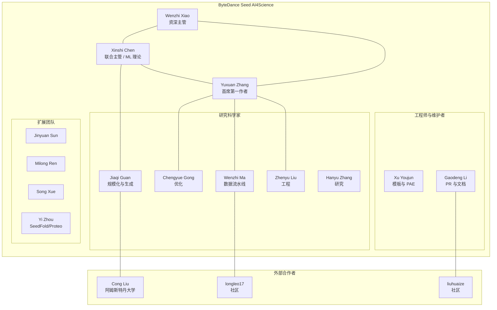

---
slug:7-about-contributors
blog_type:buzz
---

Protenix 并非出自某个天才的想法，也不是某个学术实验室在 GitHub 上的业余产物。它是**字节跳动 Seed AI for Science 团队**精心打造的成果。该团队正处于工业级工程与前沿计算生物学的交汇处。这个团队之所以值得深入了解，不仅在于他们产出了什么，更在于他们是谁、有着怎样的背景，以及这些背景如何深刻影响了你在每次运行 `protenix pred` 时所接触到的设计决策。

---

## 组织归属：ByteDance Seed AI4Science

Protenix 隶属于字节跳动的前沿研究部门 [ByteDance Seed](https://seed.bytedance.com/en/protenix_pxdesign)。旗下的 AI for Science 小组主要依托两大枢纽：**中国北京**和**美国西雅图**（具体位于贝尔维尤地区）。这种跨地域的双核架构不仅赋予了团队全天候的开发周期，还使其能够同时汇聚来自中国的计算生物学人才与位于美国的机器学习（ML）研究员。

正如其 [GitHub 仓库](https://github.com/bytedance/Protenix)所述，该团队目前正积极在北京和西雅图两地招聘多个岗位的人才——从蛋白质设计科学家到机器学习工程师。他们明确提及面向优秀申请者的字节跳动“Top Seed 顶尖人才计划”，这表明该项目是一项战略级优先举措，而非边缘的副业项目。

该团队维护的更广泛生态系统包括：

| 项目 | 用途 | 状态 |
|---------|---------|--------|
| [Protenix](https://github.com/bytedance/Protenix) | 核心结构预测模型 | 积极开发中（v2 版本于 2026 年 4 月发布） |
| [PXDesign](https://protenix.github.io/pxdesign/) | 从头设计（De novo）蛋白结合剂 | 实验验证中（命中率达 20-73%） |
| [PXMeter](https://github.com/bytedance/PXMeter) | 基准测试与评估工具包 | 开源 |
| [Protenix-Dock](https://github.com/bytedance/Protenix-Dock) | 经典的蛋白-配体对接 | 开源 |

---

## 核心领导层

### Wenzhi Xiao —— 愿景领航者

Wenzhi Xiao 担任所有三篇 Protenix 预印本的资深通讯作者（在出版物中以星号标出）：包括[初版 AlphaFold3 复现](https://www.biorxiv.org/content/early/2025/01/11/2025.01.08.631967)、[Protenix-v1](https://www.biorxiv.org/content/early/2026/02/22/2026.02.05.703733.1) 和 [Protenix-v2](https://www.biorxiv.org/content/early/2026/04/11/2026.04.10.717613)。他在每篇论文中均处于资深位置，这表明他是确定技术方向、并对工作的科学质量承担最终责任的研究主管。与其他团队成员相比，Xiao 的公开曝光率相对较低；但在 Protenix 的整个发展轨迹中——从最初的 AF3 复现，到 v2 版本扩展至抗体-抗原预测和生物分子设计——他始终担任联合领导者。这足以证明他是一位深刻理解 ML 与生物学双重领域的领导者。

### Xinshi Chen —— 算法架构师

[Xinshi Chen](https://xinshi-chen.github.io) 是 ByteDance Seed 的研究科学家，并担任联合主管（在 v2 论文中同样以星号标出）。他的履历完美诠释了该团队的画像：**扎实的数学基础、严苛的 ML 训练，以及向计算生物学的成功转型**。

Chen 在 **佐治亚理工学院** Le Song 教授的指导下获得了机器学习博士学位，论文题目为《*深度学习与算法设计的对偶性*》。在此之前，他在**香港中文大学 (CUHK)** 获得了数学学士和硕士学位，毕业论文研究方向为形状优化的参数化有限元方法。他是**Google 博士奖学金**（2020-2022）的获得者，该奖项每年在全球授予的研究人员名额不足 50 人。

他的发表记录横跨多个顶尖 ML 学术会议，包括在 ICLR 2020 获得口头报告，内容是利用展开算法进行 RNA 二级结构预测——这项工作直接预示了他目前对生物分子应用的关注。他早期关于使用 GNN 进行概率逻辑推理（ICLR 2020）、粒子流贝叶斯规则（ICML 2019）和稀疏恢复（ICLR 2022）的研究，证明了他是一位会深入思考学习的数学基础，而非仅仅停留在应用工程层面的研究员。

加入字节跳动之前，Chen 曾在 **Facebook AI (门洛帕克)**、**MBZUAI (阿联酋)**、**蚂蚁集团**以及**橡树岭国家实验室**工作过。这种从国家实验室到工业 AI 实验室的广博经验，赋予了他独特的跨学科视角。

正如他的[个人主页](https://xinshi-chen.github.io)所述，Chen 的研究理念集中在“*原则性的机器学习、基于学习的算法设计，以及机器学习与生物学交叉领域的科学应用*”。他绝非那种因为跟风才涉足 AI4Science 的人——从他的博士研究到 Protenix 项目，其研究主线一脉相承，清晰可见。

---

## 第一作者与核心开发

### Yuxuan Zhang —— 核心驱动力

Yuxuan Zhang 是**全部三篇 Protenix 预印本**（v0.5.0、v1 和 v2）的**第一作者**，这使他成为该项目科学成果最为多产的核心贡献者。在 GitHub 上，他的提交 ID 为 `zhangyuxuan.youison`，负责了项目中一些最为关键的更新，包括[发布带有免训练引导的 Protenix-v2](https://github.com/bytedance/Protenix/commit/2475421477ab414b571149ad4a875c390ff8a35d)、[将版本升级至 1.1.0 并添加 layer_norm CUDA 编译兜底逻辑](https://github.com/bytedance/Protenix/commit/d3b4db6a121dd4584edd85e93744239325a2b72e)，以及至关重要的[数据集空值检查功能](https://github.com/bytedance/Protenix/commit/63a724672e4ed665930b765139d4a3a4fb832a16)，该功能有效防止了训练数据过滤期间的静默失败。

Zhang 的工作贯穿了整个技术栈：模型架构决策、训练稳定性、推理优化以及数据流水线工程。在 GitHub Issues 中，社区成员甚至会直接称呼他的名字与他交流（例如 [Issue #319](https://github.com/bytedance/Protenix/issues/319) 中的 *“Hi Yuxuan”*），这足以说明他作为项目主管的高可见度和亲和力。

### Chengyue Gong —— 优化专家

Chengyue Gong 是 Protenix-v2 论文的共同第一作者，同时也是之前所有 Protenix 出版物的合著者。根据他的 [Google Scholar 主页](https://scholar.google.com/citations?user=AscakBgAAAAJ)和[学术主页](https://sites.google.com/view/chengyue-gong)显示，Gong 早期的研究主要集中在**神经网络架构搜索、对抗训练和泛化理论**，其成果发表于 ICML、CVPR、NeurIPS 和 ICLR。他的代表性成果包括：

- **AlphaNet** (ICML 2021) —— 使用 alpha 散度改进超网络训练
- **KeepAugment** (CVPR 2021) —— 保留信息的数据增强方法
- **MaxUp** (CVPR 2021) —— 通过极小极大优化提升泛化能力
- **FRAGE** (NeurIPS 2018) —— 频率无关的词表示

他在训练动态和优化理论方面的深厚背景，直接满足了 Protenix 的核心需求：稳定的大规模训练、高效的采样以及严谨的损失函数设计。从 NLP 和 NAS 领域转向生物分子结构预测，是该团队中常见的模式——即拥有扎实 ML 基础的研究人员将技能应用于全新领域。

### Jiaqi Guan —— 规模化与生成专家

[Jiaqi Guan](https://guanjq.github.io) 是 ByteDance Seed 的高级研究科学家，常驻**华盛顿州贝尔维尤**。他在**伊利诺伊大学厄巴纳-香槟分校 (UIUC)** 获得 Jian Peng 教授指导的计算机科学博士学位，并在**清华大学**获得自动化专业学士学位。

Guan 在加入 Protenix 项目前的发表记录极为出色，尤其是在**基于结构的药物设计和 3D 分子生成**领域：

- **LinkerNet** (NeurIPS 2023, Spotlight) —— 利用 3D 等变扩散进行片段构象与连接子的协同设计
- **DecompDiff** (ICML 2023) —— 用于药物设计的具分解先验的扩散模型
- **TargetDiff** (ICLR 2023) —— 用于目标感知分子生成的 3D 等变扩散模型
- **Pocket2Mol** (ICML 2022) —— 基于蛋白质口袋的高效分子采样
- **Activity Forecasting** (CVPR 2020, Oral) —— 生成式混合特征表示

根据他的[简历](https://guanjq.github.io/files/CV.pdf)，在字节跳动期间，Guan “*在 256 块 GPU 上开发并训练了十亿参数级的 transformer 和扩散模型*”，通过混合精度、激活检查点、自定义算子以及 DeepSpeed EvoAttention 技术，实现了**2 倍的加速和 30% 的内存占用削减**。他还将推理扩展能力从 2 万个原子提升至 6 万个。正是这种级别的工程实力，使 Protenix 的推理优化成为可能。

Guan 还主导开发了 **PXDesign**，这是建立在 Protenix 基础上的从头结合剂设计系统，该系统在多个目标上实现了 17-82% 的实验验证命中率。

加入字节跳动之前，Guan 曾在**腾讯 AI Lab**（NLP/对话系统）和**卡内基梅隆大学机器人研究所**实习（与 Kris Kitani 合作进行生成式视频预测）。

---

## 工程中坚：日常构建者

### Wenzhi Ma (mawenzhi.5537)

Wenzhi Ma 是这三篇 Protenix 论文的合著者，也是代码仓库中最活跃的提交者之一。他的提交工作主要集中在**数据处理流水线和 PDB/mmCIF 格式处理**上：包括在 pdb_to_cif 转换中增加对 UNK/DN/N 残基的支持（[提交记录](https://github.com/bytedance/Protenix/commit/ee01aa0af321f2a0fd6ac40e1cb0d8a3ba0bcc4f)）、修复非连续分子的广播错误（[提交记录](https://github.com/bytedance/Protenix/commit/1673352a6530ca43a78c6aaf4ed5f02df21c20e1)）、重构数据流水线（[提交记录](https://github.com/bytedance/Protenix/commit/aa9073b7f35b963b8e020c684c933c87417ee3b3)），以及解决分子分配逻辑中的等价检测问题（[提交记录](https://github.com/bytedance/Protenix/commit/de24b1916cbcd1059493c848391f9b85b9744b37)）。他的这些工作虽不耀眼，却是维系特征化流水线在处理边缘情况时不发生崩溃的命脉所在。

### Zhenyu Liu

Zhenyu Liu 是 v1 和 v2 论文的合著者。作为团队的工程骨干，他为模型开发和基础设施建设均做出了重要贡献。

### Hanyu Zhang

Hanyu Zhang 在所有三篇 Protenix 出版物中均表现为合著者，表明他自项目伊始便持续深度参与其中。

### Gaodeng Li / gaodeng.li

Gaodeng Li 在仓库中担任维护者角色，负责处理 PR 合并与文档更新。他的提交记录包括合并了[关于 README 中 PyPI 安装说明澄清的 PR #300](https://github.com/bytedance/Protenix/commit/3248f8e7e1c94f0b5835a40ebdc649d74d631a82)，并协调修复了 README 中的准确性问题——正是这些工作保障了社区开发者能够顺畅使用该项目。

### Xu Youjun (xuyoujun.dev / 徐优俊)

Xu Youjun 是一位非常活跃的贡献者，主要聚焦于模板解析和置信度指标计算。近期的提交包括[修复链对 PAE 计算的测试用例](https://github.com/bytedance/Protenix/commit/c3bfc365b3e1341a11935eddfe7bfdc308092147)以及[为 anewomni 特性添加 JSON 模板和 pair_pae](https://github.com/bytedance/Protenix/commit/c5b74466cb9be9419a44dfaf1af389c98d2e9a1d)。他的工作对于 Protenix-v1 引入的基于模板的预测功能至关重要。

---

## 扩展团队与合作者

三篇论文的作者名单显示，Protenix 背后是一支约 18 到 20 人的研究团队。其他核心成员包括：

- **Jinyuan Sun** —— v2 与 PXDesign 的合著者
- **Milong Ren** —— v2 合著者及 PXDesign 的主要作者
- **Song Xue** —— v2 合著者
- **Chan Lu** —— 最初 AF3 复现论文的合著者
- **Ke Zhang, Shenghao Wu, Kuangqi Zhou** —— Protenix 初版发布的贡献者
- **Lan Wang, Yanping Yang, Yu Xia** —— v1 合著者
- **Bo Shi, Shaochen Shi** —— 最初版本发布的合著者

### 学术合作者：Cong Liu

[Cong Liu](https://congliuuva.github.io) 是**阿姆斯特丹大学 AMLab 和 AI4Science Lab** 的博士候选人，师从 Patrick Forre 博士，并与强生公司有合作研究。他是 PXDesign 项目的核心成员，并共同撰写了 **ProtDBench**（已被 ICML 2026 接收），这是一个用于评估蛋白结合剂设计的统一基准。Liu 在基于克利福德代数的等变网络和几何深度学习方面的专业造诣，为团队的偏重应用型工作带来了互补的理论深度。他于 2024 年 12 月作为研究科学家实习生加入了 ByteDance Seed AI4Science。

### 相关团队成员：Yi Zhou

[Yi Zhou](https://dugu9sword.github.io) 是 ByteDance Seed 的研究科学家，正在并行推进 **SeedFold** 项目（独立的基于缩放定律的生物分子结构预测模型）和 **SeedProteo**（从头结合剂设计）项目。他虽未直接参与贡献 Protenix，但同属于 AI4Science 小组，代表着该团队更为宏大的愿景。Zhou 的背景尤为引人注目：他组建了字节跳动的冷冻电镜研究团队，其成果 **CryoSTAR** 被 *Nature Methods* 接收。早年在复旦大学与 Zheng Xiaoqing 教授合作进行的 NLP 研究，以及在 UCLA 与 Cho-Jui Hsieh 和 Kai-Wei Chang 合作的经历，进一步丰富了团队的技术维度。

---

## 社区贡献者

尽管 Protenix 主要由内部团队主导开发，但已开始吸引具有实质性意义的外部贡献。

### longleo17 —— 性能优化先锋

最突出的社区贡献来自 [longleo17 实现的 37% 的 CPU 特征化提速](https://github.com/bytedance/Protenix/commit/c8e16d1c5a921f0f7ca1a98cfc526e9363226609)。该贡献使用 `torch.nn.functional.one_hot` 替代了手动创建的独热字典，通过 numpy 对 ASCII 编码进行了向量化，使用预分配的 numpy 数组替代了列表追加模式，并在整个模板特征化器中应用了 numpy 批处理操作。这是一个教科书级别的范例，展示了基于性能剖析的 numpy 向量化如何在数据流水线中实现惊人的提速——并且这是在真实的 PDB 复合体上完成基准测试的。

### liuhuaize —— 文档完善者

社区成员 liuhuaize 提交了关于[澄清 README 中 PyPI 安装说明](https://github.com/bytedance/Protenix/commit/0fadee55dcc3f3e4f56c7a915b7bb8a643e36ccf)的修改，解决了那种往往容易让新用户感到挫败的文档缺失问题（参见关于 README 不准确的[已关闭 Issue #224](https://github.com/bytedance/Protenix/issues/224)）。

---

## 团队构成：结构性剖析

通过以上分析，我们可以清晰地看到该团队的**独特构成模式**：

| 维度 | 观察 |
|-----------|-------------|
| **学术背景** | 佐治亚理工、UIUC、香港中文大学、清华大学——皆为顶尖的 ML/CS 学术项目 |
| **过往行业经验** | Facebook AI、腾讯、蚂蚁集团、CMU、橡树岭国家实验室等 |
| **研究与工程比例** | 约为 60/40——工程占比高于典型的学术团队 |
| **地理分布** | 北京（数据流水线、生物学）+ 西雅图（模型架构、训练） |
| **发文阵地** | NeurIPS、ICML、ICLR、CVPR、Cell、Nature Methods |
| **领域演变** | 多名成员由 NLP/NAS/安全领域转型至计算生物学 |

最引人注目的模式在于，该团队是**有意识地招募了具备深厚数学功底的 ML 通用专家**，而非纯粹的计算生物学家。Chen 在算法设计上的背景、Gong 在优化理论上的积累，以及 Guan 在几何深度学习上的造诣，共同反哺了这一系统。从本质上讲，这是一个将 ML 架构应用于生物数据的系统，而不是在生物模型上生硬附加 ML 功能。这也正是 AlphaFold 取得成功的核心哲学。因此，Protenix 的架构与 AF3 高度相似并在其训练和推理工程上实现改进，绝非偶然。

---

## 文化与开源精神

该团队对待开源的态度，明显比许多企业的 AI4Science 项目要诚恳和彻底得多。他们开源了：

- **完整的训练代码**（不仅是推理代码）
- **完整的数据流水线**（MSA、模板、特征化）
- **多种模型变体**（base、applied、mini）
- **自定义 CUDA 算子**（LayerNorm、attention）
- **基准测试工具包**（PXMeter）
- **提供免费访问的 Web 服务器**（包含商业用途）

团队维护着活跃的沟通渠道：[Slack](https://join.slack.com/t/protenixworkspace/shared_invite/zt-3drypwagk-zRnDF2VtOQhpWJqMrIveMw)、[微信](https://github.com/bytedance/Protenix/issues/52)、[Twitter](https://x.com/ai4s_protenix) 以及电子邮件。GitHub 上的 Issues 通常能得到快速响应——往往直接由 Zhang 或 Ma 本人回复。对于这种量级的团队而言，这种参与度实属罕见，也彰显了他们建设开发者社区的真诚承诺，而非仅仅为了“洗白”开源。

目前的联系邮箱已从早期版本的 `ai4s-bio@bytedance.com` 更改为当前 README 中的 `anewbt_mind@bytedance.com`，这或许反映了 ByteDance Seed 内部组织架构的重新调整。

---

## 展望未来

Protenix 团队显然正处于扩张阶段。他们的招聘涵盖了北京和西雅图两地，针对各个级别的 ML 和计算生物学/化学岗位。虽然核心人物的离职（如 **Quanquan Gu** 于 2026 年 6 月离开了 ByteDance Seed，[如 X 上所述](https://x.com/techtechchina/status/2061796634107973910)）暗示了一定程度的组织人员流动，但具体负责 Protenix 的团队在经历三次重大版本发布后，依然保持着非凡的稳定性。

随着 PXDesign 实现了经实验验证的结合剂设计成功率、ProtDBench 在 ICML 2026 上确立了评估标准，加之核心预测模型的持续演进，这支团队已将自己塑造成足以与 DeepMind 的 AlphaFold 生态系统，以及 Boltz 和 Chai 等学术成果相抗衡的强劲对手。在保持代码质量和社区参与度的同时，他们能否维持这种惊人的迭代速度——2025 年 5 月发布 v0.5.0，2026 年 2 月发布 v1，2026 年 4 月发布 v2——将是决定其未来一年走向的关键问题。

可以肯定的是，Protenix 背后的人员绝非业余爱好者或兼职贡献者。他们是一支专注且资源充沛的 ML 研究团队，兼具深厚的数学底蕴、强大的工程基础设施以及生物学领域知识，正不断拓展开源生物分子结构预测的边界。该项目的发展轨迹——从复现 AF3 到最终超越它——正是这种专注精神的最佳印证。