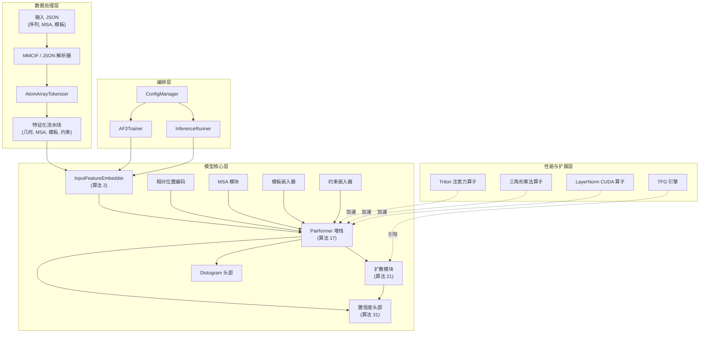
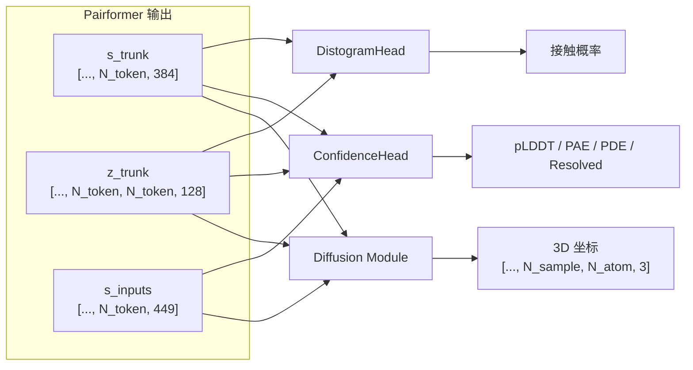
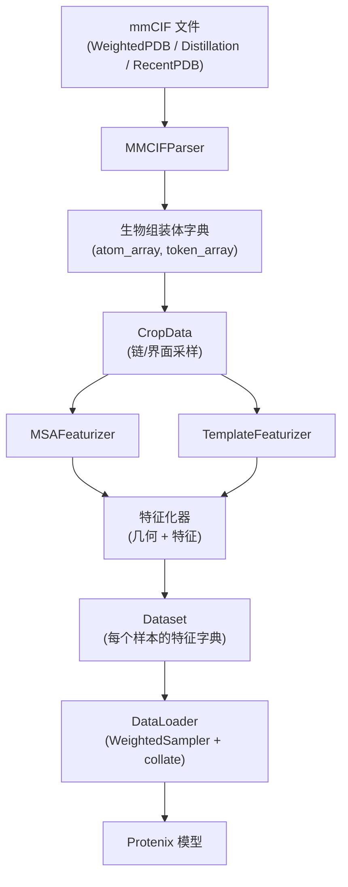

---
slug:8-architecture-overview
blog_type:normal
---


Protenix 是 AlphaFold3 级结构预测的开源实现，旨在根据序列输入预测蛋白质、核酸、小分子和离子的 3D 坐标。该系统采用**基于扩散的生成架构**，包含用于表征学习的 **Pairformer 主体**、用于生成坐标的**扩散模块**，以及用于质量评估的**置信度头部**。本页将整个代码库划分为四个架构层——模型核心、数据处理、训练/推理编排以及性能优化——在深入探讨各个子系统之前，为您提供一份宏观的导航蓝图。

## 系统架构概览

Protenix 系统可分解为四个交互层，每层都有明确的职责和模块边界：



**模型核心**将 AlphaFold3 算法套件实现为单个 `nn.Module` 子类；**数据层**将原始生物学输入转换为稠密张量特征；**编排层**管理训练/推理的整个生命周期，包括分布式设置和检查点保存；**性能层**则提供自定义的 CUDA/Triton 算子及无需训练的引导引擎，无需重新训练即可增强模型功能。

来源：[protenix.py](/protenix/model/protenix.py#L91-L169), [configs_base.py](/configs/configs_base.py#L23-L55), [train.py](/runner/train.py#L54-L71), [inference.py](/runner/inference.py#L64-L83)

## 模型核心：Protenix 模块

核心模型类 `Protenix(nn.Module)` 是训练和推理的**唯一入口**。它通过扁平化的配置对象实例化所有子模块，并暴露两个主要方法：用于循环主干的 `get_pairformer_output()`，以及用于完成端到端预测的 `_main_inference_loop()`。

### 子模块组成

| 子模块 | 类 | AF3 算法 | 用途 |
|-----------|-------|---------------|---------|
| 输入嵌入器 | `InputFeatureEmbedder` | 算法 2 | 通过 `AtomAttentionEncoder` 将每个原子的特征编码为 token 级表征 |
| 相对位置 | `RelativePositionEncoding` | — | 向对表征 `z` 添加位置和 token 键信息 |
| MSA 模块 | `MSAModule` | 算法 8-9 | 处理多序列比对特征，以更新对表征 |
| 模板嵌入器 | `TemplateEmbedder` | 算法 10-13 | 将结构模板信息整合到对表征中 |
| 约束嵌入器 | `ConstraintEmbedder` | — | 编码结构约束特征（如距离限制等） |
| Pairformer 堆栈 | `PairformerStack` | 算法 17 | 对单表征 `s` 和对表征 `z` 进行 N 个模块的迭代精炼 |
| 扩散模块 | `DiffusionModule` | 算法 21-23 | 生成 3D 原子坐标的条件扩散网络 |
| Distogram 头部 | `DistogramHead` | — | 预测用于计算接触概率的成对距离分布 |
| 置信度头部 | `ConfidenceHead` | 算法 31 | 预测 pLDDT、PAE、PDE 和分辨率置信度得分 |

模型首先通过 `InputFeatureEmbedder` 计算 `s_inputs`（449 维 token 嵌入），接着将 `s_init` 投影的外部和加上相对位置编码、token 键特征以及可选的约束特征，以此初始化对表征 `z`。该初始化结果随后被送入循环回路。

来源：[protenix.py](/protenix/model/protenix.py#L119-L169), [embedders.py](/protenix/model/modules/embedders.py#L28-L100)

### 循环主干

该主干通过**结构循环**机制运行——即进行 `N_cycle` 次迭代（基础模型默认为 10 次），在此过程中 Pairformer 堆栈会不断精炼单表征和对表征。关键在于，**在训练期间仅会在最后一次循环中计算梯度**，这一行为受 `torch.set_grad_enabled(self.training and (not self.train_confidence_only) and cycle_no == (N_cycle - 1))` 控制。该技术在保持迭代精炼所带来的表征优势的同时，将内存消耗降低了约 N_cycle 倍。每次循环都会依次执行模板嵌入、MSA 处理以及完整的 Pairformer 堆栈操作。

<CgxTip>循环层（`linear_no_bias_z_cycle` 和 `linear_no_bias_s`）被**初始化为零**，确保第一次循环的行为与零循环基准完全一致。这可以防止未经训练的表征反向流回主干，从而避免训练早期出现不稳定现象。</CgxTip>

来源：[protenix.py](/protenix/model/protenix.py#L170-L304)

### 从主干到坐标

当主干生成精炼后的 `s`（单）和 `z`（对）嵌入后，三个下游头部会并行工作：



**扩散模块**采用基于噪声水平调节的去噪网络（`DiffusionConditioning` + `DiffusionTransformer`），在 `N_step`（默认 200 次）时间步长内，迭代地将随机高斯噪声去噪转化为原子坐标，最终生成 `N_sample`（默认 5 个）独立的结构预测结果。推理阶段的噪声调度遵循 EDM 框架，参数配置为 `sigma_data=16.0`、`s_max=160.0`、`s_min=4e-4` 和 `rho=7`。

来源：[protenix.py](/protenix/model/protenix.py#L527-L598), [generator.py](/protenix/model/generator.py#L64-L120), [diffusion.py](/protenix/model/modules/diffusion.py#L31-L107)

## 数据处理架构

Protenix 维持着**两条平行的数据处理路径**：一条是消耗 PDB/mmCIF 文件（包含 MSA 和模板特征）的训练流水线；另一条是消耗用户提供的 JSON 文件的推理流水线。

### 训练数据流水线



`DataPipeline` 类利用 `biotite` 将 mmCIF 文件解析为 `AtomArray` 对象，通过 `AtomArrayTokenizer` 进行分词，并经过一系列特征化链路生成几何特征、MSA 特征和模板特征。`WeightedSampler` 负责控制训练分布，根据生物学相关性对链和界面样本进行加权采样。

来源：[data_pipeline.py](/protenix/data/pipeline/data_pipeline.py#L44-L100), [dataloader.py](/protenix/data/pipeline/dataloader.py#L31-L77)

### 推理数据流水线

推理路径（`SampleDictToFeatures`）将包含蛋白质链、DNA/RNA 序列和配体 SMILES 的用户 JSON 文件，转换为与训练过程相同的特征字典格式。它基于序列构建 `AtomArray` 对象，应用 `GeometryFeaturizer` 和 `ConstraintFeatureGenerator`，并最终输出供模型消费的完整 `input_feature_dict`。该路径支持可选的 MSA 搜索、模板搜索和约束特征，均可通过推理配置进行设置。

来源：[json_to_feature.py](/protenix/data/inference/json_to_feature.py#L37-L80), [configs_inference.py](/configs/configs_inference.py#L22-L39)

## 编排层：Runner

### AF3Trainer

`AF3Trainer` 类通过一系列初始化方法管理完整的训练生命周期：`init_env()`（CUDA/分布式环境设置）、`init_basics()`（目录创建）、`init_log()`（WandB 集成）、`init_model()`（Protenix 模型构建与 DDP 包装）、`init_loss()`（初始化包含 SmoothLDDTLoss 和扩散损失的 ProtenixLoss）以及 `init_data()`（DataLoader 构建）。训练过程支持梯度累积、EMA 检查点、激活检查点（`blocks_per_ckpt`），以及带有预热和周期性衰减的 AF3 专属学习率调度器。

<CgxTip>训练器支持在最终微调阶段使用 `train_confidence_only` 模式。该模式会冻结主干和扩散模块（设为 `eval()` 模式），并断言扩散/Distogram 损失的权重为零，从而确保梯度仅流向置信度头部。</CgxTip>

来源：[train.py](/runner/train.py#L54-L70), [configs_base.py](/configs/configs_base.py#L72-L96), [loss.py](/protenix/model/loss.py#L63-L100)

### InferenceRunner

`InferenceRunner` 遵循类似的初始化模式，但额外增加了检查点加载、用于输出序列化的 `DataDumper` 设置，以及基于 token 数量的动态分块大小选择机制。它负责处理输入的 JSON 文件，可选择性地执行 MSA/模板搜索，并最终输出预测结果（包括坐标、置信度得分 pLDDT/PAE/PDE 以及排名指标）。

来源：[inference.py](/runner/inference.py#L64-L150)

## 配置系统

Protenix 采用以 `ConfigManager` 为核心的**层次化配置系统**，它将默认配置、模型类型覆盖参数以及命令行参数合并为一个统一的 `ConfigDict`。该系统支持使用 `RequiredValue`、`GlobalConfigValue` 引用、`ValueMaybeNone` 可选项以及 `ListValue` 类型列表进行强类型配置。

| 配置来源 | 文件 | 作用范围 |
|--------------|------|-------|
| 基础配置 | `configs/configs_base.py` | 训练超参数、优化器、数据默认设置 |
| 数据配置 | `configs/configs_data.py` | 数据流水线设置（裁剪大小、ESM、重命名规则） |
| 模型类型配置 | `configs/configs_model_type.py` | 各模型变体的架构覆盖参数 |
| 推理配置 | `configs/configs_inference.py` | 仅推理相关设置（随机种子、输出目录、MSA/模板标志位） |

模型变体系统允许在基础模型维度之上，通过配置增量（Deltas）的形式定义不同的架构，例如 `protenix_base_default_v1.0.0`（3.68 亿参数）、`protenix-v2`（4.64 亿参数，`c_z=256`）以及 `protenix_tiny_default_v0.5.0`（1.1 亿参数）。

来源：[config.py](/protenix/config/config.py#L37-L121), [configs_model_type.py](/configs/configs_model_type.py#L22-L100), [configs_base.py](/configs/configs_base.py#L108-L175)

## 性能优化层

Protenix 集成了多种自定义计算算子和优化技术：

| 组件 | 后端选项 | 模块位置 |
|-----------|----------------|----------------|
| 三角形乘法 | `cuequivariance`, `torch` | `protenix/model/triangular/` |
| 三角形注意力 | `cuequivariance`, `deepspeed`, `torch` | `protenix/model/tri_attention/` |
| 层归一化 | `fast_layernorm` (自定义 CUDA), torch | `protenix/model/layer_norm/` |
| 融合 Dropout+Add | 自定义融合算子 | `protenix/model/modules/fused_ops.py` |
| 无训练引导 (TFG) | 基于梯度的导向控制 | `protenix/tfg/engine.py` |

特别值得一提的是 **TFG 引擎**——它无需任何模型重新训练，即可在扩散采样过程中应用基于能量的引导。该引擎支持去噪器路径引导（由 `rho` 控制）、直接的 x0 预测精炼（由 `mu` 控制），以及向约束流形的投影步骤，从而能够在推理阶段直接融入特定领域的结构性先验知识。

来源：[configs_base.py](/configs/configs_base.py#L128-L145), [engine.py](/protenix/tfg/engine.py#L1-L80), [generator.py](/protenix/model/generator.py#L123-L187)

## 仓库拓扑

```
protenix/
├── protenix/
│   ├── model/                    # 模型核心 (protenix.py, modules/, triangular/, tri_attention/, layer_norm/)
│   ├── data/                     # 数据流水线 (pipeline/, inference/, msa/, template/, constraint/, core/)
│   ├── config/                   # ConfigManager 与类型系统
│   ├── tfg/                      # 无训练引导引擎
│   ├── metrics/                  # lDDT, RMSD, clash 评估
│   ├── utils/                    # 分布式、几何、lr_scheduler、排列组合工具
│   └── web_service/              # 兼容 ColabFold 的 Web 接口
├── configs/                      # 配置定义 (base, data, model_type, inference)
├── runner/                       # 训练与推理编排 (train.py, inference.py)
├── scripts/                      # 数据准备、MSA 搜索、数据库生成
├── tests/                        # 单元测试与集成测试
└── docs/                         # 技术报告与文档
```

## 建议阅读路径

该架构可自然划分为循序渐进的学习序列。建议从**模型核心**入手以理解表征主干，接着研究**数据处理**了解输入如何流入模型，随后探索**训练/推理**编排，最后深入**性能优化**：

1. **模型架构**：[Pairformer 堆栈](9-pairformer-stack) → [扩散模块](10-diffusion-module) → [置信度头部](11-confidence-head) → [输入特征嵌入器](12-input-feature-embedder)
2. **数据处理**：[特征化流水线](13-featurization-pipeline) → [分词器与 AtomArray](14-tokenizer-and-atomarray) → [MSA 特征处理](15-msa-feature-processing) → [模板特征处理](16-template-feature-processing)
3. **训练与推理**：[训练 Runner](17-training-runner) → [推理 Runner](18-inference-runner) → [扩散采样与生成器](19-diffusion-sampling-and-generator) → [损失函数](20-loss-functions)
4. **性能与优化**：[自定义 Triton 注意力算子](21-custom-triton-attention-kernel) → [三角形乘法算子](22-triangular-multiplicative-operations) → [自定义 LayerNorm CUDA 算子](23-custom-layernorm-cuda-kernel) → [无训练引导引擎](24-training-free-guidance-engine)
5. **生态与扩展**：[约束特征](25-constraint-features) → [配置系统](26-configuration-system) → [指标评估](27-metrics-evaluation) → [Protenix 生态](28-protenix-ecosystem)