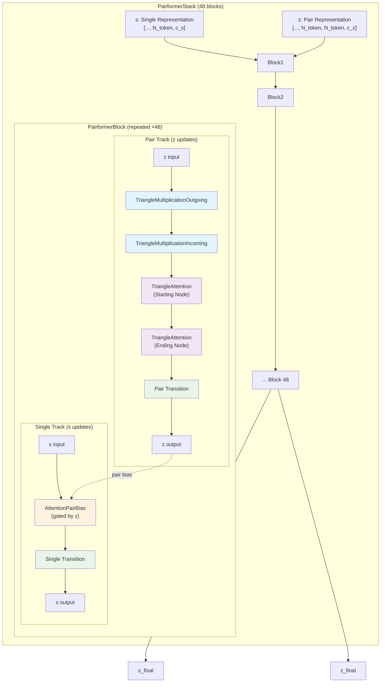
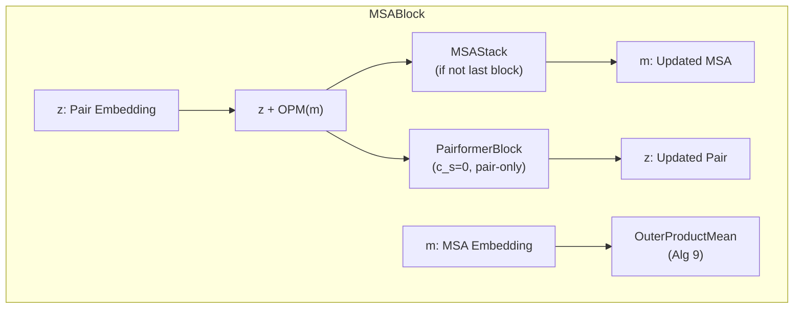

---
slug:9-pairformer-stack
blog_type:normal
---


Pairformer Stack 是 Protenix 表示学习流水线的架构核心，作为主要的推理引擎，它通过 48 个迭代块联合优化单通道（token 级别）和成对通道（token 对级别）的表示。每个模块执行一系列经过精心设计的几何推理操作——包括三角乘法更新、三角注意力机制以及带成对偏置的注意力机制——以便在成对表示中传播结构约束；同时，带有成对偏置的门控注意力机制在单通道和成对通道之间实现了双向耦合。本文将剖析该 Stack 的各个组件，从顶层的 `PairformerStack` 调度器深入到各个底层数学原语，并精确对应它们所实现的 AlphaFold 3 算法规范。

## 架构概述

Pairformer Stack 实现了 AlphaFold 3 论文中的 **Algorithm 17**。它接收两个张量作为输入：形状为 `[..., N_token, c_s]` 的单表示 `s` 和形状为 `[..., N_token, N_token, c_z]` 的成对表示 `z`，并通过一系列同质化模块对其进行迭代优化。该 Stack 不会改变张量的形状；它通过由三角更新规则和成对偏置注意力机制主导的信息交换，来转换两个表示的*内容*。



这里的核心架构洞见在于，成对通道会优先独立执行——它依次运行四个三角操作并对 `z` 进行一次 Transition，随后将*更新后的* `z` 馈入单通道的 `AttentionPairBias` 模块中。这种执行顺序确保了成对表示在调节作用于单表示的注意力分布之前，已经充分吸收了几何约束。在同一模块内，单通道的输出**不会**反馈回成对通道；双向耦合是跨越不同模块实现的，即第 *i* 块更新后的 `s` 会流入第 *i+1* 块，并通过注意力机制和动态转换间接影响后续的成对更新。

来源: [pairformer.py](/protenix/model/modules/pairformer.py#L42-L224), [pairformer.py](/protenix/model/modules/pairformer.py#L227-L340)

## PairformerStack：调度层

`PairformerStack` 类是 48 个 `PairformerBlock` 实例的容器和执行调度器。其设计重点考量了两个工程化问题：一是旨在提升训练期间内存效率的**梯度检查点**，二是用于推理阶段性能优化的**可配置底层算子**。

| 参数 | 默认值 | 作用 |
|---|---|---|
| `n_blocks` | 48 | 迭代优化模块的数量 |
| `n_heads` | 16 | `AttentionPairBias` 中的注意力头数 |
| `c_z` | 128 | 成对表示的通道维度 |
| `c_s` | 384 | 单表示的通道维度 |
| `num_intermediate_factor` | 4 | Transition 隐藏层的扩展系数 |
| `dropout` | 0.25 | 通过 `DropoutRowwise` 应用的 Dropout 比率 |
| `blocks_per_ckpt` | None | 每个梯度检查点包含的模块数（None = 不使用检查点） |
| `hidden_scale_up` | False | 三角隐藏层维度是否随 `c_z` 成比例缩放 |

`forward` 方法将执行逻辑委托给 `checkpoint_blocks` 函数。该工具函数会使用 `functools.partial` 绑定各个模块的所有非张量参数，然后选择性地将连续的模块归组至同一个激活检查点下。关键在于，当禁用梯度计算时（即 `torch.is_grad_enabled()` 返回 `False`），`blocks_per_ckpt` 参数将被强制设为 `None`，以确保推理过程绝不产生激活检查点带来的重复计算开销。

`hidden_scale_up` 标志控制着一项重要的架构变体：启用该标志时，系统会设置 `c_hidden_mul = c_z` 和 `no_heads_pair = c_z // c_hidden_pair_att`，以确保三角乘法隐藏层维度和三角注意力头数能与成对通道维度成正比缩放。这对于采用大于默认值 128 的 `c_z` 的模型十分关键。

来源: [pairformer.py](/protenix/model/modules/pairformer.py#L227-L340), [utils.py](/protenix/model/utils.py#L335-L339)

## PairformerBlock：核心优化单元

每个 `PairformerBlock` 实现了 AF3 的 Algorithm 17（第 2–8 行），执行包含七个子操作的固定计算图。该模块的构造函数将四种不同类型的组件拼接在一起，并在 `c_s > 0` 时有条件地实例化单通道的组件。

### 成对通道：三角操作

成对通道严格按照顺序执行四个三角操作，随后进行一次 Transition，以此来处理成对表示 `z`：

1. **TriangleMultiplicationOutgoing** — 实现 AF3 Algorithm 11。对于由节点 构成的每个三元组，它通过聚合来自出边 `z_ik` 和 `z_kj` 的投影乘积，来计算 `z_ij` 的更新值。这隐含了几何约束逻辑：如果节点 *i* 关联至 *k*，且 *k* 关联至 *j*，那么 *i* 也应当以乘法（组合）的方式关联至 *j*。

2. **TriangleMultiplicationIncoming** — 实现 AF3 Algorithm 12。作为前者的镜像操作：它聚合来自入边 `z_jk` 和 `z_ki` 的投影乘积，从而从相反方向强化一致性约束。

3. **TriangleAttention (Starting Node)** — 实现 AF3 Algorithm 13。在成对表示的“起始节点”轴上应用多头注意力机制，其中注意力权重是根据从该行特征中学习到的偏置计算得出的。

4. **TriangleAttention (Ending Node)** — 实现 AF3 Algorithm 14。计算逻辑与上一项一致，但应用于转置后的“终止节点”轴。在具体实现上，它通过在注意力计算前后对 `z` 进行转置，并复用参数为 `starting=True` 的 `TriangleAttention` 实例来完成。

5. **Pair Transition** — 扩展系数为 4 的 `Transition` 模块（AF3 Algorithm 11）。它实现了一个 SwiGLU 风格的前馈神经网络，对每个成对位置 `(i, j)` 独立施加相同的转换操作。

```mermaid
graph LR
    Z0["z"] --> TMO["tri_mul_out\n(Alg 11)"]
    TMO -->|"dropout + residual"| Z1["zʹ"]
    Z1 --> TMI["tri_mul_in\n(Alg 12)"]
    TMI -->|"dropout + residual"| Z2["zʹʹ"]
    Z2 --> TAS["tri_att_start\n(Alg 13)"]
    TAS -->|"dropout + residual"| Z3["zʹʹʹ"]
    Z3 -->|"transpose"| Z3t["zʹʹʹᵀ"]
    Z3t --> TAE["tri_att_end\n(Alg 14)"]
    TAE -->|"dropout + residual"| Z4t["zʹʹʹʹᵀ"]
    Z4t -->|"transpose"| Z4["zʹʹʹʹ"]
    Z4 --> PT["pair_transition\n(Alg 11 Trans.)"]
    PT -->|"residual"| Zfinal["z_output"]
    
    style TMO fill:#e1f5fe
    style TMI fill:#e1f5fe
    style TAS fill:#f3e5f5
    style TAE fill:#f3e5f5
    style PT fill:#e8f5e9
```



### 单通道：成对偏置注意力机制

当 `c_s > 0` 时，该模块还会通过以下两个操作处理单表示。这两个操作在*成对通道执行完毕后*才会运行：

1. **AttentionPairBias** — 实现 AF3 Algorithm 24。对 `s` 进行标准的多头自注意力计算，并在此基础上引入源自成对表示 `z` 的逐头偏置项。该偏置的计算过程是：先对 `z` 施加 LayerNorm，接着通过线性投影映射至 `n_heads` 维度，最后在各个注意力头上进行广播。由于该模块在此处使用 `has_s=False` 进行实例化，注意力机制会对输入施加简单的 `LayerNorm`（而非 AdaptiveLayerNorm），且输出由初始化偏置为 -2.0 的 `BiasInitLinear` 进行门控（遵循 AdaLN-Zero 初始化策略，确保在训练初期输出接近恒等映射）。

2. **Single Transition** — 扩展系数为 4 的 `Transition` 模块。

当 `PairformerBlock` 被用于 `MSABlock` 的成对处理逻辑中时，由于此时只需优化成对表示而无需耦合单表示，因此单通道会被省略（即 `c_s = 0`）。

来源: [pairformer.py](/protenix/model/modules/pairformer.py#L42-L224)

### 双重执行模式：训练 vs. 推理

`forward` 方法会根据 `inplace_safe` 的取值产生分支，提供两条在内存特性上截然不同的执行路径：

| 模式 | `inplace_safe` | 残差连接模式 | 内存占用 | 适用场景 |
|---|---|---|---|---|
| **标准模式** | `False` | `z = dropout_add_rowwise(z, update, p_drop, training)` | 较高（会具象化更新张量） | 训练 |
| **原地模式** | `True` | `z = tri_mul_out(z, _add_with_inplace=True)` 然后 `z += tri_att(...)` | 较低（原地累加） | 长序列推理 |

在标准模式下，每个三角操作会通过一个独立的张量输出结果，随后通过 `dropout_add_rowwise` 函数将其与残差连接融合——这种融合操作会在单个内核中完成 Dropout 和加法运算，从而避免了中间 Dropout 掩码张量的具象化。在原地模式下，三角乘法模块会接收 `_add_with_inplace=True` 参数，将残差加法直接融入其输出计算中；同时，注意力机制的更新结果会通过原地 `+=` 运算符进行应用。

<CgxTip>`inplace_safe` 路径绝不仅仅是一项微小的优化——仅针对三角乘法操作，它就能将相对于 `z` 本身的峰值内存占用从约 5 倍（标准模式）降低至约 2.5 倍（原地模式）。当 `N_token` 数以千计时，或者 `z` 的大小高达数 GB 时，这项优化显得尤为关键。请务必在推理阶段传入 `inplace_safe=True`，但在训练阶段绝不可这么做，因为梯度计算需要保留中间激活值。</CgxTip>

来源: [pairformer.py](/protenix/model/modules/pairformer.py#L138-L224), [fused_ops.py](/protenix/model/modules/fused_ops.py)

## 三角乘法更新操作

`TriangleMultiplicationOutgoing` 和 `TriangleMultiplicationIncoming` 类均继承自 `TriangleMultiplicativeUpdate`，两者的区别仅在于一个布尔值标志 `_outgoing`，该标志控制着 `_combine_projections` 中的维度排列模式。它们共同实现了 AF3 的 Algorithm 11 和 12。

### 数学公式

对于出边更新，计算过程如下。给定成对表示 `z ∈ ℝ^{N×N×c_z}` 和成对掩码 `m ∈ ℝ^{N×N}`：

1. **输入归一化**：`z̃ = LayerNorm_in(z)`
2. **门控投影**：对于每条边 `(i,j)`，计算两个门控投影：
   - `a_ij = σ(W_a^g · z̃_ij) ⊙ (W_a^p · z̃_ij) ⊙ m_ij`
   - `b_ij = σ(W_b^g · z̃_ij) ⊙ (W_b^p · z̃_ij) ⊙ m_ij`
3. **三角组合（出边）**：`p_ij = Σ_k a_ik ⊙ b_kj`（在适当的维度排列后通过批量矩阵乘法实现）
4. **输出归一化与门控**：`out_ij = σ(W_g · z̃_ij) ⊙ W_z · LayerNorm_out(p_ij)`

对于入边更新，步骤 3 会被替换为 `p_ij = Σ_k a_jk ⊙ b_ki`，这是通过在 `_combine_projections` 中交换排列索引来实现的。

### 算子后端选择

该模块通过 `triangle_multiplicative` 参数支持两种计算后端：

| 后端 | 值 | 描述 |
|---|---|---|
| **PyTorch 原生** | `"torch"` | 纯 PyTorch 实现，支持可选的原地推理路径 |
| **cuEquivariance** | `"cuequivariance"` | 基于 `cuequivariance_torch` 的融合算子，支持 JIT/AOT 自动调优 |

cuEquivariance 路径会路由至 `kernel_triangular_mult` 函数，进而调用 `cuequivariance_torch.primitives.triangle.triangle_multiplicative_update`。这种融合算子会直接接收从模块子层中预先提取的权重和偏置张量，并在一次调度中完成整个乘法更新操作。自动调优行为受 `CUEQ_TRITON_TUNING` 环境变量（设为 `"ONDEMAND"` 或 `"AOT"`）控制，其关键限制在于隐藏层维度必须是 32 的倍数。

<CgxTip>cuEquivariance 后端仅在 `c_z == c_hidden` 时可用。当 `c_z != c_hidden` 时（例如未设置 `hidden_scale_up=True` 但使用了非默认的 `c_z` 值），无论 `triangle_multiplicative` 设置如何，代码都会自动回退至 PyTorch 路径。</CgxTip>

### 原地推理路径

`_inference_forward` 方法实现了一种精密的分块算法，能将峰值内存占用从相当于 `z` 大小的 5 倍降至 2.5 倍。其工作原理是：仅完整地在内存中生成 "a" 投影，随后以分块的方式计算 "b" 及中间乘积。系统会维持一个宽度为 `z` 一半的 "z 缓存"，并在计算至中点时对其进行“重定向”，以恢复 `z` 中被覆盖的部分。这是一种纯粹的推理时优化方案——激活梯度无法流经这些原地操作。

来源: [triangular.py](/protenix/model/triangular/triangular.py#L93-L186), [triangular.py](/protenix/model/triangular/triangular.py#L199-L514), [triangular.py](/protenix/model/triangular/triangular.py#L573-L586)

## 三角注意力机制

`TriangleAttention` 模块实现了 AF3 的 Algorithm 13 和 14，它在成对表示的某一个轴上应用多头注意力机制。与标准注意力不同，其偏置项与位置相关，且是直接从输入特征中学习得来的。

前向传播分为四个阶段：

1. **轴选择**：如果 `starting=False`（即执行终止节点注意力），则沿成对轴对输入和掩码进行转置。
2. **LayerNorm 与偏置计算**：对成对张量施加 `LayerNorm`，随后计算逐行的学习偏置 `triangle_bias = Linear(x)`，生成形状为 `[..., I, J, no_heads]` 的张量，接着将其排列为 `[..., no_heads, I, J]`，并扩展维度至 `[..., 1, no_heads, I, J]`。
3. **掩码偏置**：计算 `mask_bias = inf * (mask - 1)` 以屏蔽无效位置，其形状被构造为 `[..., I, 1, 1, J]`。
4. **多头注意力**：执行 `Attention` 模块，同时传入上述掩码偏置和三角偏置。为优化内存占用，可选择通过 `chunk_layer` 沿 `I` 维度进行分块处理。

该模块通过向底层 `Attention.mha` 调用传递 `triangle_attention` 参数来支持多种算子后端：

| 值 | 后端 | 说明 |
|---|---|---|
| `"torch"` | PyTorch 原生 | 默认选项；具备完全的灵活性 |
| `"triattention"` | 自定义 Triton 算子 | 优化后的融合三角注意力机制；详见 [Custom Triton Attention Kernel](21-custom-triton-attention-kernel) |
| `"deepspeed"` | DeepSpeed 融合算子 | DeepSpeed 提供的优化版注意力实现 |

来源: [triangular.py](/protenix/model/triangular/triangular.py#L589-L727)

## AttentionPairBias：单通道与成对通道的耦合

`AttentionPairBias` 模块是实现成对表示调控单表示内部信息流的关键机制。它实现了 AF3 Algorithm 24，并在每个 `PairformerBlock` 中以 `has_s=False`、`create_offset_ln_z=True` 的参数进行实例化。

### 成对偏置计算

成对偏置是此项设计的核心创新。该模块并非简单地为每对位置添加一个标量偏置，而是通过将归一化后的成对表示投影至 `n_heads` 维度，计算出**逐头偏置**：

```python
bias = self.linear_nobias_z(self.layernorm_z(z))  # [..., N, N, n_heads]
bias = permute_final_dims(bias, [2, 0, 1])         # [..., n_heads, N, N]
```

随后，该偏置会在 Softmax 操作之前被直接加到注意力 logits 上。系统还通过 `enable_efficient_fusion` 提供了一条**高效融合**路径，该路径将 LayerNorm 缩放和线性投影融合为一次单一的 `F.conv2d` 操作：`weight = (linear_nobias_z.weight * layernorm_z.weight[None, :])[:, :, None, None]`，进而执行 `bias = F.conv2d(z, weight)`。这避免了中间归一化张量的显式生成。

### 门控与初始化

由于 PairformerBlock 在实例化时设置了 `has_s=False`，该模块会对输入施加 `LayerNorm`（而非 `AdaptiveLayerNorm`），且输出投影采用了 **AdaLN-Zero 初始化**策略：`BiasInitLinear` 门控的权重被初始化为零，偏置被初始化为 -2.0。在初始化阶段，`sigmoid(-2.0) ≈ 0.12`，这意味着注意力输出仅向残差流贡献约 12% 的量级，从而确保了模型在训练初期具有极高的稳定性。

来源: [transformer.py](/protenix/model/modules/transformer.py#L40-L254), [primitives.py](/protenix/model/modules/primitives.py#L104-L137)

## Transition 模块

`Transition` 模块（AF3 Algorithm 11）实现了一个 SwiGLU 风格的门控前馈神经网络。其计算逻辑看似简单，但在架构上至关重要——它会在每个模块内的三个位置被调用：一次用于成对表示（`pair_transition`），一次用于单表示（`single_transition`），以及有条件地应用于 MSA 模块的 MSA Stack 中。

前向传播计算过程如下：

```
x_norm = LayerNorm(x)
a = Linear_a(x_norm)  # [n * c_in]
b = Linear_b(x_norm)  # [n * c_in]
hidden = a * silu(b)   # 逐元素门控
out = Linear_out(hidden)  # [c_in]
return x + out          # 残差连接
```

这三个线性层采用了截然不同的初始化策略：`Linear_a` 和 `Linear_b` 使用 `initializer="relu"`（截断正态分布，scale=2.0），而 `Linear_out` 使用 `initializer="zeros"`（权重初始化为零）。这种设计确保了 Transition 在初始阶段的输出为零，使整个模块在初始化时表现为恒等映射。

来源: [primitives.py](/protenix/model/modules/primitives.py#L166-L230)

## 在 MSA 模块中的复用

`PairformerBlock` 并非 `PairformerStack` 所独享。它也会在 `MSABlock` 中以 `c_s=0` 的参数被实例化，作为 MSA 处理流水线中的**成对处理栈**组件。在这种配置下：

- 单通道被完全禁用（`self.c_s = 0` 导致 `AttentionPairBias` 和 `single_transition` 模块被整体跳过）。
- 系统仅执行四个三角操作和成对 Transition，利用几何约束来优化成对表示 `z`。
- 在此上下文中，成对表示的更新条件依赖于 MSA 表示 `m` 中的信息，这是在成对处理栈运行之前，通过 `OuterProductMean` 模块计算 MSA 嵌入外积对 `z` 的更新来实现的。

`MSABlock.forward` 遵循以下执行顺序：首先，`OuterProductMean` 利用 `m` 更新 `z`；接着，如果当前不是最后一个模块，`MSAStack` 会利用更新后的 `z` 来更新 `m`；最后，`PairformerBlock`（纯成对模式）进一步优化 `z`。最后一个 `MSABlock` 会跳过 MSA Stack，针对 `m` 返回 `None`，因为在完成最终的成对更新后，便不再需要 MSA 表示了。



这种设计展现了 `PairformerBlock` 作为成对优化原语的**组合复用能力**：它既可以作为完整的双通道模块运行（用于 `PairformerStack`），也可以作为纯成对模块运行（用于 `MSABlock`）。

来源: [pairformer.py](/protenix/model/modules/pairformer.py#L575-L679), [pairformer.py](/protenix/model/modules/pairformer.py#L682-L765)

## 可配置算子后端

`PairformerStack.forward` 和 `MSABlock.forward` 均可接收 `triangle_multiplicative` 和 `triangle_attention` 字符串参数，这些参数会层层向下传递给底层的各个三角操作模块。基于此，我们无需修改代码即可在每次推理时灵活选择已优化的算子。

| 操作 | 参数 | 可选项 |
|---|---|---|
| 三角乘法更新 | `triangle_multiplicative` | `"torch"`, `"cuequivariance"` |
| 三角注意力机制 | `triangle_attention` | `"torch"`, `"triattention"`, `"deepspeed"` |

这些参数通常在模型层级进行配置，并沿着模块层级架构向下传递。有关自定义 Triton 算子和 DeepSpeed 集成的详细讨论，请参阅 [Custom Triton Attention Kernel](21-custom-triton-attention-kernel)。有关三角乘法 CUDA 算子优化的内容，请参阅 [Triangular Multiplicative Operations](22-triangular-multiplicative-operations)。

来源: [pairformer.py](/protenix/model/modules/pairformer.py#L103-L136), [pairformer.py](/protenix/model/modules/pairformer.py#L291-L339)

## 模块依赖关系图

下表总结了 Pairformer Stack 内部的类层次结构与模块依赖关系：

| 类名 | 文件路径 | AF3 算法 | 作用 |
|---|---|---|---|
| `PairformerStack` | `modules/pairformer.py` | Alg 17 (Stack) | 调度器：48 个模块 + 检查点 |
| `PairformerBlock` | `modules/pairformer.py` | Alg 17 (Block) | 单个执行块：包含成对通道 + 单通道 |
| `TriangleMultiplicationOutgoing` | `triangular/triangular.py` | Alg 11 | 出边三角乘法更新 |
| `TriangleMultiplicationIncoming` | `triangular/triangular.py` | Alg 12 | 入边三角乘法更新 |
| `TriangleAttention` | `triangular/triangular.py` | Alg 13/14 | 起始/终止节点三角注意力 |
| `AttentionPairBias` | `modules/transformer.py` | Alg 24 | 带成对偏置的多头注意力 |
| `Transition` | `modules/primitives.py` | Alg 11 (Trans.) | SwiGLU 前馈网络 |
| `DropoutRowwise` | `triangular/layers.py` | — | 针对成对矩阵行的结构化 Dropout |
| `Linear` / `LinearNoBias` | `modules/primitives.py` | — | 自定义初始化的线性层 |
| `BiasInitLinear` | `modules/primitives.py` | — | 零权重、偏置可配置的线性层 |
| `LayerNorm` | `triangular/layers.py` | — | 自定义 LayerNorm（提供 CUDA 算子支持） |

## 本代码库中的相关模块

Pairformer Stack 与广泛的 Protenix 架构有着深度的内在联系。若需获取完整视角，请了解：

- **[Input Feature Embedder](12-input-feature-embedder)** — 生成供该 Stack 消费的初始 `s` 和 `z` 张量。
- **[Diffusion Module](10-diffusion-module)** — 将优化后的 `s` 和 `z` 输出用作结构生成的条件信号。
- **[Confidence Head](11-confidence-head)** — 使用最终的单表示来进行 Token 级别和成对级别的置信度预测。
- **[Custom LayerNorm CUDA Kernel](23-custom-layernorm-cuda-kernel)** — 该 Stack 中遍布的 `LayerNorm` 实例均受自定义 CUDA 算子的底层支持。
- **[Triangular Multiplicative Operations](22-triangular-multiplicative-operations)** — 针对 cuEquivariance 算子后端及内存优化策略的深入解析。