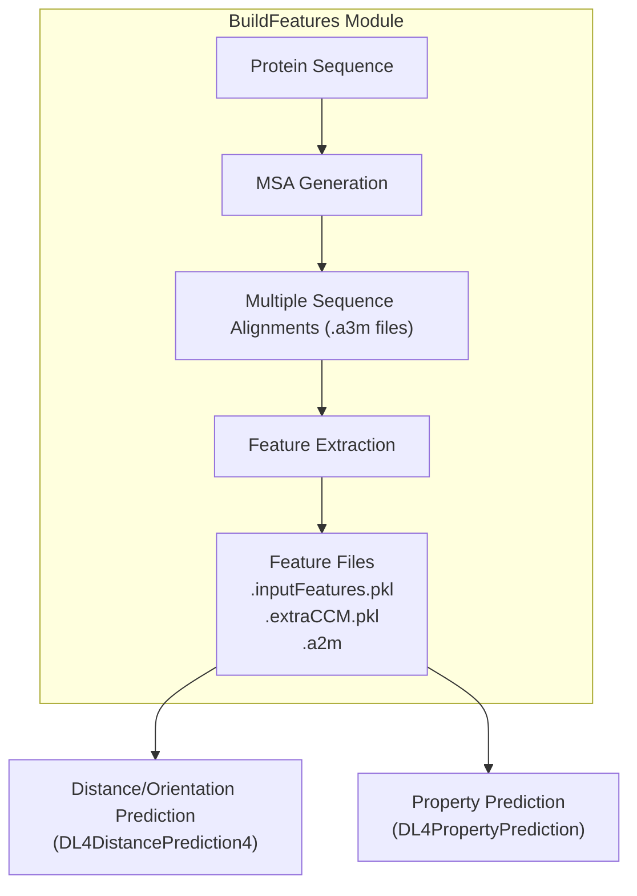
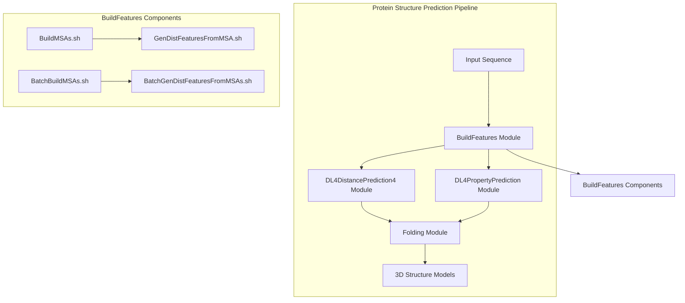
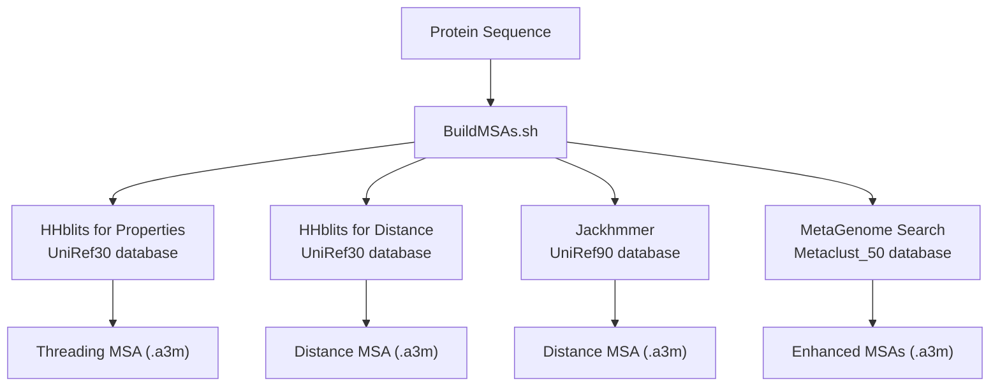
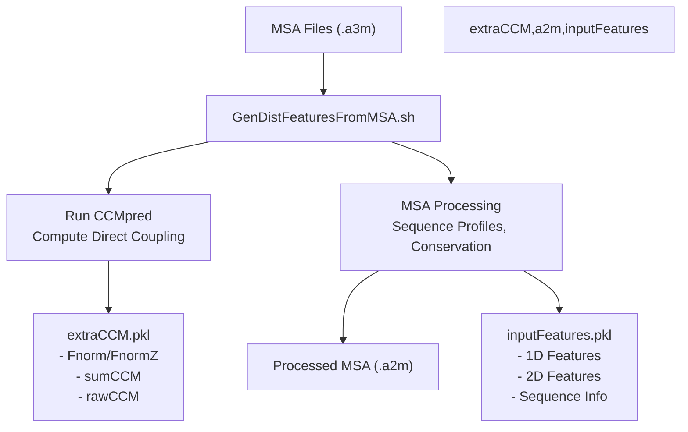
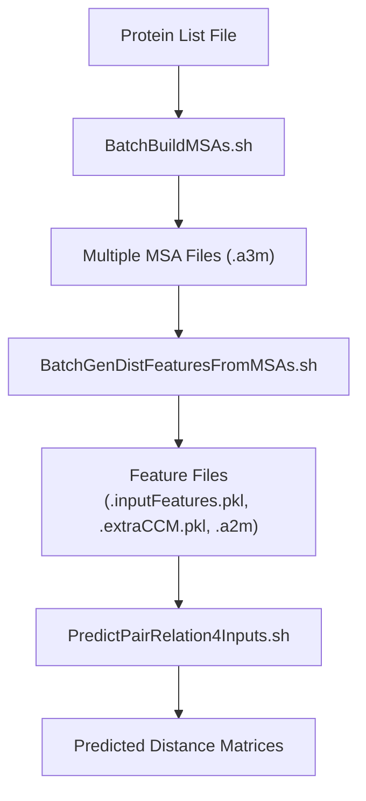

# BuildFeatures Module

> **Relevant source files**
> * [BuildFeatures/BatchGenDistFeaturesFromMSAs.sh](https://github.com/j3xugit/RaptorX-3DModeling/blob/22b58bc9/BuildFeatures/BatchGenDistFeaturesFromMSAs.sh)
> * [DL4DistancePrediction4/FeatureUtils.py](https://github.com/j3xugit/RaptorX-3DModeling/blob/22b58bc9/DL4DistancePrediction4/FeatureUtils.py)
> * [DL4DistancePrediction4/Scripts/PredictPairRelation4Inputs.sh](https://github.com/j3xugit/RaptorX-3DModeling/blob/22b58bc9/DL4DistancePrediction4/Scripts/PredictPairRelation4Inputs.sh)
> * [DL4DistancePrediction4/Utils/GenerateMetaData.py](https://github.com/j3xugit/RaptorX-3DModeling/blob/22b58bc9/DL4DistancePrediction4/Utils/GenerateMetaData.py)
> * [README.md](https://github.com/j3xugit/RaptorX-3DModeling/blob/22b58bc9/README.md?plain=1)
> * [raptorx-path.sh](https://github.com/j3xugit/RaptorX-3DModeling/blob/22b58bc9/raptorx-path.sh)

The BuildFeatures Module is the first major component in the RaptorX-3DModeling protein structure prediction pipeline. This module is responsible for generating multiple sequence alignments (MSAs) and extracting input features that will be used by the downstream prediction models.

The module serves as the data preparation foundation for the entire system, transforming raw protein sequences into rich feature representations that capture evolutionary information critical for accurate structure prediction.

For information about downstream distance and orientation prediction, see [DL4DistancePrediction4 Module](/j3xugit/RaptorX-3DModeling/4-dl4distanceprediction4-module). For property prediction (phi/psi angles, secondary structure), see [DL4PropertyPrediction Module](/j3xugit/RaptorX-3DModeling/5-dl4propertyprediction-module).

## Overview of the BuildFeatures Module

The BuildFeatures Module handles two primary tasks:

1. **MSA Generation**: Creating multiple sequence alignments using tools like HHblits and Jackhmmer
2. **Feature Extraction**: Converting MSAs into numerical features for deep learning models



Sources: [README.md L43-L44](https://github.com/j3xugit/RaptorX-3DModeling/blob/22b58bc9/README.md?plain=1#L43-L44)

 [README.md L228-L255](https://github.com/j3xugit/RaptorX-3DModeling/blob/22b58bc9/README.md?plain=1#L228-L255)

## Relationship to Overall System

The BuildFeatures Module is the starting point of the RaptorX-3DModeling pipeline, providing the foundation for all downstream structure prediction.



Sources: [README.md L43-L47](https://github.com/j3xugit/RaptorX-3DModeling/blob/22b58bc9/README.md?plain=1#L43-L47)

 [raptorx-path.sh L1-L4](https://github.com/j3xugit/RaptorX-3DModeling/blob/22b58bc9/raptorx-path.sh#L1-L4)

## MSA Generation

Multiple Sequence Alignments (MSAs) are critical for capturing evolutionary information about proteins. The BuildFeatures Module offers several methods to generate MSAs with different search tools and databases.

### MSA Generation Methods

The module supports multiple MSA generation approaches:



Sources: [README.md L228-L247](https://github.com/j3xugit/RaptorX-3DModeling/blob/22b58bc9/README.md?plain=1#L228-L247)

 [README.md L91-L116](https://github.com/j3xugit/RaptorX-3DModeling/blob/22b58bc9/README.md?plain=1#L91-L116)

### MSA Generation Scripts

The module provides several scripts for MSA generation:

1. **BuildMSAs.sh**: The main script for generating MSAs for a single protein * Can generate different types of MSAs based on command-line options * Creates MSAs for both property prediction and distance/orientation prediction
2. **BatchBuildMSAs.sh**: For generating MSAs for multiple proteins * Runs BuildMSAs.sh on each protein in a list

Example usage:

```markdown
# Generate MSAs for phi/psi and contact/distance prediction (without jackhmmer)BuildMSAs.sh -d ResultDir -m 9 SeqFile # Generate MSAs for phi/psi and contact/distance prediction (with metagenome data)BuildMSAs.sh -d ResultDir -m 25 SeqFile
```

Sources: [README.md L232-L246](https://github.com/j3xugit/RaptorX-3DModeling/blob/22b58bc9/README.md?plain=1#L232-L246)

## Feature Extraction

After MSA generation, the module extracts features that capture evolutionary information and sequence patterns required by the deep learning models.

### Feature Extraction Process



Sources: [DL4DistancePrediction4/FeatureUtils.py L11-L92](https://github.com/j3xugit/RaptorX-3DModeling/blob/22b58bc9/DL4DistancePrediction4/FeatureUtils.py#L11-L92)

 [README.md L250-L251](https://github.com/j3xugit/RaptorX-3DModeling/blob/22b58bc9/README.md?plain=1#L250-L251)

### Feature Extraction Scripts

The module provides several scripts for feature extraction:

1. **GenDistFeaturesFromMSA.sh**: Extracts features from a single MSA file * Generates `.inputFeatures.pkl`, `.extraCCM.pkl`, and `.a2m` files * Uses CCMpred (preferably with GPU acceleration) for direct coupling analysis
2. **BatchGenDistFeaturesFromMSAs.sh**: For extracting features from multiple MSAs * Processes MSAs for multiple proteins in parallel * Can distribute work across multiple GPUs

Example usage:

```python
# Generate features from one MSA fileGenDistFeaturesFromMSA.sh -o OutputDir MSAFile.a3m # Generate features from multiple MSA filesBatchGenDistFeaturesFromMSAs.sh -o ResultDir -n 3 proteinList.txt MSADir
```

Sources: [README.md L250-L251](https://github.com/j3xugit/RaptorX-3DModeling/blob/22b58bc9/README.md?plain=1#L250-L251)

 [BatchGenDistFeaturesFromMSAs.sh L1-L136](https://github.com/j3xugit/RaptorX-3DModeling/blob/22b58bc9/BatchGenDistFeaturesFromMSAs.sh#L1-L136)

## Feature Files and Their Contents

The BuildFeatures Module generates three key files for each protein:

### 1. inputFeatures.pkl

This is the primary feature file containing:

* Sequence-based (1D) features derived from MSA
* Pairwise (2D) features capturing residue-residue relationships
* Sequence information and metadata

### 2. extraCCM.pkl

This file contains additional coevolutionary information:

* `Fnorm`: Frobenius norm of the CCMpred matrix
* `FnormZ`: Z-score normalized Fnorm
* `sumCCM`: Summarized coevolutionary matrices
* `rawCCM`: Raw coevolutionary matrices from CCMpred

### 3. a2m

A processed version of the MSA in a2m format, used by some deep learning models.

The features are loaded and processed by the downstream prediction modules using utilities like `FeatureUtils.py`.

Sources: [DL4DistancePrediction4/FeatureUtils.py L11-L92](https://github.com/j3xugit/RaptorX-3DModeling/blob/22b58bc9/DL4DistancePrediction4/FeatureUtils.py#L11-L92)

 [DL4DistancePrediction4/Scripts/PredictPairRelation4Inputs.sh L30-L36](https://github.com/j3xugit/RaptorX-3DModeling/blob/22b58bc9/DL4DistancePrediction4/Scripts/PredictPairRelation4Inputs.sh#L30-L36)

## Feature Types

The features generated can be categorized into:

| Feature Type | Description | Used For |
| --- | --- | --- |
| Sequence Profiles | Amino acid frequencies at each position | Both distance and property prediction |
| Position-specific scoring matrix (PSSM) | Log-odds scores for amino acid substitutions | Both distance and property prediction |
| Coevolutionary features | Direct coupling between residue pairs | Distance/orientation prediction |
| Contact prediction from CCMpred | Initial contact predictions | Distance/orientation prediction |
| Secondary structure prediction | Predicted SS from MSA | Property prediction |
| Conservation scores | Sequence conservation metrics | Both prediction types |
| Location features | Positional information | Distance/orientation prediction |

Sources: [DL4DistancePrediction4/FeatureUtils.py L97-L158](https://github.com/j3xugit/RaptorX-3DModeling/blob/22b58bc9/DL4DistancePrediction4/FeatureUtils.py#L97-L158)

## Batch Processing

For large-scale predictions, the BuildFeatures Module provides batch processing capabilities:



Sources: [BatchGenDistFeaturesFromMSAs.sh L1-L136](https://github.com/j3xugit/RaptorX-3DModeling/blob/22b58bc9/BatchGenDistFeaturesFromMSAs.sh#L1-L136)

 [DL4DistancePrediction4/Scripts/PredictPairRelation4Inputs.sh L1-L201](https://github.com/j3xugit/RaptorX-3DModeling/blob/22b58bc9/DL4DistancePrediction4/Scripts/PredictPairRelation4Inputs.sh#L1-L201)

## Usage Examples

Here are some common usage examples for the BuildFeatures Module:

### 1. Generate MSAs for a Single Protein

```markdown
# For both phi/psi and distance prediction (without jackhmmer)BuildMSAs.sh -d ResultDir -m 9 proteinSequence.fasta # For both phi/psi and distance prediction (with metagenome data)BuildMSAs.sh -d ResultDir -m 25 proteinSequence.fasta
```

### 2. Generate Features from an MSA

```python
# Generate features from one MSA fileGenDistFeaturesFromMSA.sh -o OutputDir protein.a3m
```

### 3. Batch Processing Multiple Proteins

```python
# Generate MSAs for multiple proteinsBatchBuildMSAs.sh -d ResultDir -m 9 proteinList.txt # Generate features from multiple MSA filesBatchGenDistFeaturesFromMSAs.sh -o ResultDir -n 3 proteinList.txt MSADir
```

Sources: [README.md L228-L255](https://github.com/j3xugit/RaptorX-3DModeling/blob/22b58bc9/README.md?plain=1#L228-L255)

## Performance Considerations

When running the BuildFeatures Module, consider:

* **GPU Requirements**: CCMpred runs significantly faster on GPUs
* **Memory Usage**: Large proteins may require substantial memory, especially for feature extraction
* **Parallel Processing**: Batch scripts support parallel processing but be mindful of resource usage
* **Remote Execution**: Some tasks can be offloaded to remote machines with GPUs

Sources: [BatchGenDistFeaturesFromMSAs.sh L21-L30](https://github.com/j3xugit/RaptorX-3DModeling/blob/22b58bc9/BatchGenDistFeaturesFromMSAs.sh#L21-L30)

 [README.md L250-L251](https://github.com/j3xugit/RaptorX-3DModeling/blob/22b58bc9/README.md?plain=1#L250-L251)

## Integration with the Main Pipeline

While the individual scripts can be used separately, the BuildFeatures Module is typically invoked through the main RaptorXFolder.sh script, which orchestrates the entire prediction pipeline:

```markdown
# Run the complete pipeline including feature generationRaptorXFolder.sh -o outputDir proteinSequence.fasta
```

For detailed information on the main workflow, see [Main Workflow](/j3xugit/RaptorX-3DModeling/2-main-workflow).

Sources: [README.md L145-L151](https://github.com/j3xugit/RaptorX-3DModeling/blob/22b58bc9/README.md?plain=1#L145-L151)