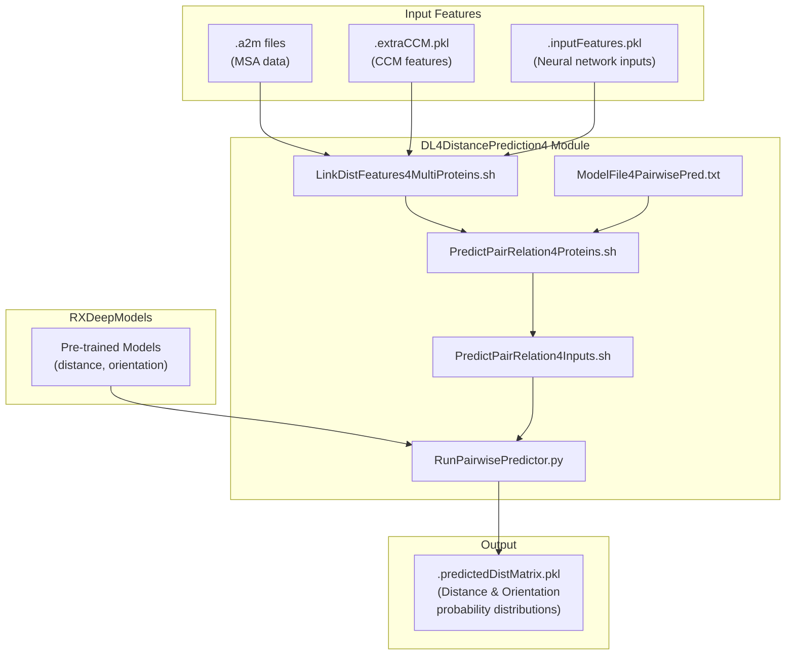
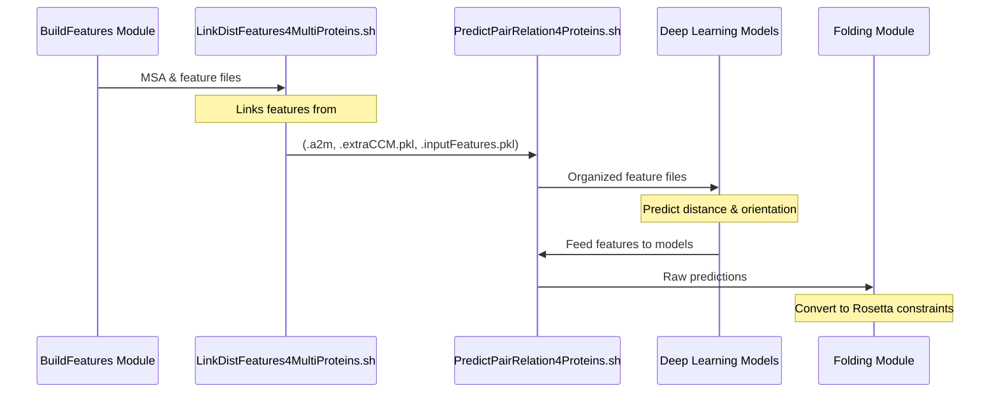
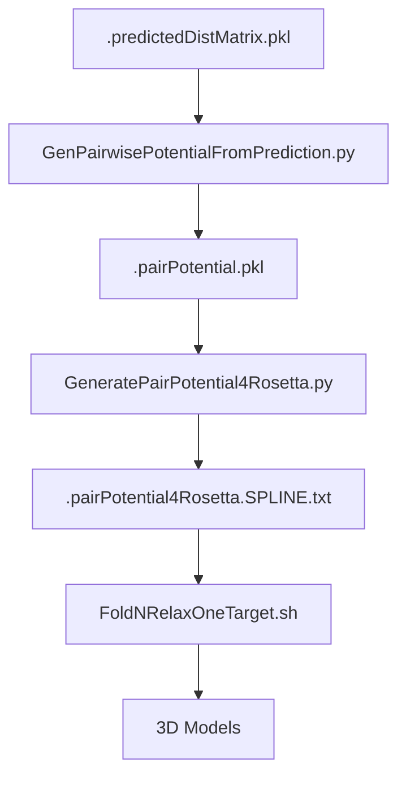

# DL4DistancePrediction4 Module

> **Relevant source files**
> * [DL4DistancePrediction4/Scripts/LinkDistFeatures4MultiProteins.sh](https://github.com/j3xugit/RaptorX-3DModeling/blob/22b58bc9/DL4DistancePrediction4/Scripts/LinkDistFeatures4MultiProteins.sh)
> * [DL4DistancePrediction4/Scripts/PredictPairRelation4Proteins.sh](https://github.com/j3xugit/RaptorX-3DModeling/blob/22b58bc9/DL4DistancePrediction4/Scripts/PredictPairRelation4Proteins.sh)
> * [Folding/Helpers/PrintModelQuality.sh](https://github.com/j3xugit/RaptorX-3DModeling/blob/22b58bc9/Folding/Helpers/PrintModelQuality.sh)
> * [Folding/Helpers/PrintModelQuality2.sh](https://github.com/j3xugit/RaptorX-3DModeling/blob/22b58bc9/Folding/Helpers/PrintModelQuality2.sh)
> * [Folding/Scripts4Rosetta/GenPotentialNFoldRelax.sh](https://github.com/j3xugit/RaptorX-3DModeling/blob/22b58bc9/Folding/Scripts4Rosetta/GenPotentialNFoldRelax.sh)
> * [Folding/Scripts4Rosetta/PrintJob4FoldNRelaxOneTarget.sh](https://github.com/j3xugit/RaptorX-3DModeling/blob/22b58bc9/Folding/Scripts4Rosetta/PrintJob4FoldNRelaxOneTarget.sh)
> * [Folding/Scripts4Rosetta/PrintJob4FoldNRelaxTargets.sh](https://github.com/j3xugit/RaptorX-3DModeling/blob/22b58bc9/Folding/Scripts4Rosetta/PrintJob4FoldNRelaxTargets.sh)

The DL4DistancePrediction4 module is a critical component of the RaptorX-3DModeling system that predicts inter-residue distances and orientations from protein sequence and alignment features. These predictions form the basis for generating accurate 3D protein models in the subsequent folding stage. This document explains the architecture, workflow, and usage of this module.

For information about local protein property prediction (secondary structure, phi/psi angles, etc.), see the [DL4PropertyPrediction Module](/j3xugit/RaptorX-3DModeling/5-dl4propertyprediction-module). For details on how the predicted distances are used to build 3D models, see the [Folding Module](/j3xugit/RaptorX-3DModeling/6-folding-module).

## Module Overview and Architecture

The DL4DistancePrediction4 module uses deep learning models to predict the distances and orientations between residue pairs in a protein. These predictions are represented as probability distributions over distance/orientation bins rather than single point estimates, providing more information for the folding process.



Sources: [DL4DistancePrediction4/Scripts/LinkDistFeatures4MultiProteins.sh](https://github.com/j3xugit/RaptorX-3DModeling/blob/22b58bc9/DL4DistancePrediction4/Scripts/LinkDistFeatures4MultiProteins.sh)

 [DL4DistancePrediction4/Scripts/PredictPairRelation4Proteins.sh](https://github.com/j3xugit/RaptorX-3DModeling/blob/22b58bc9/DL4DistancePrediction4/Scripts/PredictPairRelation4Proteins.sh)

## Data Flow and Processing

The module processes protein features through several stages to generate accurate distance and orientation predictions:



Sources: [DL4DistancePrediction4/Scripts/LinkDistFeatures4MultiProteins.sh](https://github.com/j3xugit/RaptorX-3DModeling/blob/22b58bc9/DL4DistancePrediction4/Scripts/LinkDistFeatures4MultiProteins.sh)

 [DL4DistancePrediction4/Scripts/PredictPairRelation4Proteins.sh](https://github.com/j3xugit/RaptorX-3DModeling/blob/22b58bc9/DL4DistancePrediction4/Scripts/PredictPairRelation4Proteins.sh)

## Key Scripts and Components

### LinkDistFeatures4MultiProteins.sh

This script organizes input feature files from multiple protein directories into a consolidated structure for batch prediction. It handles different MSA generation methods and can incorporate metagenome data if available.

**Key functionality:**

* Links `.a2m`, `.extraCCM.pkl`, and `.inputFeatures.pkl` files
* Supports multiple MSA methods (hhblits, jackhmmer, user-provided)
* Can process features with or without metagenome data

**Usage:**

```
LinkDistFeatures4MultiProteins.sh [ -M | -s MSAmethod | -d savefolder ] proteinListFile MetaDir
```

**Options:**

* `-M`: Do not use metagenome data
* `-s`: MSA method (0=hhblits, 1=jackhmmer, 2=both, 3=user-provided, 4=all)
* `-d`: Directory for saving linked features

Sources: [DL4DistancePrediction4/Scripts/LinkDistFeatures4MultiProteins.sh L1-L126](https://github.com/j3xugit/RaptorX-3DModeling/blob/22b58bc9/DL4DistancePrediction4/Scripts/LinkDistFeatures4MultiProteins.sh#L1-L126)

### PredictPairRelation4Proteins.sh

This script is the main entry point for predicting distances and orientations for multiple proteins. It calls the feature linking script, then runs the appropriate deep learning models.

**Key functionality:**

* Processes multiple proteins in batch mode
* Selects deep learning models based on configuration
* Supports various MSA generation methods
* Can incorporate template information (alignments and structures)

**Usage:**

```
PredictPairRelation4Proteins.sh [ -f DeepModelFile | -m ModelName | -d ResultDir | -g gpu | -s MSAmethod | -M ] proteinListFile metaFolder
```

**or with templates:**

```
PredictPairRelation4Proteins.sh [ -f DeepModelFile | -m ModelName | -d ResultDir | -g gpu | -s MSAmethod | -M | -T alignmentType ] proteinListFile metaFolder aliFolders tplFolder
```

**Options:**

* `-f`: File containing model configurations
* `-m`: Model name to use
* `-d`: Output directory
* `-g`: GPU selection
* `-s`: MSA method to use
* `-M`: Do not use metagenome data
* `-T`: Alignment type (for templates)

Sources: [DL4DistancePrediction4/Scripts/PredictPairRelation4Proteins.sh L1-L155](https://github.com/j3xugit/RaptorX-3DModeling/blob/22b58bc9/DL4DistancePrediction4/Scripts/PredictPairRelation4Proteins.sh#L1-L155)

## Deep Learning Models

The module uses several deep learning models to predict different aspects of protein structure:

### Model Types

| Model Name | Description | Application |
| --- | --- | --- |
| DefaultModel4FM | General-purpose model | Used when no templates are available |
| DefaultModel4HHP | Template-based model | Used with HHpred alignments |
| DefaultModel4NDT | Threading-based model | Used with RaptorX threading alignments |

The model architecture consists of deep convolutional neural networks that process 2D inputs (representing all pairs of residues) to predict:

1. Inter-residue distances (binned into intervals)
2. Inter-residue orientations (discretized angles)

Sources: [DL4DistancePrediction4/Scripts/PredictPairRelation4Proteins.sh L3-L6](https://github.com/j3xugit/RaptorX-3DModeling/blob/22b58bc9/DL4DistancePrediction4/Scripts/PredictPairRelation4Proteins.sh#L3-L6)

## Output Format and Interpretation

The main output of this module is `.predictedDistMatrix.pkl` files that contain:

1. Distance probability distributions: For each residue pair, probabilities across distance bins
2. Orientation probability distributions: Angular relationships between residue pairs
3. Confidence scores: Reliability estimates for each prediction

This information is used by the Folding module to generate constraints for Rosetta structure modeling.

## Integration with Folding Module

The distance and orientation predictions are passed to the Folding module, which converts them into constraints that guide the 3D structure modeling process.



The Folding module uses several scripts to process the distance predictions:

1. `GenPotentialNFoldRelax.sh`: Converts predictions to potentials and folds/relaxes the structure
2. `PrintJob4FoldNRelaxOneTarget.sh`: Prepares folding jobs for submission
3. `PrintJob4FoldNRelaxTargets.sh`: Processes multiple proteins

Sources: [Folding/Scripts4Rosetta/GenPotentialNFoldRelax.sh](https://github.com/j3xugit/RaptorX-3DModeling/blob/22b58bc9/Folding/Scripts4Rosetta/GenPotentialNFoldRelax.sh)

 [Folding/Scripts4Rosetta/PrintJob4FoldNRelaxOneTarget.sh](https://github.com/j3xugit/RaptorX-3DModeling/blob/22b58bc9/Folding/Scripts4Rosetta/PrintJob4FoldNRelaxOneTarget.sh)

 [Folding/Scripts4Rosetta/PrintJob4FoldNRelaxTargets.sh](https://github.com/j3xugit/RaptorX-3DModeling/blob/22b58bc9/Folding/Scripts4Rosetta/PrintJob4FoldNRelaxTargets.sh)

## Typical Workflow Example

The following example demonstrates a typical usage pattern for the DL4DistancePrediction4 module:

1. **Prepare a list of proteins to process**: Create a text file with one protein name per line (e.g., `protein_list.txt`)
2. **Ensure features are generated**: Run the BuildFeatures module to generate necessary input files
3. **Run the prediction**: ``` PredictPairRelation4Proteins.sh -d results -g 0 protein_list.txt features_folder ```
4. **Examine the output**: The results folder will contain `.predictedDistMatrix.pkl` files for each protein
5. **Proceed to folding**: Pass the prediction files to the Folding module to generate 3D structures

## Common Issues and Troubleshooting

* **Insufficient GPU memory**: If prediction crashes due to memory issues, try using a different GPU (`-g` option) or processing smaller proteins first
* **Missing features**: Ensure all required input files (`.a2m`, `.extraCCM.pkl`, `.inputFeatures.pkl`) are present in the expected locations
* **Model selection**: Different proteins may benefit from different model types; experiment with the `-m` option for challenging targets

## Conclusion

The DL4DistancePrediction4 module is a key component of the RaptorX-3DModeling system that transforms protein sequence and evolutionary information into spatial constraints. The accuracy of its predictions directly impacts the quality of the final 3D models generated by the Folding module.