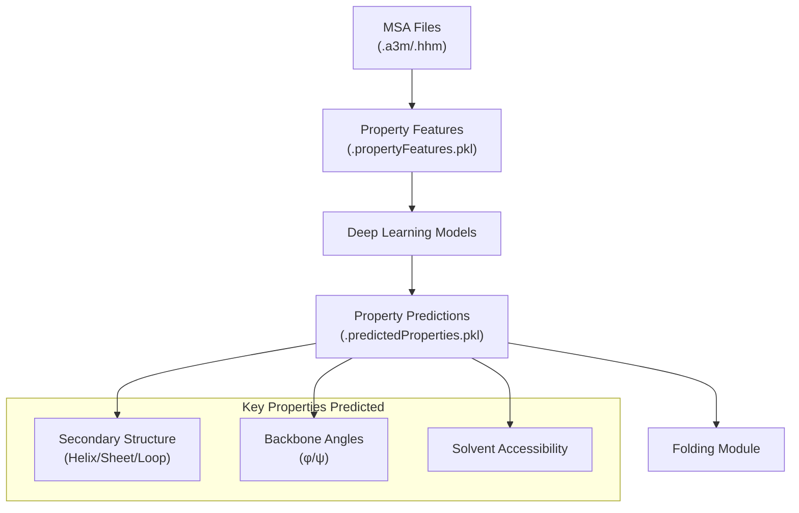
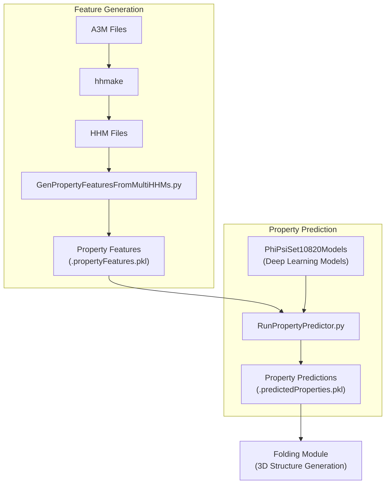
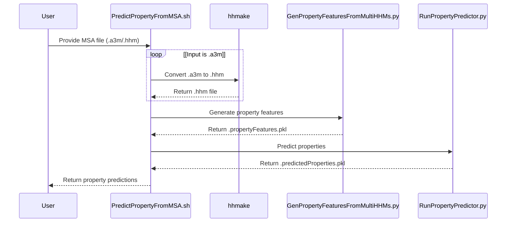
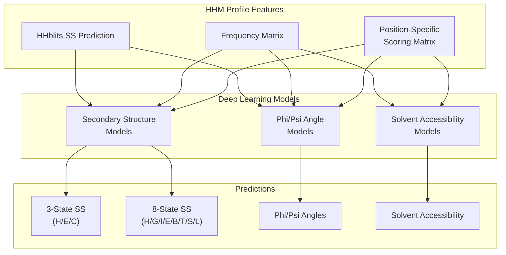
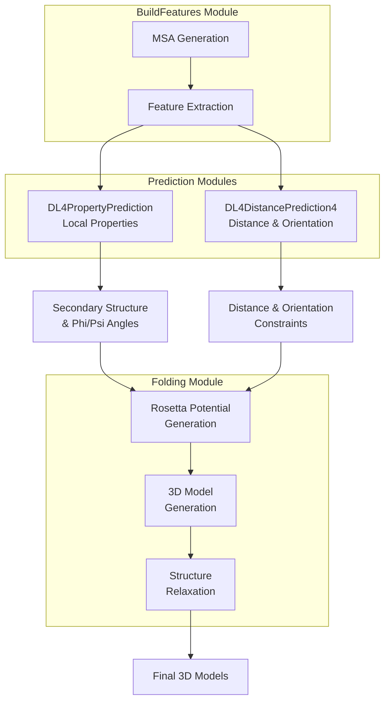

# DL4PropertyPrediction Module

> **Relevant source files**
> * [BuildFeatures/A3MToA2M.sh](https://github.com/j3xugit/RaptorX-3DModeling/blob/22b58bc9/BuildFeatures/A3MToA2M.sh)
> * [BuildFeatures/Helpers/BatchBuildMSA4DistPred.sh](https://github.com/j3xugit/RaptorX-3DModeling/blob/22b58bc9/BuildFeatures/Helpers/BatchBuildMSA4DistPred.sh)
> * [Common/LoadHHM.py](https://github.com/j3xugit/RaptorX-3DModeling/blob/22b58bc9/Common/LoadHHM.py)
> * [DL4DistancePrediction4/config.py](https://github.com/j3xugit/RaptorX-3DModeling/blob/22b58bc9/DL4DistancePrediction4/config.py)
> * [DL4PropertyPrediction/GenPropertyFeatures4Proteins.py](https://github.com/j3xugit/RaptorX-3DModeling/blob/22b58bc9/DL4PropertyPrediction/GenPropertyFeatures4Proteins.py)
> * [DL4PropertyPrediction/Scripts/CollectPropertyFeatures.sh](https://github.com/j3xugit/RaptorX-3DModeling/blob/22b58bc9/DL4PropertyPrediction/Scripts/CollectPropertyFeatures.sh)
> * [DL4PropertyPrediction/Scripts/PredictPropertyFromMSA.sh](https://github.com/j3xugit/RaptorX-3DModeling/blob/22b58bc9/DL4PropertyPrediction/Scripts/PredictPropertyFromMSA.sh)
> * [DL4PropertyPrediction/Scripts/PredictPropertyFromMSAs.sh](https://github.com/j3xugit/RaptorX-3DModeling/blob/22b58bc9/DL4PropertyPrediction/Scripts/PredictPropertyFromMSAs.sh)
> * [DL4PropertyPrediction/Scripts/PredictPropertyLocal.sh](https://github.com/j3xugit/RaptorX-3DModeling/blob/22b58bc9/DL4PropertyPrediction/Scripts/PredictPropertyLocal.sh)
> * [Folding/Scripts4Rosetta/FoldNRelaxTargets.sh](https://github.com/j3xugit/RaptorX-3DModeling/blob/22b58bc9/Folding/Scripts4Rosetta/FoldNRelaxTargets.sh)

The DL4PropertyPrediction module is responsible for predicting protein local structural properties from Multiple Sequence Alignments (MSAs). These properties include secondary structure (SS), solvent accessibility (ACC), and backbone torsion angles (φ/ψ). These local structural property predictions complement the distance and orientation predictions from the [DL4DistancePrediction4 Module](/j3xugit/RaptorX-3DModeling/4-dl4distanceprediction4-module) and are used together in the [Folding Module](/j3xugit/RaptorX-3DModeling/6-folding-module) to generate accurate 3D protein models.

## 1. Overview

The DL4PropertyPrediction module uses deep learning models to predict a variety of local structural properties that define the local conformations of amino acid residues in a protein chain. Unlike the distance prediction module that focuses on residue-residue interactions, this module concentrates on individual residue properties.



Sources:

* [DL4PropertyPrediction/Scripts/PredictPropertyFromMSA.sh L1-L102](https://github.com/j3xugit/RaptorX-3DModeling/blob/22b58bc9/DL4PropertyPrediction/Scripts/PredictPropertyFromMSA.sh#L1-L102)
* [DL4PropertyPrediction/Scripts/PredictPropertyLocal.sh L1-L107](https://github.com/j3xugit/RaptorX-3DModeling/blob/22b58bc9/DL4PropertyPrediction/Scripts/PredictPropertyLocal.sh#L1-L107)

## 2. Module Architecture

The DL4PropertyPrediction module consists of two main components:

1. **Feature Generation System**: Extracts features from MSAs that can be used by deep learning models
2. **Property Prediction System**: Uses deep learning models to predict local structural properties from these features



Sources:

* [DL4PropertyPrediction/Scripts/CollectPropertyFeatures.sh L1-L92](https://github.com/j3xugit/RaptorX-3DModeling/blob/22b58bc9/DL4PropertyPrediction/Scripts/CollectPropertyFeatures.sh#L1-L92)
* [DL4PropertyPrediction/Scripts/PredictPropertyLocal.sh L1-L107](https://github.com/j3xugit/RaptorX-3DModeling/blob/22b58bc9/DL4PropertyPrediction/Scripts/PredictPropertyLocal.sh#L1-L107)

## 3. Workflow

### 3.1 Input Preparation

The workflow begins with MSA files in either `.a3m` or `.hhm` format. If `.a3m` files are provided, they are first converted to `.hhm` files using the `hhmake` utility from the HH-suite package.



Sources:

* [DL4PropertyPrediction/Scripts/PredictPropertyFromMSA.sh L64-L87](https://github.com/j3xugit/RaptorX-3DModeling/blob/22b58bc9/DL4PropertyPrediction/Scripts/PredictPropertyFromMSA.sh#L64-L87)
* [BuildFeatures/A3MToA2M.sh L56-L64](https://github.com/j3xugit/RaptorX-3DModeling/blob/22b58bc9/BuildFeatures/A3MToA2M.sh#L56-L64)

### 3.2 Feature Generation

The property feature generation process extracts information from the HHM profile, which contains position-specific scoring matrices (PSSMs) and other evolutionary information. The key features include:

* Position-specific amino acid frequencies
* Position-specific scoring matrix values
* Secondary structure predictions from HHblits
* Conservation scores

These features are stored in a `.propertyFeatures.pkl` file for use in the prediction step.

Sources:

* [DL4PropertyPrediction/GenPropertyFeatures4Proteins.py L1-L64](https://github.com/j3xugit/RaptorX-3DModeling/blob/22b58bc9/DL4PropertyPrediction/GenPropertyFeatures4Proteins.py#L1-L64)
* [Common/LoadHHM.py L7-L15](https://github.com/j3xugit/RaptorX-3DModeling/blob/22b58bc9/Common/LoadHHM.py#L7-L15)

### 3.3 Property Prediction

The property prediction utilizes deep learning models defined in the model configuration file (by default, `ModelFile4PropertyPred.txt`). The default model set is `PhiPsiSet10820Models`, which includes models for predicting:

1. Secondary structure (3-state and 8-state)
2. Phi/Psi angles
3. Solvent accessibility



Sources:

* [DL4PropertyPrediction/Scripts/PredictPropertyLocal.sh L66-L102](https://github.com/j3xugit/RaptorX-3DModeling/blob/22b58bc9/DL4PropertyPrediction/Scripts/PredictPropertyLocal.sh#L66-L102)

## 4. Command-Line Interface

The module provides several scripts for property prediction:

### 4.1 Single Protein Prediction

To predict properties for a single protein from its MSA:

```
PredictPropertyFromMSA.sh [-f DeepModelFile] [-m ModelName] [-d ResultDir] [-g gpu] MSAfile
```

**Key Parameters:**

* `MSAfile`: An MSA file in `.a3m` or `.hhm` format
* `-f`: Deep model file (default: `$DL4PropertyPredHome/params/ModelFile4PropertyPred.txt`)
* `-m`: Model name defined in the deep model file (default: `PhiPsiSet10820Models`)
* `-d`: Result directory (default: current directory)
* `-g`: GPU ID (-1 for auto-selection, 0-3 for specific GPU)

Sources:

* [DL4PropertyPrediction/Scripts/PredictPropertyFromMSA.sh L20-L30](https://github.com/j3xugit/RaptorX-3DModeling/blob/22b58bc9/DL4PropertyPrediction/Scripts/PredictPropertyFromMSA.sh#L20-L30)

### 4.2 Batch Prediction

For multiple proteins:

```
PredictPropertyFromMSAs.sh [-f DeepModelFile] [-m ModelName] [-d ResultDir] [-g gpu] proteinListFile hhmFolder/a3mFolder
```

**Key Parameters:**

* `proteinListFile`: File containing protein names, one per line
* `hhmFolder/a3mFolder`: Folder containing MSA files for the proteins

Sources:

* [DL4PropertyPrediction/Scripts/PredictPropertyFromMSAs.sh L18-L29](https://github.com/j3xugit/RaptorX-3DModeling/blob/22b58bc9/DL4PropertyPrediction/Scripts/PredictPropertyFromMSAs.sh#L18-L29)

### 4.3 Feature Generation Only

To generate features without prediction:

```
CollectPropertyFeatures.sh proteinName rootDir [resultDir [MSA_mode]]
```

**Key Parameters:**

* `proteinName`: Name of the protein
* `rootDir`: Folder containing MSA information
* `resultDir`: Output directory (default: `RootDir/PropertyPred/`)
* `MSA_mode`: Which MSAs to use (all, uce3, ure5, or user)

Sources:

* [DL4PropertyPrediction/Scripts/CollectPropertyFeatures.sh L3-L9](https://github.com/j3xugit/RaptorX-3DModeling/blob/22b58bc9/DL4PropertyPrediction/Scripts/CollectPropertyFeatures.sh#L3-L9)

## 5. Output Format

The prediction results are saved in a `.predictedProperties.pkl` file, which contains a Python dictionary with the following key information:

| Key | Description |
| --- | --- |
| `name` | Protein name |
| `sequence` | Amino acid sequence |
| `PSSM` | Position-specific scoring matrix |
| `SS3_prob` | Probabilities for 3-state secondary structure |
| `SS8_prob` | Probabilities for 8-state secondary structure |
| `SS3_pred` | Predicted 3-state secondary structure |
| `SS8_pred` | Predicted 8-state secondary structure |
| `ACC_pred` | Predicted solvent accessibility |
| `phi_pred` | Predicted phi angles |
| `psi_pred` | Predicted psi angles |

Secondary structure states:

* 3-state: H (helix), E (strand), C (coil)
* 8-state: H (alpha-helix), G (3-10 helix), I (pi-helix), E (strand), B (beta-bridge), T (turn), S (bend), L (loop)

Sources:

* [DL4PropertyPrediction/Scripts/PredictPropertyLocal.sh L97-L106](https://github.com/j3xugit/RaptorX-3DModeling/blob/22b58bc9/DL4PropertyPrediction/Scripts/PredictPropertyLocal.sh#L97-L106)

## 6. Integration with Other Modules

The property predictions from this module play a crucial role in the protein structure prediction pipeline:



Key integration points:

1. **Input from BuildFeatures**: The DL4PropertyPrediction module uses MSAs generated by the BuildFeatures module.
2. **Output to Folding**: Property predictions, especially secondary structure and phi/psi angles, guide the Folding module in generating accurate 3D models by providing local conformational constraints.
3. **Complementary to Distance Prediction**: While the DL4DistancePrediction4 module provides information about residue-residue interactions, DL4PropertyPrediction focuses on individual residue properties, providing complementary information for accurate structure prediction.

Sources:

* [Folding/Scripts4Rosetta/FoldNRelaxTargets.sh L67-L131](https://github.com/j3xugit/RaptorX-3DModeling/blob/22b58bc9/Folding/Scripts4Rosetta/FoldNRelaxTargets.sh#L67-L131)

## 7. Environmental Requirements

The DL4PropertyPrediction module requires the following environmental setup:

1. **Environment Variables**: * `DL4PropertyPredHome`: Installation directory of DL4PropertyPrediction * `DistFeatureHome`: Installation directory of BuildFeatures * `CUDA_ROOT`: Path to CUDA installation (for GPU acceleration)
2. **Dependencies**: * HH-suite tools (e.g., `hhmake`) * CUDA libraries (for GPU acceleration) * Python with Theano and required packages

Sources:

* [DL4PropertyPrediction/Scripts/PredictPropertyLocal.sh L85-L93](https://github.com/j3xugit/RaptorX-3DModeling/blob/22b58bc9/DL4PropertyPrediction/Scripts/PredictPropertyLocal.sh#L85-L93)
* [DL4PropertyPrediction/Scripts/PredictPropertyFromMSA.sh L5-L13](https://github.com/j3xugit/RaptorX-3DModeling/blob/22b58bc9/DL4PropertyPrediction/Scripts/PredictPropertyFromMSA.sh#L5-L13)