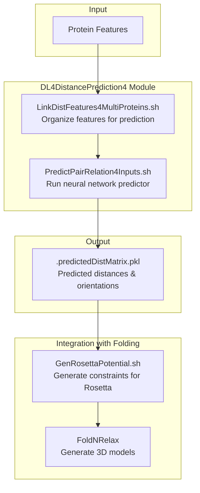
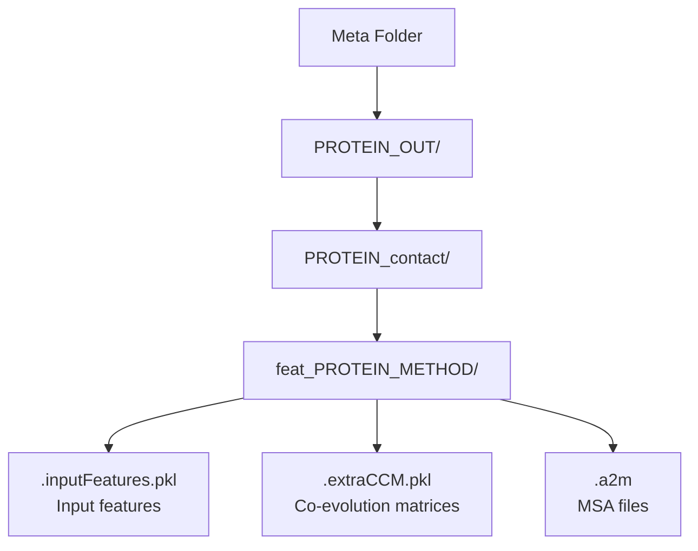
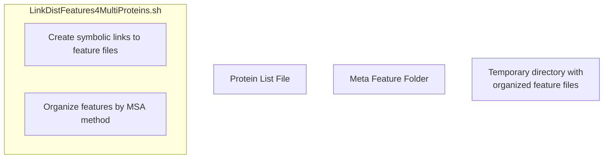
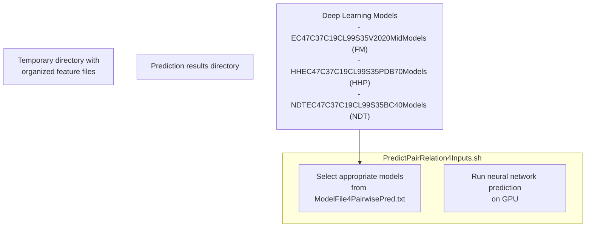
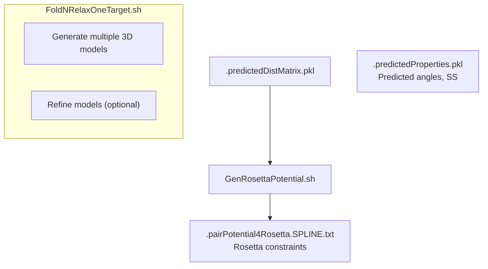

# Distance Prediction Workflow

> **Relevant source files**
> * [DL4DistancePrediction4/ParseCommandLine.py](https://github.com/j3xugit/RaptorX-3DModeling/blob/22b58bc9/DL4DistancePrediction4/ParseCommandLine.py)
> * [DL4DistancePrediction4/Scripts/PredictPairRelation4Proteins.sh](https://github.com/j3xugit/RaptorX-3DModeling/blob/22b58bc9/DL4DistancePrediction4/Scripts/PredictPairRelation4Proteins.sh)
> * [DL4DistancePrediction4/TrainDistancePredictor.py](https://github.com/j3xugit/RaptorX-3DModeling/blob/22b58bc9/DL4DistancePrediction4/TrainDistancePredictor.py)
> * [Folding/Scripts4Rosetta/GenPotentialNFoldRelax.sh](https://github.com/j3xugit/RaptorX-3DModeling/blob/22b58bc9/Folding/Scripts4Rosetta/GenPotentialNFoldRelax.sh)
> * [Folding/Scripts4Rosetta/PrintJob4FoldNRelaxOneTarget.sh](https://github.com/j3xugit/RaptorX-3DModeling/blob/22b58bc9/Folding/Scripts4Rosetta/PrintJob4FoldNRelaxOneTarget.sh)
> * [Folding/Scripts4Rosetta/PrintJob4FoldNRelaxTargets.sh](https://github.com/j3xugit/RaptorX-3DModeling/blob/22b58bc9/Folding/Scripts4Rosetta/PrintJob4FoldNRelaxTargets.sh)

This page documents the workflow for predicting inter-residue distances and orientations within the DL4DistancePrediction4 module of the RaptorX-3DModeling system. Distance and orientation predictions provide crucial spatial constraints that guide the 3D model generation in the Folding module. For information about the model architecture and training process, see [Model Architecture and Training](/j3xugit/RaptorX-3DModeling/4.2-model-architecture-and-training).

## Workflow Overview

The distance prediction workflow takes protein features (generated by the BuildFeatures module) as input and produces predicted distance matrices and orientation information as output. These predictions are then used by the Folding module to generate 3D protein models.

### Distance Prediction Workflow Diagram



Sources: [DL4DistancePrediction4/Scripts/PredictPairRelation4Proteins.sh L1-L155](https://github.com/j3xugit/RaptorX-3DModeling/blob/22b58bc9/DL4DistancePrediction4/Scripts/PredictPairRelation4Proteins.sh#L1-L155)

## Input Requirements

The distance prediction workflow requires the following inputs:

1. **Protein List File**: A text file containing a list of protein names, one per line
2. **Feature Directory**: A directory containing protein features organized in specific subfolders
3. **Optional Template Information**: For template-based prediction, alignment files and template structures can be provided

### Feature Organization Structure



Sources: [DL4DistancePrediction4/Scripts/PredictPairRelation4Proteins.sh L25-L29](https://github.com/j3xugit/RaptorX-3DModeling/blob/22b58bc9/DL4DistancePrediction4/Scripts/PredictPairRelation4Proteins.sh#L25-L29)

## Prediction Process

The prediction workflow is primarily managed by the `PredictPairRelation4Proteins.sh` script, which handles the entire process from feature preparation to final predictions.

### 1. Feature Preparation

Features are first organized using the `LinkDistFeatures4MultiProteins.sh` script, which creates symbolic links to the necessary feature files and prepares them for prediction:



The script supports different MSA methods:

* HHblits (method 0)
* Jackhmmer (method 1)
* User-provided MSA (method 3)
* All methods combined (method 4, default)

Optional meta-genome data can be included for improved predictions.

Sources: [DL4DistancePrediction4/Scripts/PredictPairRelation4Proteins.sh L115-L127](https://github.com/j3xugit/RaptorX-3DModeling/blob/22b58bc9/DL4DistancePrediction4/Scripts/PredictPairRelation4Proteins.sh#L115-L127)

### 2. Model Selection and Prediction

After feature preparation, the script selects appropriate deep learning models and runs the prediction:



The script uses different models based on the input type:

* For sequence-only prediction (FM mode): `EC47C37C19CL99S35V2020MidModels`
* For template-based prediction with HHpred alignments: `HHEC47C37C19CL99S35PDB70Models`
* For template-based prediction with threading alignments: `NDTEC47C37C19CL99S35BC40Models`

Sources: [DL4DistancePrediction4/Scripts/PredictPairRelation4Proteins.sh L3-L6](https://github.com/j3xugit/RaptorX-3DModeling/blob/22b58bc9/DL4DistancePrediction4/Scripts/PredictPairRelation4Proteins.sh#L3-L6)

 [DL4DistancePrediction4/Scripts/PredictPairRelation4Proteins.sh L135-L151](https://github.com/j3xugit/RaptorX-3DModeling/blob/22b58bc9/DL4DistancePrediction4/Scripts/PredictPairRelation4Proteins.sh#L135-L151)

## Output Files

The primary output from the distance prediction workflow is a PKL file containing the predicted distance matrix and orientation information:

| File | Description |
| --- | --- |
| `*.predictedDistMatrix.pkl` | Contains predictions for inter-residue distances and orientations |

The predicted distance matrix contains the following information:

* Probability distributions for different distance ranges between residue pairs
* Orientation information for residue pairs (Cα-Cα-Cβ-Cβ dihedral angles, etc.)
* Confidence scores for the predictions

This output serves as input to the Folding module for 3D structure generation.

Sources: [DL4DistancePrediction4/TrainDistancePredictor.py L730-L743](https://github.com/j3xugit/RaptorX-3DModeling/blob/22b58bc9/DL4DistancePrediction4/TrainDistancePredictor.py#L730-L743)

## Integration with Folding

The distance predictions are used by the Folding module to generate 3D protein models. This involves converting the predicted distance matrices into constraints that can be used by the Rosetta molecular modeling software.



The conversion of distance predictions to Rosetta constraints is handled by the `GenRosettaPotential.sh` script, which creates a constraint file in Rosetta's SPLINE format. The `FoldNRelaxOneTarget.sh` script then uses these constraints along with predicted properties (from the DL4PropertyPrediction module) to generate 3D models.

Sources: [Folding/Scripts4Rosetta/PrintJob4FoldNRelaxOneTarget.sh L1-L97](https://github.com/j3xugit/RaptorX-3DModeling/blob/22b58bc9/Folding/Scripts4Rosetta/PrintJob4FoldNRelaxOneTarget.sh#L1-L97)

 [Folding/Scripts4Rosetta/GenPotentialNFoldRelax.sh L1-L144](https://github.com/j3xugit/RaptorX-3DModeling/blob/22b58bc9/Folding/Scripts4Rosetta/GenPotentialNFoldRelax.sh#L1-L144)

## Command-Line Options

The main prediction script (`PredictPairRelation4Proteins.sh`) supports several command-line options for customizing the prediction process:

| Option | Description |
| --- | --- |
| `-f` | Specify a file containing deep model names |
| `-m` | Specify a model name defined in the deep model file |
| `-d` | Specify the directory for saving results |
| `-g` | Specify GPU ID (-1 for auto-selection, 0-3 for specific GPU) |
| `-s` | Specify which MSA method to use (0-4) |
| `-M` | Do not use meta-genome data |
| `-T` | Specify alignment type for template-based prediction |

Sources: [DL4DistancePrediction4/Scripts/PredictPairRelation4Proteins.sh L21-L46](https://github.com/j3xugit/RaptorX-3DModeling/blob/22b58bc9/DL4DistancePrediction4/Scripts/PredictPairRelation4Proteins.sh#L21-L46)

## Execution Example

Here's a typical command to run the distance prediction workflow:

```
PredictPairRelation4Proteins.sh -d results -g 0 -s 4 protein_list.txt feature_directory
```

This command predicts distances and orientations for proteins listed in `protein_list.txt` using features from `feature_directory`, saving results to the `results` directory, using GPU 0, and utilizing all available MSA methods.

Sources: [DL4DistancePrediction4/Scripts/PredictPairRelation4Proteins.sh L147-L148](https://github.com/j3xugit/RaptorX-3DModeling/blob/22b58bc9/DL4DistancePrediction4/Scripts/PredictPairRelation4Proteins.sh#L147-L148)