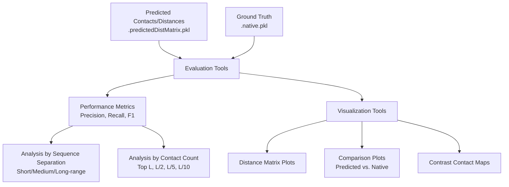
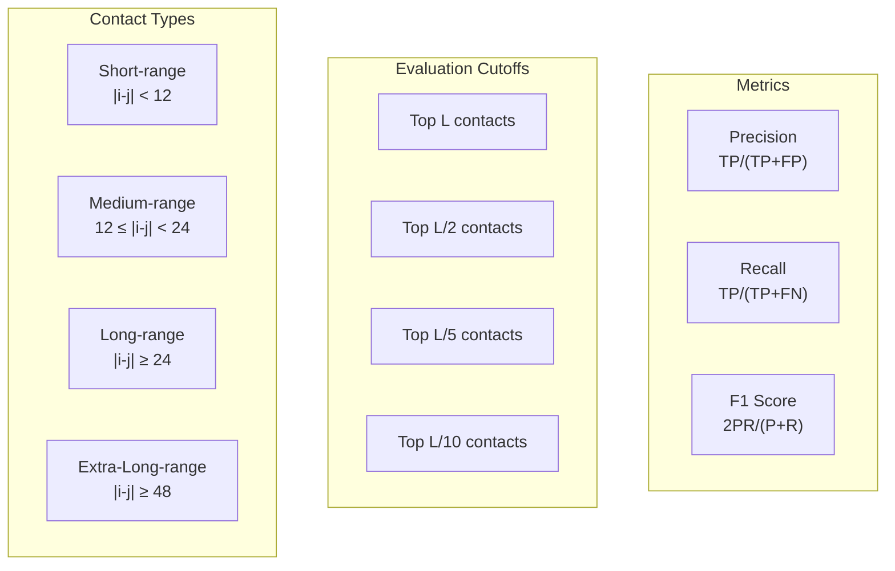
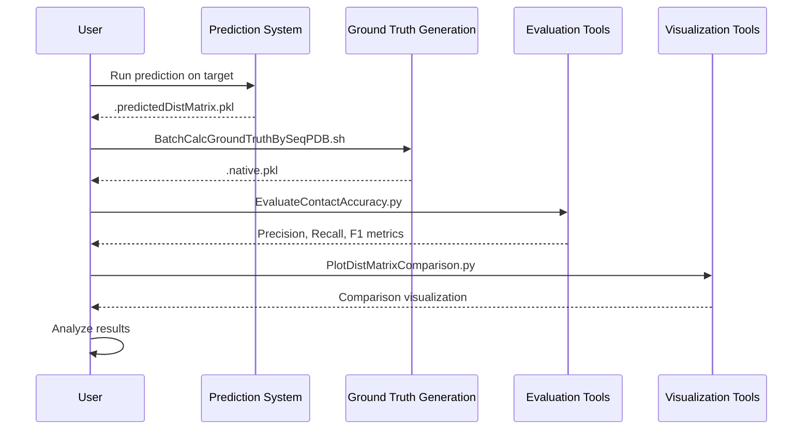

# Evaluating Predictions

> **Relevant source files**
> * [Common/BatchCalcGroundTruthBySeqPDB.sh](https://github.com/j3xugit/RaptorX-3DModeling/blob/22b58bc9/Common/BatchCalcGroundTruthBySeqPDB.sh)
> * [DL4DistancePrediction4/EvaluateContactAccuracy.py](https://github.com/j3xugit/RaptorX-3DModeling/blob/22b58bc9/DL4DistancePrediction4/EvaluateContactAccuracy.py)
> * [DL4DistancePrediction4/EvaluateContactAccuracyPKL.py](https://github.com/j3xugit/RaptorX-3DModeling/blob/22b58bc9/DL4DistancePrediction4/EvaluateContactAccuracyPKL.py)
> * [DL4DistancePrediction4/Utils/PlotContrastContactMapFromRR.py](https://github.com/j3xugit/RaptorX-3DModeling/blob/22b58bc9/DL4DistancePrediction4/Utils/PlotContrastContactMapFromRR.py)
> * [DL4DistancePrediction4/Utils/PlotDistMatrixComparison.py](https://github.com/j3xugit/RaptorX-3DModeling/blob/22b58bc9/DL4DistancePrediction4/Utils/PlotDistMatrixComparison.py)
> * [DL4DistancePrediction4/Utils/PlotDistanceMatrix.py](https://github.com/j3xugit/RaptorX-3DModeling/blob/22b58bc9/DL4DistancePrediction4/Utils/PlotDistanceMatrix.py)

This page describes the tools and methods available in RaptorX-3DModeling for evaluating the quality of predicted protein contacts, distances, and orientations. The evaluation process compares predictions against ground truth data derived from experimentally determined protein structures. For information about generating predictions, see [Distance Prediction Workflow](/j3xugit/RaptorX-3DModeling/4.1-distance-prediction-workflow).

## Evaluation Overview

The evaluation of predictions in RaptorX-3DModeling focuses primarily on two aspects:

1. **Contact prediction accuracy** - Measuring how well the system predicts which residue pairs are in contact
2. **Distance prediction accuracy** - Assessing the accuracy of predicted inter-residue distances

The system uses standard metrics such as precision, recall, and F1 score to quantify prediction quality at different sequence separation ranges and for different numbers of top predictions.



Sources: [DL4DistancePrediction4/EvaluateContactAccuracy.py](https://github.com/j3xugit/RaptorX-3DModeling/blob/22b58bc9/DL4DistancePrediction4/EvaluateContactAccuracy.py)

 [DL4DistancePrediction4/EvaluateContactAccuracyPKL.py](https://github.com/j3xugit/RaptorX-3DModeling/blob/22b58bc9/DL4DistancePrediction4/EvaluateContactAccuracyPKL.py)

## Ground Truth Calculation

Before evaluation can take place, ground truth data must be generated from experimentally determined structures (PDB files). The system provides a script to calculate this data.

### Using BatchCalcGroundTruthBySeqPDB.sh

This script processes multiple proteins to generate ground truth data files:

```
BatchCalcGroundTruthBySeqPDB.sh [-n numJobs | -d ResDir] proteinListFile SeqDir PDBDir
```

Parameters:

* `proteinListFile`: List of proteins to process (one per line)
* `SeqDir`: Directory containing protein sequence files (FASTA format)
* `PDBDir`: Directory containing protein structure files (.pdb or .cif format)
* `numJobs`: Number of proteins to process simultaneously (default: all available cores)
* `ResDir`: Directory for saving results (default: current directory)

The script calls `CalcGroundTruthFromSeqPDB.py` for each protein to generate ground truth files that contain actual distance matrices and contact information.

Sources: [Common/BatchCalcGroundTruthBySeqPDB.sh](https://github.com/j3xugit/RaptorX-3DModeling/blob/22b58bc9/Common/BatchCalcGroundTruthBySeqPDB.sh)

## Evaluating Contact Predictions

The primary tool for evaluating contact predictions is `EvaluateContactAccuracy.py`, which calculates precision, recall, and F1 scores by comparing predicted contact matrices with ground truth.

### Contact Prediction Metrics



The system evaluates contacts at different sequence separation ranges:

* **Short-range**: |i-j| < 12 residues
* **Medium-range**: 12 ≤ |i-j| < 24 residues
* **Long-range**: |i-j| ≥ 24 residues
* **Extra-long-range**: |i-j| ≥ 48 residues
* **Long+medium-range**: Combined long and medium ranges

For each range, the system evaluates the top L, L/2, L/5, and L/10 predicted contacts, where L is the protein sequence length.

### Using EvaluateContactAccuracy.py

```
python EvaluateContactAccuracy.py predMatrixFile groundTruthFile [targetName]
```

Parameters:

* `predMatrixFile`: Predicted contact matrix file (.txt, .ccmpred, or .predictedDistMatrix.pkl)
* `groundTruthFile`: Ground truth file (.txt or .native.pkl)
* `targetName`: Optional name for the target (default: derived from groundTruthFile)

Output format:

```
targetName seqLength metric values
```

Example output:

```
T0123 150 precision 0.8 0.85 0.7 0.75 0.6 ...
T0123 150 recall 0.3 0.4 0.25 0.3 0.2 ...
T0123 150 F1 0.44 0.54 0.37 0.43 0.3 ...
```

The values correspond to precision/recall/F1 scores for different contact ranges and cutoffs.

For PKL format files specifically, you can use `EvaluateContactAccuracyPKL.py` with similar parameters:

```
python EvaluateContactAccuracyPKL.py predDistMatrixFile_pkl groundTruthFile_pkl [targetName]
```

Sources: [DL4DistancePrediction4/EvaluateContactAccuracy.py](https://github.com/j3xugit/RaptorX-3DModeling/blob/22b58bc9/DL4DistancePrediction4/EvaluateContactAccuracy.py)

 [DL4DistancePrediction4/EvaluateContactAccuracyPKL.py](https://github.com/j3xugit/RaptorX-3DModeling/blob/22b58bc9/DL4DistancePrediction4/EvaluateContactAccuracyPKL.py)

## Visualization Tools

RaptorX-3DModeling provides several visualization tools to help analyze predictions graphically.

### Plotting Distance Matrices

`PlotDistanceMatrix.py` visualizes predicted distance matrices as images:

```
python PlotDistanceMatrix.py targetName.bound.txt [result_dir]
```

Parameters:

* `targetName.bound.txt`: Predicted contact distance matrix in text format
* `result_dir`: Optional directory for saving images (default: current directory)

The script generates PNG images of the distance matrix with residue numbers displayed along the axes. Distances are represented as grayscale values, with black indicating close distances (≤ 3.0Å) and white indicating distant residues (≥ 15.0Å).

### Comparing Predicted and Native Distances

`PlotDistMatrixComparison.py` creates a visualization that compares predicted distances with native (ground truth) distances:

```
python PlotDistMatrixComparison.py targetName predDistBoundFile groundTruth_PKL
```

Parameters:

* `targetName`: Name of the target protein
* `predDistBoundFile`: Predicted distance bounds file (.bound.pkl or .bound.txt)
* `groundTruth_PKL`: Ground truth file (.native.pkl)

The script generates a TIFF image where the upper triangle shows predicted distances and the lower triangle shows native distances, allowing for easy visual comparison.

### Visualizing Contact Prediction Performance

`PlotContrastContactMapFromRR.py` creates a visualization that highlights correctly and incorrectly predicted contacts:

```
python PlotContrastContactMapFromRR.py protein_name RRFile1 RRFile2 NativeRRFile [MethodName1 MethodName2]
```

Parameters:

* `protein_name`: Name of the target protein
* `RRFile1`, `RRFile2`: Predicted contact files from two different methods
* `NativeRRFile`: Native (ground truth) contact file
* `MethodName1`, `MethodName2`: Optional names for the methods (default: "RaptorX" and "CCMpred")

The script generates a TIFF image showing:

* Native contacts in grey
* Correctly predicted contacts as red asterisks (*)
* Incorrectly predicted contacts as green crosses (x)

It places predictions from the first method in the upper triangle and predictions from the second method in the lower triangle, allowing for easy comparison between methods.

Sources: [DL4DistancePrediction4/Utils/PlotDistanceMatrix.py](https://github.com/j3xugit/RaptorX-3DModeling/blob/22b58bc9/DL4DistancePrediction4/Utils/PlotDistanceMatrix.py)

 [DL4DistancePrediction4/Utils/PlotDistMatrixComparison.py](https://github.com/j3xugit/RaptorX-3DModeling/blob/22b58bc9/DL4DistancePrediction4/Utils/PlotDistMatrixComparison.py)

 [DL4DistancePrediction4/Utils/PlotContrastContactMapFromRR.py](https://github.com/j3xugit/RaptorX-3DModeling/blob/22b58bc9/DL4DistancePrediction4/Utils/PlotContrastContactMapFromRR.py)

## Practical Evaluation Workflow

The following diagram illustrates a typical workflow for evaluating predictions:



### Interpretation of Results

When interpreting evaluation results, consider the following guidelines:

| Contact Type | Significance |
| --- | --- |
| Long-range | Most important for overall fold prediction |
| Medium-range | Important for local structure elements |
| Short-range | Less informative, often related to local geometry |

| Metric | Good Performance Threshold |
| --- | --- |
| Precision of top L/5 long-range | > 0.5 indicates likely correct fold |
| Precision of top L/2 long-range | > 0.3 indicates good prediction |
| F1 score of top L long+medium-range | > 0.4 indicates reliable prediction |

For distance predictions, the mean absolute error (MAE) or root mean square error (RMSE) between predicted and native distances provides a quantitative measure of prediction quality.

Sources: [DL4DistancePrediction4/EvaluateContactAccuracy.py](https://github.com/j3xugit/RaptorX-3DModeling/blob/22b58bc9/DL4DistancePrediction4/EvaluateContactAccuracy.py)

## Example Command Usage

Here's a complete example of evaluating predictions for a target protein:

1. Generate ground truth from PDB structure:

```
BatchCalcGroundTruthBySeqPDB.sh -d ./groundtruth_data proteins.list ./seq_dir ./pdb_dir
```

1. Evaluate contact prediction accuracy:

```
python EvaluateContactAccuracy.py ./predictions/T0123.predictedDistMatrix.pkl ./groundtruth_data/T0123.native.pkl
```

1. Generate comparison visualization:

```
python PlotDistMatrixComparison.py T0123 ./predictions/T0123.predictedDistMatrix.pkl ./groundtruth_data/T0123.native.pkl
```

These steps provide a comprehensive evaluation of prediction quality through both quantitative metrics and visual analysis.