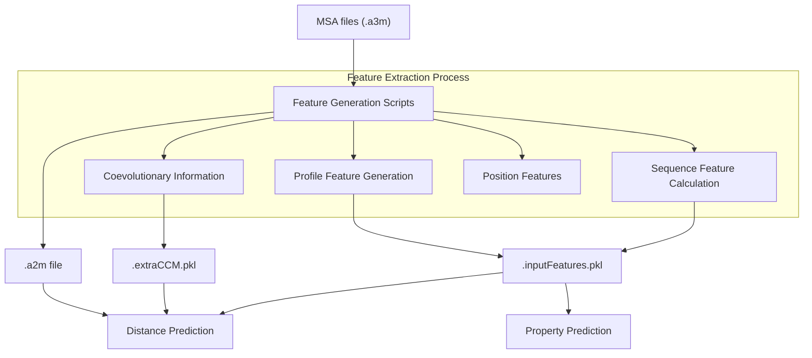
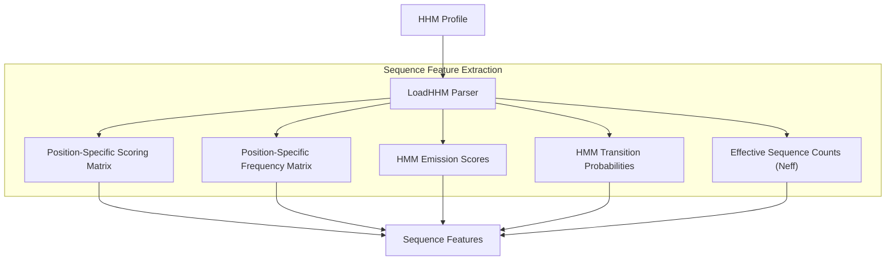
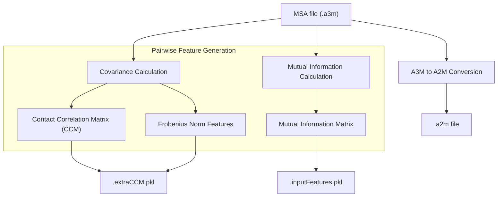
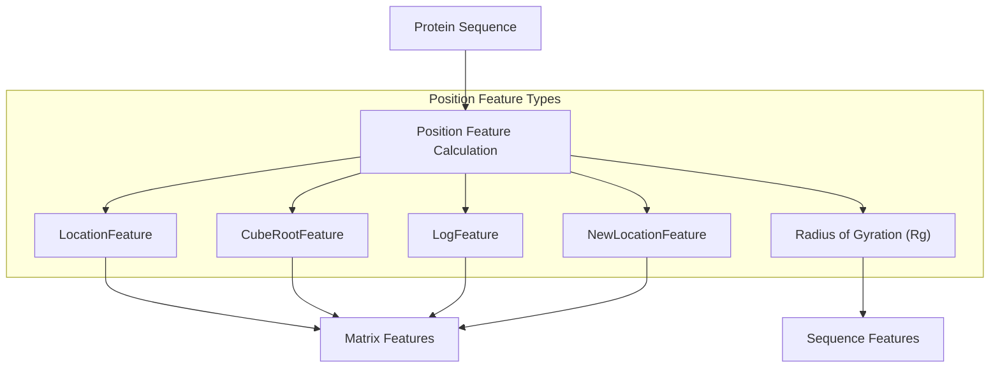
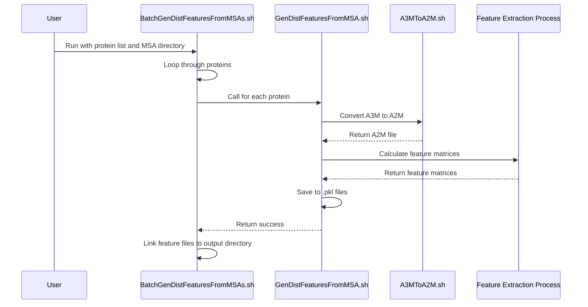
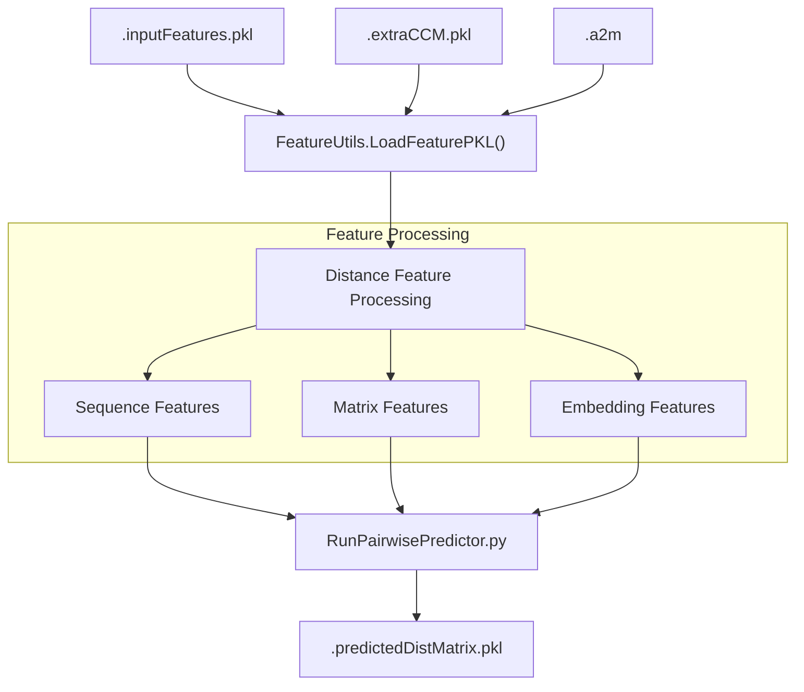
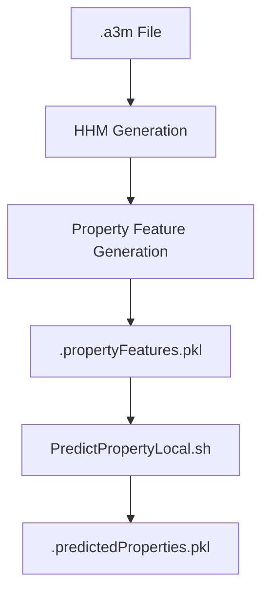

# Feature Extraction

> **Relevant source files**
> * [BuildFeatures/A3MToA2M.sh](https://github.com/j3xugit/RaptorX-3DModeling/blob/22b58bc9/BuildFeatures/A3MToA2M.sh)
> * [BuildFeatures/BatchGenDistFeaturesFromMSAs.sh](https://github.com/j3xugit/RaptorX-3DModeling/blob/22b58bc9/BuildFeatures/BatchGenDistFeaturesFromMSAs.sh)
> * [Common/LoadHHM.py](https://github.com/j3xugit/RaptorX-3DModeling/blob/22b58bc9/Common/LoadHHM.py)
> * [DL4DistancePrediction4/FeatureUtils.py](https://github.com/j3xugit/RaptorX-3DModeling/blob/22b58bc9/DL4DistancePrediction4/FeatureUtils.py)
> * [DL4DistancePrediction4/Scripts/PredictPairRelation4Inputs.sh](https://github.com/j3xugit/RaptorX-3DModeling/blob/22b58bc9/DL4DistancePrediction4/Scripts/PredictPairRelation4Inputs.sh)
> * [DL4PropertyPrediction/GenPropertyFeatures4Proteins.py](https://github.com/j3xugit/RaptorX-3DModeling/blob/22b58bc9/DL4PropertyPrediction/GenPropertyFeatures4Proteins.py)
> * [DL4PropertyPrediction/Scripts/PredictPropertyFromMSA.sh](https://github.com/j3xugit/RaptorX-3DModeling/blob/22b58bc9/DL4PropertyPrediction/Scripts/PredictPropertyFromMSA.sh)
> * [DL4PropertyPrediction/Scripts/PredictPropertyFromMSAs.sh](https://github.com/j3xugit/RaptorX-3DModeling/blob/22b58bc9/DL4PropertyPrediction/Scripts/PredictPropertyFromMSAs.sh)
> * [Folding/Scripts4Rosetta/FoldNRelaxTargets.sh](https://github.com/j3xugit/RaptorX-3DModeling/blob/22b58bc9/Folding/Scripts4Rosetta/FoldNRelaxTargets.sh)

This page documents the feature extraction process in the RaptorX-3DModeling system, which transforms Multiple Sequence Alignments (MSAs) into feature representations suitable for deep learning models. These features form the basis for both distance/orientation prediction ([DL4DistancePrediction4 Module](/j3xugit/RaptorX-3DModeling/4-dl4distanceprediction4-module)) and local property prediction ([DL4PropertyPrediction Module](/j3xugit/RaptorX-3DModeling/5-dl4propertyprediction-module)).

## Overview

Feature extraction is a critical step in the protein structure prediction pipeline, bridging the gap between sequence-based MSAs and the machine learning models that predict structural information. The process generates various feature types including sequence profiles, coevolutionary information, and position-specific scoring matrices that capture evolutionary patterns crucial for structure prediction.



Sources: [BuildFeatures/BatchGenDistFeaturesFromMSAs.sh L1-L136](https://github.com/j3xugit/RaptorX-3DModeling/blob/22b58bc9/BuildFeatures/BatchGenDistFeaturesFromMSAs.sh#L1-L136)

 [DL4DistancePrediction4/Scripts/PredictPairRelation4Inputs.sh L1-L201](https://github.com/j3xugit/RaptorX-3DModeling/blob/22b58bc9/DL4DistancePrediction4/Scripts/PredictPairRelation4Inputs.sh#L1-L201)

## Feature Types

RaptorX extracts multiple feature types from MSAs to capture different aspects of protein structure information:

### 1. Sequence-based Features

These features capture information at the individual residue level:

* **Primary sequence encoding**: One-hot encoding of amino acids
* **PSSM (Position-Specific Scoring Matrix)**: Derived from the HMM profile, representing the log-odds scores of amino acid substitutions
* **PSFM (Position-Specific Frequency Matrix)**: Representing the frequencies of amino acids at each position
* **Secondary structure prediction**: Used as additional input features
* **Amino acid property encodings**: Physicochemical properties of amino acids



Sources: [Common/LoadHHM.py L1-L324](https://github.com/j3xugit/RaptorX-3DModeling/blob/22b58bc9/Common/LoadHHM.py#L1-L324)

 [DL4PropertyPrediction/GenPropertyFeatures4Proteins.py L1-L64](https://github.com/j3xugit/RaptorX-3DModeling/blob/22b58bc9/DL4PropertyPrediction/GenPropertyFeatures4Proteins.py#L1-L64)

### 2. Pairwise Features

These features capture relationships between pairs of residues:

* **Coevolutionary information**: Derived from statistical coupling between positions in the MSA
* **Contact Correlation Matrix (CCM)**: Represents statistical couplings between residues
* **Mutual Information (MI)**: Measures mutual dependence between positions
* **Position embeddings**: Relative positions encoded as features



Sources: [DL4DistancePrediction4/FeatureUtils.py L1-L299](https://github.com/j3xugit/RaptorX-3DModeling/blob/22b58bc9/DL4DistancePrediction4/FeatureUtils.py#L1-L299)

 [BuildFeatures/A3MToA2M.sh L1-L65](https://github.com/j3xugit/RaptorX-3DModeling/blob/22b58bc9/BuildFeatures/A3MToA2M.sh#L1-L65)

### 3. Position Features

These capture information about residue positions in the protein:

* **Position embeddings**: Encode relative positions between residues
* **Separation features**: Features based on sequence separation between residues
* **Location features**: Special features for capturing sequence position information



Sources: [DL4DistancePrediction4/FeatureUtils.py L96-L158](https://github.com/j3xugit/RaptorX-3DModeling/blob/22b58bc9/DL4DistancePrediction4/FeatureUtils.py#L96-L158)

### 4. Language Model Features

For some model configurations, additional features from protein language models may be included:

* **ESM (Evolutionary Scale Modeling)** features: Representations from pretrained language models
* **Attention weights**: From specific layers of transformer models

## Output Feature Files

The feature extraction process generates three main types of files:

| File Extension | Description | Used By |
| --- | --- | --- |
| `.inputFeatures.pkl` | Primary feature file containing sequence and pairwise features | Distance prediction, Property prediction |
| `.extraCCM.pkl` | Specialized coevolutionary information | Distance prediction |
| `.a2m` | MSA in A2M format | Distance prediction, Property prediction |
| `.propertyFeatures.pkl` | Features specifically for property prediction | Property prediction |

### Feature File Contents

The `.inputFeatures.pkl` file typically contains:

* `sequence`: The amino acid sequence
* `seqFeatures`: Features for individual residues (1D)
* `matrixFeatures`: Pairwise features between residues (2D)
* `matrixFeatures_nomean`: Normalized pairwise features
* Additional metadata about the protein

The `.extraCCM.pkl` file may contain:

* `Fnorm`: Frobenius norm of the contact matrix
* `FnormZ`: Z-normalized Frobenius norm
* `sumCCM`: Summarized CCM features
* `rawCCM`: Raw CCM matrix

Sources: [DL4DistancePrediction4/FeatureUtils.py L11-L92](https://github.com/j3xugit/RaptorX-3DModeling/blob/22b58bc9/DL4DistancePrediction4/FeatureUtils.py#L11-L92)

 [BuildFeatures/BatchGenDistFeaturesFromMSAs.sh L124-L133](https://github.com/j3xugit/RaptorX-3DModeling/blob/22b58bc9/BuildFeatures/BatchGenDistFeaturesFromMSAs.sh#L124-L133)

## Feature Extraction Workflow

The feature extraction process involves several steps:

1. **MSA Processing**: Convert MSAs from A3M to other formats like A2M
2. **Profile Generation**: Generate HMM profiles from MSAs using tools like `hhmake`
3. **Feature Calculation**: Extract various features from MSAs and profiles
4. **Feature Storage**: Save features in Python pickle (.pkl) files



Sources: [BuildFeatures/BatchGenDistFeaturesFromMSAs.sh L89-L135](https://github.com/j3xugit/RaptorX-3DModeling/blob/22b58bc9/BuildFeatures/BatchGenDistFeaturesFromMSAs.sh#L89-L135)

 [BuildFeatures/A3MToA2M.sh L1-L65](https://github.com/j3xugit/RaptorX-3DModeling/blob/22b58bc9/BuildFeatures/A3MToA2M.sh#L1-L65)

## Usage

Feature extraction is typically performed using the `BatchGenDistFeaturesFromMSAs.sh` script, which processes multiple proteins in parallel:

```
BatchGenDistFeaturesFromMSAs.sh [-o ResDir | -g gpu | -n numJobs | -r machineMode | -h MachineFile] proteinListFile MSADir
```

Key parameters:

* `proteinListFile`: A file containing protein names, one per line
* `MSADir`: Directory containing MSA files in A3M format
* `-o ResDir`: Output directory for feature files
* `-g gpu`: GPU selection (-1 for automatic)
* `-n numJobs`: Number of proteins to process simultaneously

The script generates three output files for each protein:

1. `proteinName.inputFeatures.pkl`: Primary features
2. `proteinName.extraCCM.pkl`: Coevolutionary information
3. `proteinName.a2m`: Processed alignment

For property-specific feature extraction, use `PredictPropertyFromMSA.sh` to generate `.propertyFeatures.pkl` files.

Sources: [BuildFeatures/BatchGenDistFeaturesFromMSAs.sh L16-L37](https://github.com/j3xugit/RaptorX-3DModeling/blob/22b58bc9/BuildFeatures/BatchGenDistFeaturesFromMSAs.sh#L16-L37)

 [DL4PropertyPrediction/Scripts/PredictPropertyFromMSA.sh L1-L102](https://github.com/j3xugit/RaptorX-3DModeling/blob/22b58bc9/DL4PropertyPrediction/Scripts/PredictPropertyFromMSA.sh#L1-L102)

## Integration with Prediction Modules

The extracted features serve as inputs to two key prediction modules:

### 1. Distance/Orientation Prediction

The `DL4DistancePrediction4` module uses the feature files to predict pairwise distances and orientations between residues:



Sources: [DL4DistancePrediction4/FeatureUtils.py L11-L92](https://github.com/j3xugit/RaptorX-3DModeling/blob/22b58bc9/DL4DistancePrediction4/FeatureUtils.py#L11-L92)

 [DL4DistancePrediction4/Scripts/PredictPairRelation4Inputs.sh L173-L196](https://github.com/j3xugit/RaptorX-3DModeling/blob/22b58bc9/DL4DistancePrediction4/Scripts/PredictPairRelation4Inputs.sh#L173-L196)

### 2. Property Prediction

The `DL4PropertyPrediction` module uses the features to predict local structural properties:



Sources: [DL4PropertyPrediction/Scripts/PredictPropertyFromMSA.sh L86-L102](https://github.com/j3xugit/RaptorX-3DModeling/blob/22b58bc9/DL4PropertyPrediction/Scripts/PredictPropertyFromMSA.sh#L86-L102)

 [DL4PropertyPrediction/GenPropertyFeatures4Proteins.py L36-L57](https://github.com/j3xugit/RaptorX-3DModeling/blob/22b58bc9/DL4PropertyPrediction/GenPropertyFeatures4Proteins.py#L36-L57)

## Advanced Feature Options

Additional feature types can be activated through model specifications:

* **CCM options**: Controls which coevolutionary features are used * `CCMFnorm`: Frobenius norm features * `CCMsum`: Summarized CCM features * `CCMraw`: Raw CCM matrix
* **MI options**: Controls mutual information features * `FullMI`: Full mutual information matrix
* **Language model options**: Controls ESM features * ESM features from specific layers can be included

Sources: [DL4DistancePrediction4/FeatureUtils.py L22-L92](https://github.com/j3xugit/RaptorX-3DModeling/blob/22b58bc9/DL4DistancePrediction4/FeatureUtils.py#L22-L92)

## Technical Implementation

The feature extraction code relies on several utility functions implemented in Python:

* `LoadFeaturePKL()`: Loads feature files and processes model specifications
* `LocationFeature()`, `CubeRootFeature()`, etc.: Generate position-specific features
* `CalcFeatureExpect4OneProtein()`: Calculates feature statistics

The implementation uses NumPy for efficient matrix operations and Python's pickle module for data serialization.

Sources: [DL4DistancePrediction4/FeatureUtils.py L1-L299](https://github.com/j3xugit/RaptorX-3DModeling/blob/22b58bc9/DL4DistancePrediction4/FeatureUtils.py#L1-L299)

 [Common/LoadHHM.py L46-L156](https://github.com/j3xugit/RaptorX-3DModeling/blob/22b58bc9/Common/LoadHHM.py#L46-L156)