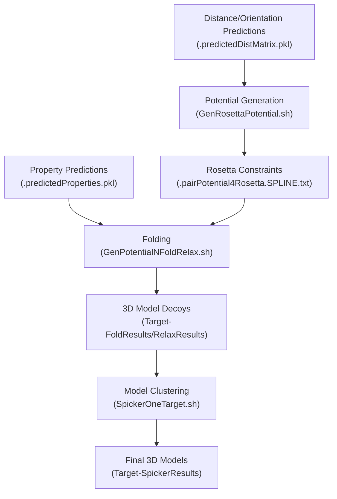
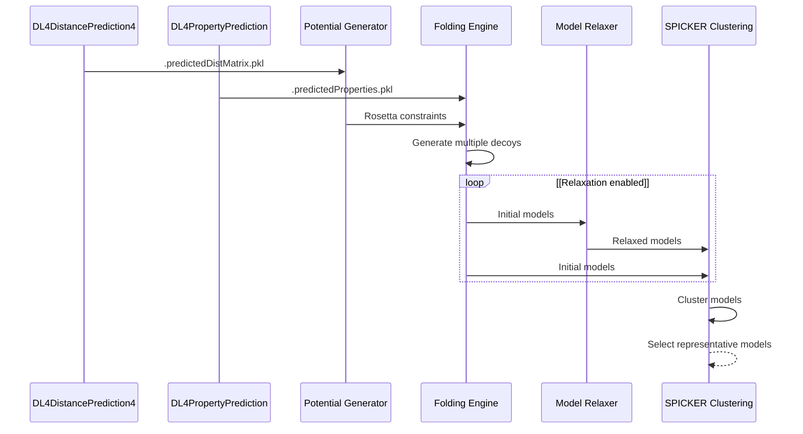
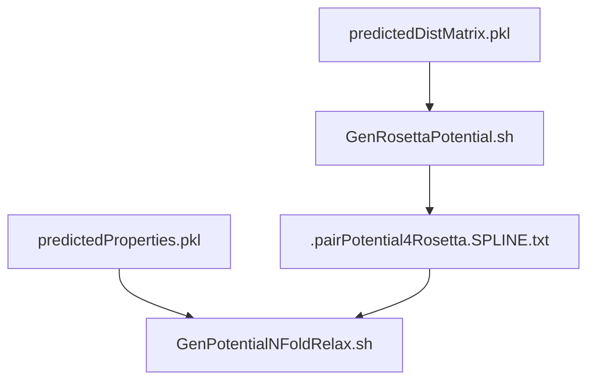
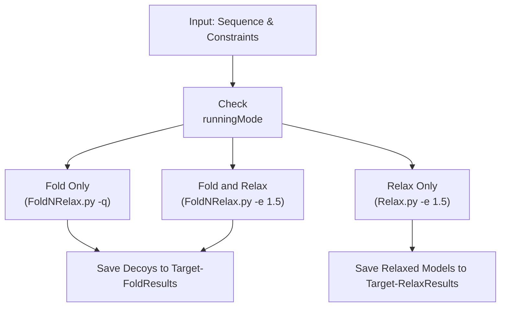
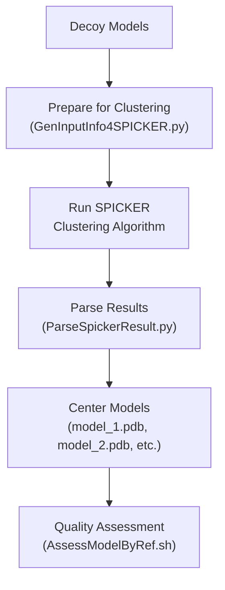
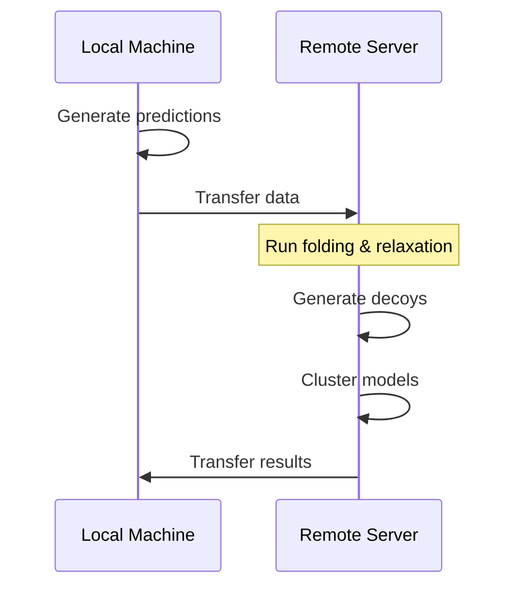
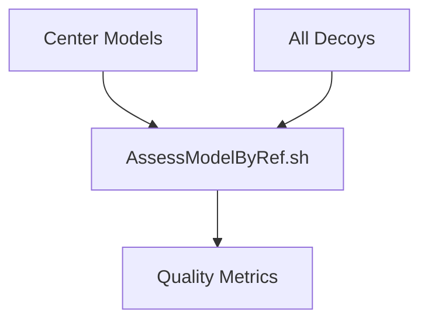

# Folding Module

> **Relevant source files**
> * [DL4DistancePrediction4/Scripts/PredictPairRelation4Proteins.sh](https://github.com/j3xugit/RaptorX-3DModeling/blob/22b58bc9/DL4DistancePrediction4/Scripts/PredictPairRelation4Proteins.sh)
> * [Folding/Scripts4Rosetta/GenPotentialNFoldRelax.sh](https://github.com/j3xugit/RaptorX-3DModeling/blob/22b58bc9/Folding/Scripts4Rosetta/GenPotentialNFoldRelax.sh)
> * [Folding/Scripts4Rosetta/PrintJob4FoldNRelaxOneTarget.sh](https://github.com/j3xugit/RaptorX-3DModeling/blob/22b58bc9/Folding/Scripts4Rosetta/PrintJob4FoldNRelaxOneTarget.sh)
> * [Folding/Scripts4Rosetta/PrintJob4FoldNRelaxTargets.sh](https://github.com/j3xugit/RaptorX-3DModeling/blob/22b58bc9/Folding/Scripts4Rosetta/PrintJob4FoldNRelaxTargets.sh)
> * [Folding/Scripts4Rosetta/RelaxOneTarget.sh](https://github.com/j3xugit/RaptorX-3DModeling/blob/22b58bc9/Folding/Scripts4Rosetta/RelaxOneTarget.sh)
> * [Folding/Scripts4SPICKER/SpickerOneTarget.sh](https://github.com/j3xugit/RaptorX-3DModeling/blob/22b58bc9/Folding/Scripts4SPICKER/SpickerOneTarget.sh)
> * [Server/RaptorXFolder.sh](https://github.com/j3xugit/RaptorX-3DModeling/blob/22b58bc9/Server/RaptorXFolder.sh)

The Folding Module is responsible for generating 3D protein models from predicted inter-residue relationships and local structural properties. It transforms the outputs from the [DL4DistancePrediction4 Module](/j3xugit/RaptorX-3DModeling/4-dl4distanceprediction4-module) and [DL4PropertyPrediction Module](/j3xugit/RaptorX-3DModeling/5-dl4propertyprediction-module) into physical 3D protein structures through a series of steps including potential generation, folding, relaxation, and clustering.

## Overview

The Folding Module takes predicted distance/orientation matrices and property files as input and produces quality 3D protein models as output. The module can be run either locally or on remote machines to accommodate large-scale protein structure prediction tasks.



Sources: [Server/RaptorXFolder.sh L177-L208](https://github.com/j3xugit/RaptorX-3DModeling/blob/22b58bc9/Server/RaptorXFolder.sh#L177-L208)

 [Folding/Scripts4Rosetta/GenPotentialNFoldRelax.sh](https://github.com/j3xugit/RaptorX-3DModeling/blob/22b58bc9/Folding/Scripts4Rosetta/GenPotentialNFoldRelax.sh)

 [Folding/Scripts4SPICKER/SpickerOneTarget.sh](https://github.com/j3xugit/RaptorX-3DModeling/blob/22b58bc9/Folding/Scripts4SPICKER/SpickerOneTarget.sh)

## Module Components

The Folding Module consists of several key components that work together to generate 3D protein structures:

### 1. Potential Generation

This component converts predicted distance/orientation matrices and property predictions into Rosetta-compatible constraints that guide the folding process.

### 2. Folding and Relaxation

The folding component generates 3D models using Rosetta's ab initio folding protocol with the guidance of predicted constraints. The optional relaxation step optimizes side-chain atoms and removes steric clashes.

### 3. Model Clustering

After generating multiple decoys (candidate models), the clustering component identifies the most representative structures using the SPICKER algorithm.

Sources: [Server/RaptorXFolder.sh L186-L199](https://github.com/j3xugit/RaptorX-3DModeling/blob/22b58bc9/Server/RaptorXFolder.sh#L186-L199)

 [Folding/Scripts4Rosetta/GenPotentialNFoldRelax.sh L20-L33](https://github.com/j3xugit/RaptorX-3DModeling/blob/22b58bc9/Folding/Scripts4Rosetta/GenPotentialNFoldRelax.sh#L20-L33)

## Detailed Workflow



Sources: [Server/RaptorXFolder.sh L177-L208](https://github.com/j3xugit/RaptorX-3DModeling/blob/22b58bc9/Server/RaptorXFolder.sh#L177-L208)

 [Folding/Scripts4Rosetta/GenPotentialNFoldRelax.sh L114-L137](https://github.com/j3xugit/RaptorX-3DModeling/blob/22b58bc9/Folding/Scripts4Rosetta/GenPotentialNFoldRelax.sh#L114-L137)

## Key Components in Detail

### Rosetta Potential Generation

The predicted distance, orientation, and property information is converted into Rosetta-compatible constraints that guide the folding process.



Sources: [Server/RaptorXFolder.sh L186-L194](https://github.com/j3xugit/RaptorX-3DModeling/blob/22b58bc9/Server/RaptorXFolder.sh#L186-L194)

 [Folding/Scripts4Rosetta/GenPotentialNFoldRelax.sh L70-L95](https://github.com/j3xugit/RaptorX-3DModeling/blob/22b58bc9/Folding/Scripts4Rosetta/GenPotentialNFoldRelax.sh#L70-L95)

### Folding and Relaxation Process

The folding process uses Rosetta with guidance from the generated constraints to produce 3D models. The module supports two main modes:

1. **Fold only (runningMode=0)**: Generate models without relaxation
2. **Fold and relax (runningMode=1)**: Generate models and perform relaxation



The `-q` option in fold-only mode skips the relaxation step, while the `-e 1.5` option in fold-and-relax mode specifies the energy cutoff for relaxation.

Sources: [Folding/Scripts4Rosetta/GenPotentialNFoldRelax.sh L102-L137](https://github.com/j3xugit/RaptorX-3DModeling/blob/22b58bc9/Folding/Scripts4Rosetta/GenPotentialNFoldRelax.sh#L102-L137)

 [Server/RaptorXFolder.sh L186-L194](https://github.com/j3xugit/RaptorX-3DModeling/blob/22b58bc9/Server/RaptorXFolder.sh#L186-L194)

### Model Clustering with SPICKER

After generating multiple decoys, SPICKER is used to cluster them and identify representative structures:



Sources: [Folding/Scripts4SPICKER/SpickerOneTarget.sh L84-L146](https://github.com/j3xugit/RaptorX-3DModeling/blob/22b58bc9/Folding/Scripts4SPICKER/SpickerOneTarget.sh#L84-L146)

 [Server/RaptorXFolder.sh L200-L208](https://github.com/j3xugit/RaptorX-3DModeling/blob/22b58bc9/Server/RaptorXFolder.sh#L200-L208)

## Configuration and Usage

The Folding Module can be configured with various options to control the folding process:

| Parameter | Description | Default |
| --- | --- | --- |
| numDecoys | Number of models to generate | 120 |
| runningMode | 0 for fold only, 1 for fold+relax | 0 |
| RemoteAccountInfo | For remote folding (e.g., "user@server:path/") | "" (local) |
| machineType | Type of execution environment (0-4) | 0 |
| maxLen2BeFolded | Maximum sequence length for folding | 1050 |

### Command-line Usage

The Folding Module is typically invoked through the main RaptorXFolder.sh script:

```
$ RaptorXFolder.sh -n [numDecoys] -r [runningMode] -R [remoteInfo] -t [machineType] inputFile
```

For direct use of the folding components:

```
$ LocalFoldNRelaxOneTarget.sh -d [saveDir] -n [numDecoys] -r [runningMode] seqFile distMatrix propFile
```

Sources: [Server/RaptorXFolder.sh L10-L34](https://github.com/j3xugit/RaptorX-3DModeling/blob/22b58bc9/Server/RaptorXFolder.sh#L10-L34)

 [Server/RaptorXFolder.sh L186-L194](https://github.com/j3xugit/RaptorX-3DModeling/blob/22b58bc9/Server/RaptorXFolder.sh#L186-L194)

## Execution Environment Options

The Folding Module supports various execution environments through the `-t` option:

| machineType | Description |
| --- | --- |
| 0 | Auto-detection (default) |
| 1 | Multi-CPU Linux with GNU parallel |
| 2 | Slurm cluster with homogeneous nodes |
| 3 | Slurm cluster with heterogeneous nodes |
| 4 | Multi-CPU Linux without GNU parallel |

Sources: [Server/RaptorXFolder.sh L65-L71](https://github.com/j3xugit/RaptorX-3DModeling/blob/22b58bc9/Server/RaptorXFolder.sh#L65-L71)

## Remote Folding

For compute-intensive folding tasks, the module supports offloading the folding process to a remote machine:



To use remote folding, specify the remote account information with the `-R` option:

```
$ RaptorXFolder.sh -R user@server:path/ -n 300 inputFile
```

The remote machine must have RaptorX-3DModeling installed and properly configured. Passwordless SSH access is required.

Sources: [Server/RaptorXFolder.sh L62-L65](https://github.com/j3xugit/RaptorX-3DModeling/blob/22b58bc9/Server/RaptorXFolder.sh#L62-L65)

 [Server/RaptorXFolder.sh L191-L194](https://github.com/j3xugit/RaptorX-3DModeling/blob/22b58bc9/Server/RaptorXFolder.sh#L191-L194)

## Model Quality Assessment

After clustering, the quality of the generated models can be assessed using reference-based metrics:



This assessment is optional and can be enabled with the `-a` flag when running SpickerOneTarget.sh.

Sources: [Folding/Scripts4SPICKER/SpickerOneTarget.sh L128-L146](https://github.com/j3xugit/RaptorX-3DModeling/blob/22b58bc9/Folding/Scripts4SPICKER/SpickerOneTarget.sh#L128-L146)

## Key Files and Directories

The Folding Module organizes its outputs in the following directory structure:

| Directory/File | Description |
| --- | --- |
| Target_OUT/ | Main output directory |
| Target_OUT/Target-FoldResults/ | Initial folded models |
| Target_OUT/Target-RelaxResults/ | Relaxed models |
| Target_OUT/Target-SpickerResults/ | Clustered models |
| Target_OUT/DistancePred/ | Predicted distance/orientation matrices |
| Target_OUT/PropertyPred/ | Predicted property files |

Sources: [Server/RaptorXFolder.sh L186-L208](https://github.com/j3xugit/RaptorX-3DModeling/blob/22b58bc9/Server/RaptorXFolder.sh#L186-L208)

## Limitations and Considerations

* Protein length: The default maximum protein length is 1050 residues, which can be adjusted with the `-l` option.
* Memory requirements: Relaxation is memory-intensive and can require ~10G of memory per model for large proteins.
* Computation time: Relaxation is time-consuming, potentially taking several hours per model for large proteins.
* GPU usage: The folding module itself doesn't require GPUs, but the upstream prediction modules typically do.

Sources: [Server/RaptorXFolder.sh L42-L44](https://github.com/j3xugit/RaptorX-3DModeling/blob/22b58bc9/Server/RaptorXFolder.sh#L42-L44)

 [Server/RaptorXFolder.sh L57-L60](https://github.com/j3xugit/RaptorX-3DModeling/blob/22b58bc9/Server/RaptorXFolder.sh#L57-L60)