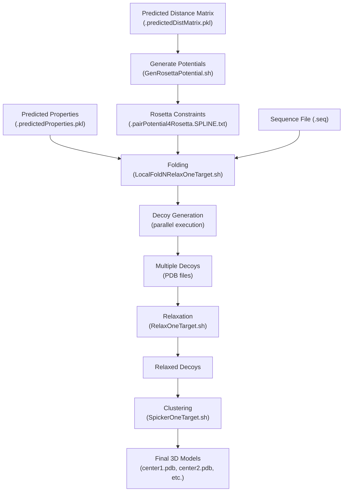
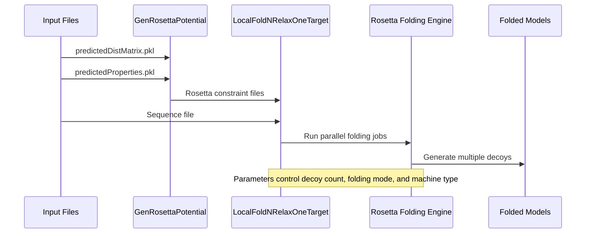
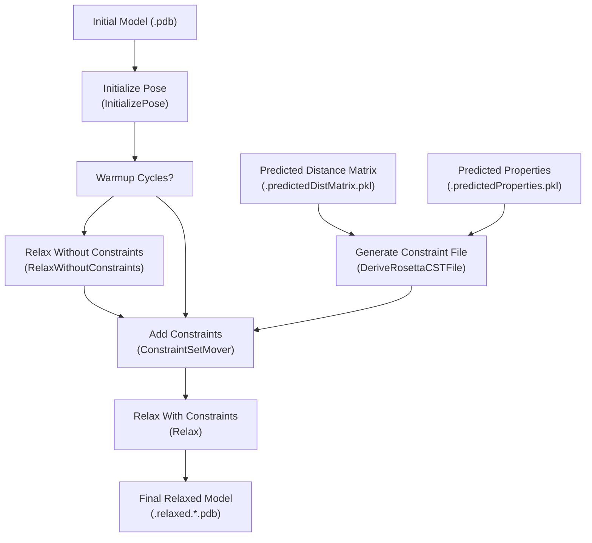
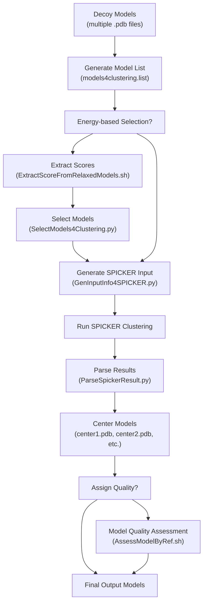
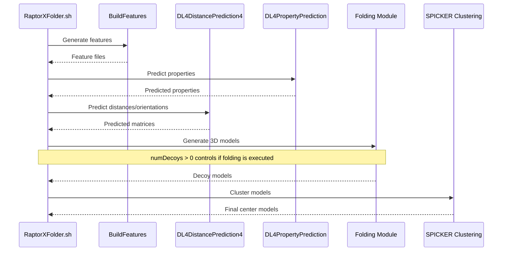

# Folding and Relaxation

> **Relevant source files**
> * [Folding/Scripts4Rosetta/Relax.py](https://github.com/j3xugit/RaptorX-3DModeling/blob/22b58bc9/Folding/Scripts4Rosetta/Relax.py)
> * [Folding/Scripts4Rosetta/RelaxOneTarget.sh](https://github.com/j3xugit/RaptorX-3DModeling/blob/22b58bc9/Folding/Scripts4Rosetta/RelaxOneTarget.sh)
> * [Folding/Scripts4SPICKER/SpickerOneTarget.sh](https://github.com/j3xugit/RaptorX-3DModeling/blob/22b58bc9/Folding/Scripts4SPICKER/SpickerOneTarget.sh)
> * [Server/RaptorXFolder.sh](https://github.com/j3xugit/RaptorX-3DModeling/blob/22b58bc9/Server/RaptorXFolder.sh)

This document describes the folding and relaxation processes in the RaptorX-3DModeling system, which transform predicted distance matrices, orientation information, and local structural properties into high-quality three-dimensional protein models. These processes are crucial steps in generating accurate protein structure predictions from sequence data.

For information about generating Rosetta constraints, see [Rosetta Potential Generation](/j3xugit/RaptorX-3DModeling/6.1-rosetta-potential-generation). For details on how to evaluate the final models, see [Model Quality Assessment](/j3xugit/RaptorX-3DModeling/6.4-model-quality-assessment).

## 1. Process Overview

The folding and relaxation process takes the outputs from the distance prediction and property prediction modules and generates realistic 3D protein models through a multi-step process:



Sources: [Server/RaptorXFolder.sh L185-L206](https://github.com/j3xugit/RaptorX-3DModeling/blob/22b58bc9/Server/RaptorXFolder.sh#L185-L206)

 [Folding/Scripts4Rosetta/RelaxOneTarget.sh L17-L27](https://github.com/j3xugit/RaptorX-3DModeling/blob/22b58bc9/Folding/Scripts4Rosetta/RelaxOneTarget.sh#L17-L27)

 [Folding/Scripts4SPICKER/SpickerOneTarget.sh L7-L15](https://github.com/j3xugit/RaptorX-3DModeling/blob/22b58bc9/Folding/Scripts4SPICKER/SpickerOneTarget.sh#L7-L15)

## 2. Folding Process

The folding process converts the predicted distance/orientation information and property predictions into 3D structural models using Rosetta's fragment assembly and energy minimization capabilities.

### 2.1 Folding Workflow



The folding process is initiated by `RaptorXFolder.sh` and executed through `LocalFoldNRelaxOneTarget.sh`, which:

1. Converts predicted distance matrices to Rosetta constraints
2. Sets up the folding environment with appropriate parameters
3. Runs multiple parallel folding jobs to generate decoys
4. Optionally applies relaxation immediately after folding

Key parameters that control the folding process:

| Parameter | Description | Default | Notes |
| --- | --- | --- | --- |
| numDecoys | Number of decoys to generate | 120 | Controls sampling breadth |
| runningMode | Fold-only (0) or fold+relax (1) | 0 | Relaxation improves quality but takes longer |
| machineType | Type of computing environment | 0 | Controls parallel execution strategy |
| maxLen2BeFolded | Maximum sequence length for folding | 1050 | Limits computation resources |

Sources: [Server/RaptorXFolder.sh L14-L26](https://github.com/j3xugit/RaptorX-3DModeling/blob/22b58bc9/Server/RaptorXFolder.sh#L14-L26)

 [Server/RaptorXFolder.sh L180-L198](https://github.com/j3xugit/RaptorX-3DModeling/blob/22b58bc9/Server/RaptorXFolder.sh#L180-L198)

## 3. Relaxation Process

Relaxation is an energy minimization procedure that refines folded models by removing steric clashes and optimizing side-chain conformations. This process can significantly improve model quality, especially for side-chain positioning and overall structural compactness.

### 3.1 Relaxation Workflow



The relaxation process is implemented in `Relax.py` and can be executed either:

1. Immediately after folding (when `runningMode=1` in `RaptorXFolder.sh`)
2. As a separate step using `RelaxOneTarget.sh` for batch relaxation of multiple models

Key parameters for relaxation:

| Parameter | Description | Default | Notes |
| --- | --- | --- | --- |
| warmup | Cycles for relaxing without constraints | 0 | Initial relaxation rounds |
| ncycles | Cycles for relaxing with constraints | 5 | Main relaxation rounds |
| w4distance | Weight for distance potential | 0.2 | Controls constraint enforcement |
| w4dihedral | Weight for dihedral orientation | 0.2 | Affects backbone conformations |
| w4angle | Weight for angle orientation | 0.2 | Affects side-chain positioning |
| w4beta | Weight for beta-sheet formation | None | Optional beta-sheet enhancement |
| alpha | Parameter for DFIRE potential | 1.61 | Statistical potential parameter |

Sources: [Folding/Scripts4Rosetta/Relax.py L16-L31](https://github.com/j3xugit/RaptorX-3DModeling/blob/22b58bc9/Folding/Scripts4Rosetta/Relax.py#L16-L31)

 [Folding/Scripts4Rosetta/Relax.py L65-L121](https://github.com/j3xugit/RaptorX-3DModeling/blob/22b58bc9/Folding/Scripts4Rosetta/Relax.py#L65-L121)

 [Folding/Scripts4Rosetta/RelaxOneTarget.sh L12-L28](https://github.com/j3xugit/RaptorX-3DModeling/blob/22b58bc9/Folding/Scripts4Rosetta/RelaxOneTarget.sh#L12-L28)

### 3.2 Implementation Details

The relaxation process uses PyRosetta to:

1. Load the initial model and convert it to a Rosetta pose
2. Optionally perform initial relaxation without constraints
3. Add distance, orientation, and property constraints
4. Perform energy minimization cycles with these constraints
5. Save the final relaxed model

Resource Considerations:

* Relaxation is computationally expensive, especially for large proteins
* For proteins >600 residues, relaxation may take several hours per model
* The script automatically selects appropriate temporary storage based on machine memory availability

Sources: [Folding/Scripts4Rosetta/Relax.py L32-L189](https://github.com/j3xugit/RaptorX-3DModeling/blob/22b58bc9/Folding/Scripts4Rosetta/Relax.py#L32-L189)

 [Server/RaptorXFolder.sh L55-L60](https://github.com/j3xugit/RaptorX-3DModeling/blob/22b58bc9/Server/RaptorXFolder.sh#L55-L60)

## 4. Model Clustering

After generating multiple decoys, clustering is used to identify the most representative models based on structural similarity.

### 4.1 Clustering Workflow



The clustering is performed by `SpickerOneTarget.sh`, which:

1. Collects all generated decoys (potentially from multiple folders)
2. Optionally selects models based on energy scores
3. Prepares input for the SPICKER clustering algorithm
4. Runs SPICKER to identify representative centers
5. Generates output models representing the centers of major clusters
6. Optionally assigns quality scores to the selected models

Key parameters for clustering:

| Option | Description | Default | Notes |
| --- | --- | --- | --- |
| -s | Select models by energy | false | Filters models before clustering |
| -a | Assign model quality | false | Evaluates final models against decoys |
| -d | Save folder | auto-generated | Where results are stored |

Sources: [Folding/Scripts4SPICKER/SpickerOneTarget.sh L3-L15](https://github.com/j3xugit/RaptorX-3DModeling/blob/22b58bc9/Folding/Scripts4SPICKER/SpickerOneTarget.sh#L3-L15)

 [Folding/Scripts4SPICKER/SpickerOneTarget.sh L83-L145](https://github.com/j3xugit/RaptorX-3DModeling/blob/22b58bc9/Folding/Scripts4SPICKER/SpickerOneTarget.sh#L83-L145)

 [Server/RaptorXFolder.sh L201-L206](https://github.com/j3xugit/RaptorX-3DModeling/blob/22b58bc9/Server/RaptorXFolder.sh#L201-L206)

## 5. Integration in the RaptorX Pipeline

The folding and relaxation processes are integrated into the main RaptorX-3DModeling pipeline through `RaptorXFolder.sh`. This integration ensures a seamless workflow from sequence to structure.



When running the full pipeline with folding enabled:

1. Set `numDecoys` > 0 in `RaptorXFolder.sh` (default: 120)
2. Choose between fold-only (`runningMode=0`) or fold+relax (`runningMode=1`)
3. For large proteins, ensure `maxLen2BeFolded` is set appropriately
4. Consider using a remote machine for folding using the `-R` option

Sources: [Server/RaptorXFolder.sh L14-L26](https://github.com/j3xugit/RaptorX-3DModeling/blob/22b58bc9/Server/RaptorXFolder.sh#L14-L26)

 [Server/RaptorXFolder.sh L180-L206](https://github.com/j3xugit/RaptorX-3DModeling/blob/22b58bc9/Server/RaptorXFolder.sh#L180-L206)

## 6. Usage Examples

### Basic Folding and Relaxation

To predict contacts/distances and fold a protein with basic settings:

```
RaptorXFolder.sh -n 120 -r 0 protein.fasta
```

This generates 120 decoys without relaxation.

### Folding with Relaxation

For higher quality models with relaxation (more time-consuming):

```
RaptorXFolder.sh -n 60 -r 1 protein.fasta
```

This generates 60 decoys with relaxation applied.

### Standalone Relaxation of Models

To relax previously generated models:

```
RelaxOneTarget.sh -c 8 -d results/ initial_models/ predicted_dist.pkl predicted_prop.pkl
```

This relaxes all models in the `initial_models/` folder using 8 CPU cores.

Sources: [Server/RaptorXFolder.sh L30-L60](https://github.com/j3xugit/RaptorX-3DModeling/blob/22b58bc9/Server/RaptorXFolder.sh#L30-L60)

 [Folding/Scripts4Rosetta/RelaxOneTarget.sh L17-L29](https://github.com/j3xugit/RaptorX-3DModeling/blob/22b58bc9/Folding/Scripts4Rosetta/RelaxOneTarget.sh#L17-L29)