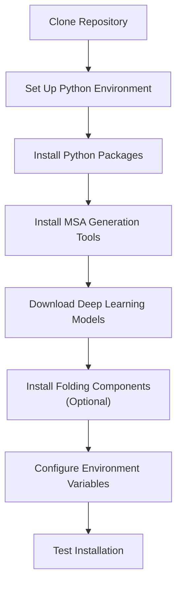
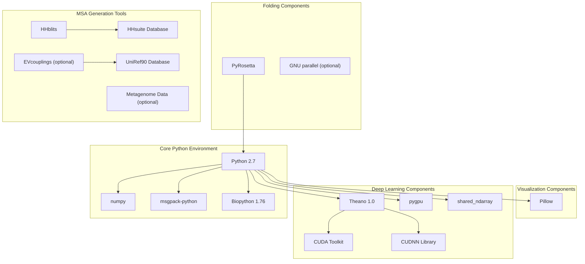
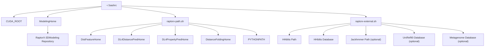

# Installation and Setup

> **Relevant source files**
> * [DL4DistancePrediction4/Utils/GenerateMetaData.py](https://github.com/j3xugit/RaptorX-3DModeling/blob/22b58bc9/DL4DistancePrediction4/Utils/GenerateMetaData.py)
> * [LICENSE](https://github.com/j3xugit/RaptorX-3DModeling/blob/22b58bc9/LICENSE)
> * [README.md](https://github.com/j3xugit/RaptorX-3DModeling/blob/22b58bc9/README.md?plain=1)
> * [raptorx-path.sh](https://github.com/j3xugit/RaptorX-3DModeling/blob/22b58bc9/raptorx-path.sh)

This page provides detailed instructions for installing and configuring the RaptorX-3DModeling system on your machine. It covers all dependencies, environment setup, and necessary configuration to get the system running properly. For instructions on how to use the system once installed, please see [Main Workflow](/j3xugit/RaptorX-3DModeling/2-main-workflow).

RaptorX-3DModeling requires several external packages, databases, and specific environment configurations. This guide will walk you through setting up each component systematically.

## System Requirements

RaptorX-3DModeling has been primarily tested on Linux systems with the following specifications:

* Linux distribution (CentOS >6.0) with bash shell
* Python 2.7 (Python 3 support is planned for future releases)
* GPU with CUDA support (recommended for efficient prediction)

For optimal performance when folding large proteins:

* GPU with ≥12GB memory for distance/orientation prediction
* CPU with ≥10GB memory for folding and relaxation

Sources: [README.md L7-L11](https://github.com/j3xugit/RaptorX-3DModeling/blob/22b58bc9/README.md?plain=1#L7-L11)

 [README.md L165-L171](https://github.com/j3xugit/RaptorX-3DModeling/blob/22b58bc9/README.md?plain=1#L165-L171)

## Installation Workflow



Sources: [README.md L21-L45](https://github.com/j3xugit/RaptorX-3DModeling/blob/22b58bc9/README.md?plain=1#L21-L45)

## Download and Basic Setup

1. Clone the repository: ``` git clone https://github.com/j3xugit/RaptorX-3DModeling.git ```
2. The repository contains the following main directories: * `BuildFeatures/`: For MSA generation and feature extraction * `DL4DistancePrediction4/`: For contact/distance/orientation prediction * `DL4PropertyPrediction/`: For local structure property prediction * `Folding/`: For 3D model building * `params/`: Configuration parameters * `Server/`: Server scripts for the complete pipeline
3. Set the environment variables for the installation location: ```javascript export ModelingHome=/path/to/RaptorX-3DModeling ```

Sources: [README.md L23-L44](https://github.com/j3xugit/RaptorX-3DModeling/blob/22b58bc9/README.md?plain=1#L23-L44)

## Python Environment Setup

RaptorX-3DModeling requires Python 2.7 with specific packages. You have two options:

### Option 1: Install Anaconda/Miniconda for Python 2.7

If you don't have Python installed:

```python
# Download and install miniconda for Python 2.7# Follow installation instructions from the Anaconda website
```

### Option 2: Create a Virtual Environment (if you have Python 3)

If you already have Anaconda/Miniconda for Python 3:

```sql
conda create --name RaptorX python=2conda activate RaptorX
```

### Install Required Python Packages

```markdown
# Core requirementsconda install numpyconda install -c anaconda msgpack-pythonpip install biopython==1.76 # For contact/distance prediction visualizationpip install Pillow # For deep learning modelsconda install numpy scipy mklconda install theano pygpu # Install shared_ndarraygit clone https://github.com/crowsonkb/shared_ndarray.gitcd shared_ndarraypython setup.py install
```

Sources: [README.md L50-L90](https://github.com/j3xugit/RaptorX-3DModeling/blob/22b58bc9/README.md?plain=1#L50-L90)

## Dependencies Architecture



Sources: [README.md L48-L144](https://github.com/j3xugit/RaptorX-3DModeling/blob/22b58bc9/README.md?plain=1#L48-L144)

## Installing MSA Generation Tools

Multiple Sequence Alignment (MSA) generation is a critical component. The following tools are required:

### 1. HHblits

1. Install HHblits from [GitHub](https://github.com/j3xugit/RaptorX-3DModeling/blob/22b58bc9/GitHub)
2. Download a sequence database for HHblits: ```python # Download UniRef30_2020_03_hhsuite.tar.gz from http://wwwuser.gwdg.de/~compbiol/uniclust/2020_03/# Extract the database to a suitable location ```

### 2. EVcouplings (Optional)

For generating MSAs using jackhmmer (slower but optional):

```sql
git clone https://github.com/debbiemarkslab/EVcouplings.gitconda create -n evfold anaconda python=3conda activate evfoldcd EVcouplingspython setup.py install
```

Note: Since EVcouplings uses Python 3, you'll need to switch between virtual environments.

### 3. Metagenome Data (Optional)

Download metagenome data to enhance MSA generation:

```python
# Download metaclust_50.fasta from https://metaclust.mmseqs.org/current_release/# Save it to an accessible location
```

Sources: [README.md L93-L116](https://github.com/j3xugit/RaptorX-3DModeling/blob/22b58bc9/README.md?plain=1#L93-L116)

## Deep Learning Models

The deep learning models are essential for prediction but are not included in the repository due to their size.

1. Download model packages from [Zenodo](https://doi.org/10.5281/zenodo.4710337) or [RaptorX](http://raptorx.uchicago.edu/download/): * `RXDeepModels4DistOri-FM.tar.gz`: 6 models for contact/distance/orientation prediction * `RXDeepModels4Property.tar.gz`: 7 models for Phi/Psi angle, SS and ACC prediction
2. Extract and place the models: ```markdown # For distance/orientation modelstar -xzvf RXDeepModels4DistOri-FM.tar.gzcp *.pkl $ModelingHome/DL4DistancePrediction4/models/ # For property modelstar -xzvf RXDeepModels4Property.tar.gzcp *.pkl $ModelingHome/DL4PropertyPrediction/models/ ```

Sources: [README.md L120-L127](https://github.com/j3xugit/RaptorX-3DModeling/blob/22b58bc9/README.md?plain=1#L120-L127)

## Folding Components (Optional)

These components are required only if you want to build 3D models.

### 1. PyRosetta

```python
# Download PyRosetta for Python 2.7 from http://www.pyrosetta.org/dowtar -xzvf PyRosetta4.Release.python27.linux.release-224.tar.gzcd PyRosetta4.Release.python27.linux.release-224/setup/python setup.py install
```

### 2. GNU Parallel (Optional but Recommended)

This enables running multiple folding jobs in parallel:

```go
# Install GNU parallel using your system's package manager# e.g., for CentOS: yum install parallel
```

Sources: [README.md L129-L144](https://github.com/j3xugit/RaptorX-3DModeling/blob/22b58bc9/README.md?plain=1#L129-L144)

## Environment Configuration

Proper environment setup is crucial for RaptorX to function correctly. The following configurations should be added to your shell profile:

1. Edit your `.bashrc` (or `.cshrc` for csh shell): ```javascript # Add to ~/.bashrcexport CUDA_ROOT=/usr/local/cuda/export ModelingHome=$HOME/RaptorX-3DModeling/. $ModelingHome/raptorx-path.sh. $ModelingHome/raptorx-external.sh ```
2. Update `raptorx-external.sh` with your specific paths to external tools and databases: ```markdown # Edit the file to set paths for:# - HHblits and its database# - EVcouplings and UniRef90 database (if used)# - Metagenome data (if used)# - Other external components ```
3. Verify that `raptorx-path.sh` contains the correct internal paths: ```javascript # This file sets paths to the main RaptorX componentsexport DistFeatureHome=$ModelingHome/BuildFeatures/export DL4DistancePredHome=$ModelingHome/DL4DistancePrediction4/export DL4PropertyPredHome=$ModelingHome/DL4PropertyPrediction/export DistanceFoldingHome=$ModelingHome/Folding/export PYTHONPATH=$ModelingHome:$PYTHONPATHexport PATH=$ModelingHome/bin:$PATH ```
4. Reload your shell configuration: ``` source ~/.bashrc ```

Sources: [README.md L205-L223](https://github.com/j3xugit/RaptorX-3DModeling/blob/22b58bc9/README.md?plain=1#L205-L223)

 [raptorx-path.sh L1-L8](https://github.com/j3xugit/RaptorX-3DModeling/blob/22b58bc9/raptorx-path.sh#L1-L8)

## Environment Variables Diagram



Sources: [README.md L205-L223](https://github.com/j3xugit/RaptorX-3DModeling/blob/22b58bc9/README.md?plain=1#L205-L223)

 [raptorx-path.sh L1-L8](https://github.com/j3xugit/RaptorX-3DModeling/blob/22b58bc9/raptorx-path.sh#L1-L8)

## Testing Your Installation

To verify that your installation is working correctly:

1. Test feature generation from an MSA file: ``` BuildFeatures/GenDistFeaturesFromMSA.sh -o Test_Feat BuildFeatures/example/1pazA.a3m ``` This should generate three files in `Test_Feat/`: `1pazA.inputsFeatures.pkl`, `1pazA.extraCCM.pkl`, and `1pazA.a2m`.
2. Test distance/orientation prediction: ``` DL4DistancePrediction4/Scripts/PredictPairwiseRelation4OneInput.sh -d ./Test_Dist Test_Feat/1pazA.inputsFeatures.pkl ``` This should generate `Test_Dist/1pazA.predictedDistMatrix.pkl`.
3. Generate a contact matrix in text format: ``` DL4DistancePrediction4/Scripts/PrintContactPrediction.sh Test_Dist/1pazA.predictedDistMatrix.pkl ``` This should create `1pazA.CASP.rr` and `1pazA.CM.txt`.
4. If all these steps succeed, your basic installation is working correctly.

Sources: [README.md L308-L326](https://github.com/j3xugit/RaptorX-3DModeling/blob/22b58bc9/README.md?plain=1#L308-L326)

## Complete Installation Checklist

| Component | Required | Status Check Command |
| --- | --- | --- |
| Python 2.7 | Yes | `python --version` |
| numpy | Yes | `python -c "import numpy; print(numpy.__version__)"` |
| msgpack-python | Yes | `python -c "import msgpack; print(msgpack.__version__)"` |
| Biopython | Yes | `python -c "import Bio; print(Bio.__version__)"` |
| Theano | Yes | `python -c "import theano; print(theano.__version__)"` |
| pygpu | Yes | `python -c "import pygpu; print(pygpu.__version__)"` |
| shared_ndarray | Yes | `python -c "import shared_ndarray"` |
| Pillow | Yes | `python -c "import PIL; print(PIL.__version__)"` |
| HHblits | Yes | `which hhblits` |
| HHblits Database | Yes | Check `raptorx-external.sh` |
| EVcouplings | No | Check if virtual environment exists |
| UniRef90 Database | No | Check `raptorx-external.sh` |
| Metagenome Data | No | Check `raptorx-external.sh` |
| DL Models for Distance | Yes | Check files in `DL4DistancePredHome/models/` |
| DL Models for Properties | Yes | Check files in `DL4PropertyPredHome/models/` |
| PyRosetta | No (Yes for 3D models) | `python -c "import pyrosetta"` |
| GNU Parallel | No | `which parallel` |

Sources: [README.md L48-L144](https://github.com/j3xugit/RaptorX-3DModeling/blob/22b58bc9/README.md?plain=1#L48-L144)

## Troubleshooting Common Issues

### GPU-related Issues

* Ensure CUDA and CUDNN are properly installed and compatible with Theano
* Check that `CUDA_ROOT` is correctly set to your CUDA installation path
* Verify GPU compatibility with CUDA version

### Missing Python Packages

If you encounter import errors:

* Make sure you're in the correct Python environment (use `conda activate RaptorX` if needed)
* Try reinstalling the problematic packages

### MSA Generation Failures

* Verify HHblits is correctly installed and in your PATH
* Check database paths in `raptorx-external.sh`
* Ensure databases are properly downloaded and extracted

### Deep Learning Model Loading Failures

* Verify all model files (`.pkl`) are correctly placed in the appropriate directories
* Check that file permissions allow reading the models

## Next Steps

Once you have successfully installed and configured RaptorX-3DModeling, you can:

1. Learn how to run the complete protein structure prediction pipeline with [RaptorXFolder.sh](/j3xugit/RaptorX-3DModeling/2.1-raptorxfolder.sh)
2. Explore available pipeline options with [Pipeline Options](/j3xugit/RaptorX-3DModeling/2.2-pipeline-options)
3. Learn more about individual modules: * [BuildFeatures Module](/j3xugit/RaptorX-3DModeling/3-buildfeatures-module) for MSA generation and feature extraction * [DL4DistancePrediction4 Module](/j3xugit/RaptorX-3DModeling/4-dl4distanceprediction4-module) for distance/orientation prediction * [DL4PropertyPrediction Module](/j3xugit/RaptorX-3DModeling/5-dl4propertyprediction-module) for property prediction * [Folding Module](/j3xugit/RaptorX-3DModeling/6-folding-module) for 3D model building

Sources: [README.md L145-L284](https://github.com/j3xugit/RaptorX-3DModeling/blob/22b58bc9/README.md?plain=1#L145-L284)