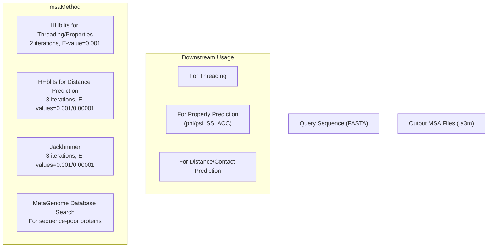
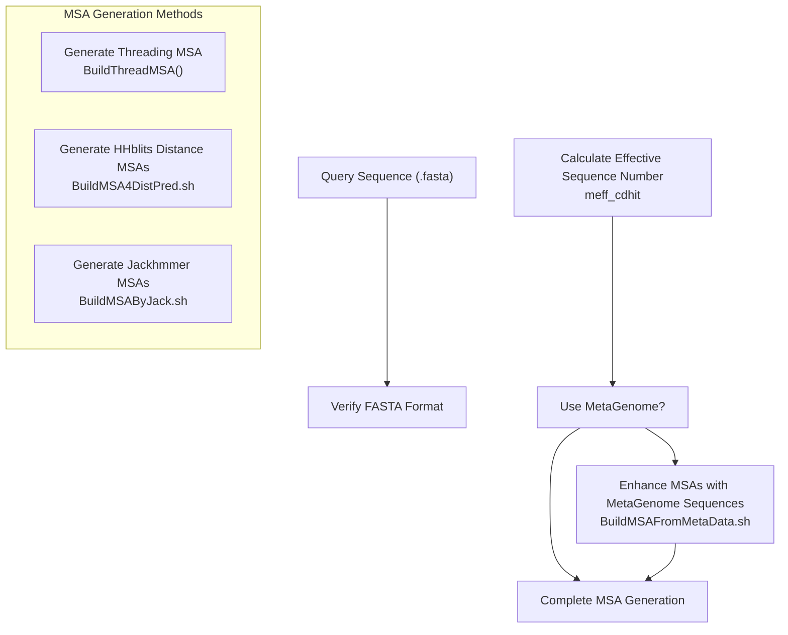
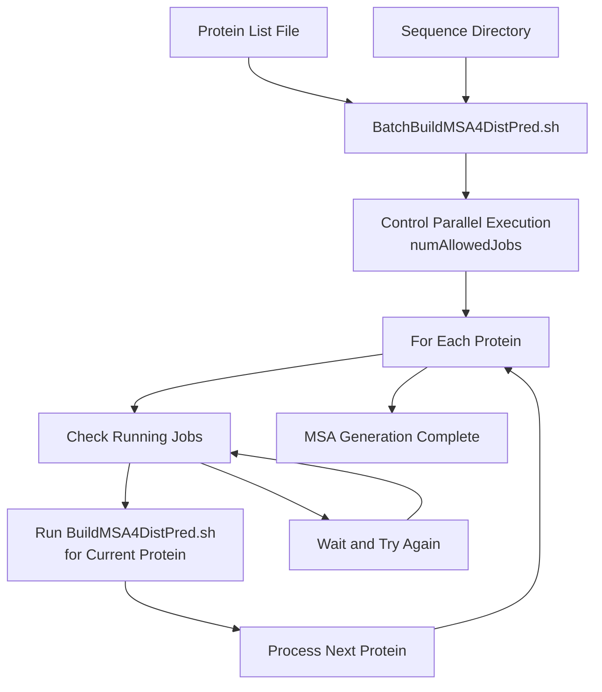
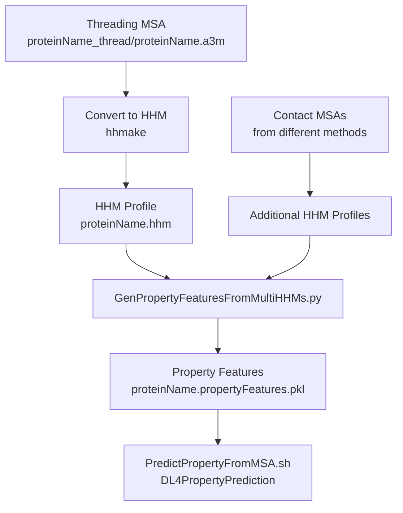
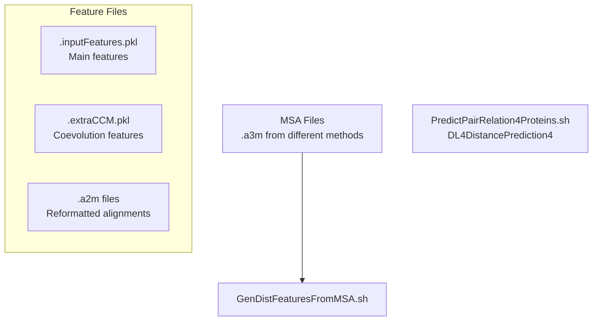

# MSA Generation

> **Relevant source files**
> * [BuildFeatures/BuildMSAs.sh](https://github.com/j3xugit/RaptorX-3DModeling/blob/22b58bc9/BuildFeatures/BuildMSAs.sh)
> * [BuildFeatures/EVAlign/BuildMSAByJack_evfold3.sh](https://github.com/j3xugit/RaptorX-3DModeling/blob/22b58bc9/BuildFeatures/EVAlign/BuildMSAByJack_evfold3.sh)
> * [BuildFeatures/Helpers/BatchBuildMSA4DistPred.sh](https://github.com/j3xugit/RaptorX-3DModeling/blob/22b58bc9/BuildFeatures/Helpers/BatchBuildMSA4DistPred.sh)
> * [DL4DistancePrediction4/config.py](https://github.com/j3xugit/RaptorX-3DModeling/blob/22b58bc9/DL4DistancePrediction4/config.py)
> * [DL4PropertyPrediction/Scripts/CollectPropertyFeatures.sh](https://github.com/j3xugit/RaptorX-3DModeling/blob/22b58bc9/DL4PropertyPrediction/Scripts/CollectPropertyFeatures.sh)
> * [DL4PropertyPrediction/Scripts/PredictPropertyLocal.sh](https://github.com/j3xugit/RaptorX-3DModeling/blob/22b58bc9/DL4PropertyPrediction/Scripts/PredictPropertyLocal.sh)
> * [Utils/RunHHpred.sh](https://github.com/j3xugit/RaptorX-3DModeling/blob/22b58bc9/Utils/RunHHpred.sh)

This document describes the Multiple Sequence Alignment (MSA) generation process in RaptorX-3DModeling, a critical first step in the protein structure prediction pipeline. MSAs capture evolutionary information that significantly improves prediction accuracy for various structural features. This page covers the different MSA generation methods, their configurations, and how they feed into downstream prediction tasks.

For information about feature extraction from MSAs, see [Feature Extraction](/j3xugit/RaptorX-3DModeling/3.2-feature-extraction).

## Purpose and Importance

Multiple Sequence Alignments reveal evolutionary relationships between protein sequences by aligning homologous proteins. In protein structure prediction, MSAs provide critical information about:

1. Conserved residues that may be functionally or structurally important
2. Coevolution patterns between residues that indicate spatial proximity in the 3D structure
3. Evolutionary constraints that help determine likely secondary structures

RaptorX-3DModeling generates different types of MSAs optimized for specific downstream prediction tasks:

* MSAs for threading and local structure property prediction
* MSAs for contact and distance prediction
* Enhanced MSAs using metagenome data

Sources: [BuildFeatures/BuildMSAs.sh L40-L57](https://github.com/j3xugit/RaptorX-3DModeling/blob/22b58bc9/BuildFeatures/BuildMSAs.sh#L40-L57)

## MSA Generation Methods

RaptorX-3DModeling employs several methods to generate diverse MSAs that capture different aspects of evolutionary information:



Sources: [BuildFeatures/BuildMSAs.sh L122-L148](https://github.com/j3xugit/RaptorX-3DModeling/blob/22b58bc9/BuildFeatures/BuildMSAs.sh#L122-L148)

 [BuildFeatures/BuildMSAs.sh L212-L248](https://github.com/j3xugit/RaptorX-3DModeling/blob/22b58bc9/BuildFeatures/BuildMSAs.sh#L212-L248)

 [BuildFeatures/BuildMSAs.sh L252-L303](https://github.com/j3xugit/RaptorX-3DModeling/blob/22b58bc9/BuildFeatures/BuildMSAs.sh#L252-L303)

### Method Selection

The BuildMSAs.sh script controls which methods are used through a mode parameter that combines different flags:

| Flag | Value | Method |
| --- | --- | --- |
| 1 | 0001 | HHblits for threading/property prediction |
| 2 | 0010 | HHblits 2.0 for contact (obsolete) |
| 4 | 0100 | Jackhmmer for contact/distance prediction |
| 8 | 1000 | HHblits for contact/distance prediction |
| 16 | 10000 | MetaGenome database search for all generated MSAs |

The default mode is 25 (1+8+16), which builds MSAs for threading and contact/distance prediction using HHblits and enhances them with metagenome data.

Sources: [BuildFeatures/BuildMSAs.sh L32-L57](https://github.com/j3xugit/RaptorX-3DModeling/blob/22b58bc9/BuildFeatures/BuildMSAs.sh#L32-L57)

 [BuildFeatures/BuildMSAs.sh L112-L127](https://github.com/j3xugit/RaptorX-3DModeling/blob/22b58bc9/BuildFeatures/BuildMSAs.sh#L112-L127)

## MSA Generation Workflow



Sources: [BuildFeatures/BuildMSAs.sh L97-L304](https://github.com/j3xugit/RaptorX-3DModeling/blob/22b58bc9/BuildFeatures/BuildMSAs.sh#L97-L304)

### HHblits MSAs

HHblits is run with different parameters to generate MSAs for different purposes:

1. **For Threading/Property Prediction**: * 2 iterations * E-value: 0.001 * Maximum effective sequences (neffmax): 6 * Output: `.a3m` alignment file and `.tgt` file for threading
2. **For Distance/Contact Prediction**: * 3 iterations * Two different E-values: * E-value: 0.001 (looser threshold, more sequences) → `_uce3` suffix * E-value: 0.00001 (stricter threshold, more reliable sequences) → `_uce5` suffix * Output: `.a3m` alignment files

Sources: [BuildFeatures/BuildMSAs.sh L132-L158](https://github.com/j3xugit/RaptorX-3DModeling/blob/22b58bc9/BuildFeatures/BuildMSAs.sh#L132-L158)

 [BuildFeatures/BuildMSAs.sh L212-L248](https://github.com/j3xugit/RaptorX-3DModeling/blob/22b58bc9/BuildFeatures/BuildMSAs.sh#L212-L248)

### Jackhmmer MSAs

Jackhmmer (from the HMMER suite) is used as an alternative method to generate MSAs:

* 3 iterations
* Two different E-values: * E-value: 0.001 → `_ure3` suffix * E-value: 0.00001 → `_ure5` suffix
* Output: `.a3m` alignment files

The script `BuildMSAByJack.sh` configures EVcouplings to run Jackhmmer against a sequence database (usually UniRef90).

Sources: [BuildFeatures/BuildMSAs.sh L252-L303](https://github.com/j3xugit/RaptorX-3DModeling/blob/22b58bc9/BuildFeatures/BuildMSAs.sh#L252-L303)

 [BuildFeatures/EVAlign/BuildMSAByJack_evfold3.sh L17-L140](https://github.com/j3xugit/RaptorX-3DModeling/blob/22b58bc9/BuildFeatures/EVAlign/BuildMSAByJack_evfold3.sh#L17-L140)

### MetaGenome Enhancement

For proteins with few homologs (sequence-poor), RaptorX enhances MSAs with sequences from metagenomic databases:

1. Calculate effective sequence number (Meff) for each MSA
2. If Meff < 6 (indicating few effective sequences), run metagenomic search
3. Combine original MSA with sequences found in metagenomic databases

This enhancement is particularly important for hard targets with limited homology information.

Sources: [BuildFeatures/BuildMSAs.sh L319-L358](https://github.com/j3xugit/RaptorX-3DModeling/blob/22b58bc9/BuildFeatures/BuildMSAs.sh#L319-L358)

## MSA File Formats and Organization

### File Structure

The BuildMSAs.sh script organizes MSA files into a specific directory structure:

```python
proteinName_OUT/
├── proteinName.seq                  # Verified sequence file
├── proteinName_thread/              # MSAs for threading
│   ├── proteinName.a3m              # MSA in A3M format
│   ├── proteinName.hhm              # HMM profile
│   └── proteinName.tgt              # Target file for threading
└── proteinName_contact/             # MSAs for contact/distance prediction
    ├── proteinName_uce3/            # HHblits MSA with E-value 0.001
    │   ├── proteinName.a3m
    │   └── proteinName.meff         # Effective sequence number
    ├── proteinName_uce5/            # HHblits MSA with E-value 0.00001
    ├── proteinName_ure3/            # Jackhmmer MSA with E-value 0.001
    ├── proteinName_ure5/            # Jackhmmer MSA with E-value 0.00001
    └── proteinName_*_meta/          # Enhanced MSAs from metagenomic search
```

Sources: [BuildFeatures/BuildMSAs.sh L106-L109](https://github.com/j3xugit/RaptorX-3DModeling/blob/22b58bc9/BuildFeatures/BuildMSAs.sh#L106-L109)

 [BuildFeatures/BuildMSAs.sh L142-L143](https://github.com/j3xugit/RaptorX-3DModeling/blob/22b58bc9/BuildFeatures/BuildMSAs.sh#L142-L143)

 [BuildFeatures/BuildMSAs.sh L166](https://github.com/j3xugit/RaptorX-3DModeling/blob/22b58bc9/BuildFeatures/BuildMSAs.sh#L166-L166)

### File Formats

The primary MSA file formats used in RaptorX-3DModeling are:

* **A3M**: A compressed MSA format that includes only aligned residues. Used as input for most feature generation steps.
* **HHM**: HMM profiles generated from A3M files using hhmake. Used for property prediction and threading.
* **MEFF**: Files containing the effective number of sequences in an MSA. Used to determine whether metagenomic enhancement is needed.

Sources: [BuildFeatures/BuildMSAs.sh L145-L156](https://github.com/j3xugit/RaptorX-3DModeling/blob/22b58bc9/BuildFeatures/BuildMSAs.sh#L145-L156)

 [DL4PropertyPrediction/Scripts/CollectPropertyFeatures.sh L48-L55](https://github.com/j3xugit/RaptorX-3DModeling/blob/22b58bc9/DL4PropertyPrediction/Scripts/CollectPropertyFeatures.sh#L48-L55)

## Batch Processing for Multiple Proteins

For large-scale structure prediction, RaptorX provides a batch processing script to generate MSAs for multiple proteins simultaneously:



Sources: [BuildFeatures/Helpers/BatchBuildMSA4DistPred.sh L8-L115](https://github.com/j3xugit/RaptorX-3DModeling/blob/22b58bc9/BuildFeatures/Helpers/BatchBuildMSA4DistPred.sh#L8-L115)

The batch script:

1. Takes a list of protein names and a directory containing sequence files
2. Controls the number of simultaneously running MSA generation jobs
3. Runs BuildMSA4DistPred.sh for each protein with the specified parameters
4. Saves results to a designated output directory

Sources: [BuildFeatures/Helpers/BatchBuildMSA4DistPred.sh L16-L26](https://github.com/j3xugit/RaptorX-3DModeling/blob/22b58bc9/BuildFeatures/Helpers/BatchBuildMSA4DistPred.sh#L16-L26)

 [BuildFeatures/Helpers/BatchBuildMSA4DistPred.sh L98-L113](https://github.com/j3xugit/RaptorX-3DModeling/blob/22b58bc9/BuildFeatures/Helpers/BatchBuildMSA4DistPred.sh#L98-L113)

## Using MSAs for Feature Generation

The generated MSAs serve as input for feature extraction processes used by different prediction modules:

### Property Prediction Features

Property prediction (phi/psi angles, secondary structure, solvent accessibility) primarily uses MSAs from the threading pipeline:



Sources: [DL4PropertyPrediction/Scripts/CollectPropertyFeatures.sh L42-L83](https://github.com/j3xugit/RaptorX-3DModeling/blob/22b58bc9/DL4PropertyPrediction/Scripts/CollectPropertyFeatures.sh#L42-L83)

### Distance Prediction Features

Distance prediction uses MSAs from both HHblits and Jackhmmer to capture diverse evolutionary signals:



## MSA Selection Strategy

RaptorX's MSA generation strategy relies on generating multiple MSAs with different methods and parameters, then using them for specialized prediction tasks:

| MSA Type | Parameters | Primary Use | Feature Extraction |
| --- | --- | --- | --- |
| Threading MSA | HHblits, 2 iter, E=0.001 | Property prediction, Threading | GenPropertyFeaturesFromMultiHHMs.py |
| HHblits_uce3 | HHblits, 3 iter, E=0.001 | Distance prediction | GenDistFeaturesFromMSA.sh |
| HHblits_uce5 | HHblits, 3 iter, E=0.00001 | Distance prediction | GenDistFeaturesFromMSA.sh |
| Jackhmmer_ure3 | Jackhmmer, 3 iter, E=0.001 | Distance prediction | GenDistFeaturesFromMSA.sh |
| Jackhmmer_ure5 | Jackhmmer, 3 iter, E=0.00001 | Distance prediction | GenDistFeaturesFromMSA.sh |
| Metagenomic enhanced | Various | Improve results for sequence-poor proteins | GenDistFeaturesFromMSA.sh |

This diverse set of MSAs helps capture different aspects of evolutionary information and improves the overall prediction accuracy, especially for proteins with limited homology information.

Sources: [BuildFeatures/BuildMSAs.sh L122-L358](https://github.com/j3xugit/RaptorX-3DModeling/blob/22b58bc9/BuildFeatures/BuildMSAs.sh#L122-L358)

 [DL4PropertyPrediction/Scripts/CollectPropertyFeatures.sh L57-L79](https://github.com/j3xugit/RaptorX-3DModeling/blob/22b58bc9/DL4PropertyPrediction/Scripts/CollectPropertyFeatures.sh#L57-L79)

## Common Issues and Troubleshooting

* **Empty A3M files**: If an MSA generation method produces empty A3M files, the system removes those directories to avoid downstream errors.
* **Large MSAs**: For MSAs with more than 200,000 lines, the system sets a default effective sequence number (Meff) of 11 to avoid computation overhead.
* **Missing database**: The scripts require properly set environment variables (HHDB, JackDB) to find sequence databases for searches.

Sources: [BuildFeatures/BuildMSAs.sh L306-L317](https://github.com/j3xugit/RaptorX-3DModeling/blob/22b58bc9/BuildFeatures/BuildMSAs.sh#L306-L317)

 [BuildFeatures/BuildMSAs.sh L233-L244](https://github.com/j3xugit/RaptorX-3DModeling/blob/22b58bc9/BuildFeatures/BuildMSAs.sh#L233-L244)

 [BuildFeatures/BuildMSAs.sh L253-L258](https://github.com/j3xugit/RaptorX-3DModeling/blob/22b58bc9/BuildFeatures/BuildMSAs.sh#L253-L258)