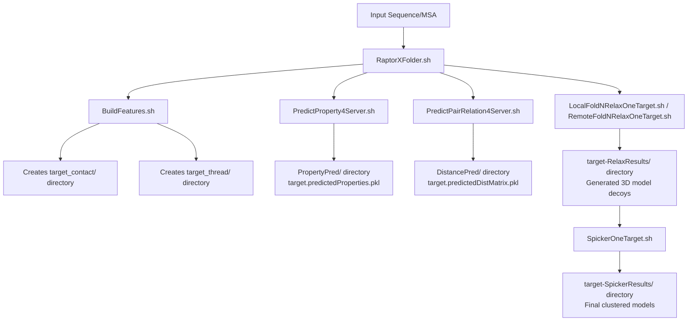
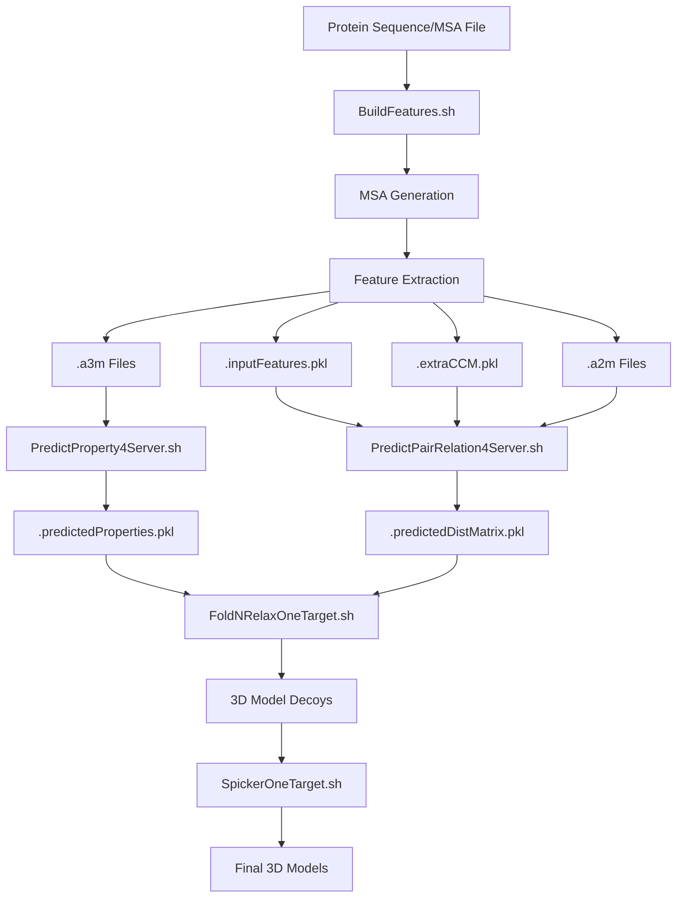
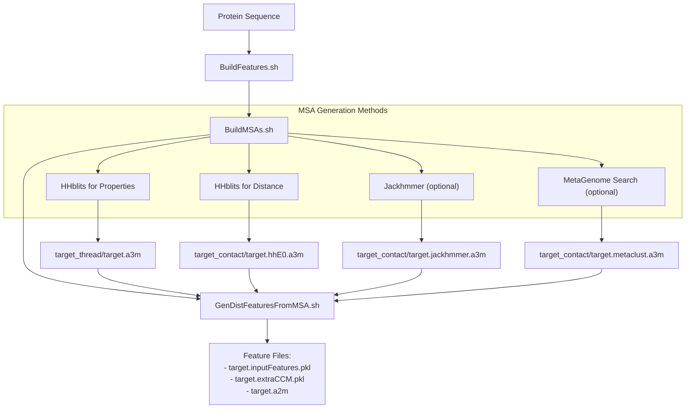
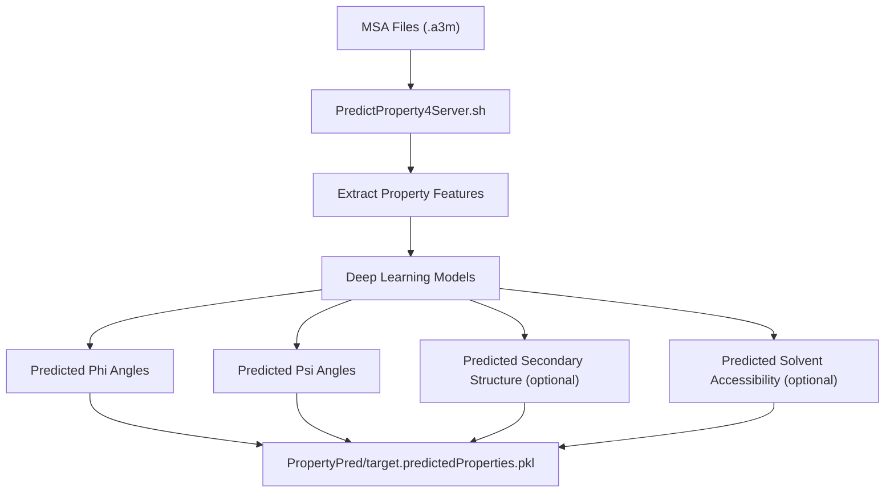
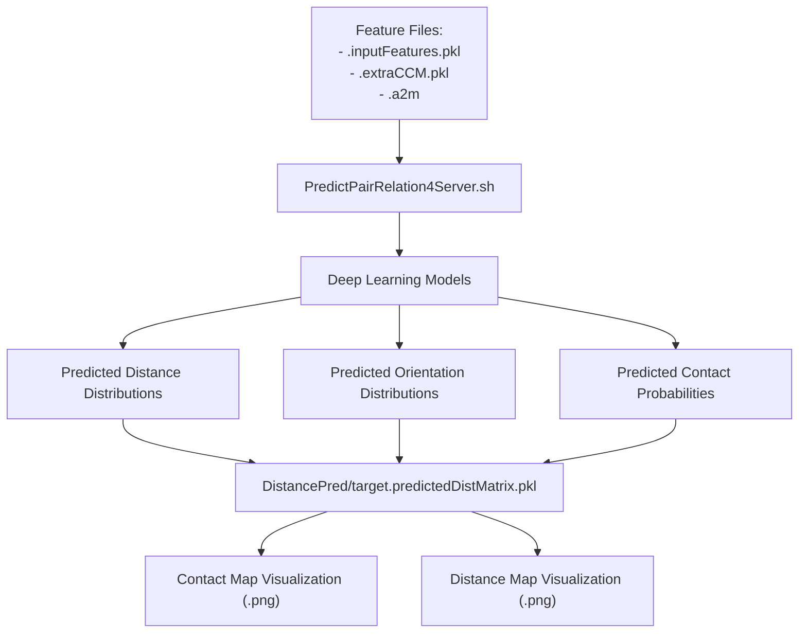
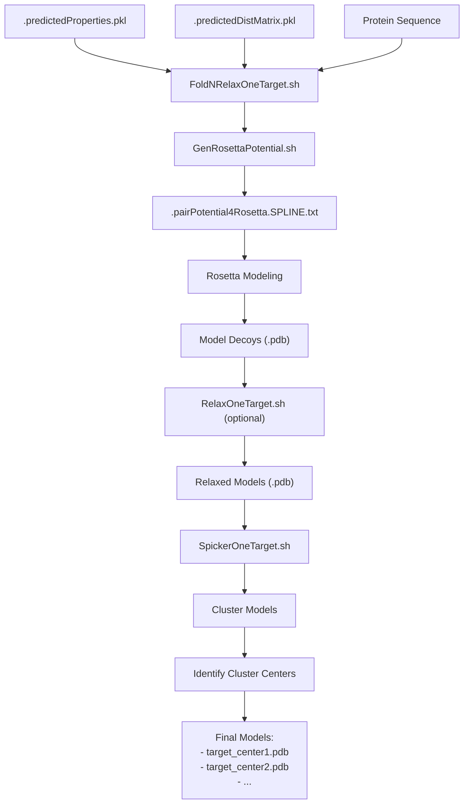

# Main Workflow

> **Relevant source files**
> * [DL4DistancePrediction4/Utils/GenerateMetaData.py](https://github.com/j3xugit/RaptorX-3DModeling/blob/22b58bc9/DL4DistancePrediction4/Utils/GenerateMetaData.py)
> * [Folding/Scripts4Rosetta/RelaxOneTarget.sh](https://github.com/j3xugit/RaptorX-3DModeling/blob/22b58bc9/Folding/Scripts4Rosetta/RelaxOneTarget.sh)
> * [Folding/Scripts4SPICKER/SpickerOneTarget.sh](https://github.com/j3xugit/RaptorX-3DModeling/blob/22b58bc9/Folding/Scripts4SPICKER/SpickerOneTarget.sh)
> * [README.md](https://github.com/j3xugit/RaptorX-3DModeling/blob/22b58bc9/README.md?plain=1)
> * [Server/RaptorXFolder.sh](https://github.com/j3xugit/RaptorX-3DModeling/blob/22b58bc9/Server/RaptorXFolder.sh)
> * [raptorx-path.sh](https://github.com/j3xugit/RaptorX-3DModeling/blob/22b58bc9/raptorx-path.sh)

This page documents the end-to-end workflow of RaptorX-3DModeling, tracing the path from an input protein sequence to a predicted 3D structure. The Main Workflow represents the core functionality of the system orchestrated by the `RaptorXFolder.sh` script, which coordinates multiple specialized modules to generate accurate protein structure predictions.

For system architecture and high-level components, see [System Architecture](/j3xugit/RaptorX-3DModeling/1.1-system-architecture). For detailed installation instructions, see [Installation and Setup](/j3xugit/RaptorX-3DModeling/1.2-installation-and-setup).

## Workflow Overview



Sources: [Server/RaptorXFolder.sh L1-L209](https://github.com/j3xugit/RaptorX-3DModeling/blob/22b58bc9/Server/RaptorXFolder.sh#L1-L209)

The workflow consists of four major steps:

1. **Feature Generation**: Build multiple sequence alignments (MSAs) and extract evolutionary features
2. **Property Prediction**: Predict local structural properties (phi/psi angles, secondary structure)
3. **Distance Prediction**: Predict distances and orientations between residues
4. **3D Modeling**: Generate and cluster 3D models based on predictions

## The Main Entry Point: RaptorXFolder.sh

`RaptorXFolder.sh` is the primary script that orchestrates the entire prediction pipeline, integrating all the modules in the correct sequence.

### Command-Line Options

| Option | Description | Default Value |
| --- | --- | --- |
| `-o outDir` | Output directory | Current directory |
| `-g gpu` | GPU selection (-1: auto-select) | -1 |
| `-m MSAmethod` | MSA generation method | 9 |
| `-n numDecoys` | Number of 3D models to generate | 120 |
| `-r runningMode` | Whether to relax models (0: fold only, 1: fold+relax) | 0 |
| `-R remoteAccountInfo` | Remote account for folding | (empty) |
| `-t machineType` | Type of machine for folding | 0 |
| `-l maxLen2BeFolded` | Maximum protein length for folding | 1050 |
| `-c` | Print only contact probability in CASP format | 0 |

The MSA generation method (`-m`) is determined by adding up the following values:

* 1: HHblits for property prediction
* 2: HHblits 2.0 for distance prediction (obsolete)
* 4: Jackhmmer for distance prediction (not recommended)
* 8: HHblits 3.0 for distance prediction
* 16: MetaGenome search for distance prediction

For example, `-m 9` means using HHblits for both property prediction (1) and distance prediction using HHblits 3.0 (8).

Sources: [Server/RaptorXFolder.sh L28-L72](https://github.com/j3xugit/RaptorX-3DModeling/blob/22b58bc9/Server/RaptorXFolder.sh#L28-L72)

### Data Flow Between Modules



Sources: [Server/RaptorXFolder.sh L134-L206](https://github.com/j3xugit/RaptorX-3DModeling/blob/22b58bc9/Server/RaptorXFolder.sh#L134-L206)

## Step 1: MSA Generation and Feature Extraction

The first step is handled by the `BuildFeatures.sh` script, which performs two essential functions:

1. Generating multiple sequence alignments (MSAs) using different search methods
2. Extracting features from these MSAs for use in deep learning models



### MSA Generation

The MSA generation method is controlled by the `-m` option of `RaptorXFolder.sh`. The system can use multiple search tools and databases:

* **HHblits**: Fast and effective for most proteins
* **Jackhmmer**: More sensitive but slower (not recommended by default)
* **MetaGenome search**: Can find remote homologs not in standard databases

Each method produces MSA files in a3m format, saved in the target-specific directories.

### Feature Extraction

After generating MSAs, the `GenDistFeaturesFromMSA.sh` script extracts evolutionary features that capture patterns of amino acid conservation and covariation. These features include:

* Position-specific scoring matrices
* Coevolution-based features from CCMpred
* Other statistical features derived from the MSAs

The output includes three key files:

* `.inputFeatures.pkl`: Primary features for neural networks
* `.extraCCM.pkl`: Additional coevolution features
* `.a2m`: A processed MSA file format

Sources: [Server/RaptorXFolder.sh L134-L143](https://github.com/j3xugit/RaptorX-3DModeling/blob/22b58bc9/Server/RaptorXFolder.sh#L134-L143)

 [README.md L228-L255](https://github.com/j3xugit/RaptorX-3DModeling/blob/22b58bc9/README.md?plain=1#L228-L255)

## Step 2: Property Prediction

The second step uses the `PredictProperty4Server.sh` script to predict local structural properties from the MSAs.



The property prediction module uses deep neural networks to predict:

* **Phi/Psi angles**: Backbone torsion angles that define the local 3D structure
* **Secondary structure**: Helix, strand, or coil classification (optional)
* **Solvent accessibility**: Exposure of residues to solvent (optional)

These properties provide important local geometric constraints for the 3D modeling step. The predictions are stored in a `.predictedProperties.pkl` file in the `PropertyPred/` directory.

Sources: [Server/RaptorXFolder.sh L145-L155](https://github.com/j3xugit/RaptorX-3DModeling/blob/22b58bc9/Server/RaptorXFolder.sh#L145-L155)

 [README.md L279](https://github.com/j3xugit/RaptorX-3DModeling/blob/22b58bc9/README.md?plain=1#L279-L279)

## Step 3: Distance/Orientation Prediction

The third step uses the `PredictPairRelation4Server.sh` script to predict distances and orientations between residue pairs.



The distance prediction module uses deep convolutional neural networks to predict:

* **Distance distributions**: Probability distributions for the distance between residue pairs
* **Orientation distributions**: Probability distributions for the relative orientation between residue pairs
* **Contact probabilities**: Probability that two residues are in contact (distance < 8Å)

These predictions capture the global 3D structure of the protein and are crucial for accurate folding. The predictions are stored in a `.predictedDistMatrix.pkl` file in the `DistancePred/` directory.

Sources: [Server/RaptorXFolder.sh L162-L172](https://github.com/j3xugit/RaptorX-3DModeling/blob/22b58bc9/Server/RaptorXFolder.sh#L162-L172)

 [README.md L272-L276](https://github.com/j3xugit/RaptorX-3DModeling/blob/22b58bc9/README.md?plain=1#L272-L276)

## Step 4: 3D Model Generation

The fourth step uses either `LocalFoldNRelaxOneTarget.sh` (for local folding) or `RemoteFoldNRelaxOneTarget.sh` (for remote folding) to generate 3D models.



The 3D model generation process involves several steps:

### 1. Constraint Generation

The predicted distances, orientations, and angles are converted into Rosetta constraints using `GenRosettaPotential.sh`.

### 2. Decoy Generation

Rosetta is used to generate multiple 3D models (decoys) that satisfy the constraints. The number of decoys is controlled by the `-n` option of `RaptorXFolder.sh`.

### 3. Relaxation (Optional)

If the `-r` option is set to 1, the decoys are relaxed using `RelaxOneTarget.sh` to remove steric clashes and optimize side-chain atoms. This step is computationally expensive but improves model quality.

### 4. Clustering

The generated decoys are clustered using `SpickerOneTarget.sh` to identify the most representative models. The clustering process:

1. Selects models for clustering (either all models or a subset based on energy)
2. Runs the SPICKER algorithm to cluster the models
3. Identifies the center model of each cluster

The final output includes several PDB files representing the center models of each cluster, with the first one typically being the most reliable prediction.

Sources: [Server/RaptorXFolder.sh L190-L206](https://github.com/j3xugit/RaptorX-3DModeling/blob/22b58bc9/Server/RaptorXFolder.sh#L190-L206)

 [Folding/Scripts4SPICKER/SpickerOneTarget.sh L1-L146](https://github.com/j3xugit/RaptorX-3DModeling/blob/22b58bc9/Folding/Scripts4SPICKER/SpickerOneTarget.sh#L1-L146)

 [Folding/Scripts4Rosetta/RelaxOneTarget.sh L1-L124](https://github.com/j3xugit/RaptorX-3DModeling/blob/22b58bc9/Folding/Scripts4Rosetta/RelaxOneTarget.sh#L1-L124)

## Output Directory Structure

The `RaptorXFolder.sh` script creates the following directory structure:

```markdown
target_OUT/
├── target_contact/          # MSAs and features for distance prediction
├── target_thread/           # Files for property prediction
├── DistancePred/            # Predicted distances, orientations, and contact maps
│   ├── target.predictedDistMatrix.pkl
│   ├── target.CM.txt        # Contact map in text format
│   ├── target.CASP.rr       # Contact map in CASP format
│   ├── target.png           # Contact map visualization
│   └── target.dist.png      # Distance map visualization
├── PropertyPred/            # Predicted properties
│   └── target.predictedProperties.pkl
├── target-RelaxResults/     # Generated 3D model decoys
│   ├── model1.pdb
│   ├── model2.pdb
│   └── ...
└── target-SpickerResults/   # Clustering results
    ├── target_center1.pdb   # Best model
    ├── target_center2.pdb   # Second best model
    └── ...
```

Sources: [Server/RaptorXFolder.sh L174-L208](https://github.com/j3xugit/RaptorX-3DModeling/blob/22b58bc9/Server/RaptorXFolder.sh#L174-L208)

 [README.md L174-L186](https://github.com/j3xugit/RaptorX-3DModeling/blob/22b58bc9/README.md?plain=1#L174-L186)

## Remote Execution Capabilities

RaptorX-3DModeling supports distributed execution across multiple machines, which is particularly useful for handling different computational requirements:

* GPU-intensive tasks (distance prediction)
* CPU-intensive tasks (3D model generation)

### Running Folding on a Remote Machine

To run folding on a remote machine, use the `-R` option:

```
RaptorXFolder.sh -R username@remote_server:path_to_working_dir -n 120 -r 1 target.fasta
```

This instructs the system to:

1. Run MSA generation, property prediction, and distance prediction locally
2. Transfer necessary files to the remote machine
3. Run folding on the remote machine
4. Transfer the results back

### Running GPU Tasks on Remote Machines

For GPU-intensive tasks, you can create a `GPUMachines.txt` file in the `params/` directory with lines like:

```
gpu_server.example.com LargeRAM on
```

The system will automatically distribute GPU tasks to these machines.

Sources: [README.md L287-L305](https://github.com/j3xugit/RaptorX-3DModeling/blob/22b58bc9/README.md?plain=1#L287-L305)

 [Server/RaptorXFolder.sh L190-L194](https://github.com/j3xugit/RaptorX-3DModeling/blob/22b58bc9/Server/RaptorXFolder.sh#L190-L194)

## Practical Usage Examples

### Basic Usage

To predict a protein structure from a sequence:

```
RaptorXFolder.sh example.fasta
```

This runs the complete pipeline with default settings.

### Prediction Without Folding

To predict contacts/distances without generating 3D models:

```
RaptorXFolder.sh -n 0 example.fasta
```

### Folding With Relaxation

To generate 40 models with relaxation:

```
RaptorXFolder.sh -n 40 -r 1 example.fasta
```

### Using Enhanced MSA Generation

To use metagenome data for better MSA generation:

```
RaptorXFolder.sh -m 25 example.fasta
```

Sources: [README.md L145-L148](https://github.com/j3xugit/RaptorX-3DModeling/blob/22b58bc9/README.md?plain=1#L145-L148)

 [Server/RaptorXFolder.sh L28-L72](https://github.com/j3xugit/RaptorX-3DModeling/blob/22b58bc9/Server/RaptorXFolder.sh#L28-L72)

## Performance Considerations

### Time Requirements

* **MSA Generation**: Minutes to hours, depending on protein size and method
* **Property Prediction**: Minutes on a single GPU
* **Distance Prediction**: Minutes to an hour on a single GPU
* **Folding**: * Without relaxation: ~1 hour per model for a 300-residue protein on a single CPU * With relaxation: 3-4× longer

### Memory Requirements

* **GPU Memory**: * > 12GB for proteins >1000 residues * 8GB sufficient for most proteins <600 residues
* **CPU Memory**: * ~10GB for folding a large protein (>1000 residues) * 2-4GB for average-sized proteins

### Protein Size Limits

* The default maximum protein length for folding is 1050 residues
* This can be increased with the `-l` option, but folding large proteins is computationally expensive

Sources: [README.md L164-L171](https://github.com/j3xugit/RaptorX-3DModeling/blob/22b58bc9/README.md?plain=1#L164-L171)

 [Server/RaptorXFolder.sh L57-L60](https://github.com/j3xugit/RaptorX-3DModeling/blob/22b58bc9/Server/RaptorXFolder.sh#L57-L60)