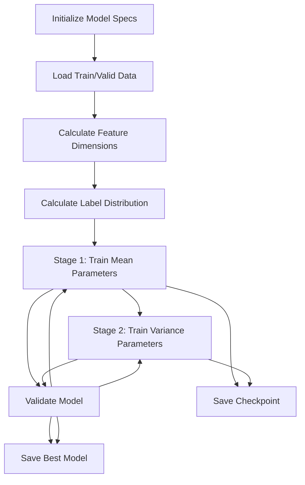

# Model Architecture and Training

> **Relevant source files**
> * [DL4DistancePrediction4/ParseCommandLine.py](https://github.com/j3xugit/RaptorX-3DModeling/blob/22b58bc9/DL4DistancePrediction4/ParseCommandLine.py)
> * [DL4DistancePrediction4/TrainDistancePredictor.py](https://github.com/j3xugit/RaptorX-3DModeling/blob/22b58bc9/DL4DistancePrediction4/TrainDistancePredictor.py)
> * [DL4DistancePrediction4/Utils/GenerateMetaData.sh](https://github.com/j3xugit/RaptorX-3DModeling/blob/22b58bc9/DL4DistancePrediction4/Utils/GenerateMetaData.sh)

This document describes the architecture of the deep learning models used for distance and orientation prediction within the DL4DistancePrediction4 module, as well as the training methodology employed. For information about the distance prediction workflow, see [Distance Prediction Workflow](/j3xugit/RaptorX-3DModeling/4.1-distance-prediction-workflow).

## Purpose

The RaptorX-3DModeling system uses deep learning to predict inter-residue distances, orientations, and other structural features that are then used for 3D structure generation. This document focuses specifically on:

1. The neural network architectures used for predicting distances and orientations
2. The training methodology including optimization algorithms, loss functions, and training stages
3. The input features and output predictions supported by the models

Sources: [DL4DistancePrediction4/TrainDistancePredictor.py L466-L486](https://github.com/j3xugit/RaptorX-3DModeling/blob/22b58bc9/DL4DistancePrediction4/TrainDistancePredictor.py#L466-L486)

## Model Architecture Overview

The distance prediction models in RaptorX use deep 2D convolutional neural networks, primarily variants of ResNets, to predict pairwise relationships between protein residues.

Sources: [DL4DistancePrediction4/ParseCommandLine.py L165-L191](https://github.com/j3xugit/RaptorX-3DModeling/blob/22b58bc9/DL4DistancePrediction4/ParseCommandLine.py#L165-L191)

 [DL4DistancePrediction4/TrainDistancePredictor.py L225-L256](https://github.com/j3xugit/RaptorX-3DModeling/blob/22b58bc9/DL4DistancePrediction4/TrainDistancePredictor.py#L225-L256)

### Supported Network Types

The system supports several network architectures:

* **ResNet2D**: Standard residual network with 2D convolutional layers
* **DilatedResNet2D**: Residual network with dilated convolutions for increased receptive field

The network type is specified via the `-n` command-line parameter when training a model.

Sources: [DL4DistancePrediction4/ParseCommandLine.py L67-L72](https://github.com/j3xugit/RaptorX-3DModeling/blob/22b58bc9/DL4DistancePrediction4/ParseCommandLine.py#L67-L72)

## Network Components

### 1D Convolutional Layers

1D convolutional layers process sequential features extracted from protein sequences and their evolutionary profiles. Key parameters include:

* **Number of hidden units**: Specified via `-c` parameter (e.g., `40,40:0,0`)
* **Half window size**: Controls the local context size (specified via `-w` parameter)
* **Number of repeats**: Controls the network depth

These layers transform the 1D protein sequence representation into features that capture local sequence context.

Sources: [DL4DistancePrediction4/ParseCommandLine.py L205-L212](https://github.com/j3xugit/RaptorX-3DModeling/blob/22b58bc9/DL4DistancePrediction4/ParseCommandLine.py#L205-L212)

 [DL4DistancePrediction4/ParseCommandLine.py L227-L232](https://github.com/j3xugit/RaptorX-3DModeling/blob/22b58bc9/DL4DistancePrediction4/ParseCommandLine.py#L227-L232)

### 2D Convolutional Layers

2D convolutional layers process pairwise features between residues. Parameters include:

* **Number of hidden units**: Specified via `-d` parameter (e.g., `30,30:1,2`)
* **Half window size**: Controls the local context in the 2D space
* **Dilation factors**: For dilated networks, controls the receptive field growth (specified via `-l` parameter)
* **Number of repeats**: Controls the network depth

For dilated networks, the system ensures that `conv2d_dilations` and `conv2d_hwszs` have the same length as `conv2d_repeats`.

Sources: [DL4DistancePrediction4/ParseCommandLine.py L214-L221](https://github.com/j3xugit/RaptorX-3DModeling/blob/22b58bc9/DL4DistancePrediction4/ParseCommandLine.py#L214-L221)

 [DL4DistancePrediction4/ParseCommandLine.py L234-L241](https://github.com/j3xugit/RaptorX-3DModeling/blob/22b58bc9/DL4DistancePrediction4/ParseCommandLine.py#L234-L241)

 [DL4DistancePrediction4/ParseCommandLine.py L294-L306](https://github.com/j3xugit/RaptorX-3DModeling/blob/22b58bc9/DL4DistancePrediction4/ParseCommandLine.py#L294-L306)

### Sequence to Matrix Conversion

Several strategies are available to convert 1D sequence features to 2D matrices:

* **SeqOnly**: Embeds amino acid pairs
* **Seq+SS**: Embeds combinations of amino acids and secondary structure
* **OuterCat**: Performs outer concatenation of convoluted sequential features

These methods can be combined, with `SeqOnly` and `Seq+SS` being mutually exclusive. For example: `SeqOnly:4,6,12;OuterCat:80,35` specifies using both SeqOnly and OuterCat with their respective parameters.

Sources: [DL4DistancePrediction4/ParseCommandLine.py L165-L191](https://github.com/j3xugit/RaptorX-3DModeling/blob/22b58bc9/DL4DistancePrediction4/ParseCommandLine.py#L165-L191)

 [DL4DistancePrediction4/ParseCommandLine.py L308-L311](https://github.com/j3xugit/RaptorX-3DModeling/blob/22b58bc9/DL4DistancePrediction4/ParseCommandLine.py#L308-L311)

### Logistic Regression Layers

The final part of the network consists of multi-layer logistic regression layers that transform the convolutional features into probabilities for different distance and orientation bins:

* **Number of hidden units**: Specified via `-e` parameter (e.g., `30,30`)

Sources: [DL4DistancePrediction4/ParseCommandLine.py L223-L224](https://github.com/j3xugit/RaptorX-3DModeling/blob/22b58bc9/DL4DistancePrediction4/ParseCommandLine.py#L223-L224)

## Detailed Model Architecture

Sources: [DL4DistancePrediction4/TrainDistancePredictor.py L23-L25](https://github.com/j3xugit/RaptorX-3DModeling/blob/22b58bc9/DL4DistancePrediction4/TrainDistancePredictor.py#L23-L25)

 [DL4DistancePrediction4/ParseCommandLine.py L10-L24](https://github.com/j3xugit/RaptorX-3DModeling/blob/22b58bc9/DL4DistancePrediction4/ParseCommandLine.py#L10-L24)

## Response Variables

The models can predict various types of structural information:

### Distance Predictions

* **CaCa**: Distances between alpha-carbon atoms
* **CbCb**: Distances between beta-carbon atoms
* **CgCg**: Distances between gamma-carbon atoms
* **NO**: Distances between nitrogen and oxygen atoms
* **All**: All atom pair distances

### Orientation Predictions

* **Ca1Cb1Cb2Ca2**: Dihedral angle between four atoms
* **N1Ca1Cb1Cb2**: Dihedral angle between four atoms
* **Cb1Cb2Ca2C2**: Dihedral angle between four atoms
* **C1Ca1Cb1Cb2**: Dihedral angle between four atoms
* **Cb1Cb2Ca2N2**: Dihedral angle between four atoms

### Other Predictions

* **Beta**: Beta-pairing between residues
* **HB**: Hydrogen bonding

Response types are specified via the `-y` parameter, for example: `CaCa+CbCb+CgCg:25C:2;Beta:2C:1`

Sources: [DL4DistancePrediction4/ParseCommandLine.py L14-L18](https://github.com/j3xugit/RaptorX-3DModeling/blob/22b58bc9/DL4DistancePrediction4/ParseCommandLine.py#L14-L18)

 [DL4DistancePrediction4/TrainDistancePredictor.py L113-L115](https://github.com/j3xugit/RaptorX-3DModeling/blob/22b58bc9/DL4DistancePrediction4/TrainDistancePredictor.py#L113-L115)

## Training Methodology

The training process is divided into multiple stages to ensure stable convergence:

Sources: [DL4DistancePrediction4/TrainDistancePredictor.py L576-L757](https://github.com/j3xugit/RaptorX-3DModeling/blob/22b58bc9/DL4DistancePrediction4/TrainDistancePredictor.py#L576-L757)

 [DL4DistancePrediction4/TrainDistancePredictor.py L413-L460](https://github.com/j3xugit/RaptorX-3DModeling/blob/22b58bc9/DL4DistancePrediction4/TrainDistancePredictor.py#L413-L460)

### Training Stages

The training process is split into two main stages:

1. **Mean Training Stage**: First, parameters not related to variance and correlation are trained. This stage focuses on getting accurate mean predictions.
2. **Variance Training Stage**: Then, parameters specific to variance and correlation are trained. This stage fine-tunes the probabilistic aspects of the model.

Each stage can have multiple sub-stages with different learning rates, specified through the `-a` parameter, for example: `Adam:19+0.0002:2+0.00002`.

Sources: [DL4DistancePrediction4/TrainDistancePredictor.py L593-L674](https://github.com/j3xugit/RaptorX-3DModeling/blob/22b58bc9/DL4DistancePrediction4/TrainDistancePredictor.py#L593-L674)

### Optimization Algorithms

The system supports several optimization algorithms:

* **SGD**: Standard stochastic gradient descent
* **SGDM**: SGD with momentum
* **SGDM2**: Variant of SGD with momentum
* **SGNA**: Nesterov accelerated gradient
* **Adam**: Adam optimizer (default)
* **AMSGrad**: AMSGrad optimizer
* **AdamW**: Adam with weight decay
* **AdamWAMS**: Combination of AdamW and AMSGrad

The algorithm and learning rate schedule are specified via the `-a` parameter.

Sources: [DL4DistancePrediction4/TrainDistancePredictor.py L87-L120](https://github.com/j3xugit/RaptorX-3DModeling/blob/22b58bc9/DL4DistancePrediction4/TrainDistancePredictor.py#L87-L120)

 [DL4DistancePrediction4/TrainDistancePredictor.py L121-L158](https://github.com/j3xugit/RaptorX-3DModeling/blob/22b58bc9/DL4DistancePrediction4/TrainDistancePredictor.py#L121-L158)

### Loss Functions and Regularization

The loss function is based on the specific type of response being predicted (classification or regression). The model supports:

* **L2 regularization**: Controlled via the `-g` parameter
* **L1 regularization**: Also controlled via the `-g` parameter, but less commonly used

For multi-response training, each response can have a different weight to balance their contributions to the overall loss.

Sources: [DL4DistancePrediction4/TrainDistancePredictor.py L512-L515](https://github.com/j3xugit/RaptorX-3DModeling/blob/22b58bc9/DL4DistancePrediction4/TrainDistancePredictor.py#L512-L515)

 [DL4DistancePrediction4/TrainDistancePredictor.py L243-L256](https://github.com/j3xugit/RaptorX-3DModeling/blob/22b58bc9/DL4DistancePrediction4/TrainDistancePredictor.py#L243-L256)

### Validation and Model Selection

During training, the model is periodically validated on a separate validation set:

* Validation frequency is adaptive based on epoch number and dataset size
* The model with the best validation loss is saved
* Training can be early-stopped if validation performance doesn't improve for a specified number of epochs (patience)
* Various metrics are tracked, including loss, error, and top-L accuracy where L is the protein length

Sources: [DL4DistancePrediction4/TrainDistancePredictor.py L283-L411](https://github.com/j3xugit/RaptorX-3DModeling/blob/22b58bc9/DL4DistancePrediction4/TrainDistancePredictor.py#L283-L411)

 [DL4DistancePrediction4/TrainDistancePredictor.py L160-L214](https://github.com/j3xugit/RaptorX-3DModeling/blob/22b58bc9/DL4DistancePrediction4/TrainDistancePredictor.py#L160-L214)

## Data Processing and Batching

### Data Organization

The training data is organized into metadata JSON files generated by the `GenerateMetaData.sh` script. These files contain paths to:

* Feature files extracted from MSAs
* Ground truth files containing real distances and orientations

Sources: [DL4DistancePrediction4/Utils/GenerateMetaData.sh L1-L81](https://github.com/j3xugit/RaptorX-3DModeling/blob/22b58bc9/DL4DistancePrediction4/Utils/GenerateMetaData.sh#L1-L81)

### Batch Processing

To handle proteins of varying lengths efficiently:

* Proteins are grouped into minibatches based on size
* For large proteins, bounding boxes are sampled to fit GPU memory constraints
* Data is loaded in parallel to maximize GPU utilization using multiple data loader processes

Sources: [DL4DistancePrediction4/TrainDistancePredictor.py L225-L269](https://github.com/j3xugit/RaptorX-3DModeling/blob/22b58bc9/DL4DistancePrediction4/TrainDistancePredictor.py#L225-L269)

 [DL4DistancePrediction4/TrainDistancePredictor.py L780-L802](https://github.com/j3xugit/RaptorX-3DModeling/blob/22b58bc9/DL4DistancePrediction4/TrainDistancePredictor.py#L780-L802)

 [DL4DistancePrediction4/TrainDistancePredictor.py L808-L821](https://github.com/j3xugit/RaptorX-3DModeling/blob/22b58bc9/DL4DistancePrediction4/TrainDistancePredictor.py#L808-L821)

## Command-Line Parameters Summary

The following table summarizes the key command-line parameters for model training:

| Parameter | Description | Example |
| --- | --- | --- |
| `-N` | Model ID | `A`, `B`, `1` |
| `-n` | Network type | `ResNet2D`, `DilatedResNet2D` |
| `-y` | Response variables | `CaCa+CbCb+CgCg:25C:2;Beta:2C:1` |
| `-c` | 1D convolution parameters | `40,40:0,0` |
| `-d` | 2D convolution parameters | `30,30:1,2` |
| `-l` | Dilation factors | `2` or `[1,2,2,1]` |
| `-e` | Logistic regression layers | `30,30` |
| `-w` | Half window size | `10,5` |
| `-x` | Sequence to matrix conversion | `SeqOnly:4,6,12;OuterCat:80,35` |
| `-a` | Training algorithm | `Adam:19+0.0002:2+0.00002` |
| `-g` | Regularization factors | `0.0001,0` (L2,L1) |
| `-s` | Minibatch size | `90000,160000` |
| `-t` | Training metadata file | `train.json` |
| `-v` | Validation metadata file | `valid.json` |
| `-r` | Restart checkpoint file | `checkpoint.pkl` |

Sources: [DL4DistancePrediction4/ParseCommandLine.py L8-L49](https://github.com/j3xugit/RaptorX-3DModeling/blob/22b58bc9/DL4DistancePrediction4/ParseCommandLine.py#L8-L49)

 [DL4DistancePrediction4/ParseCommandLine.py L50-L337](https://github.com/j3xugit/RaptorX-3DModeling/blob/22b58bc9/DL4DistancePrediction4/ParseCommandLine.py#L50-L337)

## Model Output and Evaluation

The final trained model outputs:

* Distance predictions in various bin formats (e.g., 25C for 25 distance bins)
* Orientation predictions for different atom pairs
* Confidence scores for each prediction

Model performance is evaluated using several metrics:

* Loss on validation data
* Error rate
* Top-L precision (where L is the protein length) for long, medium, and short-range contacts
* Long+medium range precision, which is particularly important for protein folding

Sources: [DL4DistancePrediction4/TrainDistancePredictor.py L388-L397](https://github.com/j3xugit/RaptorX-3DModeling/blob/22b58bc9/DL4DistancePrediction4/TrainDistancePredictor.py#L388-L397)

 [DL4DistancePrediction4/TrainDistancePredictor.py L685-L740](https://github.com/j3xugit/RaptorX-3DModeling/blob/22b58bc9/DL4DistancePrediction4/TrainDistancePredictor.py#L685-L740)

## Conclusion

The deep learning models in the DL4DistancePrediction4 module employ sophisticated neural network architectures to predict inter-residue distances and orientations from protein sequence information. The training methodology uses a two-stage approach to first learn mean predictions and then refine variance parameters. This architecture, combined with proper training strategies, enables accurate prediction of the spatial relationships needed for successful protein structure determination.