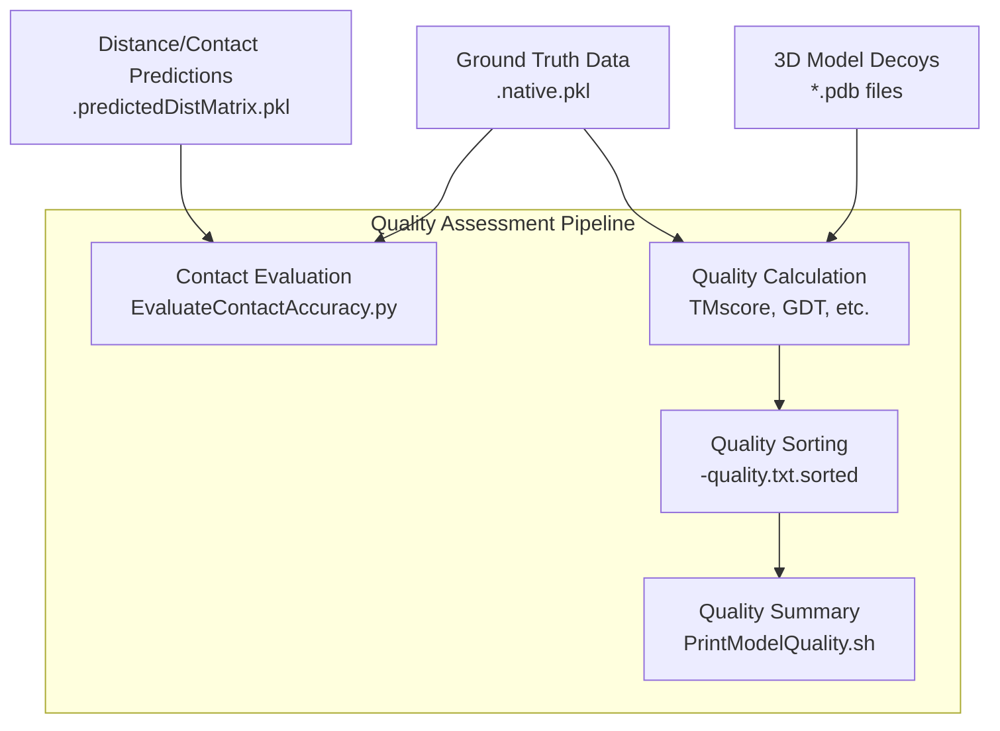
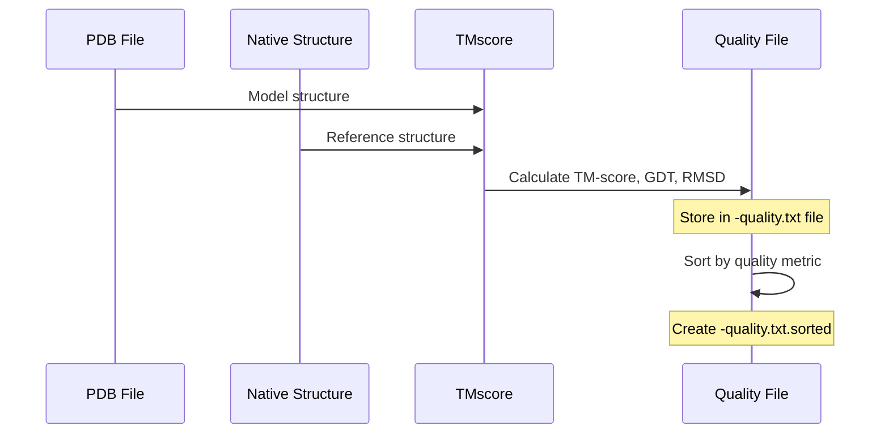
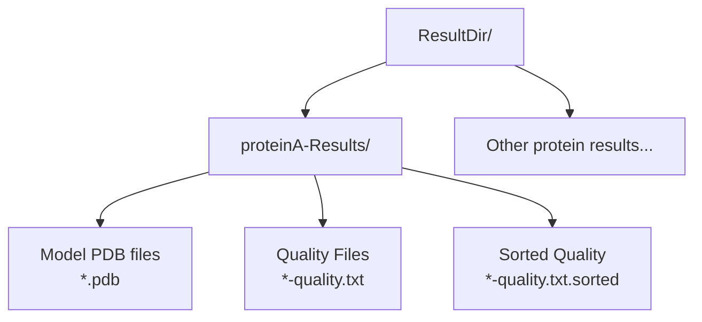

# Model Quality Assessment

> **Relevant source files**
> * [Common/BatchCalcGroundTruthBySeqPDB.sh](https://github.com/j3xugit/RaptorX-3DModeling/blob/22b58bc9/Common/BatchCalcGroundTruthBySeqPDB.sh)
> * [DL4DistancePrediction4/EvaluateContactAccuracy.py](https://github.com/j3xugit/RaptorX-3DModeling/blob/22b58bc9/DL4DistancePrediction4/EvaluateContactAccuracy.py)
> * [DL4DistancePrediction4/Scripts/LinkDistFeatures4MultiProteins.sh](https://github.com/j3xugit/RaptorX-3DModeling/blob/22b58bc9/DL4DistancePrediction4/Scripts/LinkDistFeatures4MultiProteins.sh)
> * [Folding/Helpers/PrintModelQuality.sh](https://github.com/j3xugit/RaptorX-3DModeling/blob/22b58bc9/Folding/Helpers/PrintModelQuality.sh)
> * [Folding/Helpers/PrintModelQuality2.sh](https://github.com/j3xugit/RaptorX-3DModeling/blob/22b58bc9/Folding/Helpers/PrintModelQuality2.sh)

## Purpose and Scope

This document describes the model quality assessment processes in the RaptorX-3DModeling system. It covers methods for evaluating both intermediate predictions (contacts and distances) and final 3D protein models. For information about the folding process itself, see [Folding and Relaxation](/j3xugit/RaptorX-3DModeling/6.2-folding-and-relaxation).

## Overview of Quality Assessment in RaptorX

The quality assessment process evaluates predictions at different stages of the protein structure modeling pipeline. The system offers tools to assess both the accuracy of distance/contact predictions and the quality of the final 3D models.



Sources: [DL4DistancePrediction4/EvaluateContactAccuracy.py](https://github.com/j3xugit/RaptorX-3DModeling/blob/22b58bc9/DL4DistancePrediction4/EvaluateContactAccuracy.py)

 [Folding/Helpers/PrintModelQuality.sh](https://github.com/j3xugit/RaptorX-3DModeling/blob/22b58bc9/Folding/Helpers/PrintModelQuality.sh)

 [Folding/Helpers/PrintModelQuality2.sh](https://github.com/j3xugit/RaptorX-3DModeling/blob/22b58bc9/Folding/Helpers/PrintModelQuality2.sh)

## Evaluating Contact/Distance Predictions

Contact prediction accuracy is a critical intermediate metric to assess before generating 3D models. RaptorX provides tools to evaluate the quality of predicted contacts against ground truth data.

### Contact Accuracy Metrics

The system evaluates contact predictions using three main metrics:

| Metric | Description |
| --- | --- |
| Precision | Percentage of predicted contacts that are correct (true positives / predicted positives) |
| Recall | Percentage of true contacts that are correctly predicted (true positives / actual positives) |
| F1 Score | Harmonic mean of precision and recall (2 × precision × recall / (precision + recall)) |

These metrics are calculated at different contact ranges:

* Extra-long-range: sequence separation ≥ 24 residues
* Long-range: sequence separation ≥ 12 residues
* Medium-range: sequence separation between 6-11 residues
* Long+medium-range: sequence separation ≥ 6 residues
* Short-range: sequence separation between 2-5 residues

For each range, the top L, L/2, L/5, and L/10 predicted contacts are evaluated (where L is the protein length).

### Using EvaluateContactAccuracy.py

The `EvaluateContactAccuracy.py` script compares predicted contact matrices with ground truth data:

```
python EvaluateContactAccuracy.py predMatrixFile groundTruthFile [targetName]
```

* `predMatrixFile`: Predicted matrix file (text or pickle format)
* `groundTruthFile`: Ground truth file (typically ending with .native.pkl)
* `targetName`: Optional protein name (defaults to filename without extension)

Example output:

```
proteinA 150 precision L:0.423 L/2:0.547 L/5:0.633 L/10:0.733
proteinA 150 recall L:0.423 L/2:0.273 L/5:0.127 L/10:0.073 
proteinA 150 F1 L:0.423 L/2:0.364 L/5:0.212 L/10:0.133
```

Sources: [DL4DistancePrediction4/EvaluateContactAccuracy.py L10-L61](https://github.com/j3xugit/RaptorX-3DModeling/blob/22b58bc9/DL4DistancePrediction4/EvaluateContactAccuracy.py#L10-L61)

### Generating Ground Truth Data

To evaluate predictions, ground truth data is needed. The system provides tools to generate this data from PDB structures:

```
BatchCalcGroundTruthBySeqPDB.sh proteinListFile SeqDir PDBDir
```

This script calculates property/distance/orientation ground truth by comparing sequence and structure files.

Sources: [Common/BatchCalcGroundTruthBySeqPDB.sh L1-L100](https://github.com/j3xugit/RaptorX-3DModeling/blob/22b58bc9/Common/BatchCalcGroundTruthBySeqPDB.sh#L1-L100)

## Evaluating 3D Models

The final 3D models generated by RaptorX are evaluated using standard protein structure comparison metrics.

### Model Quality Metrics

The system uses several metrics to assess model quality:

| Metric | Description |
| --- | --- |
| TM-score | Measures the similarity between two protein structures (range 0-1, higher is better) |
| GDT_TS | Global Distance Test Total Score (percentage of residues under distance cutoffs) |
| RMSD | Root Mean Square Deviation of atomic positions (lower is better) |
| MaxSub | Measures the largest subset of residues that can be superimposed well |

These scores are calculated by comparing the predicted models to their native structures.



Sources: [Folding/Helpers/PrintModelQuality.sh](https://github.com/j3xugit/RaptorX-3DModeling/blob/22b58bc9/Folding/Helpers/PrintModelQuality.sh)

 [Folding/Helpers/PrintModelQuality2.sh](https://github.com/j3xugit/RaptorX-3DModeling/blob/22b58bc9/Folding/Helpers/PrintModelQuality2.sh)

### Quality Assessment Workflow

1. For each protein target, multiple 3D model decoys are generated
2. Each model is compared to the native structure
3. Quality metrics are calculated and stored in `-quality.txt` files
4. These files are sorted to create `-quality.txt.sorted` files
5. Summary scripts extract and display the best models and their scores

### Using PrintModelQuality.sh

The `PrintModelQuality.sh` script summarizes quality scores across multiple protein targets:

```
PrintModelQuality.sh ResultDir [MyDMListFile]
```

* `ResultDir`: Directory containing subfolders with 3D models and quality files
* `MyDMListFile`: Optional list of protein domains to analyze

Sources: [Folding/Helpers/PrintModelQuality.sh L1-L50](https://github.com/j3xugit/RaptorX-3DModeling/blob/22b58bc9/Folding/Helpers/PrintModelQuality.sh#L1-L50)

### Using PrintModelQuality2.sh

An alternative script with slightly different functionality:

```
PrintModelQuality2.sh QualityResultDir [domainListFile]
```

* `QualityResultDir`: Directory containing quality files
* `domainListFile`: Optional list of protein domains to analyze

Sources: [Folding/Helpers/PrintModelQuality2.sh L1-L47](https://github.com/j3xugit/RaptorX-3DModeling/blob/22b58bc9/Folding/Helpers/PrintModelQuality2.sh#L1-L47)

## Directory Structure for Quality Assessment

Model quality assessment files are organized in a specific directory structure:



The quality assessment scripts navigate this directory structure to locate the relevant files for analysis.

Sources: [Folding/Helpers/PrintModelQuality.sh L24-L31](https://github.com/j3xugit/RaptorX-3DModeling/blob/22b58bc9/Folding/Helpers/PrintModelQuality.sh#L24-L31)

 [Folding/Helpers/PrintModelQuality2.sh L29-L34](https://github.com/j3xugit/RaptorX-3DModeling/blob/22b58bc9/Folding/Helpers/PrintModelQuality2.sh#L29-L34)

## Interpretation of Quality Scores

### Contact Prediction Quality

* **Precision of top L/5 long-range contacts > 0.5**: Good prediction
* **Precision of top L/5 long-range contacts > 0.7**: Excellent prediction
* Contact prediction quality strongly correlates with the quality of the final 3D model

### 3D Model Quality

* **TM-score > 0.5**: Models with the same fold
* **TM-score > 0.7**: Very similar structures
* **TM-score < 0.3**: Random structural similarity
* **GDT_TS > 50**: Good model
* **GDT_TS > 70**: High-quality model

## Best Practices for Model Quality Assessment

1. **Always evaluate contact predictions before folding** * This can save time by identifying proteins with poor predictions early
2. **Generate multiple decoys for each target** * Typically 200-1000 decoys are generated to sample conformational space
3. **Use clustering to identify the best models** * The most populated clusters often contain the best models
4. **Compare models against experimental structures when available** * This provides the most accurate assessment of model quality
5. **For proteins without known structures** * Use confidence scores from the prediction pipeline * Consistency between models in a cluster can indicate reliability

## Conclusion

Model quality assessment is a critical component of the protein structure prediction pipeline. RaptorX-3DModeling provides tools to evaluate both intermediate predictions and final 3D models, helping users identify the most accurate structure predictions for their proteins of interest.