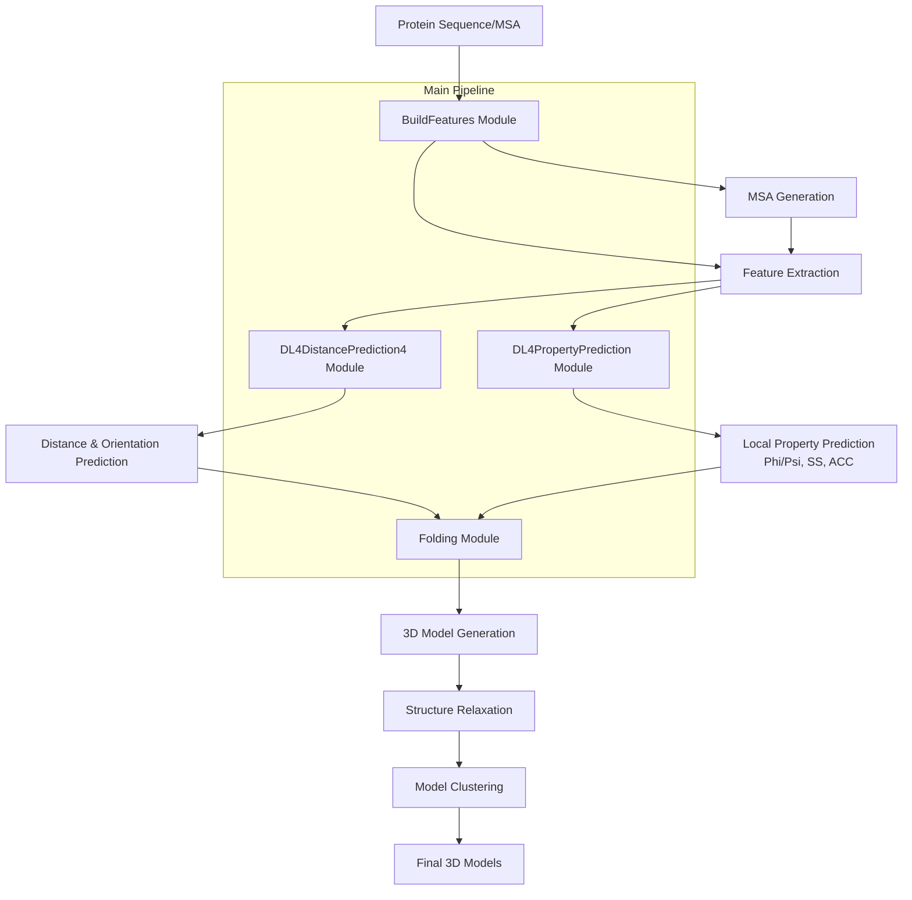
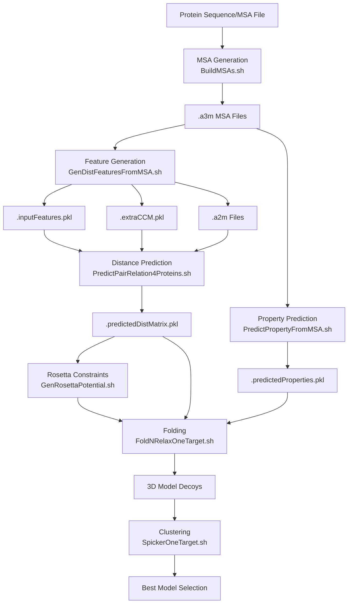
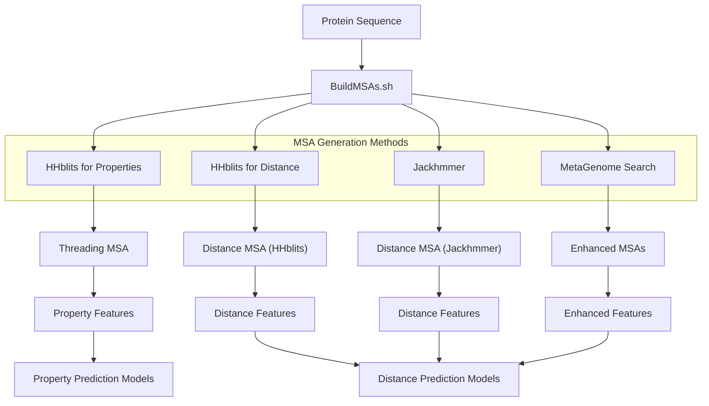
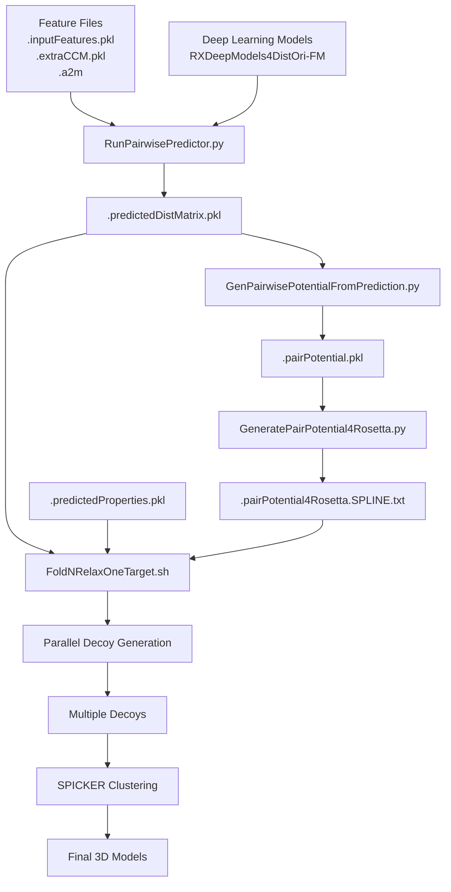
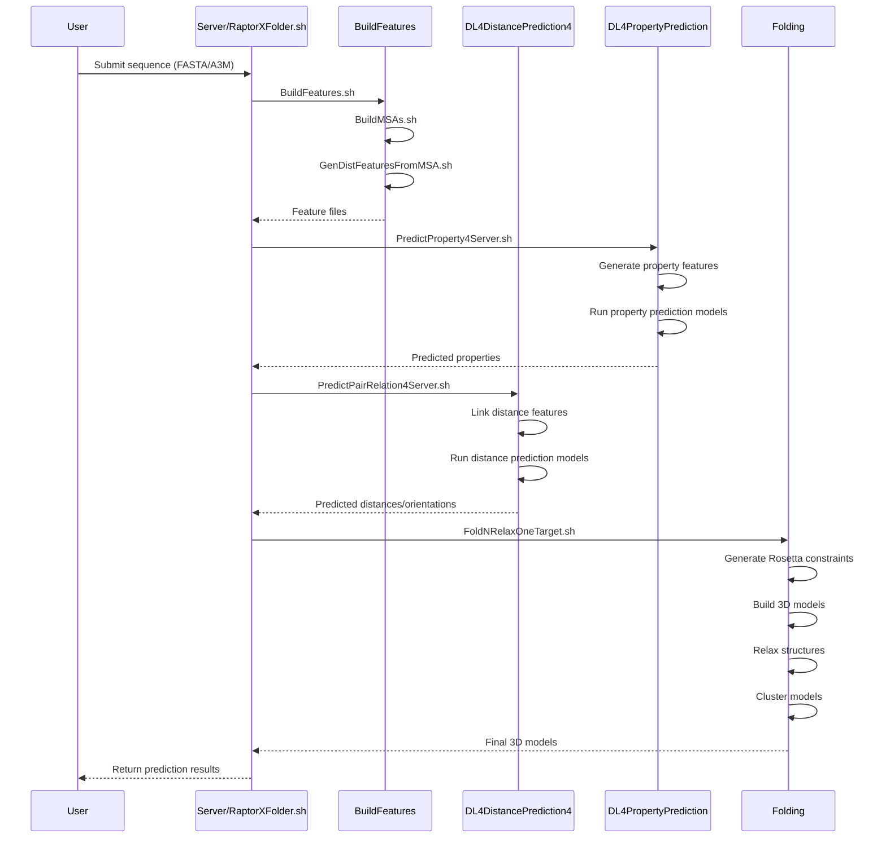

# Overview

> **Relevant source files**
> * [DL4DistancePrediction4/Utils/GenerateMetaData.py](https://github.com/j3xugit/RaptorX-3DModeling/blob/22b58bc9/DL4DistancePrediction4/Utils/GenerateMetaData.py)
> * [README.md](https://github.com/j3xugit/RaptorX-3DModeling/blob/22b58bc9/README.md?plain=1)
> * [raptorx-path.sh](https://github.com/j3xugit/RaptorX-3DModeling/blob/22b58bc9/raptorx-path.sh)

RaptorX-3DModeling is a comprehensive protein structure prediction system that uses deep learning to predict contacts, distances, orientations, and local structural properties of proteins, which are then used to build accurate 3D protein models. The system is designed to take a protein sequence or multiple sequence alignment (MSA) as input and produce high-quality 3D models as output.

This document introduces the overall architecture and components of the RaptorX-3DModeling system, providing a roadmap for understanding how the different modules interact. For detailed information about installation and setup, see [Installation and Setup](/j3xugit/RaptorX-3DModeling/1.2-installation-and-setup), and for a complete guide to the end-to-end workflow, see [Main Workflow](/j3xugit/RaptorX-3DModeling/2-main-workflow).

Sources: [README.md L4-L10](https://github.com/j3xugit/RaptorX-3DModeling/blob/22b58bc9/README.md?plain=1#L4-L10)

## System Architecture

The RaptorX-3DModeling system consists of four major modules that form a pipeline for protein structure prediction:



Sources: [README.md L42-L47](https://github.com/j3xugit/RaptorX-3DModeling/blob/22b58bc9/README.md?plain=1#L42-L47)

 [raptorx-path.sh L1-L4](https://github.com/j3xugit/RaptorX-3DModeling/blob/22b58bc9/raptorx-path.sh#L1-L4)

### Core Modules

1. **BuildFeatures Module** (`BuildFeatures/`): Generates multiple sequence alignments (MSAs) and extracts input features for the deep learning models.
2. **DL4DistancePrediction4 Module** (`DL4DistancePrediction4/`): Predicts inter-residue contacts, distances, and orientations using deep convolutional residual networks.
3. **DL4PropertyPrediction Module** (`DL4PropertyPrediction/`): Predicts local structural properties including phi/psi angles, secondary structure (SS), and solvent accessibility (ACC).
4. **Folding Module** (`Folding/`): Builds 3D models using the predicted distances, orientations, and local structural properties.

The primary entry point for the system is the `RaptorXFolder.sh` script located in the `Server/` directory, which orchestrates the entire prediction pipeline.

Sources: [README.md L24-L46](https://github.com/j3xugit/RaptorX-3DModeling/blob/22b58bc9/README.md?plain=1#L24-L46)

## Data Flow Through the System

The following diagram illustrates the flow of data through the RaptorX-3DModeling system, showing the key file formats and transformations:



The system processes data through several key transformations:

1. **MSA Generation**: The protein sequence is used to search sequence databases to generate multiple sequence alignments (.a3m files).
2. **Feature Extraction**: The MSAs are processed to extract various features (.inputFeatures.pkl, .extraCCM.pkl, .a2m files) that capture evolutionary information.
3. **Distance and Property Prediction**: The features are fed into deep learning models to predict inter-residue distances/orientations (.predictedDistMatrix.pkl) and local properties (.predictedProperties.pkl).
4. **3D Model Building**: The predictions are converted into constraints for Rosetta and used to fold the protein, generating multiple structural models (decoys).
5. **Model Selection**: The decoys are clustered and ranked to select the best final models.

Sources: [README.md L145-L173](https://github.com/j3xugit/RaptorX-3DModeling/blob/22b58bc9/README.md?plain=1#L145-L173)

 [README.md L271-L277](https://github.com/j3xugit/RaptorX-3DModeling/blob/22b58bc9/README.md?plain=1#L271-L277)

## MSA and Feature Generation Process

Multiple sequence alignments (MSAs) are critical for capturing evolutionary information. RaptorX employs multiple methods to generate diverse MSAs:



The MSA generation process uses several tools and databases:

1. **HHblits**: Used in two different ways - for property prediction and for distance prediction with different parameter settings.
2. **Jackhmmer**: Provides an alternative method for generating MSAs, though it's slower than HHblits.
3. **Metagenome Searches**: Used to enhance MSAs with sequences from metagenomic data.

The features extracted from these MSAs include:

* Sequence profiles
* Coevolution information
* Secondary structure predictions
* Other evolutionary features

These features are stored in several file formats:

* `.inputFeatures.pkl`: Main input features for deep learning models
* `.extraCCM.pkl`: Additional coevolution features
* `.a2m`: A specialized MSA format used by some deep learning models

Sources: [README.md L92-L116](https://github.com/j3xugit/RaptorX-3DModeling/blob/22b58bc9/README.md?plain=1#L92-L116)

 [README.md L228-L256](https://github.com/j3xugit/RaptorX-3DModeling/blob/22b58bc9/README.md?plain=1#L228-L256)

## Distance Prediction and Folding Workflow

The distance prediction and folding process is a key part of the system:



The process involves:

1. **Distance and Orientation Prediction**: * Deep learning models trained to predict inter-residue distances and orientations * Models use the feature files as input and produce `.predictedDistMatrix.pkl` files
2. **Potential Generation**: * The predicted distances/orientations are converted into potentials * These potentials are then formatted as constraints for the Rosetta modeling software
3. **3D Model Building**: * The `FoldNRelaxOneTarget.sh` script uses Rosetta with the constraints to generate protein models * Multiple decoys (structural models) are generated in parallel
4. **Model Selection**: * The SPICKER algorithm clusters the decoys to identify the most reliable models * The final models are selected based on clustering and energy scores

Sources: [README.md L257-L270](https://github.com/j3xugit/RaptorX-3DModeling/blob/22b58bc9/README.md?plain=1#L257-L270)

 [README.md L282-L286](https://github.com/j3xugit/RaptorX-3DModeling/blob/22b58bc9/README.md?plain=1#L282-L286)

## System Integration and Execution Flow

The following sequence diagram illustrates how the components interact during execution:



The entire process is orchestrated by the `RaptorXFolder.sh` script, which:

1. Takes a protein sequence or MSA as input
2. Coordinates the execution of the four major modules
3. Manages the flow of data between modules
4. Returns the final predicted 3D models

The system can be run on a single machine or distributed across multiple machines, with each module potentially running on a different computer optimized for its specific requirements (e.g., CPUs for MSA generation, GPUs for deep learning prediction, and CPUs for folding).

Sources: [README.md L145-L169](https://github.com/j3xugit/RaptorX-3DModeling/blob/22b58bc9/README.md?plain=1#L145-L169)

 [README.md L288-L306](https://github.com/j3xugit/RaptorX-3DModeling/blob/22b58bc9/README.md?plain=1#L288-L306)

## Environment Setup

RaptorX-3DModeling requires several environment variables to be set correctly:

| Environment Variable | Description | Set In |
| --- | --- | --- |
| `ModelingHome` | Root directory of RaptorX-3DModeling | User's `.bashrc` |
| `DistFeatureHome` | BuildFeatures module directory | `raptorx-path.sh` |
| `DL4DistancePredHome` | DL4DistancePrediction4 module directory | `raptorx-path.sh` |
| `DL4PropertyPredHome` | DL4PropertyPrediction module directory | `raptorx-path.sh` |
| `DistanceFoldingHome` | Folding module directory | `raptorx-path.sh` |
| `CUDA_ROOT` | CUDA installation directory | User's `.bashrc` |

These variables must be properly set for the system to function correctly. The recommended approach is to add the following lines to your `.bashrc` file:

```javascript
export CUDA_ROOT=/usr/local/cuda/export ModelingHome=/path/to/RaptorX-3DModeling/. $ModelingHome/raptorx-path.sh. $ModelingHome/raptorx-external.sh
```

The `raptorx-path.sh` script sets up the environment variables for the four major modules, while `raptorx-external.sh` configures external tools and databases used by the system.

For more detailed setup instructions, see [Installation and Setup](/j3xugit/RaptorX-3DModeling/1.2-installation-and-setup).

Sources: [README.md L204-L223](https://github.com/j3xugit/RaptorX-3DModeling/blob/22b58bc9/README.md?plain=1#L204-L223)

 [raptorx-path.sh L1-L8](https://github.com/j3xugit/RaptorX-3DModeling/blob/22b58bc9/raptorx-path.sh#L1-L8)