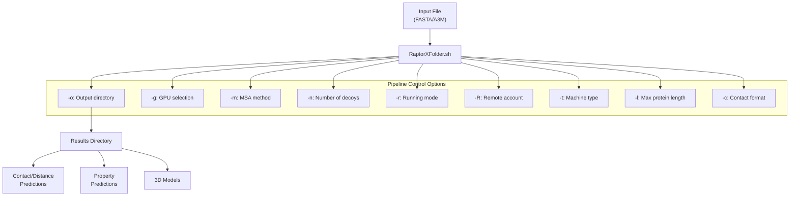
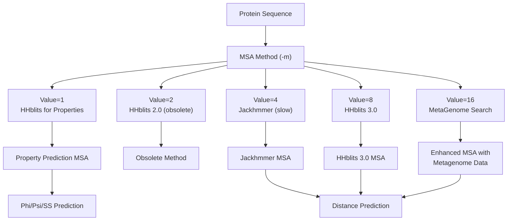
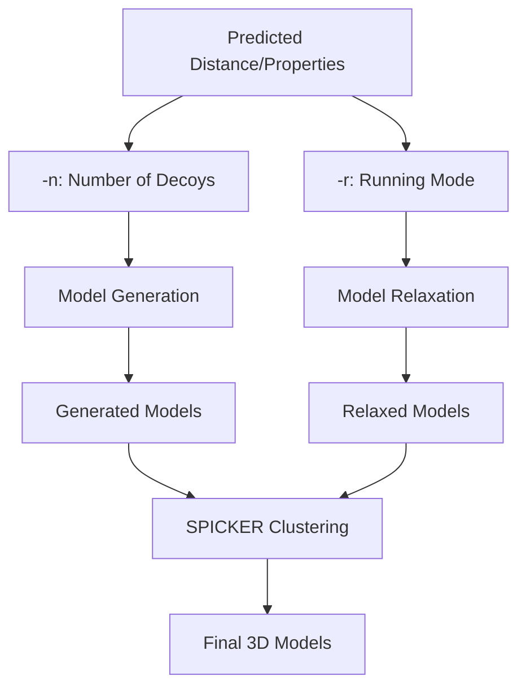
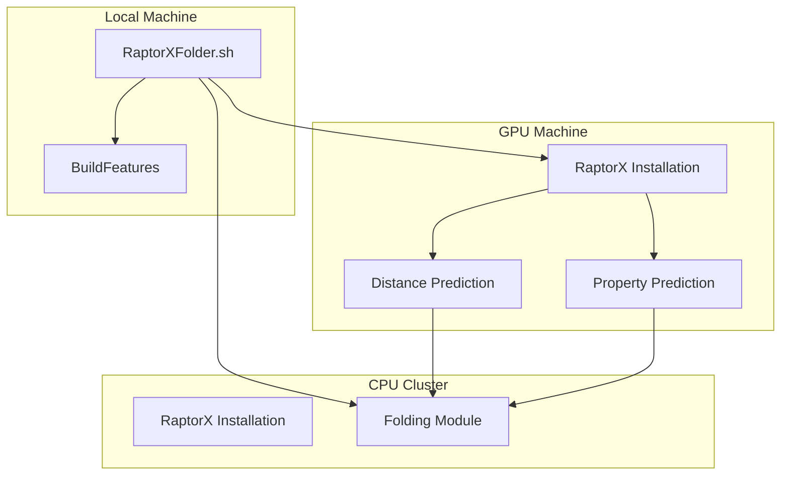
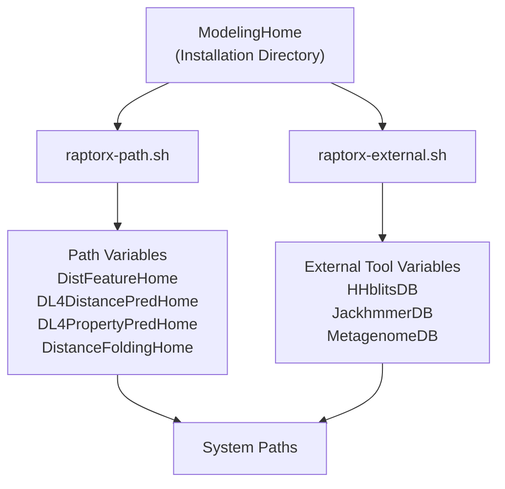

# Pipeline Options

> **Relevant source files**
> * [DL4DistancePrediction4/Utils/GenerateMetaData.py](https://github.com/j3xugit/RaptorX-3DModeling/blob/22b58bc9/DL4DistancePrediction4/Utils/GenerateMetaData.py)
> * [Folding/Scripts4Rosetta/RelaxOneTarget.sh](https://github.com/j3xugit/RaptorX-3DModeling/blob/22b58bc9/Folding/Scripts4Rosetta/RelaxOneTarget.sh)
> * [Folding/Scripts4SPICKER/SpickerOneTarget.sh](https://github.com/j3xugit/RaptorX-3DModeling/blob/22b58bc9/Folding/Scripts4SPICKER/SpickerOneTarget.sh)
> * [README.md](https://github.com/j3xugit/RaptorX-3DModeling/blob/22b58bc9/README.md?plain=1)
> * [Server/RaptorXFolder.sh](https://github.com/j3xugit/RaptorX-3DModeling/blob/22b58bc9/Server/RaptorXFolder.sh)
> * [raptorx-path.sh](https://github.com/j3xugit/RaptorX-3DModeling/blob/22b58bc9/raptorx-path.sh)

This document explains the various command-line options and configuration parameters available in the RaptorX-3DModeling pipeline. These options control how the pipeline processes protein sequences, generates multiple sequence alignments (MSAs), predicts contact/distance/orientation information, and builds 3D structural models. For information about the general workflow of the entire system, see [Main Workflow](/j3xugit/RaptorX-3DModeling/2-main-workflow).

## Command-Line Options for RaptorXFolder.sh

RaptorXFolder.sh is the main entry point script for running the complete protein structure prediction pipeline. It accepts multiple command-line parameters that control every aspect of the prediction process.



### Main Options Table

| Option | Default | Description |
| --- | --- | --- |
| `-o` | Current directory | Output directory where results will be saved |
| `-g` | -1 | GPU selection (0-3, -1=auto-select) |
| `-m` | 9 | MSA generation method (see MSA Options section) |
| `-n` | 120 | Number of 3D models (decoys) to generate |
| `-r` | 0 | Running mode: 0=fold only, 1=fold+relax |
| `-R` | (empty) | Remote account info for distributed execution |
| `-t` | 0 | Machine type for folding (0-4) |
| `-l` | 1050 | Maximum protein length to be folded |
| `-c` | (flag) | Print contact in CASP format only |

Sources: [Server/RaptorXFolder.sh L14-L23](https://github.com/j3xugit/RaptorX-3DModeling/blob/22b58bc9/Server/RaptorXFolder.sh#L14-L23)

 [Server/RaptorXFolder.sh L28-L72](https://github.com/j3xugit/RaptorX-3DModeling/blob/22b58bc9/Server/RaptorXFolder.sh#L28-L72)

## MSA Generation Options

The `-m` parameter controls how Multiple Sequence Alignments (MSAs) are generated, which is a critical step in the prediction pipeline. This parameter is constructed by adding specific values together to enable different MSA generation methods.



### MSA Method Composition

The `-m` parameter is created by adding these values:

| Value | Method | Purpose | Speed | Recommended |
| --- | --- | --- | --- | --- |
| 1 | HHblits for properties | Local structure property prediction | Fast | Yes |
| 2 | HHblits 2.0 | Distance prediction (obsolete) | - | No |
| 4 | Jackhmmer | Distance prediction | Very slow | No |
| 8 | HHblits 3.0 | Distance prediction | Fast | Yes |
| 16 | MetaGenome search | Enhance MSAs | Slow | Optional |

Common combinations:

* `-m 9` (1+8): Use HHblits for both property and distance prediction (fast, default)
* `-m 25` (1+8+16): Use HHblits with additional MetaGenome data (more comprehensive)
* `-m 0`: Skip MSA generation (use pre-generated MSA in a3m format)

Sources: [Server/RaptorXFolder.sh L45-L52](https://github.com/j3xugit/RaptorX-3DModeling/blob/22b58bc9/Server/RaptorXFolder.sh#L45-L52)

 [README.md L144-L247](https://github.com/j3xugit/RaptorX-3DModeling/blob/22b58bc9/README.md?plain=1#L144-L247)

## Computational Resource Options

These options control the computational resources used by the pipeline.

### GPU Selection

The `-g` parameter controls which GPUs to use for computation-intensive steps:

| Value | Behavior |
| --- | --- |
| -1 | Auto-select GPUs with maximum free memory (default) |
| 0-3 | Use specific GPU device number |

For large proteins (>1000 residues), more than 12GB of GPU memory may be required.

### CPU and Machine Configuration

| Option | Purpose |
| --- | --- |
| `-t` | Machine type for folding module |
| `-c` | Number of CPUs to use for some scripts (e.g., RelaxOneTarget.sh) |

Machine types (`-t` option):

* `0`: Auto-detect (default, assumes Linux workstation)
* `1`: Multi-CPU Linux with GNU parallel
* `2`: Slurm cluster with homogeneous nodes
* `3`: Slurm cluster with heterogeneous nodes
* `4`: Multi-CPU Linux without GNU parallel

Sources: [Server/RaptorXFolder.sh L65-L71](https://github.com/j3xugit/RaptorX-3DModeling/blob/22b58bc9/Server/RaptorXFolder.sh#L65-L71)

 [Folding/Scripts4Rosetta/RelaxOneTarget.sh L25-L26](https://github.com/j3xugit/RaptorX-3DModeling/blob/22b58bc9/Folding/Scripts4Rosetta/RelaxOneTarget.sh#L25-L26)

## 3D Structure Generation Options

These options control the generation of 3D protein models from predicted information.



### Model Generation and Refinement

| Option | Description |
| --- | --- |
| `-n` | Number of 3D models (decoys) to generate (default: 120)Set to 0 to only predict contacts/distances without 3D modeling |
| `-r` | Running mode: 0=fold only (default), 1=fold+relaxRelaxation removes steric clashes and optimizes side-chain atoms but is time-consuming |
| `-l` | Maximum protein length to be folded (default: 1050)Larger proteins require more memory and computation time |

For large proteins (>600 AAs), relaxation can take several hours per model on a single CPU and require significant memory (~10GB per model for proteins >1000 AAs).

Sources: [Server/RaptorXFolder.sh L55-L60](https://github.com/j3xugit/RaptorX-3DModeling/blob/22b58bc9/Server/RaptorXFolder.sh#L55-L60)

 [README.md L159-L170](https://github.com/j3xugit/RaptorX-3DModeling/blob/22b58bc9/README.md?plain=1#L159-L170)

### Model Clustering Options

After generating multiple models, SPICKER is used to cluster them and identify the most representative structures. The SpickerOneTarget.sh script (called by RaptorXFolder.sh) accepts these options:

| Option | Description |
| --- | --- |
| `-s` | Select models by energy (not enabled by default) |
| `-a` | Assign model quality (not enabled by default) |
| `-d` | Directory for saving clustering results |

Sources: [Folding/Scripts4SPICKER/SpickerOneTarget.sh L3-L5](https://github.com/j3xugit/RaptorX-3DModeling/blob/22b58bc9/Folding/Scripts4SPICKER/SpickerOneTarget.sh#L3-L5)

 [Folding/Scripts4SPICKER/SpickerOneTarget.sh L9-L15](https://github.com/j3xugit/RaptorX-3DModeling/blob/22b58bc9/Folding/Scripts4SPICKER/SpickerOneTarget.sh#L9-L15)

## Distributed Computing Options

RaptorX allows distributing computation across multiple machines without manually copying files.



### Remote Computing Configuration

| Option | Description |
| --- | --- |
| `-R` | Run folding on a remote account (format: `username@remote.machine:path/`) |

To run GPU tasks on remote machines:

1. Create a file called `GPUMachines.txt` in the `params/` directory
2. Each line should specify a machine: `machine_name RAMType on/off` * Example: `raptorx9.uchicago.edu LargeRAM on` * RAMType can be SmallRAM (≤12GB) or LargeRAM (>12GB) * on/off specifies if the machine is enabled

For both remote folding and GPU usage, you must configure SSH to allow password-less login to the remote machines.

Sources: [Server/RaptorXFolder.sh L62-L65](https://github.com/j3xugit/RaptorX-3DModeling/blob/22b58bc9/Server/RaptorXFolder.sh#L62-L65)

 [README.md L287-L304](https://github.com/j3xugit/RaptorX-3DModeling/blob/22b58bc9/README.md?plain=1#L287-L304)

## Output Control Options

| Option | Description |
| --- | --- |
| `-o` | Directory for saving results (default: current directory) |
| `-c` | Print only contact probability in CASP format, not distance probability |

Output Structure:

* `target_OUT/` - Main output folder (target = protein name) * `target_contact/` - MSAs and features for distance/orientation prediction * `target_thread/` - Files for Phi/Psi prediction * `DistancePred/` - Predicted distance/orientation/contact * `PropertyPred/` - Predicted Phi/Psi angles and secondary structure * `target-RelaxResults/` - Generated decoys * `target-SpickerResults/` - Clustering results

Sources: [README.md L174-L187](https://github.com/j3xugit/RaptorX-3DModeling/blob/22b58bc9/README.md?plain=1#L174-L187)

 [Server/RaptorXFolder.sh L37-L39](https://github.com/j3xugit/RaptorX-3DModeling/blob/22b58bc9/Server/RaptorXFolder.sh#L37-L39)

## Environment Configuration

The pipeline relies on several environment variables that must be correctly set for proper operation.



Key environment variables set in `raptorx-path.sh`:

* `DistFeatureHome`: Path to BuildFeatures module
* `DL4DistancePredHome`: Path to DL4DistancePrediction4 module
* `DL4PropertyPredHome`: Path to DL4PropertyPrediction module
* `DistanceFoldingHome`: Path to Folding module

External databases and tools configuration in `raptorx-external.sh`:

* Paths to sequence databases (UniRef, MetaClust)
* Paths to search tools (HHblits, Jackhmmer)
* Other external dependencies

To set up the environment:

1. Set `ModelingHome` to the installation directory
2. Add `. $ModelingHome/raptorx-path.sh` to your `.bashrc`
3. Add `. $ModelingHome/raptorx-external.sh` to your `.bashrc`

Sources: [raptorx-path.sh L1-L7](https://github.com/j3xugit/RaptorX-3DModeling/blob/22b58bc9/raptorx-path.sh#L1-L7)

 [README.md L205-L225](https://github.com/j3xugit/RaptorX-3DModeling/blob/22b58bc9/README.md?plain=1#L205-L225)

## Example Usage Commands

Here are some common usage examples for RaptorXFolder.sh:

1. Basic prediction with default settings: ``` RaptorXFolder.sh protein.fasta ```
2. Prediction using pre-generated MSA: ``` RaptorXFolder.sh -m 0 protein.a3m ```
3. Prediction without 3D modeling: ``` RaptorXFolder.sh -n 0 protein.fasta ```
4. Prediction with HHblits only (no jackhmmer): ``` RaptorXFolder.sh -m 9 protein.fasta ```
5. Prediction with MetaGenome data: ``` RaptorXFolder.sh -m 25 protein.fasta ```
6. Full prediction with relaxation: ``` RaptorXFolder.sh -r 1 protein.fasta ```
7. Remote folding: ``` RaptorXFolder.sh -R username@remote.machine:path/ protein.fasta ```

Sources: [README.md L145-L170](https://github.com/j3xugit/RaptorX-3DModeling/blob/22b58bc9/README.md?plain=1#L145-L170)

 [Server/RaptorXFolder.sh L28-L72](https://github.com/j3xugit/RaptorX-3DModeling/blob/22b58bc9/Server/RaptorXFolder.sh#L28-L72)