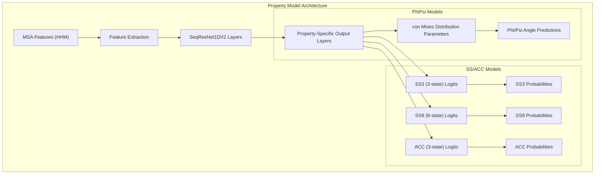
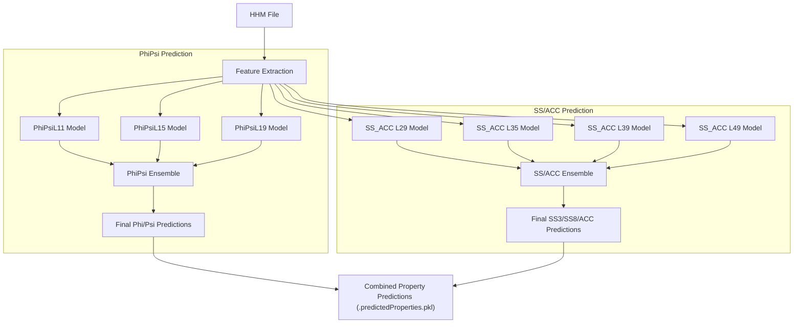
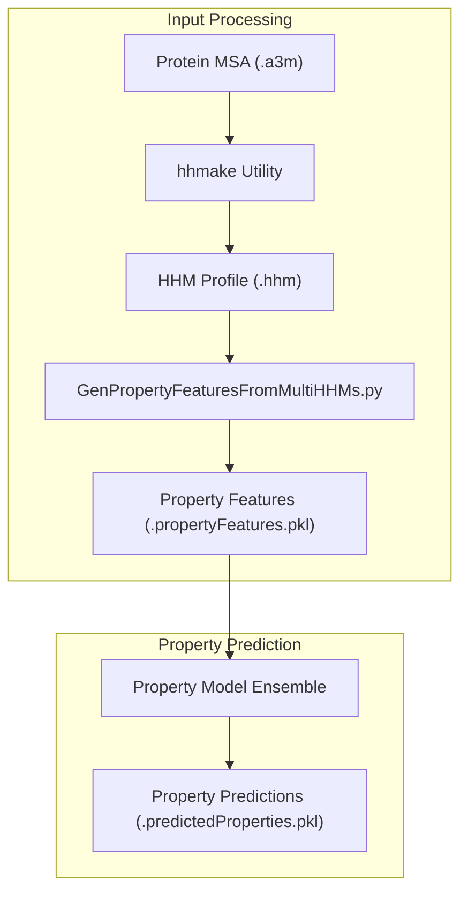
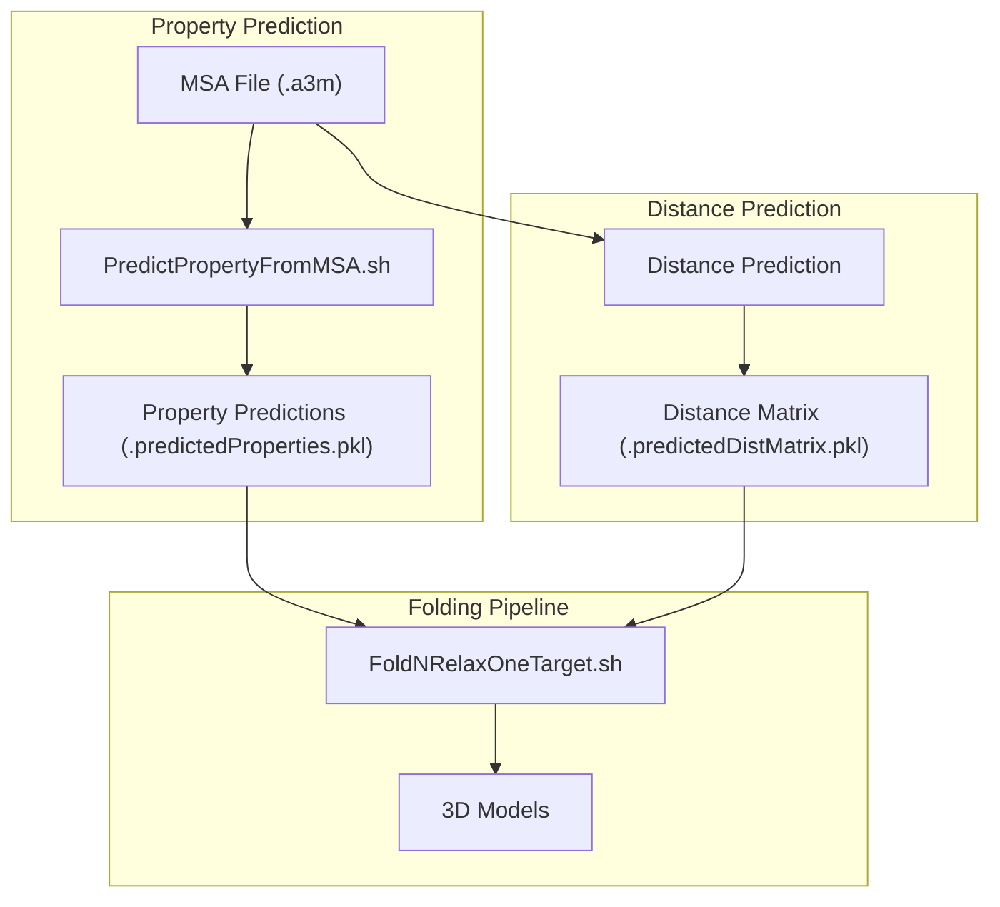

# Property Models

> **Relevant source files**
> * [BuildFeatures/A3MToA2M.sh](https://github.com/j3xugit/RaptorX-3DModeling/blob/22b58bc9/BuildFeatures/A3MToA2M.sh)
> * [Common/LoadHHM.py](https://github.com/j3xugit/RaptorX-3DModeling/blob/22b58bc9/Common/LoadHHM.py)
> * [DL4PropertyPrediction/GenPropertyFeatures4Proteins.py](https://github.com/j3xugit/RaptorX-3DModeling/blob/22b58bc9/DL4PropertyPrediction/GenPropertyFeatures4Proteins.py)
> * [DL4PropertyPrediction/Scripts/PredictPropertyFromMSA.sh](https://github.com/j3xugit/RaptorX-3DModeling/blob/22b58bc9/DL4PropertyPrediction/Scripts/PredictPropertyFromMSA.sh)
> * [DL4PropertyPrediction/Scripts/PredictPropertyFromMSAs.sh](https://github.com/j3xugit/RaptorX-3DModeling/blob/22b58bc9/DL4PropertyPrediction/Scripts/PredictPropertyFromMSAs.sh)
> * [DL4PropertyPrediction/params/ModelFile4PropertyPred.txt](https://github.com/j3xugit/RaptorX-3DModeling/blob/22b58bc9/DL4PropertyPrediction/params/ModelFile4PropertyPred.txt)
> * [Folding/Scripts4Rosetta/FoldNRelaxTargets.sh](https://github.com/j3xugit/RaptorX-3DModeling/blob/22b58bc9/Folding/Scripts4Rosetta/FoldNRelaxTargets.sh)

This page documents the deep learning models used for predicting local structural properties of proteins in the RaptorX-3DModeling system. These property models predict backbone torsion angles (Phi/Psi), secondary structure (SS3/SS8), and solvent accessibility (ACC), which serve as important constraints for 3D protein structure prediction. For information about the overall property prediction workflow, see [Property Prediction Workflow](/j3xugit/RaptorX-3DModeling/5.1-property-prediction-workflow).

## Model Types and Function

RaptorX employs two primary types of property prediction models:

1. **Phi/Psi Models** - Predict backbone torsion angles using von Mises distributions
2. **SS3/SS8/ACC3 Models** - Predict secondary structure in 3-state (helix, strand, loop) and 8-state (detailed secondary structure) formats along with solvent accessibility in 3-state format

These models use MSA-derived features as input and produce per-residue property predictions that capture local structural information, which complements the global structural information from distance predictions.

Sources: [DL4PropertyPrediction/params/ModelFile4PropertyPred.txt L6-L19](https://github.com/j3xugit/RaptorX-3DModeling/blob/22b58bc9/DL4PropertyPrediction/params/ModelFile4PropertyPred.txt#L6-L19)

## Model Architecture

All property models use a 1D deep residual neural network architecture called SeqResNet1DV2, which is specifically designed for protein sequence data. The architecture processes MSA-derived features through multiple residual blocks to make per-residue predictions.



Sources: [DL4PropertyPrediction/params/ModelFile4PropertyPred.txt L6-L19](https://github.com/j3xugit/RaptorX-3DModeling/blob/22b58bc9/DL4PropertyPrediction/params/ModelFile4PropertyPred.txt#L6-L19)

### Window Sizes

The models use different window sizes (context windows) to capture local patterns at different scales:

1. **PhiPsi Models**: * L11: 11-residue window (small context) * L15: 15-residue window (medium context) * L19: 19-residue window (larger context)
2. **SS3/SS8/ACC3 Models**: * L29: 29-residue window * L35: 35-residue window * L39: 39-residue window * L49: 49-residue window (largest context)

These different window sizes allow the models to capture both very local structural patterns and more extended patterns across the protein sequence.

Sources: [DL4PropertyPrediction/params/ModelFile4PropertyPred.txt L6-L19](https://github.com/j3xugit/RaptorX-3DModeling/blob/22b58bc9/DL4PropertyPrediction/params/ModelFile4PropertyPred.txt#L6-L19)

## Model Ensembles

The property predictions are made by ensembles of models with different window sizes. This ensemble approach helps improve prediction accuracy by combining models that specialize in different scales of context.



Sources: [DL4PropertyPrediction/params/ModelFile4PropertyPred.txt L10-L20](https://github.com/j3xugit/RaptorX-3DModeling/blob/22b58bc9/DL4PropertyPrediction/params/ModelFile4PropertyPred.txt#L10-L20)

 [DL4PropertyPrediction/Scripts/PredictPropertyFromMSA.sh L90-L101](https://github.com/j3xugit/RaptorX-3DModeling/blob/22b58bc9/DL4PropertyPrediction/Scripts/PredictPropertyFromMSA.sh#L90-L101)

## Pre-trained Models

The system includes pre-trained models for property prediction, defined in `ModelFile4PropertyPred.txt`. Here are the main model sets:

### PhiPsi Models

| Model Name | Window Size | Training Set | Description |
| --- | --- | --- | --- |
| PhiPsiL11Set10820Model | L11 | pdb25-10820 | Phi/Psi prediction with 11-residue window |
| PhiPsiL15Set10820Model | L15 | pdb25-10820 | Phi/Psi prediction with 15-residue window |
| PhiPsiL19Set10820Model | L19 | pdb25-10820 | Phi/Psi prediction with 19-residue window |

### SS3/SS8/ACC3 Models

| Model Name | Window Size | Training Set | Description |
| --- | --- | --- | --- |
| SS3SS8ACC3L29Set10820Model | L29 | pdb25-10820 | SS3, SS8, ACC3 prediction with 29-residue window |
| SS3SS8ACC3L35Set10820Model | L35 | pdb25-10820 | SS3, SS8, ACC3 prediction with 35-residue window |
| SS3SS8ACC3L39Set10820Model | L39 | pdb25-10820 | SS3, SS8, ACC3 prediction with 39-residue window |
| SS3SS8ACC3L49Set10820Model | L49 | pdb25-10820 | SS3, SS8, ACC3 prediction with 49-residue window |

Sources: [DL4PropertyPrediction/params/ModelFile4PropertyPred.txt L6-L19](https://github.com/j3xugit/RaptorX-3DModeling/blob/22b58bc9/DL4PropertyPrediction/params/ModelFile4PropertyPred.txt#L6-L19)

## Feature Generation for Property Models

The property models use features derived from HHM files, which contain position-specific scoring matrices and frequency matrices from multiple sequence alignments.



The features extracted from HHM profiles include:

* Position-specific scoring matrices (PSSM)
* Position-specific frequency matrices (PSFM)
* HMM transition probabilities
* Sequence profile information

Sources: [DL4PropertyPrediction/Scripts/PredictPropertyFromMSA.sh L80-L101](https://github.com/j3xugit/RaptorX-3DModeling/blob/22b58bc9/DL4PropertyPrediction/Scripts/PredictPropertyFromMSA.sh#L80-L101)

 [Common/LoadHHM.py L50-L157](https://github.com/j3xugit/RaptorX-3DModeling/blob/22b58bc9/Common/LoadHHM.py#L50-L157)

 [DL4PropertyPrediction/GenPropertyFeatures4Proteins.py L10-L60](https://github.com/j3xugit/RaptorX-3DModeling/blob/22b58bc9/DL4PropertyPrediction/GenPropertyFeatures4Proteins.py#L10-L60)

## Integration with 3D Structure Prediction

The predicted properties serve as important constraints in the 3D structure prediction pipeline:



In the folding stage, the predicted properties (especially Phi/Psi angles) are used as restraints to guide the conformational search in Rosetta, complementing the distance and orientation predictions.

Sources: [Folding/Scripts4Rosetta/FoldNRelaxTargets.sh L75-L125](https://github.com/j3xugit/RaptorX-3DModeling/blob/22b58bc9/Folding/Scripts4Rosetta/FoldNRelaxTargets.sh#L75-L125)

## Using Property Models

To predict properties for a protein using the RaptorX system:

1. **For a single protein**: ``` PredictPropertyFromMSA.sh [-f DeepModelFile] [-m ModelName] [-d ResultDir] [-g gpu] MSAfile ```
2. **For multiple proteins**: ``` PredictPropertyFromMSAs.sh [-f DeepModelFile] [-m ModelName] [-d ResultDir] [-g gpu] proteinListFile hhmFolder/a3mFolder ```

The prediction results are saved in `.predictedProperties.pkl` files, which can be used directly in the folding process or analyzed separately.

Sources: [DL4PropertyPrediction/Scripts/PredictPropertyFromMSA.sh L20-L101](https://github.com/j3xugit/RaptorX-3DModeling/blob/22b58bc9/DL4PropertyPrediction/Scripts/PredictPropertyFromMSA.sh#L20-L101)

 [DL4PropertyPrediction/Scripts/PredictPropertyFromMSAs.sh L18-L100](https://github.com/j3xugit/RaptorX-3DModeling/blob/22b58bc9/DL4PropertyPrediction/Scripts/PredictPropertyFromMSAs.sh#L18-L100)

## Model Naming Convention

The model file names follow a specific pattern that encodes information about their architecture, properties, window size, and training parameters:

```
SeqResNet1DV214{Properties}-L{WindowSize}Log{LogFeatures}W{WeightSize}I{NumIterations}{OptimizeMethod}:{BatchSize}+{LearningRate}:{Epochs}+{LearningRate}:{Epochs}-{TrainingSet}-{TrainingID}.pkl
```

For example:

```
SeqResNet1DV214PhiPsi_vonMise2d4-L11Log41W6I60SGNA:16+0.01:5+0.002:1+0.0004-pdb25-10820-train-35069.pkl
```

This model uses:

* SeqResNet1DV2 architecture (version 14)
* Predicts PhiPsi angles using vonMise2d distribution
* L11 (11-residue window)
* Trained with SGNA optimizer
* Batch size of 16
* Multiple learning rate stages (0.01, 0.002, 0.0004)
* Trained on the pdb25-10820 dataset

Sources: [DL4PropertyPrediction/params/ModelFile4PropertyPred.txt L6-L19](https://github.com/j3xugit/RaptorX-3DModeling/blob/22b58bc9/DL4PropertyPrediction/params/ModelFile4PropertyPred.txt#L6-L19)