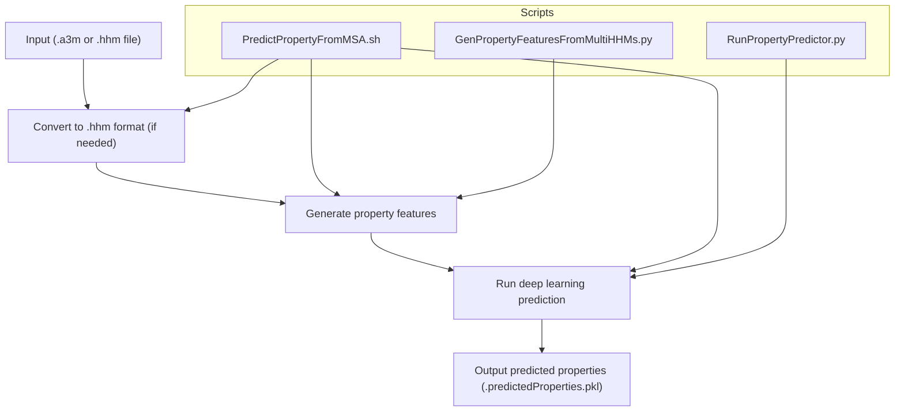
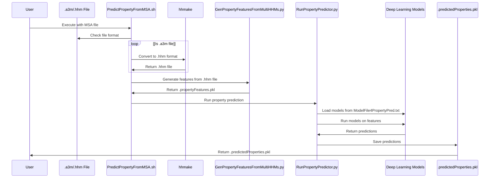
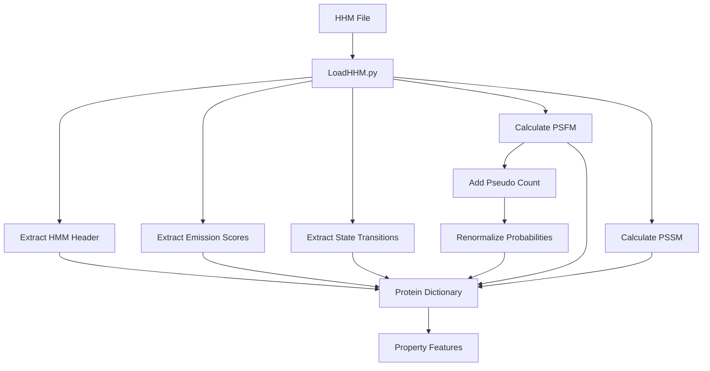
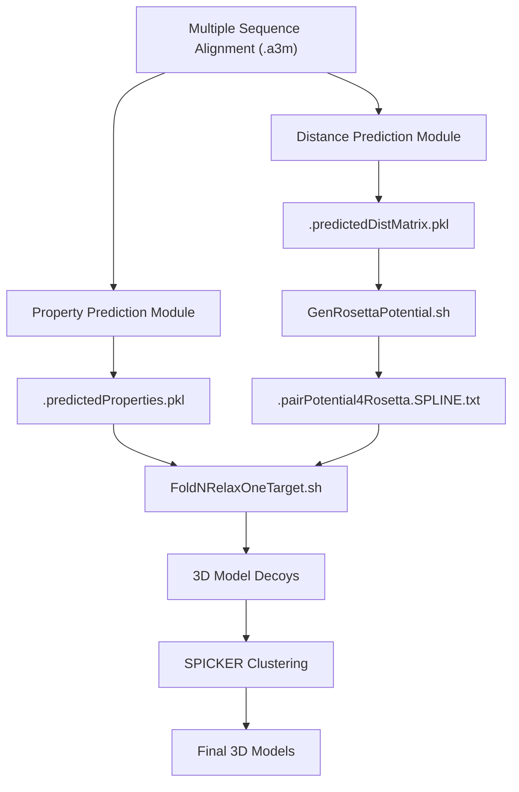
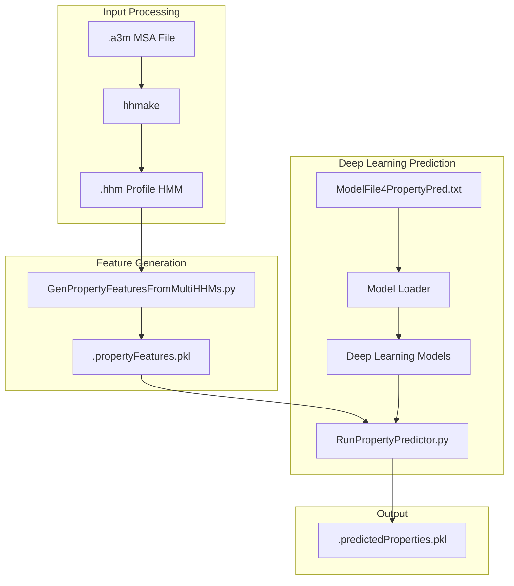

# Property Prediction Workflow

> **Relevant source files**
> * [BuildFeatures/A3MToA2M.sh](https://github.com/j3xugit/RaptorX-3DModeling/blob/22b58bc9/BuildFeatures/A3MToA2M.sh)
> * [Common/LoadHHM.py](https://github.com/j3xugit/RaptorX-3DModeling/blob/22b58bc9/Common/LoadHHM.py)
> * [DL4PropertyPrediction/GenPropertyFeatures4Proteins.py](https://github.com/j3xugit/RaptorX-3DModeling/blob/22b58bc9/DL4PropertyPrediction/GenPropertyFeatures4Proteins.py)
> * [DL4PropertyPrediction/Scripts/PredictProperty4Proteins.sh](https://github.com/j3xugit/RaptorX-3DModeling/blob/22b58bc9/DL4PropertyPrediction/Scripts/PredictProperty4Proteins.sh)
> * [DL4PropertyPrediction/Scripts/PredictPropertyFromMSA.sh](https://github.com/j3xugit/RaptorX-3DModeling/blob/22b58bc9/DL4PropertyPrediction/Scripts/PredictPropertyFromMSA.sh)
> * [DL4PropertyPrediction/Scripts/PredictPropertyFromMSAs.sh](https://github.com/j3xugit/RaptorX-3DModeling/blob/22b58bc9/DL4PropertyPrediction/Scripts/PredictPropertyFromMSAs.sh)
> * [Folding/Scripts4Rosetta/FoldNRelaxTargets.sh](https://github.com/j3xugit/RaptorX-3DModeling/blob/22b58bc9/Folding/Scripts4Rosetta/FoldNRelaxTargets.sh)

The Property Prediction Workflow is a critical component of the RaptorX-3DModeling system that predicts local structural properties of proteins, including phi/psi angles, secondary structure, and solvent accessibility. These predicted properties serve as inputs to the Folding module to enhance 3D model accuracy. This page details the workflow, components, and usage of the DL4PropertyPrediction module. For information about distance prediction, see [Distance Prediction Workflow](/j3xugit/RaptorX-3DModeling/4.1-distance-prediction-workflow). For details about the property prediction models, see [Property Models](/j3xugit/RaptorX-3DModeling/5.2-property-models).

## Workflow Overview

The property prediction workflow takes multiple sequence alignments (MSAs) as input and produces predicted local structural properties as output. These properties help guide the protein folding process and improve structure accuracy.



Sources: [DL4PropertyPrediction/Scripts/PredictPropertyFromMSA.sh L1-L102](https://github.com/j3xugit/RaptorX-3DModeling/blob/22b58bc9/DL4PropertyPrediction/Scripts/PredictPropertyFromMSA.sh#L1-L102)

 [DL4PropertyPrediction/GenPropertyFeatures4Proteins.py L1-L65](https://github.com/j3xugit/RaptorX-3DModeling/blob/22b58bc9/DL4PropertyPrediction/GenPropertyFeatures4Proteins.py#L1-L65)

## Key Components

The property prediction workflow consists of several key scripts and programs that work together to process input files and generate predictions.

| Component | Description | File Path |
| --- | --- | --- |
| PredictPropertyFromMSA.sh | Main entry script for predicting properties from a single MSA file | DL4PropertyPrediction/Scripts/PredictPropertyFromMSA.sh |
| PredictPropertyFromMSAs.sh | Predicts properties for multiple proteins from their MSA files | DL4PropertyPrediction/Scripts/PredictPropertyFromMSAs.sh |
| GenPropertyFeaturesFromMultiHHMs.py | Generates property features from HHM files | DL4PropertyPrediction/ |
| RunPropertyPredictor.py | Runs the deep learning models for property prediction | DL4PropertyPrediction/ |
| ModelFile4PropertyPred.txt | Contains definitions of deep learning model sets | DL4PropertyPrediction/params/ |

Sources: [DL4PropertyPrediction/Scripts/PredictPropertyFromMSA.sh L1-L102](https://github.com/j3xugit/RaptorX-3DModeling/blob/22b58bc9/DL4PropertyPrediction/Scripts/PredictPropertyFromMSA.sh#L1-L102)

 [DL4PropertyPrediction/Scripts/PredictPropertyFromMSAs.sh L1-L103](https://github.com/j3xugit/RaptorX-3DModeling/blob/22b58bc9/DL4PropertyPrediction/Scripts/PredictPropertyFromMSAs.sh#L1-L103)

## Detailed Process Flow

The following diagram illustrates the detailed process flow of the property prediction workflow:



Sources: [DL4PropertyPrediction/Scripts/PredictPropertyFromMSA.sh L1-L102](https://github.com/j3xugit/RaptorX-3DModeling/blob/22b58bc9/DL4PropertyPrediction/Scripts/PredictPropertyFromMSA.sh#L1-L102)

 [DL4PropertyPrediction/GenPropertyFeatures4Proteins.py L1-L65](https://github.com/j3xugit/RaptorX-3DModeling/blob/22b58bc9/DL4PropertyPrediction/GenPropertyFeatures4Proteins.py#L1-L65)

## Feature Generation

The property prediction workflow begins by generating features from multiple sequence alignments. These features are derived from profile HMM files (.hhm) which capture evolutionary information about the protein sequence.

### HHM File Processing

The `.hhm` files are processed using the `LoadHHM.py` module, which extracts position-specific scoring matrices (PSSM) and frequency matrices (PSFM) that serve as input features for the deep learning models.



Sources: [Common/LoadHHM.py L1-L324](https://github.com/j3xugit/RaptorX-3DModeling/blob/22b58bc9/Common/LoadHHM.py#L1-L324)

## Deep Learning Models

The property prediction workflow uses a set of deep learning models to predict various local structural properties. These models are defined in the `ModelFile4PropertyPred.txt` file and referenced by the model name (default: `PhiPsiSet10820Models`).

### Properties Predicted

The following properties are predicted by the workflow:

| Property | Description | Usage in Folding |
| --- | --- | --- |
| Phi/Psi angles | Backbone torsion angles that define protein conformation | Used as restraints in 3D model generation |
| Secondary structure (SS) | Local structural elements (alpha helices, beta sheets, loops) | Helps in model refinement |
| Solvent accessibility (ACC) | Degree to which amino acid residues are exposed to solvent | Improves side-chain packing |

Sources: [DL4PropertyPrediction/Scripts/PredictPropertyFromMSA.sh L1-L102](https://github.com/j3xugit/RaptorX-3DModeling/blob/22b58bc9/DL4PropertyPrediction/Scripts/PredictPropertyFromMSA.sh#L1-L102)

## Integration with the Folding Process

The predicted properties from this workflow are used by the Folding module to generate and refine 3D protein models. The following diagram shows how property prediction integrates with the overall RaptorX-3DModeling pipeline:



Sources: [Folding/Scripts4Rosetta/FoldNRelaxTargets.sh L1-L133](https://github.com/j3xugit/RaptorX-3DModeling/blob/22b58bc9/Folding/Scripts4Rosetta/FoldNRelaxTargets.sh#L1-L133)

## Command-line Options

### PredictPropertyFromMSA.sh

This is the main script for predicting properties from a single MSA file:

```
PredictPropertyFromMSA.sh [ -f DeepModelFile | -m ModelName | -d ResultDir | -g gpu ] MSAfile
```

| Option | Description | Default Value |
| --- | --- | --- |
| -f | File containing deep model names | $DL4PropertyPredHome/params/ModelFile4PropertyPred.txt |
| -m | Model name representing a set of deep learning models | PhiPsiSet10820Models |
| -d | Folder for result saving | Current work directory |
| -g | GPU to use (-1 for automatic selection) | -1 |
| MSAfile | Multiple sequence alignment file in .a3m or .hhm format | Required |

Sources: [DL4PropertyPrediction/Scripts/PredictPropertyFromMSA.sh L20-L31](https://github.com/j3xugit/RaptorX-3DModeling/blob/22b58bc9/DL4PropertyPrediction/Scripts/PredictPropertyFromMSA.sh#L20-L31)

### PredictPropertyFromMSAs.sh

This script predicts properties for multiple proteins:

```
PredictPropertyFromMSAs.sh [ -f DeepModelFile | -m ModelName | -d ResultDir | -g gpu ] proteinListFile hhmFolder/a3mFolder
```

| Option | Description | Default Value |
| --- | --- | --- |
| -f | File containing deep model names | $DL4PropertyPredHome/params/ModelFile4PropertyPred.txt |
| -m | Model name representing a set of deep learning models | PhiPsiSet10820Models |
| -d | Folder for result saving | Current work directory |
| -g | GPU to use | cuda0 |
| proteinListFile | File containing a list of protein names | Required |
| hhmFolder/a3mFolder | Folder containing MSA files | Required |

Sources: [DL4PropertyPrediction/Scripts/PredictPropertyFromMSAs.sh L18-L29](https://github.com/j3xugit/RaptorX-3DModeling/blob/22b58bc9/DL4PropertyPrediction/Scripts/PredictPropertyFromMSAs.sh#L18-L29)

## Data Flow Between Components

The following diagram shows the data flow between the components of the property prediction workflow:



Sources: [DL4PropertyPrediction/Scripts/PredictPropertyFromMSA.sh L1-L102](https://github.com/j3xugit/RaptorX-3DModeling/blob/22b58bc9/DL4PropertyPrediction/Scripts/PredictPropertyFromMSA.sh#L1-L102)

 [DL4PropertyPrediction/GenPropertyFeatures4Proteins.py L1-L65](https://github.com/j3xugit/RaptorX-3DModeling/blob/22b58bc9/DL4PropertyPrediction/GenPropertyFeatures4Proteins.py#L1-L65)

## Usage Examples

### Predicting Properties from a Single MSA File

To predict properties for a single protein using its MSA file:

```
PredictPropertyFromMSA.sh -d /path/to/results -g 0 /path/to/protein.a3m
```

This command will:

1. Convert the .a3m file to .hhm format if needed
2. Generate property features
3. Run the deep learning models for prediction
4. Save the results as `/path/to/results/protein.predictedProperties.pkl`

### Predicting Properties for Multiple Proteins

To predict properties for multiple proteins:

```
PredictPropertyFromMSAs.sh -d /path/to/results -g cuda0 /path/to/proteinList.txt /path/to/msaFolder
```

Where `proteinList.txt` contains one protein name per line, and `/path/to/msaFolder` contains the corresponding .hhm or .a3m files.

## Summary

The Property Prediction Workflow is a key component of the RaptorX-3DModeling system that predicts local structural properties of proteins from multiple sequence alignments. These predicted properties, including phi/psi angles, secondary structure, and solvent accessibility, are used as inputs to the Folding module to enhance the accuracy of 3D protein models. The workflow involves feature generation from MSA files, deep learning prediction using specialized models, and integration with the overall protein structure prediction pipeline.