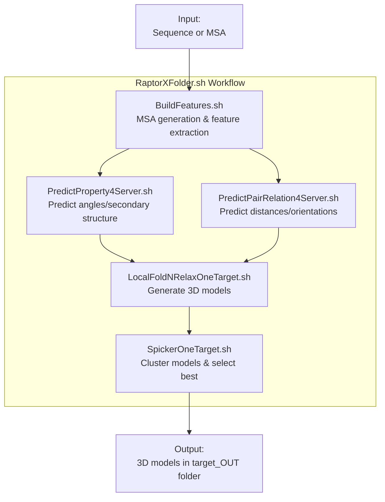
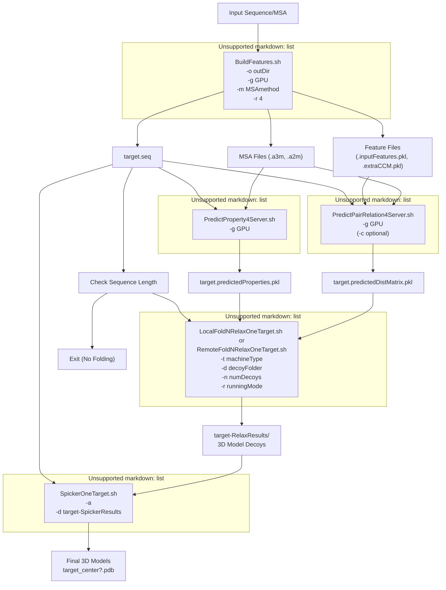
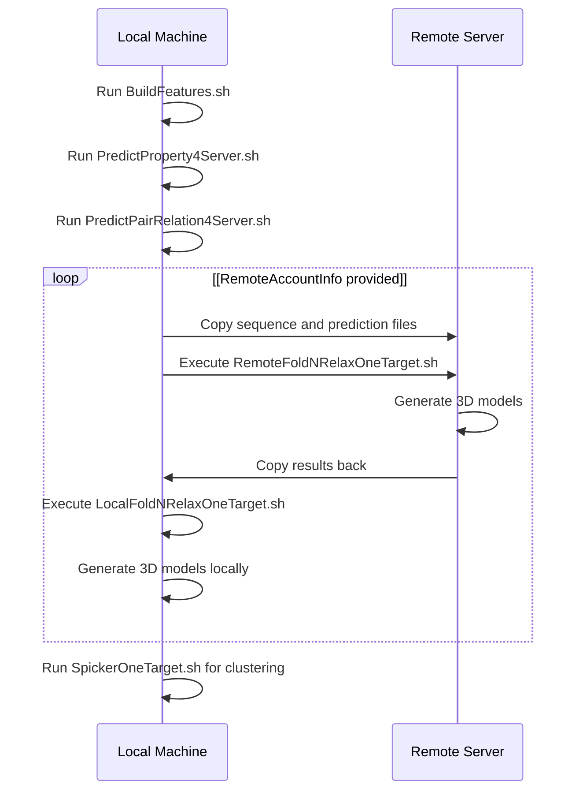
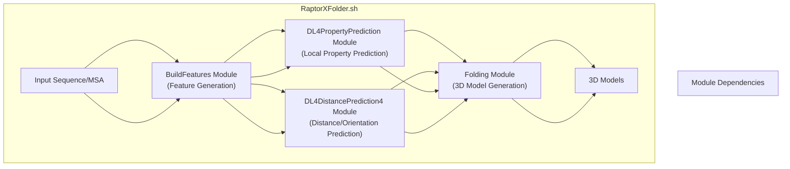

# RaptorXFolder.sh

> **Relevant source files**
> * [Folding/Scripts4Rosetta/RelaxOneTarget.sh](https://github.com/j3xugit/RaptorX-3DModeling/blob/22b58bc9/Folding/Scripts4Rosetta/RelaxOneTarget.sh)
> * [Folding/Scripts4SPICKER/SpickerOneTarget.sh](https://github.com/j3xugit/RaptorX-3DModeling/blob/22b58bc9/Folding/Scripts4SPICKER/SpickerOneTarget.sh)
> * [Server/RaptorXFolder.sh](https://github.com/j3xugit/RaptorX-3DModeling/blob/22b58bc9/Server/RaptorXFolder.sh)

## Purpose and Scope

RaptorXFolder.sh is the main entry point script for the RaptorX-3DModeling protein structure prediction system. This script orchestrates the end-to-end workflow from a protein sequence (or existing multiple sequence alignment) to predicted 3D models by coordinating the execution of the system's core modules:

1. Feature generation from sequences
2. Prediction of protein local properties (angles, secondary structure)
3. Prediction of inter-residue distances and orientations
4. Generation of 3D models based on these predictions
5. Clustering of models to select the best representatives

For information on the individual modules, see the dedicated pages for [BuildFeatures Module](/j3xugit/RaptorX-3DModeling/3-buildfeatures-module), [DL4DistancePrediction4 Module](/j3xugit/RaptorX-3DModeling/4-dl4distanceprediction4-module), [DL4PropertyPrediction Module](/j3xugit/RaptorX-3DModeling/5-dl4propertyprediction-module), and [Folding Module](/j3xugit/RaptorX-3DModeling/6-folding-module).

Sources: [Server/RaptorXFolder.sh L1-L5](https://github.com/j3xugit/RaptorX-3DModeling/blob/22b58bc9/Server/RaptorXFolder.sh#L1-L5)

## Workflow Overview

The following diagram illustrates the workflow orchestrated by RaptorXFolder.sh:



Sources: [Server/RaptorXFolder.sh L134-L208](https://github.com/j3xugit/RaptorX-3DModeling/blob/22b58bc9/Server/RaptorXFolder.sh#L134-L208)

## Command-line Options

RaptorXFolder.sh accepts multiple command-line options to customize the protein structure prediction process:

```
RaptorXFolder.sh [ -o outDir | -g gpu | -m MSAmethod | -n numDecoys | -r runningMode | -R remoteAccountInfo | -t machineType | -l maxLen2BeFolded | -c ] inputFile
```

### Input and Output

* **inputFile**: A protein sequence file in FASTA format (.fasta or .seq) or a multiple sequence alignment in A3M format (.a3m)
* **-o outDir**: Directory for results (default: current directory)

### MSA and Feature Generation Options

* **-m MSAmethod**: Controls MSA generation methods (default: 9) * Sum of: 1 (HHblits for property prediction), 8 (HHblits 3.0 for distance prediction) * Other options: 2 (HHblits 2.0, obsolete), 4 (Jackhmmer), 16 (MetaGenome search) * When 0, no MSA generation (assumes inputFile is already an A3M alignment)

### Prediction and Folding Options

* **-g gpu**: GPU selection (0-3, or -1 for automatic selection)
* **-n numDecoys**: Number of 3D models to generate (default: 120, ≤0 skips folding)
* **-r runningMode**: 0 for fold only, 1 for fold+relax (default: 0)
* **-l maxLen2BeFolded**: Maximum protein length for 3D modeling (default: 1050)
* **-c**: Print contact probability in CASP format only

### Distributed Computing Options

* **-R remoteAccountInfo**: Run folding on a remote machine (format: user@host:path/)
* **-t machineType**: Machine type for folding (0-4) * 0: self-determination (default) * 1: multi-CPU Linux with GNU parallel * 2: homogeneous slurm cluster * 3: heterogeneous slurm cluster * 4: multi-CPU Linux without GNU parallel

Sources: [Server/RaptorXFolder.sh L28-L72](https://github.com/j3xugit/RaptorX-3DModeling/blob/22b58bc9/Server/RaptorXFolder.sh#L28-L72)

 [Server/RaptorXFolder.sh L74-L114](https://github.com/j3xugit/RaptorX-3DModeling/blob/22b58bc9/Server/RaptorXFolder.sh#L74-L114)

## Usage Examples

### Basic Usage with Default Parameters

```
./RaptorXFolder.sh protein.fasta
```

This will:

1. Generate MSAs using HHblits
2. Predict protein properties and distances
3. Build 120 3D models
4. Cluster models and select representatives

### Sequence-to-Contact Prediction Only (No 3D Models)

```
./RaptorXFolder.sh -n 0 protein.fasta
```

### Using a Pre-generated MSA

```
./RaptorXFolder.sh -m 0 protein.a3m
```

### Fold with Relaxation on a Remote Machine

```
./RaptorXFolder.sh -r 1 -R username@server.edu:path/to/work/ protein.fasta
```

Sources: [Server/RaptorXFolder.sh L117-L124](https://github.com/j3xugit/RaptorX-3DModeling/blob/22b58bc9/Server/RaptorXFolder.sh#L117-L124)

## Detailed Process Flow

The following diagram shows the detailed steps executed by RaptorXFolder.sh and the data flow between components:



Sources: [Server/RaptorXFolder.sh L134-L208](https://github.com/j3xugit/RaptorX-3DModeling/blob/22b58bc9/Server/RaptorXFolder.sh#L134-L208)

## Core Module Execution Steps

The script executes the following key steps:

1. **BuildFeatures (Lines 134-139)** * Generates MSAs using the specified methods * Extracts features from the MSAs
2. **PredictProperty4Server (Lines 145-155)** * Predicts structural properties like Phi/Psi angles and secondary structure * Outputs results to `PropertyPred/target.predictedProperties.pkl`
3. **PredictPairRelation4Server (Lines 162-172)** * Predicts distance matrices and orientation matrices * Outputs results to `DistancePred/target.predictedDistMatrix.pkl`
4. **Folding (Lines 173-195)** * Checks if protein length is within the specified limit * Either runs folding locally via `LocalFoldNRelaxOneTarget.sh` or remotely via `RemoteFoldNRelaxOneTarget.sh` * Creates 3D models in `target-RelaxResults/`
5. **Model Clustering (Lines 202-206)** * Runs `SpickerOneTarget.sh` to cluster the generated models * Outputs final representative models to `target-SpickerResults/`

Sources: [Server/RaptorXFolder.sh L134-L206](https://github.com/j3xugit/RaptorX-3DModeling/blob/22b58bc9/Server/RaptorXFolder.sh#L134-L206)

## Input and Output Files

### Input Files

* **Protein sequence file** (.fasta, .seq): Contains the amino acid sequence in FASTA format
* **MSA file** (.a3m): Multiple sequence alignment in A3M format (optional, if -m 0)

### Output Directory Structure

```markdown
target_OUT/
├── target.seq               # Protein sequence
├── PropertyPred/            # Property prediction results
│   └── target.predictedProperties.pkl
├── DistancePred/            # Distance prediction results
│   ├── target.predictedDistMatrix.pkl
│   ├── target.contactmap.txt
│   └── target.rr            # CASP format contact predictions
├── target-RelaxResults/     # Generated 3D model decoys
│   └── *.pdb                # Individual model files
└── target-SpickerResults/   # Clustering results
    ├── target_center1.pdb   # Best representative model
    ├── target_center2.pdb   # Second best model
    └── ...                  # Additional models
```

Sources: [Server/RaptorXFolder.sh L146-L152](https://github.com/j3xugit/RaptorX-3DModeling/blob/22b58bc9/Server/RaptorXFolder.sh#L146-L152)

 [Server/RaptorXFolder.sh L168-L171](https://github.com/j3xugit/RaptorX-3DModeling/blob/22b58bc9/Server/RaptorXFolder.sh#L168-L171)

 [Server/RaptorXFolder.sh L184-L187](https://github.com/j3xugit/RaptorX-3DModeling/blob/22b58bc9/Server/RaptorXFolder.sh#L184-L187)

 [Server/RaptorXFolder.sh L202-L205](https://github.com/j3xugit/RaptorX-3DModeling/blob/22b58bc9/Server/RaptorXFolder.sh#L202-L205)

## Remote Folding Configuration

The script allows running the computationally intensive folding step on a remote machine while performing other steps locally:



### Requirements for Remote Folding

1. RaptorX-3DModeling (at least the folding module) must be installed on the remote machine
2. Password-less SSH/SCP access to the remote account must be configured
3. The remote account information must be provided in the format: `username@host:path/`

Sources: [Server/RaptorXFolder.sh L190-L195](https://github.com/j3xugit/RaptorX-3DModeling/blob/22b58bc9/Server/RaptorXFolder.sh#L190-L195)

## Relationship to Other Modules

The script integrates four main modules of the RaptorX-3DModeling system:



This architecture allows for flexibility:

* You can use only part of the pipeline (e.g., just contact prediction by setting `-n 0`)
* Different modules can be run on different machines (e.g., using the remote folding option)
* Pre-generated MSAs can be used as input (with `-m 0`)

Sources: [Server/RaptorXFolder.sh L134-L206](https://github.com/j3xugit/RaptorX-3DModeling/blob/22b58bc9/Server/RaptorXFolder.sh#L134-L206)

## Advanced Options

### Controlling MSA Generation

The `-m` parameter controls which MSA generation methods are used:

| Value | Methods Used | Use Case |
| --- | --- | --- |
| 0 | None (use input MSA) | When you have a pre-generated MSA |
| 1 | HHblits for property prediction only | Quick property prediction |
| 9 | HHblits for properties + HHblits 3.0 for distance | Default, good balance of speed/quality |
| 25 | All methods including MetaGenome search | Best quality but much slower |

### Folding and Relaxation

The relaxation step (`-r 1`) optimizes the generated models by:

* Removing steric clashes
* Optimizing side-chain atoms
* Improving overall model geometry

However, relaxation is computationally intensive and may take several hours for large proteins.

Sources: [Server/RaptorXFolder.sh L45-L53](https://github.com/j3xugit/RaptorX-3DModeling/blob/22b58bc9/Server/RaptorXFolder.sh#L45-L53)

 [Server/RaptorXFolder.sh L57-L60](https://github.com/j3xugit/RaptorX-3DModeling/blob/22b58bc9/Server/RaptorXFolder.sh#L57-L60)

## Error Handling

The script checks for errors at each major step:

1. Validates the input file exists
2. Confirms successful execution of BuildFeatures.sh
3. Verifies the sequence file was generated
4. Ensures property prediction completed successfully
5. Confirms distance prediction completed successfully
6. Checks protein length against maximum limit for folding
7. Verifies successful execution of folding and clustering steps

If any step fails, the script outputs an error message and exits.

Sources: [Server/RaptorXFolder.sh L121-L124](https://github.com/j3xugit/RaptorX-3DModeling/blob/22b58bc9/Server/RaptorXFolder.sh#L121-L124)

 [Server/RaptorXFolder.sh L135-L138](https://github.com/j3xugit/RaptorX-3DModeling/blob/22b58bc9/Server/RaptorXFolder.sh#L135-L138)

 [Server/RaptorXFolder.sh L139-L143](https://github.com/j3xugit/RaptorX-3DModeling/blob/22b58bc9/Server/RaptorXFolder.sh#L139-L143)

 [Server/RaptorXFolder.sh L146-L155](https://github.com/j3xugit/RaptorX-3DModeling/blob/22b58bc9/Server/RaptorXFolder.sh#L146-L155)

 [Server/RaptorXFolder.sh L168-L172](https://github.com/j3xugit/RaptorX-3DModeling/blob/22b58bc9/Server/RaptorXFolder.sh#L168-L172)

 [Server/RaptorXFolder.sh L180-L184](https://github.com/j3xugit/RaptorX-3DModeling/blob/22b58bc9/Server/RaptorXFolder.sh#L180-L184)

 [Server/RaptorXFolder.sh L196-L199](https://github.com/j3xugit/RaptorX-3DModeling/blob/22b58bc9/Server/RaptorXFolder.sh#L196-L199)

 [Server/RaptorXFolder.sh L203-L206](https://github.com/j3xugit/RaptorX-3DModeling/blob/22b58bc9/Server/RaptorXFolder.sh#L203-L206)