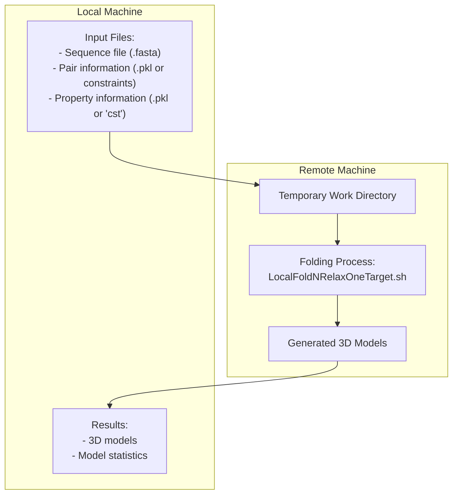
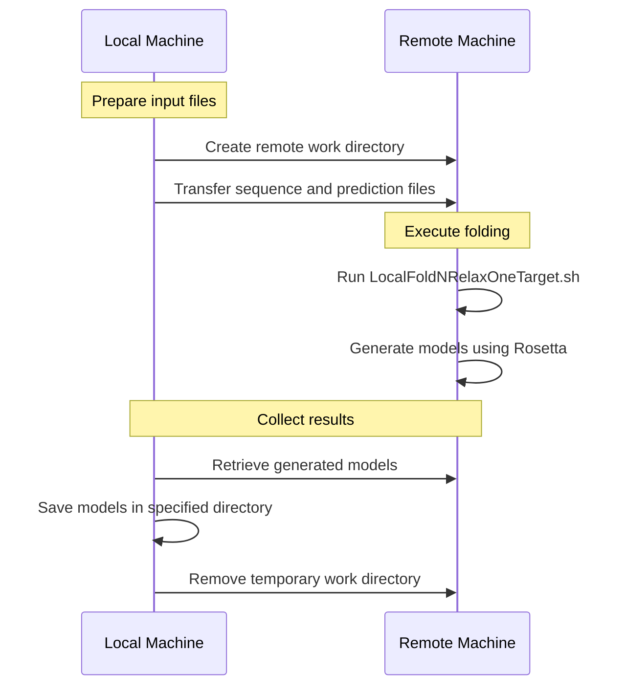
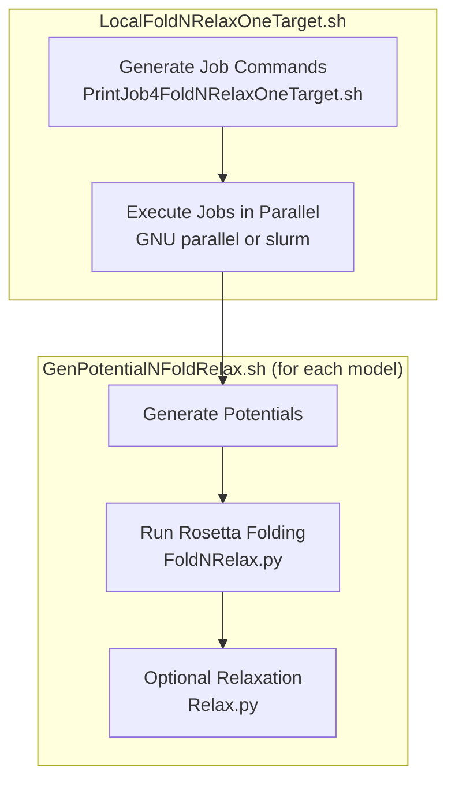

# Remote Folding

> **Relevant source files**
> * [DL4DistancePrediction4/Scripts/PredictPairRelation4Proteins.sh](https://github.com/j3xugit/RaptorX-3DModeling/blob/22b58bc9/DL4DistancePrediction4/Scripts/PredictPairRelation4Proteins.sh)
> * [Folding/RemoteFoldNRelaxOneTarget.sh](https://github.com/j3xugit/RaptorX-3DModeling/blob/22b58bc9/Folding/RemoteFoldNRelaxOneTarget.sh)
> * [Folding/Scripts4Rosetta/GenPotentialNFoldRelax.sh](https://github.com/j3xugit/RaptorX-3DModeling/blob/22b58bc9/Folding/Scripts4Rosetta/GenPotentialNFoldRelax.sh)
> * [Folding/Scripts4Rosetta/PrintJob4FoldNRelaxOneTarget.sh](https://github.com/j3xugit/RaptorX-3DModeling/blob/22b58bc9/Folding/Scripts4Rosetta/PrintJob4FoldNRelaxOneTarget.sh)
> * [Folding/Scripts4Rosetta/PrintJob4FoldNRelaxTargets.sh](https://github.com/j3xugit/RaptorX-3DModeling/blob/22b58bc9/Folding/Scripts4Rosetta/PrintJob4FoldNRelaxTargets.sh)

## Purpose and Scope

This document explains how to use the remote folding capabilities in the RaptorX-3DModeling system. Remote folding allows you to offload the computationally intensive protein structure folding process to a more powerful remote machine or cluster, which is particularly useful for large proteins or when local computational resources are limited. For information about the standard local folding process, see [Folding and Relaxation](/j3xugit/RaptorX-3DModeling/6.2-folding-and-relaxation).

## Overview

Remote folding transfers the necessary input files to a remote machine, executes the folding process there, and then retrieves the results back to the local machine. This functionality allows you to utilize more powerful computing resources for the CPU-intensive folding process while running the rest of the pipeline locally.



**Diagram: Remote Folding Process Overview**

Sources: [Folding/RemoteFoldNRelaxOneTarget.sh L1-L159](https://github.com/j3xugit/RaptorX-3DModeling/blob/22b58bc9/Folding/RemoteFoldNRelaxOneTarget.sh#L1-L159)

## Key Components

The remote folding process uses several key scripts:

1. **RemoteFoldNRelaxOneTarget.sh**: The main script that handles the remote folding workflow
2. **LocalFoldNRelaxOneTarget.sh**: Executed on the remote machine to perform the actual folding
3. **GenPotentialNFoldRelax.sh**: Performs individual folding jobs for each model
4. **PrintJob4FoldNRelaxOneTarget.sh**: Generates folding commands for a single target


**Diagram: Remote Folding Script Relationships**

Sources: [Folding/RemoteFoldNRelaxOneTarget.sh L1-L159](https://github.com/j3xugit/RaptorX-3DModeling/blob/22b58bc9/Folding/RemoteFoldNRelaxOneTarget.sh#L1-L159)

 [Folding/Scripts4Rosetta/GenPotentialNFoldRelax.sh L1-L144](https://github.com/j3xugit/RaptorX-3DModeling/blob/22b58bc9/Folding/Scripts4Rosetta/GenPotentialNFoldRelax.sh#L1-L144)

 [Folding/Scripts4Rosetta/PrintJob4FoldNRelaxOneTarget.sh L1-L98](https://github.com/j3xugit/RaptorX-3DModeling/blob/22b58bc9/Folding/Scripts4Rosetta/PrintJob4FoldNRelaxOneTarget.sh#L1-L98)

## Using Remote Folding

### Prerequisites

1. SSH access to a remote machine or cluster
2. The RaptorX-3DModeling system installed on both local and remote machines
3. GNU parallel installed on the remote machine (for efficient job distribution)
4. Proper environment variables set on the remote machine

### Command Syntax

```
RemoteFoldNRelaxOneTarget.sh [-R remoteAccount | -d savefolder | -n numModels | -r runningMode | -a alpha | -t machineType | -p] seqFile predictedPairInfo [predictedPropertyInfo]
```

### Required Parameters

* **seqFile**: The primary sequence file in FASTA format
* **predictedPairInfo**: A Rosetta constraint file or a PKL file for predicted distance/orientation
* **predictedPropertyInfo**: (Optional) Can be empty, a string 'cst', or a PKL file for predicted Phi/Psi angles * When empty or 'cst', it indicates that predictedPairInfo is a Rosetta constraint text file * When specified as a PKL file, both predictedPairInfo and predictedPropertyInfo are treated as PKL files

### Optional Parameters

| Parameter | Description | Default |
| --- | --- | --- |
| `-R` | Remote account specification in the format `user@host:RemoteWorkDir` | None (local execution) |
| `-n` | Number of models to generate | 120 |
| `-d` | Directory to save results | Current directory |
| `-r` | Running mode: 0 (fold only) or 1 (fold+relax) | 0 |
| `-p` | Use perturbation at folding stage | false |
| `-a` | Alpha value for DFIRE potential (if > 20, random alpha used) | 1.61 |
| `-t` | Machine type for folding jobs | 0 (auto-detect) |

Sources: [Folding/RemoteFoldNRelaxOneTarget.sh L17-L37](https://github.com/j3xugit/RaptorX-3DModeling/blob/22b58bc9/Folding/RemoteFoldNRelaxOneTarget.sh#L17-L37)

### Data Flow



**Diagram: Remote Folding Sequence**

Sources: [Folding/RemoteFoldNRelaxOneTarget.sh L113-L158](https://github.com/j3xugit/RaptorX-3DModeling/blob/22b58bc9/Folding/RemoteFoldNRelaxOneTarget.sh#L113-L158)

## Implementation Details

### Remote Connection Setup

The script establishes an SSH connection to the remote machine using the information provided in the `-R` parameter. It creates a temporary working directory on the remote machine for the folding job:

```
RemoteWorkDir=tmpWorkDir4RemoteDistFolding-${target}-$localMachine-$$
```

This ensures a unique directory name based on the target protein, local machine name, and process ID.

Sources: [Folding/RemoteFoldNRelaxOneTarget.sh L114-L119](https://github.com/j3xugit/RaptorX-3DModeling/blob/22b58bc9/Folding/RemoteFoldNRelaxOneTarget.sh#L114-L119)

### File Transfer

Input files are transferred to the remote machine using `scp`:

```
scp $inFile $pairMatrixFile $propertyFile $RemoteAccount:$RemoteWorkDir/
```

Results are retrieved back using `rsync`:

```
rsync -av $RemoteAccount:$RemoteWorkDir/${target}-RelaxResults/ $savefolder/
```

This ensures efficient transfer of potentially large model files.

Sources: [Folding/RemoteFoldNRelaxOneTarget.sh L128-L151](https://github.com/j3xugit/RaptorX-3DModeling/blob/22b58bc9/Folding/RemoteFoldNRelaxOneTarget.sh#L128-L151)

### Remote Execution

The main folding command executed on the remote machine is:

```
$DistanceFoldingHome/$program -t $machineType -d ${target}-RelaxResults -n $numModels -r $runningMode $inFileBase $pairMatrixFileBase $propertyFileBase
```

Where `$program` is `LocalFoldNRelaxOneTarget.sh`.

Sources: [Folding/RemoteFoldNRelaxOneTarget.sh L139-L144](https://github.com/j3xugit/RaptorX-3DModeling/blob/22b58bc9/Folding/RemoteFoldNRelaxOneTarget.sh#L139-L144)

## Folding Job Generation

The folding process on the remote machine generates multiple job commands using `PrintJob4FoldNRelaxOneTarget.sh`. Each job runs `GenPotentialNFoldRelax.sh` to generate a single protein model:



**Diagram: Folding Job Execution Flow**

Sources: [Folding/Scripts4Rosetta/PrintJob4FoldNRelaxOneTarget.sh L87-L97](https://github.com/j3xugit/RaptorX-3DModeling/blob/22b58bc9/Folding/Scripts4Rosetta/PrintJob4FoldNRelaxOneTarget.sh#L87-L97)

 [Folding/Scripts4Rosetta/GenPotentialNFoldRelax.sh L114-L137](https://github.com/j3xugit/RaptorX-3DModeling/blob/22b58bc9/Folding/Scripts4Rosetta/GenPotentialNFoldRelax.sh#L114-L137)

## Machine Type Options

The `-t` parameter allows specifying the type of remote machine, which affects how parallel jobs are executed:

| Value | Machine Type | Description |
| --- | --- | --- |
| 0 | Auto-detect | System tries to determine the best approach |
| 1 | Multi-CPU Linux | Uses GNU parallel for job distribution |
| 2 | Slurm cluster (homogeneous) | Uses slurm batch system with similar nodes |
| 3 | Slurm cluster (heterogeneous) | Uses slurm batch system with different node types |
| 4 | Multi-CPU Linux without GNU parallel | Sequential job execution |

Sources: [Folding/RemoteFoldNRelaxOneTarget.sh L36-L37](https://github.com/j3xugit/RaptorX-3DModeling/blob/22b58bc9/Folding/RemoteFoldNRelaxOneTarget.sh#L36-L37)

## Example Usage

### Basic Remote Folding

```
RemoteFoldNRelaxOneTarget.sh -R username@remote.server.edu:work/folding \  -n 200 -d results T0955.fasta T0955.pairPotential4Rosetta.SPLINE.txt
```

This command will:

1. Connect to remote.server.edu as "username"
2. Create a work directory under "work/folding"
3. Transfer the sequence and constraint files
4. Generate 200 models
5. Save results in the "results" directory

### Remote Folding with Relaxation

```
RemoteFoldNRelaxOneTarget.sh -R username@cluster.university.edu \  -n 100 -d T0955_models -r 1 -t 2 \  T0955.fasta T0955.predictedDistMatrix.pkl T0955.predictedProperties.pkl
```

This command will:

1. Connect to a slurm cluster
2. Generate and relax 100 models
3. Use PKL files for distance, orientation, and property predictions
4. Save results in "T0955_models" directory

## Troubleshooting

1. **Connection issues**: Ensure SSH key authentication is set up correctly between local and remote machines
2. **File transfer errors**: Check disk space and permissions on the remote machine
3. **Execution failures**: Verify that all required dependencies are properly installed on the remote machine
4. **Environment setup**: Make sure the `$DistanceFoldingHome` variable is properly set on the remote machine

Sources: [Folding/RemoteFoldNRelaxOneTarget.sh L113-L158](https://github.com/j3xugit/RaptorX-3DModeling/blob/22b58bc9/Folding/RemoteFoldNRelaxOneTarget.sh#L113-L158)