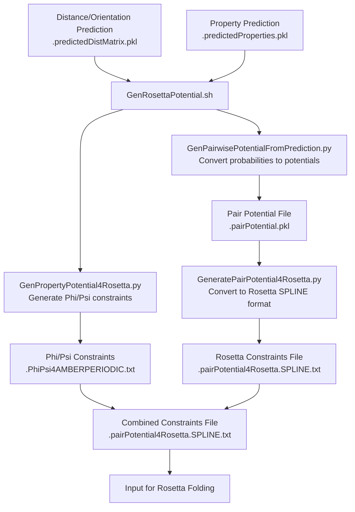
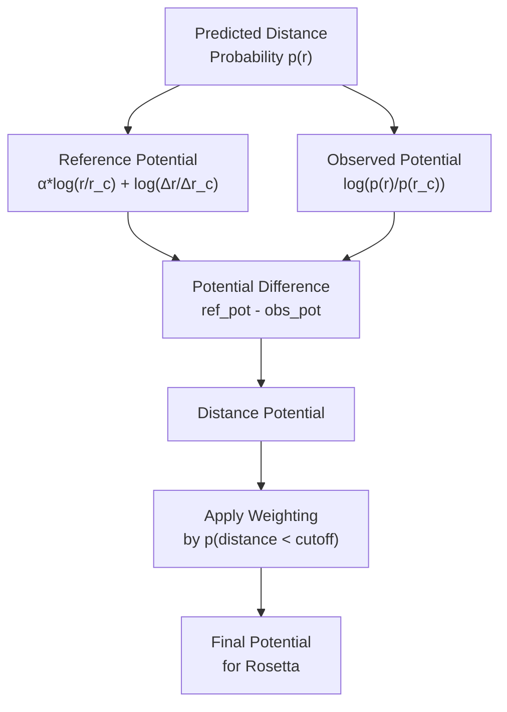
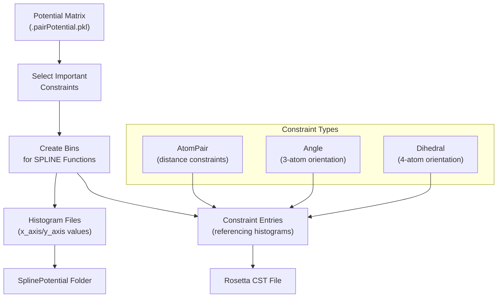
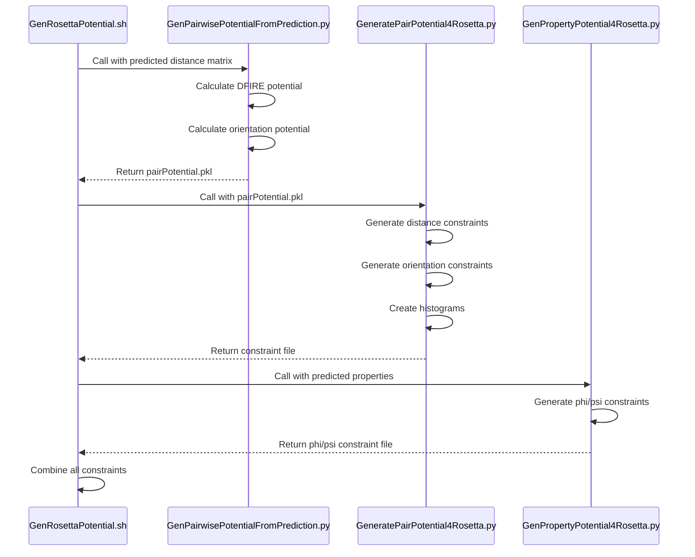

# Rosetta Potential Generation

> **Relevant source files**
> * [DL4DistancePrediction4/Scripts/PredictPairRelation4OneInput.sh](https://github.com/j3xugit/RaptorX-3DModeling/blob/22b58bc9/DL4DistancePrediction4/Scripts/PredictPairRelation4OneInput.sh)
> * [DL4DistancePrediction4/Scripts/PredictPairRelation4OneProtein.sh](https://github.com/j3xugit/RaptorX-3DModeling/blob/22b58bc9/DL4DistancePrediction4/Scripts/PredictPairRelation4OneProtein.sh)
> * [DL4DistancePrediction4/Scripts/PredictPairRelation4Server.sh](https://github.com/j3xugit/RaptorX-3DModeling/blob/22b58bc9/DL4DistancePrediction4/Scripts/PredictPairRelation4Server.sh)
> * [DL4DistancePrediction4/Scripts/PredictPairRelationFromMSA.sh](https://github.com/j3xugit/RaptorX-3DModeling/blob/22b58bc9/DL4DistancePrediction4/Scripts/PredictPairRelationFromMSA.sh)
> * [DL4DistancePrediction4/Scripts/RankContactPred4OneProtein.sh](https://github.com/j3xugit/RaptorX-3DModeling/blob/22b58bc9/DL4DistancePrediction4/Scripts/RankContactPred4OneProtein.sh)
> * [Folding/BatchGenDistPotential4Threading.sh](https://github.com/j3xugit/RaptorX-3DModeling/blob/22b58bc9/Folding/BatchGenDistPotential4Threading.sh)
> * [Folding/GenDistPotential4Threading.sh](https://github.com/j3xugit/RaptorX-3DModeling/blob/22b58bc9/Folding/GenDistPotential4Threading.sh)
> * [Folding/GenPairwisePotentialFromPrediction.py](https://github.com/j3xugit/RaptorX-3DModeling/blob/22b58bc9/Folding/GenPairwisePotentialFromPrediction.py)
> * [Folding/Scripts4Rosetta/GenRosettaPotential.sh](https://github.com/j3xugit/RaptorX-3DModeling/blob/22b58bc9/Folding/Scripts4Rosetta/GenRosettaPotential.sh)
> * [Folding/Scripts4Rosetta/GeneratePairPotential4Rosetta.py](https://github.com/j3xugit/RaptorX-3DModeling/blob/22b58bc9/Folding/Scripts4Rosetta/GeneratePairPotential4Rosetta.py)

This document explains how the RaptorX-3DModeling system converts predicted distance distributions, orientation information, and protein properties into energy potentials and geometric constraints for use with the Rosetta molecular modeling suite. The generated constraints guide the Rosetta folding process to produce accurate 3D protein models.

For information about the actual folding and relaxation process using these potentials, see [Folding and Relaxation](/j3xugit/RaptorX-3DModeling/6.2-folding-and-relaxation).

## Overview and Purpose

The Rosetta Potential Generation module serves as a critical bridge between RaptorX's deep learning prediction modules and the Rosetta structure modeling software. It transforms probabilistic predictions into physical energy terms that guide Rosetta's sampling toward the native protein structure.



Sources: [Folding/Scripts4Rosetta/GenRosettaPotential.sh L1-L150](https://github.com/j3xugit/RaptorX-3DModeling/blob/22b58bc9/Folding/Scripts4Rosetta/GenRosettaPotential.sh#L1-L150)

 [Folding/GenPairwisePotentialFromPrediction.py L1-L30](https://github.com/j3xugit/RaptorX-3DModeling/blob/22b58bc9/Folding/GenPairwisePotentialFromPrediction.py#L1-L30)

## Potential Types and Conversion Process

### Distance Potentials

RaptorX primarily uses the DFIRE (Distance-scaled, Finite Ideal-gas REference) potential for converting predicted distance distributions into energy terms. This statistical potential uses a reference state based on a uniformly distributed ideal gas with a distance dependence of r^α.

The conversion process involves:

1. Taking the predicted distance probability distribution
2. Calculating a reference potential using the DFIRE formula: α * log(r/r_c) + log(Δr/Δr_c)
3. Calculating the observed potential as log(p(r)/p(r_c)) from predictions
4. Computing the difference between reference and observed potentials



Sources: [Folding/GenPairwisePotentialFromPrediction.py L146-L217](https://github.com/j3xugit/RaptorX-3DModeling/blob/22b58bc9/Folding/GenPairwisePotentialFromPrediction.py#L146-L217)

### Orientation Potentials

Orientation potentials are derived from predicted probabilities for various angular relationships between atoms:

1. Angle potentials (3 atoms): e.g., Cα-Cβ-Cβ angles between residues
2. Dihedral potentials (4 atoms): e.g., Cα-Cβ-Cβ-Cα dihedral angles between residues

The orientation potential is calculated as -log(predicted probability), optionally adjusted by a reference distribution from the training data, and weighted by the probability of having a valid distance (typically < 20Å).

Sources: [Folding/GenPairwisePotentialFromPrediction.py L72-L144](https://github.com/j3xugit/RaptorX-3DModeling/blob/22b58bc9/Folding/GenPairwisePotentialFromPrediction.py#L72-L144)

### Phi/Psi (Backbone) Potentials

The system also generates constraints for backbone torsion angles (phi/psi) from the property prediction module. These constraints help to maintain proper local geometry during folding.

Sources: [Folding/Scripts4Rosetta/GenRosettaPotential.sh L132-L142](https://github.com/j3xugit/RaptorX-3DModeling/blob/22b58bc9/Folding/Scripts4Rosetta/GenRosettaPotential.sh#L132-L142)

## Conversion to Rosetta Format

Rosetta uses a specific format for constraints that guides its conformational sampling. The primary steps in converting RaptorX potentials to Rosetta format include:

1. Converting potentials to SPLINE format (piece-wise cubic splines)
2. Creating histogram files that define each potential energy function
3. Generating constraint entries that reference these histograms



Sources: [Folding/Scripts4Rosetta/GeneratePairPotential4Rosetta.py L34-L96](https://github.com/j3xugit/RaptorX-3DModeling/blob/22b58bc9/Folding/Scripts4Rosetta/GeneratePairPotential4Rosetta.py#L34-L96)

## Implementation Details

### Distance Constraint Generation

For distance constraints:

1. The system selects valid residue pairs based on sequence separation
2. It adds repulsive terms for physically impossible distances
3. It generates SPLINE functions that define the potential energy at different distances
4. Constraints are formatted as `AtomPair` entries in the Rosetta constraint file

For example, a CβCβ distance constraint might be generated with a strong energy minimum at the most probable predicted distance and increasing energy as the distance deviates.

Sources: [Folding/Scripts4Rosetta/GeneratePairPotential4Rosetta.py L211-L330](https://github.com/j3xugit/RaptorX-3DModeling/blob/22b58bc9/Folding/Scripts4Rosetta/GeneratePairPotential4Rosetta.py#L211-L330)

### Orientation Constraint Generation

For orientation constraints:

1. The system selects the top orientation constraints based on probability and sequence separation
2. It converts angle values from degrees to radians
3. It generates SPLINE functions for the orientation energy
4. Constraints are formatted as `Angle` or `Dihedral` entries in the Rosetta constraint file

The system typically uses a parameter (`topRatio`) to limit orientation constraints to only the most confident predictions.

Sources: [Folding/Scripts4Rosetta/GeneratePairPotential4Rosetta.py L99-L207](https://github.com/j3xugit/RaptorX-3DModeling/blob/22b58bc9/Folding/Scripts4Rosetta/GeneratePairPotential4Rosetta.py#L99-L207)

## Usage Guide

### Basic Command

```
GenRosettaPotential.sh predictedPairPKLfile predictedPropertyPKLfile
```

Where:

* `predictedPairPKLfile`: PKL file with predicted distance/orientation distributions
* `predictedPropertyPKLfile`: PKL file with predicted backbone phi/psi angles

### Common Options

| Option | Description | Default |
| --- | --- | --- |
| `-A atomType` | Atom pair types for constraints | `CbCb+CaCa+NO+TwoROri` |
| `-a alpha` | Alpha value for DFIRE reference state | `1.61` |
| `-c distCutoff` | Maximum distance cutoff (Å) | `18` |
| `-t topRatio` | Number of orientation constraints per residue | `25` |
| `-w w4phipsi` | Weight for phi/psi constraints | `1` |
| `-s seqSep` | Minimum sequence separation | `1` |
| `-d saveFolder` | Output directory | Current directory |
| `-q querySeqFile` | Protein sequence file (FASTA) | None |

Sources: [Folding/Scripts4Rosetta/GenRosettaPotential.sh L19-L35](https://github.com/j3xugit/RaptorX-3DModeling/blob/22b58bc9/Folding/Scripts4Rosetta/GenRosettaPotential.sh#L19-L35)

### Example

```
GenRosettaPotential.sh -A CbCb+TwoROri -a 1.61 -c 15 -t 20 -d results/ T0950.predictedDistMatrix.pkl T0950.predictedProperties.pkl
```

This generates Rosetta constraints using:

* CbCb distances and two-residue orientations
* DFIRE alpha value of 1.61
* Distance cutoff of 15Å
* 20 orientation constraints per residue
* Output saved in the "results" directory

## Output Files

The process generates two main outputs:

1. **Constraint file**: `[proteinName].pairPotential4Rosetta.SPLINE.txt` * Contains all distance, orientation, and phi/psi constraints * Used directly by Rosetta during modeling
2. **Histogram folder**: `SplinePotential4[proteinName]/` * Contains individual potential files defining each SPLINE function * Referenced by the constraint file

A sample entry in the constraint file might look like:

```
AtomPair CB 5 CB 48 SPLINE CbCb SplinePotential4T0950/CbCb31C-5-48.potential.txt 0 1 0.500000
Dihedral CA 5 CB 5 CB 48 CA 48 SPLINE Ca1Cb1Cb2Ca2 SplinePotential4T0950/Ca1Cb1Cb2Ca2-5-48.potential.txt 0 1 0.087266
```

Sources: [Folding/Scripts4Rosetta/GeneratePairPotential4Rosetta.py L54-L96](https://github.com/j3xugit/RaptorX-3DModeling/blob/22b58bc9/Folding/Scripts4Rosetta/GeneratePairPotential4Rosetta.py#L54-L96)

 [Folding/Scripts4Rosetta/GenRosettaPotential.sh L110-L149](https://github.com/j3xugit/RaptorX-3DModeling/blob/22b58bc9/Folding/Scripts4Rosetta/GenRosettaPotential.sh#L110-L149)

## Integration with Folding

The generated constraint file serves as a key input to the folding process. During folding:

1. Rosetta reads the constraint file and associated histograms
2. The constraints guide Rosetta's Monte Carlo sampling toward conformations that satisfy the predicted distances and angles
3. The combined energy from physical forcefield terms and these constraints helps identify the most probable protein structure

Sources: [Folding/Scripts4Rosetta/GenRosettaPotential.sh L147-L149](https://github.com/j3xugit/RaptorX-3DModeling/blob/22b58bc9/Folding/Scripts4Rosetta/GenRosettaPotential.sh#L147-L149)

## Technical Implementation Workflow



Sources: [Folding/Scripts4Rosetta/GenRosettaPotential.sh L110-L149](https://github.com/j3xugit/RaptorX-3DModeling/blob/22b58bc9/Folding/Scripts4Rosetta/GenRosettaPotential.sh#L110-L149)

## Performance Considerations

* **Distance potential cutoff**: Higher values (e.g., 20Å) provide more long-range information but may introduce noise
* **Alpha parameter**: The default value of 1.61 is optimized for protein structures, but small variations (1.57-1.63) are sometimes used for robustness
* **Orientation constraints**: Using a reasonable `topRatio` (typically 20-30) ensures only high-confidence orientation constraints are used
* **Sequence separation**: Increasing the minimum sequence separation can reduce the number of constraints and focus on more informative long-range interactions

Sources: [Folding/GenPairwisePotentialFromPrediction.py L557-L566](https://github.com/j3xugit/RaptorX-3DModeling/blob/22b58bc9/Folding/GenPairwisePotentialFromPrediction.py#L557-L566)

 [Folding/Scripts4Rosetta/GeneratePairPotential4Rosetta.py L423-L426](https://github.com/j3xugit/RaptorX-3DModeling/blob/22b58bc9/Folding/Scripts4Rosetta/GeneratePairPotential4Rosetta.py#L423-L426)