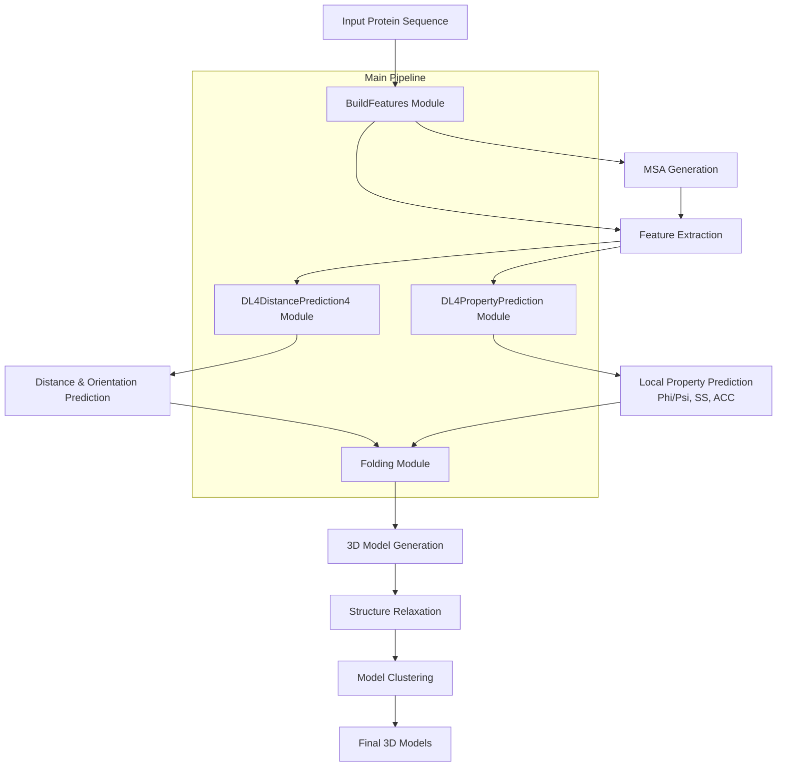
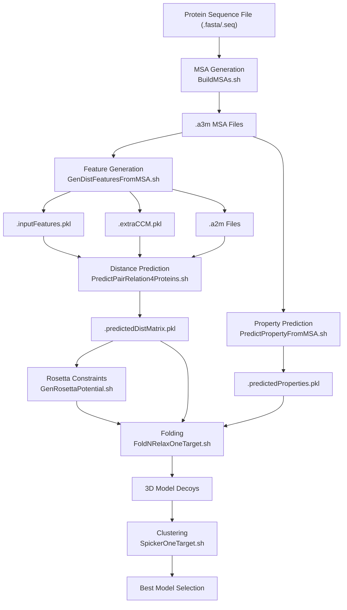
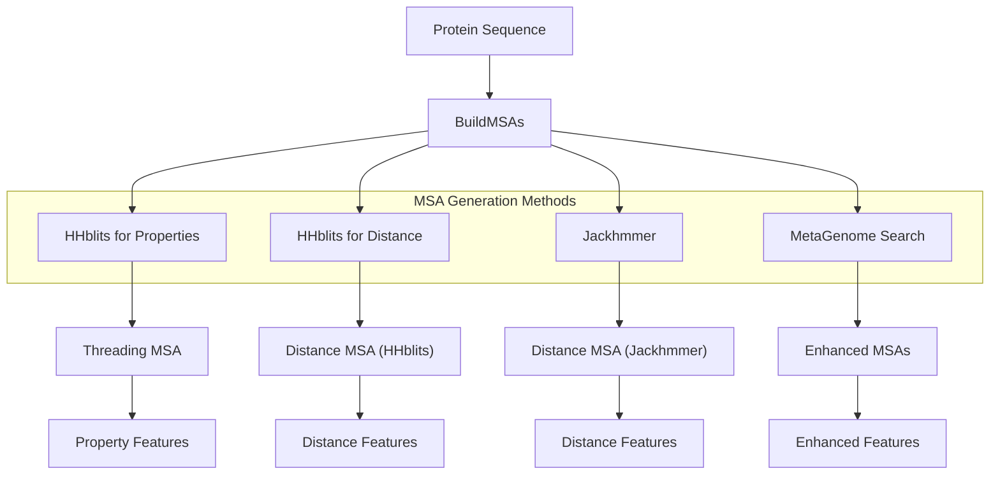
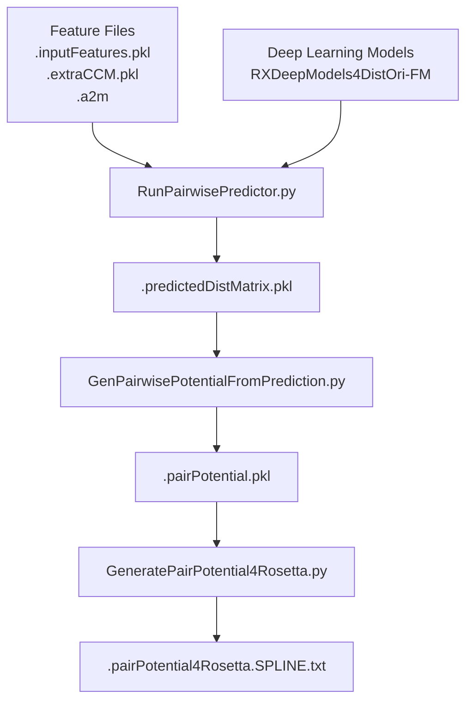
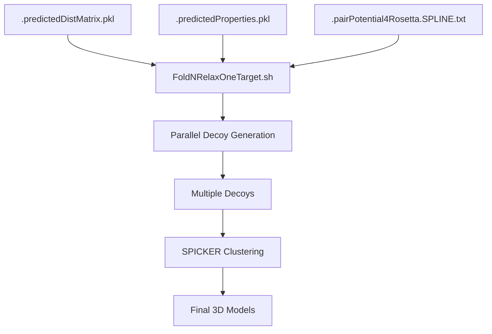
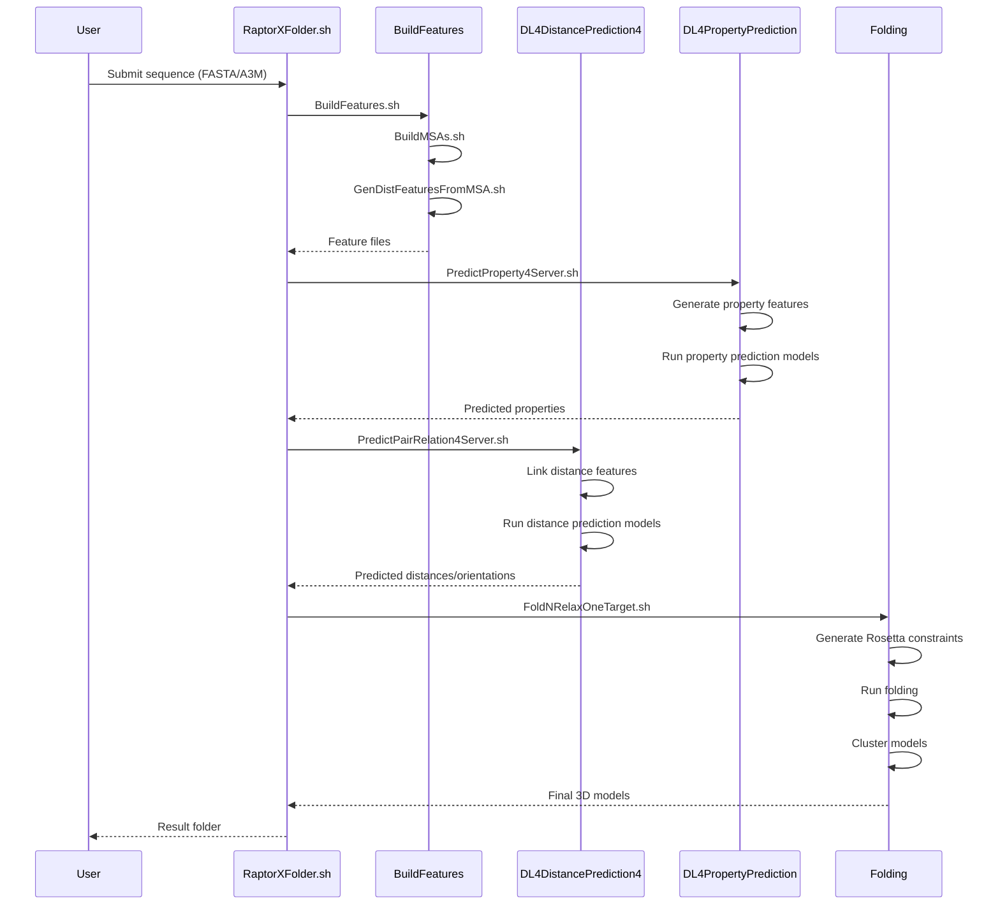

# System Architecture

> **Relevant source files**
> * [BuildFeatures/BatchGenDistFeaturesFromMSAs.sh](https://github.com/j3xugit/RaptorX-3DModeling/blob/22b58bc9/BuildFeatures/BatchGenDistFeaturesFromMSAs.sh)
> * [DL4DistancePrediction4/FeatureUtils.py](https://github.com/j3xugit/RaptorX-3DModeling/blob/22b58bc9/DL4DistancePrediction4/FeatureUtils.py)
> * [DL4DistancePrediction4/Scripts/PredictPairRelation4Inputs.sh](https://github.com/j3xugit/RaptorX-3DModeling/blob/22b58bc9/DL4DistancePrediction4/Scripts/PredictPairRelation4Inputs.sh)
> * [DL4DistancePrediction4/Utils/GenerateMetaData.py](https://github.com/j3xugit/RaptorX-3DModeling/blob/22b58bc9/DL4DistancePrediction4/Utils/GenerateMetaData.py)
> * [README.md](https://github.com/j3xugit/RaptorX-3DModeling/blob/22b58bc9/README.md?plain=1)
> * [raptorx-path.sh](https://github.com/j3xugit/RaptorX-3DModeling/blob/22b58bc9/raptorx-path.sh)

This page describes the high-level architecture, components, and data flow of the RaptorX-3DModeling system. It provides an overview of how the various modules interact to transform a protein sequence into a predicted 3D structure. For installation and setup instructions, see [Installation and Setup](/j3xugit/RaptorX-3DModeling/1.2-installation-and-setup), and for details on running the system, see [Main Workflow](/j3xugit/RaptorX-3DModeling/2-main-workflow).

## System Overview

RaptorX-3DModeling is a comprehensive protein structure prediction system that uses deep learning to predict various protein properties, which are then used to build 3D protein models. The system is organized into four main modules:

1. **BuildFeatures** - Generates Multiple Sequence Alignments (MSAs) and extracts features
2. **DL4DistancePrediction4** - Predicts inter-residue distances and orientations
3. **DL4PropertyPrediction** - Predicts local structural properties (phi/psi angles, secondary structure)
4. **Folding** - Builds 3D models using the predicted information

### High-Level Architecture Diagram



Sources: [README.md L43-L46](https://github.com/j3xugit/RaptorX-3DModeling/blob/22b58bc9/README.md?plain=1#L43-L46)

 [README.md L145-L161](https://github.com/j3xugit/RaptorX-3DModeling/blob/22b58bc9/README.md?plain=1#L145-L161)

## Core Modules and Components

The system consists of four main modules, each responsible for a specific part of the protein structure prediction pipeline. Each module contains several scripts and utilities that work together to process the data.

### Module Structure and Key Components

```mermaid
flowchart TD

Server["Server Scripts"]
RaptorXFolder["RaptorXFolder.sh"]
BuildFeatures["BuildFeatures"]
DL4DistancePred["DL4DistancePrediction4"]
DL4PropertyPred["DL4PropertyPrediction"]
Folding["Folding"]
BuildMSAs["BuildMSAs.sh"]
GenDistFeatures["GenDistFeaturesFromMSA.sh"]
BatchGenDist["BatchGenDistFeaturesFromMSAs.sh"]
PredictPair["PredictPairRelation4Proteins.sh"]
PredictPair4Server["PredictPairRelation4Server.sh"]
FeatureUtils["FeatureUtils.py"]
PredictProperty["PredictPropertyFromMSA.sh"]
PredictProp4Server["PredictProperty4Server.sh"]
FoldNRelax["LocalFoldNRelaxOneTarget.sh"]
GenRosettaPotential["GenRosettaPotential.sh"]
SpickerOneTarget["SpickerOneTarget.sh"]
RelaxOneTarget["RelaxOneTarget.sh"]

Server --> RaptorXFolder
RaptorXFolder --> BuildFeatures
RaptorXFolder --> DL4DistancePred
RaptorXFolder --> DL4PropertyPred
RaptorXFolder --> Folding
BuildFeatures --> BuildMSAs
BuildFeatures --> GenDistFeatures
BuildFeatures --> BatchGenDist
DL4DistancePred --> PredictPair
DL4DistancePred --> PredictPair4Server
DL4DistancePred --> FeatureUtils
DL4PropertyPred --> PredictProperty
DL4PropertyPred --> PredictProp4Server
Folding --> FoldNRelax
Folding --> GenRosettaPotential
Folding --> SpickerOneTarget
Folding --> RelaxOneTarget
```



Sources: [README.md L43-L46](https://github.com/j3xugit/RaptorX-3DModeling/blob/22b58bc9/README.md?plain=1#L43-L46)

 [README.md L230-L284](https://github.com/j3xugit/RaptorX-3DModeling/blob/22b58bc9/README.md?plain=1#L230-L284)

### BuildFeatures Module

The BuildFeatures module is responsible for generating Multiple Sequence Alignments (MSAs) and extracting features from them. It has two main functions:

1. **MSA Generation**: Uses tools like HHblits and Jackhmmer to create MSAs from the input protein sequence.
2. **Feature Extraction**: Processes MSAs to generate features for the deep learning models.

Key components include:

* `BuildMSAs.sh`: Generates MSAs using different search methods (HHblits, Jackhmmer)
* `GenDistFeaturesFromMSA.sh`: Extracts features from MSAs for distance/orientation prediction
* `BatchGenDistFeaturesFromMSAs.sh`: Processes multiple MSAs in batch mode

The feature extraction process creates several key files:

* `.inputFeatures.pkl`: Main input features for prediction
* `.extraCCM.pkl`: Additional co-evolutionary information
* `.a2m`: MSA in a2m format for additional processing

Sources: [BuildFeatures/BatchGenDistFeaturesFromMSAs.sh L18-L36](https://github.com/j3xugit/RaptorX-3DModeling/blob/22b58bc9/BuildFeatures/BatchGenDistFeaturesFromMSAs.sh#L18-L36)

 [README.md L228-L255](https://github.com/j3xugit/RaptorX-3DModeling/blob/22b58bc9/README.md?plain=1#L228-L255)

### DL4DistancePrediction4 Module

This module predicts inter-residue distances and orientations using deep learning models. It takes the features generated by the BuildFeatures module and outputs distance/orientation predictions.

Key components include:

* `PredictPairRelation4Proteins.sh`: Predicts distances for multiple proteins
* `PredictPairRelation4Inputs.sh`: Processes multiple inputs in batch mode
* `FeatureUtils.py`: Utilities for feature processing and management
* `RunPairwisePredictor.py`: Core prediction script that runs the deep learning models

The module outputs `.predictedDistMatrix.pkl` files containing the predicted distance/orientation information.

Sources: [DL4DistancePrediction4/Scripts/PredictPairRelation4Inputs.sh L29-L54](https://github.com/j3xugit/RaptorX-3DModeling/blob/22b58bc9/DL4DistancePrediction4/Scripts/PredictPairRelation4Inputs.sh#L29-L54)

 [DL4DistancePrediction4/FeatureUtils.py L11-L92](https://github.com/j3xugit/RaptorX-3DModeling/blob/22b58bc9/DL4DistancePrediction4/FeatureUtils.py#L11-L92)

 [README.md L258-L274](https://github.com/j3xugit/RaptorX-3DModeling/blob/22b58bc9/README.md?plain=1#L258-L274)

### DL4PropertyPrediction Module

This module predicts local structural properties such as Phi/Psi angles and secondary structure using deep learning models. It works with the MSAs generated by the BuildFeatures module.

Key components include:

* `PredictPropertyFromMSA.sh`: Predicts properties from an MSA
* `PredictProperty4Server.sh`: Server-friendly version for property prediction

The module outputs `.predictedProperties.pkl` files containing the predicted properties.

Sources: [README.md L278-L279](https://github.com/j3xugit/RaptorX-3DModeling/blob/22b58bc9/README.md?plain=1#L278-L279)

### Folding Module

The Folding module uses the predicted distances, orientations, and properties to generate 3D models of the protein. It employs PyRosetta for model generation and refinement.

Key components include:

* `FoldNRelaxOneTarget.sh`: Main script for folding and relaxation
* `GenRosettaPotential.sh`: Converts predictions to Rosetta constraints
* `SpickerOneTarget.sh`: Clusters generated models
* `RelaxOneTarget.sh`: Refines 3D models

The module produces multiple 3D models (decoys) which are then clustered to identify the most probable structures.

Sources: [README.md L282-L285](https://github.com/j3xugit/RaptorX-3DModeling/blob/22b58bc9/README.md?plain=1#L282-L285)

## Data Flow and File Formats

The RaptorX-3DModeling system processes data through several stages, with specific file formats at each step. Understanding this data flow is crucial for using and troubleshooting the system.

### Data Flow Diagram



Sources: [README.md L173-L187](https://github.com/j3xugit/RaptorX-3DModeling/blob/22b58bc9/README.md?plain=1#L173-L187)

### Key File Formats

| Stage | File Format | Description |
| --- | --- | --- |
| Input | `.fasta`, `.seq` | Protein sequence in FASTA format |
| MSA Generation | `.a3m` | Multiple Sequence Alignment in a3m format |
| Feature Extraction | `.inputFeatures.pkl` | Input features for prediction |
|  | `.extraCCM.pkl` | Additional co-evolutionary information |
|  | `.a2m` | MSA in a2m format for additional processing |
| Distance Prediction | `.predictedDistMatrix.pkl` | Predicted distances and orientations |
| Property Prediction | `.predictedProperties.pkl` | Predicted Phi/Psi angles and secondary structure |
| Folding | `.pairPotential4Rosetta.SPLINE.txt` | Rosetta constraints |
| Output | `_OUT/` | Folder containing all results |

Sources: [README.md L173-L187](https://github.com/j3xugit/RaptorX-3DModeling/blob/22b58bc9/README.md?plain=1#L173-L187)

 [README.md L254-L264](https://github.com/j3xugit/RaptorX-3DModeling/blob/22b58bc9/README.md?plain=1#L254-L264)

## Feature Generation and Processing

Feature generation is a critical part of the RaptorX-3DModeling system. It involves creating MSAs and extracting features that capture evolutionary information.

### MSA Generation Methods



Sources: [README.md L91-L109](https://github.com/j3xugit/RaptorX-3DModeling/blob/22b58bc9/README.md?plain=1#L91-L109)

 [README.md L230-L255](https://github.com/j3xugit/RaptorX-3DModeling/blob/22b58bc9/README.md?plain=1#L230-L255)

The system uses multiple methods to generate MSAs, which capture different evolutionary signals:

1. **HHblits for Properties**: Generates MSAs for property prediction (Phi/Psi angles, secondary structure)
2. **HHblits for Distance**: Creates MSAs specifically for distance/orientation prediction
3. **Jackhmmer**: An alternative method for MSA generation (slower but sometimes captures different homologs)
4. **MetaGenome Search**: Enhances MSAs with metagenomic sequences

### Feature Extraction Process

The feature extraction process converts MSAs into input features for the deep learning models. This involves several steps:

1. **Preprocessing MSAs**: Converting MSAs to a suitable format
2. **Computing Co-evolutionary Information**: Using methods like CCMpred to extract co-evolutionary signals
3. **Generating Position-specific Features**: Extracting sequence-based features
4. **Creating Input Feature Files**: Packaging all features into `.pkl` files

The `GenDistFeaturesFromMSA.sh` script handles most of this process, with `BatchGenDistFeaturesFromMSAs.sh` providing batch processing capabilities.

Sources: [BuildFeatures/BatchGenDistFeaturesFromMSAs.sh L18-L36](https://github.com/j3xugit/RaptorX-3DModeling/blob/22b58bc9/BuildFeatures/BatchGenDistFeaturesFromMSAs.sh#L18-L36)

 [DL4DistancePrediction4/FeatureUtils.py L11-L92](https://github.com/j3xugit/RaptorX-3DModeling/blob/22b58bc9/DL4DistancePrediction4/FeatureUtils.py#L11-L92)

## Prediction and Model Generation

The prediction and model generation processes form the core of the RaptorX-3DModeling system, transforming features into structural predictions and finally into 3D models.

### Distance Prediction Process



Sources: [DL4DistancePrediction4/Scripts/PredictPairRelation4Inputs.sh L29-L54](https://github.com/j3xugit/RaptorX-3DModeling/blob/22b58bc9/DL4DistancePrediction4/Scripts/PredictPairRelation4Inputs.sh#L29-L54)

 [README.md L258-L274](https://github.com/j3xugit/RaptorX-3DModeling/blob/22b58bc9/README.md?plain=1#L258-L274)

The distance prediction process uses deep learning models to predict inter-residue distances and orientations:

1. **Feature Loading**: The `.inputFeatures.pkl` and `.extraCCM.pkl` files are loaded
2. **Model Prediction**: The `RunPairwisePredictor.py` script runs the deep learning models
3. **Output Generation**: The predictions are saved as `.predictedDistMatrix.pkl` files
4. **Constraint Generation**: For folding, the predictions are converted to Rosetta constraints

### Folding and Model Generation



Sources: [README.md L282-L285](https://github.com/j3xugit/RaptorX-3DModeling/blob/22b58bc9/README.md?plain=1#L282-L285)

The folding process uses the predicted information to generate 3D models:

1. **Constraint Preparation**: The predictions are converted to Rosetta constraints
2. **Model Generation**: Multiple 3D models (decoys) are generated using PyRosetta
3. **Model Relaxation**: The models are refined to improve their physical properties
4. **Clustering**: The models are clustered to identify the most probable structures

## System Integration and Execution Flow

The RaptorX-3DModeling system integrates its components through a sequence of script executions, with data passed between modules through files. The main entry point is `RaptorXFolder.sh`.

### Execution Sequence



Sources: [README.md L145-L161](https://github.com/j3xugit/RaptorX-3DModeling/blob/22b58bc9/README.md?plain=1#L145-L161)

 [README.md L282-L285](https://github.com/j3xugit/RaptorX-3DModeling/blob/22b58bc9/README.md?plain=1#L282-L285)

### Environment and Configuration

The system relies on specific environment variables for proper operation:

```markdown
ModelingHome             # Root directory of the RaptorX-3DModeling system
DistFeatureHome          # Path to BuildFeatures module
DL4DistancePredHome      # Path to DL4DistancePrediction4 module
DL4PropertyPredHome      # Path to DL4PropertyPrediction module
DistanceFoldingHome      # Path to Folding module
CUDA_ROOT                # Path to CUDA installation
```

These variables are set through configuration files:

* `raptorx-path.sh`: Sets paths for the RaptorX modules
* `raptorx-external.sh`: Sets paths for external tools and databases

Sources: [raptorx-path.sh L1-L7](https://github.com/j3xugit/RaptorX-3DModeling/blob/22b58bc9/raptorx-path.sh#L1-L7)

 [README.md L204-L223](https://github.com/j3xugit/RaptorX-3DModeling/blob/22b58bc9/README.md?plain=1#L204-L223)

## Distributed Processing Capabilities

The RaptorX-3DModeling system supports distributed processing across multiple machines, allowing different steps to be executed on specialized hardware.

### Remote Processing Configuration

The system can be configured to:

* Run MSA generation on CPU-heavy machines
* Run prediction on GPU-equipped machines
* Run folding on machines with many CPUs

This is controlled through:

* `GPUMachines.txt`: Specifies remote machines with GPUs
* `-R` option in `RaptorXFolder.sh`: Specifies remote machines for folding

Sources: [README.md L287-L304](https://github.com/j3xugit/RaptorX-3DModeling/blob/22b58bc9/README.md?plain=1#L287-L304)

## Summary

The RaptorX-3DModeling system architecture consists of four main modules that work together to predict protein structures:

1. **BuildFeatures**: Generates MSAs and features for prediction
2. **DL4DistancePrediction4**: Predicts inter-residue distances and orientations
3. **DL4PropertyPrediction**: Predicts local structural properties
4. **Folding**: Builds 3D models using predicted information

The data flows through these modules in a pipeline fashion, with each module generating files that are used by subsequent modules. The system is integrated through shell scripts, with `RaptorXFolder.sh` serving as the main entry point.

The architecture supports both local execution and distributed processing across multiple machines, allowing for flexibility in deployment and resource utilization.