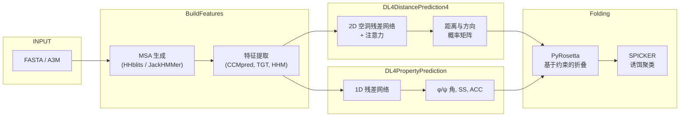

---
slug:1-overview
blog_type:normal
---


**RaptorX-3DModeling**是一个深度学习系统，它利用深度卷积残差网络预测蛋白质接触、距离、方向及局部结构属性（二级结构、φ/ψ角），随后基于这些预测结果组装3D结构模型。该系统由芝加哥大学Jinbo Xu实验室开发，为公开的RaptorX Web服务器提供支持，并代表了一种里程碑式的方法：以**基于距离的折叠**——而非基于接触的折叠——驱动从头蛋白质结构预测。该系统基于**GPLv3**许可协议，主要在CentOS Linux上测试，运行环境为Python 2.7及GPU加速的Theano。

来源: [README.md](/README.md#L1-L50), [LICENSE](/LICENSE#L1-L30)

## RaptorX 的功能

从核心上看，RaptorX解决了计算生物学中的一个基本问题：仅给定蛋白质的氨基酸序列，预测其三维结构。它通过一个**四阶段流水线**来实现这一目标，将一维序列转化为完全折叠的3D模型：

1. **MSA 与特征生成** — 搜索序列数据库（HHblits、JackHMMer、宏基因组）以构建多序列比对，并提取进化耦合特征
2. **距离与方向预测** — 将特征输入带有注意力机制的2D空洞残差网络，预测残基间距离概率分布和方向角
3. **属性预测** — 运行独立的1D残差网络来预测局部结构：φ/ψ角、二级结构（SS3/SS8）和溶剂可及性（ACC）
4. **3D模型折叠** — 在PyRosetta中将预测的距离、方向和φ/ψ角作为约束条件，对诱饵结构进行折叠和弛豫，然后通过SPICKER对它们进行聚类

来源: [README.md](/README.md#L15-L30), [Server/RaptorXFolder.sh](/Server/RaptorXFolder.sh#L73-L155)

## 架构一览

下图展示了数据如何流经RaptorX的四个主要模块，从原始FASTA序列到最终的3D模型：



来源: [Server/RaptorXFolder.sh](/Server/RaptorXFolder.sh#L127-L175), [raptorx-path.sh](/raptorx-path.sh#L1-L8)

## 项目结构

该仓库由四个主要模块及若干支撑目录组织而成：

| 目录 | 作用 | 核心技术 |
|---|---|---|
| **`BuildFeatures/`** | MSA 生成与特征提取 | HHblits, JackHMMer, CCMpred, EVcouplings |
| **`DL4DistancePrediction4/`** | 距离/方向/接触预测 | Theano, 2D 空洞残差网络, Attention |
| **`DL4PropertyPrediction/`** | 局部属性预测 (φ/ψ, SS, ACC) | Theano, 1D 残差网络 |
| **`Folding/`** | 基于预测结果构建 3D 模型 | PyRosetta, SPICKER, RosettaCM |
| **`Common/`** | 共享工具 (PDB, 距离矩阵, 序列) | Python, Biopython |
| **`Alignment/`** | 比对评分与质量评估 | Python |
| **`Utils/`** | 模板生成，模型评估 | HHpred, Modeller |
| **`Server/`** | 顶层编排脚本 | Bash |
| **`params/`** | GPU 机器配置 | 文本配置 |

来源: [README.md](/README.md#L15-L30), [raptorx-path.sh](/raptorx-path.sh#L1-L8)

## 预测入口点

所有四个阶段均由单个Shell脚本——**`Server/RaptorXFolder.sh`**——进行编排，该脚本按顺序将各模块串联起来：

```bash
# 阶段 1: MSA + 特征
$DistFeatureHome/BuildFeatures.sh -o $outDir -g $GPU -m $MSAmethod -r 4 $inFile

# 阶段 2: 属性预测 (φ/ψ, SS, ACC)
$DL4PropertyPredHome/Scripts/PredictProperty4Server.sh -g $GPU $target $outDir/${target}_OUT/

# 阶段 3: 距离与方向预测
$DL4DistancePredHome/Scripts/PredictPairRelation4Server.sh $options $target $outDir/${target}_OUT/

# 阶段 4: 折叠 (若 numDecoys > 0)
$DistanceFoldingHome/LocalFoldNRelaxOneTarget.sh -t $machineType -d $decoyFolder -n $numDecoys -r $runningMode $seqFile $predMatrixFile $predPropertyFile
```

每个阶段在继续执行前都会验证其输出：如果任何阶段失败，脚本将以错误状态退出。`-n 0`标志将完全跳过折叠步骤，允许你仅运行预测阶段。

来源: [Server/RaptorXFolder.sh](/Server/RaptorXFolder.sh#L127-L195)

## 深度学习模型

RaptorX附带**13个预训练模型文件**（由于每个文件大小在100-200 MB之间，需单独从Zenodo下载）：

- **6个模型**用于距离/方向预测，位于`DL4DistancePrediction4/models/`——这是系统准确率的核心
- **7个模型**用于属性预测 (φ/ψ, SS, ACC)，位于`DL4PropertyPrediction/models/`

网络架构使用Theano实现，具体包括：

| 网络 | 维度 | 文件 | 用途 |
|---|---|---|---|
| **ResNet2D** | 2D | `ResNet4Distance.py` | 用于距离预测的标准残差网络 |
| **DilatedResNet2D** | 2D | `DilatedResNet4Distance.py` | 空洞卷积 + 注意力机制，用于扩大感受野 |
| **ResNet1D** | 1D | `ResNet4Property.py` | 用于逐残基属性预测的残差网络 |

**DilatedResNet2D**变体是推荐架构——其空洞卷积能够在不增加参数量比例的情况下捕获长程相互作用，且集成的`AttentionLayer`提供了跨接触图的全局上下文聚合。

<CgxTip>`DilatedResNet2D`架构是生产预测的默认配置。其`AttentionLayer`（位于`DL4DistancePrediction4/AttentionLayer.py`）会计算跨通道的平均池化和最大池化，这对于捕获仅靠局部卷积无法获取的全局结构信号至关重要。</CgxTip>

来源: [DL4DistancePrediction4/config.py](/DL4DistancePrediction4/config.py#L17-L19), [DL4DistancePrediction4/DilatedResNet4Distance.py](/DL4DistancePrediction4/DilatedResNet4Distance.py#L1-L15), [DL4PropertyPrediction/config.py](/DL4PropertyPrediction/config.py#L7-L9), [README.md](/README.md#L100-L115)

## 输出结构

当RaptorX处理某种蛋白质（例如`1pazA`）时，会创建一个`<target>_OUT/`目录，包含所有中间和最终结果：

| 子目录 | 内容 |
|---|---|
| `<target>_contact/` | 用于距离/方向预测的 MSA 和输入特征 |
| `<target>_thread/` | 用于 φ/ψ 预测和穿线的文件 (`.a3m`, `.hhm`, `.tgt`) |
| `DistancePred/` | 预测的距离/方向矩阵 (`.pkl`)，接触图 (`.txt`)，CASP 格式 (`.rr`)，可视化 (`.png`) |
| `PropertyPred/` | 预测的 φ/ψ 角，二级结构，可及性 (`.pkl`) |
| `<target>-RelaxResults/` | 所有生成的诱饵 PDB 文件（折叠 + 弛豫） |
| `<target>-SpickerResults/` | 聚类后的顶级模型，质量评分，RMSD 矩阵 |

来源: [README.md](/README.md#L135-L160), [Folding/0README](/Folding/0README#L1-L20)

## 环境与依赖

RaptorX的环境通过两个Shell脚本进行配置，它们设置了所有必需的路径：

- **`raptorx-path.sh`** — 映射相对于`ModelingHome`的四个模块目录（`DistFeatureHome`、`DL4DistancePredHome`、`DL4PropertyPredHome`、`DistanceFoldingHome`），并更新`PYTHONPATH`
- **`raptorx-external.sh`** — 配置外部工具和数据库的路径（HHblits二进制文件、UniRef30数据库、宏基因组数据、JackHMMer数据库、用于模板建模的PDB70）

<CgxTip>在任何运行之前，你必须编辑`raptorx-external.sh`以指向你本地安装的HHblits和序列数据库。`RaptorXFolder.sh`脚本会自动加载这两个路径文件，因此终端用户只需确保设置了`CUDA_ROOT`且`raptorx-external.sh`配置正确即可。</CgxTip>

来源: [raptorx-path.sh](/raptorx-path.sh#L1-L8), [raptorx-external.sh](/raptorx-external.sh#L1-L24)

## 核心功能概览

| 功能 | 描述 | 模块 |
|---|---|---|
| **MSA 生成** | HHblits 3.x, JackHMMer, 宏基因组搜索，或用户提供的 A3M | `BuildFeatures` |
| **距离预测** | 残基间 Cβ-Cβ, Cα-Cα 距离概率分布 | `DL4DistancePrediction4` |
| **方向预测** | 残基间二面角/角度方向 (例如, Cα1Cβ1Cβ2Cα2) | `DL4DistancePrediction4` |
| **接触预测** | 由距离概率推导的二元接触图 | `DL4DistancePrediction4` |
| **属性预测** | φ/ψ 角 (von Mises 分布), SS3/SS8, ACC | `DL4PropertyPrediction` |
| **3D 折叠** | 使用距离和角度势能进行基于 PyRosetta 约束的折叠 | `Folding` |
| **模型弛豫** | Rosetta 弛豫，以消除空间位阻并优化侧链 | `Folding` |
| **诱饵聚类** | 基于 SPICKER 的聚类，以选择代表性模型 | `Folding` |
| **分布式执行** | 在 GPU 机器上运行预测，在远程 CPU 集群上进行折叠 | `Server` |
| **比对评估** | 模板比对的质量评分与简化 | `Alignment` |

来源: [Server/RaptorXFolder.sh](/Server/RaptorXFolder.sh#L55-L100), [DL4DistancePrediction4/config.py](/DL4DistancePrediction4/config.py#L56-L80), [DL4PropertyPrediction/config.py](/DL4PropertyPrediction/config.py#L12-L20)

## 后续阅读

既然你已经了解了RaptorX是什么以及它的模块是如何关联的，以下是文档的推荐阅读路径：

1. **[快速开始](2-quick-start)** — 通过单条命令端到端地运行你的首次预测
2. **[环境配置](3-environment-setup)** — 安装所有依赖并配置`raptorx-external.sh`
3. **[架构概览](4-architecture-overview)** — 深入了解模块边界和数据契约
4. **[预测流水线数据流](5-prediction-pipeline-data-flow)** — 追踪流水线中流转的每种文件格式和中间产物