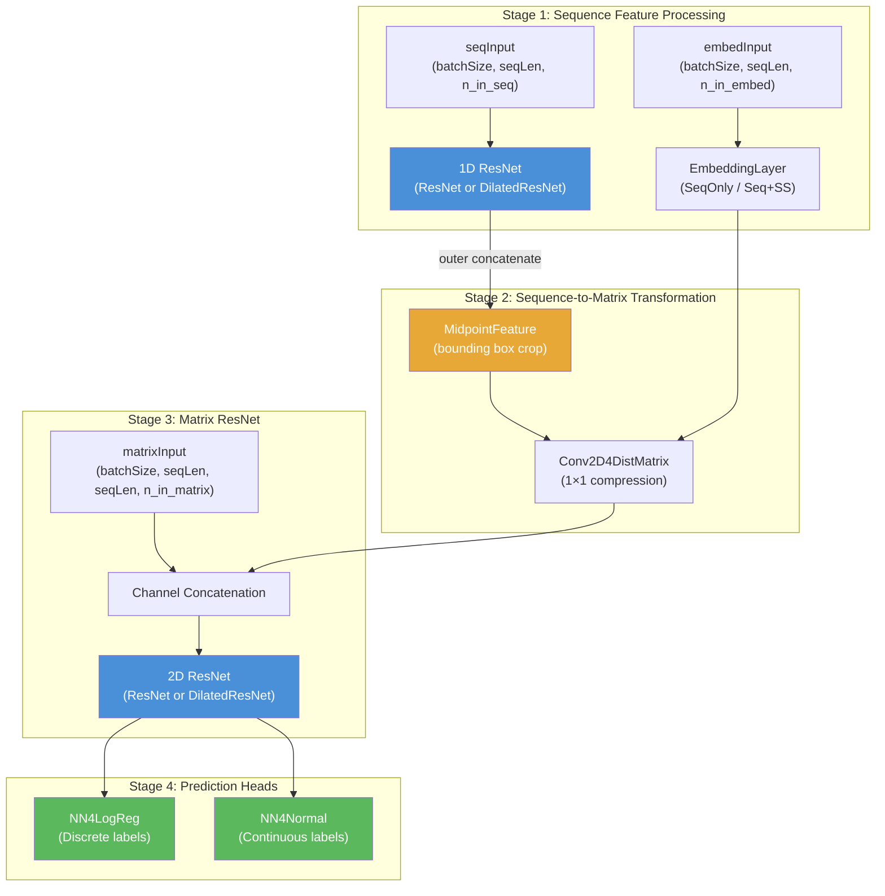

---
slug:10-resnet-for-distance-prediction
blog_type:normal
---


用于距离预测的 ResNet 是 RaptorX-3DModeling 残基间距离预测流程的架构骨干。该网络基于 Theano 构建，并针对二维接触图形状的张量从第一性原理出发进行设计，实现了一个**双路径 ResNet** —— 1D ResNet 处理序列特征（PSSM、二级结构、溶剂可及性），2D ResNet 处理成对特征（共进化矩阵、互信息）—— 通过外部拼接变换将逐残基表示转换为残基对表示，从而将两条路径桥接起来。该设计通过右下对齐填充及二值掩码传播来优先处理变长蛋白质，这一关键工程决策使其有别于通用的计算机视觉 ResNet。

来源: [ResNet4Distance.py](DL4DistancePrediction4/ResNet4Distance.py#L1-L1008), [Model4DistancePrediction.py](DL4DistancePrediction4/Model4DistancePrediction.py#L1-L931)

## 架构概述

完整模型 `ResNet4DistMatrix` 由四个阶段组合而成：**1D 序列 ResNet → 序列到矩阵变换 → 2D 矩阵 ResNet → 逐响应预测头**。每个阶段均可通过 `modelSpecs` 字典独立配置，使得同一代码库能够实例化从简单的纯 2D ResNet 到带有嵌入层和多个距离/方向输出的完整序列-成对流程等各种架构。



来源: [Model4DistancePrediction.py](DL4DistancePrediction4/Model4DistancePrediction.py#L219-L399), [Model4DistancePrediction.py](DL4DistancePrediction4/Model4DistancePrediction.py#L766-L825)

## 核心卷积层

ResNet 的基础由两个自定义卷积实现构成，用于处理带掩码的变长输入——这是蛋白质结构预测中独有的需求，因为同一批次内的序列长度各不相同。

### ResConv1DLayer — 掩码一维卷积

`ResConv1DLayer` 对形状为 `(batchSize, n_in, seqLen)` 的 3D 张量进行操作。它通过重塑为 4D 张量并委派给 Theano 的 `conv2d`（设置 `border_mode='half'` 即 same 填充）来实现窗口化的一维卷积。卷积操作之后，若存在掩码，则将填充位置置零，以防止噪声从填充区域传播。

权重初始化遵循 ReLU 激活函数的 **He 初始化**方案（`scale = √(2 / fan_in)`）以及其他激活函数的 **Xavier/Glorot 初始化**方案，在构建时根据激活函数进行选择。

来源: [ResNet4Distance.py](DL4DistancePrediction4/ResNet4Distance.py#L6-L71)

### ResConv2DLayer — 掩码二维卷积

`ResConv2DLayer` 对形状为 `(batchSize, n_in, nRows, nCols)` 的 4D 张量进行操作，使用大小为 `(2 × halfWinSize + 1)²` 的方形卷积核。掩码的形状为 `(batchSize, #rows_to_be_masked, nCols)`，并在**水平和垂直两个方向**上应用——先掩码填充行，再掩码填充列——确保左上三角填充区域完全置零。这种双向掩码是必不可少的，因为距离矩阵是对称的，而填充在左上角呈现为 L 形区域。

来源: [ResNet4Distance.py](DL4DistancePrediction4/ResNet4Distance.py#L74-L146)

### 带掩码的批归一化

`batch_norm` 函数在计算均值和标准差时**排除填充位置**。对于 4D 输入，有效元素数量的计算方式为：

```
x_num = mask.sum() * 2 + batch_size * (nRows - mask_rows) * (nCols - mask_rows) - mask[:, :mask_rows, :mask_rows].sum()
```

减法项调整了水平掩码和垂直掩码重叠区域的双重计算。通过 Theano 的 `batch_normalization`（在 `low_mem` 模式下）进行归一化后，重新应用掩码将填充位置重置为零。该函数同时返回归一化后的输出和可学习的 `[gamma, bias]` 参数。

来源: [ResNet4Distance.py](DL4DistancePrediction4/ResNet4Distance.py#L148-L235)

## 残差块变体

系统实现了四种残差块变体，每种在批归一化放置位置与参数效率之间提供不同的权衡。所有残差块均通过基于 `input.ndim` 动态选择 `ResConv1DLayer` 或 `ResConv2DLayer`，同时支持 1D（3D 张量）和 2D（4D 张量）输入。

| 变体 | 卷积层 | 批归一化层 | 批归一化放置位置 | 预激活 | 关键特征 |
|---------|-------------|------------------|--------------|----------------|--------------------|
| **ResBlockV1** | 2 | 0 或 2 | 卷积后 | 否 | 原始 ResNet 风格；每次卷积后进行批归一化 |
| **ResBlockV2** | 2 | 0 或 1 | 块中间 | 是 | 预激活；两次卷积间单个批归一化 |
| **ResBlockV22** | 2 | 0 或 2 | 卷积前 | 是 | 每个块两个批归一化层；精度最佳 |
| **ResBlockV23** | 2 | 0 或 1 | 块中间 | 是 | 优化的 V2；移除未使用的批归一化参数 |

### BottleneckBlock

一种三卷积瓶颈设计：`1×1 → k×k → 1×1`，其中瓶颈维度 `n_bottleneck` 默认为 `n_in / 2`。当通道维度较大时，这可以减少参数量。第一个 1×1 卷积降维通道，中间卷积执行空间特征提取，最后一个 1×1 卷积恢复通道。

来源: [ResNet4Distance.py](DL4DistancePrediction4/ResNet4Distance.py#L342-L441), [ResNet4Distance.py](DL4DistancePrediction4/ResNet4Distance.py#L442-L536), [ResNet4Distance.py](DL4DistancePrediction4/ResNet4Distance.py#L537-L631), [ResNet4Distance.py](DL4DistancePrediction4/ResNet4Distance.py#L632-L726), [ResNet4Distance.py](DL4DistancePrediction4/ResNet4Distance.py#L727-L817)

### 维度增加方法

所有残差块均支持三种策略来处理堆栈间通道维度的变化：

- **`partial_projection`**（默认）：当 `n_out > n_in` 时，1×1 线性卷积将 `n_in → (n_out - n_in)` 通道映射，然后沿通道轴将输入与此投影拼接，并加到卷积路径输出上。当 `n_out == n_in` 时，使用简单的恒等跳跃连接：`output = conv_path + input`。
- **`full_projection`**：1×1 线性卷积直接将 `n_in → n_out` 通道映射，并将结果加到卷积路径上。这等价于标准的 ResNet 投影快捷方式。
- **`identity`**：对输入通道进行零填充以匹配 `n_out`。目前会引发错误，因为实际中仅支持投影。

来源: [ResNet4Distance.py](DL4DistancePrediction4/ResNet4Distance.py#L391-L424), [ResNet4Distance.py](DL4DistancePrediction4/ResNet4Distance.py#L494-L523)

## ResNet — 完整网络

`ResNet` 类将残差块组装成由两个并行列表控制的**堆叠架构**：`n_hiddens`（每个堆栈的通道维度）和 `n_repeats`（每个堆栈的块重复次数）。总深度为 `1 + Σ n_repeats[i]` 个块加上一个起始层。

```mermaid
flowchart LR
    INPUT["Input<br/>(n_in channels)"] --> START["Start Conv<br/>(n_in → n_hiddens[0])"]
    START --> S1B1["ResBlock × n_repeats[0]<br/>(n_hiddens[0] ch)"]
    S1B1 --> S2DIM["ResBlock (dim increase)<br/>(n_hiddens[0] → n_hiddens[1])"]
    S2DIM --> S2B1["ResBlock × n_repeats[1]<br/>(n_hiddens[1] ch)"]
    S2B1 --> S3DIM["ResBlock (dim increase)<br/>(n_hiddens[1] → n_hiddens[2])"]
    S3DIM --> S3B1["ResBlock × n_repeats[2]<br/>(n_hiddens[2] ch)"]
    S3B1 --> OUT["Output<br/>(n_hiddens[-1] ch)"]

    style START fill:#e8a838,color:#fff
    style S1B1 fill:#4a90d9,color:#fff
    style S2DIM fill:#d9534f,color:#fff
    style S2B1 fill:#4a90d9,color:#fff
    style S3DIM fill:#d9534f,color:#fff
    style S3B1 fill:#4a90d9,color:#fff
```



残差块变体由 `version` 参数选择：`ResNet2D` 和 `ResNet2DV21` 使用 `ResBlockV2`，`ResNet2DV22` 使用 `ResBlockV22`，**`ResNet2DV23`**（推荐）使用 `ResBlockV23`。输入张量经历维度重排，从 `(batchSize, seqLen, n_in)` 或 `(batchSize, nRows, nCols, n_in)` 转换为 Theano 的 conv2d 所需的卷积优先格式 `(batchSize, n_in, ...)`，输出时再重排回特征在最后的约定。

<CgxTip>配置 ResNet 时，`n_hiddens` 必须是一个**递增序列**，且长度必须与 `n_repeats` 相同。每个堆栈的第一个块（堆栈 0 除外）通过 `partial_projection` 执行维度增加，而后续的块由于输入和输出通道匹配，使用恒等快捷方式。</CgxTip>

来源: [ResNet4Distance.py](DL4DistancePrediction4/ResNet4Distance.py#L819-L908)

## ResNet4DistMatrix — 预测模型

`ResNet4DistMatrix` 是协调完整预测流程的顶层模型类。其构造函数接收五个输入张量和一个配置字典：

| 参数 | 形状 | 描述 |
|-----------|-------|-------------|
| `seqInput` | `(B, L, n_in_seq)` | 序列特征：PSSM、预测的二级结构、溶剂可及性 |
| `matrixInput` | `(B, L, L, n_in_matrix)` | 成对特征：CCM、MI、协方差、接触势 |
| `mask_seq` | `(B, #masked_cols)` | 填充序列位置的二值掩码 |
| `mask_matrix` | `(B, #masked_rows, L)` | 填充矩阵行的二值掩码 |
| `embedInput` | `(B, L, n_in_embed)` | 嵌入输入：一级序列 ± 预测的二级结构 |
| `boundingbox` | `(4,)` | 大蛋白质的裁剪框 `[top, left, bottom, right]` |

### 阶段 1：序列卷积

1D ResNet（或当网络名称以 `DilatedResNet` 开头时的 DilatedResNet）通过 `conv1d_hiddens` 通道及每个堆栈 `conv1d_repeats` 次重复来处理 `seqInput`。半窗口大小为标准 ResNet 的 `halfWinSize_seq`，或 DilatedResNet 的重复列表。

### 阶段 2：序列到矩阵变换

此阶段将 1D 逐残基特征转换为 2D 残基对特征。支持两种模式：

- **`OuterCat`**：1D ResNet 的输出经过 `MidpointFeature`（执行外部拼接：对于位置 i 和 j，拼接 features[i] 和 features[j]），然后经过带有 `halfWinSize=0`（1×1 卷积）的 `Conv2D4DistMatrix` 以压缩翻倍的通道维度。当指定边界框时，将中间特征裁剪为子矩阵，以便在长蛋白质训练时节省内存。
- **`SeqOnly` / `Seq+SS`**：`EmbeddingLayer4AllRange` 直接将原始序列（及可选的二级结构）映射为成对矩阵表示。

所有激活的 seq-to-matrix 模式的输出与 `matrixInput` 进行**通道拼接**，形成组合的 2D 输入。

### 阶段 3：矩阵 ResNet

组合的 2D 张量进入带有 `conv2d_hiddens` 通道和 `conv2d_repeats` 次重复的 2D ResNet（或 DilatedResNet）。这是网络中最深的部分，也是残基间距离模式的主要特征提取器。

### 阶段 4：多响应预测头

对于 `modelSpecs['responses']` 中的每个响应，附加一个预测头：

- **离散标签**（例如，离散化距离区间、方向区间）：`NN4LogReg` —— 一个逻辑回归头，输出标签空间上的概率分布。
- **连续标签**（例如，服从正态/对数正态分布的距离）：`NN4Normal` —— 输出均值和方差参数，其中方差特定参数被单独跟踪以用于潜在的微分正则化。

所有预测头的输出沿通道轴拼接，以生成最终的 `output`（预测值）和 `output_prob`（预测的概率分布）。

来源: [Model4DistancePrediction.py](DL4DistancePrediction4/Model4DistancePrediction.py#L219-L399)

## 损失与误差计算

`ResNet4DistMatrix` 的 `loss` 方法会分派至每个预测器的损失函数，支持通过 `weightList` 进行逐样本加权。对于离散响应，通常为加权交叉熵；对于正态/对数正态响应，则为负对数似然。`trainByRefLoss` 标志允许翻转损失符号以进行参考状态训练。

`errors` 方法计算分类错误率。对于细粒度距离离散化（12C、25C、52C），它在内部使用从 `config.ContactDefinition` 和 `config.InteractionLimit` 派生的距离区间边界将其折叠为 3 类方案（接触 / 中程 / 长程），使该指标更具可解释性。

`TopAccuracyByRange` 方法分别评估**长程**（|i−j| ≥ 24）、**中程**（12 ≤ |i−j| < 24）和**短程**（6 ≤ |i−j| < 12）接触的 top-L/k 预测精度——这是 CASP 竞赛中的标准评估协议。

来源: [Model4DistancePrediction.py](DL4DistancePrediction4/Model4DistancePrediction.py#L409-L516), [Model4DistancePrediction.py](DL4DistancePrediction4/Model4DistancePrediction.py#L597-L764)

## 网络变体与配置

`config.py` 模块定义了有效网络架构的全集及其选择逻辑：

| 网络名称 | 块类型 | 关键差异 |
|--------------|------------|----------------|
| `ResNet2D` | `ResBlockV2` | 原始版本；每个块单个批归一化，预激活 |
| `ResNet2DV21` | `ResBlockV2` | 与 ResNet2D 相同（向后兼容） |
| `ResNet2DV22` | `ResBlockV22` | 每个块两个批归一化层；经验上更优 |
| **`ResNet2DV23`** | **`ResBlockV23`** | **推荐**；移除未使用批归一化参数的优化 V2 |
| `DilatedResNet2D` | `DilatedResNet` | 膨胀卷积，用于扩大感受野 |

<CgxTip>`ResNet2DV23` 是推荐的变体。它产生与 `ResNet2DV21` 相同的计算图，但存储的参数更少，从而在不影响推理结果的情况下减少了模型序列化时的内存占用。</CgxTip>

响应系统支持多种原子对距离类型（`CbCb`、`CaCa`、`CgCg`、`CaCg`、`NO`）、氢键（`HB`）、β 配对（`Beta`）以及残基间取向角（`Ca1Cb1Cb2Ca2`、`N1Ca1Cb1Cb2`、`Ca1Cb1Cb2`）。每个响应由其专属的预测头独立预测，允许单次前向传播同时生成距离概率、方向概率和氢键预测。

来源: [config.py](DL4DistancePrediction4/config.py#L12-L19), [config.py](DL4DistancePrediction4/config.py#L178-L200)

## BuildModel — 模型构建入口点

`BuildModel(modelSpecs, forTrain)` 是实例化完整计算图的工厂函数。它声明所有符号 Theano 变量——`x`（序列特征）、`y`（成对特征）、`xmask`、`ymask`、`xem`（嵌入输入）、`boundingbox`——构建 `ResNet4DistMatrix`，并返回训练包（模型 + 输入 + 标签 + 权重 + 边界框 + 参考损失标志）或预测包（仅模型 + 输入）。

标签张量类型根据响应配置选择：离散标签使用 `wtensor3`/`wtensor4`（16 位整型以节省内存），连续标签使用 `tensor3`/`tensor4`。当在 `modelSpecs` 中启用 `UseSampleWeight` 时，有条件地创建样本权重张量。

来源: [Model4DistancePrediction.py](DL4DistancePrediction4/Model4DistancePrediction.py#L766-L825)

## 掩码系统 — 处理变长蛋白质

掩码系统是此 ResNet 实现中独具特色的工程特性。由于蛋白质长度不同，但小批量需要统一的张量形状，较短的序列会被**右填充**（对于 1D）或**右下填充**（对于 2D）以匹配批次中最长的序列。

掩码是一个二值张量，其中 `0` 表示填充位置，`1` 表示真实数据位置。掩码在每一层中传播：

1. **卷积层**：卷积后，填充位置通过与掩码的逐元素乘法置零。对于 2D 卷积，这在水平和垂直方向上独立应用。
2. **批归一化**：统计量（均值、方差）仅在真实位置上计算，防止填充零偏移归一化。
3. **残差块**：掩码被传递至所有子层，确保整个网络中一致的噪声抑制。

这种方法在计算上比动态展开更廉价，并维持了完整的 Theano 计算图兼容性，代价是在填充位置上存在少量的无效计算。

来源: [ResNet4Distance.py](DL4DistancePrediction4/ResNet4Distance.py#L53-L62), [ResNet4Distance.py](DL4DistancePrediction4/ResNet4Distance.py#L123-L139), [ResNet4Distance.py](DL4DistancePrediction4/ResNet4Distance.py#L148-L207)

## 权重初始化策略

初始化方案根据激活函数进行调整，遵循已有的理论成果：

| 激活函数 | 分布 | 缩放公式 |
|------------|-------------|---------------|
| ReLU | 高斯分布 | `√(2 / (n_in × kernel_size + n_out))` |
| tanh / 其他 | 均匀分布 | `√(6 / (n_in × kernel_size + n_out))` |
| sigmoid | 均匀分布 × 4 | `4 × √(6 / (n_in × kernel_size + n_out))` |

对于 1D 卷积，`kernel_size = windowSize`；对于 2D 卷积，`kernel_size = wSize²`。偏置在所有情况下均初始化为零。ReLU 的 He 初始化考虑了 ReLU 使一半激活值置零的事实，因此需要 √2 的方差补偿。

来源: [ResNet4Distance.py](DL4DistancePrediction4/ResNet4Distance.py#L28-L36), [ResNet4Distance.py](DL4DistancePrediction4/ResNet4Distance.py#L100-L108)

## 相关页面

- 此 ResNet 的膨胀卷积扩展记录在 [Dilated ResNet and Attention](11-dilated-resnet-and-attention) 中，它在不增加参数量的情况下扩大了感受野。
- 有关控制这些架构的完整可调参数集，请参见 [Model Configuration Reference](12-model-configuration-reference)。
- 为 `seqInput` 和 `matrixInput` 提供输入的上游特征生成涵盖在 [MSA and Feature Generation](6-msa-and-feature-generation) 中。
- 预测距离矩阵的下游消费者记录在 [3D Model Folding](9-3d-model-folding) 中。