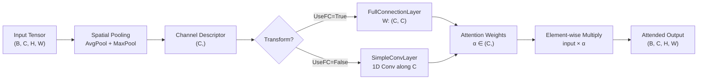
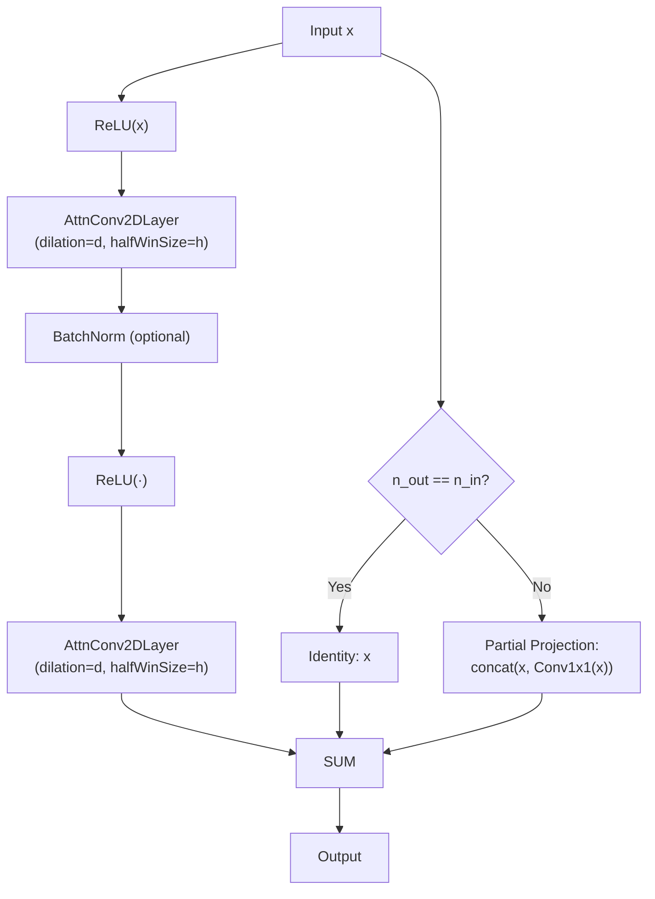
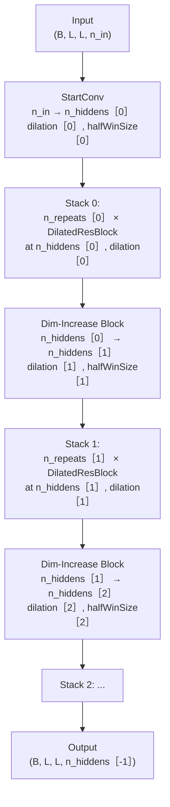

---
slug:11-dilated-resnet-and-attention
blog_type:normal
---


RaptorX-3D 的距离预测精度取决于其在标准 ResNet 骨干网络之上叠加的两项协同架构创新：**空洞卷积**（在无参数爆炸的前提下指数级扩展感受野）和**通道注意力机制**（压缩-激励风格，动态重加权特征通道）。这些机制共同作用，使网络能够捕捉接触图上的长程残基间耦合，以及每个空间位置上最具信息量的特征通道——这两者对于从共进化输入中预测准确的距离分布至关重要。

## 架构背景：从 ResNet 到空洞 ResNet

标准的 `ResNet4Distance` 模块提供了基线 2D 残差网络：`ResConv2DLayer` 应用带有 `border_mode='half'`（same-padding）的普通卷积，而 `ResBlockV2`/`ResBlockV23` 在每个残差块中堆叠两个此类卷积，并可选地使用批归一化。其关键局限在于，每个卷积均使用 `dilation=1`，这意味着有效感受野仅随深度线性增长——对于长度为 *L* 的接触图，若要捕捉序列距离相差甚远的残基 *i* 和 *j* 之间的相关性，需要极深的网络或极大的卷积核，而这两种方案的计算成本都极其高昂。

`DilatedResNet4Distance` 扩展了这一基础架构，在每个卷积层中引入了 `dilation` 参数，并引入了将卷积与通道注意力融合的 `AttnConv2DLayer`。膨胀参数通过 `filter_dilation=(dilation, dilation)` 传递给 Theano 的 `T.nnet.conv2d`，该函数按膨胀因子间隔排布滤波器权重——空间大小为 *k*、膨胀率为 *d* 的卷积核，其有效感受野为 *d·(k−1)+1*，从而实现了跨层感受野的指数级增长。

来源：[ResNet4Distance.py](DL4DistancePrediction4/ResNet4Distance.py#L74-L145), [DilatedResNet4Distance.py](DL4DistancePrediction4/DilatedResNet4Distance.py#L1-L78)

## 空洞卷积层

### ResConv1DLayer — 空洞 1D 卷积

`ResConv1DLayer` 作用于形状为 `(batchSize, n_in, seqLen)` 的序列特征张量。它通过 `dimshuffle` 将输入重组为 4D 以兼容 Theano 的 2D 卷积，随后应用空洞滤波器。膨胀分支逻辑如下：

```
if dilation > 1:
    conv_out = T.nnet.conv2d(in4conv2D, self.W, filter_shape=w_shp,
                             border_mode='half', filter_dilation=(1, dilation))
else:
    conv_out = T.nnet.conv2d(in4conv2D, self.W, filter_shape=w_shp,
                             border_mode='half')
```

1D 情况使用 `filter_dilation=(1, dilation)` 的原因在于，滤波器形状为 `(n_out, n_in, 1, windowSize)`——膨胀仅沿序列（列）维度应用。权重初始化对 ReLU 采用 He 初始化（`scale = √(2 / fan_in)`），对其他激活函数采用 Xavier 初始化，其中 `fan_in = n_in × windowSize`。

来源：[DilatedResNet4Distance.py](DL4DistancePrediction4/DilatedResNet4Distance.py#L9-L78)

### ResConv2DLayer — 空洞 2D 卷积

`ResConv2DLayer` 是成对（接触图）的对应模块，作用于 `(batchSize, n_in, nRows, nCols)`。它通过 `filter_dilation=(dilation, dilation)` 应用各向同性膨胀，并使用大小为 `(wSize, wSize)` 的方形卷积核，其中 `wSize = 2 × halfWinSize + 1`。此处同样适用上述膨胀分支逻辑。在卷积和激活之后，**双向掩码** 会将沿水平和垂直轴的填充伪影置零——这至关重要，因为同一批次中的蛋白质长度各异，且在填充张量中呈右下对齐。

来源：[DilatedResNet4Distance.py](DL4DistancePrediction4/DilatedResNet4Distance.py#L81-L157)

### 感受野数学原理

下表展示了在 `halfWinSize=1`（3×3 卷积核）的 4 块 DilatedResNet 中，膨胀堆叠如何叠加感受野：

| 块索引 | 膨胀率 | 卷积核大小 | 每块有效感受野 | 累积感受野 (近似) |
|:-----------:|:--------:|:-----------:|:----------------------:|:-----------------------:|
| 0           | 1        | 3×3         | 3                      | 3                       |
| 1           | 2        | 3×3         | 5                      | 7                       |
| 2           | 4        | 3×3         | 7                      | 11                      |
| 3           | 8        | 3×3         | 11                     | 19                      |

在膨胀率为 `[1, 2, 4, 8]` 的情况下，4 个块仅使用 3×3 卷积核和 8 个卷积层即可实现约 19 的感受野——而 `dilation=1` 的标准 ResNet 需要约 9 层 3×3 卷积才能达到相同的覆盖范围，且每层增加的参数量远大于基于膨胀的方案。

<CgxTip>配置膨胀调度时，请使用 2 的幂次（1, 2, 4, 8, …）以确保全覆盖且无网格伪影——非 2 的幂次调度可能会在感受野中留下未被采样任何输入像素的“空洞”。</CgxTip>

来源：[DilatedResNet4Distance.py](DL4DistancePrediction4/DilatedResNet4Distance.py#L1026-L1094)

## 通道注意力机制

### 架构概述

`AttentionLayer` 实现了 **压缩-激励**（SE）风格的通道注意力。与计算成对空间亲和力（O(L²) 成本）的自注意力机制不同，该机制通过池化空间维度生成逐通道描述符，随后通过紧凑变换学习通道间依赖关系，从而在 O(L) 复杂度下运行。其流程如下：



注意力权重 `α` 是一个逐通道向量，与完整空间张量进行广播相乘：`output = input × α`，其中 `α` 通过 `dimshuffle` 进行维度重组以对齐输入的维度。这意味着接触图中的每个空间位置 均接收相同的通道重加权——注意力回答的是“哪些特征通道全局重要？”，而非“哪些位置关注了哪些位置？”。

来源：[AttentionLayer.py](DL4DistancePrediction4/AttentionLayer.py#L182-L222)

### 池化策略：AvgPool 和 MaxPool

两种互补的池化操作将空间维度降维为通道描述符：

- **`AvgPool`** 计算每个通道的均值，**排除被掩码（零填充）的位置**。对于 4D 输入，它计算 `x_sum / x_num`，其中 `x_num` 通过 `mask.sum() * 2 + batchSize × (H - mask_H) × (W - mask_W) - overlap_correction` 计算有效（非掩码）区域。重叠校正会减去水平和垂直掩码区域中被重复计算的交集部分。

- **`MaxPool`** 计算每个实例、每个通道的最大值（跨空间维度），然后在批次内求平均：`x.max(axis=[2,3]).mean(axis=[0])`。这捕捉了每个通道中激活最强烈的空间位置。

当两者同时启用（`UseAvg=True, UseMax=True`）时，`FullConnectionLayer2` 通过**同一个**权重矩阵 `W` 分别变换每种池化结果，然后取平均：`output = (σ(avg·W) + σ(max·W)) / 2`。在两条路径之间共享权重，使得参数量保持可控，同时允许网络从分布（平均）和峰值（最大）统计信息中共同学习。

来源：[AttentionLayer.py](DL4DistancePrediction4/AttentionLayer.py#L8-L111)

### 变换路径：FullConnection 与 SimpleConv

存在两种变换选项用于从通道描述符计算注意力权重：

| 属性 | `FullConnectionLayer` / `FullConnectionLayer2` | `SimpleConvLayer` / `SimpleConvLayer2` |
|:---------|:-----------------------------------------------|:---------------------------------------|
| 权重形状 | `(n_in, n_in)` — 全通道间 | `(1, 1, windowSize, 1)` — 局部 1D 卷积 |
| 参数量 | C² | windowSize |
| 归纳偏置 | 全局通道交互 | 局部通道邻域 |
| 默认激活函数 | Sigmoid | Sigmoid |
| 适用场景 | 完整的通道间建模 | 轻量级，参数高效 |

`FullConnectionLayer` 对池化描述符应用稠密的 `(C, C)` 矩阵，对任意通道间依赖关系进行建模。`SimpleConvLayer` 将通道描述符视为 1D 序列，并应用小型 1D 卷积（默认 `halfWinSize=2`，卷积核大小为 5），仅对局部通道邻域进行建模——参数极少但表达能力较弱。

<CgxTip>默认配置 `UseAvg=True, UseMax=True, UseFC=True` 提供了最强的注意力机制，但每个注意力层会增加 C² 个参数。对于具有大量通道的模型（如 n_hiddens=[64, 128, 256]），请考虑使用 `UseFC=False` 切换至 `SimpleConvLayer`，从而将注意力的参数开销降低数个数量级。</CgxTip>

来源：[AttentionLayer.py](DL4DistancePrediction4/AttentionLayer.py#L63-L178)

## AttnConv2DLayer：融合卷积与注意力

`AttnConv2DLayer` 是关键集成点，膨胀与注意力在此单层内汇聚。其处理流程为：

```
Input → DilatedConv2D → BiasAdd → AttentionLayer → Activation → MaskCorrection → Output
```

这与独立的 `ResConv2DLayer` 流程（`Input → DilatedConv2D → BiasAdd → Activation → MaskCorrection`）不同，它将注意力机制插入在非线性激活**之前**、偏置**之后**。注意力被应用于原始卷积输出（`conv_out + b`），而非激活后的结果——这是刻意为之：对预激活值应用注意力，允许 SE 机制在弱通道通过非线性激活之前对其进行抑制，防止弱通道的伪激活被 ReLU 放大。

参数列表聚合了卷积与注意力的参数：`self.params = [W, b] + attnLayer.params`，L1/L2 正则化项也相应求和。注意力配置目前硬编码为 `UseAvg=True, UseMax=True, UseFC=True`，尽管被注释掉的 `attnOptions` 参数暗示其曾支持逐层配置。

来源：[DilatedResNet4Distance.py](DL4DistancePrediction4/DilatedResNet4Distance.py#L159-L241)

## DilatedResBlock：核心构建块

`DilatedResBlock` 是膨胀架构的基础残差单元。它在预激活残差设计中结合了三种机制：



块级别的**层选择逻辑**决定了是使用 `AttnConv2DLayer` 还是 `ResConv2DLayer`：

```python
if input.ndim == 4:
    attnFlag = config.ParseAttentionMode(modelSpecs)
    if attnFlag is not None:
        ConvLayer = AttnConv2DLayer    # 启用注意力
    else:
        ConvLayer = ResConv2DLayer      # 普通空洞卷积
```

这意味着注意力的启用或禁用是基于 `modelSpecs['Attention']` 键对**所有** 2D 块全局生效的——不存在逐块的注意力开关。`config.py` 中的 `ParseAttentionMode` 函数将注意力字符串格式（如 `"UseAvg+UseMax"` 或 `"UseAvg+UseMax+UseConv"`）解析为三元组 `(UseAvg, UseMax, UseFC)`。

当 `n_out > n_in` 时，**维度增加**策略使用 `partial_projection`：输入与 1×1 卷积投影拼接 `[x, Conv1x1(x)]` 并加到残差路径中，确保恒等快捷路径原封不动地传递原始通道，而新通道则是学习得到的。

来源：[DilatedResNet4Distance.py](DL4DistancePrediction4/DilatedResNet4Distance.py#L913-L1024), [config.py](DL4DistancePrediction4/config.py#L150-L167)

## DilatedResNet：完整网络组装

`DilatedResNet` 通过堆叠 `DilatedResBlock` 实例构建完整网络。其架构遵循**多尺度堆叠**模式：



构造函数强制了若干不变量：`len(n_hiddens) == len(n_repeats) == len(halfWinSize) == len(dilation)`，确保每个堆叠都有对应的隐藏维度、重复次数、卷积核大小和膨胀率。`n_hiddens` 序列必须是**递增的**——每个堆叠在比前一个更高的通道维度上运行，且每个堆叠的第一个块通过 `partial_projection` 执行维度增加。

用于距离预测的典型配置如下所示：

| 参数 | Stack 0 | Stack 1 | Stack 2 | Stack 3 |
|:----------|:--------|:--------|:--------|:--------|
| `n_hiddens` | 64      | 128     | 256     | 512     |
| `n_repeats` | 5       | 5       | 5       | 3       |
| `halfWinSize` | 1    | 1       | 1       | 1       |
| `dilation` | 1       | 2       | 4       | 8       |

这创建了一个网络，其中早期的堆叠以全分辨率处理局部模式，中间的堆叠以加倍的感受野捕捉中程耦合，而后期的堆叠则对长程残基间依赖关系进行建模——所有这些均使用 3×3 卷积核，且膨胀未带来任何参数量的增加。

来源：[DilatedResNet4Distance.py](DL4DistancePrediction4/DilatedResNet4Distance.py#L1026-L1117)

## 对比分析：标准 ResNet 与带注意力的空洞 ResNet

| 方面 | `ResNet4Distance` | `DilatedResNet4Distance` |
|:-------|:------------------|:-------------------------|
| 卷积膨胀 | 固定为 1 | 每堆叠可配置 `[1, 2, 4, 8]` |
| 注意力机制 | 无 | 通过 `AttnConv2DLayer` 实现的 SE 风格通道注意力 |
| 卷积层 (2D) | `ResConv2DLayer` (无膨胀) | `ResConv2DLayer` (带膨胀) 或 `AttnConv2DLayer` |
| 感受野增长 | O(depth × kernelSize) | O(depth × dilation × kernelSize) |
| 块变体 | `BottleneckBlock`, `ResBlockV1/V2/V22/V23` | 仅 `DilatedResBlock` |
| 批归一化 | 每块可选 | 通过 `modelSpecs['batchNorm']` 控制 |
| 维度增加 | `full_projection`, `partial_projection`, `identity` | `full_projection`, `partial_projection` |
| 掩码处理 | 双向（水平 + 垂直） | 双向（逻辑相同） |
| 参数开销 | 基线 | 每注意力层 +C² (FC 模式) 或 +5 (Conv 模式) |
| 网络配置键 | `'ResNet2D'` / `'ResNet2DV2*'` | `'DilatedResNet2D'` |

标准 ResNet 提供了更多的块变体选择（具有 1×1→3×3→1×1 瓶颈结构的 `BottleneckBlock`，采用后激活的 `ResBlockV1`，采用预激活及不同 BN 布局的 `ResBlockV2/V22/V23`），而空洞 ResNet 则整合为单一的 `DilatedResBlock` 设计，优先采用集成了注意力的预激活 V2 风格布局。

来源：[ResNet4Distance.py](DL4DistancePrediction4/ResNet4Distance.py#L342-L535), [DilatedResNet4Distance.py](DL4DistancePrediction4/DilatedResNet4Distance.py#L537-L912), [config.py](DL4DistancePrediction4/config.py#L17-L17)

## 注意力配置参考

注意力模式通过 `modelSpecs['Attention']` 字符串指定，由 `config.ParseAttentionMode` 解析。其格式为以 `+` 分隔的模式标志列表：

| 配置字符串 | UseAvg | UseMax | UseFC | 描述 |
|:---------------------|:------:|:------:|:-----:|:------------|
| (键缺失或为 None) | —      | —      | —     | 禁用注意力；使用 `ResConv2DLayer` |
| `"UseAvg"` | ✓ | ✗ | ✓ | 仅平均池化，全连接变换 |
| `"UseAvg+UseMax"` | ✓ | ✓ | ✓ | 双池化，全连接变换（默认） |
| `"UseAvg+UseMax+UseConv"` | ✓ | ✓ | ✗ | 双池化，轻量级 1D 卷积变换 |
| `"UseAvg+UseConv"` | ✓ | ✗ | ✗ | 仅平均池化，1D 卷积变换 |

当禁用注意力时（键缺失），`DilatedResBlock` 会回退至 `ResConv2DLayer`——网络仍受益于空洞卷积，但缺乏通道重加权机制。膨胀 + 注意力（`AttnConv2DLayer`）的组合代表了全功能配置。

来源：[config.py](DL4DistancePrediction4/config.py#L150-L167), [DilatedResNet4Distance.py](DL4DistancePrediction4/DilatedResNet4Distance.py#L931-L948)

## 带掩码的批归一化

`DilatedResNet4Distance` 和 `ResNet4Distance` 均实现了自定义 `batch_norm` 函数，以正确处理同一批次中长度不一的蛋白质。标准批归一化会在整个填充张量上计算统计量，包含了会使均值和方差被人为拉低的零填充位置。掩码版本的操作如下：

1. 计算所有元素的 `x_sum`，依赖于掩码位置已被置零的前置条件。
2. 根据掩码张量计算 `x_num`（有效元素计数），并针对水平和垂直掩码区域相交的 2D 情况应用重叠校正。
3. 导出 `x_mean = x_sum / x_num` 和 `x_std = √(E[x²] - (E[x])² + ε)`。
4. 使用计算出的统计量应用 Theano 的 `batch_normalization`。
5. 在输出中将掩码位置重新置零（批归一化可能在先前为零的位置产生非零值）。

`BatchNormLayer` 包装器将其暴露为带有可学习 `gamma` 和 `bias` 参数的可组合层，并将这些参数返回以包含在父块的参数列表中。

来源：[DilatedResNet4Distance.py](DL4DistancePrediction4/DilatedResNet4Distance.py#L243-L329)

## 设计理念与变体适用场景

**空洞卷积**解决了接触/距离预测中的一个结构性问题：在序列上相距甚远但在 3D 空间中相邻的残基对，会在接触图的对角线外侧位置产生共进化信号。使用小卷积核的标准卷积需要许多层才能将信息从对角线传播到这些遥远位置。空洞卷积通过扩展采样网格在更少的层中实现了这一点——这对于具有 300+ 个残基的蛋白质至关重要，因为其长程接触可能位于对角线外 200+ 个位置。

**通道注意力**解决了一个特征选择问题：距离网络的输入包含异构通道（共进化得分、序列特征、二级结构、模板信息），其信噪比差异极大。SE 机制学会根据每次输入自适应地抑制噪声通道并放大信息通道，当某些蛋白质存在模板特征而其他蛋白质缺失时，这一点尤为重要。

在以下情况下使用**标准 ResNet**（[用于距离预测的 ResNet](10-resnet-for-distance-prediction)）：训练数据有限（注意力会增加参数）、蛋白质较短（<150 个残基，长程接触有限）或计算预算紧张。在以下情况下使用**带注意力的 DilatedResNet**：针对具有大量长程接触的长蛋白质、使用丰富的多通道输入特征，或在 GPU 显存充足时追求最大预测精度。

有关详细的参数配置，请参见[模型配置参考](12-model-configuration-reference)。有关该网络运行的流水线上下文，请参见[距离与方向预测](7-distance-and-orientation-prediction)。