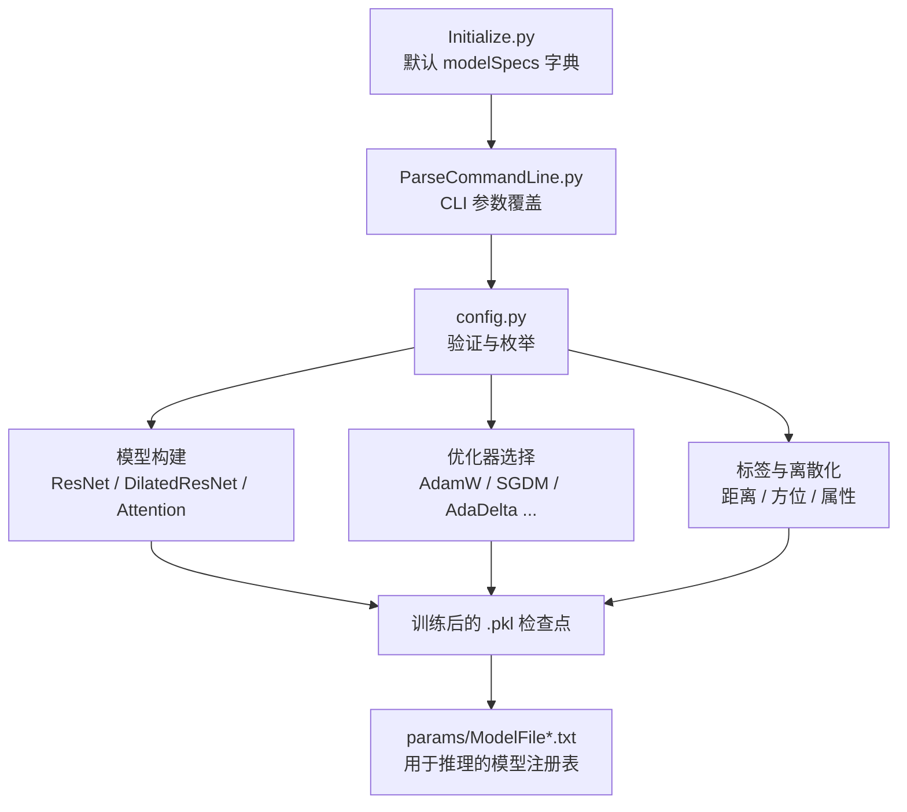

---
slug:12-model-configuration-reference
blog_type:normal
---


本参考文档记录了控制 RaptorX 两个深度学习子系统（**DL4DistancePrediction4**（成对距离/方位预测）和 **DL4PropertyPrediction**（一维单残基属性预测））的所有可配置参数。这两个子系统共享一个通用的架构模式：一个由 `Initialize.py` 初始化的 `modelSpecs` 字典，可通过 `ParseCommandLine.py` 覆盖，并根据 `config.py` 中定义的枚举进行验证。理解这三层配置层级对于自定义网络架构、训练策略和预测目标至关重要。

## 配置架构

配置系统遵循明确的覆盖级联机制——首先在代码中建立默认值，然后通过命令行参数进行选择性替换，最后根据 `config.py` 中的允许值集合进行验证。这种设计确保了任何有效的检查点文件都可以通过重新下发其原始命令行参数来复现。



来源：[Initialize.py](DL4DistancePrediction4/Initialize.py#L1-L134), [ParseCommandLine.py](DL4DistancePrediction4/ParseCommandLine.py#L1-L339), [config.py](DL4DistancePrediction4/config.py#L1-L506)

## 全局参数（两个子系统通用）

以下参数在距离和属性预测流水线中共享，若子系统间的默认值不同则会特别注明。

| 参数 | 距离预测默认值 | 属性预测默认值 | CLI 标志 | 描述 |
|-----------|-----------------|------------------|----------|-------------|
| `network` | `DilatedResNet2D` | `ResNet1D` | `-n` | 网络架构选择器 |
| `algorithm` | `AdamW` | `Adam` | `-a` | 优化算法 |
| `numEpochs` | `[20, 1]` | `[19, 2]` | `-a` | 每个训练阶段的轮数 |
| `lrs` | `[0.0002, 0.00004]` | `[0.0002, 0.00002]` | `-a` | 每个阶段的学习率 |
| `minibatchSize` | `60000` | `200` | `-s` | 每批最小残基对数 |
| `maxbatchSize` | `122500` (350×350) | `1500` | `-s` | 每批最大子矩阵大小 |
| `L2reg` | `0.0001` | `0.0001` | `-g` | L2 正则化因子 |
| `batchNorm` | `True` | `True` | `-k` | 启用批归一化 |
| `UseSampleWeight` | `True` | `True` | `-k` | 对无效残基对的权重置零 |
| `validation_frequency` | `100` | `100` | — | 验证间隔（批次数） |
| `patience` | `5` | `5` | — | 早停容忍度（轮数） |
| `activation` | `RELU` | `relu` (Theano) | `-k` | 激活函数 |

来源：[Initialize.py](DL4DistancePrediction4/Initialize.py#L1-L134), [Initialize.py](DL4PropertyPrediction/Initialize.py#L1-L53)

## 距离预测配置 (DL4DistancePrediction4)

### 网络架构选项

距离预测子系统支持五种 2D 网络架构。推荐且默认的选择是 `DilatedResNet2D`，它通过空洞卷积和可选的注意力层对标准 ResNet 进行了扩展，从而在不引发参数爆炸的情况下扩大了感受野。

| 网络 | 描述 | 每 ResBlock 的 BatchNorm | 支持空洞卷积 | 支持注意力 |
|---------|-------------|----------------------|------------------|-------------------|
| `ResNet2D` | 原始 2D ResNet | 1 | 否 | 否 |
| `ResNet2DV21` | 与 ResNet2D 相同（别名） | 1 | 否 | 否 |
| `ResNet2DV22` | 每个块双 BatchNorm | 2 | 否 | 否 |
| `ResNet2DV23` | 裁剪未使用的 BN 参数 | 1 | 否 | 否 |
| `DilatedResNet2D` | **推荐** — 空洞卷积 + 注意力 | 1 | 是 | 是 |

来源：[config.py](DL4DistancePrediction4/config.py#L12-L17), [DilatedResNet4Distance.py](DL4DistancePrediction4/DilatedResNet4Distance.py#L1-L200)

### 1D 卷积流水线（序列特征处理）

1D 卷积阶段在将每个残基的序列特征嵌入到 2D 成对表示之前对其进行处理。其配置由三个等长数组控制：

| 参数 | 默认值 | CLI 标志 | 格式 |
|-----------|---------|----------|--------|
| `conv1d_hiddens` | `[30, 35, 40, 45]` | `-c` | 逗号分隔的整数，例如 `30,35,40,45` |
| `conv1d_repeats` | `[0, 0, 0, 0]` | `-c` | 冒号之后，例如 `30,35,40,45:0,0,0,0` |
| `conv1d_hwsz` | `7` | `-z` | 单个整数（`+` 之前的第一部分） |

`conv1d_hiddens` 中的每个条目定义了一个 ResBlock 的通道宽度。对应的 `conv1d_repeats` 值指定了该 ResBlock 重复的次数（0 = 单次前向传播）。`conv1d_hwsz` 设置了所有 1D 卷积核的半窗口大小，生成的卷积核宽度为 `2 × hwsz + 1`。

来源：[Initialize.py](DL4DistancePrediction4/Initialize.py#L46-L49), [ParseCommandLine.py](DL4DistancePrediction4/ParseCommandLine.py#L205-L212)

### 2D 卷积流水线（成对特征处理）

2D 阶段是距离/方位预测的核心。DilatedResNet2D 架构引入了逐层的空洞因子和独立的半窗口大小，从而实现了多尺度感受野。

| 参数 | 默认值 | CLI 标志 | 格式 |
|-----------|---------|----------|--------|
| `conv2d_hiddens` | `[50, 55, 60, 65, 70, 75]` | `-d` | 逗号分隔的整数 |
| `conv2d_repeats` | `[4, 4, 4, 4, 4, 4]` | `-d` | 冒号之后，例如 `50,55,...:4,4,...` |
| `conv2d_hwszs` | `[1, 1, 1, 1, 1, 1]` | `-z` | `+` 之后，逗号分隔 |
| `conv2d_dilations` | `[1, 1, 2, 4, 2, 1]` | `-l` | 逗号分隔的整数 |

空洞模式 `[1, 1, 2, 4, 2, 1]` 创造了一种感受野：在中间层扩展以捕获长程相互作用，在输出层收缩以进行细粒度的局部优化。当通过 CLI 提供单个空洞值时，它将被广播到所有层。

来源：[Initialize.py](DL4DistancePrediction4/Initialize.py#L51-L55), [ParseCommandLine.py](DL4DistancePrediction4/ParseCommandLine.py#L214-L242), [DilatedResNet4Distance.py](DL4DistancePrediction4/DilatedResNet4Distance.py#L80-L157)

### 逻辑回归头

在最终的 2D 卷积之后，多层逻辑回归头将特征映射到输出标签分布：

| 参数 | 默认值 | CLI 标志 |
|-----------|---------|----------|
| `logreg_hiddens` | `[80]` | `-e` |

空列表 `[]` 将绕过隐藏层，产生从最后一个卷积输出到标签概率的直接线性映射。

来源：[Initialize.py](DL4DistancePrediction4/Initialize.py#L58), [ParseCommandLine.py](DL4DistancePrediction4/ParseCommandLine.py#L223-L224)

### 序列到矩阵的嵌入模式

序列（1D）特征在进入 2D 卷积流水线之前，必须转换为成对（2D）表示。共有三种嵌入策略可用，它们可以**组合使用**（但 `SeqOnly` 和 `Seq+SS` 互斥）：

| 模式 | 描述 | 参数格式 |
|------|-------------|-----------------|
| `SeqOnly` | 嵌入氨基酸对类型；参数为短/中/长程的嵌入长度 | `SeqOnly:4,6,12` |
| `Seq+SS` | 嵌入组合的氨基酸 + 二级结构对 | `Seq+SS:4,6,12` |
| `OuterCat` | 卷积后 1D 特征的外部拼接；参数为 `[output_dim, compress_dim]` | `OuterCat:70,35` |

**默认值**：`SeqOnly:4,6,12;OuterCat:70,35` — 将直接对嵌入与深度卷积特征的外部拼接相结合。`SeqOnly` 后面的数字分别是短程、中程和长程残基对的嵌入向量长度。对于 `OuterCat`，第一个数字是 1D 卷积输出维度，第二个是压缩维度。

**CLI 语法**：`-x SeqOnly:4,6,12;OuterCat:70,35`

来源：[config.py](DL4DistancePrediction4/config.py#L23-L25), [Initialize.py](DL4DistancePrediction4/Initialize.py#L66-L68), [ParseCommandLine.py](DL4DistancePrediction4/ParseCommandLine.py#L165-L191)

### 响应规格（距离与方位目标）

**响应**是基本的预测目标，由标签名称（预测什么）和标签类型（如何离散化/建模）定义。响应字符串格式是最复杂的 CLI 参数：

**格式**：`-y LabelNames:LabelType:Weight;...`

多个响应组以 `;` 分隔。在一个组内，多个标签名称以 `+` 连接。权重因子是可选的（默认为 1.0）。

#### 标签名称 — 原子对距离

| 名称 | 描述 | 对称 |
|------|-------------|-----------|
| `CbCb` | Cβ–Cβ 距离（最常见） | 是 |
| `CaCa` | Cα–Cα 距离 | 是 |
| `CgCg` | Cγ–Cγ 距离 | 是 |
| `CaCg` | Cα–Cγ 距离 | 否 |
| `NO` | N–O 距离 | 否 |
| `HB` | 氢键距离 | 否 |
| `Beta` | Beta 配对距离 | 是 |

**缩写**：`AllAP` 展开为所有原子对类型。

#### 标签名称 — 残基间方位

| 名称 | 描述 | 类别 |
|------|-------------|----------|
| `Ca1Cb1Cb2Ca2` | 经由 Cα₁-Cβ₁-Cβ₂-Cα₂ 的二面角 | 2-体 |
| `N1Ca1Cb1Cb2` | 经由 N₁-Cα₁-Cβ₁-Cβ₂ 的二面角 | 2-体 |
| `Ca1Cb1Cb2` | 经由 Cα₁-Cβ₁-Cβ₂ 的夹角 | 2-体 |
| `Ca1Ca2Ca3Ca4` | 4 个连续 Cα 原子的二面角 | 4-体 |
| `Ca1Ca2Ca4Ca3` | 4 个 Cα 原子的（交叉）二面角 | 4-体 |
| `Ca1Ca2Ca3` | 3 个连续 Cα 原子的夹角 | 4-体 |
| `Ca1Ca2Ca4` | 3 个 Cα 原子的（交叉）夹角 | 4-体 |

**缩写**：`TwoROri`, `TwoRDihedral`, `TwoRAngle`, `FourCaOri`, `FourCaDihedral`, `FourCaAngle`, `AllOri`, `AllDihedral`, `AllAngle`。

#### 标签类型 — 离散化方案

距离和方位值被离散化为分箱以进行分类。命名约定 `XXC` 表示 XX 个离散分箱。后缀 `Plus` 和 `Minus` 控制无效条目的处理方式：

| 方案 | 范围 | 分箱 | 用途 |
|--------|-------|------|-------|
| `56C` | 2.0–20.0 Å | 55 等宽 + 1 无效 | 细粒度距离 |
| `47C` | 2.0–20.0 Å | 46 等宽 + 1 无效 | **生产级距离** |
| `25C` | 4.5–16.0 Å | 24 等宽 + 1 无效 | 粗粒度距离 |
| `37C` | −180°–180° | 37 等宽 | **生产级二面角** |
| `19C` | 0°–180° | 19 等宽 | **生产级夹角** |
| `3C` | [0, 8, 15] Å | 3 自定义 | 接触分类 |
| `2C` | [0, 8] Å | 2 自定义 | 二元接触 |

- **Plus**：无效条目被分离到独立的分箱中，在损失中**计入**
- **Minus**：无效条目被分离，从损失中**排除**
- **无后缀**：无效条目合并到最后一个有效分箱中

**生产级响应字符串**：`CbCb+CaCa+NO:47CPlus;TwoRDihedral:37C;TwoRAngle:19C`

来源：[config.py](DL4DistancePrediction4/config.py#L180-L285), [config.py](DL4DistancePrediction4/config.py#L370-L436), [ParseCommandLine.py](DL4DistancePrediction4/ParseCommandLine.py#L74-L118)

### 输入特征标志

这些布尔标志控制将哪些进化和结构特征输入网络。它们通过 `-k` 键值对标志设置（例如，`-k UseRawCCM:yes;UsePSICOV:no`）。

| 标志 | 默认值 | 描述 |
|------|---------|-------------|
| `UseSequentialFeatures` | `True` | 包含序列（1D）特征 |
| `UseOneHotEncoding` | `True` | 氨基酸序列的独热编码 |
| `UseSS` | `True` | 包含预测的二级结构 |
| `UseACC` | `True` | 包含预测的溶剂可及性 |
| `UsePSSM` | `True` | 包含位置特定打分矩阵 |
| `UseDisorder` | `False` | 包含无序预测 |
| `UseCCMZ` | `False` | 包含带 Z 分数的 CCM |
| `UseRawCCM` | `True` | 包含原始共进化矩阵 |
| `UseMI` | `True` | 包含互信息 |
| `UseContactPotential` | `True` | 包含接触势 |
| `UseOtherPairs` | `True` | 启用 MI + ContactPotential 的简写 |
| `UsePSICOV` | `False` | 包含 PSICOV 精度矩阵 |
| `UsePriorDistancePotential` | `False` | 包含先验距离势 |
| `UseTemplate` | `False` | 包含模板特征 |
| `UseNewPosFeatures` | `False` | 使用新位置特征 |
| `NoOldPosFeatures` | `True` | 排除旧序列分离特征 |

来源：[Initialize.py](DL4DistancePrediction4/Initialize.py#L82-L121)

### 进化耦合信息 (ECInfo)

`ECInfo` 参数是一个位掩码整数，控制将哪些进化耦合矩阵变体作为输入特征包含进来。每一位启用一种不同的表示：

| 位 | 值 | 提取的标志 | 描述 |
|-----|-------|----------------|-------------|
| 0 | 1 | `bUseCCMFnorm` | 具有 Frobenius 归一化的 CCM |
| 1 | 2 | `bUseCCMsum` | 具有求和归一化的 CCM |
| 2 | 4 | `bUseCCMraw` | 原始 CCM（未归一化） |
| 3 | 8 | `bUseFullMI` | 完整互信息矩阵 |
| 4 | 16 | `bUseFullCov` | 完整协方差矩阵 |

**示例**：`ECInfo=7`（位 0+1+2）启用 CCMFnorm + CCMsum + CCMraw。默认值为 `0`（不直接通过 ECInfo 启用；原始 CCM 通过 `UseRawCCM` 单独启用）。

来源：[config.py](DL4DistancePrediction4/config.py#L101-L118)

### 训练算法规格

算法字符串以紧凑格式编码了优化器、训练阶段和学习率调度：

**格式**：`-a Algorithm:Epochs1+LR1:Epochs2+LR2[;Algorithm4Var:Epochs1+LR1:...]`

| 算法 | 描述 |
|-----------|-------------|
| `AdamW` | 具有解耦权重衰减的 Adam（**推荐用于距离预测**） |
| `Adam` | 标准 Adam |
| `AMSGrad` | 具有 AMSGrad 收敛保证的 Adam |
| `AdamWAMS` | AdamW + AMSGrad 组合 |
| `SGDM` | 具有动量的 SGD（替代公式） |
| `SGDM2` | 具有动量的 SGD（标准公式） |
| `SGNA` | 具有 Nesterov 加速的 SGD |

**距离预测默认值**：`AdamW:20+0.0002:1+0.00004` — 20 轮训练，学习率 lr=0.0002，然后 1 轮训练，学习率 lr=0.00004（5× 衰减）。

**属性预测默认值**：`Adam:19+0.0002:2+0.00002` — 19 轮训练，学习率 lr=0.0002，然后 2 轮训练，学习率 lr=0.00002（10× 衰减）。

可选的第二段（在 `;` 之后）指定了用于方差预测的独立优化器调度。如果省略，则均值和方差使用相同的算法和调度。

来源：[config.py](DL4DistancePrediction4/config.py#L21), [Initialize.py](DL4DistancePrediction4/Initialize.py#L29-L37), [ParseCommandLine.py](DL4DistancePrediction4/ParseCommandLine.py#L121-L162)

### 样本加权与范围配置

| 参数 | 默认值 | 描述 |
|-----------|---------|-------------|
| `UseSampleWeight` | `True` | 对无效/相邻残基对权重置零 |
| `NoWeight4Label` | `True` | 所有标签分箱统一权重 |
| `NoWeight4Range` | `True` | 所有序列分离范围统一权重 |
| `rangeMode` | `All` | 评估所有残基对，包括 \|i−j\|<6 |
| `LRbias` | `mid` | 小距离的偏差方向 |
| `SeparateTrainByRange` | `False` | 按范围训练独立模型 |
| `TrainByRefLoss` | `False` | 依据（真实损失 − 参考损失）训练 |
| `distThreshold4Orientation` | `20.0` | 方位预测的距离截断值 |

来源：[Initialize.py](DL4DistancePrediction4/Initialize.py#L103-L124)

### 注意力与高级特征

| 参数 | 默认值 | 描述 |
|-----------|---------|-------------|
| `Attention` | `None` | 注意力模式字符串，例如 `UseMax+UseConv` |
| `CompressMatrixInput` | `False` | 在 2D CNN 之前压缩高通道成对特征 |
| `hiddens4MatrixCompress` | `[100, 50]` | 矩阵压缩网络的隐藏维度 |
| `boundingBoxOffset` | `None` | 子矩阵采样距对角线的最大偏移量 |
| `ESM` | `None` | ESM 嵌入层选择（例如 `33` 或 `1t33`） |
| `NumDataLoaders` | `2` | 并行数据加载器计数 |
| `QSize` | `400` | 多进程队列大小 |

`Attention` 模式字符串支持组合：`UseMax` 启用最大池注意力（默认仅平均池），`UseConv` 用卷积替换全连接注意力层。解析结果是一个三元组 `(UseAvg, UseMax, UseFC)`。

来源：[config.py](DL4DistancePrediction4/config.py#L120-L176), [Initialize.py](DL4DistancePrediction4/Initialize.py#L70-L71), [AttentionLayer.py](DL4DistancePrediction4/AttentionLayer.py#L182-L200)

### 预训练模型注册表

生产模型注册在 `params/ModelFile4PairwisePred.txt` 中。共有三个模型族可用：

| 族 | 模板 | 比对 | 模型 | 响应 |
|--------|-----------|------------|--------|----------|
| `EC47C37C19CL99S35Mid` | 无（无模板） | — | 6 (A–F) | CbCb+CaCa+NO:47CPlus + TwoRDihedral:37C + TwoRAngle:19C |
| `NDTEC47C37C19CL99S35BC40` | CathS35/BC40 | DeepThreader (8 种策略) | 5 (A–E) | 同上 |
| `HHEC47C37C19CL99S35PDB70` | CathS35/PDB70 | HHpred | 5 (A–E) | 同上 |

所有模型均使用 `DilatedResNet2D` 和 `AdamW` 优化器，并作为 `.pkl` 检查点文件存储。在推理期间，来自同族的多模型将被集成。

来源：[ModelFile4PairwisePred.txt](DL4DistancePrediction4/params/ModelFile4PairwisePred.txt#L1-L43)

---

## 属性预测配置 (DL4PropertyPrediction)

### 网络架构选项

属性预测子系统在 1D 序列数据上运行，支持三种 ResNet 变体：

| 网络 | 描述 | 每 ResBlock 的 BatchNorm |
|---------|-------------|----------------------|
| `ResNet1D` | 原始 1D ResNet | 1 |
| `ResNet1DV21` | 裁剪未使用的 BN 参数 | 1 |
| `ResNet1DV22` | 每个块双 BatchNorm | 2 |

当通过 CLI 指定 `ResNet1D` 时，它会在训练时自动升级为 `ResNet1DV21`（两者在功能上等效，但 V21 的参数记录更整洁）。

来源：[config.py](DL4PropertyPrediction/config.py#L4-L7), [ParseCommandLine.py](DL4PropertyPrediction/ParseCommandLine.py#L60-L70)

### 响应规格（属性目标）

属性响应遵循格式 `PropertyName_LabelType[:Weight]`，多个响应以 `;` 分隔。每个响应将一个**标签名称**（哪种属性）与一个**标签类型**（如何对其分布建模）配对。

#### 标签名称（属性）

| 名称 | 描述 |
|------|-------------|
| `PhiPsi` | 骨架二面角 (φ, ψ) |
| `SS3` | 3 类二级结构 |
| `SS8` | 8 类二级结构 |
| `ACC` | 溶剂可及性 |
| `ThetaTau` | Theta-tau 角 |
| `DISO` | 无序预测 |
| `CLE` | 切割位点预测 |

#### 标签类型（分布模型）

| 类型 | 维度 | 概率参数 | 描述 |
|------|-----------|-------------|-------------|
| `vonMise2d` | 2 | 5 | 完整 2D von Mises (φ,ψ) |
| `vonMise2d2` | 2 | 2 | 简化 2D von Mises |
| `vonMise2d4` | 2 | 4 | 具有 4 个参数的 2D von Mises |
| `Gauss1d` | 1 | 2 | 1D 高斯 (μ, σ) |
| `Gauss2d` | 2 | 5 | 完整 2D 高斯 |
| `Gauss2d2` | 2 | 2 | 对角 2D 高斯 |
| `Gauss2d4` | 2 | 4 | 具有 4 个参数的 2D 高斯 |
| `Discrete2C` | 1 | 2 | 二元分类 |
| `Discrete3C` | 1 | 3 | 3 类分类 |
| `Discrete8C` | 1 | 8 | 8 类分类 |
| `Discrete18C` | 1 | 18 | 18 类分类 |

**示例**：`-y PhiPsi_vonMise2d4:2;SS3_Discrete3C:1;SS8_Discrete8C:1;ACC_Gauss1d:1`

来源：[config.py](DL4PropertyPrediction/config.py#L9-L52), [ParseCommandLine.py](DL4PropertyPrediction/ParseCommandLine.py#L72-L104)

### 1D 卷积与窗口配置

| 参数 | 默认值 | CLI 标志 | 格式 |
|-----------|---------|----------|--------|
| `conv1d_hiddens` | `[80, 100, 120, 140]` | `-c` | `80,100,120,140:0,0,0,0` |
| `conv1d_repeats` | `[0, 0, 0, 0]` | `-c` | 冒号之后 |
| `halfWinSize_seq` | `5` | `-w` | 单个整数 |
| `logreg_hiddens` | `[]` | `-e` | 逗号分隔的整数 |

来源：[Initialize.py](DL4PropertyPrediction/Initialize.py#L31-L38)

### 特征标志（属性子系统）

| 标志 | 默认值 | 描述 |
|------|---------|-------------|
| `UseOneHotEncoding` | `False` | 氨基酸序列的独热编码 |
| `UsePSFM` | `False` | 使用位置特定频率矩阵 |
| `UseTemplate` | `False` | 包含模板特征 |
| `UseSequenceEmbedding` | `False` | 使用学习到的序列嵌入 |
| `batchNorm` | `True` | 启用批归一化 |
| `w4disorder` | `3.0` | 无序损失的权重因子 |

来源：[Initialize.py](DL4PropertyPrediction/Initialize.py#L44-L50), [config.py](DL4PropertyPrediction/config.py#L53)

### 预训练模型注册表

属性模型注册在 `params/ModelFile4PropertyPred.txt` 中，包含两个模型组：

| 组 | 属性 | 模型数量 | 优化器 |
|-------|------------|-------------|-----------|
| `PhiPsiSet10820` | PhiPsi (von Mises 2d4) | 3 (L11, L15, L19) | SGNA 多阶段 |
| `SS3SS8ACC3Set10820` | SS3 + SS8 + ACC (离散) | 4 (L29, L35, L39, L49) | AdamW |

模型文件名编码了完整配置：例如，`SeqResNet1DV214PhiPsi_vonMise2d4-L11Log41W6I60SGNA:16+0.01:5+0.002:1+0.0004-pdb25-10820-train-35069.pkl` 解码为 ResNet1DV21、4 个块、序列长度 ≤11、LogReg 隐藏单元=41、窗口=6、输入维度=60、SGNA 及 3 阶段调度。

来源：[ModelFile4PropertyPred.txt](DL4PropertyPrediction/params/ModelFile4PropertyPred.txt#L1-L21)

---

## 完整 CLI 参考

### 距离预测训练器

```
python TrainDistancePredictor.py \
  -N ModelID \                    # 可选的模型标识符
  -n DilatedResNet2D \            # 网络架构
  -y CbCb+CaCa+NO:47CPlus \      # 响应规格
  -c 30,35,40,45:0,0,0,0 \       # 1D 卷积隐藏单元:重复次数
  -d 50,55,60,65,70,75:4,4,4,4,4,4 \ # 2D 卷积隐藏单元:重复次数
  -l 1,1,2,4,2,1 \               # 空洞因子
  -z 7+1,1,1,1,1,1 \             # 1D_hwsz+2D_hwszs
  -e 80 \                        # LogReg 隐藏单元
  -w 7,2 \                       # 半窗口大小 (1D, 2D)
  -x SeqOnly:4,6,12;OuterCat:70,35 \ # 序列到矩阵嵌入
  -a AdamW:20+0.0002:1+0.00004 \ # 算法:轮数+学习率调度
  -g 0.0001 \                    # L2 (,L1) 正则化
  -s 60000,122500 \              # 最小,最大小批量大小
  -t train_meta.json \           # 训练元数据
  -v valid_meta.json \           # 验证元数据
  -r checkpoint.pkl \            # 从检查点重启
  -k UsePSICOV:yes;UseTemplate:no # 键值对覆盖
```

### 属性预测训练器

```
python TrainPropertyPredictor.py \
  -n ResNet1D \                  # 网络架构
  -y PhiPsi_vonMise2d4:2;SS3_Discrete3C:1 \ # 响应规格
  -c 80,100,120,140:0,0,0,0 \   # 1D 卷积隐藏单元:重复次数
  -e  \                          # LogReg 隐藏单元（空）
  -w 5 \                         # 半窗口大小
  -a Adam:19+0.0002:2+0.00002 \ # 算法调度
  -g 0.0001 \                    # L2 正则化
  -s 200,1500 \                  # 最小,最大批量大小
  -t train_file.pkl \            # 训练数据
  -v valid_file.pkl \            # 验证数据
  -k UseSequenceEmbedding:yes    # 键值对覆盖
```

来源：[ParseCommandLine.py](DL4DistancePrediction4/ParseCommandLine.py#L8-L49), [ParseCommandLine.py](DL4PropertyPrediction/ParseCommandLine.py#L17-L44)

## 离散化边界参考

下表记录了每种离散化方案的精确边界值，这些值决定了如何将连续的距离和角度值映射到离散标签分箱中。

### 距离离散化边界

| 方案 | 起始 (Å) | 结束 (Å) | 分箱数 | 间距 |
|--------|-----------|---------|----------|---------|
| `56C` | 2.0 | 20.0 | 55 | 等宽 (0.327 Å) |
| `47C` | 2.0 | 20.0 | 46 | 等宽 (0.391 Å) |
| `42C` | 2.0 | 22.0 | 41 | 等宽 (0.488 Å) |
| `25C` | 4.5 | 16.0 | 24 | 等宽 (0.479 Å) |
| `14C` | 4.0 | 16.0 | 13 | 等宽 (0.923 Å) |
| `3C` | — | — | 3 | 自定义: [0, 8, 15] |
| `2C` | — | — | 2 | 自定义: [0, 8] |

### 方位离散化边界

| 类型 | 方案 | 范围 | 分箱数 |
|------|--------|-------|----------|
| 二面角 | `37C` | −180° 到 180° | 37 等宽 |
| 二面角 | `25C` | −180° 到 180° | 25 等宽 |
| 夹角 | `19C` | 0° 到 180° | 19 等宽 |
| 夹角 | `13C` | 0° 到 180° | 13 等宽 |

### 物理常数

| 常数 | 值 | 描述 |
|----------|-------|-------------|
| `ContactDefinition` | 8.00001 Å | Cβ–Cβ 接触阈值 |
| `InteractionLimit` | 15.00001 Å | 超过此值则假定无相互作用 |
| `MaxBetaDistance` | 8.0 Å | Beta 配对的最大 Cβ 距离 |
| `MaxHBDistance` | 9.5 Å | 氢键作用的最大 Cβ 距离 |
| `ProbScaleFactor` | ln(0.5)/ln(0.23) ≈ 0.389 | CASP RR 概率缩放指数 |

来源：[config.py](DL4DistancePrediction4/config.py#L378-L486)

<CgxTip>修改离散化方案时请注意，`config.py` 中的 `ProbScaleFactor` 是根据训练权重因子校准的。更改离散化分箱或响应权重都需要重新校准此常数，以在 p=0.5 的二元接触阈值下保持一致的 MCC/F1 分数。</CgxTip>

<CgxTip>`ECInfo` 位掩码与独立的 `UseRawCCM`/`UseMI`/`UseContactPotential` 标志在**不同的代码路径**上运作。设置 `UseOtherPairs=True` 将通过遗留路径启用 MI + ContactPotential，而 `ECInfo` 的位 3 和 4 则通过较新的位掩码路径启用完整的 MI 和协方差矩阵。为获得最大的特征覆盖率，请同时设置 `UseOtherPairs:yes` 并将 `ECInfo` 设为所需的位掩码值。</CgxTip>

---

**下一步**：有关这些配置背后的网络层级别内部机制，请参阅 [用于距离预测的 ResNet](10-resnet-for-distance-prediction) 和 [空洞 ResNet 与注意力](11-dilated-resnet-and-attention)。有关在 GPU 集群上部署已配置模型的操作详情，请参阅 [GPU 选择与远程预测](14-gpu-selection-and-remote-prediction)。