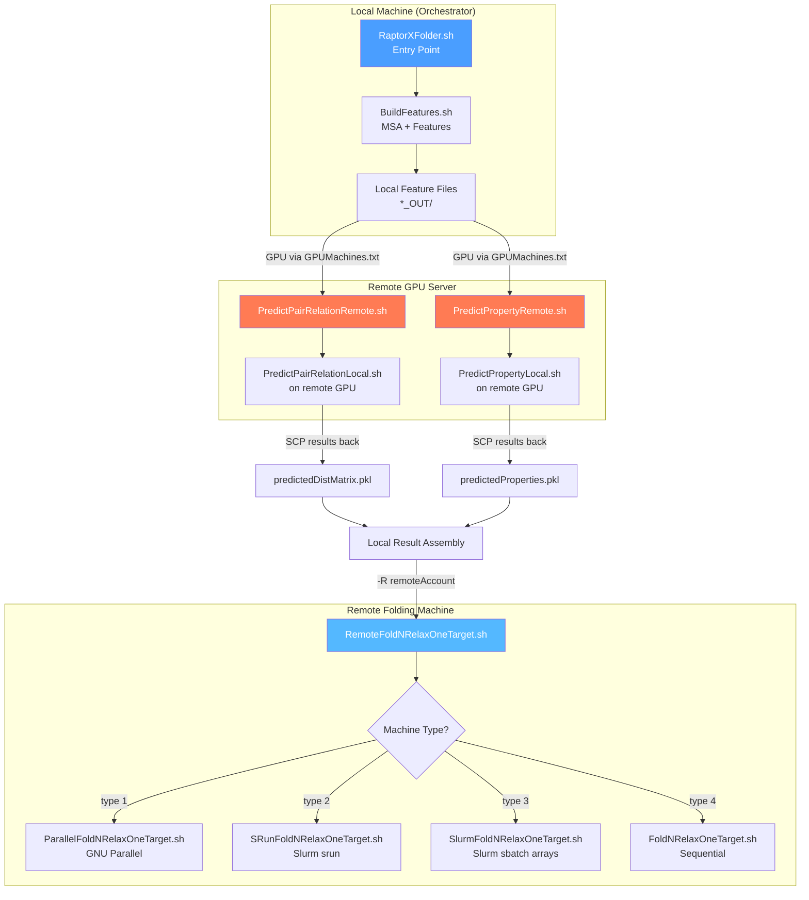
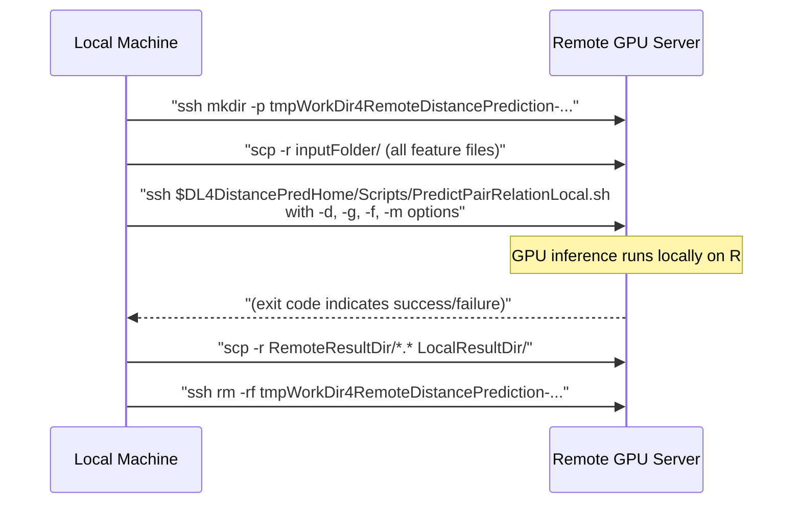
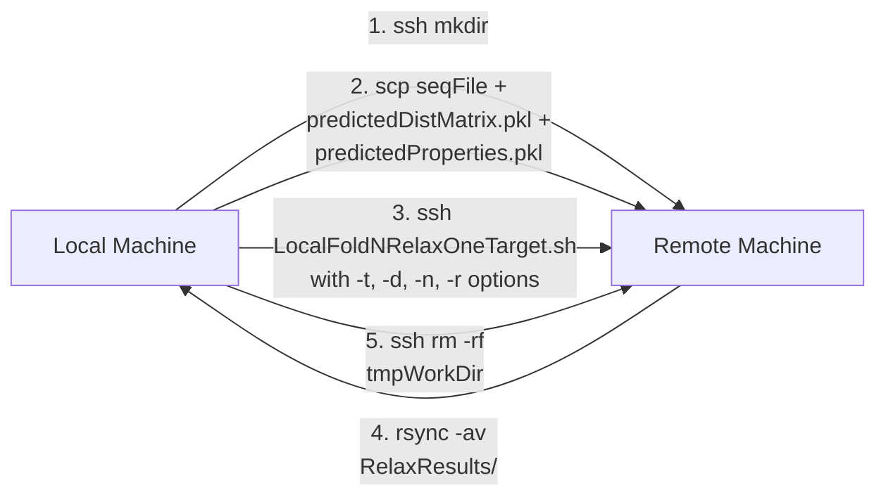

---
slug:13-multi-machine-distributed-execution
blog_type:normal
---


RaptorX-3DModeling 实现了**双层分布式执行架构**，将 GPU 密集型的深度学习推理与 CPU 密集型的 3D 模型折叠解耦，使得每个阶段都能在最适合其工作负载的机器上运行。该系统通过 SSH/SCP 文件传输来编排远程 GPU 预测，通过基于 rsync 的工作目录进行远程折叠，并通过 Slurm 集群提交来实现大规模诱饵生成——所有这些编排均从单一入口点发起，机器之间无需任何手动数据移动。

## 分布式架构概述

系统将完整的预测流水线划分为可以跨越不同物理机器的**三个执行域**：(1) 在本地机器上进行特征生成与 MSA 构建，(2) 在远程 GPU 服务器上进行深度学习推理，(3) 在远程 CPU 集群或工作站上进行 3D 折叠。每个域通过基于文件的数据契约进行通信——使用 PKL 文件存储预测矩阵，FASTA 文件存储序列，Rosetta 约束文件用于折叠——这些文件通过 SSH/SCP/rsync 自动传输。



**GPUMachines.txt** 文件充当服务注册表。当本地机器在该文件中的状态为 `on` 时，预测将在本地运行；否则，系统会从处于激活状态的条目中随机选择一台远程机器（通过 `shuf`），并将整个预测工作负载透明地转移至该远程机器。

来源：[RaptorXFolder.sh](/Server/RaptorXFolder.sh#L1-L209), [PredictPairRelation4Server.sh](/DL4DistancePrediction4/Scripts/PredictPairRelation4Server.sh#L1-L208), [PredictPropertyWrapper.sh](/DL4PropertyPrediction/Scripts/PredictPropertyWrapper.sh#L1-L125)

## GPU 机器注册表配置

文件 `params/GPUMachines.txt`（示例位于 `params/GPUMachines-example.txt`）定义了可用于远程预测的配备 GPU 的机器池。每行指定一个机器地址、一个 RAM 类别以及一个开/关状态：

| 列 | 描述 | 示例值 |
|--------|-------------|----------------|
| **主机名** | 可通过 SSH 访问的机器地址 | `raptorx9.uchicago.edu`, `jinbo@raptorx7.uchicago.edu` |
| **RAM 类别** | 用于负载均衡提示的内存类别 | `LargeRAM`, `SmallRAM` |
| **状态** | 此机器是否处于激活状态 | `on`, `off` |

示例配置展示了实际运行时的选择逻辑：

```
raptorx9.uchicago.edu LargeRAM on       ← 符合远程预测条件
raptorx8.uchicago.edu LargeRAM on       ← 符合远程预测条件
raptorx7.uchicago.edu LargeRAM on       ← 符合远程预测条件
jinbo@raptorx7.uchicago.edu SmallRAM off ← 从池中排除
raptorx6.uchicago.edu SmallRAM off      ← 从池中排除
```

解析算法的工作流程如下：编排器读取所有状态为 `on` 的行，从第一列提取主机名，然后与本地机器的 `hostname` 进行比较。如果本地机器与某个激活条目匹配，预测将在本地运行。如果不匹配，则通过 `shuf | head -1` 随机选择一台远程机器。这种随机选择机制在 GPU 服务器之间提供了基础的负载分配，而无需中央调度器。

<CgxTip>前提条件：GPUMachines.txt 中列出的所有机器都必须可以通过**免密 SSH** 访问。在运行分布式工作流之前，请使用 `ssh-keygen` 和 `ssh-copy-id` 完成设置。脚本使用 `ssh -o StrictHostKeyChecking=no` 来绕过首次连接时的主机密钥验证。</CgxTip>

来源：[GPUMachines-example.txt](/params/GPUMachines-example.txt#L1-L8), [PredictPairRelation4Server.sh](/DL4DistancePrediction4/Scripts/PredictPairRelation4Server.sh#L97-L117), [PredictPropertyWrapper.sh](/DL4PropertyPrediction/Scripts/PredictPropertyWrapper.sh#L88-L107)

## 远程预测协议（SSH/SCP 传输）

距离/方向预测器和属性预测器在委托给远程 GPU 机器时，都遵循相同的**传输-执行-获取**协议。该协议在远程主机上创建一个临时工作目录，通过 SCP 传输输入特征，通过 SSH 在远程机器上执行本地预测脚本，通过 SCP 获取结果，并清理远程目录。

### 距离预测远程流程

`PredictPairRelationRemote.sh` 实现了距离/方向预测的完整协议：



远程工作目录的命名约定包含目标名称、本地主机名和进程 ID 以确保唯一性：`tmpWorkDir4RemoteDistancePrediction-${target}-${localMachine}-$$`。当来自不同本地机器的多个预测并发运行在同一 GPU 服务器上时，这可以防止冲突。

### 属性预测远程流程

`PredictPropertyRemote.sh` 遵循相同的模式，但仅传输单个 PKL 特征文件（而非整个目录），并且仅获取 `predictedProperties.pkl` 输出。远程工作目录命名为 `tmpWorkDir4RemotePropertyPrediction-${target}-${localMachine}-$$`。

### 服务器级调度逻辑

`*4Server.sh` 脚本用作**调度层**，负责决定是在本地还是远程执行。`PredictPairRelation4Server.sh` 和 `PredictProperty4Server.sh`（通过 `PredictPropertyWrapper.sh`）都实现了以下决策树：

1. 检查 `GPUMachines.txt` 是否存在 → 若不存在，在本地运行
2. 解析文件中所有状态为 `on` 的条目 → 若无此类条目，在本地运行
3. 将本地主机名与激活条目进行比较 → 若匹配，在本地运行
4. 通过 `grep -w on | shuf | head -1` 选择一台远程机器 → 委托给 `*Remote.sh`

来源：[PredictPairRelationRemote.sh](/DL4DistancePrediction4/Scripts/PredictPairRelationRemote.sh#L1-L135), [PredictPropertyRemote.sh](/DL4PropertyPrediction/Scripts/PredictPropertyRemote.sh#L1-L117), [PredictPairRelation4Server.sh](/DL4DistancePrediction4/Scripts/PredictPairRelation4Server.sh#L119-L155), [PredictProperty4Server.sh](/DL4PropertyPrediction/Scripts/PredictProperty4Server.sh#L1-L122)

## GPU 选择与内存估算

在本地运行预测时（无论是在原始机器上，还是在委托后的远程 GPU 服务器上），系统都会使用 `FindOneGPUByMemory.sh` 自动选择最佳的可用 GPU。该脚本查询 NVIDIA SMI 以获取每个 GPU 的可用显存，并选择具有最多可用显存的 GPU。

### 距离预测的 GPU 内存估算

`EstimateGPURAM4DistPred.sh` 使用基于序列长度的二次公式计算 GPU 内存需求：

```
neededRAM = 367,729,730 + 93,485 × L + 3,990 × L² + 500,000,000
```

其中 **L** 为蛋白质序列长度。这反映了距离矩阵预测网络的 O(L²) 内存复杂度。例如：

| 序列长度 | 预估 GPU 内存 | 典型 GPU 适用性 |
|----------------|-------------------|------------------------|
| 200 个残基 | ~1.1 GB | 任意 GPU |
| 500 个残基 | ~2.8 GB | 任意 GPU |
| 1000 个残基 | ~7.5 GB | 8GB+ 显存 GPU（如 RTX 2080） |
| 1500 个残基 | ~15.3 GB | 16GB+ 显存 GPU（如 V100） |

### GPU 选择算法

`FindOneGPUByMemory.sh` 实现了基于轮询的 GPU 获取策略：

1. 查询 `nvidia-smi` 以获取具有最大可用显存的 GPU
2. 如果可用显存 ≥ 所需内存 → 立即返回该 GPU 索引
3. 如果显存不足 → 等待 1 分钟后重试
4. 重复此过程最多 **90 分钟**（可通过第二个参数配置）
5. 如果仍未找到合适的 GPU → 返回 `-1`（失败）

这种轮询方式允许系统优雅地等待其他 GPU 任务完成，而不是立即失败，使其适用于资源竞争激烈的共享 GPU 环境。

来源：[EstimateGPURAM4DistPred.sh](/DL4DistancePrediction4/Scripts/EstimateGPURAM4DistPred.sh#L1-L13), [FindOneGPUByMemory.sh](/Utils/FindOneGPUByMemory.sh#L1-L59), [PredictPairRelationLocal.sh](/DL4DistancePrediction4/Scripts/PredictPairRelationLocal.sh#L186-L208)

## 分布式折叠：机器类型分类

预测完成后，3D 折叠阶段可以在完全不同的机器上执行。`RaptorXFolder.sh` 入口点提供 `-R` 选项来指定远程折叠账户（例如 `raptorx@raptorx3.uchicago.edu:Work4Server/`），以及 `-t` 选项来声明机器类型。折叠调度器 `LocalFoldNRelaxOneTarget.sh` 根据机器类型路由至以下四种执行策略之一：

| 机器类型 (`-t`) | 脚本 | 执行模型 | 需求 |
|---------------------|--------|-----------------|-------------|
| **0**（自动检测） | 基于主机名的选择 | 将已知主机名匹配至类型 1–4 | 预配置的主机名模式 |
| **1** | `ParallelFoldNRelaxOneTarget.sh` | 多 CPU 工作站上的 GNU Parallel | 已安装 GNU `parallel` |
| **2** | `SRunFoldNRelaxOneTarget.sh` | 同构节点的 Slurm `srun` | Slurm 集群，节点上安装 GNU `parallel` |
| **3** | `SlurmFoldNRelaxOneTarget.sh` | 异构节点的 Slurm `sbatch` 数组作业 | Slurm 集群 |
| **4** | `Scripts4Rosetta/FoldNRelaxOneTarget.sh` | 单 CPU 上的顺序执行 | 无（回退方案） |

当指定 `-t 0` 时，系统会执行主机名匹配以自动检测执行环境：

```
raptorx10.uchicago.edu  → ParallelFoldNRelaxOneTarget.sh (type 1)
raptorx3.uchicago.edu   → SRunFoldNRelaxOneTarget.sh (type 2)
slurm.ttic.edu          → SlurmFoldNRelaxOneTarget.sh (type 3)
raptorx[4-9]            → ParallelFoldNRelaxOneTarget.sh (type 1)
default                 → Scripts4Rosetta/FoldNRelaxOneTarget.sh (type 4)
```

来源：[LocalFoldNRelaxOneTarget.sh](/Folding/LocalFoldNRelaxOneTarget.sh#L89-L130), [RaptorXFolder.sh](/Server/RaptorXFolder.sh#L38-L56)

## 远程折叠协议

`RemoteFoldNRelaxOneTarget.sh` 实现了与远程预测相同的传输-执行-获取模式，但用于折叠阶段。`-R` 选项接受格式为 `user@host:WorkDir` 的字符串，该字符串将被解析为远程账户和基础工作目录。



协议步骤如下：

1. **创建远程工作目录**：`ssh $RemoteAccount "mkdir -p $RemoteWorkDir"`，目录命名为 `tmpWorkDir4RemoteDistFolding-${target}-${localMachine}-$$`
2. **传输输入文件**：`scp $inFile $pairMatrixFile $propertyFile $RemoteAccount:$RemoteWorkDir/` —— 发送序列文件、预测距离矩阵和预测属性
3. **远程执行折叠**：在远程机器上运行 `$DistanceFoldingHome/LocalFoldNRelaxOneTarget.sh`，该脚本随后会根据 `-t` 参数分派至相应的执行策略
4. **获取结果**：`rsync -av $RemoteAccount:$RemoteWorkDir/${target}-RelaxResults/ $savefolder/` —— 使用 rsync 高效传输生成的 PDB 诱饵文件
5. **清理**：`ssh $RemoteAccount "rm -rf $RemoteWorkDir"` —— 移除远程机器上的临时目录

<CgxTip>远程机器必须正确设置 `DistanceFoldingHome` 和 `ModelingHome` 环境变量，并且必须安装 Rosetta。折叠模块是 RaptorX-3DModeling 中唯一需要存在于远程折叠机器上的部分——不需要 GPU 或深度学习模型。</CgxTip>

来源：[RemoteFoldNRelaxOneTarget.sh](/Folding/RemoteFoldNRelaxOneTarget.sh#L1-L159)

## 执行策略详述

### GNU Parallel 折叠（类型 1）

`ParallelFoldNRelaxOneTarget.sh` 使用 GNU Parallel 在单个节点的可用 CPU 间分配诱饵生成任务。它首先从预测的距离/方向 PKL 文件生成 Rosetta 约束文件（对于小于 450 个残基的序列暂存至 `/dev/shm`，否则存至 `/tmp` 以加快 I/O 速度），然后通过管道将折叠命令传入 `parallel --delay $delay $parallelOptions`。延迟时间计算为 `max(1, seqLen/100)` 秒，以避免文件系统过载。资源限制可按机器配置：

| 主机名 | `--memfree` | `--load` | 理由 |
|----------|------------|----------|-----------|
| raptorx10.uchicago.edu | 120G | 92% | 大内存工作站 |
| raptorx[7-9].uchicago.edu | 20G | 98% | 标准工作站 |

来源：[ParallelFoldNRelaxOneTarget.sh](/Folding/ParallelFoldNRelaxOneTarget.sh#L1-L163), [LocalFoldNRelaxOneTarget.sh](/Folding/LocalFoldNRelaxOneTarget.sh#L131-L159)

### 同构节点的 Slurm srun（类型 2）

`SRunFoldNRelaxOneTarget.sh` 将诱饵总数划分为多个批次，并将每个批次作为独立的 `srun` 调用提交。每批次的任务数动态计算：

- **默认**：每批次 20 个任务
- **序列长度 > 500 个残基时**：`numTasks = max(10, 10000 / seqLen)` —— 较长序列每个任务消耗更多内存，因此并发数更低

每个 `srun` 命令在单个 Slurm 节点上运行 `ParallelFoldNRelaxOneTarget.sh`，后者随后在该节点内使用 GNU Parallel。脚本以 1 秒的间隔错开启动所有 srun 作业作为后台进程，然后 `wait` 等待所有作业完成。队列和资源规格按集群配置：

```
# Default (raptorx3)
QUEUE=cpu
SPEC="-c20 --exclude=cpu3 --nodes=1-1"

# TTIC Slurm cluster
QUEUE=contrib-cpu
SPEC="-C avx --nodes=1-1"
```

来源：[SRunFoldNRelaxOneTarget.sh](/Folding/SRunFoldNRelaxOneTarget.sh#L1-L161)

### Slurm sbatch 数组作业（类型 3）

`SlurmFoldNRelaxOneTarget.sh` 专为具有异构节点（CPU/内存配置各异）的 Slurm 集群设计。它使用 `ArrayJobs.py` 辅助脚本将折叠命令划分为包含多达 **1000 个命令**的数组作业，然后通过 `sbatch` 提交。节点规格根据蛋白质大小进行调整：

| 序列长度 | 节点规格 | 队列覆盖 |
|----------------|-------------------|---------------|
| ≥ 1200 个残基 | `-c3`（每个任务 3 个 CPU 核心） | — |
| ≥ 600 个残基 | `-c2`（每个任务 2 个 CPU 核心） | — |
| < 600 个残基 | `-c1`（每个任务 1 个 CPU 核心） | — |
| slurm.ttic.edu 上 ≥ 500 个残基 | — | `contrib-cpu-long` |

提交后，脚本每 2 分钟轮询一次 `squeue`，并在生成足够多的诱饵模型后提前退出（即使数组作业仍在运行），这对于某些任务可能失败但已有充足模型的大型作业而言，是一项实用的优化措施。

`ArrayJobs.py` 为每个批次生成两个伴生文件：一个包含 Rosetta 命令的 `batch-commands-N.txt` 文件，以及一个包含 `#SBATCH` 指令和 `--array=1-N` 的 `sbatch-script-N.txt` 文件，该脚本使用 `sed` 提取并执行 `SLURM_ARRAY_TASK_ID` 处的命令。

来源：[SlurmFoldNRelaxOneTarget.sh](/Folding/SlurmFoldNRelaxOneTarget.sh#L1-L200), [ArrayJobs.py](/Folding/Helpers/ArrayJobs.py#L1-L61)

## 端到端分布式执行示例

以下演示了一个完整的分布式执行过程，其中特征生成在本地运行，预测委托给 GPU 服务器，折叠委托给 Slurm 集群：

```bash
# 步骤 1：配置 GPU 机器注册表
cat > params/GPUMachines.txt << EOF
gpu-server.example.edu LargeRAM on
EOF

# 步骤 2：运行带有分布式执行的完整流水线
Server/RaptorXFolder.sh \
  -g -1 \                          # 自动选择 GPU
  -m 8 \                           # HHblits 3.0 用于 MSA
  -R cluster@example.edu:WorkDir \ # 远程折叠账户
  -t 3 \                           # Slurm 异构集群
  -n 200 \                         # 200 个诱饵
  -r 1 \                           # 折叠 + 弛豫
  -l 1500 \                        # 最大蛋白质长度 1500
  input/1pazA.fasta
```

执行经历以下阶段：

1. **本地**：`BuildFeatures.sh` 在 `1pazA_OUT/` 中生成 MSA 和特征文件
2. **远程 GPU**：`PredictPairRelationRemote.sh` 将特征传输至 `gpu-server.example.edu`，运行推理，获取 `1pazA.predictedDistMatrix.pkl`
3. **远程 GPU**：`PredictPropertyRemote.sh` 传输特征，获取 `1pazA.predictedProperties.pkl`
4. **本地后处理**：推导距离信息，打印接触预测，可视化接触图
5. **远程 Slurm**：`RemoteFoldNRelaxOneTarget.sh` 将预测文件传输至 `cluster@example.edu`，提交 Slurm 数组作业，等待 200 个诱饵生成完毕，通过 rsync 获取结果

来源：[RaptorXFolder.sh](/Server/RaptorXFolder.sh#L130-L209), [GPUMachines-example.txt](/params/GPUMachines-example.txt#L1-L8)

## 分布式设置的环境变量

本地编排机器和远程机器都需要特定的环境变量。`raptorx-path.sh` 和 `raptorx-external.sh` 文件定义了这些变量，但**远程机器必须拥有其自身正确配置的副本**。

| 变量 | 用途 | 要求位置 | 示例 |
|----------|---------|-------------|---------|
| `ModelingHome` | 根安装目录 | 所有机器 | `/home/user/RaptorX-3DModeling` |
| `DistFeatureHome` | 特征生成模块 | 本地机器 | `$ModelingHome/BuildFeatures/` |
| `DL4DistancePredHome` | 距离预测模块 | GPU 机器 | `$ModelingHome/DL4DistancePrediction4/` |
| `DL4PropertyPredHome` | 属性预测模块 | GPU 机器 | `$ModelingHome/DL4PropertyPrediction/` |
| `DistanceFoldingHome` | 折叠模块 | 折叠机器 | `$ModelingHome/Folding/` |
| `HHDIR` | HHsuite 安装路径 | 本地机器（MSA 生成） | `/mnt/data/HHblits/hhsuite-3.2.0/` |
| `HHDB` | UniRef30 数据库 | 本地机器（MSA 生成） | `/mnt/data/UniRef30_2020_02` |
| `CUDA_ROOT` | CUDA/CUDNN 路径 | GPU 机器 | `/usr/local/cuda/` |
| `PYTHONPATH` | Python 模块路径 | 所有机器 | `$ModelingHome:$PYTHONPATH` |

来源：[raptorx-path.sh](/raptorx-path.sh#L1-L8), [raptorx-external.sh](/raptorx-external.sh#L1-L24)

## 多蛋白质批量执行

`BatchBuildFeatures.sh` 为蛋白质列表提供并发特征生成功能。它最多生成 `numAllowedJobs`（默认为 3）个并发的 `BuildFeatures.sh` 进程，并通过 `ps -x | grep` 监控以强制执行并发限制。每个作业使用随机休眠间隔（0-3 秒）实现错峰提交，以避免共享 GPU 上的资源争用。

对于多个蛋白质的分布式预测，每个蛋白质的 `*4Server.sh` 调用都会通过 `GPUMachines.txt` 独立解析其 GPU 目标，因此一批蛋白质通过随机选择自然地分布到所有可用的 GPU 服务器上——从而在没有集中式作业调度器的情况下提供了隐式并行性。

来源：[BatchBuildFeatures.sh](/BuildFeatures/BatchBuildFeatures.sh#L1-L95), [PredictPairRelation4Server.sh](/DL4DistancePrediction4/Scripts/PredictPairRelation4Server.sh#L119-L155)

## 分布式执行故障排除

| 症状 | 根本原因 | 解决方案 |
|---------|-----------|------------|
| `ERROR: failed to create $RemoteWorkDir at $RemoteAccount` | 未配置免密 SSH | 运行 `ssh-copy-id user@remotehost` |
| `ERROR: cannot find an appropriate GPU` | 在 90 分钟等待时间内没有 GPU 拥有足够的可用显存 | 减少并发作业，使用更大显存的 GPU，或增加 `FindOneGPUByMemory.sh` 的第 2 个参数以延长等待时间 |
| `ERROR: failed to scp prediction results` | 远程预测在生成输出前崩溃 | 检查远程日志；验证 GPU 服务器上存在 `CUDA_ROOT` 和模型文件 |
| 在远程机器上 `ERROR: failed to run LocalFoldNRelaxOneTarget.sh` | 折叠机器上未设置 `DistanceFoldingHome` | 在远程机器的 shell 配置文件中 source `raptorx-path.sh` |
| 折叠作业在 Slurm 上挂起 | 队列规格不匹配 | 针对您的集群编辑 `SlurmFoldNRelaxOneTarget.sh` / `SRunFoldNRelaxOneTarget.sh` 中的 `QUEUE` 和 `SPEC` 变量 |
| `WARNING: there is no local GPU...` | 当 GPUMachines.txt 仅列出远程机器时属正常情况 | 这是预期行为；预测将委托给远程服务器 |

若要更深入地控制 GPU 选择和远程预测机制，请参阅 [GPU 选择与远程预测](14-gpu-selection-and-remote-prediction)。若要自定义分布式预测中使用的神经网络模型，请参阅 [自定义网络集成](15-custom-network-integration)。