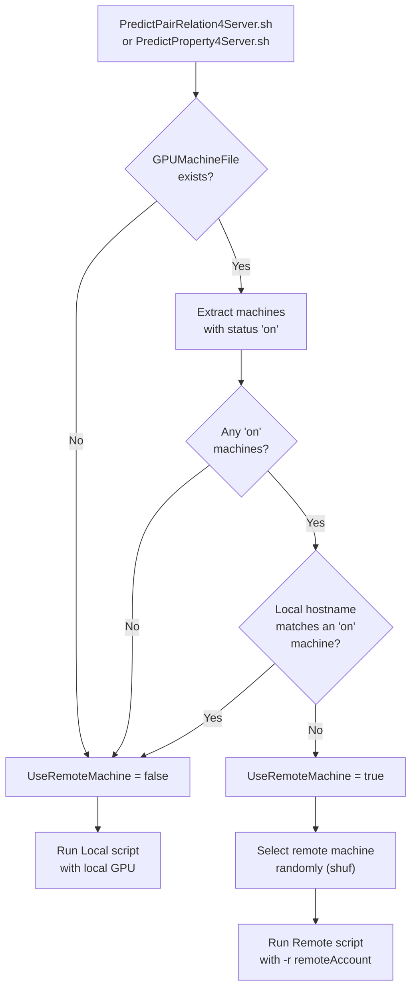
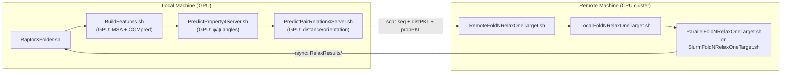

---
slug:14-gpu-selection-and-remote-prediction
blog_type:normal
---


RaptorX-3DModeling 实现了**双层 GPU 调度架构**：一种是实时查询硬件状态的自动本地 GPU 选择机制，另一种是通过 SSH/SCP 透明地将计算卸载到配备 GPU 的机器上的远程预测框架。本页说明了如何发现 GPU 资源、如何根据蛋白质序列长度估算内存需求、机器注册表如何将工作路由到本地或远程主机，以及折叠阶段如何将远程执行扩展到 CPU 集群。

## 基于空闲内存的自动 GPU 选择

GPU 分配的基础是 [`FindOneGPUByMemory.sh`](Utils/FindOneGPUByMemory.sh)，该脚本会轮询 `nvidia-smi`，以找到满足调用者指定要求且**空闲内存最大**的单块 GPU。该脚本接受两个参数：`RAM_needed_bytes`（所需的最低 GPU 内存，单位为字节）和可选的 `mins_to_wait`（等待时长，单位为分钟，默认为 90）。脚本会进入轮询循环——每分钟检查一次——直到找到空闲内存超过要求的 GPU，或者等待超时。如果未找到合适的 GPU，则返回 `-1`。

选择逻辑首先将 `nvidia-smi` 报告的总内存减去 500 MB 作为每块 GPU 的可用内存上限，将其视为驱动程序开销的安全裕量。如果请求的内存超过所有 GPU 的上限最大值，脚本将立即以 `-1` 退出——继续等待已无意义。在循环内部，它会按空闲内存对所有 GPU 进行降序排序，并选择裕量最大的一块。这种贪心策略意味着在轻负载下，作业会集中在同一块 GPU 上；但在资源争用时，它们会自然分散到其他可用设备上。

来源：[FindOneGPUByMemory.sh](Utils/FindOneGPUByMemory.sh#L1-L59)

## 根据序列长度估算 GPU 内存

在调用 GPU 选择器之前，系统必须确定**一个预测作业需要多少 GPU 内存**。这由 [`EstimateGPURAM4DistPred.sh`](DL4DistancePrediction4/Scripts/EstimateGPURAM4DistPred.sh) 处理，该脚本应用了一个基于距离预测网络经验性能分析的闭式二次公式：

```
neededRAM = 367,729,730 + 93,485 × L + 3,990 × L² + 500,000,000
```

其中 **L** 为蛋白质序列长度。常数项（≈368 MB）表示模型参数占用，线性项考虑了依赖序列的特征图，而3二次项在长序列中起主导作用，因为距离矩阵按 L² 增长。500 MB 的填充量提供了额外的安全裕量。对于 300 个残基的蛋白质，计算结果D'x约 1.2 GB；对于 1000 个残基的蛋白质，则超过 10 GB——这证实了项目的指导原则&3方针，即极大的蛋白质需要具有超过 12 GB 内存的 GPU。

对于**属性预测**（φ/ψ 角度），内存占用要小得多，并硬编码为固定的 1 GB（`1073741824` 字节），因为属性网络基于逐残基特征而非成对矩阵进行运算。

来源：[EstimateGPURAM4DistPred.sh](DL4DistancePrediction4/Scripts/EstimateGPURAM4DistPred.sh#L1-L13), [PredictPropertyLocal.sh](DL4PropertyPrediction/Scripts/PredictPropertyLocal.sh#L89-L93)

## 预测流水线中的 GPU 选择

本地预测脚本将 GPU 选择集成为一个两步过程：估算内存，然后查找 GPU。在 [`PredictPairRelationLocal.sh`](DL4DistancePrediction4/Scripts/PredictPairRelationLocal.sh) 中，当 GPU 参数为 `-1`（默认值）时，脚本会调用估算器，然后在 30 分钟的等待时间窗口内调用选择器：

```bash
neededRAM=`$DL4DistancePredHome/Scripts/EstimateGPURAM4DistPred.sh $seqFile`
GPU=`$ModelingHome/Utils/FindOneGPUByMemory.sh $neededRAM 30`
```

如果未找到 GPU，脚本将报错退出——距离预测**无法回退到 CPU**。一旦获取到 GPU 索引，它将被转换为 Theano 设备字符串（`cuda0`、`cuda1` 等），并通过 `THEANO_FLAGS` 环境变量与 cuDNN 路径配置一起传递：

```bash
THEANO_FLAGS=blas.ldflags=,device=$GPU,floatX=float32,\
  dnn.include_path=${CUDA_ROOT}/include,\
  dnn.library_path=${CUDA_ROOT}/lib64 \
  python $program $arguments
```

对于 [`PredictPropertyLocal.sh`](DL4PropertyPrediction/Scripts/PredictPropertyLocal.sh) 中的属性预测，流程类似但有一个关键区别：如果未找到 GPU，它将**回退到 CPU**（`GPU=cpu`）并发出警告，而不是失败。这是可行的，因为属性网络较小的内存占用使得 CPU 推理成为可能，尽管速度较慢。

来源：[PredictPairRelationLocal.sh](DL4DistancePrediction4/Scripts/PredictPairRelationLocal.sh#L191-L208), [PredictPropertyLocal.sh](DL4PropertyPrediction/Scripts/PredictPropertyLocal.sh#L89-L106)

## GPU 机器注册表

远程预测系统由一个 **GPU 机器文件**控制，该文件默认位于 `$ModelingHome/params/GPUMachines.txt`。示例配置位于 [`params/GPUMachines-example.txt`](params/GPUMachines-example.txt)：

```
raptorx9.uchicago.edu LargeRAM on
raptorx8.uchicago.edu LargeRAM on
raptorx7.uchicago.edu LargeRAM on
jinbo@raptorx7.uchicago.edu SmallRAM off
raptorx6.uchicago.edu SmallRAM off
```

每行包含三个字段：**主机名**（可选地带有 username@）、**内存类别**（`LargeRAM` 或 `SmallRAM`）和**状态**（`on` 或 `off`）。内存类别是供管理员参考的信息标签；调度逻辑不会直接使用它。状态字段控制资格：只有标记为 `on` 的机器才是远程工作的候选节点。这允许管理员通过将机器设置为 `off` 来优雅地排空机器以进行维护，而无需删除其配置。

来源：[GPUMachines-example.txt](params/GPUMachines-example.txt#L1-L8)

## 本地与远程调度逻辑

调度决策在距离和属性预测的服务器脚本中保持一致地实现。以下流程图说明了完整的路由算法：



关键的洞察是，**如果本地机器在机器文件中显示为状态 `on`，则它会从远程候选中被排除**。这防止了机器通过 SSH 连接到自身。当选择远程执行时，使用 `shuf | head -1` 从符合条件的 `on` 机器中**随机**选择一台，提供了无需中央调度器的简单负载分配。

来源：[PredictPairRelation4Server.sh](DL4DistancePrediction4/Scripts/PredictPairRelation4Server.sh#L107-L155), [PredictPropertyWrapper.sh](DL4PropertyPrediction/Scripts/PredictPropertyWrapper.sh#L81-L124)

## 远程预测执行协议

一旦分派到远程机器，远程脚本遵循**四阶段 SSH/SCP 协议**，该协议在距离和属性预测中结构相同：

| 阶段 | 动作 | 距离预测 | 属性预测 |
|-------|--------|-------------------|-------------------|
| **1. 准备** | 创建远程工作目录 | `ssh mkdir -p $RemoteWorkDir` | `ssh mkdir -p $RemoteWorkDir` |
| **2. 传输** | 将输入数据复制到远程 | `scp -r $inputFolder` | `scp $inputFeature` |
| **3. 执行** | 远程运行本地预测脚本 | `ssh PredictPairRelationLocal.sh` | `ssh PredictPropertyLocal.sh` |
| **4. 检索** | 将结果复制回并清理 | `scp -r results; ssh rm -rf` | `scp result.pkl; ssh rm -rf` |

远程工作目录名编码了目标、发起主机和 PID 以保证唯一性：`tmpWorkDir4RemoteDistancePrediction-${target}-${localMachine}-$$`。当来自不同主机的多个预测同时针对同一台远程机器时，此命名约定可防止冲突。SSH 命令上的 `-o StrictHostKeyChecking=no` 标志简化了可信环境中的执行，但应在安全敏感的部署中加以审查。

对于距离预测，整个输入特征文件夹（包含 MSA 特征、序列文件和可选的模板比对）通过 `scp -r` 传输。对于属性预测，仅发送单个 `.propertyFeatures.pkl` 文件。执行后，结果将被拉回，并且远程临时目录将被删除。未能删除远程目录会产生警告而不是错误，从而允许流水线继续运行。

来源：[PredictPairRelationRemote.sh](DL4DistancePrediction4/Scripts/PredictPairRelationRemote.sh#L89-L135), [PredictPropertyRemote.sh](DL4PropertyPrediction/Scripts/PredictPropertyRemote.sh#L73-L117)

## 特征生成的 GPU 模式

特征生成阶段（[`BuildFeatures.sh`](BuildFeatures/BuildFeatures.sh)）通过 `-r` 标志引入了更细粒度的 GPU 模式系统，该标志控制 CCMpred（共进化特征提取器）如何利用计算资源：

| 模式 | 行为 |
|------|----------|
| **1** | 仅使用本地 GPU |
| **2** | 使用本地 GPU 和 CPU（`GenDistFeatures4OneProtein.sh` 的默认值） |
| **3** | 使用本地 GPU 和机器文件中的远程 GPU |
| **4** | 使用本地 GPU/CPU 和机器文件中的远程 GPU（`BuildFeatures.sh` 中的默认值） |

模式 4 最具进取心——它利用了所有可用资源。特征生成脚本 [`GenDistFeatures4OneProtein.sh`](BuildFeatures/GenDistFeatures4OneProtein.sh) 并行处理多个 MSA 方法（uce3、uce5、ure3、ure5 及其 _meta 变体），具有可配置的并发限制（`-n numAllowedJobs`，默认为 2）。每个 MSA 触发一次 `GenDistFeaturesFromMSA.sh` 的独立调用作为后台进程，脚本会等待所有进程完成。设置 `gpu=-1` 允许这些并发作业自动分布到多块 GPU 上。

来源：[BuildFeatures.sh](BuildFeatures/BuildFeatures.sh#L13-L118), [GenDistFeatures4OneProtein.sh](BuildFeatures/GenDistFeatures4OneProtein.sh#L96-L120)

## 用于 3D 模型构建的远程折叠

虽然 GPU 预测发生在配备 GPU 的机器上，但折叠阶段是**受 CPU 限制的**，并且可以卸载到完全不同类别的机器上。顶级入口点 [`Server/RaptorXFolder.sh`](Server/RaptorXFolder.sh) 接受 `-R remoteAccountInfo` 选项（例如 `raptorx@raptorx3.uchicago.edu:Work4Server/`），该选项将预测与折叠解耦。设置后，脚本将调用 [`RemoteFoldNRelaxOneTarget.sh`](Folding/RemoteFoldNRelaxOneTarget.sh) 而非本地变体。

远程折叠协议与预测协议类似，但传输三个文件：序列文件、预测的距离/方向 PKL 以及预测的属性 PKL。然后，它在远程机器上执行 `LocalFoldNRelaxOneTarget.sh`，并使用 `rsync -av` 检索整个 `RelaxResults/` 目录。传输后，远程工作目录将被清理。

折叠阶段还支持一个**机器类型**参数（`-t`），用于在目标机器上选择执行策略：

| 类型 | 策略 | 脚本 |
|------|----------|--------|
| **0** | 通过主机名自行决定 | 自动选择 |
| **1** | 使用 GNU parallel 的多 CPU | `ParallelFoldNRelaxOneTarget.sh` |
| **2** | Slurm 集群，同构节点 | `SRunFoldNRelaxOneTarget.sh` |
| **3** | Slurm 集群，异构节点 | `SlurmFoldNRelaxOneTarget.sh` |
| **4** | 不使用 GNU parallel 的多 CPU | `Scripts4Rosetta/FoldNRelaxOneTarget.sh` |

类型 0 根据已知机器执行主机名匹配（例如，`raptorx10` → parallel，`slurm.ttic.edu` → slurm），但可能不适用于任意主机。类型 1–4 为可移植性提供了显式控制。slurm 变体还根据序列长度进一步调整作业队列（`contrib-cpu` 与 `contrib-cpu-long`），边界为 450 个残基。

<CgxTip>在 BuildFeatures.sh 中使用 GPU 模式 4 时，请确保已对 GPUMachines.txt 中列出的所有机器配置了无密码 SSH——如果 SSH 身份验证阻塞了远程作业启动，CCMpred 将静默失败。</CgxTip>

来源：[Server/RaptorXFolder.sh](Server/RaptorXFolder.sh#L186-L199), [RemoteFoldNRelaxOneTarget.sh](Folding/RemoteFoldNRelaxOneTarget.sh#L113-L159), [LocalFoldNRelaxOneTarget.sh](Folding/LocalFoldNRelaxOneTarget.sh#L104-L144), [SRunFoldNRelaxOneTarget.sh](Folding/SRunFoldNRelaxOneTarget.sh#L14-L20)

## 端到端远程执行示例

下图显示了在使用远程折叠运行 RaptorXFolder.sh 时的完整数据流，说明了 GPU 和 CPU 工作如何跨机器分布：



本地机器处理所有依赖 GPU 的阶段（特征生成、属性预测、距离预测），而远程机器处理计算密集型的折叠。`-R` 标志和 `-t` 标志共同提供了对折叠执行位置和方式的细粒度控制，而无需在机器之间手动传输文件。

<CgxTip>随机远程机器选择（`shuf | head -1`）不提供 GPU 内存感知——如果随机选择的机器对于大型蛋白质没有足够的 VRAM，作业将在远程 Theano 启动时失败。对于具有混合蛋白质大小的生产工作负载，考虑按内存类别对 GPUMachines.txt 进行分区，并根据 EstimateGPURAM4DistPred.sh 的输出进行编程选择。</CgxTip>

来源：[Server/RaptorXFolder.sh](Server/RaptorXFolder.sh#L133-L174), [PredictPairRelation4Server.sh](DL4DistancePrediction4/Scripts/PredictPairRelation4Server.sh#L146-L155)

## 配置参考

下表总结了整个流水线中与 GPU 选择和远程执行相关的所有命令行选项：

| 脚本 | 选项 | 默认值 | 描述 |
|--------|--------|---------|-------------|
| `RaptorXFolder.sh` | `-g` | `-1` | GPU 索引；-1 = 基于空闲内存自动选择 |
| `RaptorXFolder.sh` | `-R` | 空 | 用于折叠的远程账户，例如 `user@host:workdir` |
| `RaptorXFolder.sh` | `-t` | `0` | 折叠的机器类型（0–4） |
| `BuildFeatures.sh` | `-g` | `-1` | CCMpred 的 GPU 索引 |
| `BuildFeatures.sh` | `-r` | `4` | GPU 模式：1=本地 GPU，2=GPU+CPU，3=GPU+远程 GPU，4=GPU+CPU+远程 GPU |
| `BuildFeatures.sh` | `-h` | `GPUMachines.txt` | 机器注册表文件 |
| `PredictPairRelation4Server.sh` | `-g` | `-1` | 距离预测的 GPU 索引 |
| `PredictPairRelation4Server.sh` | `-h` | `GPUMachines.txt` | 远程分派的机器注册表 |
| `PredictProperty4Server.sh` | `-g` | `-1` | 属性预测的 GPU 索引 |
| `PredictProperty4Server.sh` | `-h` | `GPUMachines.txt` | 远程分派的机器注册表 |
| `FindOneGPUByMemory.sh` | arg1 | — | 所需的 GPU 内存（字节） |
| `FindOneGPUByMemory.sh` | arg2 | `90` | 放弃前的等待时间（分钟） |
| `EstimateGPURAM4DistPred.sh` | arg1 | — | 要估算内存的序列文件 |

来源：[Server/RaptorXFolder.sh](Server/RaptorXFolder.sh#L74-L112), [BuildFeatures.sh](BuildFeatures/BuildFeatures.sh#L47-L74), [PredictPairRelation4Server.sh](DL4DistancePrediction4/Scripts/PredictPairRelation4Server.sh#L50-L82), [FindOneGPUByMemory.sh](Utils/FindOneGPUByMemory.sh#L3-L9)

## 延伸阅读

要了解消耗这些 GPU 资源的预测模块是如何架构的，请参阅[距离和方向预测](7-distance-and-orientation-prediction)和[属性预测网络](8-property-prediction-network)。有关包含多机器协调的完整分布式执行模型，请参阅[多机器分布式执行](13-multi-machine-distributed-execution)。有关加载到这些 GPU 上的深度学习模型的配置，请参阅[模型配置参考](12-model-configuration-reference)。