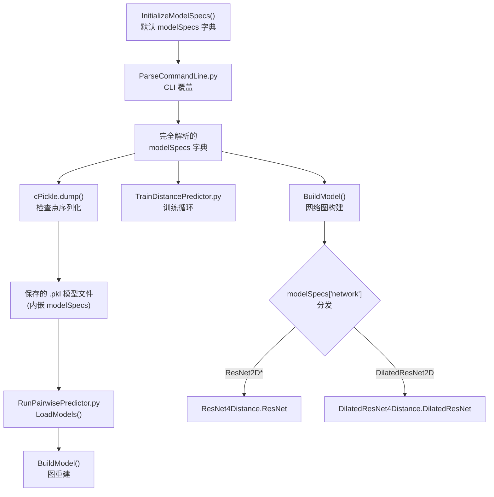
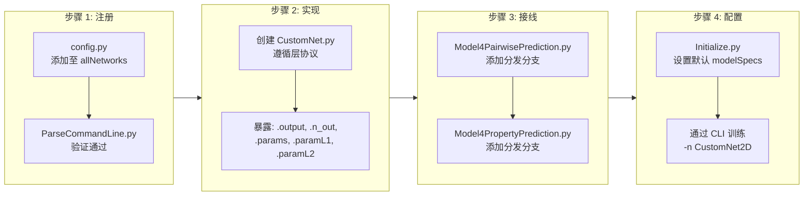

---
slug:15-custom-network-integration
blog_type:normal
---


RaptorX-3DModeling 暴露了一个**模型规格字典**（`modelSpecs`）作为其核心配置契约——这是一个单一的、强类型的 Python `dict`，控制着网络架构、训练算法、特征组合以及预测目标。流水线的每一层——从 CLI 参数解析、模型构建到推理——都读取该字典，使其成为自定义网络集成的规范扩展点。本文档将介绍该契约的架构、新网络类型的注册机制，以及将自定义深度网络引入预测流水线所需的具体步骤。

## 模型规格契约的架构

`modelSpecs` 字典由 `InitializeModelSpecs()` 初始化，随后通过 `ParseCommandLine.py` 解析的命令行参数进行选择性覆盖。这种两阶段初始化——先设置默认值，再应用覆盖——确保了向后兼容性，同时允许完全的架构控制。该字典在训练、检查点序列化和推理过程中保持不变地传递，这意味着保存的 `.pkl` 模型文件是自描述的：它包含自身的 `modelSpecs`，推理加载器可从中重建出完全一致的网络图。



该字典包含约 40 个键，划分为五个功能组。下表将每个组映射至其架构角色及定义默认值的来源文件。

| 规格组 | 键示例 | 作用 | 默认值来源 |
|---|---|---|---|
| **网络架构** | `network`, `conv1d_hiddens`, `conv2d_hiddens`, `conv2d_dilations`, `activation` | 选择并参数化深度网络拓扑 | [Initialize.py](DL4DistancePrediction4/Initialize.py#L24-L62) |
| **训练控制** | `algorithm`, `numEpochs`, `lrs`, `L2reg`, `minibatchSize` | 优化器选择、学习率调度、正则化 | [Initialize.py](DL4DistancePrediction4/Initialize.py#L36-L47) |
| **特征组合** | `UseSequentialFeatures`, `UseRawCCM`, `UseMI`, `ECInfo`, `UseTemplate` | 控制输入特征通道的布尔值与位掩码标志 | [Initialize.py](DL4DistancePrediction4/Initialize.py#L83-L108) |
| **序列到矩阵** | `seq2matrixMode`, `n_in_embed`, `boundingBoxOffset` | 控制一维序列特征如何转换为二维成对特征 | [Initialize.py](DL4DistancePrediction4/Initialize.py#L65-L70) |
| **预测目标** | `responses`, `w4responses`, `responseStr` | 声明网络预测的内容（距离、方向等） | [Initialize.py](DL4DistancePrediction4/Initialize.py#L28-L32) |

来源：[Initialize.py](DL4DistancePrediction4/Initialize.py#L1-L134), [ParseCommandLine.py](DL4DistancePrediction4/ParseCommandLine.py#L1-L200)

## 网络类型注册表与分发机制

合法的网络类型集合在 `config.py` 中定义为常量列表：

```python
allNetworks = ['ResNet2D', 'ResNet2DV21', 'ResNet2DV22', 'ResNet2DV23', 'DilatedResNet2D']
```

此列表充当**注册表**——在引入自定义网络时，向 `allNetworks` 添加新字符串是首要的强制步骤。分发逻辑位于 `Model4DistancePrediction.py` 和 `Model4PairwisePrediction.py` 两文件内的 `ResNet4DistMatrix.__init__()` 中。当前的分支结构如下：

```python
# 来自 Model4PairwisePrediction.py
if modelSpecs['network'].startswith('DilatedResNet'):
    seqConv = DilatedResNet(rng, input=seqInput, ...)
else:
    seqConv = ResNet(rng, input=seqInput, ...)

# ... 随后，对于 2D 矩阵卷积阶段：
if modelSpecs['network'].startswith('ResNet'):
    matrixConv = ResNet(rng, input=input_2d, ...)
elif modelSpecs['network'].startswith('DilatedResNet'):
    matrixConv = DilatedResNet(rng, input=input_2d, ...)
else:
    print 'ERROR: Unimplemented deep network type: ', modelSpecs['network']
    exit(1)
```

分发采用 `startswith()` 前缀匹配，因此 `ResNet2D`、`ResNet2DV21`、`ResNet2DV22` 和 `ResNet2DV23` 变体均路由至同一个 `ResNet` 类，但通过 `modelSpecs['network']` 接收不同的 `version` 参数。这是一种刻意的设计模式：**版本变体共享同一个类，但内部块结构不同**（例如，`ResNet2DV22` 在每个残差块中使用两个批归一化层，而 `ResNet2DV21` 使用一个）。

来源：[config.py](DL4DistancePrediction4/config.py#L14-L15), [Model4PairwisePrediction.py](DL4DistancePrediction4/Model4PairwisePrediction.py#L240-L260), [Model4PairwisePrediction.py](DL4DistancePrediction4/Model4PairwisePrediction.py#L310-L320)

## 逐步操作：集成自定义网络

集成过程需按依赖顺序修改四个文件。以下流程图说明了完整流程：



### 步骤 1 — 注册网络类型

在 [config.py](DL4DistancePrediction4/config.py#L14-L15) 中，将你的网络名称追加到 `allNetworks`：

```python
allNetworks = ['ResNet2D', 'ResNet2DV21', 'ResNet2DV22', 'ResNet2DV23', 
               'DilatedResNet2D', 'CustomNet2D']
```

这使得当在命令行指定 `-n CustomNet2D` 时，`ParseCommandLine.py` 中的验证检查能够通过。若无此注册，解析器将以错误提示退出：`"Currently only support the network types in [...]"`。

来源：[config.py](DL4DistancePrediction4/config.py#L14-L15), [ParseCommandLine.py](DL4DistancePrediction4/ParseCommandLine.py#L88-L91)

### 步骤 2 — 实现网络类

在 `DL4DistancePrediction4/` 目录下创建一个新的 Python 文件（例如 `CustomNet4Distance.py`）。你的类**必须遵循层协议**——`ResNet4DistMatrix` 中的消费代码会访问以下确切属性：

| 必需属性 | 类型 | 用途 |
|---|---|---|
| `self.output` | Theano 符号张量 | 网络的输出张量，供下游预测器消费 |
| `self.n_out` | `int` | 输出特征通道数，用于确定逻辑回归头的维度 |
| `self.params` | `list[theano.shared]` | 所有可训练的权重矩阵和偏置向量 |
| `self.paramL1` | Theano 标量 | 所有参数的 L1 范数，用于正则化 |
| `self.paramL2` | Theano 标量 | 所有参数的 L2 范数，用于正则化 |

请将 [ResNet4Distance.py](DL4DistancePrediction4/ResNet4Distance.py#L1-L200) 中的 `ResNet` 类作为参考实现进行研读。关键的实现注意事项：

**一维序列卷积的输入形状契约**：输入张量的形状为 `(batchSize, n_in, seqLen)`，其中每个序列位置有 `n_in` 个通道。输出形状必须为 `(batchSize, n_out, seqLen)`。填充位置被掩盖为零，且你的卷积操作必须在每次运算后重新应用掩码，以防止噪声从零填充区域传播。

**二维矩阵卷积的输入形状契约**：输入张量的形状为 `(batchSize, n_in, nRows, nCols)`，表示成对特征。输出形状为 `(batchSize, n_out, nRows, nCols)`。掩码形状为 `(batchSize, #rows_to_be_masked, nCols)`，且必须双向应用（水平和垂直填充同时掩盖）。

**权重初始化**：对 ReLU 激活函数使用 He 初始化（`scale = sqrt(2 / fan_in)`），对 tanh/sigmoid 激活函数使用 Xavier 初始化（`scale = sqrt(6 / (fan_in + fan_out))`）。这与 [ResNet4Distance.py](DL4DistancePrediction4/ResNet4Distance.py#L28-L36) 中的约定一致。

<CgxTip>如果你将 `modelSpecs` 字典作为关键字参数接收，它将被传递至你的网络构造函数中。`DilatedResNet` 类使用 `modelSpecs=modelSpecs` 来读取注意力配置（`modelSpecs['Attention']`），从而在不修改分发逻辑的情况下启用特征条件行为。对于微小的变体，请优先采用此模式，而非添加新的分发分支。</CgxTip>

来源：[ResNet4Distance.py](DL4DistancePrediction4/ResNet4Distance.py#L1-L200), [DilatedResNet4Distance.py](DL4DistancePrediction4/DilatedResNet4Distance.py#L1-L200)

### 步骤 3 — 接入分发逻辑

在**两个**模型构建文件中修改网络分发逻辑。对于 [Model4PairwisePrediction.py](DL4DistancePrediction4/Model4PairwisePrediction.py#L240-L260) 中的距离/方向预测，需为一维序列阶段和二维矩阵阶段均添加分支：

```python
# 一维序列卷积分发 (约第 250 行)
if modelSpecs['network'].startswith('DilatedResNet'):
    seqConv = DilatedResNet(rng, input=seqInput, ...)
elif modelSpecs['network'].startswith('CustomNet'):
    from CustomNet4Distance import CustomNet
    seqConv = CustomNet(rng, input=seqInput, n_in=n_in_seq, 
                        n_hiddens=n_hiddens_seq, mask=mask_seq, 
                        modelSpecs=modelSpecs)
else:
    seqConv = ResNet(rng, input=seqInput, ...)

# 二维矩阵卷积分发 (约第 315 行)
if modelSpecs['network'].startswith('ResNet'):
    matrixConv = ResNet(rng, input=input_2d, ...)
elif modelSpecs['network'].startswith('DilatedResNet'):
    matrixConv = DilatedResNet(rng, input=input_2d, ...)
elif modelSpecs['network'].startswith('CustomNet'):
    matrixConv = CustomNet(rng, input=input_2d, n_in=n_input2d, 
                           n_hiddens=n_hiddens_matrix, mask=mask_matrix, 
                           modelSpecs=modelSpecs)
else:
    print 'ERROR: Unimplemented deep network type: ', modelSpecs['network']
    exit(1)
```

对于属性预测，需在 [Model4PropertyPrediction.py](DL4PropertyPrediction/Model4PropertyPrediction.py#L35-L42) 中应用类似的修改，该文件目前仅支持 ResNet 变体：

```python
if modelSpecs['network'].startswith('ResNet'):
    seqConv = ResNet(rng, input=seqInput, ...)
elif modelSpecs['network'].startswith('CustomNet'):
    from CustomNet4Property import CustomNet
    seqConv = CustomNet(rng, input=seqInput, ...)
else:
    print 'Unimplemented deep network type: ', modelSpecs['network']
    exit(-1)
```

来源：[Model4PairwisePrediction.py](DL4DistancePrediction4/Model4PairwisePrediction.py#L240-L320), [Model4PropertyPrediction.py](DL4PropertyPrediction/Model4PropertyPrediction.py#L35-L42)

### 步骤 4 — 配置默认值并训练

在 [Initialize.py](DL4DistancePrediction4/Initialize.py#L1-L134) 中，为你的自定义网络所需的任何新 `modelSpecs` 键添加合理的默认值。随后使用 CLI 进行训练：

```bash
python TrainDistancePredictor.py \
    -n CustomNet2D \
    -y "CbCb+CaCa+NO:47C;TwoRDihedral:37C;TwoRAngle:19C" \
    -c 30,35,40,45 \
    -d 50,55,60,65,70,75 \
    -e 80 \
    -x "SeqOnly:4,6,12;OuterCat:70,35" \
    -a "AdamW:20+0.0002:1+0.00004" \
    -t train_meta.json \
    -v valid_meta.json
```

`-n` 标志设置 `modelSpecs['network']`，这将路由至你新增的分发分支。所有其他标志配置的是共享基础设施（隐藏层大小、响应、嵌入模式、优化器），你的自定义网络将通过 `modelSpecs` 接收这些配置。

来源：[Initialize.py](DL4DistancePrediction4/Initialize.py#L1-L134), [ParseCommandLine.py](DL4DistancePrediction4/ParseCommandLine.py#L1-L200)

## 扩展预测目标（响应系统）

除网络架构外，响应系统还定义了网络预测**什么**。响应被编码为 `LabelName_LabelType` 格式的字符串（例如 `CbCb_Discrete25C`、`Ca1Cb1Cb2Ca2_Discrete37C`）。合法标签名称和类型的注册表定义在 [config.py](DL4DistancePrediction4/config.py#L161-L200) 中：

| 类别 | 标签名称 | 标签类型 | 解释 |
|---|---|---|---|
| **原子间距离** | `CbCb`, `CaCa`, `CgCg`, `CaCg`, `NO` | `Discrete25C`, `Discrete47C` | 距离离散化为 N 个区间 |
| **结构接触** | `HB`, `Beta` | `Discrete2C` | 氢键 / β配对二分类 |
| **方向 (二面角)** | `Ca1Cb1Cb2Ca2`, `N1Ca1Cb1Cb2` | `Discrete37C`, `Discrete19C` | 角度离散化为 N 个区间 |
| **方向 (角度)** | `Ca1Cb1Cb2` | `Discrete19C` | 角度离散化为 N 个区间 |

要添加新的预测目标，你必须：(1) 在 `config.py` 中相关的 `all*Names` 列表中添加标签名称；(2) 在 `responseProbDims` / `responseValueDims` 字典中定义其标签类型和区间数；(3) 确保 `DataProcessor.py` 能够从输入特征中生成对应的真实标签。`-y` CLI 标志接受以分号分隔的响应组，并支持可选的逐响应权重：

```
-y "CbCb+CaCa+NO:47C:1;TwoRDihedral:37C:0.5;TwoRAngle:19C:0.5"
```

此处距离响应共享权重 1.0，而方向响应的权重降为 0.5。

来源：[config.py](DL4DistancePrediction4/config.py#L161-L200), [ParseCommandLine.py](DL4DistancePrediction4/ParseCommandLine.py#L93-L130)

## 扩展优化器套件

[TrainDistancePredictor.py](DL4DistancePrediction4/TrainDistancePredictor.py#L68-L100) 中的训练循环通过 `UpdateAlgorithm()` 函数分发至优化器类。注册表为：

```python
allAlgorithms = ['SGDM', 'SGDM2', 'Adam', 'SGNA', 'AdamW', 'AdamWAMS', 'AMSGrad']
```

每个优化器类（定义在 [Adams.py](DL4DistancePrediction4/Adams.py) 和 [Optimizers.py](DL4DistancePrediction4/Optimizers.py) 中）必须返回一个元组 `(updates, other_params)`，其中 `updates` 是 Theano `(shared_var, update_expression)` 对的列表，`other_params` 跟踪动量/自适应状态变量以维持检查点持久性。要添加自定义优化器：

1. 在 [config.py](DL4DistancePrediction4/config.py#L18) 中将其名称追加到 `allAlgorithms`
2. 按照 `(params, gparams, lr, ...)` → `(updates, other_params)` 契约实现该类
3. 在 [TrainDistancePredictor.py](DL4DistancePrediction4/TrainDistancePredictor.py#L68-L100) 的 `UpdateAlgorithm()` 中添加分发分支
4. 通过 CLI 指定：`-a CustomOpt:20+0.001`

算法字符串语法支持**两阶段训练**：`AdamW:20+0.0002:1+0.00004` 表示先以 lr=0.0002 训练 20 个 epoch，再以 lr=0.00004 训练 1 个 epoch。分号分隔符用于区分均值预测优化器与方差预测优化器（例如 `AdamW:20+0.0002;SGDM:5+0.001`）。

来源：[TrainDistancePredictor.py](DL4DistancePrediction4/TrainDistancePredictor.py#L68-L100), [config.py](DL4DistancePrediction4/config.py#L18)

## 注意力机制集成

`DilatedResNet2D` 网络可选择在每个残差块后引入通道级注意力机制。其配置由 `modelSpecs['Attention']` 控制，并通过 [config.py](DL4DistancePrediction4/config.py#L121-L132) 中的 `ParseAttentionMode()` 进行解析：

```python
def ParseAttentionMode(modelSpecs):
    fields = modelSpecs['Attention'].split('+')
    UseAvg = True
    UseMax = 'UseMax' in fields
    UseFC = True
    if 'UseConv' in fields:
        UseFC = False
    return (UseAvg, UseMax, UseFC)
```

[AttentionLayer](DL4DistancePrediction4/AttentionLayer.py#L200-L260) 类实现了挤压激励式通道注意力：它对空间维度进行池化（通过 `AvgPool` 以及可选的 `MaxPool`），将池化后的向量通过全连接层，并将结果作为通道级缩放因子重新乘回输入张量。在集成自定义网络时，你可以导入并复用此注意力层，同时传递 `modelSpecs` 以读取注意力配置，遵循 [DilatedResNet4Distance.py](DL4DistancePrediction4/DilatedResNet4Distance.py#L1-L200) 中的模式。

<CgxTip>`DilatedResNet4Distance.py` 中的 `AttnConv2DLayer` 类将空洞二维卷积与注意力组合在单个层对象中。如果你的自定义网络同时使用空洞卷积和注意力，请优先组合 `AttnConv2DLayer` 块，而非手动堆叠 `ResConv2DLayer` → `AttentionLayer`，因为组合类能正确处理注意力通路中的掩码传播。</CgxTip>

来源：[AttentionLayer.py](DL4DistancePrediction4/AttentionLayer.py#L200-L260), [config.py](DL4DistancePrediction4/config.py#L121-L132), [DilatedResNet4Distance.py](DL4DistancePrediction4/DilatedResNet4Distance.py#L140-L200)

## 模型序列化与推理兼容性

当训练模型通过 `cPickle.dump()` 保存时，完整的 `modelSpecs` 字典会被嵌入到 `.pkl` 文件中。在推理期间，[RunPairwisePredictor.py](DL4DistancePrediction4/RunPairwisePredictor.py#L64-L88) 通过 `LoadModels()` 加载模型，该函数会执行两项关键验证检查：

```python
if not model['network'] in config.allNetworks:
    print 'ERROR: unsupported network architecture: ', model['network']
    exit(1)
```

这意味着**任何自定义网络类型都必须在推理机的 `config.py` 的 `allNetworks` 中注册**。加载的 `modelSpecs` 会被直接传递给 `BuildModel()`，以重建完全一致的 Theano 计算图。当集成多个模型时，`LoadModels()` 函数还会验证**跨模型一致性**——所有模型在每个标签名称上的标签类型必须保持一致。

[params/ModelFile4PairwisePred.txt](DL4DistancePrediction4/params/ModelFile4PairwisePred.txt#L1-L43) 中的预训练模型注册表通过嵌入了架构信息的命名约定来引用模型文件：`SeqModel30-DilatedResNet2D4CbCb+CaCa+NO_47CPlus-...-AdamW.pkl`。`SeqModel` / `TPLModel` 前缀区分了无模板模型与基于模板的模型，网络类型和响应规格均嵌入在文件名中以确保可追溯性。

来源：[RunPairwisePredictor.py](DL4DistancePrediction4/RunPairwisePredictor.py#L64-L88), [params/ModelFile4PairwisePred.txt](DL4DistancePrediction4/params/ModelFile4PairwisePred.txt#L1-L43)

## 序列到矩阵嵌入模式

自定义网络接收一个**预组装的二维输入张量**（`input_2d`），该张量由原始成对矩阵特征与一个或多个序列到矩阵转换拼接而成。可用的嵌入模式由 `modelSpecs['seq2matrixMode']` 控制：

| 模式 | CLI 标志 | 机制 | 输出形状贡献 |
|---|---|---|---|
| **OuterCat** | `OuterCat:70,35` | 一维卷积输出的外拼接，经二维卷积压缩 | `(batchSize, L, L, sum(sizes))` |
| **SeqOnly** | `SeqOnly:4,6,12` | 按距离范围对氨基酸对进行可学习嵌入 | `(batchSize, L, L, sum(sizes))` |
| **Seq+SS** | `Seq+SS:4,6,12` | 对(氨基酸, 二级结构)对进行可学习嵌入 | `(batchSize, L, L, sum(sizes))` |

各模式可组合使用：`-x "SeqOnly:4,6,12;OuterCat:70,35"` 将同时应用二者，并沿通道轴拼接其输出。`EmbeddingLayer4AllRange` 类生成依赖于范围的嵌入（短/中/长），并为每个范围提供独立的嵌入向量，这就是尺寸参数为列表的原因——`SeqOnly:4,6,12` 表示短程、中程和长程残基对的嵌入维度分别为 4、6 和 12。

你的自定义网络接收合并后的 `input_2d` 张量，具有 `n_input2d` 个通道，其中 `n_input2d = n_in_matrix + sum(layer.n_out for layer in seq2matrixLayers)`。这与 `ResNet` 和 `DilatedResNet` 使用的合并机制相同，因此无需额外接线。

来源：[Model4PairwisePrediction.py](DL4DistancePrediction4/Model4PairwisePrediction.py#L270-L310), [config.py](DL4DistancePrediction4/config.py#L20), [ParseCommandLine.py](DL4DistancePrediction4/ParseCommandLine.py#L158-L182)

## 兼容性检查清单

在将自定义网络部署至生产环境前，请验证此检查清单中的每一项：

| 检查项 | 验证方法 | 失败模式 |
|---|---|---|
| 网络已在 `allNetworks` 中注册 | `config.allNetworks.__contains__('CustomNet2D')` | CLI 解析器拒绝 `-n CustomNet2D` |
| 两个模型文件中均存在分发分支 | 在 `Model4*Prediction.py` 中 Grep `startswith('CustomNet')` | `BuildModel()` 调用 `exit(1)` |
| 满足层协议 | 访问 `.output`, `.n_out`, `.params`, `.paramL1`, `.paramL2` | 图构建时抛出 AttributeError |
| 一维输出形状 `(B, n_out, L)` | 在调试构建中打印 `seqConv.output.shape` | 拼接时维度不匹配 |
| 二维输出形状 `(B, n_out, L, L)` | 在调试构建中打印 `matrixConv.output.shape` | 展平/预测器处维度不匹配 |
| 掩码传播 | 验证零填充位置在每层后仍保持为零 | 噪声污染，精度下降 |
| 推理机上的 `allNetworks` | 检查预测服务器上的 `config.py` | `LoadModels()` 拒绝加载保存的 `.pkl` |
| 检查点兼容性 | 训练 1 个 epoch 后保存并重新加载 `.pkl` | `Compatible()` 返回 False |

来源：[Model4PairwisePrediction.py](DL4DistancePrediction4/Model4PairwisePrediction.py#L240-L320), [RunPairwisePredictor.py](DL4DistancePrediction4/RunPairwisePredictor.py#L64-L88), [config.py](DL4DistancePrediction4/config.py#L14-L18)

## 相关页面

- 了解现有 ResNet 和 DilatedResNet 实现的内部架构，请参阅 [ResNet 距离预测](10-resnet-for-distance-prediction) 和 [空洞 ResNet 与注意力机制](11-dilated-resnet-and-attention)。
- 获取可配置 `modelSpecs` 键及其默认值的完整集合，请参阅 [模型配置参考](12-model-configuration-reference)。
- 了解使用这些规格的训练命令行接口，请参阅 [距离与方向预测](7-distance-and-orientation-prediction)。
- 了解推理期间的多模型集成，请参阅 [GPU 选择与远程预测](14-gpu-selection-and-remote-prediction)。