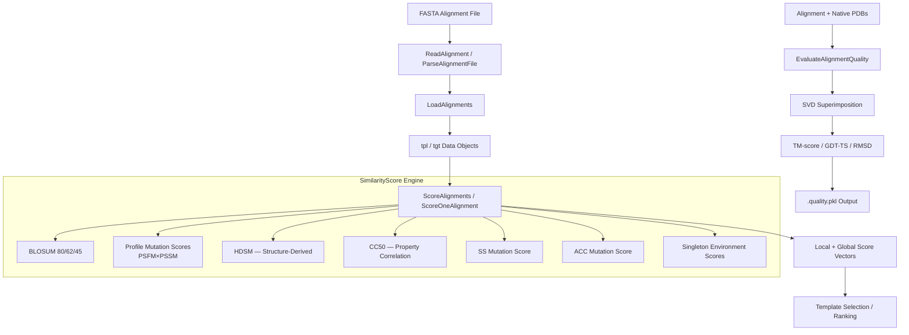

---
slug:16-alignment-and-quality-evaluation
blog_type:normal
---


比对模块为 RaptorX-3DModeling 中基于模板的建模提供了结构骨架。它包含三项紧密耦合的职责：**解析并加载成对的序列-模板比对**、**通过多矩阵相似度引擎对比对进行评分**，以及**使用黄金标准指标（TM-score、GDT-TS、RMSD）评估比对相对于天然 3D 结构的质量**。这些能力共同使得流水线能够选择最佳模板、从中提取结构指导，并定量评估比对的准确度。

## 架构概述

比对模块作为一个**分阶段评估流水线**运行——原始 FASTA 比对文件依次流经解析、评分以及（可选的）几何质量评估阶段。评分子系统是架构的核心，它集成了七种不同的替换矩阵和基于谱的突变分数，以生成下游距离预测网络所使用的逐位置特征向量。



来源: [AlignmentUtils.py](Alignment/AlignmentUtils.py#L1-L706), [ScoreAlignments.py](Alignment/ScoreAlignments.py#L1-L268), [EvaluateAlignmentQuality.py](Alignment/EvaluateAlignmentQuality.py#L1-L165)

## 比对解析与加载

### 基于 FASTA 的比对格式

RaptorX 使用**4 行 FASTA 约定**来表示成对比对。每次比对恰好占据四行：模板头、模板序列（含空位）、查询头、查询序列（含空位）。按惯例，模板置于查询之前。

```
>TPL_NAME
AAAAACCCCCCCDDDDDDDDDDDDGGGGGGGGGGGHH--HHHHHHHHH
>QUERY_NAME
AA--AAAAAAAAACCCCC-CCDD-DDDD-DDDGGGGGGGGGGGGHHHHHHHH-----
```

`ReadAlignment` 函数解析此格式并返回一个元组 `(templateSeqWithGaps, querySeqWithGaps)`；当指定 `templateFirst`、`seqTemplatePair` 或 `queryName` 参数时，还可选地进行名称消歧。`ParseAlignmentFile` 工具将多重比对文件拆分为独立的 `{tplName}-{tgtName}.fasta` 文件，以便进行并行处理。

来源: [AlignmentUtils.py](Alignment/AlignmentUtils.py#L41-L135), [ParseAlignmentFile.py](Alignment/ParseAlignmentFile.py#L1-L20)

### 带有模板/目标解析的批量加载

`LoadAlignments` 是批量工作流的主力函数。它读取多重比对文件，验证每个 4 行块是否具有对应的 `.tpl` / `.tgt` 文件（若没有则回退到 `.tpl.pkl` / `.tgt.pkl`），并返回三个对象：比对元组列表、已加载模板对象字典和已加载目标对象字典。`KeepTPLSimple` 标志是一项关键的内存优化——设置该标志后，它会从模板中剥离 `atomDistMatrix` 和 `atomOrientationMatrix`，从而降低仅穿线工作流（不需要完整结构矩阵）的内存占用。

来源: [LoadAlignments.py](Alignment/LoadAlignments.py#L1-L104)

## 评分引擎：多矩阵相似度评估

评分系统是该模块架构上最重要的组件。它为每次比对生成 **11 维的逐位置局部特征向量**以及一个 **14 维的全局分数向量**，从而支持下游的模板排序和特征提取。

### 评分维度

| 特征索引 | 分数名称 | 类别 | 描述 |
|:---:|:---|:---|:---|
| 0 | `seq_Id` | 一致性 | 二值匹配：残基相同则为 1，否则为 0 |
| 1 | `blosum80` | 替换 | BLOSUM80 —— 近缘同源 |
| 2 | `blosum62` | 替换 | BLOSUM62 —— 中等分歧 |
| 3 | `blosum45` | 替换 | BLOSUM45 —— 远缘同源 |
| 4 | `spScore` | 谱 | 双向 PSFM×PSSM + PSSM×残基 |
| 5 | `spScore_ST` | 谱 | 单向：查询 PSFM × 模板 PSSM |
| 6 | `pmScore` | 谱 | 双向 PSFM×PSSM 内积 |
| 7 | `pmScore_ST` | 谱 | 单向 PSFM×PSSM 内积 |
| 8 | `cc50` | 结构 | CC50 基于相关性的属性矩阵 |
| 9 | `hdsm` | 结构 | HDSM —— 结构比对衍生矩阵 |
| 10 | `SS3` | 二级 | 3 态 SS 突变分数（螺旋/折叠/环） |

**全局分数向量**对局部分数求和进行了扩展：`[seqLen, numAligned, summedLocalScores[0..10], numGapOpenings, numGaps]`——共 14 个值，用于表征比对覆盖度、质量和空位罚分信息。

来源: [ScoreAlignments.py](Alignment/ScoreAlignments.py#L57-L210), [SimilarityScore.py](Alignment/SimilarityScore.py#L1-L200)

### 替换矩阵层级

`SimilarityScore.py` 编码了**七种评分矩阵**，涵盖三类进化和结构信息：

**基于序列的替换矩阵**覆盖不同的进化距离：BLOSUM80 捕获具有高序列一致性的近缘同源物，BLOSUM62 是标准的中等分歧矩阵，而 BLOSUM45 将灵敏度扩展到远缘同源物。它们都是 21×20 矩阵（20 种标准氨基酸 + Z 占位符），在用于特征生成的 `newBLOSUM*` 变体中，Z 所在的行/列被清零。

**结构衍生矩阵**提供了超出序列替换所能提供的远缘同源灵敏度：**HDSM**（同源衍生结构矩阵）是一个从结构比对中训练得到的 20×20 float32 矩阵，用于捕获在结构约束下保留的替换模式。**CC50** 是一个相关系数矩阵，编码氨基酸理化性质的相似度，通过从原始相关值中减去 0.5 进行中心化。

**基于谱的突变分数**基于 HHblits/HHpred 谱 HMM 的 PSFM（位置特异性频率矩阵）和 PSSM（位置特异性评分矩阵）进行计算。存在两种评分范式：`MutationOf2Pos6`（双向：模板 PSSM × 查询残基 + 查询 PSSM × 模板残基）和 `MutationOf2Pos5`（双向的完整 PSFM×PSSM 内积）。`_ST` 变体仅限于单向的“模板谱到查询序列”方向。

来源: [SimilarityScore.py](Alignment/SimilarityScore.py#L1-L300), [SimilarityScore.py](Alignment/SimilarityScore.py#L200-L350)

### 二级结构与溶剂可及性评分

除了氨基酸替换之外，评分引擎还通过三种额外的分数类型引入了**结构环境兼容性**：

**3 态 SS 突变分数**（`SSMutationScore_3State`）：使用 3×3 突变矩阵（螺旋/折叠/环），将模板的 DSSP 分配二级结构与查询的预测 SS3 概率向量进行比较。点积 `SSMutation[tplSS] · query['SS3'][pos]` 得出兼容性分数。

**6 态 SS 突变分数**（`SSMutationScore_6State`）：扩展至 6 种 SS 态（H/I, G, E/B, T, S, L），使用 6×6 突变矩阵，对查询的预测 SS8 概率分布求和。

**3 态 ACC 突变分数**（`ACCMutationScore_3State`）：使用 3×3 埋藏/中等/暴露突变矩阵评估溶剂可及性兼容性，计算 `ACCMutation[tplACC] · query['ACC_prob'][pos]`。

**单体环境分数**捕获单个氨基酸在其结构上下文中的适应度：`SingletonScore_ProfileBased` 使用查询的 PSFM 与 20×9 单体矩阵（20 种氨基酸 × 3 种 SS × 3 种 ACC）进行计算，而 `SingletonScore_WS` 则根据氨基酸类型和结构环境直接索引经 TM-score 优化的 WS_Singleton 矩阵。

来源: [SimilarityScore.py](Alignment/SimilarityScore.py#L300-L580)

### ScoreOneAlignment 工作流

`ScoreOneAlignment` 函数编排了完整的单比对评分流水线：

1. **验证**比对一致性——比对中的模板/查询序列必须是相应 tpl/tgt 数据对象的子串
2. **初始化**特征数组：`localScores`（L×11 float32）、`insertX`（L×1 二进制插入标志）、`missingX`（L×1 缺失坐标标志）
3. **迭代**比对列——跳过双空位，标记插入，从所有 11 个评分维度累积匹配态特征
4. **计算全局分数**，掩码插入项：`globalScore = Σ(localScores × (1 - insertX))`
5. **计算空位统计**（开放数和总空位数），修剪首尾空位后进行
6. **返回** `(globalScore, localScores, insertX, missingX, XYresidues)`

当指定 `seqBounds`（如 `1-100`）时，评分将限制在该查询片段内，从而实现结构域级别的评估。

来源: [ScoreAlignments.py](Alignment/ScoreAlignments.py#L57-L210)

## 用于距离预测的比对特征生成

`AlignmentUtils.py` 通过 `GenFeature4Alignment` 函数将比对评分与深度学习预测流水线桥接起来。这是基于模板的信息进入距离/方向预测网络的关键集成点。

### 特征向量构建

该函数生成一个拼接的特征向量 `hstack([insertX, sequentialFeatures])`，其中 `insertX` 是 1 维的二进制插入标志，`sequentialFeatures` 是 10+ 维的分数向量（基础 10 维特征，加上可选的 SS3、SS8、ACC 和环境分数）。同时，它从模板中提取**结构指导矩阵**：

- **距离矩阵**：通过 `CopyTemplateMatrix` 直接从 `tpl['atomDistMatrix']` 复制，或在仅有原子坐标可用时通过 `CalcDistMatrix(copiedCoordinates)` 计算
- **方向矩阵**：类似地从 `tpl['atomOrientationMatrix']` 复制，或通过 `CalcTwoROriMatrix` 计算

`ScoreAlignment` 函数驱动此双输出过程，迭代比对列以同时计算相似度分数并构建用于矩阵复制的 `seq2templateMapping`。

来源: [AlignmentUtils.py](Alignment/AlignmentUtils.py#L300-L510)

### 基于比对映射的模板矩阵复制

`CopyTemplateMatrix` 实现了精确的残基索引重映射。给定 `seq2templateMapping = (seqIndices, templateIndices)` 对，它构建以 `InvalidDistance`/`InvalidDegree` 哨兵值初始化的完整大小查询矩阵（seqLen × seqLen），然后在映射位置复制相应的模板子矩阵：

```
seqMatrix[seqIndices[i], seqIndices[j]] = templateMatrix[templateIndices[i], templateIndices[j]]
```

未比对的查询位置保留哨兵值，以此向下游网络发出信号：这些残基对没有可用的模板信息。这种稀疏填充策略对于多模板穿线中常见的部分比对至关重要。

来源: [AlignmentUtils.py](Alignment/AlignmentUtils.py#L201-L299)

### 特征生成变体

四种 `GenerateAlignmentFeatures*` 变体支持不同的数据访问模式：

| 变体 | 输入 | 用例 |
|:---|:---|:---|
| `GenerateAlignmentFeatures` | 文件路径（aliDir, tgtDir, tplDir, pdbDir） | 从磁盘独立生成特征 |
| `GenerateAlignmentFeatures2` | 内存中的 queryData、aliDir、tplDir | 查询数据已加载；避免冗余 I/O |
| `GenerateAlignmentFeatures3` | 内存中的 queryData、单个 aliFile、tplFile | 预测期间的单次比对评估 |
| `GenerateAlignmentFeatures4` | 内存中的 queryData、aliFile、tplFolder | 从比对头自动解析模板名称 |

来源: [AlignmentUtils.py](Alignment/AlignmentUtils.py#L530-L700)

## 几何质量评估

`EvaluateAlignmentQuality.py` 提供了针对天然 3D 结构的比对**真值基准测试**。这是最终的质量评估，有别于上述的启发式评分。

### 叠合与指标计算

评估流水线基于 Cα 原子坐标运行：

1. **提取坐标**：使用 `PDBUtils.ExtractCoordinatesBySeq` 从天然 PDB 文件中分别提取模板和查询的坐标，容许 ≤5 个残基不匹配
2. **匹配原子**：通过 `MatchAtoms` 实现——逐列遍历比对，仅在匹配态（两个残基均非空位且均具有有效坐标）收集坐标对
3. **SVD 叠合**：使用 `Bio.SVDSuperimposer`——计算使 RMSD 最小化的最优旋转/平移，然后计算变换后的逐位置距离偏差
4. **指标计算**：基于偏差向量计算：

| 指标 | 公式 | 解释 |
|:---|:---|:---|
| **RMSD** | `√(Σd²/n)` | 匹配 Cα 原子的均方根偏差 |
| **TM-score** | `Σ[1/(1+d²/d₀²)] / L` | 长度归一化；d₀ = 1.24(L−15)^(1/3) − 1.8 |
| **GDT-TS** | `(P₀.₅ + P₁ + P₂ + P₄) / 4 × 100/L` | 距离阈值内残基的平均比例 |
| **GHA** | `(P₀.₅ + P₁ + P₂ + P₄) / 4 × 100/L` | 使用所有四个阈值（0.5Å–4Å）的 GDT |
| **uGDT** | 未归一化的 GDT | 长度归一化前的 GDT |

<CgxTip>TM-score 通过查询序列长度（而非匹配残基数）进行归一化，使其与长度无关，适用于比较不同覆盖度的比对。TM-score > 0.5 通常表示正确的折叠拓扑。</CgxTip>

### 输出持久化

结果被序列化为 `.quality.pkl` cPickle 文件，包含：`{alnfile, TM, GDT, uGDT, GHA, uGHA, RMSD, deviations}`。`deviations` 数组通过 `ExpandDeviations` 扩展至完整的查询序列长度——未比对的位置接收 999 的哨兵偏差值，从而能够在整个序列上进行逐位置误差分析。

来源: [EvaluateAlignmentQuality.py](Alignment/EvaluateAlignmentQuality.py#L22-L165)

### 批量质量评估

`BatchEvaluateAlignmentQuality.sh` 自动对比对列表进行质量评估。对于每个 `queryName-templateName` 条目，它解析比对文件（`{tplName}-{queryName}.fasta`）、查询 PDB 和模板 PDB，然后对每一对调用 `EvaluateAlignmentQuality.py`。

```
Usage: BatchEvaluateAlignmentQuality.sh alignmentListFile alignDir queryPDBDir templatePDBDir [ResultDir]
```

来源: [BatchEvaluateAlignmentQuality.sh](Alignment/BatchEvaluateAlignmentQuality.sh#L1-L33)

## 模板数据精简

`SimplifyTPLPKL.py` 解决了一个实际的内存问题：完整的 `tpl.pkl` 文件包含距离预测所需的完整距离和方向矩阵（`atomDistMatrix`、`atomOrientationMatrix`），但仅穿线工作流只需 Cβ–Cβ 距离子矩阵。该精简过程剥离所有方向数据，并将 `atomDistMatrix` 缩减为仅包含 `{CbCb}`，从而产生适用于比对评分的轻量级模板表示，无需承担完整结构矩阵的开销。

<CgxTip>在大规模穿线之前运行 `SimplifyTPLPKL.py`，可将每个模板的内存占用从约 O(L²) 降低至单个 CbCb 矩阵。当通过 `LoadAlignments` 同时加载数千个模板时，这一点尤为重要。</CgxTip>

来源: [SimplifyTPLPKL.py](Alignment/SimplifyTPLPKL.py#L1-L45), [BatchSimplifyTPLPKL.sh](Alignment/BatchSimplifyTPLPKL.sh#L1-L38)

## 辅助脚本

`Alignment/Scripts/` 目录包含模板搜索和选择工具：

- **`BatchSearchTemplates.sh`** / **`SearchTemplates.sh`**：模板数据库搜索工作流
- **`SelectTemplatesFromRankFile.py`**：基于分数阈值从排序列表中筛选模板
- **`generate_tpl_tgt_rank_pkl.py`**：将模板-目标排序数据序列化为 PKL 格式，供下游使用
- **`PKL2TXT.py`**：调试工具，将 PKL 排序文件转换为人类可读的文本

`Alignment/Utils/` 目录包含 `build3Dmodel` C++ 二进制文件和 `Rank2Fasta` 工具——用于将比对排序转换为 FASTA 格式以及从比对数据构建 3D 模型的遗留工具。

来源: [Alignment/Scripts/](Alignment/Scripts/), [Alignment/Utils/](Alignment/Utils/)

## 模块交互概览

| 组件 | 输入 | 输出 | 下游消费者 |
|:---|:---|:---|:---|
| `ReadAlignment` | FASTA 文件 | (tplSeq, querySeq) 元组 | 所有评分函数 |
| `LoadAlignments` | 多重比对文件 + 目录 | (alignments, tplPool, tgtPool) | `ScoreAlignments` |
| `ScoreOneAlignment` | alignment + tpl + tgt | (globalScore, localScores, insertX, missingX) | 模板排序 |
| `GenFeature4Alignment` | alignment + tpl + tgt | (simScore, distMatrix, oriMatrix) | [距离和方向预测](7-distance-and-orientation-prediction) |
| `EvaluateAlignmentQuality` | alignment + PDBs | .quality.pkl (TM, GDT, RMSD…) | 基准测试 |
| `SimplifyTPLPKL` | 重量级 tpl.pkl | 轻量级 tpl.pkl | [MSA 和特征生成](6-msa-and-feature-generation) |

此处描述的比对评分和特征生成直接输入到 [距离和方向预测](7-distance-and-orientation-prediction) 中记录的距离预测流水线，在那里，模板衍生的距离矩阵与深度学习预测相融合。关于生成谱突变分数所消费的谱数据（PSSM/PSFM）的 MSA 生成过程，请参见 [MSA 和特征生成](6-msa-and-feature-generation)。