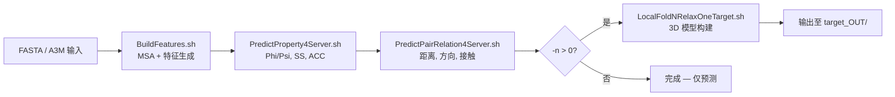

---
slug:2-quick-start
blog_type:normal
---


通过五个核心步骤，让 RaptorX-3DModeling 实现端到端运行——从裸 FASTA 文件到折叠的 3D 蛋白质结构。本指南将带你完成克隆仓库、安装依赖、配置路径、下载预训练模型以及执行首次预测。如果你需要深入了解每个模块存在的*原因*或它们之间的数据流向，请在完成本指南后跳转至[架构概览](4-architecture-overview)或[预测流水线数据流向](5-prediction-pipeline-data-flow)。

来源: [README.md](/README.md#L1-L200), [Server/RaptorXFolder.sh](/Server/RaptorXFolder.sh#L1-L50)

## 先决条件一览

开始之前，请确认你的运行环境满足以下基本要求：

| 需求 | 最低版本 | 用途 |
|---|---|---|
| **Linux**（推荐 CentOS 6+） | — | Shell 脚本依赖 bash |
| **CUDA + cuDNN** | CUDA 8–10.1, cuDNN 7–7.6.5 | 为 Theano 提供 GPU 加速 |
| **Anaconda / Miniconda** | Python 2.7 | 运行环境 |
| **GPU 内存** | ≥12 GB（针对 >1000 个残基的蛋白质） | 距离/方向预测 |
| **CPU 内存** | ≥10 GB（用于折叠大型蛋白质） | 3D 模型构建 |

RaptorX 同样兼容 Python 3 的 conda 虚拟环境——你可以通过 `conda create --name RaptorX python=2` 创建，并在继续操作前使用 `conda activate RaptorX` 激活它。

来源: [README.md](/README.md#L5-L15)

## 第 1 步 — 克隆仓库

```bash
git clone https://github.com/j3xugit/RaptorX-3DModeling.git $HOME/RaptorX-3DModeling
```

生成的目录结构包含**四个核心模块**和两个配置 Shell 脚本：

```
RaptorX-3DModeling/
├── BuildFeatures/          ← MSA 生成与输入特征提取
├── DL4DistancePrediction4/  ← 距离 / 方向 / 接触预测
├── DL4PropertyPrediction/   ← 属性预测 (SS, ACC, Phi/Psi)
├── Folding/                ← 基于预测结果构建 3D 模型
├── Server/                 ← 入口脚本 (RaptorXFolder.sh)
├── raptorx-path.sh         ← 内部路径导出
├── raptorx-external.sh     ← 外部工具/数据库路径（由你编辑）
├── example/                ← 示例 FASTA 及输出
└── params/                 ← GPU 机器列表、模型文件配置
```

来源: [README.md](/README.md#L17-L32), [raptorx-path.sh](/raptorx-path.sh#L1-L8)

## 第 2 步 — 安装 Python 与深度学习依赖

激活你的 conda 环境，然后按顺序安装以下包：

```bash
# 核心数值计算与序列化库
conda install numpy
conda install -c anaconda msgpack-python

# 生物信息学工具包
pip install biopython==1.76

# 可视化（可选，用于接触/距离图）
pip install Pillow

# 支持 GPU 的 Theano 1.0
conda install numpy scipy mkl
conda install theano pygpu

# 用于距离预测多进程的共享 ndarray
git clone https://github.com/crowsonkb/shared_ndarray.git
cd shared_ndarray && python setup.py install && cd ..
```

**CUDA 环境** — 导出根路径，以便 Theano 能够定位工具包和 cuDNN 头文件：

```bash
export CUDA_ROOT=/usr/local/cuda
```

请验证 `$CUDA_ROOT/include` 包含 cuDNN 头文件，且 `$CUDA_ROOT/lib64` 包含共享库。

来源: [README.md](/README.md#L33-L70)

## 第 3 步 — 安装外部工具与配置路径

### 3a — HHblits（MSA 生成必需）

安装 [HHsuite](https://github.com/soedinglab/hh-suite) 并从 [UniClust 归档](http://wwwuser.gwdg.de/~compbiol/uniclust/2020_03/)下载兼容的序列数据库，例如 `UniRef30_2020_03_hhsuite.tar.gz`。

### 3b — 可选的 MSA 来源

| 工具 | 用途 | 速度 |
|---|---|---|
| **Jackhmmer**（通过 EVcouplings） | 替代 MSA 方案，使用 UniRef90 | 慢 — 不推荐 |
| **MetaGenome**（metaclust_50.fasta） | 为远缘同源物增强 MSA | 慢 — 可选 |

### 3c — 编辑 `raptorx-external.sh`

打开 `RaptorX-3DModeling/raptorx-external.sh` 并**至少**更新 HHblits 的路径。该文件附带了一些占位值：

```bash
# raptorx-external.sh — 更新以下行
export HHDIR=/your/path/to/hhsuite-3.2.0-SSE2-Linux/
export HHDB=/your/path/to/UniRef30_2020_02/UniRef30_2020_02
```

其他变量（`MetaDB`、`JackDB`、`PDB70HHM`、`PDB70PDB`、`PDB70TPL`）仅在你使用宏基因组数据、jackhmmer 或比较建模时才需要——否则保持原样即可。

来源: [raptorx-external.sh](/raptorx-external.sh#L1-L24), [README.md](/README.md#L71-L95)

### 3d — 在 `.bashrc` 中持久化环境变量

将以下内容追加到你的 `~/.bashrc` 中：

```bash
export CUDA_ROOT=/usr/local/cuda/
export ModelingHome=$HOME/RaptorX-3DModeling/
. $ModelingHome/raptorx-path.sh
. $ModelingHome/raptorx-external.sh
```

然后使用 `source ~/.bashrc` 重新加载。`raptorx-path.sh` 脚本导出了四个模块主目录变量（`DistFeatureHome`、`DL4DistancePredHome`、`DL4PropertyPredHome`、`DistanceFoldingHome`）并扩展了 `PYTHONPATH`——这些变量几乎为该软件包中的每个脚本所必需。

来源: [raptorx-path.sh](/raptorx-path.sh#L1-L8), [README.md](/README.md#L280-L305)

## 第 4 步 — 下载预训练深度学习模型

模型文件较大（每个 100–200 MB），且**未**打包在仓库中。请从 [Zenodo](https://doi.org/10.5281/zenodo.4710337) 或 [RaptorX 服务器](http://raptorx.uchicago.edu/download/)下载它们。

| 包 | 数量 | 文件放置位置 |
|---|---|---|
| `RXDeepModels4DistOri-FM.tar.gz` | 6 个模型 (.pkl) | `$DL4DistancePredHome/models/` |
| `RXDeepModels4Property.tar.gz` | 7 个模型 (.pkl) | `$DL4PropertyPredHome/models/` |

解压后，请验证目录中包含 `.pkl` 文件。预测脚本引用的模型文件名定义在：

- **距离模型**：`DL4DistancePrediction4/params/ModelFile4PairwisePred.txt` — 引用 6 个自由模型 `.pkl` 文件以及基于模板的模型变体。
- **属性模型**：`DL4PropertyPrediction/params/ModelFile4PropertyPred.txt` — 引用 3 个 Phi/Psi 模型和 4 个 SS/ACC 模型。

来源: [README.md](/README.md#L96-L110), [DL4DistancePrediction4/params/ModelFile4PairwisePred.txt](/DL4DistancePrediction4/params/ModelFile4PairwisePred.txt#L1-L43), [DL4PropertyPrediction/params/ModelFile4PropertyPred.txt](/DL4PropertyPrediction/params/ModelFile4PropertyPred.txt#L1-L21)

## 第 5 步 — 运行首次预测

### 完整流水线：预测 + 折叠

单一入口点 `Server/RaptorXFolder.sh` 会按顺序编排所有四个模块。使用内置的示例蛋白质运行它：

```bash
cd $ModelingHome
Server/RaptorXFolder.sh -o example/ -n 40 -r 1 example/1pazA.fasta
```

示例输入 `1pazA.fasta` 包含一条 123 残基的假天青蛋白序列：

```
>1pazA
ENIEVHMLNKGAEGAMVFEPAYIKANPGDTVTFIPVDKGHNVESIKDMIPEGAEKFKSKINENYVLTVTQPGAYLVKCTPHYAMGMIALIAVGDSPANLDQIVSAKKPKIVQERLEKVIASAK
```

来源: [example/1pazA.fasta](/example/1pazA.fasta#L1-L3), [README.md](/README.md#L111-L135)

### 理解命令行选项

| 选项 | 含义 | 默认值 |
|---|---|---|
| `-o outDir` | 输出目录（内部会创建一个 `target_OUT/` 子文件夹） | 当前目录 |
| `-g gpu` | GPU 索引 (0–3)，或 `-1` 表示按可用显存自动选择 | `-1` |
| `-m MSAmethod` | 位掩码：1=属性用 HHblits，8=距离用 HHblits 3.0，16=宏基因组，4=jackhmmer | `9` (1+8) |
| `-n numDecoys` | 生成的 3D 初始模型数量；`≤0` 则跳过折叠 | `120` |
| `-r runningMode` | `0`=仅折叠，`1`=折叠 + 松弛 | `0` |
| `-l maxLen2BeFolded` | 折叠的最大序列长度 | `1050` |
| `-c` | 仅以 CASP 格式输出接触（跳过距离概率） | 关闭 |
| `-R remoteAccount` | 通过 scp/ssh 在远程机器上运行折叠 | 本地 |

来源: [Server/RaptorXFolder.sh](/Server/RaptorXFolder.sh#L51-L120)

### 流水线执行流程

下图展示了 `RaptorXFolder.sh` 对 FASTA 输入在内部触发的流程：



每个阶段都会检查非零退出码并在失败时停止，因此你可以通过读取打印到 stderr 的 `ERROR:` 消息来定位是哪个模块出错了。

来源: [Server/RaptorXFolder.sh](/Server/RaptorXFolder.sh#L130-L200)

### 解读输出

成功运行后，输出目录 `target_OUT/` 包含以下子文件夹：

| 子文件夹 | 内容 |
|---|---|
| `target_contact/` | 用于距离预测的 MSA 和输入特征 |
| `target_thread/` | 用于属性预测的 MSA (.a3m)、HMM (.hhm)、HHR 和 TGT 文件 |
| `DistancePred/` | 预测的距离/方向 `.pkl`、CASP `.rr`、接触图 `.txt`、可视化 `.png` |
| `PropertyPred/` | 预测的 Phi/Psi、SS、ACC (`.predictedProperties.pkl`) |
| `target-RelaxResults/` | 生成的 3D 初始模型 (`.pdb` 或 `.pdb.gz`) |
| `target-SpickerResults/` | 聚类模型、按质量排名的中心点 (`.quality.pdb.gz`)、`ClusteringSummary.txt` |

对于示例蛋白质，40 个松弛后的初始模型会生成在 `1pazA-RelaxResults/` 中，排名前 10 的聚类中心出现在 `1pazA-SpickerResults/` 中。最佳模型通常为 `1pazA_center0.quality.pdb.gz`。

来源: [README.md](/README.md#L137-L155), [example/1pazA_OUT-example](/example/1pazA_OUT-example)

## 常见使用模式

### 仅预测（无 3D 折叠）

跳过计算量大的折叠步骤——当你只需要接触、距离或二级结构时很有用：

```bash
Server/RaptorXFolder.sh -n 0 example/1pazA.fasta
```

### 使用已有的 MSA

如果你已经拥有 a3m 格式的比对（第一个序列必须是无空位的查询序列），请使用 `-m 0` 传入：

```bash
Server/RaptorXFolder.sh -m 0 BuildFeatures/example/1pazA.a3m
```

<CgxTip>当设置 `-m 0` 时，文件扩展名必须为 `.a3m`——脚本会据此检测并完全绕过 MSA 生成。使用任何其他扩展名都会触发错误。</CgxTip>

### 避免使用慢速的 Jackhmmer

默认的 `-m 9` 仅使用 HHblits（速度快）。如果你想要宏基因组增强但不使用 jackhmmer：

```bash
Server/RaptorXFolder.sh -m 25 example/1pazA.fasta    # 1 + 8 + 16 = HHblits + 宏基因组
```

来源: [README.md](/README.md#L118-L135), [Server/RaptorXFolder.sh](/Server/RaptorXFolder.sh#L70-L100)

## 故障排除

| 症状 | 可能原因 | 解决方案 |
|---|---|---|
| `ERROR: Please set environmental variable ModelingHome` | 环境未加载 | 运行 `source ~/.bashrc` 或手动导出 `ModelingHome` |
| `ERROR: failed to run BuildFeatures.sh` | 缺少 HHblits 路径或数据库 | 验证 `$HHDIR/bin/hhblits` 存在且 `$HHDB` 指向数据库 |
| `ImportError: No module named theano` | conda 环境错误 | 激活 RaptorX 环境：`conda activate RaptorX` |
| 大蛋白质出现 GPU 显存不足 | 序列 >1000 残基需要 >12 GB 显存 | 使用 `-g` 选择更大的 GPU 或使用 `-l` 减少序列长度 |
| `msgpack` 导入失败 | 通过 pip 而非 conda 安装 | `conda install -c anaconda msgpack-python` |
| `biopython` 版本不兼容 | Python 2.7 上的版本 >1.76 | `pip install biopython==1.76` |

来源: [Server/RaptorXFolder.sh](/Server/RaptorXFolder.sh#L130-L195), [BuildFeatures/BuildFeatures.sh](/BuildFeatures/BuildFeatures.sh#L1-L15)

## 接下来做什么？

现在你已经完成了一次完整预测，可以深入探索该系统：

1. **理解架构** — [架构概览](4-architecture-overview) 解释了四个模块如何交互以及流水线如此构建的原因。
2. **追踪流水线中的数据** — [预测流水线数据流向](5-prediction-pipeline-data-flow) 映射了每一个中间文件格式与转换过程。
3. **跨机器扩展** — [多机分布式执行](13-multi-machine-distributed-execution) 展示了如何在独立的服务器上拆分 MSA 生成、GPU 预测和折叠。
4. **自定义网络** — [自定义网络集成](15-custom-network-integration) 记录了如何接入你自己的深度学习架构。