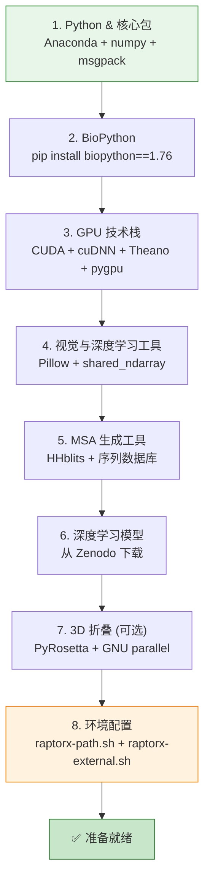

---
slug:3-environment-setup
blog_type:normal
---


RaptorX-3DModeling 是一个用于蛋白质接触/距离/方向预测及 3D 结构折叠的深度学习流水线。正确配置环境是运行任何预测之前最关键的一步。本页将引导你了解每一个前置条件、配置文件和验证步骤，确保该流水线能够端到端顺利执行，不出意外。

## 系统要求

RaptorX 主要为 **Linux** 系统设计，并已在 **CentOS (>6.0)** 系统上使用 **bash** shell 通过测试。虽然代码可以在其他 Linux 发行版上运行，但 CentOS 是参考平台。硬件需求随蛋白质长度而变化——短蛋白质（<300 个残基）需要适度的资源，而大蛋白质（>1000 个残基）则需要大量的 GPU 和 CPU 内存。

| 资源 | 最低要求 | 推荐配置 | 备注 |
|---|---|---|---|
| **操作系统** | CentOS 6+ | CentOS 7+ | 任何带有 bash 的 Linux 均可能运行 |
| **Python** | 2.7 | 2.7 (通过 Anaconda) | 计划支持 Python 3，但目前尚不可用 |
| **GPU** | 1× GPU, 8 GB 显存 | 1× GPU, ≥12 GB 显存 | 用于距离/方向预测 |
| **CPU 内存** | 8 GB | ≥10 GB | 用于折叠大蛋白质（>1000 个残基） |
| **磁盘** | 10 GB | 50 GB+ | 深度模型文件每个 100–200 MB；数据库较大 |

<CgxTip>对于超过 1000 个残基的蛋白质，预测需要 >12 GB 的 GPU 内存，且折叠单个 3D 模型会消耗约 10 GB 的 CPU 内存。请据此规划你的硬件配置。</CgxTip>

来源: [README.md](/README.md#L1-L20), [README.md](/README.md#L160-L171)

## 前置条件安装流程

安装遵循严格的依赖链。每一层都依赖于前一层——切勿跳过，请按顺序安装。



来源: [README.md](/README.md#L46-L119), [README.md](/README.md#L119-L143)

## 第 1 步 — Python 环境与核心包

RaptorX 要求使用 **Python 2.7**。最稳妥的方式是使用 Anaconda 或 Miniconda 创建一个隔离环境，以防止与系统中任何 Python 3 安装发生冲突。

**如果你尚未安装 Anaconda**，请从 [docs.conda.io](https://docs.conda.io/en/latest/miniconda.html) 下载并安装适用于 Python 2.7 的 Miniconda。

**如果你已有适用于 Python 3 的 Anaconda/Miniconda**，请创建一个专用的虚拟环境：

```bash
conda create --name RaptorX python=2
conda activate RaptorX
```

进入 `RaptorX` 环境后，安装核心的数值计算和序列化包：

```bash
conda install numpy
conda install -c anaconda msgpack-python
```

> **重要提示**：请通过 `conda` 而非 `pip` 安装 `msgpack-python`。已知在此环境下使用 pip 安装会失败。

来源: [README.md](/README.md#L48-L59)

## 第 2 步 — Biopython

预测模块和 3D 模型构建模块均需使用 Biopython。请将版本固定为 **1.76**——更新的版本与 Python 2.7 不兼容。

```bash
pip install biopython==1.76
```

来源: [README.md](/README.md#L61-L65)

## 第 3 步 — GPU 计算技术栈（CUDA, cuDNN, Theano）

距离和方向预测依赖于支持 GPU 加速的 **Theano 1.0**。该层需要按顺序安装三个组件。

### 3a — CUDA 工具包与 cuDNN

请确认你的机器上已安装 CUDA 工具包和 cuDNN 库。设置环境变量：

```bash
export CUDA_ROOT=/usr/local/cuda
```

确认 cuDNN 头文件和库文件位于预期位置：
- 头文件：`$CUDA_ROOT/include/`
- 库文件：`$CUDA_ROOT/lib64/`

**已测试版本**：Theano 1.04 搭配 CUDA 8–10.1 及 cuDNN 7–7.6.5。其他组合可能可行，但未经测试。

### 3b — Theano 与 pygpu

```bash
conda install numpy scipy mkl
conda install theano pygpu
```

<CgxTip>理论上 Theano 可以在纯 CPU 模式下运行，但 RaptorX 中的多个预测脚本默认 GPU 可用。若要纯 CPU 执行，需对代码进行小幅修改——这不是受支持的配置。</CgxTip>

来源: [README.md](/README.md#L69-L82)

## 第 4 步 — 可视化与深度学习工具

### Pillow

用于将预测的接触图和距离图渲染为图像。

```bash
pip install Pillow
```

### shared_ndarray

距离/方向预测的深度学习模型训练和运行时需要此包。该包在 conda 或 pip 上不可用——需从源码安装：

```bash
git clone https://github.com/crowsonkb/shared_ndarray.git
cd shared_ndarray/
python setup.py install
```

来源: [README.md](/README.md#L69-L89)

## 第 5 步 — MSA 生成工具与数据库

多序列比对（MSA）是所有预测的基础输入。RaptorX 支持两种 MSA 生成器——**HHblits**（快速，必选）和 **Jackhmmer**（慢速，可选）。

### 5a — HHblits（必选）

从 [github.com/soedinglab/hh-suite](https://github.com/soedinglab/hh-suite) 安装 HHsuite。然后下载兼容的序列数据库——例如，从 [UniClust 发布页面](http://wwwuser.gwdg.de/~compbiol/uniclust/2020_03/) 下载 **UniRef30_2020_03**。将数据库解压到指定位置。

### 5b — 通过 EVcouplings 使用 Jackhmmer（可选，不推荐）

EVcouplings 提供基于 Jackhmmer 的 MSA 生成功能，但它运行在 **Python 3** 上（与 RaptorX 的 Python 2.7 环境分离），且速度明显较慢：

```bash
git clone https://github.com/debbiemarkslab/EVcouplings.git
conda create -n evfold anaconda python=3
conda activate evfold
cd EVcouplings/
python setup.py install
```

你还需要来自 UniProt 的 **uniref90.fasta** 数据库。如果没有 Jackhmmer，你仍可使用仅 HHblits 的 MSA 运行 RaptorX（使用 `-m 9` 或 `-m 25`）。

### 5c — 宏基因组数据（可选）

从 [metaclust.mmseqs.org](https://metaclust.mmseqs.org/current_release/) 下载 `metaclust_50.fasta` 并将其安装到已知路径。这能丰富 MSA 信息，从而提升困难靶标的预测质量。

### 5d — 配置外部路径

**此步骤至关重要。** 编辑 `RaptorX-3DModeling/raptorx-external.sh` 以设置所有数据库和工具的路径。默认文件包含占位符路径，必须将其更新为与你的安装路径相匹配：

| 变量 | 用途 | 是否必选？ |
|---|---|---|
| `HHDIR` | HHsuite 安装文件夹 | **是** |
| `HHDB` | HHblits 的 UniRef30 数据库路径 | **是** |
| `MetaDB` | 宏基因组 fasta 文件路径 | 否 |
| `JackDB` | Jackhmmer 的 UniRef90 数据库路径 | 否 |
| `PDB70HHM` | 用于基于模板建模的 PDB70 HHM 文件 | 否 |
| `PDB70PDB` | 用于 RosettaCM/Modeller 的 PDB70 链 PDB 文件 | 否 |
| `PDB70TPL` | 用于 RaptorXCM 的 PDB70 .tpl.pkl 文件 | 否 |

来源: [raptorx-external.sh](/raptorx-external.sh#L1-L24), [README.md](/README.md#L91-L117)

## 第 6 步 — 下载预训练深度学习模型

由于模型参数文件较大（每个 100–200 MB），因此**未包含**在代码仓库中。请从 [Zenodo](https://doi.org/10.5281/zenodo.4710337) 或 [raptorx.uchicago.edu/download/](http://raptorx.uchicago.edu/download/) 下载。

| 包 | 内容 | 目标位置 |
|---|---|---|
| `RXDeepModels4DistOri-FM.tar.gz` | 用于接触/距离/方向预测的 6 个模型 | `$DL4DistancePredHome/models/`（`.pkl` 文件） |
| `RXDeepModels4Property.tar.gz` | 用于 Phi/Psi、SS、ACC 预测的 7 个模型 | `$DL4PropertyPredHome/models/`（`.pkl` 文件） |

解压后，请确认两个目标目录中都存在 `.pkl` 模型文件。模型文件缺失会导致预测脚本失败，并给出难以理解的错误信息。

来源: [README.md](/README.md#L119-L127)

## 第 7 步 — 3D 模型构建工具（可选）

**仅当你需要构建 3D 模型时**，才需要这些包。如果你的目标仅仅是预测接触、距离、方向、角度、二级结构或溶剂可及性，请跳过此步骤。

### PyRosetta

从 [pyrosetta.org](http://www.pyrosetta.org/dow) 下载 **Python 2.7** 版本。解压并安装：

```bash
cd PyRosetta4.Release.python27.linux.release-224/setup/
python setup.py install
```

### GNU Parallel（推荐）

多个折叠脚本——`ParallelFoldNRelaxOneTarget.sh` 和 `SRunFoldNRelaxOneTarget.sh`——使用 GNU parallel 在多个 CPU 或机器间分发 decoy 生成任务。检查其可用性：

```bash
which parallel
```

若未安装，你仍可使用 `LocalFoldNRelaxOneTarget.sh` 进行折叠，该脚本不需要 GNU parallel。

来源: [README.md](/README.md#L129-L143)

## 第 8 步 — 环境变量配置

RaptorX 依赖一组环境变量来定位其自身模块、外部工具和数据库。配置被拆分到两个 shell 脚本中，你必须在 shell 初始化时 source 它们。

### 8a — 理解配置文件

**`raptorx-path.sh`** 定义了相对于 `$ModelingHome` 的内部模块路径：

| 变量 | 解析为 |
|---|---|
| `DistFeatureHome` | `$ModelingHome/BuildFeatures/` |
| `DL4DistancePredHome` | `$ModelingHome/DL4DistancePrediction4/` |
| `DL4PropertyPredHome` | `$ModelingHome/DL4PropertyPrediction/` |
| `DistanceFoldingHome` | `$ModelingHome/Folding/` |

它还会将 `$ModelingHome` 添加到 `PYTHONPATH`，将 `$ModelingHome/bin` 添加到 `PATH`。

**`raptorx-external.sh`** 定义了外部工具和数据库（HHblits、序列数据库、宏基因组数据等）的路径。你必须编辑此文件，使其与你系统上的安装路径相匹配。

来源: [raptorx-path.sh](/raptorx-path.sh#L1-L8), [raptorx-external.sh](/raptorx-external.sh#L1-L24)

### 8b — 添加至 .bashrc

打开 `~/.bashrc` 并追加以下内容，将 `ModelingHome` 路径调整为你实际的克隆位置：

```bash
export CUDA_ROOT=/usr/local/cuda/
export ModelingHome=$HOME/RaptorX-3DModeling/

. $ModelingHome/raptorx-path.sh
. $ModelingHome/raptorx-external.sh
```

保存后，重载你的 shell：

```bash
source ~/.bashrc
```

**如果你使用 csh/tcsh**，请将等效的 `setenv` 和 `source` 命令添加到 `~/.cshrc`。请注意，此包中的大多数脚本均仅在 bash 中经过专门测试。

来源: [README.md](/README.md#L205-L224)

### 8c — GPU 机器配置（用于分布式执行）

如果你计划在远程机器上运行 GPU 预测，请创建 `params/GPUMachines.txt` 文件。每行包含三个字段：**机器名**、**GPU 内存类别**（`SmallRAM` ≤12 GB 或 `LargeRAM` >12 GB）以及**启用状态**（`on`/`off`）：

```
raptorx9.uchicago.edu  LargeRAM  on
jinbo@raptorx7.uchicago.edu  SmallRAM  off
```

如果此文件存在，且你还希望使用**本地** GPU，则必须显式添加你的本地机器：

```
name-of-your-local-machine  SmallRAM  on
```

入口脚本 `Server/RaptorXFolder.sh` 会自动 source 这两个路径脚本，并检查 `$ModelingHome/params/GPUMachines.txt` 是否存在。当该文件不存在时，所有 GPU 任务将在本地运行。

来源: [README.md](/README.md#L296-L304), [params/GPUMachines-example.txt](/params/GPUMachines-example.txt#L1-L8), [Server/RaptorXFolder.sh](/Server/RaptorXFolder.sh#L1-L12)

## 验证 — 测试你的安装

完成所有步骤后，请使用代码仓库中提供的示例蛋白质运行一次快速的端到端测试。

### 测试 1：MSA 与特征生成

```bash
BuildFeatures/GenDistFeaturesFromMSA.sh -o Test_Feat BuildFeatures/example/1pazA.a3m
```

预期输出：`Test_Feat/` 目录中的三个文件——`1pazA.inputsFeatures.pkl`、`1pazA.extraCCM.pkl` 和 `1pazA.a2m`。

### 测试 2：距离预测

```bash
DL4DistancePrediction4/Scripts/PredictPairwiseRelation4OneInput.sh -d ./Test_Dist Test_Feat/1pazA.inputsFeatures.pkl
```

预期输出：`Test_Dist/1pazA.predictedDistMatrix.pkl`。

### 测试 3：接触矩阵导出

```bash
DL4DistancePrediction4/Scripts/PrintContactPrediction.sh Test_Dist/1pazA.predictedDistMatrix.pkl
```

预期输出：两个文本文件——`1pazA.CASP.rr` 和 `1pazA.CM.txt`。

### 测试 4：通过 RaptorXFolder.sh 运行完整流水线

```bash
Server/RaptorXFolder.sh -o example/ -n 40 -r 1 example/1pazA.fasta
```

预期输出：一个 `1pazA_OUT/` 目录，包含子文件夹 `1pazA_contact/`、`1pazA_thread/`、`DistancePred/`、`PropertyPred/`、`1pazA-RelaxResults/` 和 `1pazA-SpickerResults/`。

来源: [README.md](/README.md#L306-L325), [example/1pazA.fasta](/example/1pazA.fasta#L1-L3)

## 故障排除

| 症状 | 可能原因 | 解决方案 |
|---|---|---|
| `ERROR: Please set environmental variable ModelingHome` | 未 source `.bashrc` 或变量缺失 | 运行 `source ~/.bashrc` 并使用 `echo $ModelingHome` 验证 |
| `ERROR: invalid folder $HHDIR` | `raptorx-external.sh` 中的 `HHDIR` 指向错误路径 | 编辑 `raptorx-external.sh`，填入你实际的 HHsuite 安装位置 |
| `ERROR: damaged sequence database` | `HHDB` 路径不正确或数据库未解压 | 验证路径并确保数据库位置存在 `_hhm.ffindex` 文件 |
| `msgpack` 的 ImportError | 通过 pip 而非 conda 安装 | `pip uninstall msgpack-python && conda install -c anaconda msgpack-python` |
| Biopython 版本错误 | 在 Python 2.7 下安装了 >1.76 的版本 | `pip install biopython==1.76` |
| 大蛋白质出现 GPU 内存错误 | GPU 显存 <12 GB | 使用 `-h GPUMachines.txt` 路由至 LargeRAM GPU，或缩减输入大小 |
| 找不到 `.pkl` 模型文件 | 未下载深度模型或放置目录错误 | 从 Zenodo 下载并将 `.pkl` 文件放入 `$DL4DistancePredHome/models/` 和 `$DL4PropertyPredHome/models/` |

来源: [BuildFeatures/BuildMSAs.sh](/BuildFeatures/BuildMSAs.sh#L1-L21), [BuildFeatures/BuildFeatures.sh](/BuildFeatures/BuildFeatures.sh#L1-L11), [DL4DistancePrediction4/Scripts/PredictPairRelation4Server.sh](/DL4DistancePrediction4/Scripts/PredictPairRelation4Server.sh#L1-L11)

## 后续步骤

在环境完全配置并验证完毕后，你已准备好深入探索该流水线：

- **[快速开始](2-quick-start)** — 端到端运行你的首次预测
- **[架构概览](4-architecture-overview)** — 了解四大主要模块的连接方式
- **[MSA 与特征生成](6-msa-and-feature-generation)** — 深入了解输入准备工作