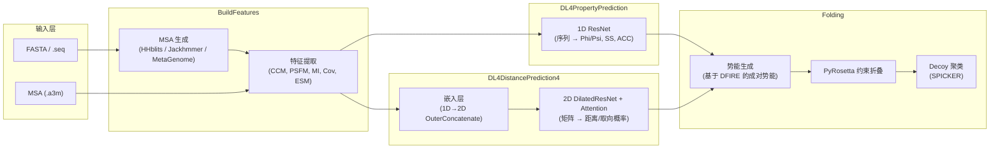
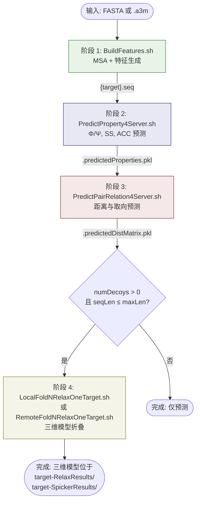

---
slug:4-architecture-overview
blog_type:normal
---

RaptorX-3DModeling 是一个**基于深度学习的蛋白质结构预测系统**，能够将单条氨基酸序列转化为完整的三维原子模型。该系统实现了 *Distance-based protein folding powered by deep learning* (PNAS, 2019) 中描述的里程碑式方法——通过深度卷积残差网络预测残基间距离和取向的概率分布，随后利用约束优化从这些预测结果中折叠出三维模型。系统架构由四个自治模块组成，这些模块通过一个确定性的 shell 脚本流水线连接，每个模块都拥有独立的深度模型检查点注册表、配置命名空间和执行入口。

## 系统架构概览

下图展示了 RaptorX 四个主要模块的顶层数据流，以及连接它们的关键中间产物：

## 四大模块

RaptorX 的代码库被划分为四个顶层目录，每个目录映射到预测流水线中一个语义明确的阶段。编排脚本 `Server/RaptorXFolder.sh` 以严格的顺序调用它们，并在每个边界处进行显式的错误检查。

来源: [RaptorXFolder.sh](/Server/RaptorXFolder.sh#L87-L209), [README.md](/README.md#L1-L50)

| 模块 | 目录 | 职责 | 主要输出 | 深度学习框架 |
|---|---|---|---|---|
| **BuildFeatures** | `BuildFeatures/` | MSA 生成与成对/序列特征提取 | `.inputFeatures.pkl`, `.a2m`, `.hhm` | 无（生物信息学工具） |
| **DL4PropertyPrediction** | `DL4PropertyPrediction/` | 局部结构属性预测 (Φ/Ψ, SS, ACC) | `.predictedProperties.pkl` | Theano + 1D ResNet |
| **DL4DistancePrediction4** | `DL4DistancePrediction4/` | 残基间距离与取向预测 | `.predictedDistMatrix.pkl` | Theano + 2D DilatedResNet |
| **Folding** | `Folding/` | 根据预测势能构建三维模型 | PDB decoys + SPICKER clusters | PyRosetta |

来源: [raptorx-path.sh](/raptorx-path.sh#L1-L8)

### 模块 1: BuildFeatures — MSA 与特征生成

该模块是 RaptorX 的数据工程骨干。它接受原始 FASTA 序列或 a3m 格式的预构建 MSA，然后生成下游两个深度学习模块所需的所有输入特征。入口点 `BuildFeatures.sh` 委托给两个子阶段：

1. **MSA 生成** (`BuildMSAs.sh`) — 使用 HHblits (UniRef30)、Jackhmmer (UniRef90) 以及针对宏基因数据的 hmmsearch (MetaClust) 的可配置组合来搜索序列数据库。MSA 方法由位掩码控制：`1` = 用于属性预测的 HHblits，`8` = 用于距离预测的 HHblits 3.0，`4` = Jackhmmer，`16` = 宏基因组增强。

2. **特征提取** (`GenDistFeatures4OneProtein.sh`) — 从生成的 MSA 中计算共演化特征，包括 CCMpred 原始/归一化共演化矩阵、位置特异性频率矩阵 (PSFM)、互信息 (MI)、协方差矩阵以及可选的 ESM-2 嵌入。这些特征被序列化为 `.pkl` 文件并存入 `target_contact/` 子目录。

来源: [BuildFeatures.sh](/BuildFeatures/BuildFeatures.sh#L1-L119)

### 模块 2: DL4PropertyPrediction — 局部结构属性

该模块预测**逐残基** (1D) 的结构属性：骨架二面角 Φ/Ψ（使用冯·米塞斯分布）、二级结构（3分类和8分类，离散分类）以及溶剂可及性（离散分类）。其架构是一个运行在从 MSA 谱中提取的序列特征上的 **1D ResNet**：

- **网络变体**：`ResNet1D`、`ResNet1DV21`、`ResNet1DV22` — 区别在于残差块内批归一化的位置
- **标签类型**：`vonMise2d` (Φ/Ψ 角度)、`Discrete3C`/`Discrete8C` (SS)、`Discrete2C` (ACC) — 每种都有专属的输出头（角度使用冯·米塞斯分布，离散分类使用 softmax）
- **模型数量**：7 个训练好的检查点（Φ/Ψ、SS、ACC 预测器）

`Model4PropertyPrediction.py` 中的 `ResNet4Properties` 类编排了完整的前向传播：1D ResNet 骨干 → 逐响应预测头 → 拼接输出张量。

来源: [Model4PropertyPrediction.py](/DL4PropertyPrediction/Model4PropertyPrediction.py#L1-L150), [config.py](/DL4PropertyPrediction/config.py#L1-L121)

### 模块 3: DL4DistancePrediction4 — 距离与取向

这是 RaptorX 的**核心预测模块**。它预测残基间距离和取向的**成对** (2D) 概率分布。该架构采用两阶段设计：

1. **1D 卷积 → 2D 嵌入**：1D 卷积通路处理序列特征（序列 + PSFM），随后通过 **OuterConcatenate** 投影为 2D 矩阵——即拼接每个残基对 (i,j) 的行与列表示。此步骤同时捕获了序列上下文与成对耦合。

2. **2D DilatedResNet + 注意力**：一个深度 2D 残差网络处理成对矩阵。关键的架构创新包括：
   - **空洞卷积** (`DilatedResNet2D`)，可在不增加参数量的情况下呈指数级扩大感受野，从而实现长程接触检测
   - **挤压-激励注意力** (`AttentionLayer`)，采用全局平均/最大池化 → 全连接 → 通道重加权，应用于特定的残差块之后
   - **按距离范围独立训练** — 为短/中/长程接触设置不同的逻辑回归头

预测的响应包括 Cβ-Cβ 距离（主要）、Cα-Cα 距离、残基间取向（Ω、θ、φ 二面角）以及氢键指示符。在服务器模式预测期间，会集成 **6 个训练好的模型检查点**。

来源: [Model4DistancePrediction.py](/DL4DistancePrediction4/Model4DistancePrediction.py#L1-L200), [DilatedResNet4Distance.py](/DL4DistancePrediction4/DilatedResNet4Distance.py#L1-L200), [AttentionLayer.py](/DL4DistancePrediction4/AttentionLayer.py#L1-L200), [config.py](/DL4DistancePrediction4/config.py#L1-L200)

### 模块 4: Folding — 三维模型构建

折叠模块利用 **PyRosetta** 约束优化，将预测的距离/取向概率和 Φ/Ψ 角度分布转化为原子的三维坐标：

1. **势能生成** (`GenPairwisePotentialFromPrediction.py`) — 将预测的距离概率分布转换为基于 DFIRE 的成对距离势能。α 参数（默认 1.61）控制势能强度的缩放。

2. **约束折叠** — PyRosetta 最小化组合能量函数：预测距离势能 + 预测 Φ/Ψ 角度约束 + Rosetta 原生能量项。生成多个独立的 decoy（默认 120 个），并支持可选的随机扰动。

3. **弛豫** (可选) — 完整的 Rosetta 弛豫可消除空间位阻并优化侧链堆积。此过程计算成本较高（约为折叠时间的 3-4 倍），但能显著提升模型质量。

4. **Decoy 聚类** (SPICKER) — 通过在结构空间中进行基于密度的聚类，从 decoy 集合中挑选最终模型。

该模块支持多种执行后端：顺序执行 (`FoldNRelaxOneTarget.sh`)、GNU 并行 (`ParallelFoldNRelaxOneTarget.sh`)、Slurm (`SlurmFoldNRelaxOneTarget.sh`) 以及通过 SSH/rsync 的远程执行 (`RemoteFoldNRelaxOneTarget.sh`)。

来源: [LocalFoldNRelaxOneTarget.sh](/Folding/LocalFoldNRelaxOneTarget.sh#L1-L159), [GenDistPotential4Threading.sh](/Folding/GenDistPotential4Threading.sh#L1-L62)

## 深度学习架构细节

下表总结了两个预测网络之间的关键架构差异：

| 方面 | 属性预测 (1D) | 距离预测 (2D) |
|---|---|---|
| **输入** | 序列特征 (L × C_seq) | 序列 + 成对特征 (L × L × C_pair) |
| **骨干** | `ResNet1D` | `DilatedResNet2D` |
| **卷积维度** | 1D（沿序列方向） | 2D（在残基对矩阵上） |
| **空洞率** | 不适用 | 呈指数级增长的空洞率 |
| **注意力** | 无 | 挤压-激励 (AvgPool + MaxPool → FC → 重加权) |
| **嵌入** | 直接序列输入 | 1D 卷积 → OuterConcatenate → 2D 矩阵 |
| **输出头** | 多任务 (Φ/Ψ, SS, ACC) | 逐响应 (CbCb, CaCa, 取向) |
| **损失函数** | 冯·米塞斯 (角度)，交叉熵 (离散) | 带有范围依赖权重的加权交叉熵 |
| **批归一化** | 每个残差块 1 或 2 个（可配置） | 每个残差块 1 或 2 个（可配置） |
| **模型文件** | 7 个检查点 | 6 个检查点 |

来源: [ResNet4Property.py](/DL4PropertyPrediction/ResNet4Property.py#L1-L150), [ResNet4Distance.py](/DL4DistancePrediction4/ResNet4Distance.py#L1-L100), [DilatedResNet4Distance.py](/DL4DistancePrediction4/DilatedResNet4Distance.py#L1-L200)

## 流水线编排

主编排器 `Server/RaptorXFolder.sh` 将完整的预测流水线编码为具有严格快速失败语义的 shell 脚本。每次模块调用后都会进行退出码检查，并验证预期输出文件是否存在。流水线分四个阶段进行：

**关键编排细节：**
- 默认情况下 GPU 选择是自动的 (`-g -1`)，会选择具有最大可用内存的 GPU
- 流水线可以跨机器拆分：预测在一台 GPU 服务器上运行，而折叠通过 `-R remoteAccountInfo` 在远程 CPU 集群上运行
- 当指定 `-n 0` 时，将完全跳过折叠（仅预测模式）
- 折叠的序列长度限制可通过 `-l` 配置（默认 1050 个残基）

来源: [RaptorXFolder.sh](/Server/RaptorXFolder.sh#L87-L209)

## 环境配置

RaptorX 的运行时环境通过两个互补的 shell 脚本进行配置：

- **`raptorx-path.sh`** — 派生自 `ModelingHome`（代码库根目录）的内部模块路径。定义了 `DistFeatureHome`、`DL4DistancePredHome`、`DL4PropertyPredHome`、`DistanceFoldingHome`，并扩展了 `PYTHONPATH` 和 `PATH`。

- **`raptorx-external.sh`** — 每次安装时必须配置的外部工具和数据库路径。包括 HHblits 安装路径 (`HHDIR`)、UniRef30 数据库 (`HHDB`)、宏基因数据 (`MetaDB`)、Jackhmmer UniRef90 数据库 (`JackDB`)，以及用于基于模板建模的可选 PDB70 数据库。

来源: [raptorx-path.sh](/raptorx-path.sh#L1-L8), [raptorx-external.sh](/raptorx-external.sh#L1-L24)

## 输出目录结构

对于目标蛋白质，所有结果都组织在 `target_OUT/` 目录下，包含以下规范子目录：

| 目录 | 内容 |
|---|---|
| `target_contact/` | MSA、HHM 文件以及为距离预测提取的输入特征 |
| `target_thread/` | 用于 Φ/Ψ 预测和基于线程建模的文件 |
| `DistancePred/` | 预测的距离/取向/接触矩阵及可视化 |
| `PropertyPred/` | 预测的 Φ/Ψ 角度、二级结构和溶剂可及性 |
| `target-RelaxResults/` | 所有生成的三维 decoy PDB 文件 |
| `target-SpickerResults/` | 用于挑选最终代表模型的聚类结果 |

来源: [README.md](/README.md#L100-L130)

## 支撑基础设施

除四个核心模块外，还有多个支撑目录提供共享实用工具：

- **`Common/`** — 用于 PDB/cIF 操作、距离矩阵计算、HHM/TPL/TGT 文件解析、序列处理以及特征格式转换 (HHM→TGT, TGT→PKL) 的共享 Python 工具
- **`Alignment/`** — 用于基于模板建模流程的比对质量评估、评分和简化工具
- **`Utils/`** — 领域模型组装、HHpred 集成、Modeller/RosettaCM 封装，以及最终模型的误差估计
- **`params/`** — 用于分布式执行的 GPU 机器配置文件

来源: [LoadTPLTGT.py](/Common/LoadTPLTGT.py#L1-L80), [FeatureUtils.py](/DL4DistancePrediction4/FeatureUtils.py#L1-L80)

<CgxTip>具有指数级增长空洞率的 2D DilatedResNet 是一项关键架构创新，使 RaptorX 能够捕获长程接触——这是三维结构最具信息量的信号。在感受野随深度线性增长的标准 ResNet 中无法实现这一点，而空洞卷积实现了指数级的感受野增长，使得第 10 层已经能够“看到”相距 50+ 个残基的位置。这至关重要，因为有效的残基间接触通常在序列中跨越数百个位置。</CgxTip>

<CgxTip>RaptorX 的流水线被刻意设计为 shell 脚本编排，而非单一的 Python 进程。这一设计选择启用了关键的部署模式：在一台机器上运行 GPU 密集型预测（阶段 1-3），而在另一台机器上运行 CPU 密集型折叠（阶段 4），并通过 `RemoteFoldNRelaxOneTarget.sh` 自动传输数据。`-R raptorx@server:workdir/` 标志可激活此分布式模式，无需手动复制文件。</CgxTip>

## 接下来去哪

既然你已经了解了四模块架构和数据流，以下页面将深入探讨每个组件：

- **[预测流水线数据流](5-prediction-pipeline-data-flow)** — 追踪每个流水线边界的确切文件格式和数据转换
- **[MSA 与特征生成](6-msa-and-feature-generation)** — 深入探讨 BuildFeatures 内部原理、MSA 策略和特征通道组成
- **[距离与取向预测](7-distance-and-orientation-prediction)** — 2D DilatedResNet 架构与预测工作流的详细解析
- **[用于距离预测的 ResNet](10-resnet-for-distance-prediction)** — 残差网络构建块的逐层规范
- **[多机分布式执行](13-multi-machine-distributed-execution)** — 跨异构硬件配置拆分的 GPU/CPU 部署