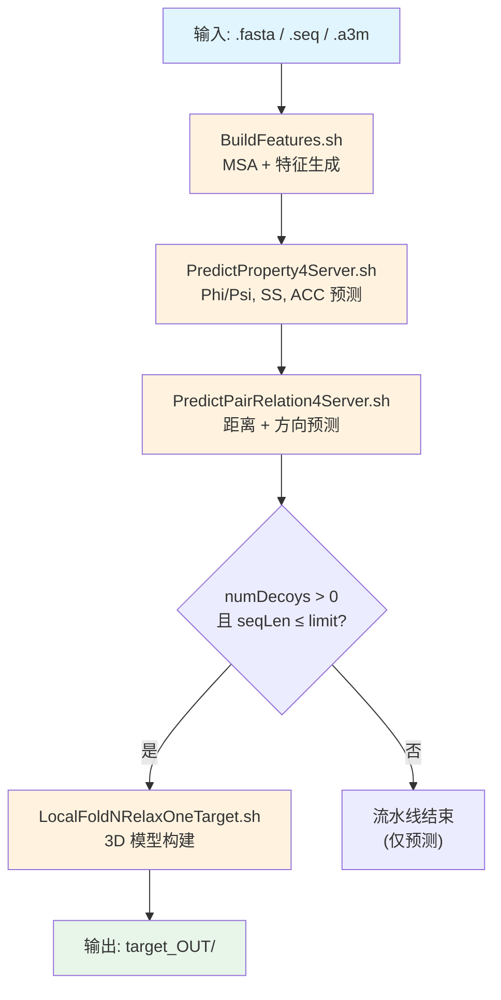
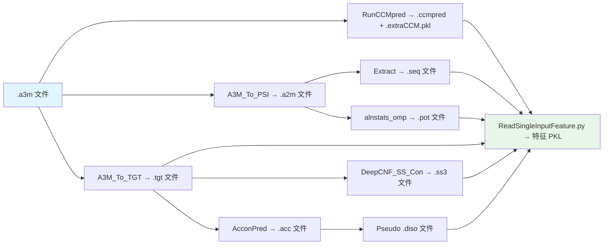
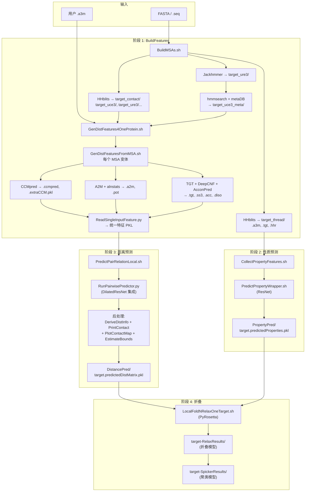

---
slug:5-prediction-pipeline-data-flow
blog_type:normal
---


RaptorX 预测流水线通过四个紧密协调的阶段，将单个蛋白质序列转换为完整的 3D 结构模型：**MSA 生成**、**特征提取**、**深度学习预测**和**折叠**。每个阶段都会产生明确的中间产物供下一阶段使用，从而形成一种线性但存在分支的数据流，其中多个 MSA 来源先汇聚成统一的特征表示，随后再次分叉为平行的距离和性质预测路径。

## 流水线概述

顶层协调器 `RaptorXFolder.sh` 严格按照顺序执行四个模块，每个模块在下一个模块开始前均需通过退出码验证。该流水线接受 FASTA 序列文件（`.fasta` / `.seq`）或预构建的 MSA（`.a3m`）作为输入，并生成一个包含所有中间和最终产物的结构化输出目录。



来源: [RaptorXFolder.sh](/Server/RaptorXFolder.sh#L1-L209)

## 阶段 1: MSA 生成与特征构建

`BuildFeatures.sh` 脚本是流水线中 I/O 负载最重的阶段，负责将原始序列转换为深度学习预测器所需的数值表示。它包含两个子阶段：**MSA 生成**（通过 `BuildMSAs.sh`）和**特征提取**（通过 `GenDistFeatures4OneProtein.sh`）。

### MSA 生成 (BuildMSAs.sh)

MSA 生成使用一个**位掩码方法选择**系统，其中整数（`-m` 标志）通过位标志编码要激活的 MSA 方法：1（threading HHblits），2（HHblits v2，已弃用），4（Jackhmmer），8（HHblits v3）和 16（宏基因组增强）。默认值 9 组合了标志 1+8（threading + HHblits v3）。当设置 `-m 0` 时，流水线完全跳过 MSA 生成，并通过 `HandleUserA3M.sh` 处理用户提供的 `.a3m` 文件。

MSA 生成步骤会产生**并行的 MSA 分支**——每种方法/参数组合都会在 `target_contact/` 下创建一个单独的子目录，以方法变体命名（例如 `target_uce3`、`target_ure3`、`target_uce3_meta`）。这种分支至关重要，因为下游距离预测器会跨多个 MSA 进行**集成平均**预测。

| MSA 方法 | 标志 | 数据库 | 用途 | 速度 |
|---|---|---|---|---|
| HHblits (threading) | 1 | UniRef30 | 性质预测 + threading | 快 |
| HHblits v2 | 2 | UniRef30 | 接触预测（已弃用） | — |
| Jackhmmer | 4 | UniRef90 | 距离/方向预测 | 慢 |
| HHblits v3 | 8 | UniRef30 | 距离/方向预测 | 快 |
| 宏基因组 | 16 | metaclust_50 | 增强任何现有 MSA | 慢 |

对于 threading MSA（标志 1），HHblits 运行 2 次迭代，e 值阈值为 0.001，`neffmax=6`，输出 `.a3m` 比对和 `.tgt` 文件（threading 的目标格式）。对于距离预测 MSA（标志 8/4），脚本使用基于 CD-HIT 的聚类（`meff_cdhit`）计算 **Meff**（有效序列数），作为下游特征加权的质量指标。

来源: [BuildFeatures.sh](/BuildFeatures/BuildFeatures.sh#L1-L119), [BuildMSAs.sh](/BuildFeatures/BuildMSAs.sh#L1-L200)

### 特征提取 (GenDistFeaturesFromMSA.sh)

对于每个 MSA 子目录，`GenDistFeatures4OneProtein.sh` 遍历所有方法变体，并分派 `GenDistFeaturesFromMSA.sh` 执行，同时进行并发控制（通过 `numAllowedJobs` 限制并发作业数）。每次调用都会在 `feat_target_method/` 子目录中，将单个 `.a3m` 文件转换为完整的特征集。

`GenDistFeaturesFromMSA.sh` 内的特征提取流水线遵循严格的顺序转换链：



核心转换如下：

- **CCMpred** 计算直接耦合分析 (DCA) 共进化特征（`.ccmpred` + `.extraCCM.pkl`），这是计算成本最高的步骤，也是从 GPU 加速中受益最多的步骤。
- **A3M → A2M** 转换会去除比对中的插入缺口和二级结构注释。
- **alnstats_omp** 从 A2M 比对中计算统计势。
- **DeepCNF_SS_Con** 从 TGT 文件预测 3 态二级结构。
- **AcconPred** 预测溶剂可及性。
- **ReadSingleInputFeature.py** 是最终的聚合步骤——它读取所有中间文件（`.ccmpred`、`.pot`、`.tgt`、`.ss3`、`.acc`、`.diso`）并将它们组装成单一统一的特征表示，以供神经网络使用。

对于大型比对（A2M 超过 50,000 条序列，A3M 超过 100,000 条序列），脚本在处理前会将其**下采样**至 50,000 条序列，以控制内存和运行时间。

来源: [GenDistFeatures4OneProtein.sh](/BuildFeatures/GenDistFeatures4OneProtein.sh#L1-L121), [GenDistFeaturesFromMSA.sh](/BuildFeatures/GenDistFeaturesFromMSA.sh#L1-L220)

## 阶段 2: 性质预测

特征构建完成后，`PredictProperty4Server.sh` 会预测局部结构性质——**Phi/Psi 二面角**、**二级结构 (SS)** 和**溶剂可及性 (ACC)**。此阶段使用来自 `target_thread/` 的 threading MSA 特征，并在 `PropertyPred/` 中生成预测文件。

脚本首先检查是否存在预构建的性质特征文件（`target.propertyFeatures.pkl`）。如果不存在，则运行 `CollectPropertyFeatures.sh` 从 threading 分支聚合特征。实际预测被委派给 `PredictPropertyWrapper.sh`，它使用与距离预测器相同的机器选择逻辑来处理本地/远程 GPU 调度。

**输出产物**: `PropertyPred/target.predictedProperties.pkl`——一个包含预测的 Phi/Psi 角度、SS 和 ACC 值的序列化字典，作为折叠阶段的**性质势**输入。

来源: [PredictProperty4Server.sh](/DL4PropertyPrediction/Scripts/PredictProperty4Server.sh#L1-L122)

## 阶段 3: 距离与方向预测

这是流水线的核心深度学习阶段。`PredictPairRelation4Server.sh` 协调距离和方向预测，首先决定在何处运行计算（本地 GPU 还是通过 `GPUMachines.txt` 指定的远程机器），然后执行预测器并对结果进行后处理。

### 特征文件夹解析

`PredictPairRelationLocal.sh` 实现了一种**基于回退的特征选择**策略。它扫描 `target_contact/` 以查找特征目录，优先选择宏基因组增强变体（`feat_target_method_meta`）而非基础变体（`feat_target_method`）。多个特征文件夹以分号连接，作为单个 `-i` 参数传递给 Python 预测器，预测器在所有提供的 MSA 上运行集成。

方法搜索顺序为：`uce3 → uce5 → ure3 → ure5 → user`，且每种均优先选择带 `_meta` 后缀的变体。

### 模型选择

模型选择取决于**比对类型**（`-T` 标志）：

| 比对类型 | 默认模型 | 用例 |
|---|---|---|
| 0 (默认) | `EC47C37C19CL99S35V2020MidModels` | 自由建模（无模板） |
| 1 | `HHEC47C37C19CL99S35PDB70Models` | HHpred 模板比对 |
| 2 | `NDTEC47C37C19CL99S35BC40Models` | RaptorX threading 比对 |
| 3 | `HAHHEC47C37C19CL99S35NewPDB70Models` | HHpred + threading 混合 |

### GPU 选择与执行

当 GPU 设置为 `-1`（自动）时，脚本通过 `EstimateGPURAM4DistPred.sh` 估算所需的 GPU 内存，然后调用 `FindOneGPUByMemory.sh` 寻找具有足够空闲内存的 GPU。实际预测运行如下：

```
THEANO_FLAGS=device=cudaN,floatX=float32 python RunPairwisePredictor.py -m <models> -p <protein> -i <feature_folders> -d <resultDir>
```

### 后处理

预测完成后，服务器脚本在 `DistancePred/` 结果目录内按顺序执行三个后处理步骤：

1. **`DeriveDistInfo4Threading.sh`**——从预测的距离矩阵 PKL 中提取适合 threading 的距离信息。
2. **`PrintContactPrediction.py`**——以 CASP 格式（`.CM.txt`）和矩阵格式输出接触预测。
3. **`PlotContactMapByMatrix.py`**——将预测的接触图可视化为图像。
4. **`EstimateAtomDistBounds.py`**——从预测矩阵中估算原子间距离边界，作为折叠约束。

**输出产物**: `DistancePred/target.predictedDistMatrix.pkl`——包含预测的距离和方向概率矩阵的主要输出。

来源: [PredictPairRelation4Server.sh](/DL4DistancePrediction4/Scripts/PredictPairRelation4Server.sh#L1-L208), [PredictPairRelationLocal.sh](/DL4DistancePrediction4/Scripts/PredictPairRelationLocal.sh#L1-L208)

## 阶段 4: 3D 模型折叠

折叠阶段仅在 `numDecoys > 0` 且序列长度不超过 `maxLen2BeFolded`（默认 1050 个残基）时条件执行。它接收三个输入：

| 输入 | 来源 | 描述 |
|---|---|---|
| `.seq` 文件 | 阶段 1 | 查询蛋白质序列 |
| `predictedDistMatrix.pkl` | 阶段 3 | 预测的距离/方向概率 |
| `predictedProperties.pkl` | 阶段 2 | 预测的 Phi/Psi, SS, ACC 值 |

根据是否配置了远程执行（`-R` 标志）来选择折叠脚本：

- **本地**: `Folding/LocalFoldNRelaxOneTarget.sh`
- **远程**: `Folding/RemoteFoldNRelaxOneTarget.sh`——使用 `scp`/`ssh` 将数据传输到远程账户，支持分机执行，即预测在 GPU 服务器上运行，而折叠在 CPU 集群上运行。

`-r` 标志控制折叠模式：`0` 仅折叠，`1` 折叠 + 弛豫（弛豫可消除空间位阻并优化侧链，但运行时间增加 3-4 倍）。折叠模型被写入 `target-RelaxResults/`，随后被聚类至 `target-SpickerResults/`。

来源: [RaptorXFolder.sh](/Server/RaptorXFolder.sh#L158-L209)

## 完整数据流图



## 输出目录结构

流水线的所有输出均组织在 `target_OUT/` 下，布局如下：

| 目录 | 产生者 | 内容 |
|---|---|---|
| `target_contact/` | BuildMSAs.sh | 原始 MSA 文件及各方法变体的子目录 |
| `target_contact/feat_target_*/` | GenDistFeaturesFromMSA.sh | 各 MSA 变体提取的特征 |
| `target_thread/` | BuildMSAs.sh | Threading MSA、TGT 文件、HHR 输出 |
| `PropertyPred/` | PredictProperty4Server.sh | `target.predictedProperties.pkl`、特征 PKL |
| `DistancePred/` | PredictPairRelation4Server.sh | `target.predictedDistMatrix.pkl`、CASP 接触、接触图图像 |
| `target-RelaxResults/` | 折叠脚本 | 所有生成的折叠模型 PDB 文件 |
| `target-SpickerResults/` | 折叠脚本 | 聚类后的最终模型 |

<CgxTip>流水线的集成策略是核心架构洞察：多个 MSA（来自 HHblits、Jackhmmer、宏基因组）产生独立的特征集，距离预测器对它们的所有预测进行平均。这意味着添加更多 MSA 方法（通过 `-m` 位掩码）会直接提高预测质量，代价是运行时间和 I/O 负载的增加。</CgxTip>

<CgxTip>流水线无需手动拷贝数据即可支持**分机执行**：在 GPU 服务器上运行预测，然后使用 `-R user@host:path` 自动将预测的距离矩阵和性质文件 `scp` 到远程 CPU 集群进行折叠。距离预测器（通过 `GPUMachines.txt`）和折叠阶段均独立支持此模式。</CgxTip>

## 核心数据转换摘要

| 从 → 至 | 格式变化 | 核心操作 |
|---|---|---|
| FASTA → a3m | 序列 → 多序列比对 | HHblits/Jackhmmer 数据库搜索 |
| a3m → ccmpred | 比对 → 共进化矩阵 | 直接耦合分析 (DCA) |
| a3m → tgt | 比对 → 文件格式 | A3M_To_TGT 转换 |
| a2m → pot | 比对 → 统计势 | alnstats_omp 计算 |
| tgt → ss3/acc | 文件格式 → 逐残基预测 | DeepCNF_SS_Con / AcconPred |
| {ccmpred, pot, tgt, ss3, acc, diso} → PKL | 多文件 → 统一特征 | ReadSingleInputFeature.py 聚合 |
| 特征 PKL → predictedDistMatrix.pkl | 特征 → L×L 距离/方向矩阵 | RunPairwisePredictor.py (ResNet 集成) |
| 特征 PKL → predictedProperties.pkl | 特征 → 逐残基性质 | 性质预测器 |
| {predictedDistMatrix, predictedProperties, seq} → PDB | 预测 → 3D 坐标 | PyRosetta 约束折叠 |

来源: [RaptorXFolder.sh](/Server/RaptorXFolder.sh#L1-L209), [BuildFeatures.sh](/BuildFeatures/BuildFeatures.sh#L1-L119), [GenDistFeaturesFromMSA.sh](/BuildFeatures/GenDistFeaturesFromMSA.sh#L1-L220), [PredictPairRelation4Server.sh](/DL4DistancePrediction4/Scripts/PredictPairRelation4Server.sh#L1-L208), [PredictProperty4Server.sh](/DL4PropertyPrediction/Scripts/PredictProperty4Server.sh#L1-L122)

## 后续步骤

- 有关 MSA 生成内部机制和特征文件格式的详细信息，请参阅 [MSA 与特征生成](6-msa-and-feature-generation)。
- 有关使用这些特征的深度学习模型，请参阅 [距离与方向预测](7-distance-and-orientation-prediction) 和 [性质预测网络](8-property-prediction-network)。
- 有关 ResNet 架构规范，请参阅 [用于距离预测的 ResNet](10-resnet-for-distance-prediction) 和 [膨胀 ResNet 与注意力机制](11-dilated-resnet-and-attention)。
- 有关跨多台机器的分布式执行，请参阅 [多机分布式执行](13-multi-machine-distributed-execution)。