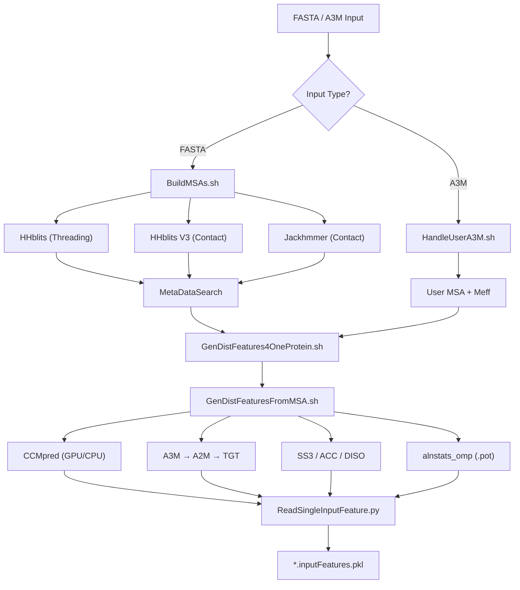

---
slug:6-msa-and-feature-generation
blog_type:normal
---


**MSA 与特征生成**模块是 RaptorX-3DModeling 流水线的基础阶段，负责将原始蛋白质序列转换为供下游深度学习预测器使用的丰富多通道特征表示。该模块主要位于 `BuildFeatures/` 目录下，负责协调跨多数据库的同源搜索、共进化分析、二级结构预测及紧凑序列化，最终生成 `.inputFeatures.pkl` 产物，为[距离与方向预测](7-distance-and-orientation-prediction)和[性质预测网络](8-property-prediction-network)提供数据支撑。

## 流水线架构

从 FASTA 输入到序列化特征 PKL 的端到端流程由三层 shell 脚本协调控制。`BuildFeatures.sh` 作为顶层入口，将任务委派给 `BuildMSAs.sh` 进行比对生成，然后再委派给 `GenDistFeatures4OneProtein.sh` 提取每个 MSA 的特征。每个 MSA 变体（由不同搜索方法和 E-value 阈值生成）均被独立处理至各自的特征子目录中。



来源：[BuildFeatures.sh](/BuildFeatures/BuildFeatures.sh#L1-L119), [BuildMSAs.sh](/BuildFeatures/BuildMSAs.sh#L1-L360), [GenDistFeatures4OneProtein.sh](/BuildFeatures/GenDistFeatures4OneProtein.sh#L1-L121)

## MSA 生成策略

系统采用**位标志组合模式**来选择要运行的同源搜索方法。`-m` 标志接受一个由值 1、2、4、8 和 16 通过按位或组合而成的整数，默认值为 **25**（即 1 + 8 + 16）。此设计允许对 MSA 生成组合进行细粒度控制，而无需增加布尔命令行标志的数量。

| 位标志 | 方法 | 用途 | E-value 变体 | 输出子目录 |
|----------|--------|---------|------------------|---------------------|
| **1** | HHblits (threading) | 用于 threading 与性质预测的序列谱 | e=0.001, neffmax=6 | `{target}_thread/` |
| **2** | HHblits V2 | 接触预测（已弃用） | e=0.001, e=1 | `{target}_v2uce3/`, `{target}_v2uce5/` |
| **4** | Jackhmmer | 接触与距离预测（慢） | e=0.001, e=0.00001 | `{target}_ure3/`, `{target}_ure5/` |
| **8** | HHblits V3 | 接触与距离预测 | e=0.001, e=0.00001 | `{target}_uce3/`, `{target}_uce5/` |
| **16** | MetaDataSearch | 利用宏基因组序列丰富现有 MSA | 按方法丰富 | `{target}_{method}_meta/` |

每种搜索方法在不同 E-value 阈值下生成**两种 MSA 变体**——宽松阈值（如 e=0.001 的 `uce3`）用于捕获更多远缘同源物，严格阈值（如 e=0.00001 的 `uce5`）则侧重高置信度命中。命名约定对此进行了编码：`uce` = UniClust30+E-value，`ure` = UniRef90+E-value，其中尾随数字（`3` 或 `5`）标识 E-value 等级。

来源：[BuildMSAs.sh](/BuildFeatures/BuildMSAs.sh#L28-L58), [BuildMSAs.sh](/BuildFeatures/BuildMSAs.sh#L122-L127)

### 用于距离预测的 HHblits 包装器

`HHblitsWrapper/BuildMSA4DistPred.sh` 脚本封装了 HHblits 的执行，并具备智能的**覆盖率自动确定**功能。当覆盖率设置为 `-1`（自动）时，它会将最小比对覆盖率计算为 `max(60%, 7000/(L-1))`，其中 L 为查询序列长度——这确保了短蛋白质保持严格的覆盖率，而长蛋白质则放宽覆盖率以保证至少约 80 个残基的比对深度。实际的 HHblits 调用会添加关键的过滤标志：`-maxfilt 500000 -diff inf -id 99 -cov {coverage}`，以防止结果集过早截断。

来源：[BuildMSA4DistPred.sh](/BuildFeatures/HHblitsWrapper/BuildMSA4DistPred.sh#L129-L155)

### 带自适应门控的宏基因组富集

MetaDataSearch 阶段基于有效序列数（Meff），按每个 MSA **有条件地跳过**。如果 `ln(Meff) ≥ 6`（即 Meff > ~403），则认为 MSA 足够深并跳过宏基因组富集——这是一项关键优化，可避免在已富含信息的比对上进行昂贵的数据库搜索。对于浅层 MSA，`BuildMSAFromMetaData.sh` 使用来自宏基因组数据库的序列来增强现有比对，生成合并的 `{method}_meta` 子目录。

来源：[BuildMSAs.sh](/BuildFeatures/BuildMSAs.sh#L319-L358)

### Meff 计算

生成每个 MSA 后，使用 `Meff_CDHIT/meff_cdhit` 计算 **Meff**（有效序列数），这是一个基于 CD-HIT 的工具，在特定序列同一性阈值下对序列进行聚类并计算聚类代表数。对于非常大的比对（超过 200,000 行），将跳过 Meff 计算并写入占位符值 11。Meff 值作为 `{target}.meff` 与比对结果一同存储，并作为宏基因组富集的门控信号。

来源：[BuildMSAs.sh](/BuildFeatures/BuildMSAs.sh#L232-L248)

## 用户提供的 MSA 处理

当输入文件具有 `.a3m` 扩展名或指定了 `-m 0` 时，`HandleUserA3M.sh` 将接管 `BuildMSAs.sh` 的工作。它会验证用户的比对结果，生成 threading TGT 文件，并将 MSA 放入 `{target}_user` 接触子目录中同时计算 Meff。此路径使用户能够注入自定义比对（例如，来自结构模板或专用数据库），同时仍可利用下游完整的特征生成流程。

来源：[HandleUserA3M.sh](/BuildFeatures/HandleUserA3M.sh#L1-L70), [BuildFeatures.sh](/BuildFeatures/BuildFeatures.sh#L88-L108)

## 从 MSA 生成特征

一旦 MSA 建立，`GenDistFeatures4OneProtein.sh` 将遍历所有有效的 MSA 子目录（匹配模式 `{target}_{method}`），并为每个子目录分派 `GenDistFeaturesFromMSA.sh`。作业并发机制通过轮询 `ps` 获取运行中的实例，来限制同时运行的特征生成进程数（默认为 2）——这是完整任务队列的一种轻量级替代方案。

被处理的 MSA 方法包括：`user`、`uce3`、`uce5`、`ure3`、`ure5`、`uce3_meta`、`uce5_meta`、`ure3_meta`、`ure5_meta`。每种方法均生成一个名为 `feat_{target}_{method}` 的并行特征目录。

来源：[GenDistFeatures4OneProtein.sh](/BuildFeatures/GenDistFeatures4OneProtein.sh#L96-L120)

### 特征提取流水线

`GenDistFeaturesFromMSA.sh` 是将单个 `.a3m` 文件转换为完整特征集的核心模块。该流水线执行六个连续阶段，每个阶段均具有幂等的文件存在性检查：

| 阶段 | 输入 | 输出 | 工具 | 用途 |
|-------|-------|--------|------|---------|
| **1. CCMpred** | `.a3m` | `.ccmpred`, `.extraCCM.pkl` | `RunCCMpredWrapper.sh` | 伪似然共进化矩阵 |
| **2. A2M 转换** | `.a3m` | `.a2m` | `A3M_To_PSI` | 保留插入的比对，用于 PSSM/PSFM |
| **3. FASTA 提取** | `.a2m` | `.seq` | `head -n1` | 纯净的查询序列 |
| **4. 成对势** | `.a2m` | `.pot` | `alnstats_omp` | 接触势、MI 及 APC 校正后的 MI |
| **. TGT 生成** | `.a3m` + `.seq` | `.tgt` | `A3M_To_TGT` | 位置特异性评分矩阵 + SS+ SS8 |
| **6. 性质预测** | `.tgt` | `.ss3`, `.acc`, `.diso` | `DeepCNF_SS_Con`, `AcconPred`B` | 二级结构、溶剂可及性、无序预测 |

**大比对采样**：当比对大小超过阈值时，阶段 4 和 5 会实施自适应采样。对于 `.pot` 生成，序列数超过 50,000 的比对会通过 `SampleA2MByNumber.py` 降采样至 50,000。对于 `.tgt` 转换，阈值为 100,000 条序列。原始文件会被临时替换、处理后再恢复——这确保了下游工具能接收到可管理的输入，而不会造成永久性数据丢失。

来源：[GenDistFeaturesFromMSA.sh](/BuildFeatures/GenDistFeaturesFromMSA.sh#L90-L220)

### CCMpred 执行策略

`RunCCMpredWrapper.sh` 脚本实现了**GPU 优先、CPU 回退**的执行策略，并支持可选的远程机器委派。决策树如下：

1. 通过 `EstimateGPURAM4CCMpred.sh` **估算 GPU RAM** 需求
2. 如果 RAM 超过 15GB，则从 GPU 机器文件中选定 `LargeRAM` 机器；否则，选定任何带 `RAM` 标5志的机器
3. 如果选定机器为远程，则通过 `RunCCMpredRemote.sh` 分派；否则，通过 `RunCCMpred.sh` 本地运行
4. 如果 GPU 执行失败且 `GPUmode` 允许 CPU 回退（模式 2 或 4），则使用 10–20 个线程在 CPU 上重新运行 CCMpred
5. 后处理：通过 `CCMpredUtils.py` 将 `.mpk`（MsgPack）转换为 `.extraCCM.pkl`，并通过 `normalize_ccmpred_sep.py` 计算Z分数归一化

来源：[RunCCMpredWrapper.sh](/BuildFeatures/Scripts/RunCCMpredWrapper.sh#L96-L200)

## 特征组装与序列化

最后阶段调用 `ReadSingleInputFeature.py`，该脚本调用 `ReadProteinFeatures.ReadFeatures()` 将所有残基级和成对特征加载到单个 Python 字典中，并使用 cPickle 以最高协议序列化为 `{target}.inputFeatures.pkl`。

### 特征字典结构

组装后的特征字典包含以下键，表示**三种不同的特征类别**：序列特征（按位置）、成对特征（L×L 矩阵）和共进化特征（带子结构的 L×L 矩阵）：

| 键 | 形状 | 类型 | 来源文件 | 描述 |
|-----|-------|------|-------------|-------------|
| `name` | 标量 | str | — | 蛋白质标识符 |
| `sequence` | L | str | `.seq` | 氨基酸序列 |
| `SS3` | L × 3 | float32 | `.ss3` | 3 态二级结构概率 (H/E/C) |
| `ACC` | L × 3 | float32 | `.acc` | 溶剂可及性概率 (buried/medium/exposed) |
| `DISO` | L × N | float32 | `.diso` | 无序预测概率 |
| `PSFM` | L × 20 | float32 | `.tgt` | 位置特异性频率矩阵 |
| `PSSM` | L × 20 | float32 | `.tgt` | 位置特异性评分矩阵 (对数几率) |
| `SS8` | L × 8 | float32 | `.tgt` | 8 态二级结构概率 |
| `ccmpredZ` | L × L | float32 | `.ccmpred_zscore` | Z分数归一化的 CCMpred 接触矩阵 |
| `ccmpred` | L × L | float32 | `.ccmpred` | 原始 CCMpred 精度矩阵 |
| `OtherPairs` | L × L × 3 | float16 | `.pot` | 接触势、MI 及 APC 校正后的 MI |

此外，当通过 `FeatureUtils.LoadFeaturePKL()` 加载用于训练或预测时，该字典可扩展以下内容：

| 扩展键 | 形状 | 描述 |
|--------------|-------|-------------|
| `CCMFnorm` | L × L | 20×20 精度块的 Frobenius 范数 (APC 校正) |
| `CCMFnormZ` | L × L | Z分数归一化的 Fnorm |
| `sumCCM` | L × L × 43 | 降维精度矩阵 (每对 43 通道摘要) |
| `rawCCM` | L × L × 441 | 每对的完整 21×21 精度子矩阵 |
| `fullMI` | L × L × 20 × 20 | 来自 A2M 的完整互信息 |
| `fullCov` | L × L × 20 × 20 | 来自 A2M 的完整协方差矩阵 |
| `ESM` | L × L × D | ESM-2 注意力权重 (可配置层) |

来源：[ReadProteinFeatures.py](/DL4DistancePrediction4/ReadProteinFeatures.py#L178-L242), [FeatureUtils.py](/DL4DistancePrediction4/FeatureUtils.py#L11-L92), [CCMpredUtils.py](/DL4DistancePrediction4/CCMpredUtils.py#L52-L132)

### CCMpred 精度矩阵降维

CCMpred MsgPack 输出包含每个残基对 (i, j) 的完整 21×21（20 种氨基酸 + 缺口）精度子矩阵。`CCMpredUtils.Reduce()` 将其压缩为每对 43 通道的表示：20 个来自行 L2 范数的值（第 0–19 列），20 个来自列 L2 范数的值（第 0–19 行），以及 1 个缺口-缺口条目幅值。同时，它计算 20×20 子块的 Frobenius 范数，应用**平均乘积校正 (APC)** 以消除系统发育偏差，并对结果进行Z分数归一化。此降维操作将存储从 O(L²×441) 缩减至 O(L²×43)，同时保留了主要的共进化信号。

来源：[CCMpredUtils.py](/DL4DistancePrediction4/CCMpredUtils.py#L83-L132)

## 输出目录结构

对于目标蛋白质 `1pazA`，特征生成后的完整输出树如下：

```
1pazA_OUT/
├── 1pazA.seq                          # 纯净的 FASTA 序列
├── 1pazA_thread/                      # Threading MSA 和谱
│   ├── 1pazA.a3m
│   └── 1pazA.tgt
├── 1pazA_contact/                     # 接触/距离 MSA 变体
│   ├── 1pazA_uce3/                    # HHblits V3, e=0.001
│   │   ├── 1pazA.a3m
│   │   └── 1pazA.meff
│   ├── 1pazA_uce5/                    # HHblits V3, e=0.00001
│   ├── 1pazA_uce3_meta/              # + 宏基因组富集
│   └── ...
├── feat_1pazA_uce3/                   # uce3 MSA 的特征
│   ├── 1pazA.a3m                      # 比对 (已复制)
│   ├── 1pazA.a2m                      # 保留插入的比对
│   ├── 1pazA.seq                      # 序列
│   ├── 1pazA.tgt                      # TGT (PSSM/PSFM/SS8)
│   ├── 1pazA.ccmpred                  # 原始 CCMpred 矩阵
│   ├── 1pazA.ccmpred_zscore           # Z分数 CCMpred
│   ├── 1pazA.extraCCM.pkl             # 降维精度 + Fnorm
│   ├── 1pazA.pot                      # 成对势 (MI, APC-MI)
│   ├── 1pazA.ss3                      # 3 态二级结构
│   ├── 1pazA.acc                      # 溶剂可及性
│   ├── 1pazA.diso                     # 无序预测
│   └── 1pazA.inputFeatures.pkl        # 组装的特征字典
└── feat_1pazA_uce5/                   # uce5 MSA 的特征
    └── ...
```

<CgxTip>每个 MSA 变体均生成一个**独立、自包含的特征集**。下游预测流水线通常选择具有最高 Meff 的特征集以获得最佳准确率，但所有变体均可用于集成或质量比较策略。</CgxTip>

来源：[BuildFeatures.sh](/BuildFeatures/BuildFeatures.sh#L110-L118), [GenDistFeaturesFromMSA.sh](/BuildFeatures/GenDistFeaturesFromMSA.sh#L107-L219)

## 批处理

`BatchBuildFeatures.sh` 支持蛋白质列表的并行处理。它通过轮询 `ps` 获取运行中的 `BuildFeatures.sh` 进程，来维护一个并发池（默认 3 个同时作业），当池满时以随机退避方式休眠。这种基于轮询的简单调度器避免了完整作业队列系统的开销，同时兼顾了 GPU 内存限制。

```bash
# 每次处理 5 个蛋白质列表，自动选择 GPU
BatchBuildFeatures.sh -n 5 -g -1 proteinList.txt /path/to/sequences/
```

来源：[BatchBuildFeatures.sh](/BuildFeatures/BatchBuildFeatures.sh#L1-L95)

## 关键环境变量

MSA 与特征生成模块需要几个环境变量来定位外部工具和数据库：

| 变量 | 指向 | 需求方 |
|----------|-----------|-------------|
| `ModelingHome` | RaptorX-3DModeling 根目录 | `BuildFeatures.sh`, `GenDistFeaturesFromMSA.sh` |
| `DistFeatureHome` | `BuildFeatures/` 目录 | 模块中的所有脚本 |
| `DL4DistancePredHome` | `DL4DistancePrediction4/` 目录 | `GenDistFeaturesFromMSA.sh`, CCMpred 后处理 |
| `HHDIR` | HHblits 安装目录 | `BuildMSAs.sh`, `BuildMSA4DistPred.sh` |
| `HHDB` | 默认 HHblits 序列数据库 | `BuildMSAs.sh`, `BuildMSA4DistPred.sh` |
| `JackDB` | Jackhmmer 序列数据库 | `BuildMSAs.sh` (可选，用于标志 4) |

<CgxTip>`GPUmode` 参数（`-r` 标志）控制整个特征流水线的计算资源选择：模式 1 = 仅本地 GPU；模式 2 = 本地 GPU + CPU；模式 3 = 本地 GPU + 远程 GPU；模式 4 = 以上所有。模式 4 是 `GenDistFeaturesFromMSA.sh` 的默认值，确保 CCMpred 能够利用包括 `GPUMachines.txt` 中列出的远程机器在内的任何可用硬件。</CgxTip>

来源：[BuildFeatures.sh](/BuildFeatures/BuildFeatures.sh#L3-L17), [GenDistFeaturesFromMSA.sh](/BuildFeatures/GenDistFeaturesFromMSA.sh#L1-L14)

## 后续步骤

一旦为所有 MSA 变体生成了特征 PKL，流水线便会进入深度学习推理阶段。特征字典将由[距离与方向预测](7-distance-and-orientation-prediction)中描述的距离和方向预测网络以及[性质预测网络](8-property-prediction-network)中描述的性质预测网络所消费。处理这些特征的模型架构详见[用于距离预测的 ResNet](10-resnet-for-distance-prediction)和[膨胀 ResNet 与注意力机制](11-dilated-resnet-and-attention)。