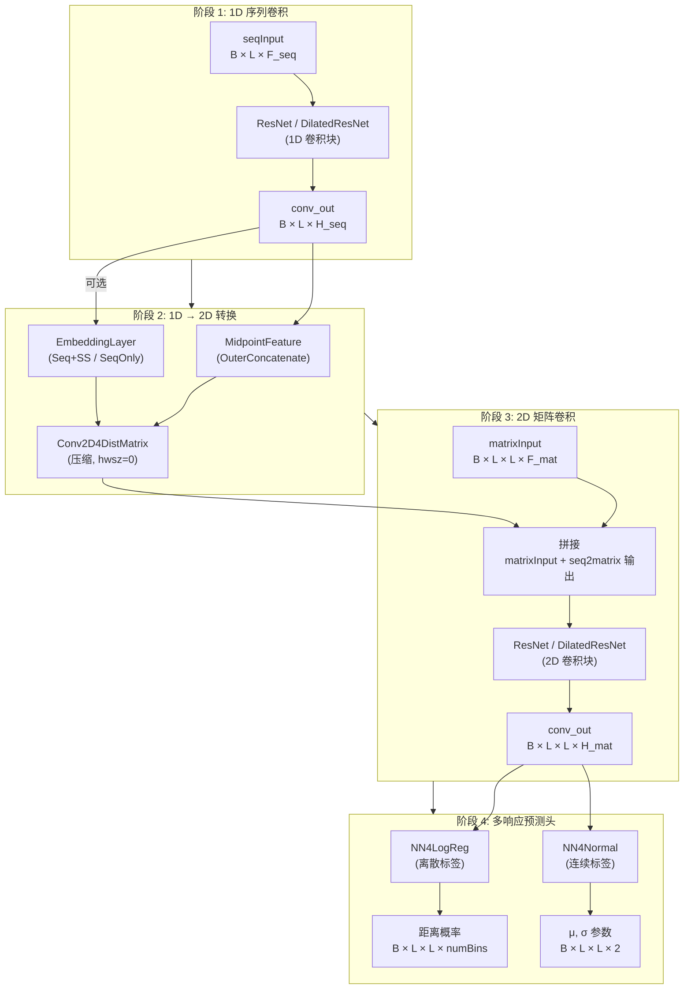
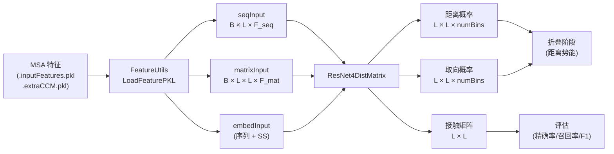

---
slug:7-distance-and-orientation-prediction
blog_type:normal
---

`DL4DistancePrediction4` 模块是 RaptorX-3DModeling 的计算核心——一个深度残差网络系统，它从多序列比对（MSA）特征中同时预测**残基间距离分布**和**取向角概率**。与二元接触图预测器不同，该模块输出距离区间和取向区间上的完整离散概率分布，这些分布随后被转换为用于 3D 折叠的距离势能。该架构实现了一个 **1D→2D 转换流水线**：序列级特征经过 1D 残差卷积，通过外部拼接和嵌入提升为成对矩阵，然后通过 2D 残差（或膨胀残差）卷积进行精炼，最后由逐响应的分类或回归头进行解码。

来源: [Model4DistancePrediction.py](DL4DistancePrediction4/Model4DistancePrediction.py#L1-L68), [config.py](DL4Distance4/config.py#L1-L200)

## 预测量：响应与标签分类体系

系统预测一组丰富的成对几何量，称为**响应**。每个响应都是一个形式为 `LabelName_LabelType` 的字符串（例如 `CbCb_Discrete25C`、`Ca1Cb1Cb2Ca2_Discrete37C`）。标签分类体系完全在 `config.py` 中定义，并决定了网络输出哪些几何属性以及如何对它们进行离散化。

**与距离相关的响应**涵盖五种原子对类型以及两种二元属性：

| 标签名 | 语义 | 对称 |
|---|---|---|
| `CbCb` | Cβ–Cβ 残基间距离 | 是 |
| `CaCa` | Cα–Cα 距离 | 是 |
| `CgCg` | Cγ–Cγ 距离（伪原子） | 是 |
| `CaCg` | Cα–Cγ 距离 | 否 |
| `NO` | N–O 距离 | 否 |
| `HB` | 氢键指示符 | 否 |
| `Beta` | β-配对指示符 | 是 |

**取向响应**分为两个几何族。**双残基取向**集使用局部 Cβ 中心坐标系：二面角 `Ca1Cb1Cb2Ca2` 和 `N1Ca1Cb1Cb2`，以及平面角 `Ca1Cb1Cb2`。**四 Cα 取向**集使用序列上相邻的 Cα 原子：二面角 `Ca1Ca2Ca3Ca4` 和 `Ca1Ca2Ca4Ca3`，以及平面角 `Ca1Ca2Ca3` 和 `Ca1Ca2Ca4`。便捷缩写（`TwoROri`、`FourCaOri`、`AllOri`）通过 `ParseLabelNames` 展开为其组成名称。

**离散化方案**被编码为诸如 `25C`、`37C`、`56C` 的后缀字符串——数字表示距离/取向区间的数量。对于距离，区间在下界（~2–5Å）和上界（~15–22Å）之间均匀分布。存在三种无效条目处理模式：basic（无效项合并到最后一个区间）、`Plus`（无效项作为单独标签，计入损失）和 `Minus`（无效项作为单独标签，不计入损失）。连续标签类型（`Normal`、`LogNormal`）也被支持用于基于回归的预测。

来源: [config.py](DL4DistancePrediction4/config.py#L178-L398), [DistanceUtils.py](DL4DistancePrediction4/DistanceUtils.py#L11-L23)

## 网络架构：ResNet4DistMatrix

核心模型类是 **`ResNet4DistMatrix`**，它通过五个连续的阶段编排完整的预测流水线。其构造函数接受 `seqInput`（batchSize × seqLen × n_in_seq）、`matrixInput`（batchSize × seqLen × seqLen × n_in_matrix）、可选的 `embedInput`、用于子矩阵采样的 `boundingbox`，以及完全参数化架构的 `modelSpecs` 字典。

**阶段 1 — 1D 序列卷积**：`seqInput` 张量穿过一叠 1D 残差卷积块（根据 `modelSpecs['network']` 选择 `ResNet` 或 `DilatedResNet`）。每个块包含带有批归一化和可配置激活函数（ReLU 或 tanh）的残差连接。输出 `conv_out` 的形状为 (B, L, H_seq)，其中 H_seq 是最终的隐藏通道数。

**阶段 2 — 1D→2D 转换**：1D 卷积输出通过两种互补机制转换为成对矩阵。**OuterConcatenate** 路径计算 `MidpointFeature(seqConv.output)`，它在每个位置 拼接残基 i 和 j 的特征向量，生成 (B, L, L, 2×H_seq) 张量。这可以选择通过 halfWinSize=0 的 `Conv2D4DistMatrix`（逐点卷积）进行压缩。**Embedding** 路径（当提供 `embedInput` 时触发）通过 `EmbeddingLayer4AllRange` 映射主序列和/或预测的二级结构。所有 2D 输出沿着特征轴与原始 `matrixInput` 拼接。

**阶段 3 — 2D 矩阵卷积**：拼接后的 2D 特征张量进入另一叠残差块——`ResNet`（标准 2D 卷积）或 `DilatedResNet`（带可选注意力的膨胀 2D 卷积）。这是表征能力的主要所在：2D 卷积捕获跨距离/取向矩阵的空间相关性。输出形状为 (B, L, L, H_mat)。

**阶段 4 — 多响应预测头**：对于 `modelSpecs['responses']` 中的每个响应，附加一个专用预测头。**离散**响应使用 `NN4LogReg`——一个在 `numBins` 个类别上以 softmax 终止的多层神经网络。**连续**响应（Normal/LogNormal）使用 `NN4Normal`，它输出分布参数（μ, σ）。逐响应的输出被拼接以形成最终的 `output`（预测值）和 `output_prob`（概率分布）张量。

来源: [Model4DistancePrediction.py](DL4DistancePrediction4/Model4DistancePrediction.py#L219-L399), [Model4PairwisePrediction.py](DL4DistancePrediction4/Model4PairwisePrediction.py#L1-L200)

## 残差块实现

存在两种残差网络实现，它们共享相同的结构模式，但在卷积策略上有所不同。

### ResNet4Distance — 标准残差卷积

`ResNet4Distance.py` 提供了 `ResConv1DLayer` 和 `ResConv2DLayer`——基础构建块。每个层应用具有奇数大小核（由 `halfWinSize` 控制）的卷积，添加偏置，应用激活函数，然后应用**掩码传播**以在卷积后将填充位置清零。掩码机制对于变长蛋白质批处理至关重要：批次中的所有序列都右对齐，卷积后左侧的填充零会被重新清零，以防止噪声污染。

`batch_norm()` 中的批归一化是感知掩码的：它计算均值和标准差时**排除**填充位置，然后在归一化后重新将填充条目清零。这确保了统计量仅反映有效残基。

`ResNet` 类堆叠多个残差块，每个块由两个带有跳跃连接的卷积层组成：`output = input + Conv2( activation(Conv1(input)) )`。`version` 参数在 `ResNet2D`、`ResNet2DV21`、`ResNet2DV22` 和 `ResNet2DV23` 之间选择——它们的主要差异在于残差块内批归一化的放置位置。

### DilatedResNet4Distance — 带注意力的膨胀卷积

`DilatedResNet4Distance.py` 通过两项关键创新扩展了标准 ResNet。**膨胀卷积**（`filter_dilation` 参数）在不增加参数数量的情况下呈指数级扩展感受野——一叠具有膨胀率 [1, 2, 4, 8, ...] 的块能以极小的代价实现与大核相同的有效感受野。同时提供了 1D 和 2D 膨胀卷积层。

**`AttnConv2DLayer`** 将卷积与通道注意力机制融合。在膨胀 2D 卷积产生输出后，应用一个 `AttentionLayer`。注意力层通过平均池化（`AvgPool`）和/或最大池化（`MaxPool`）计算全局通道描述符，将它们通过全连接（或卷积）的压缩-激励通路，并重新加权卷积输出。这允许网络在整个距离矩阵上自适应地强调信息丰富的特征通道。

来源: [ResNet4Distance.py](DL4DistancePrediction4/ResNet4Distance.py#L1-L200), [DilatedResNet4Distance.py](DL4DistancePrediction4/DilatedResNet4Distance.py#L1-L242), [AttentionLayer.py](DL4DistancePrediction4/AttentionLayer.py#L182-L260)

## 预测头：分类与回归

### NN4LogReg — 离散标签分类

对于离散化的距离/取向区间，`NN4LogReg` 实现了一个多层神经网络分类器。它堆叠可配置的 `HiddenLayer` 实例（带 ReLU 激活的全连接层），随后是一个 `LogRegLayer`，该层应用 softmax 生成 `n_out` 个区间上的概率分布。负对数似然损失 `NLL()` 和 0-1 错误率 `errors()` 都支持可选的逐样本加权，当不同的残基对范围（短/中/长）接收不同的损失权重时会使用此加权。

### NN4Normal — 连续分布回归

对于连续距离预测，`NN4Normal` 输出 Normal 或 LogNormal 分布的参数。网络预测每个残基对的均值（μ）和方差（σ²），使折叠阶段能够使用完整的分布而不是点估计。特定于方差预测的参数被单独跟踪（`params4var`），以允许差异化正则化。

来源: [NN4LogReg.py](DL4DistancePrediction4/NN4LogReg.py#L114-L200), [NN4Normal.py](DL4DistancePrediction4/NN4Normal.py#L1-L50)

## 距离离散化与评估

### DistanceUtils — 离散化、评估与概率校准

**离散化**（`DiscretizeDistMatrix`）使用 `np.digitize` 针对所选区间方案的距离截断数组，将连续的 L×L 距离矩阵转换为 L×L 标签矩阵。无效距离（负值）根据 Plus/Minus 模式映射到最后一个区间或单独的区间。伴随函数 `LabelsOfOneDistance` 和 `LabelsOfDistance` 将标量距离映射到区间索引。

**评估**在两个层级提供。`EvaluateProbAccuracy()` 将预测的概率矩阵与真实距离进行比较：它计算接触预测的精确率、召回率和 F1（概率 > 阈值 ⇒ 预测为接触），具有可配置的最小序列分离度（`minSeqSep`，默认为 12）以排除微不足道的短程接触。`EvaluateDistanceBoundAccuracy()` 评估点估计距离预测，计算绝对误差、相对误差、精确率/召回率/F1，以及使用多个距离阈值（0.5, 1, 2, 4, 8 Å）的类 GDT 分数。

**概率校准**（`FixDistProb`）通过标签权重与参考（背景）概率的比率调整原始预测概率，纠正距离范围上的训练集偏差。`CalcLabelProb()` 计算按序列分离范围（长、中、短、近）分层的经验标签频率分布。

来源: [DistanceUtils.py](DL4DistancePrediction4/DistanceUtils.py#L1-L200)

## 取向离散化与接触推导

### OrientationUtils — 二面角与平面角处理

取向角（二面角和平面角）需要特殊处理，因为它们**仅在两个残基空间上接近时才有意义**。`DiscretizeOrientationMatrix()` 函数针对特定于取向的区间应用 `np.digitize`，然后执行三个关键的后处理步骤：(1) 缺失 Cβ 原子的残基被分配一个随机有效标签（以避免偏向最后一个区间）；(2) 超出距离阈值（`distThreshold4Orientation`，通常为 20Å）的残基对映射到最后一个区间；(3) 具有无效 3D 坐标的残基映射到最后一个区间。距离和取向之间的这种耦合确保了仅在空间上相近的残基对才会被信任其取向预测。

`DeriveOriContactMatrix()` 通过对所有有效（非最后）取向区间的概率求和，将预测的取向概率矩阵转换为接触概率矩阵——如果任何有效取向是可能的，则预测残基对处于接触状态。`DeriveContactMatrices()` 在预测结果中的所有取向上应用此转换。

来源: [OrientationUtils.py](DL4DistancePrediction4/OrientationUtils.py#L43-L151)

## 标签处理流水线

### LabelUtils — 真值提取与权重计算

`CollectLabels()` 是从原始结构数据到训练标签的桥梁。对于每个响应，它从蛋白质的 `atomDistMatrix` 或 `atomOrientationMatrix` 中提取相应的矩阵，然后使用相应的截断方案对其进行离散化。距离标签使用 `DistanceUtils.DiscretizeDistMatrix()`；取向标签使用 `OrientationUtils.DiscretizeOrientationMatrix()` 并以 Cβ–Cβ 距离矩阵作为门控信号。二元标签（HB、Beta）跳过离散化。

`CalcLabelDistribution()` 计算按序列分离范围分层的经验标签频率分布。`CalcLabelWeight()` 从这些分布中推导出逐标签的训练权重——核心见解是**长程接触虽然罕见但结构上至关重要**，因此它们的损失贡献会被加权。加权系统在两个层级运作：范围权重（短/中/长分离）和标签权重（逐区间频率的倒数），两者乘性组合。

来源: [LabelUtils.py](DL4DistancePrediction4/LabelUtils.py#L20-L200)

## 训练流水线

### TrainDistancePredictor — 优化器编排与检查点

训练入口点 `TrainDistancePredictor.py` 从 `Model4PairwisePrediction` 导入 `BuildModel` 并支持七种优化算法：`SGDM`、`SGDM2`、`Nesterov` (SGNA)、`Adam`、`AMSGrad`、`AdamW` 和 `AdamWAMS`。`UpdateAlgorithm()` 调度器路由到相应的优化器。AdamW 和 AdamWAMS 遵循 L2 正则化感知公式实现解耦的权重衰减（`pdecay` 参数）。

**检查点管理**（`InitializeChkpoint`）支持完整的训练重启：最佳验证损失、最佳参数值、最佳优化器状态和当前周期都被持久化。重启时，通过 `Compatible()` 兼容性检查来恢复参数值。

**验证**（`ValidateAllData`）遍历小批量，计算损失、误差和准确率。当启用 `UseSampleWeight` 时应用样本权重，通过批次相对于归一化基数的总权重来缩放每个批次的损失贡献。

**批次加权**（`CalcBatchWeight`、`ScaleLossByBatchWeight`）补偿变长蛋白质：较大的蛋白质贡献更多残基对，否则将主导梯度。权重计算为批次总权重与参考基数的比率，作为损失的乘法缩放应用。

来源: [TrainDistancePredictor.py](DL4DistancePrediction4/TrainDistancePredictor.py#L1-L200)

## 推理流水线

### RunPairwisePredictor — 多模型预测与接触推导

`RunPairwisePredictor.py` 是生产推理入口点。其命令行界面接受：`-m`（一个或多个模型 PKL 文件，以分号分隔）、`-p`（蛋白质名称、名称列表文件或预构建的特征 PKL）、`-i`（包含 `.inputFeatures.pkl`、`.extraCCM.pkl` 和 `.a2m` 文件的特征文件夹）、可选的 `-a`（用于模板引导预测的比对文件）、可选的 `-t`（模板 PKL 文件），以及 `-d`（输出目录）。

**多模型集成**是核心推理策略。`LoadModels()` 加载多个模型规范，验证版本 ≥ 3.0 和网络兼容性，并检查所有模型对于相同标签名是否共享一致的标签类型。`CollectLabelWeightNDistribution()` 跨模型平均标签权重和参考分布，产生集成级别的校准参数。

**预测输出**是每个蛋白质的 6 元组：`(proteinName, sequence, predictedDistMatrixProb, predictedContactMatrix, labelWeightMatrix, labelDistributionMatrix)`。预测的距离概率矩阵形状为 L×L×numBins；接触矩阵通过对距离 < 8Å 的区间概率求和推导而来（即 `ContactDefinition`）。

`DeriveContactMatrix()` 处理三种响应类别：距离响应（离散标签的区间求和，Normal/LogNormal 的 CDF 评估）、HB/Beta 响应（直接提取概率）和取向响应（委派给 `OrientationUtils.DeriveOriContactMatrix`）。

来源: [RunPairwisePredictor.py](DL4DistancePrediction4/RunPairwisePredictor.py#L1-L200)

## 特征加载与组合

### FeatureUtils — 输入特征组装

`LoadFeaturePKL()` 加载基础 `.inputFeatures.pkl` 文件，并使用由 modelSpecs 中 `ECInfo` 位掩码控制的可选额外特征对其进行扩充：CCM F-范数（`CCMFnorm`）、CCM 摘要（`sumCCM`）、原始 CCM 矩阵（`rawCCM`）、从 `.a2m` 计算的完整互信息（`fullMI`）以及完整协方差矩阵（`fullCov`）。也可以为指定的 Transformer 层加载 ESM-2 注意力特征（`.esm2.pkl`）。

**成对位置特征**编码序列分离信息：`LocationFeature`（min(1, |i−j|/50)）、`CubeRootFeature`（∛|i−j|）、`LogFeature`（log₁₀(|i−j|+1)）和 `NewLocationFeature`（1/(1+|i−j|) 和 1/√(1+|i−j|)）。这些帮助网络区分短程和长程对，而不完全依赖进化耦合。

来源: [FeatureUtils.py](DL4DistancePrediction4/FeatureUtils.py#L1-L150)

## 架构选择与配置参考

模型架构完全由 `modelSpecs` 字典决定。下表总结了控制距离/取向预测网络的关键配置参数：

| 参数 | 类型 | 描述 |
|---|---|---|
| `network` | str | 架构：`ResNet2D`、`ResNet2DV23` 或 `DilatedResNet2D` |
| `responses` | list[str] | 预测量，例如 `['CbCb_Discrete25C', 'Ca1Cb1Cb2Ca2_Discrete37C']` |
| `n_in_seq` | int | 1D 序列路径的输入特征通道数 |
| `n_in_matrix` | int | 2D 矩阵路径的输入特征通道数 |
| `conv1d_hiddens` | list[int] | 1D 卷积块的隐藏通道宽度 |
| `conv2d_hiddens` | list[int] | 2D 卷积块的隐藏通道宽度 |
| `conv1d_repeats` | int | 1D 残差块重复次数 |
| `conv2d_repeats` | int | 2D 残差块重复次数 |
| `halfWinSize_seq` | int/list | 1D 卷积的半窗口大小 |
| `halfWinSize_matrix` | int | 2D 卷积的半窗口大小 |
| `conv2d_hwszs` | list[int] | 逐块半窗口大小（DilatedResNet） |
| `conv2d_dilations` | list[int] | 逐块膨胀率（DilatedResNet） |
| `logreg_hiddens` | list[int] | 预测头中的隐藏层宽度 |
| `seq2matrixMode` | dict | 键：`OuterCat`、`Seq+SS` 或 `SeqOnly`，附带通道计数 |
| `activation` | str | `RELU` 或 `TANH` |
| `batchNorm` | bool | 启用批归一化 |
| `distThreshold4Orientation` | float | 有效取向的距离截断值（默认 20.0） |

<CgxTip>掩码传播模式（在每次卷积和批归一化后将填充位置重新清零）不是可选的——它对于正确的变长蛋白质批处理至关重要。没有它，零填充会将信号泄漏到边界位置，降低序列末端的预测质量。</CgxTip>

<CgxTip>使用 DilatedResNet2D 时，膨胀调度应是非递减的（例如 [1,1,2,2,4,4,8,8]）以确保完整的感受野覆盖。`AttnConv2DLayer` 在每次膨胀卷积后应用通道注意力，这会显著增加大型蛋白质的内存使用量——在预测超过 500 个残基的序列时请监控 GPU 内存。</CgxTip>

## 数据流总结

从 MSA 特征到 3D 相关预测的端到端数据流遵循以下路径：

特征生成产生三个输入流：序列特征（PSSM、预测的 SS、溶剂可及性）、成对特征（CCM、MI、协方差、位置特征）和嵌入输入（主序列、二级结构）。这些进入 `ResNet4DistMatrix`，为每个配置的响应输出概率分布。距离概率通过区间求和转换为接触矩阵；取向概率类似地转换。两者都作为距离/取向势能输入到折叠阶段。

来源: [RunPairwisePredictor.py](DL4DistancePrediction4/RunPairwisePredictor.py#L121-L160), [LabelUtils.py](DL4DistancePrediction4/LabelUtils.py#L20-L84)

## 与相邻模块的关系

距离/取向预测模块在整个流水线中位于**特征生成**和 **3D 折叠**之间。其输入由 [MSA 和特征生成](6-msa-and-feature-generation) 产生（特别是 `BuildFeatures/GenDistFeaturesFromMSA.sh` 和 `GenTGTFromA3M.sh`）。其输出被 [3D 模型折叠](9-3d-model-folding) 通过 `GenDistPotential4Threading.sh` 消费，后者将预测的距离概率转换为与 Rosetta/CNS 兼容的距离约束。内部网络架构在 [用于距离预测的 ResNet](10-resnet-for-distance-prediction) 和 [膨胀 ResNet 与注意力](11-dilated-resnet-and-attention) 中详述。跨多 GPU/机器的训练和推理在 [多机分布式执行](13-multi-machine-distributed-execution) 和 [GPU 选择与远程预测](14-gpu-selection-and-remote-prediction) 中介绍。