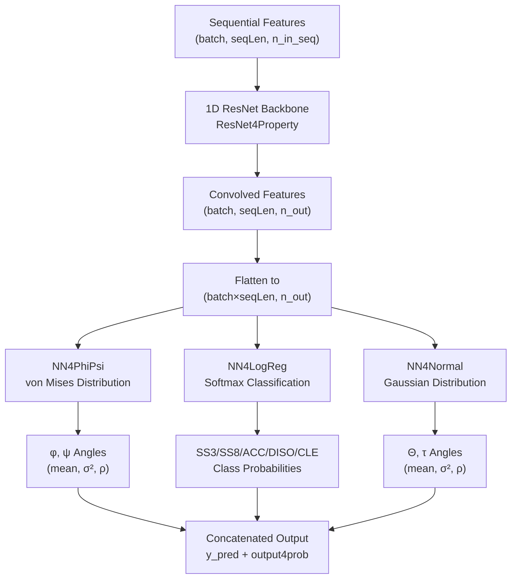
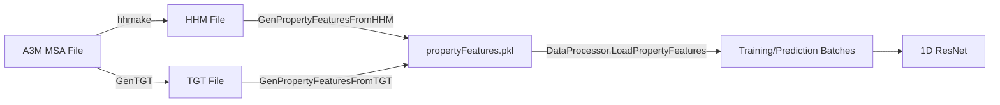

---
slug:8-property-prediction-network
blog_type:normal
---

**属性预测网络**是一个基于一维 ResNet 的深度学习模块，用于从 MSA 生成的序列特征中预测残基级结构属性——包括骨架二面角 (φ/ψ)、二级结构、溶剂可及性、无序性和 CLE 标签。与在二维接触图上操作的距离预测网络不同，该网络沿**序列维度**进行处理，通过一个带有多个专用输出头的共享 ResNet 骨架网络，为每个残基生成一个预测结果。

来源: [Model4PropertyPrediction.py](DL4PropertyPrediction/Model4PropertyPrediction.py#L1-L303), [config.py](DL4PropertyPrediction/config.py#L1-L121)

## 架构概述

属性预测网络遵循**共享骨架、多头**架构。单个一维 ResNet 处理序列特征矩阵，其输出被路由到独立的预测头——每个预测头都根据其目标属性的统计分布进行了定制。

`Model4PropertyPrediction.py` 中的 `ResNet4Properties` 类负责协调此架构。它实例化 ResNet 骨架网络，然后遍历 `modelSpecs` 中的 `responses` 列表，根据每个响应的标签类型附加相应的预测头。

来源: [Model4PropertyPrediction.py](DL4PropertyPrediction/Model4PropertyPrediction.py#L12-L80)

## 可预测属性与标签类型

该网络支持**七种属性名称**和**四种标签类型族**，它们组合起来定义了每个响应。响应字符串的格式为 `PropertyName_LabelType`（例如 `PhiPsi_vonMise2d`、`SS3_Discrete3C`）。

| 属性名称 | 描述 | 典型标签类型 | 值维度 | 概率维度 |
|---|---|---|---|---|
| **PhiPsi** | 骨架 φ/ψ 二面角 | `vonMise2d` | 2 | 5 |
| **SS3** | 3 状态二级结构 (H/E/L) | `Discrete3C` | 1 | 3 |
| **SS8** | 8 状态二级结构 | `Discrete8C` | 1 | 8 |
| **ACC** | 溶剂可及性 (B/M/E) | `Discrete3C` | 1 | 3 |
| **ThetaTau** | 残基间方向角 | `Gauss2d` | 2 | 5 |
| **DISO** | 无序性预测 | `Discrete2C` | 1 | 2 |
| **CLE** | 局部结构环境 (18 类) | `Discrete18C` | 1 | 18 |

`config.py` 模块定义了所有有效的标签类型及其维度映射（`responseValueDims`、`responseProbDims`），以及用于拆分响应字符串的解析函数 `Response2LabelType` 和 `Response2LabelName`。

来源: [config.py](DL4PropertyPrediction/config.py#L6-L76), [PropertyUtils.py](DL4PropertyPrediction/PropertyUtils.py#L1-L45)

## 预测头

每个预测头都实现了一个 `loss()` 方法（负对数似然）、一个 `errors()` 方法，并暴露了 `y_pred`（预测值）和 `output`（分布参数）。预测头的选择逻辑位于 `ResNet4Properties.__init__` 中：

### NN4PhiPsi — 角度数据的冯·米塞斯分布

对于周期性角度预测 (φ, ψ)，使用了**二元冯·米塞斯分布**。该网络输出五个参数：两个均值（通过 `tanh` 限制在 [−π, π] 之间）、两个方差（通过 `(1 + tanh)/2 · π² + σ²_min` 限制为正值），以及一个相关系数（通过 `tanh` 限制在 [−0.99, 0.99] 之间）。均值和方差/相关参数是分离的——方差参数通过 `params4var` 进行追踪，以支持潜在的两阶段训练策略：即先训练均值，然后再训练分布形状。

来源: [NN4PhiPsi.py](DL4PropertyPrediction/NN4PhiPsi.py#L60-L135)

### NN4Normal — 非周期性值的高斯分布

对于非周期性连续预测（Θ, τ 方向角），使用了**二元（或一元）高斯分布**。其架构与 NN4PhiPsi 类似，但具有无界均值（均值层没有 `tanh`），以及通过 ReLU 限制边界的方差。它支持 `n_variables = 1`（Gauss1d，n_out ∈ {1,2}）或 `n_variables = 2`（Gauss2d，n_out ∈ {2,4,5}）。

来源: [NN4Normal.py](DL4PropertyPrediction/NN4Normal.py#L55-L140)

### NN4LogReg — 离散标签的 Softmax 分类

对于分类预测（SS3、SS8、ACC、DISO、CLE），一个**多层前馈网络**最终接入一个 `LogRegLayer`，该层对 `n_out` 个类别应用 softmax。负对数似然（NLL）为标准的交叉熵，预测值为 softmax 输出的 `argmax`。可选的隐藏层（由 `logreg_hiddens` 控制）可以插入到最终分类层之前。

来源: [NN4LogReg.py](DL4PropertyPrediction/NN4LogReg.py#L85-L200)

### 预测头选择汇总

| 标签类型前缀 | 头部类 | 分布 | 输出参数 |
|---|---|---|---|
| `vonMise` | `NN4PhiPsi` | 二元冯·米塞斯分布 | mean(2), σ²(2), ρ(1) |
| `Gauss` | `NN4Normal` | 高斯分布 | mean, σ², 可选 ρ |
| `Discrete` | `NN4LogReg` | 离散分类 | 类别概率 |

来源: [Model4PropertyPrediction.py](DL4PropertyPrediction/Model4PropertyPrediction.py#L45-L80)

## 一维 ResNet 骨干网络

骨干网络在 `ResNet4Property.py` 中实现，提供了三种网络变体：`ResNet1D`、`ResNet1DV21` 和 `ResNet1DV22`。所有变体共享相同的核心构建块，但残差块中批归一化的位置有所不同。

### 残差卷积层 (ResConv1DLayer)

基本单元是带有对称填充 (`border_mode='half'`) 的一维卷积。输入形状为 `(batch, n_in, seqLen)`，输出形状为 `(batch, n_out, seqLen)`。权重初始化对 ReLU 激活函数使用 He 初始化，对其他激活函数使用 Xavier 初始化。**掩码机制**在卷积后将填充位置置零，以防止变长序列填充产生噪声。

来源: [ResNet4Property.py](DL4PropertyPrediction/ResNet4Property.py#L7-L63)

### 瓶颈块

`BottleneckBlock` 实现了一个遵循预激活设计模式的三层残差单元：1×1 卷积（降维）→ K×1 卷积（特征提取）→ 1×1 卷积（维数恢复）。`n_bottleneck` 参数控制内部维度（默认值：`n_in / 2`）。跳跃连接支持两种增加维度的方法：`full_projection`（可学习的 1×1 卷积）和 `identity`（直接相加，仅在维度匹配时使用）。

来源: [ResNet4Property.py](DL4PropertyPrediction/ResNet4Property.py#L309-L375)

### 带掩码的批归一化

`batch_norm` 函数在计算均值和标准差时会**排除掩码（零填充）位置**的统计信息。这对于批次中变长的蛋白质序列至关重要——朴素的批归一化会被填充的零所污染。该实现同时处理三维张量（序列特征）和四维张量（成对特征），对于四维输入，沿水平和垂直两个方向应用掩码。

来源: [ResNet4Property.py](DL4PropertyPrediction/ResNet4Property.py#L140-L210)

## 特征生成流水线

输入特征从 MSA 派生文件（HHM 或 TGT 格式）生成，并组装成逐残基的特征矩阵。

### 特征来源

| 生成器 | 输入 | 提取的关键特征 |
|---|---|---|
| `GenPropertyFeaturesFromHHM` | `.hhm` 文件 | PSSM, PSFM, 序列, NEFF |
| `GenPropertyFeaturesFromTGT` | `.tgt` 文件 | PSSM, PSFM, 序列, NEFF, predSS3, predSS8, predACC |
| `GenPropertyFeaturesFromMultiHHMs` | 多个 HHM | 来自多个 MSA 的组合特征 |
| `GenPropertyFeaturesFromMultiTGTs` | 多个 TGT | 来自多个模板的组合特征 |

**PSSM**（位置特异性评分矩阵）是主要的序列特征。可以通过 `modelSpecs` 标志切换附加特征：

| 特征标志 | 描述 | 维度 |
|---|---|---|
| `UsePSFM` | 位置特异性频率矩阵 | +20 |
| `UseOneHotEncoding` | 氨基酸的独热编码 | +20 |
| `UseSequenceEmbedding` | 3Gram 学习嵌入 | +20 |
| `UseTemplate` | 模板相似性 + 模板属性 | +10 到 +25 |

当启用 `UseTemplate` 时，模板相似性得分（10 个特征：AA 一致性、BLOSUM80/62/45、SP 得分等）和模板结构属性（SS8、ACC、CNa、CNb、Phi、Psi、Theta、Tau）将被追加，其中特定的模板属性将根据目标响应进行选择。

来源: [GenPropertyFeaturesFromHHM.py](DL4PropertyPrediction/GenPropertyFeaturesFromHHM.py#L1-L58), [GenPropertyFeaturesFromTGT.py](DL4PropertyPrediction/GenPropertyFeaturesFromTGT.py#L1-L54), [DataProcessor.py](DL4PropertyPrediction/DataProcessor.py#L19-L120)

## 模型配置

`Initialize.py` 模块定义了默认的模型规格。关键配置参数如下：

| 参数 | 默认值 | 描述 |
|---|---|---|
| `network` | `ResNet1D` | 骨干网络架构变体 |
| `responses` | `['PhiPsi_vonMise']` | 要预测的属性响应列表 |
| `w4responses` | `[1.]` | 每个响应的损失权重 |
| `conv1d_hiddens` | `[80, 100, 120, 140]` | 每个 ResNet 阶段的隐藏通道宽度 |
| `conv1d_repeats` | `[0, 0, 0, 0]` | 每个阶段的额外残差块 |
| `logreg_hiddens` | `[]` | 分类头中的隐藏层 |
| `halfWinSize_seq` | `5` | 卷积核半宽（有效卷积核 = 11） |
| `activation` | `relu` | 整个网络中的非线性激活函数 |
| `batchNorm` | `True` | 启用带掩码的批归一化 |
| `algorithm` | `Adam` | 均值参数的优化器 |
| `algorithm4var` | `Adam` | 方差/相关参数的优化器 |
| `minibatchSize` | `200` | 训练批次大小 |
| `L2reg` | `0.0001` | L2 正则化系数 |

<CgxTip>多响应训练通过列出多个响应来配置（例如 `['PhiPsi_vonMise2d', 'SS3_Discrete3C', 'ACC_Discrete3C']`）。每个响应都有其对应的预测头和损失权重，从而能够从单个共享骨干网络中联合训练角度、二级结构和可及性预测。</CgxTip>

来源: [Initialize.py](DL4PropertyPrediction/Initialize.py#L1-L53), [config.py](DL4PropertyPrediction/config.py#L83-L121)

## 训练流水线

训练入口点 `TrainPropertyPredictor.py` 实现了一个完整的训练循环，具有以下关键特性：

**优化器支持**：Adam、AdamW、AMSGrad、AdamWAMS、SGDM、SGDM2 和 Nesterov 动量。`UpdateAlgorithm` 函数根据 `modelSpecs['algorithm']` 分派到相应的优化器。

**两阶段优化**：均值参数和方差/相关参数可以使用独立的优化器（`algorithm` 对比 `algorithm4var`）以及独立的学习率计划（`lrs` 对比 `lrs4var`，`numEpochs` 对比 `numEpochs4var`）。

**基于检查点的重启**：`InitializeChkpoint` 函数从检查点文件加载已保存的参数值和优化器状态，使中断的训练能够无缝恢复。

**自适应验证频率**：验证频率随着训练的进行而增加——早期 epoch 的验证频率较低（2× 基础频率），中期 epoch 为 1.8×，晚期 epoch 为基础频率，从而在计算成本与早停保真度之间取得平衡。

**样本权重**：没有 3D 坐标的残基（通过 `Missing` 字段标记）在损失计算中的权重为零，防止未定义的 φ/ψ 角度破坏训练过程。

来源: [TrainPropertyPredictor.py](DL4PropertyPrediction/TrainPropertyPredictor.py#L1-L200)

## 预测流水线

两个预测入口点适用于不同的规模：

| 脚本 | 用例 | 输入 |
|---|---|---|
| `RunPropertyPredictor.py` | 单个/少数蛋白质 | 直接使用 PKL 特征文件 |
| `RunBatchPropertyPredictor.py` | 大规模批量预测 | 蛋白质列表文件 + 特征文件夹 |

两者都遵循在 `PredictProperty()` 中实现的相同核心工作流：

1. **模型加载**：每个模型文件 (`.pkl`) 包含 `modelSpecs` 和 `paramValues`。多个模型可以进行集成。
2. **预测器编译**：`BuildModel(forTrain=False)` 构建计算图，然后 `theano.function` 编译输出 `[output4prob, y_pred]` 的预测函数。
3. **特征加载与批处理**：`DataProcessor.LoadPropertyFeatures` 组装特征矩阵；`SplitData2Batches` 创建最多包含 30 个蛋白质的微型批次。
4. **批次预测**：对于每个批次，编译后的函数会同时生成分布参数和预测值。
5. **掩码移除**：使用掩码中的序列长度信息去除填充位置。
6. **集成平均**：当多个模型预测同一个蛋白质时，结果将被平均。对于离散标签，平均后的概率将经过 argmax 运算，然后通过 `PropertyUtils.Coding2String` 解码为字符串表示。

<CgxTip>多模型集成在解码前对**概率分布**（而非点预测值）进行平均。这对于离散标签尤为重要，因为对 argmax 输出进行平均毫无意义——对 softmax 概率取平均然后再取 argmax 才能产生恰当的集成决策。</CgxTip>

来源: [RunPropertyPredictor.py](DL4PropertyPrediction/RunPropertyPredictor.py#L55-L200), [RunBatchPropertyPredictor.py](DL4PropertyPrediction/RunBatchPropertyPredictor.py#L50-L200)

## 评估

`EvaluatePropertyAccuracy.py` 通过将预测结果与真实属性文件进行比较来计算每个蛋白质的预测准确率。评估指标取决于响应类型：

| 响应类型 | 指标 | 备注 |
|---|---|---|
| SS3, SS8, ACC, CLE | 分类错误率 | Q3/Q8 准确率 = 1 − 错误率 |
| DISO | 分类错误率 | 训练期间按 `w4diso` 加权 |
| PhiPsi | 圆形平均绝对误差 | `min(|Δ|, 2π − |Δ|)` 处理角度环绕；末端残基和缺失残基的相邻残基被排除 |

来源: [EvaluatePropertyAccuracy.py](DL4PropertyPrediction/EvaluatePropertyAccuracy.py#L1-L47), [PropertyUtils.py](DL4PropertyPrediction/PropertyUtils.py#L155-L240)

## 与 RaptorX 流水线的集成

属性预测网络在完整的 RaptorX 流水线中作为**第二预测阶段**运行，位于 MSA/特征生成之后、3D 折叠之前。其输出馈入两个下游消费者：

- **折叠模块**：预测的 φ/ψ 角和二级结构通过 `CalcPropertyPotential.py` 转换为 Rosetta 约束文件，将片段组装偏向于预测的局部结构。
- **距离预测细化**：当配置了 `UseTemplate` 或二级结构特征时，预测的 SS 和 ACC 可作为距离/方向预测网络的附加特征。

`Scripts/` 中的 Shell 脚本编排了完整的预测工作流：`PredictProperty4OneProtein.sh` 对单个目标运行从特征生成到预测的流程，而 `PredictPropertyLocal.sh` 和 `PredictPropertyRemote.sh` 则负责 GPU 选择和远程执行。

来源: [PropertyUtils.py](DL4PropertyPrediction/PropertyUtils.py#L240-L299), [GenPropertyFeatures4Proteins.py](DL4PropertyPrediction/GenPropertyFeatures4Proteins.py#L1-L1)

## 后续步骤

- 关于预测残基间距离和方向的二维对应网络，请参阅 [距离与方向预测](7-distance-and-orientation-prediction)。
- 关于两个预测网络共享的 ResNet 构建块细节，请参阅 [距离预测的 ResNet](10-resnet-for-distance-prediction) 和 [空洞 ResNet 与注意力机制](11-dilated-resnet-and-attention)。
- 关于属性预测如何约束 3D 模型构建，请参阅 [3D 模型折叠](9-3d-model-folding)。
- 关于从输入序列到 3D 模型的完整数据流，请参阅 [预测流水线数据流](5-prediction-pipeline-data-flow)。