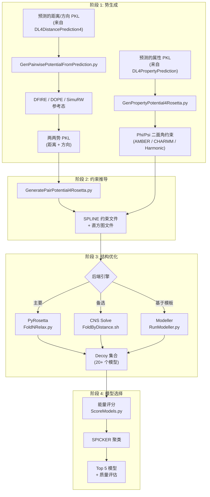

---
slug:9-3d-model-folding
blog_type:normal
---

折叠模块是 RaptorX-3DModeling 流水线的最终阶段——它将深度学习预测的距离、方向和属性转化为原子级分辨率的 3D 蛋白质结构。该模块运行于统计力学与基于梯度的优化的交汇处，将预测的概率分布转化为能量势，并将其作为约束条件输入结构建模引擎（通过 PyRosetta 调用的 Rosetta、CNS Solve 或 Modeller），随后通过能量评分和 SPICKER 聚类选出最佳模型。整体架构体现了 *Jinbo Xu, PNAS 2019* 确立的**基于距离的蛋白质折叠**范式：折叠过程完全由预测的残基间几何信息驱动，而非依赖模板同源性。

来源: [0README](/Folding/0README#L1-L30), [0README_overall](/Folding/0README_overall#L1-L50)

## 架构概述

折叠流水线可分解为四个紧密耦合的阶段：**势生成**、**约束推导**、**结构优化**和**模型选择**。每个阶段均可配置并支持多种后端引擎，从而在准确度与计算成本之间进行权衡。

来源: [GenPairwisePotentialFromPrediction.py](/Folding/GenPairwisePotentialFromPrediction.py#L1-L50), [GenPropertyPotential4Rosetta.py](/Folding/GenPropertyPotential4Rosetta.py#L1-L30), [FoldNRelax.py](/Folding/Scripts4Rosetta/FoldNRelax.py#L1-L40), [FoldByDistance.sh](/Folding/Scripts4Server/FoldByDistance.sh#L1-L50)

## 势生成：从概率到能量

折叠模块的核心理论贡献在于将预测的概率分布转化为具有物理基础的能量势。这并非简单的负对数变换——它需要一个**参考态**来捕捉零模型中距离的预期分布，以确保生成的势在随机构象中为零，而在预测的几何构象中为负值（有利）。

### DFIRE 距离势

主要方法是 **DFIRE**（距离标度有限理想气体参考态），它通过观测势与参考势的差值来计算势能：

**V(i,j) = V_ref(d) − V_obs(i,j,d) = [α·log(r/r_c) + log(Δr/Δr_c)] − log[P(d|i,j) / P(d_c|i,j)]**

其中 `α=1.61` 是 DFIRE 指数（可在 1.57–1.63 之间调节），`r_c` 是参考距离区间（默认 18Å），`P(d|i,j)` 是残基 `i` 和 `j` 之间距离区间 `d` 的预测概率。参考态模拟了在有限理想气体中观测到距离 `d` 的概率，并由指数 `α` 进行缩放。对于宽于 1Å 的区间，使用更精确的数值积分（`CalcApproxRefPot`）来代替中点近似。

来源: [GenPairwisePotentialFromPrediction.py](/Folding/GenPairwisePotentialFromPrediction.py#L97-L160)

### 方向势

方向势（残基间夹角和二面角，如 ω、θ、φ）采用更简单的对数几率形式，并参考依赖于序列间隔的参考分布：

**V_ori(i,j,θ) = −log[P(θ|i,j)] − [−log[P_ref(θ|seqSep)]]**

该势能在各区间上按其均值进行平移，然后**以残基 i 和 j 之间距离 < 20Å 的概率进行加权**（`validProb`）。这种加权抑制了不太可能接触的长程残基对产生的噪声，这是一个显著改善折叠收敛性的关键设计选择。

来源: [GenPairwisePotentialFromPrediction.py](/Folding/GenPairwisePotentialFromPrediction.py#L51-L95)

### 参考态选项

| 参考态 | 公式 | 关键参数 | 适用场景 |
|---|---|---|---|
| **DFIRE** (默认) | α·log(r/r_c) + log(Δr/Δr_c) | α=1.61, r_c=18Å | 通用折叠 |
| **DOPE** | 按回转半径缩放 | r_c=20Å, rg_scale=1.0 | 紧凑的球状蛋白 |
| **SimuRW** | 随机游走参考态 | r_c=20Å, 需要外部文件 | 无序/柔性区域 |

来源: [GenPairwisePotentialFromPrediction.py](/Folding/GenPairwisePotentialFromPrediction.py#L12-L25)

### Phi/Psi 属性势

属性预测网络预测的骨架二面角（Φ/Ψ）通过 von Mises 分布参数转换为兼容 Rosetta 的二面角约束。支持的函数形式包括：

| 函数 | 公式 | 典型用途 |
|---|---|---|
| **AMBERPERIODIC** (默认) | k·(1 + cos(n·x − x₀)) | Rosetta 折叠——周期性，处理角度卷绕 |
| **CHARMM** | ½·k·(1 − cos(n·(x − x₀))) | 兼容 CNS 的评分 |
| **HARMONIC** | ½·k·(x − x₀)² | 小角度近似 |
| **CIRCULARHARMONIC** | 谐波势的圆变体 | 周期性边界强制 |

当无序预测可用时，约束权重将按 `(1 − P_disorder)` 进行缩放，从而有效降低缺乏稳定二面角的柔性区域的权重。

来源: [GenPropertyPotential4Rosetta.py](/Folding/GenPropertyPotential4Rosetta.py#L18-L75), [CalcPropertyPotential.py](/Folding/CalcPropertyPotential.py#L1-L30)

## 约束推导：从势到 Rosetta 格式

原始势矩阵必须转换为 Rosetta 的原生约束格式才能驱动折叠。`GeneratePairPotential4Rosetta.py` 分两阶段执行此转换：

**距离约束**被写为 SPLINE 函数，残基 i 和 j 之间的每个约束都会生成一个包含各距离区间势值的直方图文件，以及引用该直方图的约束行。SPLINE 表示允许 Rosetta 通过插值在任意原子间距离处评估约束。

**方向约束**在输出前需经过两级选择标准过滤：(1) 仅保留按 `validProb` 排名在前 `topRatio × L` 的残基对（其中 L 为序列长度，默认 topRatio=20）；(2) 丢弃各区间最大绝对势值低于 `potThreshold`（默认 0.04）的残基对。对于对称标签（如 θ），每个约束仅出现一次；对于非对称标签（如 ω），势值除以 4（两次出现 × 半偏移平均）以避免重复计数。

约束文件将写入临时目录（对于残基数 <400 的机器或指定的高内存节点，优先使用 `/dev/shm` 以获取内存盘速度），在加载到 PyRosetta pose 后即被清理。

来源: [GeneratePairPotential4Rosetta.py](/Folding/Scripts4Rosetta/GeneratePairPotential4Rosetta.py#L23-L200), [FoldNRelax.py](/Folding/Scripts4Rosetta/FoldNRelax.py#L83-L140)

## 结构优化：折叠引擎

### PyRosetta (主引擎)

`FoldNRelax.py` 使用 PyRosetta 实现了主要的折叠协议，支持三种运行模式：

| 模式 | 标志 | 描述 |
|---|---|---|
| **仅折叠** | `-r 0` | 在约束下最小化，跳过 FastRelax |
| **折叠 + 弛豫** | `-r 1` (默认) | 在约束下折叠，随后使用约束权重进行 FastRelax |
| **仅弛豫** | `-r 2` | 对带有约束的现有 PDB 进行 FastRelax |

**折叠**阶段历经四个优化步骤：

1. **空间碰撞消除** — 使用带 `lbfgs_armijo_nonmonotone` 的 `MinMover` 最小化范德华能量（`scorefxn_vdw.wts`），最多迭代 5 轮，直至评分降至 10 以下
2. **约束最小化** — 对带有完整约束评分函数（`scorefxn.wts`）的 `MinMover` 应用 `RepeatMover(4×)`，使用 LBFGS 非单调优化器
3. **基于扰动的细化** (可选，`-p` 标志) — 以递减噪声（σ = 10°, 7.5°, 3°, 2°）迭代扰动 Φ/Ψ 角度，每次扰动后进行最小化，并保留最佳评分构象
4. **笛卡尔最小化** — 在笛卡尔坐标空间（`scorefxn_cart.wts`）进行最终细化以获得精确几何结构

**初始 pose** 通过从预测的 AMBER 分布（而非随机）中采样 Φ/Ψ 角度生成，这在优化开始前将链置于近天然构象中。此举至关重要——随机初始化将需要更多优化周期才能收敛。

**弛豫**阶段使用 Rosetta 的 `FastRelax`，其 `ref2015` 评分函数由约束项增强：

| 项 | 默认权重 | 标志 |
|---|---|---|
| `atom_pair_constraint` | 0.2 | `-w` |
| `dihedral_constraint` | 0.2 | `-d` |
| `angle_constraint` | 0.2 | `-a` |
| `hbond_lr_bb` + `fa_elec` + `ss_pair` + `sheet` | 无 (关闭) | `-e` |

FastRelax 在双空间模式（笛卡尔 + 扭转）下运行，每个周期最多 200 次迭代，且骨架、侧链和跳跃自由度均处于激活状态。

来源: [FoldNRelax.py](/Folding/Scripts4Rosetta/FoldNRelax.py#L258-L400), [GenPotentialNFoldRelax.sh](/Folding/Scripts4Rosetta/GenPotentialNFoldRelax.sh#L1-L60)

### CNS Solve (备选引擎)

`FoldByDistance.sh` 使用 CNS（晶体学与 NMR 系统）实现折叠，这对于遵循 NMR 结构确定传统、由距离约束驱动的折叠尤为有效。该流水线包括：

1. **扩展链生成** — `SEQ_To_Input` 将 FASTA 转换为 CNS 序列格式，随后 `gseq.inp` 和 `extn.inp` 生成扩展骨架
2. **约束生成** — 距离边界转换为 CNS TBL 格式（`ConvertDistBounds2CNSTBL.py`），二级结构生成 NOE、二面角和氢键约束（`SSE_To_TBL`），角度约束来自 `GenAngleRestraints4CNS.py`
3. **模拟退火** — `DGSA_File_Mod` 参数化退火协议（NOE 缩放、角度缩放、随机种子），随后 `cns_solve` 运行距离几何 + 模拟退火生成 decoy
4. **NOE 违例排序** — 按 NOE 违例评分对 decoy 排序，并选择前 K 个模型

关键 CNS 参数包括 NOE 缩放因子（默认 5.0）、二面角约束缩放（默认 10.0）、距离截断（默认 12Å）和边界类型（0–4，控制预测分布如何映射到距离上下界）。

来源: [FoldByDistance.sh](/Folding/Scripts4Server/FoldByDistance.sh#L1-L100), [GenAngleRestraints4CNS.py](/Folding/Scripts4CNS/GenAngleRestraints4CNS.py#L28-L70)

### Modeller (基于模板的引擎)

`RunModeller.py` 在模板可用时提供基于同源性的建模作为补充方法。它主要用于多模板穿线场景，而非从头折叠。

来源: [RunModeller.py](/Folding/Scripts4Modeller/RunModeller.py#L1-L10)

## 模型选择与聚类

生成 decoy 集合后（通常每个任务 20 个模型，并行任务共 40 个），流水线通过两阶段过程选择最佳模型：

**能量评分**（`ScoreModels.py`）根据 Rosetta ref2015 能量和特定蛋白的两两势（`CalcPairPotential.py`）评估每个 decoy。`Score` 函数将每个模型中的实际原子间距离离散化，查找对应的势值，并对序列间隔 ≥ `minSeqSep`（默认 5）的所有残基对求和。

**SPICKER 聚类**（`SpickerOneTargetTarget.sh`）对 decoy 集合执行基于密度的聚类。工作流为：从模型列表生成 SPICKER 的输入数据 → 运行 SPICKER 算法 → 通过 `ParseSpickerResult.py` 解析聚类结果。聚类中心代表结构上最具代表性的模型。可选地，在聚类前可通过 Rosetta 能量预过滤模型（`SelectModels4Clustering.py`），并在聚类后评估模型质量（`AssessModelByRef.sh`）。

最终输出为 5 个排名后的 PDB 模型及质量评估：

| 输出文件 | 内容 |
|---|---|
| `seqid_model_X.pdb` | PDB 格式的前 5 个 3D 模型 |
| `seqid.model_summary` | 以埃为单位的全局误差估计 |
| `seqid_modelX.localQuality.txt` | 每个Cα原子的以埃为单位的误差估计 |

来源: [CalcPairPotential.py](/Folding/CalcPairPotential.py#L12-L55), [SpickerOneTarget.sh](/Folding/Scripts4SPICKER/SpickerOneTarget.sh#L1-L80), [0README](/Folding/0README#L8-L25)

## 编排与执行模式

该模块提供多种执行包装器，用于处理跨 CPU 和机器的任务分配：

| 脚本 | 执行模式 | 核心特性 |
|---|---|---|
| `LocalFoldNRelaxOneTarget.sh` | 单机，本地 | 直接执行 |
| `ParallelFoldNRelaxOneTarget.sh` | 单机，多核 | 跨 CPU 的 GNU parallel |
| `SRunFoldNRelaxOneTarget.sh` | 通过 SSH 多机 | `srun` 风格远程分发 |
| `SlurmFoldNRelaxOneTarget.sh` | HPC 集群 | SLURM 任务阵列提交 |
| `FoldingWrapper10.sh` | 服务器集成 | 端到端：预测 → 折叠 → 5个模型 |

`FoldingWrapper` 脚本是生产环境中使用的最高层级编排器。`FoldingWrapper10.sh` 从各自的预测目录中解析预测的距离/方向 PKL 和属性 PKL，验证其存在性，构建包含所有参数的输出路径（`target_atomPairTypes_t_boundType_c_cutoff_A_angleScale`），检查已有结果以避免冗余计算，并以每批 20 个模型、选择 10 个模型的设置委托给 `FoldByPredictedRestraints.sh`。

`FoldProtein4Server.sh` 是服务器级入口点，它设置 `DistanceFoldingHome` 环境变量，解析预测子目录（`DistancePred/Dist_Server_*/` 和 `PropertyPred/PhiPsiSS8_Server_*/`），并调用相应的包装器。

来源: [FoldingWrapper10.sh](/Folding/Scripts4Server/FoldingWrapper10.sh#L1-L80), [FoldProtein4Server.sh](/Folding/Scripts4Server/FoldProtein4Server.sh#L1-L53), [LocalFoldNRelaxOneTarget.sh](/Folding/LocalFoldNRelaxOneTarget.sh#L1-L5)

## C++ 实用程序

`source_code/` 目录包含与 Python 脚本一同编译的性能关键型 C++ 程序：

| 程序 | 用途 |
|---|---|
| `SEQ_To_Input.cpp` | 将 FASTA 序列转换为 CNS 输入格式 |
| `EstiDist_To_TBL.cpp` | 将估计的距离边界转换为 CNS 约束 TBL 文件 |
| `SSE_To_TBL.cpp` | 将二级结构预测转换为 CNS NOE/二面角/hbond 约束 |
| `DGSA_File_Mod.cpp` | 使用作业特定参数修改 CNS 距离几何模拟退火输入文件 |
| `GCNNzsco_To_TBL.cpp` | 将预测的接触 Z 分数转换为 CNS 约束格式 |

这些程序处理数据密集型的转换步骤，在大规模批处理中 Python 会显得过慢。

来源: [source_code/](/Folding/source_code/DGSA_File_Mod.cpp#L1-L5), [Makefile](/Folding/source_code/Makefile#L1-L5)

## 模型质量评估辅助工具

`Helpers/` 子目录提供了折叠后的质量分析工具：`CalcModelQuality.sh` 及其批处理变体为生成的模型计算基于能量的质量评分；`AnalyzeDeepScore.py` 和 `AnalyzeMaxCluster.py` 提供基于深度学习评分和聚类密度的替代质量指标；`CollectModelQuality.py` 聚合跨多目标的质量指标；`Normalize.py` 对评分进行归一化以实现跨目标比较。这些工具的输出将汇入 `.model_summary` 和 `.localQuality.txt` 输出文件。

来源: [CalcModelQuality.sh](/Folding/Helpers/CalcModelQuality.sh#L1-L5), [CollectModelQuality.py](/Folding/Helpers/CollectModelQuality.py#L1-L5)

<CgxTip>DFIRE 指数 α=1.61 并非随意取值——它是有限理想气体参考态的经验测定临界指数。将 α 设置为 > 10 会触发 1.57 到 1.63 之间的随机值，这可用于多模型生成中的集合多样性。当 `-a` 标志超过 10 时，此随机化将在 `GenPairwisePotentialFromPrediction.py` 和 `FoldNRelax.py` 中应用。</CgxTip>

<CgxTip>约束文件生成在可用且序列少于 400 个残基时，利用 `/dev/shm`（内存盘）进行临时存储——这避免了成千上万个 SPLINE 直方图文件的 I/O 瓶颈。在指定的高内存机器（`raptorx6`–`raptorx10`）上，无论序列长度如何，始终使用 `/dev/shm`。约束目录在约束加载到 PyRosetta pose 后会立即删除，以防内存耗尽。</CgxTip>

## 关键配置参数

| 参数 | 默认值 | 作用域 | 描述 |
|---|---|---|---|
| `alpha` (DFIRE) | 1.61 | 势生成 | 参考态指数 |
| `largestDistance` | 18Å | DFIRE 势 | 参考区间的距离截断 |
| `w4distance` | 0.2 | Rosetta Relax | 原子对约束权重 |
| `w4dihedral` | 0.2 | Rosetta Relax | 二面角约束权重 |
| `w4angle` | 0.2 | Rosetta Relax | 角度约束权重 |
| `ncycles` | 1000 | 折叠阶段 | MinMover 迭代次数 |
| `tolerance` | 0.0001 | 折叠阶段 | MinMover 收敛阈值 |
| `NOE_scale` | 5.0 | CNS 折叠 | 距离约束能量常数 |
| `Angle_scale` | 10.0 | CNS 折叠 | 二面角约束能量常数 |
| `dist_cutoff` | 12Å (CNS) / 15Å (Rosetta) | 两种引擎 | 约束的最大距离 |
| `topRatio` | 20 | 方向约束 | 每个残基的约束数 (× L) |
| `numModels` | 20 每任务 | Decoy 生成 | 每个并行任务的 Decoy 数 |

来源: [FoldNRelax.py](/Folding/Scripts4Rosetta/FoldNRelax.py#L428-L470), [GenPotentialNFoldRelax.sh](/Folding/Scripts4Rosetta/GenPotentialNFoldRelax.sh#L20-L50), [FoldByDistance.sh](/Folding/Scripts4Server/FoldByDistance.sh#L55-L90)

## 流水线集成

折叠模块位于 RaptorX 预测流水线的末端。其输入直接来自深度学习模块：

- 来自[距离与方向预测](7-distance-and-orientation-prediction)的**距离/方向预测**以 `*.predictedDistMatrix.pkl` 形式输入——包含 (name, sequence, predDistProb, predContactMatrix, labelWeight, labelDistribution) 元组
- 来自[属性预测网络](8-property-prediction-network)的**属性预测**以 `*.predictedProperties.pkl` 形式输入，包含 von Mises Φ/Ψ 参数和无序预测
- 来自[MSA 与特征生成](6-msa-and-feature-generation)的 **MSA 和特征**被间接使用（它们作为预测网络的输入）

从序列到结构的完整端到端流程由 `Scripts4Server/` 中的服务器级脚本编排，将预测 → 势生成 → 折叠 → 选择串联为单一的自动化流水线。

要了解生成本模块输入预测的深度学习模型，请参阅[距离与方向预测](7-distance-and-orientation-prediction)和[属性预测网络](8-property-prediction-network)。有关大规模运行折叠的分布式执行基础设施，请参阅[多机分布式执行](13-multi-machine-distributed-execution)。