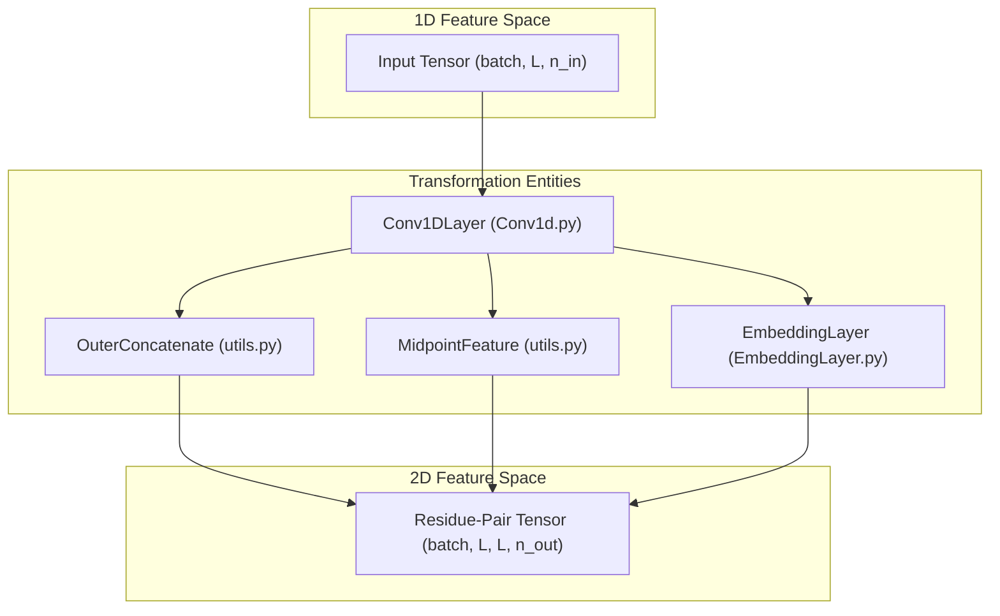
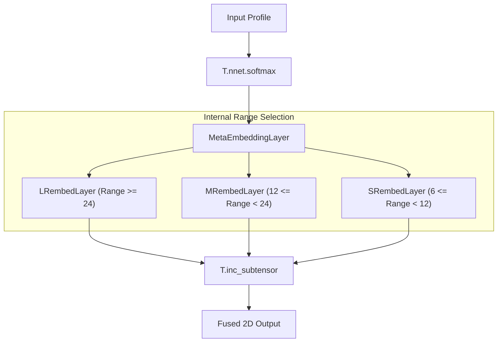

# 1D Convolutional and Embedding Layers

> **Relevant source files**
> * [DL4DistancePrediction2/Conv1d.py](https://github.com/j3xugit/RaptorX-Contact/blob/7c9de508/DL4DistancePrediction2/Conv1d.py)
> * [DL4DistancePrediction2/EmbeddingLayer.py](https://github.com/j3xugit/RaptorX-Contact/blob/7c9de508/DL4DistancePrediction2/EmbeddingLayer.py)
> * [DL4DistancePrediction2/utils.py](https://github.com/j3xugit/RaptorX-Contact/blob/7c9de508/DL4DistancePrediction2/utils.py)

This page documents the low-level neural network primitives used for processing 1D protein sequence features and their transformation into 2D spatial representations. It covers 1D convolutions with masking, specialized embedding layers for sequence profiles, and utility functions for dimensionality expansion.

## 1D Convolutional Layers

The `Conv1DLayer` class implements a 1D convolution operation optimized for protein sequences. Although it processes 1D data, it utilizes a Theano `conv2d` trick by reshaping the input to include a dummy dimension, effectively treating the sequence length as the width of a single-row image [DL4DistancePrediction2/Conv1d.py L22-L37](https://github.com/j3xugit/RaptorX-Contact/blob/7c9de508/DL4DistancePrediction2/Conv1d.py#L22-L37)

### Data Flow and Reshaping

The layer accepts an input tensor of shape `(batchSize, seqLen, numOfInFeatures)`. To perform convolution, it performs the following transformations:

1. **Dimshuffle**: The input is reshaped to `(batchSize, numOfInFeatures, 1, seqLen)` [DL4DistancePrediction2/Conv1d.py L36](https://github.com/j3xugit/RaptorX-Contact/blob/7c9de508/DL4DistancePrediction2/Conv1d.py#L36-L36)
2. **Convolution**: A 2D convolution is applied using a filter of shape `(numOfOutFeatures, numOfInFeatures, 1, windowSize)` [DL4DistancePrediction2/Conv1d.py L41-L61](https://github.com/j3xugit/RaptorX-Contact/blob/7c9de508/DL4DistancePrediction2/Conv1d.py#L41-L61)
3. **Restoration**: The output is shuffled back to `(batchSize, seqLen, numOfOutFeatures)` [DL4DistancePrediction2/Conv1d.py L68](https://github.com/j3xugit/RaptorX-Contact/blob/7c9de508/DL4DistancePrediction2/Conv1d.py#L68-L68)

### Mask Handling

To handle variable-length sequences within a batch, the layer supports a `mask`. After convolution, the `T.set_subtensor` function is used to zero-out positions in the output tensor that correspond to padded regions, preventing noise from propagating through the network [DL4DistancePrediction2/Conv1d.py L70-L80](https://github.com/j3xugit/RaptorX-Contact/blob/7c9de508/DL4DistancePrediction2/Conv1d.py#L70-L80)

| Parameter | Description |
| --- | --- |
| `halfWinSize` | Determines the receptive field ($2 \times \text{halfWinSize} + 1$) [DL4DistancePrediction2/Conv1d.py L30](https://github.com/j3xugit/RaptorX-Contact/blob/7c9de508/DL4DistancePrediction2/Conv1d.py#L30-L30) |
| `activation` | Theano activation function (e.g., `T.nnet.relu`) [DL4DistancePrediction2/Conv1d.py L24](https://github.com/j3xugit/RaptorX-Contact/blob/7c9de508/DL4DistancePrediction2/Conv1d.py#L24-L24) |
| `W` | Filter weights initialized using Glorot uniform distribution [DL4DistancePrediction2/Conv1d.py L42-L53](https://github.com/j3xugit/RaptorX-Contact/blob/7c9de508/DL4DistancePrediction2/Conv1d.py#L42-L53) |

**Sources:** [DL4DistancePrediction2/Conv1d.py L22-L87](https://github.com/j3xugit/RaptorX-Contact/blob/7c9de508/DL4DistancePrediction2/Conv1d.py#L22-L87)

---

## Embedding Layers

Embedding layers are responsible for lifting 1D sequence information into 2D space, facilitating the transition from sequence features to residue-pair features.

### EmbeddingLayer

The base `EmbeddingLayer` computes a 2D representation from a binary 1D input (e.g., one-hot encoded amino acids). It performs a complex tensor operation that resembles an outer product but incorporates learned weights `W` [DL4DistancePrediction2/EmbeddingLayer.py L8-L37](https://github.com/j3xugit/RaptorX-Contact/blob/7c9de508/DL4DistancePrediction2/EmbeddingLayer.py#L8-L37)

1. **Input**: `(batchSize, seqLen, n_in)`
2. **Operation**: It uses `T.tensordot` and `T.batched_tensordot` to combine input residues at positions $i$ and $j$ with the weight matrix $W$ of shape `(n_in, n_in, n_out)` [DL4DistancePrediction2/EmbeddingLayer.py L20-L33](https://github.com/j3xugit/RaptorX-Contact/blob/7c9de508/DL4DistancePrediction2/EmbeddingLayer.py#L20-L33)
3. **Output**: `(batchSize, seqLen, seqLen, n_out)` [DL4DistancePrediction2/EmbeddingLayer.py L36](https://github.com/j3xugit/RaptorX-Contact/blob/7c9de508/DL4DistancePrediction2/EmbeddingLayer.py#L36-L36)

### MetaEmbeddingLayer

The `MetaEmbeddingLayer` manages three distinct `EmbeddingLayer` instances, each specialized for different sequence separation ranges: **Long Range (LR)**, **Medium Range (MR)**, and **Short Range (SR)** [DL4DistancePrediction2/EmbeddingLayer.py L44-L61](https://github.com/j3xugit/RaptorX-Contact/blob/7c9de508/DL4DistancePrediction2/EmbeddingLayer.py#L44-L61)

It uses diagonal masking to apply specific embeddings based on the distance $|i - j|$ between residues:

* **LR**: $|i - j| \ge 24$ [DL4DistancePrediction2/EmbeddingLayer.py L64](https://github.com/j3xugit/RaptorX-Contact/blob/7c9de508/DL4DistancePrediction2/EmbeddingLayer.py#L64-L64)
* **MR**: $12 \le |i - j| < 24$ [DL4DistancePrediction2/EmbeddingLayer.py L68](https://github.com/j3xugit/RaptorX-Contact/blob/7c9de508/DL4DistancePrediction2/EmbeddingLayer.py#L68-L68)
* **SR**: $6 \le |i - j| < 12$ [DL4DistancePrediction2/EmbeddingLayer.py L69](https://github.com/j3xugit/RaptorX-Contact/blob/7c9de508/DL4DistancePrediction2/EmbeddingLayer.py#L69-L69)

### ProfileEmbeddingLayer

The `ProfileEmbeddingLayer` is designed for continuous profiles (like PSSMs). It applies a learned scale factor `W`, followed by a `softmax` normalization across the feature dimension, before passing the result to a `MetaEmbeddingLayer` [DL4DistancePrediction2/EmbeddingLayer.py L90-L103](https://github.com/j3xugit/RaptorX-Contact/blob/7c9de508/DL4DistancePrediction2/EmbeddingLayer.py#L90-L103)

**Sources:** [DL4DistancePrediction2/EmbeddingLayer.py L8-L109](https://github.com/j3xugit/RaptorX-Contact/blob/7c9de508/DL4DistancePrediction2/EmbeddingLayer.py#L8-L109)

---

## Dimensionality Transformation Utilities

The `utils.py` module provides several functions to transform 1D tensors into 2D tensors, which is critical for distance matrix prediction.

### 1D to 2D Transformation Logic

| Function | Logic | Output Shape |
| --- | --- | --- |
| `OuterConcatenate` | Concatenates features of residue $i$ and residue $j$. | `(batchSize, L, L, 2*n_in)` |
| `MidpointFeature` | Concatenates features of residue $i$, residue $j$, and the midpoint residue $(i+j)/2$. | `(batchSize, L, L, 3*n_in)` |

#### Implementation Details

* **OuterConcatenate**: Uses `T.mgrid` to generate coordinate indices and `T.concatenate` to join the feature vectors at every $i, j$ pair [DL4DistancePrediction2/utils.py L63-L73](https://github.com/j3xugit/RaptorX-Contact/blob/7c9de508/DL4DistancePrediction2/utils.py#L63-L73)
* **MidpointFeature**: Similar to `OuterConcatenate`, but additionally extracts the feature vector at the index calculated by `(x[0] + x[1])/2` [DL4DistancePrediction2/utils.py L23-L41](https://github.com/j3xugit/RaptorX-Contact/blob/7c9de508/DL4DistancePrediction2/utils.py#L23-L41)

### Pattern Expansion

* **ExpandBy3dPattern**: Replaces vectors in a tensor with linear combinations of predefined patterns. It uses `MyRepeat` and `T.tile` to expand spatial dimensions [DL4DistancePrediction2/utils.py L198-L218](https://github.com/j3xugit/RaptorX-Contact/blob/7c9de508/DL4DistancePrediction2/utils.py#L198-L218)
* **SampleBoundingBox**: Used during training to crop a square sub-matrix from the full $L \times L$ distance matrix to fit memory constraints [DL4DistancePrediction2/utils.py L99-L126](https://github.com/j3xugit/RaptorX-Contact/blob/7c9de508/DL4DistancePrediction2/utils.py#L99-L126)

**Sources:** [DL4DistancePrediction2/utils.py L23-L218](https://github.com/j3xugit/RaptorX-Contact/blob/7c9de508/DL4DistancePrediction2/utils.py#L23-L218)

---

## Architectural Data Flow Diagrams

### Entity Mapping: 1D to 2D Feature Lifting

This diagram illustrates how 1D sequence features are transformed into 2D residue-pair features using the classes and functions defined in the codebase.

**Sources:** [DL4DistancePrediction2/Conv1d.py L22-L30](https://github.com/j3xugit/RaptorX-Contact/blob/7c9de508/DL4DistancePrediction2/Conv1d.py#L22-L30)

 [DL4DistancePrediction2/EmbeddingLayer.py L8-L15](https://github.com/j3xugit/RaptorX-Contact/blob/7c9de508/DL4DistancePrediction2/EmbeddingLayer.py#L8-L15)

 [DL4DistancePrediction2/utils.py L23-L25](https://github.com/j3xugit/RaptorX-Contact/blob/7c9de508/DL4DistancePrediction2/utils.py#L23-L25)

 [DL4DistancePrediction2/utils.py L63-L65](https://github.com/j3xugit/RaptorX-Contact/blob/7c9de508/DL4DistancePrediction2/utils.py#L63-L65)

### MetaEmbeddingLayer Selection Logic

This diagram details how `MetaEmbeddingLayer` routes features based on sequence separation ranges.

**Sources:** [DL4DistancePrediction2/EmbeddingLayer.py L44-L76](https://github.com/j3xugit/RaptorX-Contact/blob/7c9de508/DL4DistancePrediction2/EmbeddingLayer.py#L44-L76)

 [DL4DistancePrediction2/EmbeddingLayer.py L98-L101](https://github.com/j3xugit/RaptorX-Contact/blob/7c9de508/DL4DistancePrediction2/EmbeddingLayer.py#L98-L101)