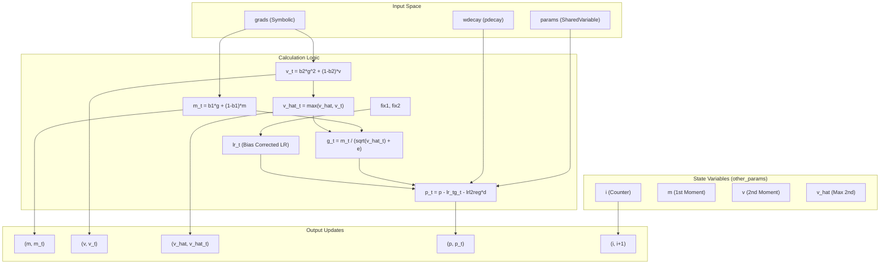
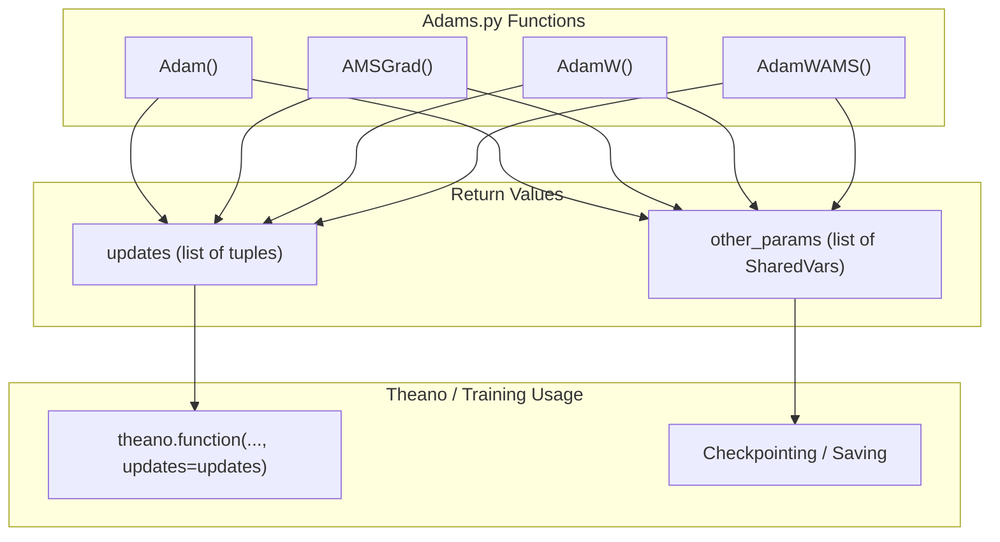

# Adam-Family Optimizers

> **Relevant source files**
> * [DL4DistancePrediction2/Adams.py](https://github.com/j3xugit/RaptorX-Contact/blob/7c9de508/DL4DistancePrediction2/Adams.py)

The `Adams.py` module provides a suite of adaptive gradient descent optimizers based on the Adam algorithm, implemented using Theano symbolic tensors. These optimizers are designed to handle the large-scale parameter updates required for deep residual networks in protein distance prediction. The module includes standard Adam, AMSGrad for improved convergence, and AdamW variants that implement decoupled weight decay to improve regularization performance.

## Core Optimizer Implementations

The module implements four primary optimizer variants. Each function takes model parameters and their corresponding symbolic gradients as input and returns a list of Theano update pairs and a list of shared variables for state persistence.

| Optimizer | Function | Key Feature |
| --- | --- | --- |
| **Adam** | `Adam()` | Standard adaptive moment estimation with bias correction. |
| **AMSGrad** | `AMSGrad()` | Uses the maximum of past squared gradients (`v_hat`) to ensure non-decreasing effective learning rates. |
| **AdamW** | `AdamW()` | Implements decoupled weight decay, applying L2 regularization directly to the weight update rather than the gradient. |
| **AdamWAMS** | `AdamWAMS()` | Combines the `v_hat` logic of AMSGrad with the decoupled weight decay of AdamW. |

Sources: [DL4DistancePrediction2/Adams.py L30](https://github.com/j3xugit/RaptorX-Contact/blob/7c9de508/DL4DistancePrediction2/Adams.py#L30-L30)

 [DL4DistancePrediction2/Adams.py L60](https://github.com/j3xugit/RaptorX-Contact/blob/7c9de508/DL4DistancePrediction2/Adams.py#L60-L60)

 [DL4DistancePrediction2/Adams.py L96](https://github.com/j3xugit/RaptorX-Contact/blob/7c9de508/DL4DistancePrediction2/Adams.py#L96-L96)

 [DL4DistancePrediction2/Adams.py L135](https://github.com/j3xugit/RaptorX-Contact/blob/7c9de508/DL4DistancePrediction2/Adams.py#L135-L135)

## Mathematical State Variables

The optimizers maintain several state variables as `theano.shared` variables to track momentum and scaling across training iterations.

* **`i` (Iteration Counter):** A scalar shared variable `i` initialized at 0.0, incremented by 1.0 each step [DL4DistancePrediction2/Adams.py L35-L37](https://github.com/j3xugit/RaptorX-Contact/blob/7c9de508/DL4DistancePrediction2/Adams.py#L35-L37)
* **`m` (First Moment):** Tracks the moving average of gradients: $m_t = \beta_1 \cdot g + (1 - \beta_1) \cdot m_{t-1}$ [DL4DistancePrediction2/Adams.py L48](https://github.com/j3xugit/RaptorX-Contact/blob/7c9de508/DL4DistancePrediction2/Adams.py#L48-L48)
* **`v` (Second Moment):** Tracks the moving average of squared gradients: $v_t = \beta_2 \cdot g^2 + (1 - \beta_2) \cdot v_{t-1}$ [DL4DistancePrediction2/Adams.py L49](https://github.com/j3xugit/RaptorX-Contact/blob/7c9de508/DL4DistancePrediction2/Adams.py#L49-L49)
* **`v_hat` (Max Second Moment):** Used in `AMSGrad` and `AdamWAMS` to maintain the maximum observed `v_t`: $\hat{v}*t = \max(\hat{v}*{t-1}, v_t)$ [DL4DistancePrediction2/Adams.py L82](https://github.com/j3xugit/RaptorX-Contact/blob/7c9de508/DL4DistancePrediction2/Adams.py#L82-L82)

### Bias Correction

To account for the initialization of `m` and `v` at zero, the optimizers apply bias correction terms `fix1` and `fix2` based on the current iteration `i_t`:

* `fix1 = 1. - (1. - b1)**i_t` [DL4DistancePrediction2/Adams.py L39](https://github.com/j3xugit/RaptorX-Contact/blob/7c9de508/DL4DistancePrediction2/Adams.py#L39-L39)
* `fix2 = 1. - (1. - b2)**i_t` [DL4DistancePrediction2/Adams.py L40](https://github.com/j3xugit/RaptorX-Contact/blob/7c9de508/DL4DistancePrediction2/Adams.py#L40-L40)
* The effective learning rate is adjusted as: `lr_t = lr * (sqrt(fix2) / fix1)` [DL4DistancePrediction2/Adams.py L41](https://github.com/j3xugit/RaptorX-Contact/blob/7c9de508/DL4DistancePrediction2/Adams.py#L41-L41)

Sources: [DL4DistancePrediction2/Adams.py L35-L57](https://github.com/j3xugit/RaptorX-Contact/blob/7c9de508/DL4DistancePrediction2/Adams.py#L35-L57)

 [DL4DistancePrediction2/Adams.py L80-L85](https://github.com/j3xugit/RaptorX-Contact/blob/7c9de508/DL4DistancePrediction2/Adams.py#L80-L85)

## Logic Flow and Data Mapping

The following diagram illustrates how the `AdamWAMS` implementation processes gradients and parameters into symbolic updates.

### AdamWAMS Update Logic

Sources: [DL4DistancePrediction2/Adams.py L147-L175](https://github.com/j3xugit/RaptorX-Contact/blob/7c9de508/DL4DistancePrediction2/Adams.py#L147-L175)

## Decoupled Weight Decay (AdamW)

Unlike standard L2 regularization where the penalty is added to the cost function (and thus affects the gradient `g`), `AdamW` and `AdamWAMS` decouple the weight decay from the adaptive gradient step.

The update formula in `AdamW` is:
`p_t = p - lr_t * g_t - lr * l2reg * d` [DL4DistancePrediction2/Adams.py L125](https://github.com/j3xugit/RaptorX-Contact/blob/7c9de508/DL4DistancePrediction2/Adams.py#L125-L125)

Where:

* `lr_t * g_t` is the adaptive gradient update.
* `lr * l2reg * d` is the weight decay term applied directly to the parameter `p`.
* `d` (from `pdecay`) defaults to the parameter `p` itself if not provided [DL4DistancePrediction2/Adams.py L97-L100](https://github.com/j3xugit/RaptorX-Contact/blob/7c9de508/DL4DistancePrediction2/Adams.py#L97-L100)

Sources: [DL4DistancePrediction2/Adams.py L96-L132](https://github.com/j3xugit/RaptorX-Contact/blob/7c9de508/DL4DistancePrediction2/Adams.py#L96-L132)

 [DL4DistancePrediction2/Adams.py L167](https://github.com/j3xugit/RaptorX-Contact/blob/7c9de508/DL4DistancePrediction2/Adams.py#L167-L167)

## Integration with Theano Functions

The optimizers are designed to be used when compiling a training function. The return values `updates` and `other_params` serve specific roles in the training lifecycle.

### Code Entity Association

### Checkpointing and State Persistence

The `other_params` list is critical for model checkpointing. Because adaptive optimizers like Adam store running averages (`m`, `v`), simply saving the model weights `p` is insufficient to resume training exactly where it left off.

* `other_params` contains the iteration counter `i` [DL4DistancePrediction2/Adams.py L36](https://github.com/j3xugit/RaptorX-Contact/blob/7c9de508/DL4DistancePrediction2/Adams.py#L36-L36)
* It contains all moment buffers (`m`, `v`, `v_hat`) for every parameter in the model [DL4DistancePrediction2/Adams.py L45-L46](https://github.com/j3xugit/RaptorX-Contact/blob/7c9de508/DL4DistancePrediction2/Adams.py#L45-L46)  [DL4DistancePrediction2/Adams.py L76-L78](https://github.com/j3xugit/RaptorX-Contact/blob/7c9de508/DL4DistancePrediction2/Adams.py#L76-L78)
* When saving a model, the values of all variables in `other_params` should be serialized alongside the model parameters.

Sources: [DL4DistancePrediction2/Adams.py L32-L58](https://github.com/j3xugit/RaptorX-Contact/blob/7c9de508/DL4DistancePrediction2/Adams.py#L32-L58)

 [DL4DistancePrediction2/Adams.py L103-L132](https://github.com/j3xugit/RaptorX-Contact/blob/7c9de508/DL4DistancePrediction2/Adams.py#L103-L132)