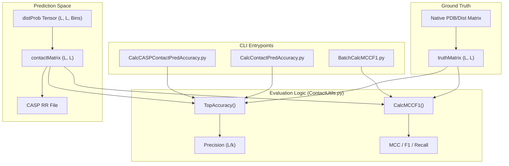
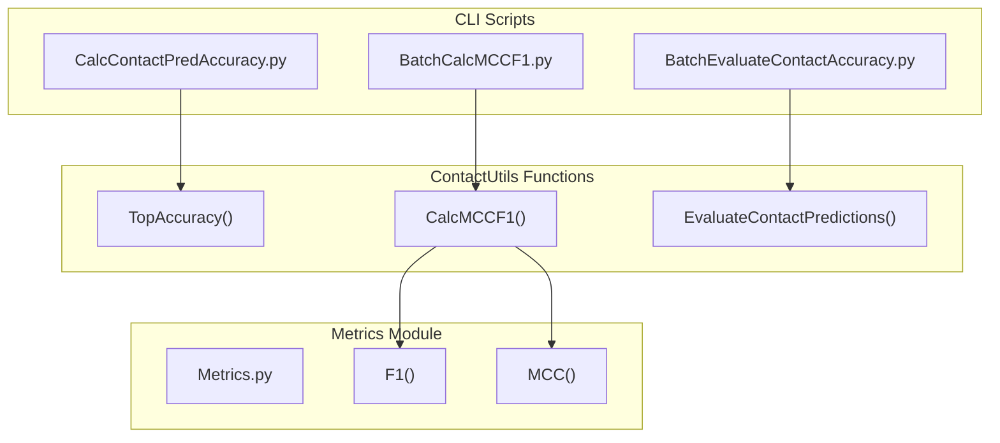

# Contact Prediction Evaluation

> **Relevant source files**
> * [DL4DistancePrediction2/BatchCalcMCCF1.py](https://github.com/j3xugit/RaptorX-Contact/blob/7c9de508/DL4DistancePrediction2/BatchCalcMCCF1.py)
> * [DL4DistancePrediction2/BatchEvaluateContactAccuracy.py](https://github.com/j3xugit/RaptorX-Contact/blob/7c9de508/DL4DistancePrediction2/BatchEvaluateContactAccuracy.py)
> * [DL4DistancePrediction2/CalcCASPContactPredAccuracy.py](https://github.com/j3xugit/RaptorX-Contact/blob/7c9de508/DL4DistancePrediction2/CalcCASPContactPredAccuracy.py)
> * [DL4DistancePrediction2/CalcContactPredAccuracy.py](https://github.com/j3xugit/RaptorX-Contact/blob/7c9de508/DL4DistancePrediction2/CalcContactPredAccuracy.py)
> * [DL4DistancePrediction2/CalcMCCF1.py](https://github.com/j3xugit/RaptorX-Contact/blob/7c9de508/DL4DistancePrediction2/CalcMCCF1.py)
> * [DL4DistancePrediction2/ContactUtils.py](https://github.com/j3xugit/RaptorX-Contact/blob/7c9de508/DL4DistancePrediction2/ContactUtils.py)

This page documents the evaluation infrastructure for protein contact prediction within the RaptorX-Contact system. It covers the parsing of CASP RR formats, calculation of precision metrics (Top-L/k), and statistical analysis using Matthews Correlation Coefficient (MCC) and F1 scores across various sequence separation ranges.

## Overview of Evaluation Metrics

The system evaluates contact predictions by comparing predicted probability matrices against ground-truth distance matrices (typically $C_\beta-C_\beta$ distances). The primary metrics used are:

* **Top-L/k Precision**: The accuracy of the top $L$, $L/2$, $L/5$, and $L/10$ predicted contacts, where $L$ is the sequence length [DL4DistancePrediction2/ContactUtils.py:284-285].
* **MCC and F1**: Threshold-based metrics calculated by sweeping through probability cutoffs (e.g., 0.2 to 0.6) [DL4DistancePrediction2/BatchCalcMCCF1.py:45-49].
* **Sequence Separation Ranges**: Metrics are reported for Short Range (SR: $6 \le \text{sep} < 12$), Medium Range (MR: $12 \le \text{sep} < 24$), Long Range (LR: $\text{sep} \ge 24$), and Extra Long Range (ER: $\text{sep} \ge 48$) [DL4DistancePrediction2/ContactUtils.py:288-291].

### Data Flow: Prediction to Accuracy

The following diagram illustrates how raw distance probability tensors are transformed into contact matrices and subsequently evaluated against native structures.

**Diagram: Contact Evaluation Pipeline**

**Sources:** [DL4DistancePrediction2/ContactUtils.py:192-202], [DL4DistancePrediction2/ContactUtils.py:206-220], [DL4DistancePrediction2/ContactUtils.py:280-285], [DL4DistancePrediction2/CalcContactPredAccuracy.py:19-22].

---

## Core Utility Functions (ContactUtils.py)

`ContactUtils.py` serves as the backend for all contact evaluation scripts.

### Matrix Loading and Conversion

* **`LoadContactMatrix(file)`**: Loads a text-based $L \times L$ matrix using `np.genfromtxt` [DL4DistancePrediction2/ContactUtils.py:12-23].
* **`Distance2Contact(distProb, labelOf8)`**: Converts a multi-bin distance probability tensor into a single contact probability matrix by summing the probabilities of all bins representing distances $\le 8\text{\AA}$ [DL4DistancePrediction2/ContactUtils.py:192-202].
* **`LoadContactMatrixInCASPFormat(filename)`**: Parses the standard CASP RR format. It validates the `PFRMAT RR` header, extracts the target name and sequence, and populates a symmetric matrix from the residue pair indices and confidence scores [DL4DistancePrediction2/ContactUtils.py:27-102].

### Performance Calculation

* **`TopAccuracy(pred, truth, ...)`**: Calculates precision for the top-ranked $N$ contacts. It filters pairs based on sequence separation (SR, MR, LR) and computes the ratio of true positives (where native distance $\le 8\text{\AA}$) over the number of predicted pairs [DL4DistancePrediction2/ContactUtils.py:280-300].
* **`CalcMCCF1(pred, truth, probCutoff, contactCutoff)`**: Computes the confusion matrix (TP, FP, TN, FN) at a specific probability threshold. It uses the `Metrics` module to derive MCC and F1 scores for different separation ranges [DL4DistancePrediction2/ContactUtils.py:206-220], [DL4DistancePrediction2/BatchCalcMCCF1.py:56-61].

**Sources:** [DL4DistancePrediction2/ContactUtils.py:12-23], [DL4DistancePrediction2/ContactUtils.py:27-102], [DL4DistancePrediction2/ContactUtils.py:192-202], [DL4DistancePrediction2/ContactUtils.py:280-300].

---

## Evaluation CLI Tools

The system provides several scripts for individual and batch processing of predictions.

### Accuracy and Precision Tools

| Script | Purpose | Input Formats |
| --- | --- | --- |
| `CalcContactPredAccuracy.py` | Evaluates a single protein's precision. | Text-based matrices [DL4DistancePrediction2/CalcContactPredAccuracy.py:11-22] |
| `CalcCASPContactPredAccuracy.py` | Evaluates a CASP RR formatted file. | RR file + PKL native matrix [DL4DistancePrediction2/CalcCASPContactPredAccuracy.py:9-18] |
| `BatchEvaluateContactAccuracy.py` | Aggregates Top-L/k precision for a list. | `.predictedDistMatrix.pkl` files [DL4DistancePrediction2/BatchEvaluateContactAccuracy.py:16-21] |

### Statistical Metrics Tools

* **`CalcMCCF1.py`**: Runs a sweep of probability cutoffs (from 0.20 to 0.60 in steps of 0.02) for a single target to find the optimal threshold for MCC and F1 [DL4DistancePrediction2/CalcMCCF1.py:32-37].
* **`BatchCalcMCCF1.py`**: Similar to the single-target version but calculates the average MCC and F1 across a dataset. It reports both per-target averages and per-pair averages (pooling all pairs across all proteins) [DL4DistancePrediction2/BatchCalcMCCF1.py:45-61].

**Diagram: CLI to Function Mapping**

**Sources:** [DL4DistancePrediction2/BatchCalcMCCF1.py:5-7], [DL4DistancePrediction2/BatchEvaluateContactAccuracy.py:8-9], [DL4DistancePrediction2/CalcContactPredAccuracy.py:5-6], [DL4DistancePrediction2/ContactUtils.py:9].

---

## CASP Format Export

The function `SaveContactMatrixInCASPFormat` generates submission-ready RR files. Key implementation details include:

1. **Probability Scaling**: Applies a `probScaleFactor` (defined in `config.py`) to the contact probabilities [DL4DistancePrediction2/ContactUtils.py:106-111].
2. **Sorting and Filtering**: * Only considers the upper triangle ($i < j$) [DL4DistancePrediction2/ContactUtils.py:161-162]. * Excludes pairs with sequence separation $< 6$ [DL4DistancePrediction2/ContactUtils.py:164-166]. * Sorts all pairs by descending probability [DL4DistancePrediction2/ContactUtils.py:130-132].
3. **Constraints**: Limits the output to a maximum of 300,000 pairs (CASP limit) and applies a minimum probability threshold (default 0.05) for large matrices [DL4DistancePrediction2/ContactUtils.py:113-141].

**Sources:** [DL4DistancePrediction2/ContactUtils.py:106-187].