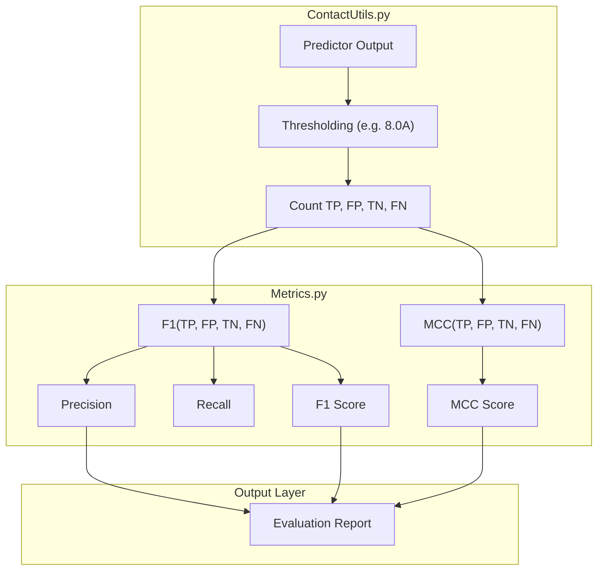

# Core Metrics Library

> **Relevant source files**
> * [DL4DistancePrediction2/Metrics.py](https://github.com/j3xugit/RaptorX-Contact/blob/7c9de508/DL4DistancePrediction2/Metrics.py)

The `Core Metrics Library` provides the fundamental mathematical definitions for evaluating binary classification performance within the RaptorX-Contact framework. Specifically, it implements the **F1 Score**, **Precision**, **Recall**, and the **Matthews Correlation Coefficient (MCC)**. These metrics are used to assess the quality of predicted contact maps against ground-truth structures derived from PDB files.

## Mathematical Implementations

The library, located in `Metrics.py`, implements these metrics using standard confusion matrix parameters:

* **TP (True Positives)**: Correctly predicted contacts.
* **FP (False Positives)**: Non-contacts incorrectly predicted as contacts.
* **TN (True Negatives)**: Correctly predicted non-contacts.
* **FN (False Negatives)**: Actual contacts that were not predicted.

### F1, Precision, and Recall

The `F1()` function calculates three related metrics simultaneously. It incorporates a small constant `epsilon` ($10^{-6}$) to prevent division-by-zero errors when no positives are predicted or present [DL4DistancePrediction2/Metrics.py L3-L9](https://github.com/j3xugit/RaptorX-Contact/blob/7c9de508/DL4DistancePrediction2/Metrics.py#L3-L9)

* **Precision**: $\frac{TP}{TP + FP + \epsilon}$
* **Recall**: $\frac{TP}{TP + FN + \epsilon}$
* **F1 Score**: $\frac{2 \cdot Precision \cdot Recall}{Precision + Recall + \epsilon}$

### Matthews Correlation Coefficient (MCC)

The `MCC()` function provides a balanced measure of quality that can be used even if the classes are of very different sizes (which is typical in contact prediction where non-contacts far outnumber contacts). The implementation uses a square root of the product of the sums of the confusion matrix rows and columns [DL4DistancePrediction2/Metrics.py L12-L16](https://github.com/j3xugit/RaptorX-Contact/blob/7c9de508/DL4DistancePrediction2/Metrics.py#L12-L16)

* **MCC**: $\frac{TP \cdot TN - FP \cdot FN}{\sqrt{(TP+FP)(TP+FN)(TN+FP)(TN+FN) + \epsilon}}$

**Sources:**

* [DL4DistancePrediction2/Metrics.py L3-L9](https://github.com/j3xugit/RaptorX-Contact/blob/7c9de508/DL4DistancePrediction2/Metrics.py#L3-L9)
* [DL4DistancePrediction2/Metrics.py L12-L16](https://github.com/j3xugit/RaptorX-Contact/blob/7c9de508/DL4DistancePrediction2/Metrics.py#L12-L16)

## Code Entity Mapping

The following diagram illustrates how the low-level mathematical functions in `Metrics.py` are integrated into the higher-level evaluation tools used by the system.

### Metric Consumption Flow

"Metrics.py" serves as the base utility for specialized evaluation scripts like "BatchCalcMCCF1.py" and the utility module "ContactUtils.py".

```

```

**Sources:**

* [DL4DistancePrediction2/Metrics.py L3-L16](https://github.com/j3xugit/RaptorX-Contact/blob/7c9de508/DL4DistancePrediction2/Metrics.py#L3-L16)

## Integration and Data Flow

The metrics defined here are not typically called directly by the training loops but are consumed during post-prediction analysis. The standard flow involves converting distance probability matrices into binary contact matrices using a threshold (often 8.0Å), then passing the resulting counts to these functions.

### Detailed Data Flow Diagram

This diagram shows how raw confusion matrix scalars (TP, FP, TN, FN) flow from the `ContactUtils` logic into the `Metrics` library to produce final evaluation scores.



### Numerical Stability

A key implementation detail in both `F1()` and `MCC()` is the use of `epsilon = 0.000001` [DL4DistancePrediction2/Metrics.py L4](https://github.com/j3xugit/RaptorX-Contact/blob/7c9de508/DL4DistancePrediction2/Metrics.py#L4-L4)

 [DL4DistancePrediction2/Metrics.py L14](https://github.com/j3xugit/RaptorX-Contact/blob/7c9de508/DL4DistancePrediction2/Metrics.py#L14-L14)

 In the context of protein contact prediction, especially for short sequences or very high-confidence thresholds, the number of predicted contacts (TP + FP) can frequently be zero. The `epsilon` constant ensures that the evaluation scripts do not crash during batch processing of large datasets (e.g., CASP targets or PDB25 subsets).

**Sources:**

* [DL4DistancePrediction2/Metrics.py L4-L7](https://github.com/j3xugit/RaptorX-Contact/blob/7c9de508/DL4DistancePrediction2/Metrics.py#L4-L7)
* [DL4DistancePrediction2/Metrics.py L14-L15](https://github.com/j3xugit/RaptorX-Contact/blob/7c9de508/DL4DistancePrediction2/Metrics.py#L14-L15)