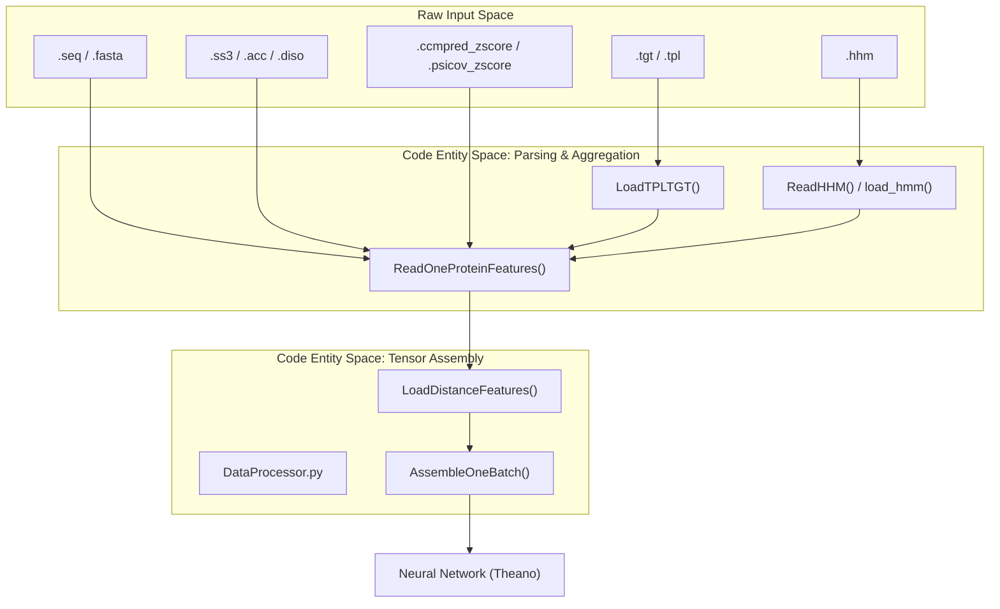
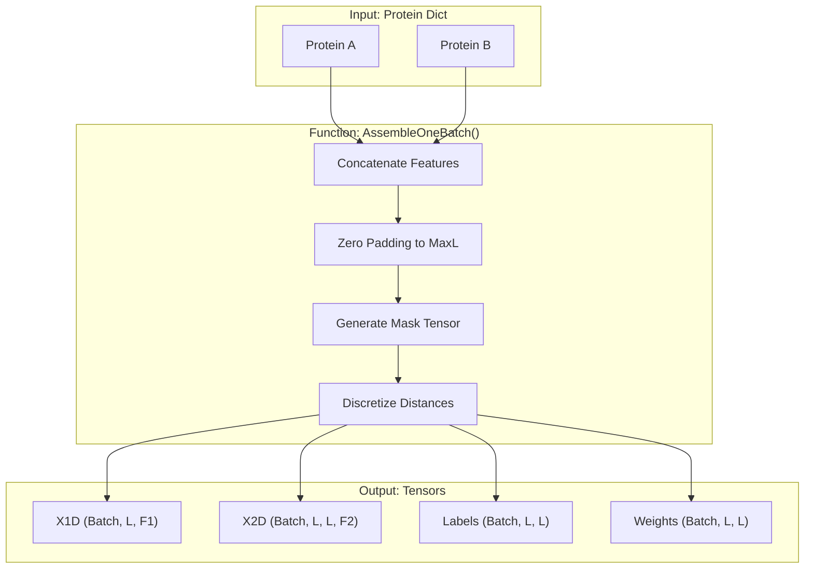

# Data Ingestion and Feature Engineering

> **Relevant source files**
> * [DL4DistancePrediction2/DataProcessor.py](https://github.com/j3xugit/RaptorX-Contact/blob/7c9de508/DL4DistancePrediction2/DataProcessor.py)
> * [DL4DistancePrediction2/ReadProteinFeatures.py](https://github.com/j3xugit/RaptorX-Contact/blob/7c9de508/DL4DistancePrediction2/ReadProteinFeatures.py)

This page provides a high-level overview of how **RaptorX-Contact** ingests raw protein data and transforms it into the structured tensors required for deep learning. The pipeline moves from parsing raw bioinformatics file formats (like `.hhm`, `.tgt`, and `.ss3`) to the assembly of feature-rich batches for the neural network.

The ingestion process is divided into three primary stages:

1. **Parsing and Profile Generation**: Converting sequence and HMM data into numerical profiles.
2. **Feature Aggregation**: Reading diverse 1D (sequential) and 2D (pairwise) features from the filesystem.
3. **Data Processing and Batching**: Final tensor construction, distance discretization, and label weighting.

### Data Ingestion Workflow

The following diagram illustrates the flow from raw input files to the final tensors consumed by the model classes in `Model4DistancePrediction.py`.

**Figure 1: Data Flow from Files to Tensors**

**Sources:**

* `DL4DistancePrediction2/ReadOneProteinFeatures.py` [197-270](https://github.com/j3xugit/RaptorX-Contact/blob/7c9de508/197-270)
* `DL4DistancePrediction2/DataProcessor.py` [111-204](https://github.com/j3xugit/RaptorX-Contact/blob/7c9de508/111-204)
* `Common/LoadHHM.py` [220-250](https://github.com/j3xugit/RaptorX-Contact/blob/7c9de508/220-250)

---

### 2.1 HHM File Parsing and Profile Generation

The system utilizes Hidden Markov Models (HMM) to capture evolutionary information. The `LoadHHM.py` module is responsible for parsing `.hhm` files produced by HHsearch. It extracts amino acid profiles and state transition probabilities (e.g., Match-to-Match, Match-to-Insertion).

Key operations include:

* **Matrix Construction**: Building PSFM (Position Specific Frequency Matrix) and PSSM (Position Specific Scoring Matrix).
* **Pseudo-count Correction**: Applying Gonnet substitution matrices to refine profiles.
* **State Mapping**: Converting HMM transitions into feature vectors.

For technical details on HMM parsing and the specific transition states extracted, see [HHM File Parsing and Profile Generation](/j3xugit/RaptorX-Contact/2.1-hhm-file-parsing-and-profile-generation).

**Sources:**

* `Common/LoadHHM.py` [220-400](https://github.com/j3xugit/RaptorX-Contact/blob/7c9de508/220-400)

---

### 2.2 Protein Feature Reading and Aggregation

Before training or inference, features must be gathered from multiple sources into a unified Python dictionary. `ReadProteinFeatures.py` and `ReadOneProteinFeatures.py` act as the discovery layer, locating files by suffix and validating their contents.

**Table 1: Supported Input Features**

| Feature Type | Source Files | Description |
| --- | --- | --- |
| **1D (Sequential)** | `.ss3`, `.acc`, `.diso` | Secondary structure, accessibility, and disorder predictions. |
| **1D (Profile)** | `.tgt`, `.pssm` | Evolutionary profiles and sequence-template alignments. |
| **2D (Pairwise)** | `.ccmpred_zscore`, `.psicov_zscore` | Co-evolutionary signals from CCMpred and PSICOV. |
| **2D (Potential)** | `.pot` | Custom pairwise potentials. |

The aggregation logic ensures that all features are aligned to the primary sequence length and handles the symmetrization of 2D matrices [DL4DistancePrediction2/ReadProteinFeatures.py L187-L188](https://github.com/j3xugit/RaptorX-Contact/blob/7c9de508/DL4DistancePrediction2/ReadProteinFeatures.py#L187-L188)

For details on directory-based discovery and TGT parsing, see [Protein Feature Reading and Aggregation](/j3xugit/RaptorX-Contact/2.2-protein-feature-reading-and-aggregation).

**Sources:**

* `DL4DistancePrediction2/ReadProteinFeatures.py` [15-194](https://github.com/j3xugit/RaptorX-Contact/blob/7c9de508/15-194)
* `DL4DistancePrediction2/ReadOneProteinFeatures.py` [1-270](https://github.com/j3xugit/RaptorX-Contact/blob/7c9de508/1-270)

---

### 2.3 Data Processing, Batching, and Label Discretization

The final stage of ingestion occurs in `DataProcessor.py`, which prepares the raw data for the Theano computational graph. This involves transforming qualitative data into quantitative tensors and handling the complexities of distance-based labels.

**Core Responsibilities:**

* **Dimensionality Lifting**: Converting 1D sequential features into 2D matrices (e.g., via `OuterProduct` or `OuterConcatenate`) to be merged with 2D co-evolutionary features [DL4DistancePrediction2/DataProcessor.py L133-L141](https://github.com/j3xugit/RaptorX-Contact/blob/7c9de508/DL4DistancePrediction2/DataProcessor.py#L133-L141)
* **Distance Discretization**: Converting continuous residue distances into discrete bins (e.g., 3, 12, 25, or 52 bins) based on the `Response2LabelType` configuration [DL4DistancePrediction2/DataProcessor.py L16-L17](https://github.com/j3xugit/RaptorX-Contact/blob/7c9de508/DL4DistancePrediction2/DataProcessor.py#L16-L17)
* **Weighting & Masking**: Calculating `labelWeights` to handle class imbalance in distance ranges and generating `masks` to ignore padding during training [DL4DistancePrediction2/DataProcessor.py L61-L76](https://github.com/j3xugit/RaptorX-Contact/blob/7c9de508/DL4DistancePrediction2/DataProcessor.py#L61-L76)

**Figure 2: Batch Assembly Logic in `DataProcessor.py`**

For details on the discretization schemes and batch assembly logic, see [Data Processing, Batching, and Label Discretization](/j3xugit/RaptorX-Contact/2.3-data-processing-batching-and-label-discretization).

**Sources:**

* `DL4DistancePrediction2/DataProcessor.py` [111-204](https://github.com/j3xugit/RaptorX-Contact/blob/7c9de508/111-204)
* `DL4DistancePrediction2/DistanceUtils.py` [1-100](https://github.com/j3xugit/RaptorX-Contact/blob/7c9de508/1-100)