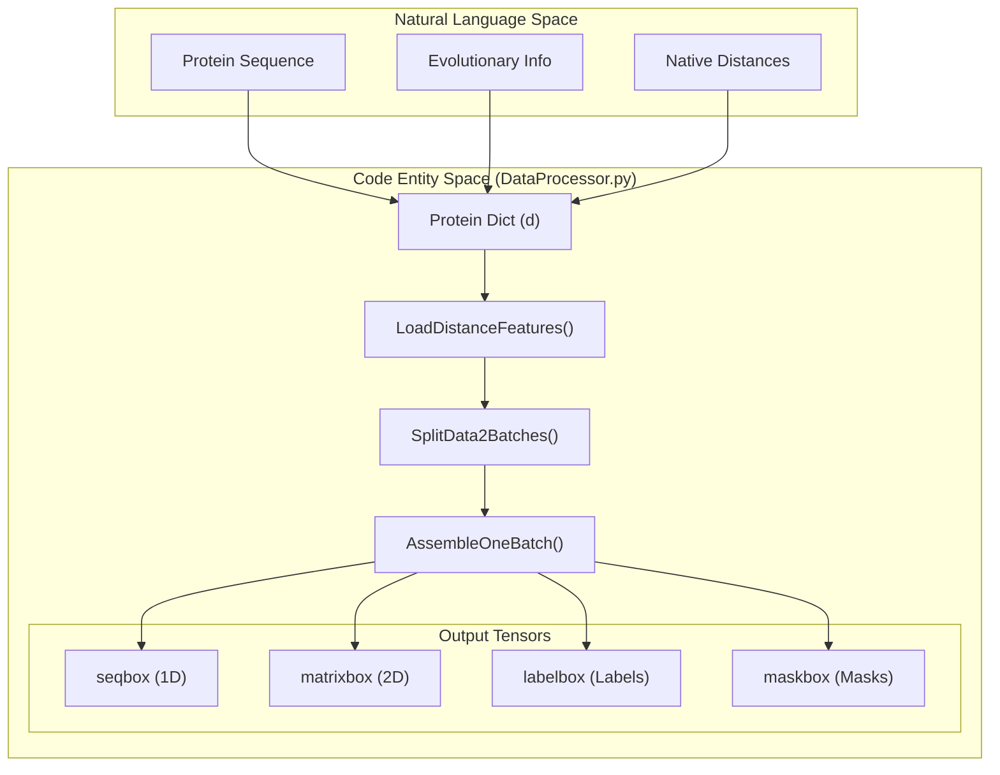
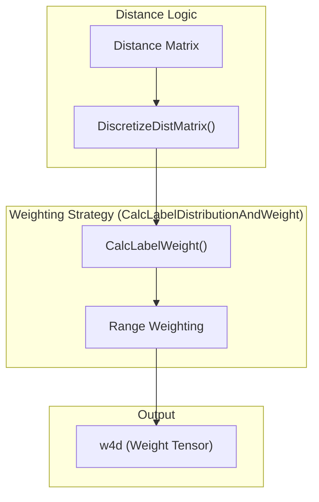

# Data Processing, Batching, and Label Discretization

> **Relevant source files**
> * [DL4DistancePrediction2/DataProcessor.py](https://github.com/j3xugit/RaptorX-Contact/blob/7c9de508/DL4DistancePrediction2/DataProcessor.py)

This page documents the data processing pipeline implemented in `DataProcessor.py`. This module is responsible for transforming raw protein features (1D and 2D) into structured tensors, discretizing continuous distance labels into classification bins, and assembling batches for the ResNet models.

## Feature Aggregation and Tensor Construction

The `LoadDistanceFeatures()` function acts as the primary loader for protein data. It aggregates sequential (1D) and pairwise (2D) features into the specific formats required by the neural network architecture.

### 1D Sequential Features

Sequential features are concatenated along the feature dimension to form a matrix of shape $(L, F_{1D})$, where $L$ is the sequence length.

* **One-Hot Encoding**: The primary sequence is converted using `config.SeqOneHotEncoding` [DL4DistancePrediction2/DataProcessor.py L130](https://github.com/j3xugit/RaptorX-Contact/blob/7c9de508/DL4DistancePrediction2/DataProcessor.py#L130-L130)
* **Secondary Structure (SS3)**: Often placed before other features [DL4DistancePrediction2/DataProcessor.py L145-L147](https://github.com/j3xugit/RaptorX-Contact/blob/7c9de508/DL4DistancePrediction2/DataProcessor.py#L145-L147)
* **Solvent Accessibility (ACC)** and **Disorder (DISO)** [DL4DistancePrediction2/DataProcessor.py L149-L157](https://github.com/j3xugit/RaptorX-Contact/blob/7c9de508/DL4DistancePrediction2/DataProcessor.py#L149-L157)
* **PSSM**: Position-Specific Scoring Matrices [DL4DistancePrediction2/DataProcessor.py L152-L153](https://github.com/j3xugit/RaptorX-Contact/blob/7c9de508/DL4DistancePrediction2/DataProcessor.py#L152-L153)

### 2D Pairwise Features

Pairwise features form a tensor of shape $(L, L, F_{2D})$.

* **Location Features**: `LocationFeature()` computes a relative separation feature $min(1, |i-j|/30)$ [DL4DistancePrediction2/DataProcessor.py L60-L76](https://github.com/j3xugit/RaptorX-Contact/blob/7c9de508/DL4DistancePrediction2/DataProcessor.py#L60-L76)
* **Cube Root Feature**: `CubeRootFeature()` computes $\sqrt[3]{|i-j|}$ to account for protein radius scaling [DL4DistancePrediction2/DataProcessor.py L78-L86](https://github.com/j3xugit/RaptorX-Contact/blob/7c9de508/DL4DistancePrediction2/DataProcessor.py#L78-L86)
* **Evolutionary Coupling**: Normalized CCMpred ($Z$-scores) and PSICOV features are appended if specified in `modelSpecs` [DL4DistancePrediction2/DataProcessor.py L200-L210](https://github.com/j3xugit/RaptorX-Contact/blob/7c9de508/DL4DistancePrediction2/DataProcessor.py#L200-L210)
* **Template Features**: If homology modeling is used, `tplDistMatrix` and `tplProbMatrix` are integrated [DL4DistancePrediction2/DataProcessor.py L218-L232](https://github.com/j3xugit/RaptorX-Contact/blob/7c9de508/DL4DistancePrediction2/DataProcessor.py#L218-L232)

### Sources

* [DL4DistancePrediction2/DataProcessor.py L60-L86](https://github.com/j3xugit/RaptorX-Contact/blob/7c9de508/DL4DistancePrediction2/DataProcessor.py#L60-L86)
* [DL4DistancePrediction2/DataProcessor.py L111-L232](https://github.com/j3xugit/RaptorX-Contact/blob/7c9de508/DL4DistancePrediction2/DataProcessor.py#L111-L232)

---

## Distance Label Discretization

RaptorX-Contact treats distance prediction primarily as a multi-class classification problem. The continuous Euclidean distances between atoms (e.g., $C_\beta-C_\beta$) are discretized into bins based on different schemes defined in `config.py`.

| Scheme | Bin Count | Description |
| --- | --- | --- |
| **3C** | 3 | Contact (<8Å), Near-contact (8-15Å), Non-contact (>15Å) |
| **12C** | 12 | Bins from 4Å to 15Å with 1Å width, plus one bin for >15Å |
| **25C** | 25 | Bins from 4Å to 16Å with 0.5Å width, plus one bin for >16Å |
| **52C** | 52 | High-resolution bins from 2Å to 20Å, plus one bin for >20Å |

The discretization logic is handled by `DistanceUtils.DiscretizeDistMatrix()` and consumed during batch assembly in `AssembleOneBatch()` [DL4DistancePrediction2/DataProcessor.py L464-L472](https://github.com/j3xugit/RaptorX-Contact/blob/7c9de508/DL4DistancePrediction2/DataProcessor.py#L464-L472)

### Sources

* [DL4DistancePrediction2/config.py L141-L175](https://github.com/j3xugit/RaptorX-Contact/blob/7c9de508/DL4DistancePrediction2/config.py#L141-L175)
* [DL4DistancePrediction2/DataProcessor.py L464-L472](https://github.com/j3xugit/RaptorX-Contact/blob/7c9de508/DL4DistancePrediction2/DataProcessor.py#L464-L472)

---

## Batching and Padding Strategy

Because protein sequences have variable lengths, `DataProcessor.py` implements a padding and masking strategy to facilitate GPU computation in batches.

### Data Flow: From Dict to Batch

The following diagram illustrates the transformation of protein dictionary data into tensors.

**Diagram: Data Transformation Pipeline**

### Implementation Details

1. **SplitData2Batches**: Groups proteins of similar lengths together to minimize padding overhead [DL4DistancePrediction2/DataProcessor.py L346-L382](https://github.com/j3xugit/RaptorX-Contact/blob/7c9de508/DL4DistancePrediction2/DataProcessor.py#L346-L382)
2. **AssembleOneBatch**: * Determines the maximum length $L_{max}$ in the batch. * Initializes zero-tensors (boxes) for 1D features, 2D features, and labels. * Populates the boxes and creates a `maskbox` where valid residues are marked with `1` and padded residues with `0` [DL4DistancePrediction2/DataProcessor.py L488-L491](https://github.com/j3xugit/RaptorX-Contact/blob/7c9de508/DL4DistancePrediction2/DataProcessor.py#L488-L491) * For 2D labels, the mask is a matrix $L_{max} \times L_{max}$ generated by the outer product of the 1D mask [DL4DistancePrediction2/DataProcessor.py L495](https://github.com/j3xugit/RaptorX-Contact/blob/7c9de508/DL4DistancePrediction2/DataProcessor.py#L495-L495)

### Sources

* [DL4DistancePrediction2/DataProcessor.py L346-L382](https://github.com/j3xugit/RaptorX-Contact/blob/7c9de508/DL4DistancePrediction2/DataProcessor.py#L346-L382)
* [DL4DistancePrediction2/DataProcessor.py L404-L515](https://github.com/j3xugit/RaptorX-Contact/blob/7c9de508/DL4DistancePrediction2/DataProcessor.py#L404-L515)

---

## Range-Based Label Weighting

To handle the imbalance between short-range and long-range contacts, `CalcLabelDistributionAndWeight()` calculates sample weights.

**Diagram: Label Weighting Logic**

* **Distance Weighting**: Weights are inversely proportional to the frequency of the distance bin, controlled by `modelSpecs['weightStrategy']` [DL4DistancePrediction2/DataProcessor.py L284-L290](https://github.com/j3xugit/RaptorX-Contact/blob/7c9de508/DL4DistancePrediction2/DataProcessor.py#L284-L290)
* **Range Weighting**: Long-range interactions (separation $\ge 24$) can be assigned higher importance than short-range ones ($\ge 6$) using `modelSpecs['rangeWeight']` [DL4DistancePrediction2/DataProcessor.py L292-L302](https://github.com/j3xugit/RaptorX-Contact/blob/7c9de508/DL4DistancePrediction2/DataProcessor.py#L292-L302)
* **Invalid Data**: Entries with negative distances (missing data in PDB) are assigned a weight of 0 to mask them from the loss function [DL4DistancePrediction2/DataProcessor.py L479-L480](https://github.com/j3xugit/RaptorX-Contact/blob/7c9de508/DL4DistancePrediction2/DataProcessor.py#L479-L480)

### Sources

* [DL4DistancePrediction2/DataProcessor.py L246-L310](https://github.com/j3xugit/RaptorX-Contact/blob/7c9de508/DL4DistancePrediction2/DataProcessor.py#L246-L310)
* [DL4DistancePrediction2/DataProcessor.py L474-L486](https://github.com/j3xugit/RaptorX-Contact/blob/7c9de508/DL4DistancePrediction2/DataProcessor.py#L474-L486)
* [DL4DistancePrediction2/DistanceUtils.py L284](https://github.com/j3xugit/RaptorX-Contact/blob/7c9de508/DL4DistancePrediction2/DistanceUtils.py#L284-L284)