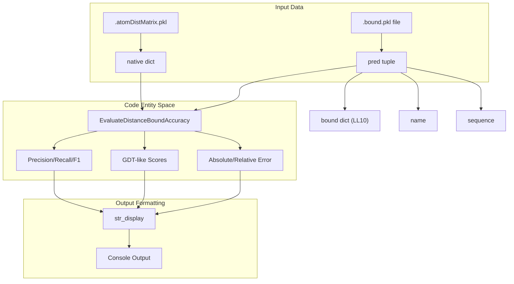
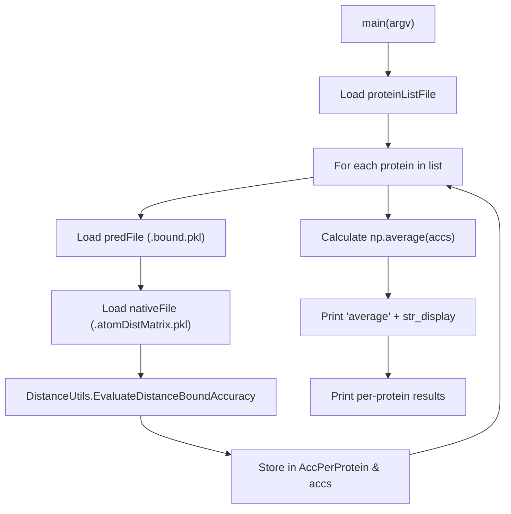

# Distance Bound Accuracy Evaluation

> **Relevant source files**
> * [DL4DistancePrediction2/BatchEvaluateDistanceAccuracy.py](https://github.com/j3xugit/RaptorX-Contact/blob/7c9de508/DL4DistancePrediction2/BatchEvaluateDistanceAccuracy.py)
> * [DL4DistancePrediction2/EvaluateDistanceAccuracy.py](https://github.com/j3xugit/RaptorX-Contact/blob/7c9de508/DL4DistancePrediction2/EvaluateDistanceAccuracy.py)

The distance bound accuracy evaluation module provides tools to quantify the precision of predicted inter-atom distance matrices against ground-truth native structures. Unlike contact evaluation which uses a binary threshold (e.g., 8Å), this module evaluates the predicted real-valued distances and their associated confidence bounds across various atom pairs (Cb-Cb, Ca-Ca, etc.).

## Overview

The evaluation framework consists of two primary entry points that leverage the core statistical logic defined in `DistanceUtils.py`:

1. **EvaluateDistanceAccuracy.py**: Performs evaluation for a single protein.
2. **BatchEvaluateDistanceAccuracy.py**: Processes a list of proteins, providing both per-protein results and aggregate averages.

These tools compare predicted `.bound.pkl` files (generated by the inference pipeline) against `.atomDistMatrix.pkl` files (containing true physical distances).

### Data Flow for Distance Evaluation

The following diagram illustrates how prediction data and ground truth are processed to generate accuracy metrics.

**Diagram: Distance Accuracy Data Flow**



**Sources:** [DL4DistancePrediction2/EvaluateDistanceAccuracy.py L44-L55](https://github.com/j3xugit/RaptorX-Contact/blob/7c9de508/DL4DistancePrediction2/EvaluateDistanceAccuracy.py#L44-L55)

 [DL4DistancePrediction2/BatchEvaluateDistanceAccuracy.py L78-L91](https://github.com/j3xugit/RaptorX-Contact/blob/7c9de508/DL4DistancePrediction2/BatchEvaluateDistanceAccuracy.py#L78-L91)

## Implementation Details

### Data Structures

* **Predicted Bound File (`.bound.pkl`)**: Contains a tuple of `(bound, name, sequence)`. The `bound` object is a dictionary where each entry is a matrix of dimension $L \times L \times 10$. The first entry ($index=0$) represents the estimated inter-atom distance, while the remaining entries represent various deviations and confidence bounds [DL4DistancePrediction2/BatchEvaluateDistanceAccuracy.py L19-L20](https://github.com/j3xugit/RaptorX-Contact/blob/7c9de508/DL4DistancePrediction2/BatchEvaluateDistanceAccuracy.py#L19-L20)
* **Native Matrix File (`.atomDistMatrix.pkl`)**: A dictionary mapping atom pair types (e.g., 'CbCb') to their true distance matrices [DL4DistancePrediction2/BatchEvaluateDistanceAccuracy.py L82-L88](https://github.com/j3xugit/RaptorX-Contact/blob/7c9de508/DL4DistancePrediction2/BatchEvaluateDistanceAccuracy.py#L82-L88)

### Core Evaluation Function

The primary evaluation logic is encapsulated in `EvaluateDistanceBoundAccuracy()` located in `DistanceUtils.py`. It calculates the following metrics:

* **Absolute Error**: The mean absolute difference between predicted and native distances.
* **Relative Error**: The error scaled by the native distance.
* **GDT (Global Distance Test) Scores**: Threshold-based accuracy metrics similar to GDT_TS, measuring the percentage of residue pairs within specific distance cutoffs.
* **Precision/Recall/F1**: Calculated for specific distance ranges.

**Sources:** [DL4DistancePrediction2/EvaluateDistanceAccuracy.py L55](https://github.com/j3xugit/RaptorX-Contact/blob/7c9de508/DL4DistancePrediction2/EvaluateDistanceAccuracy.py#L55-L55)

 [DL4DistancePrediction2/BatchEvaluateDistanceAccuracy.py L91](https://github.com/j3xugit/RaptorX-Contact/blob/7c9de508/DL4DistancePrediction2/BatchEvaluateDistanceAccuracy.py#L91-L91)

## Batch Evaluation Pipeline

`BatchEvaluateDistanceAccuracy.py` is designed for large-scale benchmarking. It iterates through a protein list file and aggregates results across the entire dataset.

### Key Parameters

| Parameter | Description |
| --- | --- |
| `proteinList` | Text file containing one protein ID per line. |
| `bound_PKL_folder` | Directory containing `.bound.pkl` prediction files. |
| `ground_truth_folder` | Directory containing `.atomDistMatrix.pkl` native files. |
| `minSeqSep` | Minimum sequence separation (default: 12). Must be $\ge 2$. |

**Sources:** [DL4DistancePrediction2/BatchEvaluateDistanceAccuracy.py L16-L22](https://github.com/j3xugit/RaptorX-Contact/blob/7c9de508/DL4DistancePrediction2/BatchEvaluateDistanceAccuracy.py#L16-L22)

 [DL4DistancePrediction2/BatchEvaluateDistanceAccuracy.py L47-L52](https://github.com/j3xugit/RaptorX-Contact/blob/7c9de508/DL4DistancePrediction2/BatchEvaluateDistanceAccuracy.py#L47-L52)

### Evaluation Logic and Reporting

The script maintains an internal dictionary `accs` to store lists of results for every metric, which are then averaged using `np.average(v, axis=0)` [DL4DistancePrediction2/BatchEvaluateDistanceAccuracy.py L94-L101](https://github.com/j3xugit/RaptorX-Contact/blob/7c9de508/DL4DistancePrediction2/BatchEvaluateDistanceAccuracy.py#L94-L101)

**Diagram: Batch Evaluation Logic**



**Sources:** [DL4DistancePrediction2/BatchEvaluateDistanceAccuracy.py L35-L108](https://github.com/j3xugit/RaptorX-Contact/blob/7c9de508/DL4DistancePrediction2/BatchEvaluateDistanceAccuracy.py#L35-L108)

## Formatting and Output

The module uses a utility function `str_display` to standardize the output of floating-point numbers and arrays.

### str_display Implementation

This function handles both single values and iterables (lists, tuples, or numpy arrays), formatting them to 4 decimal places and joining arrays into space-separated strings [DL4DistancePrediction2/BatchEvaluateDistanceAccuracy.py L25-L32](https://github.com/j3xugit/RaptorX-Contact/blob/7c9de508/DL4DistancePrediction2/BatchEvaluateDistanceAccuracy.py#L25-L32)

```python
def str_display(ls):    if not isinstance(ls, (list, tuple, np.ndarray)):        return '{0:.4f}'.format(ls)    str_ls = ['{0:.4f}'.format(v) for v in ls ]    return ' '.join(str_ls)
```

**Sources:** [DL4DistancePrediction2/BatchEvaluateDistanceAccuracy.py L25-L32](https://github.com/j3xugit/RaptorX-Contact/blob/7c9de508/DL4DistancePrediction2/BatchEvaluateDistanceAccuracy.py#L25-L32)

### Example CLI Usage

To evaluate a batch of predictions with a sequence separation of 24 (Long Range):

```
python BatchEvaluateDistanceAccuracy.py my_list.txt ./preds/ ./native/ 24
```

**Sources:** [DL4DistancePrediction2/BatchEvaluateDistanceAccuracy.py L16-L22](https://github.com/j3xugit/RaptorX-Contact/blob/7c9de508/DL4DistancePrediction2/BatchEvaluateDistanceAccuracy.py#L16-L22)